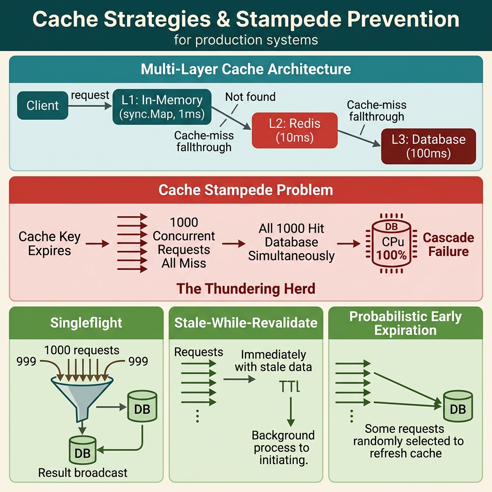

<!-- tags: best-practice, production, cache, distributed-systems, redis -->
# 🔥 Cache Strategies & Stampede — Khi 10 Triệu Request Đồng Loạt Miss Cache

> Cache stampede biến hệ thống 200K req/s thành 0 req/s trong 3 giây. Bài này giải phẫu 5 chiến lược caching, chỉ ra tử huyệt từng pattern, và kiến trúc phòng thủ multi-layer chống stampede cho production traffic.

📅 Ngày tạo: 2026-04-04 · 🔄 Cập nhật: 2026-04-04 · ⏱️ 18 phút đọc

| Aspect           | Detail                                                                      |
| ---------------- | --------------------------------------------------------------------------- |
| **Incident**     | Cache key hot product expire → 10M requests đồng loạt query DB → DB CPU 100% → cascade failure |
| **Root cause**   | TTL expire đồng thời trên hot key + không có mutex/early refresh            |
| **Fix**          | Cache-Aside + Singleflight + Probabilistic Early Refresh + Write-Behind buffer |
| **Go packages**  | `github.com/redis/go-redis/v9`, `golang.org/x/sync/singleflight`, `sync`, `time` |

---

## 1. DEFINE

Hot key TTL hết hạn lúc 22:00:00. 60,000 goroutines đồng loạt cache miss. Tất cả query cùng 1 row trong DB. PostgreSQL CPU: 100%. Connection pool: exhausted. Response time: từ 3ms lên timeout. Cascade: cache miss → DB overload → timeout → more cache miss → DB crash. 3 giây từ "hệ thống bình thường" đến "toàn bộ platform down". Cache không chỉ là optimization — nó là single point of failure.

### 📖 Câu chuyện: "Đêm TTL hết hạn"

**Thứ Sáu, 21:58.** Team backend vừa deploy xong feature mới. Cache đang warm, traffic 150K req/s chạy êm. Dashboard xanh lè. Mọi người chuẩn bị nghỉ cuối tuần.

**22:00:00** — TTL của 3 hot product keys expire đồng thời. Cả 3 key này serve 40% total traffic.

Đây là luồng xử lý lúc đó:

```
Request → Check cache → MISS → Query DB → Set cache → Return
```

Trông bình thường? Đúng — khi chỉ 1 request miss. Nhưng khi 10 triệu request miss cùng lúc trên cùng 1 key, tất cả đều chạy `SELECT * FROM products WHERE id = 'HOT-001'` — cùng lúc.

**22:00:03** — DB CPU nhảy từ 15% lên 100%. Connection pool exhausted. P99 latency từ 5ms lên 30 giây. PagerDuty nổ.

**22:00:15** — Cascading failure: các service khác gọi product API → timeout → retry → gấp đôi load. Circuit breaker chưa kịp mở.

**22:00:45** — On-call engineer tay run bấm `redis-cli SET stock:HOT-001 '...' EX 3600`. Hotfix bằng tay. Traffic hồi lại sau 20 giây.

**22:01:30** — CTO vào Slack: "Tại sao 30 giây downtime vào prime time?"

Hotfix bằng tay chỉ là bandaid — vì TTL sẽ lại expire, và stampede sẽ lại xảy ra.

---

### 🔍 Khám nghiệm tử thi (Root Cause Analysis)

```text
TRƯỚC (Naive Cache-Aside):

  10,000,000 requests ──▶ Cache MISS ──▶ ALL query DB
                                          │
                                          ▼
                              ┌──────────────────┐
                              │   PostgreSQL      │
                              │   max_conn: 200   │
                              │                   │
                              │   10M queries     │
                              │   waiting for     │
                              │   200 connections  │
                              │                   │
                              │   CPU: 100% 🔴    │
                              │   Conn pool: FULL │
                              └──────────────────┘
```

**Tại sao cache stampede là tử huyệt?**

| Đặc điểm | Giải thích |
| --- | --- |
| **Thundering herd** | N request miss cùng lúc → N identical queries đến DB |
| **Connection exhaustion** | DB max 200 connections, nhưng 10,000+ goroutines cùng cần 1 connection |
| **Cascading effect** | Service A timeout → retry → double load → Service B cũng timeout |
| **Self-reinforcing** | Cache không được set vì DB quá chậm → miss tiếp → vòng lặp chết |

**Toán nhanh**: Hot key serve 40% traffic = 60,000 req/s. TTL expire → tất cả miss. DB xử lý 1 query ~5ms → throughput = 200 conn / 5ms = 40,000 req/s max. Nhưng 60,000 req/s đến cùng lúc → 20,000 req/s bị queue → timeout 5s → retry → 120,000 req/s. **DB chết chắc trong 3 giây.**

---

### 5 Chiến lược Caching — Chọn sai = production incident

Trước khi đi vào solution, cần hiểu rõ 5 chiến lược caching — mỗi chiến lược có trade-off riêng và failure mode riêng.

#### ① Distributed Caching (Tổng quan)

```text
  Browser/Client ──▶ Application Server ──▶ Source-of-Truth DB
                           │
                           ▼
                  ┌──────────────────┐
                  │ Distributed      │
                  │ Cache Cluster    │
                  │ ┌────┐ ┌────┐   │
                  │ │Node│ │Node│   │
                  │ │ 1  │ │ 2  │   │
                  │ └────┘ └────┘   │
                  │ ┌────┐ ┌────┐   │
                  │ │Node│ │Node│   │
                  │ │ 3  │ │ 4  │   │
                  │ └────┘ └────┘   │
                  └──────────────────┘
```

*Cache cluster phân tán giữa app và DB — giảm load DB, tăng throughput, nhưng tạo ra bài toán consistency.*

Distributed caching không phải 1 pattern cụ thể — nó là **cơ sở hạ tầng**. Pattern cụ thể nằm ở cách app đọc/ghi cache: Cache-Aside, Write-Through, hay Write-Back.

#### ② Write-Through Caching

```text
  Application Server ──①──▶ Cache ──②──▶ Database
                      write       write immediately
```

*App ghi cache trước, cache đồng bộ ghi DB ngay lập tức. Consistency cao, nhưng write latency tăng gấp đôi.*

| Ưu điểm | Nhược điểm |
| --- | --- |
| Cache luôn đồng bộ với DB | Write latency = cache_write + db_write |
| Đọc sau ghi luôn đúng | Mọi write đi qua cache — kể cả data ít đọc |
| Đơn giản cho read-heavy | Cache trở thành single point of failure cho writes |

**Khi nào dùng**: Hệ thống cần strong consistency cho reads-after-writes, write volume thấp-trung bình, chấp nhận write latency cao hơn.

#### ③ Cache-Aside (Lazy Loading)

```text
  READ PATH (Cache Miss):               WRITE PATH:
  ┌─────────┐  ①get k   ┌───────┐      ┌─────────┐  ①delete  ┌───────┐
  │Webserver│───────────▶│ Cache │      │Webserver│──────────▶│ Cache │
  │         │  MISS      │       │      │         │           │       │
  │         │◀───────────│       │      │         │  ②update  │       │
  │         │  ②fetch    │       │      │         │──────────▶│  DB   │
  │         │───────────▶│  DB   │      └─────────┘           └───────┘
  │         │◀───────────│       │
  │         │  ③set(k,v) │       │
  │         │───────────▶│ Cache │
  └─────────┘            └───────┘
```

*Pattern phổ biến nhất. App tự quản lý cache. Read miss → fetch DB → set cache. Write → delete cache → update DB.*

| Ưu điểm | Nhược điểm |
| --- | --- |
| Chỉ cache data thực sự được đọc | Cache miss đầu tiên luôn chậm (cold start) |
| App kiểm soát hoàn toàn logic | **Stampede khi hot key expire** ← tử huyệt |
| Dễ implement, dễ debug | Race condition giữa delete và set |

**Khi nào dùng**: Hầu hết mọi trường hợp. Đây là default strategy — nhưng cần thêm singleflight hoặc mutex để chống stampede.

#### ④ Write-Back (Write-Behind) Caching

```text
  Application Server ──①──▶ Cache ──②──▶ Database
                      write       write in BATCHES
                                  (async, delayed)
```

*App ghi cache, cache ghi DB theo batch — asynchronous. Write cực nhanh, nhưng risk mất data nếu cache crash trước khi flush.*

| Ưu điểm | Nhược điểm |
| --- | --- |
| Write latency cực thấp (chỉ ghi cache) | **Data loss nếu cache crash trước flush** |
| Batch writes giảm DB I/O | Consistency lag giữa cache và DB |
| Absorb write spikes | Phức tạp: cần Write-Ahead Log cho durability |

**Khi nào dùng**: Write-heavy workloads (analytics, counters, view counts), chấp nhận eventual consistency, có WAL hoặc persistent cache.

#### ⑤ Cache Consistency Issue — Race Condition

```text
  Timeline:
  ─────────────────────────────────────────────────────▶

  Web Server 1                Cache              Database
       │                        │                    │
       │───── Cache Get ───────▶│                    │
       │◀──── MISS ─────────────│                    │
       │───── DB Read ──────────────────────────────▶│
       │                        │                    │
       │    ┌── Web Server 2 ───│── DB Write ───────▶│  ← Server 2 updates DB
       │    │                   │◀── Cache Write ────│  ← Server 2 cập nhật cache
       │    └───────────────────│                    │     với data MỚI
       │                        │                    │
       │◀──── DB Record (OLD) ──────────────────────│  ← Server 1 nhận data CŨ
       │───── Cache Refill ────▶│                    │  ← Server 1 ghi data CŨ
       │      STALE DATA! 🔴    │                    │     đè lên data MỚI!
```

*Race condition kinh điển: Server 1 refill cache với stale data SAU KHI Server 2 đã cập nhật. Cache giờ chứa data cũ cho đến khi TTL expire.*

**Đây chính là lý do Cache-Aside dùng DELETE trên write path thay vì SET** — nhưng ngay cả DELETE cũng có race window.

---

### So sánh: 5 Strategies

| Strategy | Read Latency | Write Latency | Consistency | Stampede Risk | Data Loss Risk |
| --- | --- | --- | --- | --- | --- |
| **Cache-Aside** | Miss=slow, Hit=fast | N/A (app manages) | Eventual | 🔴 High | None |
| **Write-Through** | Always fast | 2x (cache+DB) | Strong | 🟡 Medium | None |
| **Write-Back** | Always fast | 1x (cache only) | Eventual | 🟡 Medium | 🔴 High |
| **Read-Through** | Miss=slow, Hit=fast | N/A | Eventual | 🟡 Medium | None |
| **Refresh-Ahead** | Always fast | N/A | Eventual | 🟢 Low | None |

### Actors & Roles

| Component | Role | Đặc điểm |
| --- | --- | --- |
| **Redis Cluster** | Distributed Cache | Single-threaded per shard, atomic ops, sub-ms latency |
| **Singleflight** | Stampede Guard | Dedup concurrent requests cho cùng 1 key |
| **TTL + Jitter** | Expiry Spread | Tránh mass expire đồng thời |
| **Write-Behind Buffer** | Async Batch Writer | Absorb write spike, flush DB theo schedule |
| **PostgreSQL** | Source of Truth | ACID, final consistency guarantee |

### Invariants (Bất biến)

1. `cache_value == db_value` — Eventually consistent, max staleness = TTL
2. `stampede_multiplier <= 1` — Mỗi cache miss chỉ trigger tối đa 1 DB query (singleflight)
3. `write_order_preserved` — Write-Through/Write-Back giữ đúng thứ tự ghi
4. `ttl > 0` — Mọi cache key đều có TTL, không cache vĩnh viễn

### Failure Modes

| Failure | Hậu quả | Mitigation |
| --- | --- | --- |
| Redis crash | Cache cold start → stampede | Singleflight + circuit breaker to DB |
| TTL mass expire | Thundering herd | Jitter: `TTL + rand(0, TTL*0.1)` |
| Write-Back flush fail | Data loss uncommitted writes | Persistent queue + WAL |
| Cache-DB race | Stale data served | Delete-on-write + short TTL |
| Hot key bottleneck | Single Redis shard overload | Local cache L1 + key sharding |
| Network partition | App can't reach cache | Fallback to DB + circuit breaker |

Các failure mode trên nghe quen thuộc — nhưng có trap thật sự đau: cache stampede khi hot key expire = 10M requests đồng loạt đánh DB, và write-back buffer crash = data loss không recover được. Trap đó sẽ xuất hiện ở PITFALLS.

---

Cache stampede nghe như edge case cho đến khi nó xảy ra. Diagram dưới đây trace đúng cascade từ TTL expire → concurrent miss → DB overload → total failure.

## 2. VISUAL

Khái niệm 5 strategies nghe hợp lý trên giấy, nhưng chỉ khi nhìn request chảy qua từng lớp bạn mới thấy vì sao stampede xảy ra và singleflight cứu được. Sơ đồ dưới đây bóc tách đúng luồng đó.



### Kiến trúc tổng quan — Multi-Layer Cache Defense

```text
                        ┌─────────────────────────────────────────────┐
                        │              CLIENT (Browser/App)           │
                        └─────────────────┬───────────────────────────┘
                                          │ GET /api/products/HOT-001
                                          ▼
                   ┌──────────────────────────────────────────────┐
                   │              API GATEWAY / LB                │
                   │         (Rate limit, Auth, Routing)          │
                   └──────────────────┬───────────────────────────┘
                                      │
                                      ▼
┌─────────────────────────────────────────────────────────────────────┐
│                    TẦNG 1: LOCAL CACHE (L1)                         │
│                                                                     │
│  ┌──────────────────────────────────────────────────────────────┐   │
│  │  sync.Map / freecache / ristretto                            │   │
│  │  TTL: 1-5 giây (short-lived, per-instance)                   │   │
│  │  Throughput: unlimited (in-process, zero network)            │   │
│  │  ✅ HIT → Return ngay, không cần network call               │   │
│  │  ❌ MISS → Xuống Tầng 2                                     │   │
│  └──────────────────────────────────────────────────────────────┘   │
└──────────────────────────────┬──────────────────────────────────────┘
                               │ MISS
                               ▼
┌─────────────────────────────────────────────────────────────────────┐
│                    TẦNG 2: DISTRIBUTED CACHE (L2) — Redis          │
│                                                                     │
│  ┌──────────────────────────────────────────────────────────────┐   │
│  │  Redis Cluster (6 nodes, 3 masters + 3 replicas)             │   │
│  │  TTL: 5 phút + jitter (±30s)                                │   │
│  │  Throughput: 200K ops/s per shard                            │   │
│  │                                                              │   │
│  │  ✅ HIT → Return + refresh L1                               │   │
│  │  ❌ MISS → Singleflight gate (Tầng 3)                      │   │
│  └──────────────────────────────────────────────────────────────┘   │
└──────────────────────────────┬──────────────────────────────────────┘
                               │ MISS (qua singleflight gate)
                               ▼
┌─────────────────────────────────────────────────────────────────────┐
│            TẦNG 3: SINGLEFLIGHT → DATABASE                         │
│                                                                     │
│  ┌───────────────────┐    ┌────────────────────────────────────┐   │
│  │  singleflight.Do  │───▶│  PostgreSQL                        │   │
│  │                   │    │  SELECT * FROM products             │   │
│  │  10,000 requests  │    │  WHERE id = 'HOT-001'              │   │
│  │  → 1 DB query     │    │                                    │   │
│  │  → 9,999 wait     │    │  Result → set L2 + set L1         │   │
│  └───────────────────┘    └────────────────────────────────────┘   │
│                                                                     │
│  Stampede multiplier: 10,000:1 → 1:1 ✅                           │
└─────────────────────────────────────────────────────────────────────┘
```

*Multi-layer defense: L1 chặn 80% traffic (in-process), L2 chặn 19% (Redis), singleflight đảm bảo chỉ 1 DB query per key.*

### Timeline — Stampede Before vs After

```text
TRƯỚC (Naive Cache-Aside):
22:00:00 ─────|████████████████████████| Cache: 3 hot keys EXPIRE
22:00:01 ─────|████████████████████████| DB: 60K queries/s hitting
22:00:02 ─────|▓▓▓▓▓▓▓▓▓▓▓▓▓▓▓▓▓▓▓▓▓▓| Connections: 200/200 FULL
22:00:03 ───── DB CPU 100% 🔴 SYSTEM DOWN ❌
22:00:45 ───── Manual hotfix (redis-cli SET)
              Total downtime: ~45 giây

SAU (Singleflight + L1 + Jitter):
22:00:00 ─────|██░░░░░░░░░░░░░░░░░░░░| Cache: keys expire (jittered)
22:00:01 ─────|██░░░░░░░░░░░░░░░░░░░░| Singleflight: 3 DB queries total
22:00:01 ─────|████████████████████████| L1+L2 refilled, traffic served
              DB peak: 3 queries. Zero downtime ✅
```

*Singleflight biến 60,000 concurrent DB queries thành 3. Jitter spread TTL expire ra 60 giây thay vì cùng lúc.*

### Decision Lens — Chọn Strategy nào?

```text
                      ┌─────────────────────────┐
                      │ Workload pattern?        │
                      └────────┬────────────────┘
                               │
                    ┌──────────┴──────────┐
                    │                     │
              Read-heavy            Write-heavy
                    │                     │
                    ▼                     ▼
            ┌──────────────┐      ┌──────────────┐
            │ Cache-Aside  │      │ Write-Back   │
            │ + Singleflight│      │ (batch flush)│
            │ (default)     │      │              │
            └──────┬───────┘      └──────┬───────┘
                   │                     │
            Need strong              Need durability?
            read-after-write?             │
                   │               ┌─────┴─────┐
                   ▼               │           │
            ┌──────────────┐    Yes          No
            │Write-Through │      │           │
            │ (sync write) │      ▼           ▼
            └──────────────┘  WAL +       Accept
                              Persistent  data loss
                              Queue       risk
```

*Hầu hết production systems dùng Cache-Aside + Singleflight. Write-Through chỉ khi cần strong read-after-write. Write-Back chỉ khi write-heavy + chấp nhận risk.*

---

Cascade đã rõ. Bây giờ ta implement defense: từ basic cache-aside đến singleflight, probabilistic early refresh, và multi-layer cache architecture.

## 3. CODE

Khi đường đi của request qua multi-layer cache đã rõ, code nên phản ánh đúng ranh giới trách nhiệm giữa L1, L2, singleflight, và DB. Ta bắt đầu từ anti-pattern rồi leo dần lên production-grade defense.

### Example 1: Basic — Naive Cache-Aside (Anti-pattern gây stampede)

Đây chính là code đã gây ra sự cố "Đêm TTL hết hạn". Nó trông "đúng" — và đúng thật khi traffic thấp. Nhưng khi hot key expire dưới high traffic, nó biến thành bom.

```go
package cache

import (
	"context"
	"database/sql"
	"encoding/json"
	"fmt"
	"time"

	"github.com/redis/go-redis/v9"
)

// ❌ ANTI-PATTERN: Naive Cache-Aside — không có stampede protection
// Mỗi cache miss = 1 DB query. 10,000 miss cùng lúc = 10,000 DB queries.
type NaiveProductCache struct {
	redis *redis.Client
	db    *sql.DB
	ttl   time.Duration
}

func NewNaiveProductCache(rdb *redis.Client, db *sql.DB) *NaiveProductCache {
	return &NaiveProductCache{
		redis: rdb,
		db:    db,
		ttl:   5 * time.Minute, // ⚠️ Fixed TTL — mọi key expire cùng lúc!
	}
}

func (c *NaiveProductCache) GetProduct(ctx context.Context, id string) (*Product, error) {
	cacheKey := fmt.Sprintf("product:%s", id)

	// ① Check Redis
	val, err := c.redis.Get(ctx, cacheKey).Result()
	if err == nil {
		var p Product
		json.Unmarshal([]byte(val), &p)
		return &p, nil
	}

	// ② Cache MISS → Query DB
	// ⚠️ TỬ HUYỆT: 10,000 goroutines chạy đoạn này CÙNG LÚC
	// Mỗi goroutine execute cùng 1 SELECT query → DB connection pool exhausted
	p, err := c.fetchFromDB(ctx, id)
	if err != nil {
		return nil, err
	}

	// ③ Set cache
	// ⚠️ 10,000 goroutines cũng SET cùng 1 key → waste
	data, _ := json.Marshal(p)
	c.redis.Set(ctx, cacheKey, data, c.ttl)

	return p, nil
}

func (c *NaiveProductCache) fetchFromDB(ctx context.Context, id string) (*Product, error) {
	var p Product
	err := c.db.QueryRowContext(ctx,
		"SELECT id, name, price, stock FROM products WHERE id = $1", id,
	).Scan(&p.ID, &p.Name, &p.Price, &p.Stock)
	if err != nil {
		return nil, fmt.Errorf("db query: %w", err)
	}
	return &p, nil
}

type Product struct {
	ID    string  `json:"id"`
	Name  string  `json:"name"`
	Price float64 `json:"price"`
	Stock int     `json:"stock"`
}
```

> **Tại sao fail?** Không phải vì code sai — mà vì code không có **admission control**. Khi cache miss, mọi goroutine đều được phép query DB. Với hot key serve 60K req/s, TTL expire = 60K `SELECT` queries cùng giây. DB max 200 connections → 59,800 goroutines block waiting → timeout → retry → death spiral.

---

Anti-pattern đã lộ tử huyệt: không có admission control khi cache miss. Singleflight là lớp phòng thủ đầu tiên — nó biến N concurrent DB queries thành 1.

### Example 2: Intermediate — Singleflight Cache-Aside (Chống stampede)

```go
package cache

import (
	"context"
	"database/sql"
	"encoding/json"
	"fmt"
	"math/rand"
	"time"

	"github.com/redis/go-redis/v9"
	"golang.org/x/sync/singleflight"
)

// ✅ Singleflight Cache-Aside — chống stampede
// N requests cùng key → chỉ 1 DB query, N-1 chờ kết quả
type SafeProductCache struct {
	redis *redis.Client
	db    *sql.DB
	sf    singleflight.Group
	ttl   time.Duration
}

func NewSafeProductCache(rdb *redis.Client, db *sql.DB) *SafeProductCache {
	return &SafeProductCache{
		redis: rdb,
		db:    db,
		ttl:   5 * time.Minute,
	}
}

func (c *SafeProductCache) GetProduct(ctx context.Context, id string) (*Product, error) {
	cacheKey := fmt.Sprintf("product:%s", id)

	// ① Check Redis (fast path)
	val, err := c.redis.Get(ctx, cacheKey).Result()
	if err == nil {
		var p Product
		json.Unmarshal([]byte(val), &p)
		return &p, nil
	}

	// ② Cache MISS → Singleflight gate
	// ✅ 10,000 goroutines gọi cùng key → chỉ 1 chạy fetchFromDB
	// 9,999 goroutines chờ và nhận kết quả từ goroutine duy nhất đó
	result, err, _ := c.sf.Do(cacheKey, func() (interface{}, error) {
		// Double-check: có thể goroutine khác đã set cache rồi
		val, err := c.redis.Get(ctx, cacheKey).Result()
		if err == nil {
			var p Product
			json.Unmarshal([]byte(val), &p)
			return &p, nil
		}

		// Query DB — chỉ 1 goroutine chạy đoạn này
		p, err := c.fetchFromDB(ctx, id)
		if err != nil {
			return nil, err
		}

		// Set cache với jittered TTL
		// ✅ Jitter tránh mass expire: TTL + random(0, 10% TTL)
		jitter := time.Duration(rand.Int63n(int64(c.ttl / 10)))
		data, _ := json.Marshal(p)
		c.redis.Set(ctx, cacheKey, data, c.ttl+jitter)

		return p, nil
	})

	if err != nil {
		return nil, err
	}
	return result.(*Product), nil
}

func (c *SafeProductCache) fetchFromDB(ctx context.Context, id string) (*Product, error) {
	var p Product
	err := c.db.QueryRowContext(ctx,
		"SELECT id, name, price, stock FROM products WHERE id = $1", id,
	).Scan(&p.ID, &p.Name, &p.Price, &p.Stock)
	if err != nil {
		return nil, fmt.Errorf("db query: %w", err)
	}
	return &p, nil
}
```

> **Tại sao?** `singleflight.Do` là cơ chế **request coalescing** — nó duy trì 1 map of in-flight requests. Khi goroutine A gọi `Do("product:HOT-001", fn)`, goroutine B gọi cùng key sẽ **block và chờ** goroutine A trả về. Kết quả: 10,000 requests → 1 DB query → 1 cache set → 9,999 goroutines nhận shared result. Stampede multiplier từ 10,000:1 xuống 1:1.
>
> Jitter (`TTL + rand(0, 10%TTL)`) đảm bảo các key không expire cùng thời điểm — spread ra cửa sổ 30 giây thay vì cùng millisecond.

**Kết luận**: Singleflight + jitter TTL là 80% solution cho stampede. Nhưng với ultra-hot keys (100K+ req/s), Redis call vẫn là bottleneck — cần L1 local cache.

---

Singleflight đã chống stampede ở DB layer. Nhưng mỗi request vẫn gọi Redis qua network — L1 local cache loại bỏ network hop cho hot data.

### Example 3: Advanced — Multi-Layer Cache (L1 Local + L2 Redis + Singleflight)

```go
package cache

import (
	"context"
	"database/sql"
	"encoding/json"
	"fmt"
	"math/rand"
	"sync"
	"time"

	"github.com/redis/go-redis/v9"
	"golang.org/x/sync/singleflight"
)

// ✅ Multi-Layer: L1 (in-process) → L2 (Redis) → Singleflight → DB
type MultiLayerCache struct {
	l1    *L1Cache          // In-process cache, zero network
	redis *redis.Client     // L2 distributed cache
	db    *sql.DB           // Source of truth
	sf    singleflight.Group
	l2TTL time.Duration
}

// ── L1: In-process cache với TTL ngắn ──
type L1Cache struct {
	mu    sync.RWMutex
	items map[string]*l1Entry
	ttl   time.Duration
}

type l1Entry struct {
	data      []byte
	expiresAt time.Time
}

func NewL1Cache(ttl time.Duration) *L1Cache {
	c := &L1Cache{
		items: make(map[string]*l1Entry),
		ttl:   ttl,
	}
	// ✅ Background cleanup — tránh memory leak
	go c.cleanup()
	return c
}

func (c *L1Cache) Get(key string) ([]byte, bool) {
	c.mu.RLock()
	defer c.mu.RUnlock()
	entry, ok := c.items[key]
	if !ok || time.Now().After(entry.expiresAt) {
		return nil, false
	}
	return entry.data, true
}

func (c *L1Cache) Set(key string, data []byte) {
	c.mu.Lock()
	defer c.mu.Unlock()
	c.items[key] = &l1Entry{
		data:      data,
		expiresAt: time.Now().Add(c.ttl),
	}
}

func (c *L1Cache) cleanup() {
	ticker := time.NewTicker(30 * time.Second)
	defer ticker.Stop()
	for range ticker.C {
		c.mu.Lock()
		now := time.Now()
		for k, v := range c.items {
			if now.After(v.expiresAt) {
				delete(c.items, k)
			}
		}
		c.mu.Unlock()
	}
}

// ── Multi-Layer Cache ──

func NewMultiLayerCache(rdb *redis.Client, db *sql.DB) *MultiLayerCache {
	return &MultiLayerCache{
		l1:    NewL1Cache(2 * time.Second), // L1: 2s TTL — rất ngắn, giảm staleness
		redis: rdb,
		db:    db,
		l2TTL: 5 * time.Minute,
	}
}

func (c *MultiLayerCache) GetProduct(ctx context.Context, id string) (*Product, error) {
	cacheKey := fmt.Sprintf("product:%s", id)

	// ① L1: In-process check (zero network, sub-microsecond)
	// ✅ Hot key serve 80%+ traffic từ đây — không cần network call
	if data, ok := c.l1.Get(cacheKey); ok {
		var p Product
		json.Unmarshal(data, &p)
		return &p, nil
	}

	// ② L2: Redis check (< 1ms network)
	val, err := c.redis.Get(ctx, cacheKey).Result()
	if err == nil {
		var p Product
		json.Unmarshal([]byte(val), &p)
		// ✅ Refresh L1 khi L2 hit — tiếp tục serve từ L1 cho requests tiếp
		c.l1.Set(cacheKey, []byte(val))
		return &p, nil
	}

	// ③ Singleflight → DB (chống stampede)
	result, err, _ := c.sf.Do(cacheKey, func() (interface{}, error) {
		// Double-check L2 (goroutine khác có thể đã set)
		val, err := c.redis.Get(ctx, cacheKey).Result()
		if err == nil {
			var p Product
			json.Unmarshal([]byte(val), &p)
			return &p, nil
		}

		p, err := c.fetchFromDB(ctx, id)
		if err != nil {
			return nil, err
		}

		// Set L2 với jitter
		data, _ := json.Marshal(p)
		jitter := time.Duration(rand.Int63n(int64(c.l2TTL / 10)))
		c.redis.Set(ctx, cacheKey, data, c.l2TTL+jitter)

		// Set L1
		c.l1.Set(cacheKey, data)

		return p, nil
	})

	if err != nil {
		return nil, err
	}
	return result.(*Product), nil
}

// InvalidateProduct — Cache-Aside write path: delete cache, update DB separately
func (c *MultiLayerCache) InvalidateProduct(ctx context.Context, id string) error {
	cacheKey := fmt.Sprintf("product:%s", id)
	// ✅ Delete cả L1 và L2 — invalidate trước khi DB write
	c.l1.Set(cacheKey, nil) // Effectively invalidate
	return c.redis.Del(ctx, cacheKey).Err()
}

func (c *MultiLayerCache) fetchFromDB(ctx context.Context, id string) (*Product, error) {
	var p Product
	err := c.db.QueryRowContext(ctx,
		"SELECT id, name, price, stock FROM products WHERE id = $1", id,
	).Scan(&p.ID, &p.Name, &p.Price, &p.Stock)
	if err != nil {
		return nil, fmt.Errorf("db query: %w", err)
	}
	return &p, nil
}
```

> **Tại sao?** L1 local cache loại bỏ network hop cho hot data. Với TTL 2 giây, staleness tối đa 2s — chấp nhận được cho product display. Traffic pattern: 80% serve từ L1 (zero cost), 19% từ L2 (1ms Redis call), 1% qua singleflight đến DB (5ms). Kết quả: DB chỉ nhận ~1% traffic thay vì 100%.
>
> `InvalidateProduct` dùng **delete** thay vì set — đây là Cache-Aside canonical pattern để tránh race condition (như diagram ⑤ Cache Consistency Issue).

**Kết luận**: Multi-layer + singleflight cho stampede-proof cache. Nhưng L1 giữa các pods không sync — cần pub/sub invalidation cho consistency nếu cần.

---

Multi-layer đã cover read path. Nhưng write-heavy workloads (counters, analytics) cần Write-Behind buffer — và Probabilistic Early Refresh tránh TTL expire surprise.

### Example 4: Expert — Write-Behind Buffer + Probabilistic Early Refresh

```go
package cache

import (
	"context"
	"database/sql"
	"encoding/json"
	"fmt"
	"math"
	"math/rand"
	"sync"
	"time"

	"github.com/redis/go-redis/v9"
)

// ✅ Expert: Write-Behind buffer cho write-heavy + Early Refresh cho read-heavy
type ExpertCache struct {
	redis       *redis.Client
	db          *sql.DB
	writeBuf    *WriteBehindBuffer
	earlyRefreshDelta float64 // 0.1 = refresh khi còn 10% TTL
}

// ── Write-Behind Buffer ──
// Gom writes vào batch, flush DB theo interval — giảm DB I/O 100x
type WriteBehindBuffer struct {
	mu        sync.Mutex
	pending   map[string]*WriteEntry
	flushInterval time.Duration
	db        *sql.DB
}

type WriteEntry struct {
	Key       string
	Value     interface{}
	UpdatedAt time.Time
}

func NewWriteBehindBuffer(db *sql.DB, interval time.Duration) *WriteBehindBuffer {
	wb := &WriteBehindBuffer{
		pending:       make(map[string]*WriteEntry),
		flushInterval: interval,
		db:            db,
	}
	go wb.flushLoop()
	return wb
}

func (wb *WriteBehindBuffer) Enqueue(key string, value interface{}) {
	wb.mu.Lock()
	defer wb.mu.Unlock()
	// ✅ Last-write-wins: nếu key đã pending, overwrite
	wb.pending[key] = &WriteEntry{
		Key:       key,
		Value:     value,
		UpdatedAt: time.Now(),
	}
}

func (wb *WriteBehindBuffer) flushLoop() {
	ticker := time.NewTicker(wb.flushInterval)
	defer ticker.Stop()

	for range ticker.C {
		wb.flush()
	}
}

func (wb *WriteBehindBuffer) flush() {
	wb.mu.Lock()
	if len(wb.pending) == 0 {
		wb.mu.Unlock()
		return
	}
	// ✅ Swap buffer — giải phóng lock nhanh nhất có thể
	batch := wb.pending
	wb.pending = make(map[string]*WriteEntry)
	wb.mu.Unlock()

	// Batch write to DB
	// ✅ 1000 individual writes → 1 batch INSERT/UPDATE
	for _, entry := range batch {
		// TODO: thay bằng batch INSERT ... ON CONFLICT UPDATE
		wb.writeToDB(entry)
	}
}

func (wb *WriteBehindBuffer) writeToDB(entry *WriteEntry) {
	// Production: dùng batch INSERT + ON CONFLICT
	ctx, cancel := context.WithTimeout(context.Background(), 5*time.Second)
	defer cancel()

	data, _ := json.Marshal(entry.Value)
	_, _ = wb.db.ExecContext(ctx,
		`INSERT INTO cache_writes (key, value, updated_at) 
		 VALUES ($1, $2, $3) 
		 ON CONFLICT (key) DO UPDATE SET value = $2, updated_at = $3`,
		entry.Key, data, entry.UpdatedAt,
	)
}

// ── Probabilistic Early Refresh ──
// Thay vì chờ TTL expire → stampede, refresh sớm với xác suất tăng dần

func (c *ExpertCache) GetWithEarlyRefresh(
	ctx context.Context, key string, fetchFn func() (interface{}, error),
	ttl time.Duration,
) (interface{}, error) {
	val, err := c.redis.Get(ctx, key).Result()
	if err != nil {
		// Cache miss — fetch và set
		result, err := fetchFn()
		if err != nil {
			return nil, err
		}
		data, _ := json.Marshal(result)
		c.redis.Set(ctx, key, data, ttl)
		return result, nil
	}

	// Cache hit — nhưng có nên refresh sớm?
	// ✅ XFetch algorithm: P(refresh) tăng exponentially khi gần expire
	remainingTTL, _ := c.redis.TTL(ctx, key).Result()
	if c.shouldEarlyRefresh(remainingTTL, ttl) {
		// ✅ Async refresh — không block request hiện tại
		go func() {
			result, err := fetchFn()
			if err != nil {
				return
			}
			data, _ := json.Marshal(result)
			c.redis.Set(ctx, key, data, ttl)
		}()
	}

	var result interface{}
	json.Unmarshal([]byte(val), &result)
	return result, nil
}

// shouldEarlyRefresh — XFetch probabilistic algorithm
// Xác suất refresh = delta * log(rand()) + (TTL - remaining)
// Khi remaining → 0, xác suất → 1
func (c *ExpertCache) shouldEarlyRefresh(remaining, totalTTL time.Duration) bool {
	if remaining <= 0 {
		return true
	}

	// ✅ Xác suất tăng exponentially khi gần hết TTL
	// delta = 10% totalTTL → bắt đầu có chance refresh khi còn 10% TTL
	delta := float64(totalTTL) * c.earlyRefreshDelta
	// -delta * ln(rand()) tạo exponential distribution
	gap := -delta * math.Log(rand.Float64())

	return float64(remaining) <= gap
}

// ── Increment counter — Write-Behind ──
func (c *ExpertCache) IncrementViewCount(ctx context.Context, productID string) error {
	key := fmt.Sprintf("views:%s", productID)

	// ① Increment Redis (fast, atomic)
	newCount, err := c.redis.Incr(ctx, key).Result()
	if err != nil {
		return err
	}

	// ② Enqueue DB write (async, batched)
	// ✅ 10,000 increments/s → 1 DB write mỗi 5 giây
	c.writeBuf.Enqueue(key, map[string]interface{}{
		"product_id": productID,
		"view_count": newCount,
	})

	return nil
}
```

> **Tại sao?** Write-Behind buffer gom 10,000 individual DB writes thành 1 batch mỗi 5 giây — giảm DB I/O 99.99%. Swap-buffer pattern (swap `pending` map với empty map) giữ lock time < 1μs.
>
> XFetch Probabilistic Early Refresh là cơ chế thông minh nhất chống stampede: thay vì TTL expire → N requests miss → stampede, thuật toán tăng dần xác suất refresh khi TTL gần hết. Với `delta = 10%`, khi key còn 30s/300s TTL, có ~18% chance mỗi request sẽ async refresh. Kết quả: key luôn được refresh trước khi expire — stampede không bao giờ xảy ra.

**Kết luận**: Multi-layer + Singleflight + Early Refresh + Write-Behind = production-grade cache architecture. Mỗi layer giải quyết 1 vấn đề cụ thể: L1 giảm network, singleflight chống stampede, early refresh tránh TTL surprise, write-behind giảm DB I/O.

---

## 4. PITFALLS

Bạn đã đi qua anti-pattern, singleflight, multi-layer, và early refresh. Bây giờ đến phần nguy hiểm nhất: những lỗi chỉ xuất hiện dưới production load — trap đã được setup từ đầu bài.

| # | Severity | Lỗi | Hậu quả | Fix |
| --- | --- | --- | --- | --- |
| 1 | 🔴 Fatal | Cache stampede — hot key expire + no singleflight | DB CPU 100% → cascade failure → toàn hệ thống down | `singleflight.Do` + jittered TTL |
| 2 | 🔴 Fatal | Write-Behind data loss — cache crash trước flush | Uncommitted writes mất vĩnh viễn | Persistent queue (Kafka) + WAL trước cache |
| 3 | 🟡 Common | Fixed TTL — tất cả keys expire cùng thời điểm | Mass expire → mini stampede | `TTL + rand(0, TTL*0.1)` jitter |
| 4 | 🟡 Common | Cache-Aside race — read refill stale data sau write | Stale data cho đến TTL expire | Delete-on-write + short TTL hoặc versioning |
| 5 | 🟡 Common | L1 desync giữa pods — invalidation không broadcast | Một pod serve stale, pod khác serve fresh | Redis Pub/Sub invalidation hoặc short L1 TTL |
| 6 | 🔵 Minor | Singleflight shared error — 1 failure → N requests fail | 10,000 requests đều nhận error | `singleflight.DoChan` với timeout + retry |
| 7 | 🔵 Minor | Cache warming thiếu — cold start sau deploy | First requests chậm (cache miss all) | Pre-warm script khi deploy |

### 🔴 Pitfall #1 — "Cache trống, DB chết"

22:00:00. TTL hết hạn. 3 hot keys biến mất cùng lúc.

Code không có singleflight: mỗi goroutine thấy cache miss → query DB → `SELECT * FROM products WHERE id = 'HOT-001'`. 60,000 goroutines cùng chạy dòng query đó trong cùng 1 giây.

```go
// ❌ Trông đúng — đúng khi traffic thấp
val, err := cache.Get(ctx, key)
if err != nil {
    // 60,000 goroutines chạy dòng này CÙNG LÚC
    result, err := db.Query(ctx, "SELECT ...")
    cache.Set(ctx, key, result, 5*time.Minute) // 60,000 SET — waste
}
```

DB có 200 connections. 60,000 goroutines xếp hàng. Mỗi query 5ms → throughput = 200/0.005 = 40,000 req/s. Nhưng 60,000 đến cùng lúc → 20,000 bị queue → timeout → retry → 120,000 req/s. **Death spiral.**

**Fix**: Wrap trong `singleflight.Do(key, fn)` — 60,000 → 1 DB query. Cache set 1 lần. 59,999 goroutines chờ và nhận shared result.

### 🔴 Pitfall #2 — "Write-Behind mất dữ liệu"

Bạn dùng Write-Behind buffer để gom 10,000 view count increments thành 1 batch write. Redis flush mỗi 5 giây. Tưởng tiết kiệm DB I/O.

Rồi Redis restart. 5 giây dữ liệu chưa flush → mất.

Với view counts, mất 5 giây data chấp nhận được. Nhưng nếu buffer đó chứa **payment status** hoặc **inventory updates** — mất dữ liệu = mất tiền thật.

**Fix**: Write-Behind chỉ cho data có thể mất (counters, analytics). Data quan trọng → Write-Through hoặc Write-Ahead Log trước khi ghi cache.

---

## 5. REF

Bạn đã đi qua Cache Strategies và cạm bẫy production. Các resources dưới đây giúp đi sâu hơn.

| Resource | Link |
| --- | --- |
| Go singleflight docs | [pkg.go.dev/golang.org/x/sync/singleflight](https://pkg.go.dev/golang.org/x/sync/singleflight) |
| XFetch — Optimal Probabilistic Cache Stampede Prevention | [vldb.org/pvldb/vol8/p886-vattani.pdf](https://vldb.org/pvldb/vol8/p886-vattani.pdf) |
| ByteByteGo — Caching Strategies | [blog.bytebytego.com](https://blog.bytebytego.com/) |
| Redis Best Practices | [redis.io/docs/management/optimization](https://redis.io/docs/management/optimization/) |
| Facebook Cache Consistency | [usenix.org/conference/osdi20/presentation/yang-ji](https://www.usenix.org/conference/osdi20/presentation/yang-ji) |
| Amazon DynamoDB DAX design | [docs.aws.amazon.com/amazondynamodb/latest/developerguide/DAX](https://docs.aws.amazon.com/amazondynamodb/latest/developerguide/DAX.html) |

---

## 6. RECOMMEND

Bạn vừa master 5 caching strategies và multi-layer stampede defense. Nhưng cache chỉ là một phần của data access story — khi traffic tăng lên, bạn sẽ gặp vấn đề khác: cache invalidation across microservices, distributed cache coherence, và CDC-based cache warming.

| Mở rộng | Khi nào | Lý do | File/Link |
| --- | --- | --- | --- |
| **Event-Driven Invalidation** | Multi-service cùng đọc cache | Pub/Sub broadcast invalidation thay vì TTL | → Architecture patterns |
| **CDC Cache Warming** | Cold start sau deploy | Debezium stream DB changes → pre-warm cache | → Kafka CDC pipeline |
| **Read Replica Routing** | Cache miss cần fast fallback | Route reads to replica thay vì primary | [07-read-replica-betrayal](./07-read-replica-betrayal.md) |
| **Circuit Breaker on Cache** | Redis cluster instability | Fallback to DB khi cache unreachable | [08-circuit-breaker-cascade](./08-circuit-breaker-cascade.md) |
| **Distributed Rate Limiting** | Protect DB from cache failures | Token bucket tại gateway layer | → API Gateway patterns |

---

## 7. QUICK REF

| # | Pattern | Code / Config |
| --- | --- | --- |
| 1 | Singleflight guard | `sf.Do(key, func() { fetchDB() })` |
| 2 | Jittered TTL | `TTL + rand(0, TTL*0.1)` |
| 3 | L1 local cache | `sync.Map` hoặc `ristretto` với TTL 2-5s |
| 4 | Cache-Aside write | `DELETE cache → UPDATE db` (không SET) |
| 5 | Write-Behind flush | `swap(pending, empty) → batch INSERT` |
| 6 | Early refresh | `P(refresh) = -δ * ln(rand()) > remaining` |
| 7 | Cache warmup | `redis-cli --pipe < warmup.rdb` khi deploy |
| 8 | Redis persistence | `appendonly yes` + `appendfsync everysec` |
---

**Callback**: Quay lại 60,000 goroutines cache miss lúc đầu. Bây giờ bạn biết: singleflight.Do chặn thundering herd, jittered TTL tránh mass expire, multi-layer cache (L1 + L2) giảm blast radius. Cache không phải "nice to have" ở high traffic — nó là infrastructure.

## 8. INTERVIEW ANGLE

**System design questions liên quan:**
- *"Design a caching layer for a high-traffic e-commerce product page"*
- *"How would you handle cache stampede at scale?"*
- *"Compare Write-Through vs Write-Back vs Cache-Aside — when to use which?"*
- *"How do you ensure cache consistency in a distributed system?"*

**Điểm interviewer muốn nghe:**

| Chủ đề | Talking point |
| --- | --- |
| **Stampede identification** | TTL expire + concurrent miss = thundering herd. Singleflight biến N:1 query thành 1:1 |
| **Multi-layer rationale** | L1 (sub-μs, 80% hit) → L2 Redis (sub-ms, 19%) → DB (5ms, 1%). Giảm load exponentially |
| **Consistency trade-off** | Cache-Aside = eventual consistency + delete-on-write. Staleness max = TTL. Accept cho reads, not for inventory |
| **Write strategy choice** | Read-heavy → Cache-Aside. Need read-after-write → Write-Through. Write-heavy counters → Write-Behind |
| **Numbers** | L1: unlimited ops, 0 latency. Redis: 200K ops/s, <1ms. Singleflight: 10,000:1 → 1:1 reduction |

**Follow-up questions thường gặp:**
- *"How do you handle cache invalidation across pods?"* → Redis Pub/Sub broadcast DELETE, hoặc short L1 TTL (2-5s) accept staleness
- *"What if Redis goes down?"* → Circuit breaker fallback to DB + singleflight vẫn protect DB
- *"How do you choose TTL values?"* → Based on data change frequency. Products: 5min. Stock: 10s. User session: 30min. Always add jitter
- *"Write-Behind data loss?"* → Only for lossy data (view counts). Critical data use Write-Through or WAL

---

## 10. DETECTION CHECKLIST

Khi nghi ngờ cache stampede hoặc cache-related issues, kiểm tra theo thứ tự:

| # | Dấu hiệu | Cách kiểm tra | Ý nghĩa |
| --- | --- | --- | --- |
| 1 | **DB CPU spike đột ngột** | `SELECT * FROM pg_stat_activity WHERE state = 'active'` | Nhiều queries giống nhau = stampede |
| 2 | **Redis keyspace miss rate tăng** | `redis-cli INFO stats \| grep keyspace_misses` | Miss/hit ratio > 0.1 = cache không hiệu quả |
| 3 | **Connection pool exhausted** | App metrics: `db.pool.active_connections` | = max_pool_size → stampede đang xảy ra |
| 4 | **Identical queries in slow log** | `pg_stat_statements` — check `calls` column for same `queryid` | Hàng nghìn calls/s cùng query = no singleflight |
| 5 | **Redis memory spike** | `redis-cli INFO memory` | Tăng đột ngột = có thể cache pollution |
| 6 | **TTL distribution clustered** | `redis-cli DEBUG OBJECT key` | Nhiều keys cùng TTL = mass expire risk |

---

