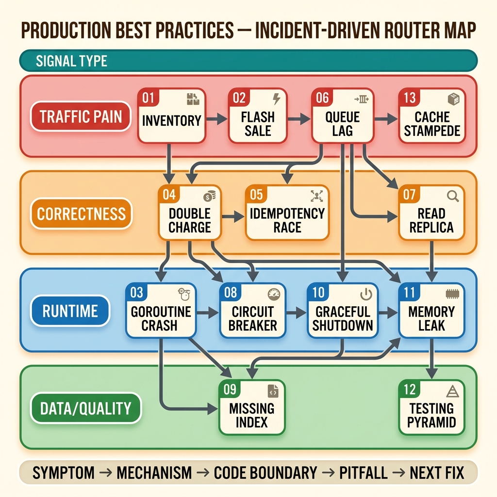

<!-- tags: best-practice, production, overview -->
# ✅ Production Best Practices — Incident-Driven Router

> `assets/best-practice` không nên được đọc như danh sách “12 bài hay”. Bộ này là một router theo production signal: sự cố nào đang xảy ra, invariant nào đang bị gãy, và bài nào sẽ cho bạn lane sửa đúng nhanh nhất.

📅 Ngày tạo: 2026-03-21 · 🔄 Cập nhật: 2026-04-04 · ⏱️ 12 phút đọc

| Aspect | Detail |
| ------ | ------ |
| **Scope** | 13 incident-driven production guides |
| **Use case** | Route từ symptom thực tế sang architectural fix, operational guardrail, và code boundary phù hợp |
| **Writing mode** | Problem-Centric với war-story voice |
| **Primary stack** | Go-first, nhưng pattern áp dụng được cho backend systems nói chung |

---

## 1. DEFINE

Một production guide chỉ thật sự đáng đọc khi nó bắt đầu từ cảm giác quen thuộc của người trực ca: pod vừa restart, checkout vừa nghẽn, replica vừa phản bội, queue lag đang leo, RAM đang phình mà chưa ai biết vì sao. Nếu mọi bài đều mở bằng định nghĩa trừu tượng, bạn sẽ không biết nên mở file nào khi sự cố thật xảy ra.

`assets/best-practice` được tổ chức như một incident router. Mỗi file bắt đầu từ một tín hiệu cụ thể, dựng lại nguyên nhân, rồi kéo người đọc qua diagram, code boundary, pitfalls, và handoff sang bài kế tiếp. Mục tiêu không phải là học “một pattern đẹp”, mà là hiểu production failure nào pattern đó đang ngăn chặn.

Core insight: **Best practice chỉ có giá trị khi nó trả lời được ba câu hỏi cùng lúc: sự cố nào đang diễn ra, invariant nào đang gãy, và boundary kỹ thuật nào phải được dựng lại để hệ thống đứng vững.**

### 1.1 Route theo signal

| Nếu bạn đang thấy... | Mở file | Vì sao |
|---|---|---|
| Oversell, stock âm, flash-sale nghẽn | [01 Inventory Stock Deduction](./01-inventory-stock-deduction.md) | Route vào 3-tier stock pipeline |
| Checkout sập đúng lúc event lớn | [02 Flash Sale Checkout Crash](./02-flash-sale-checkout-crash.md) | Post-mortem bottleneck + recovery lane |
| Service crash vì background goroutine/panic | [03 Goroutine Kills Production](./03-goroutine-kills-production.md) | Panic boundary + worker-pool discipline |
| Thanh toán bị trừ hai lần | [04 Fintech Double Charge](./04-fintech-double-charge.md) | Idempotency contract + payment state machine |
| Hai request cùng idempotency key vẫn xử lý đôi | [05 Idempotency Race Condition](./05-idempotency-race-condition.md) | Atomic claim để chặn TOCTOU |
| Queue lag tăng không kiểm soát | [06 Queue Consumer Lag](./06-queue-consumer-lag.md) | Throughput mismatch + backpressure |
| User vừa ghi xong nhưng đọc lại không thấy | [07 Read Replica Betrayal](./07-read-replica-betrayal.md) | Read-your-write và consistency routing |
| Một dependency lỗi kéo sập cả lane | [08 Circuit Breaker Cascade](./08-circuit-breaker-cascade.md) | Failure isolation + bulkhead |
| Query rất chậm trên bảng lớn | [09 Missing Composite Index](./09-missing-composite-index.md) | ESR rule + plan reading |
| Deploy làm rơi inflight request/job | [10 Graceful Shutdown](./10-graceful-shutdown.md) | Signal handling + drain order |
| RAM tăng chậm, lâu ngày mới nổ | [11 Memory Leak Silent](./11-memory-leak-silent.md) | Retention path + pprof mindset |
| Test suite nhiều nhưng confidence thấp | [12 The Testing Pyramid](./12-testing-pyramid.md) | Risk allocation across test layers |
| Cache miss spike, DB CPU 100% đột ngột | [13 Cache Strategies & Stampede](./13-cache-strategies-stampede.md) | Multi-layer cache defense + singleflight |

### 1.2 Nhận diện nhanh

- Nếu problem của bạn xuất phát từ một tín hiệu production cụ thể, hãy vào folder này trước; nếu bạn đang cần primitive thuật toán, concurrency, hay pattern nền, hãy handoff sang `assets/go`, `assets/dsa`, hoặc `assets/system-design` sau đó.
- Các bài ở đây được viết như post-mortem hoặc incident playbook, không như glossary hay theory notes.
- Mỗi file nên được đọc như một lane sửa sự cố: symptom -> mechanism -> code boundary -> pitfall -> next fix.

### 1.3 Invariants & Failure Modes

- Mỗi guide phải chỉ ra rõ invariant nào production đang đánh rơi: no-oversell, exactly-once, read-your-write, bounded concurrency, bounded memory, hay graceful drain.
- Nếu bài chỉ kể một incident mà không kéo được ra boundary kỹ thuật cần dựng lại, nó chưa đạt chuẩn của folder này.
- Failure mode phổ biến nhất khi đọc best-practice docs là nhớ “giải pháp” nhưng quên signal nhận diện, dẫn tới áp sai pattern cho sai sự cố.

## 2. VISUAL

Khi production đang cháy, router chỉ hữu ích nếu bạn nhìn được lane nào đang đứt. Bản đồ dưới đây không thay từng bài, nhưng cho bạn hai lớp định hướng: signal map và escalation path.



### Level 1 — Signal Map

```text
Traffic / hot path pain
  -> 01 Inventory Stock Deduction
  -> 02 Flash Sale Checkout Crash
  -> 06 Queue Consumer Lag
  -> 13 Cache Strategies & Stampede

Correctness / consistency pain
  -> 04 Fintech Double Charge
  -> 05 Idempotency Race Condition
  -> 07 Read Replica Betrayal

Runtime / resilience pain
  -> 03 Goroutine Kills Production
  -> 08 Circuit Breaker Cascade
  -> 10 Graceful Shutdown
  -> 11 Memory Leak Silent

Data / quality pain
  -> 09 Missing Composite Index
  -> 12 The Testing Pyramid
```

*Caption*: Level 1 cho bạn route đầu tiên theo symptom sản xuất; nếu signal nằm ở nhiều lane cùng lúc, hãy bắt đầu từ lane làm mất correctness hoặc availability trước.

### Level 2 — Escalation Path

```text
Correctness lane:
  04 Double Charge -> 05 Idempotency Race -> 01 Stock Deduction -> 07 Read Replica

Runtime lane:
  03 Goroutine Panic -> 10 Graceful Shutdown -> 11 Memory Leak -> 08 Circuit Breaker

Throughput lane:
  02 Flash Sale Crash -> 01 Stock Deduction -> 13 Cache Stampede -> 06 Queue Consumer Lag -> 09 Missing Index

Quality lane:
  12 Testing Pyramid -> tie back to every other guide as pre-production guardrail
```

*Caption*: Level 2 cho thấy các bài không đứng riêng lẻ; mỗi bài mở sang một failure lane lớn hơn để người đọc không dừng ở fix cục bộ.

## 3. CODE

Khi router đã chỉ đúng lane, phần thực chiến không phải là đọc tuần tự cả folder. Nó là chọn đúng guide, khóa đúng invariant, rồi dùng code examples như boundary mẫu cho incident mình đang xử lý.

### Workflow 1 — Route incident vào guide

```go
func RouteBestPractice(signal string) string {
    switch {
    case containsAny(signal, "oversell", "flash sale", "stock"):
        return "01-inventory-stock-deduction"
    case containsAny(signal, "duplicate payment", "double charge", "retry"):
        return "04-fintech-double-charge"
    case containsAny(signal, "same key race", "TOCTOU", "idempotency"):
        return "05-idempotency-race-condition"
    case containsAny(signal, "consumer lag", "queue backlog", "throughput mismatch"):
        return "06-queue-consumer-lag"
    case containsAny(signal, "panic", "goroutine crash", "background worker"):
        return "03-goroutine-kills-production"
    default:
        return "README -> scan signal map -> pick the broken invariant first"
    }
}
```

### Workflow 2 — Đọc một guide như playbook thay vì như bài blog

```text
1. Đọc DEFINE để xác nhận incident của bạn thật sự cùng họ với bài đang mở.
2. Xem VISUAL để khóa production path nào đang đứt hoặc đang nghẽn.
3. Chỉ vào CODE sau khi bạn nói được invariant nào bài đang cố giữ.
4. Đọc PITFALLS ngay sau CODE để tránh lặp lại anti-pattern dưới áp lực incident thật.
5. Dùng RECOMMEND để mở sang bài hàng xóm cùng lane nếu symptom không nằm ở một lớp duy nhất.
```

## 4. PITFALLS

Sai lầm lớn nhất với best-practice docs là biến chúng thành “bộ sưu tập giải pháp hay”. Khi đó người đọc nhớ tên pattern nhưng không biết lúc nào thật sự nên dùng. Đây là những drift đọc hiểu hay gặp nhất.

| # | Severity | Lỗi | Hậu quả | Fix |
|---|----------|-----|---------|-----|
| 1 | 🔴 High | Chọn bài theo tên pattern thay vì theo signal production | Áp sai giải pháp cho sai lớp sự cố | Route từ symptom và invariant bị gãy trước |
| 2 | 🔴 High | Học fix cục bộ mà bỏ qua boundary giữa các tầng | Fix một chỗ, hỏng chỗ khác | Luôn xác định tầng nào là gatekeeper, buffer, source of truth, hoặc fallback |
| 3 | 🟠 Medium | Đọc CODE trước khi hiểu incident mechanics | Copy được snippet nhưng không biết khi nào dùng | Bắt buộc khóa symptom + invariant ở DEFINE/VISUAL trước |
| 4 | 🟠 Medium | Xem mỗi bài như case độc lập | Không build được operational lane xuyên nhiều incident | Dùng RECOMMEND để nối đúng lane correctness/runtime/throughput |
| 5 | 🟡 Common | Đồng nhất “best practice” với “tool cụ thể” | Chuyển stack là mất luôn mental model | Giữ focus vào boundary và invariant, tool chỉ là implementation choice |

## 5. REF

- [The Tail at Scale — Dean & Barroso](https://research.google/pubs/the-tail-at-scale/)
- [Release It! — Michael T. Nygard](https://pragprog.com/titles/mnee2/release-it-second-edition/)
- [Designing Data-Intensive Applications](https://dataintensive.net/)
- [Go Memory Model](https://go.dev/ref/mem)
- [Kubernetes Pod Lifecycle](https://kubernetes.io/docs/concepts/workloads/pods/pod-lifecycle/)

## 6. RECOMMEND

Sau khi incident trong tay đã có shape rõ ràng, đừng dừng ở một bài đơn lẻ. Các handoff dưới đây là đường đi tự nhiên nhất để mở rộng từ fix cục bộ sang lane production hoàn chỉnh.

| Đi tiếp sang | Khi nào nên mở | Lý do |
|---|---|---|
| [Go docs](../go/README.md) | Bạn cần primitive runtime/concurrency sâu hơn để hiểu fix | Handoff từ incident sang primitive nền |
| [System design docs](../system-design/README.md) | Bạn muốn kéo fix cục bộ lên trade-off ở cấp hệ thống | Mở rộng từ component bug sang architectural choice |
| [SQL docs](../sql/README.md) | Incident nằm nặng ở query, index, transaction, hoặc consistency | Đi sâu vào storage/query layer |
| [Architecture docs](../architecture/README.md) | Bạn cần decision frame lâu dài sau khi đã chữa cháy | Chuyển từ incident response sang structural design |
