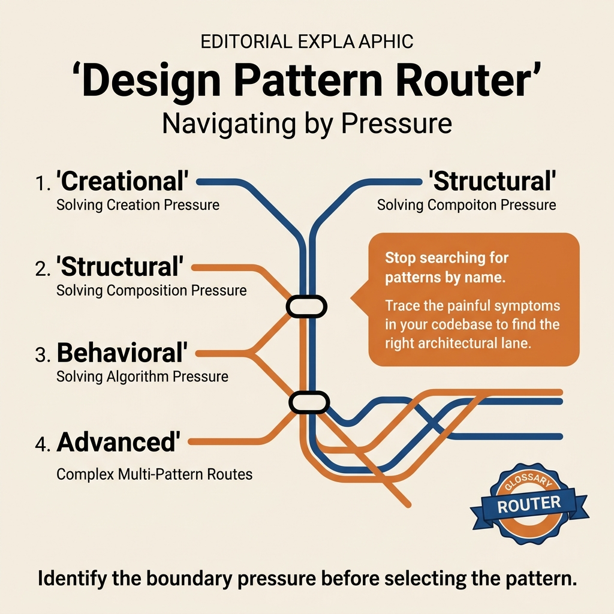

<!-- tags: design-pattern, oop, overview -->
# Design Patterns in Go

> A navigation hub for design patterns in Go. Do not memorize pattern names. Use this hub to choose the right design boundary before your codebase becomes a maze of objects and dependencies.

| Aspect | Detail |
| --- | --- |
| **Concept** | Router for object creation, structural assembly, and behavior coordination patterns in Go. |
| **Audience** | Backend engineers, reviewers, tech leads refactoring code towards interface and composition. |
| **Primary style** | Concept-First router |
| **Entry point** | Open this when your code struggles with creation, composition, or behavior, but you lack a specific pattern choice. |

📅 Created: 2026-03-19 · 🔄 Updated: 2026-04-05 · ⏱️ 8 min read

---

## 1. DEFINE

Imagine a refactor session where the team sees bad code smells. Each person names a different problem. One engineer wants a factory to reduce `new` calls. Another wants an observer for events. A third suggests a facade to simplify the API. You must isolate the exact problem. Identify if the pain lies in object creation, object assembly, or behavior coordination. Otherwise, design patterns become decorative labels for premature decisions.

This hub routes your design question before routing to a specific pattern. Go design patterns provide value through `interface + composition + explicit dependency boundary`. They do not exist to copy GoF class hierarchies into Go.

### 1.1 Signals & Boundaries

- If you struggle with choosing or initializing concrete types, open the `Creational` lane.
- If interfaces mismatch, or you must wrap behavior or simplify subsystems, open the `Structural` lane.
- If algorithms, events, state transitions, or orchestrations cause pain, open the `Behavioral` lane.
- If the system coordinates multiple patterns in a single use case, open `Advanced Patterns`.

### Coverage Map

| Lane | Question Answered | Link |
| --- | --- | --- |
| Creational | Where and how should objects be created? | [Creational Patterns](./creational/README.md) |
| Structural | Which boundaries need connecting, wrapping, hiding, or splitting? | [Structural Patterns](./structural/README.md) |
| Behavioral | Are algorithms, states, and event flows controlled in the right place? | [Behavioral Patterns](./behavioral/README.md) |
| Advanced | How do multiple patterns coordinate in production code? | [Advanced Patterns](./advanced-patterns.md) |

### 1.2 Go Lens

- Prioritize `composition over inheritance`. Go implements many GoF patterns using wrappers, small interfaces, and constructor functions.
- Do not search for class hierarchies in Go. Search for boundaries, contracts, and decision points.
- A correct pattern reduces the caller's knowledge of internal details. It does not exist to make diagrams look complex.

---

## 2. VISUAL

The three main lanes define clear boundaries. The hardest step is choosing the right lane before naming a pattern. The images below turn this hub into a decision router based on design pressure.

### Overview — Design Pattern Router



*Figure: Route by pressure. Creation → Creational. Composition → Structural. Behavior → Behavioral. Multiple concerns → Advanced.*

### Level 1

```text
Where is the pain?
  Creating objects / choosing concrete types    -> Creational
  Connecting interfaces / wrapping behavior     -> Structural
  Swapping algorithms / emitting events         -> Behavioral
  Coordinating multiple patterns in a use case  -> Advanced
```

*Figure: Level 1 turns this hub into a decision router based on design pressure.*

### Level 2

```text
Actual symptom in the codebase                     Lane to open first
-----------------------------------------------   -----------------------------------
Client calls `new` concrete types everywhere      Creational
3rd-party API mismatches internal interface       Structural
Middleware / access layer bloated                 Structural
Algorithm switches scatter across service layer   Behavioral
State transitions hard to read and control        Behavioral
One use case pulls factory + state + event        Advanced
```

*Figure: Level 2 routes by code symptom instead of listing 23 patterns.*

---

## 3. CODE

The diagrams separate the lanes. Now turn them into a short worksheet for design reviews or refactor planning.

### Problem 1: Basic — Choose the lane before the pattern

> **Goal**: Stop the team from jumping to a pattern name before identifying the design pressure.
> **Approach**: Start from symptoms and decision points.
> **Example**: Refactoring checkout, notifications, workflow engines, or integration layers.
> **Complexity**: Basic

```yaml
pattern_router:
  ask_first:
    - "Does the pain lie in creation, composition, or behavior?"
    - "Does the caller know too much about concrete types?"
    - "Is code unreadable due to switch/state/event logic or coupled subsystems?"
  choose_lane:
    creation_pressure: ./creational/README.md
    composition_pressure: ./structural/README.md
    behavior_pressure: ./behavioral/README.md
    multi_pattern_pressure: ./advanced-patterns.md
```

This pseudo-router does not run in production. It compresses the hub's routing logic into a review artifact. It forces the team to answer the right question before naming a pattern.

### Problem 2: Intermediate — Read patterns by pressure family

> **Goal**: Avoid learning patterns as isolated islands.
> **Approach**: Group patterns by the decision boundaries they handle.
> **Example**: Review a Go codebase moving from ad-hoc structs to clear boundaries.
> **Complexity**: Intermediate

```yaml
learning_path:
  creation:
    - ./creational/01-factory.md
    - ./creational/02-abstract-factory.md
    - ./creational/03-builder.md
  composition:
    - ./structural/01-adapter.md
    - ./structural/02-decorator.md
    - ./structural/04-facade.md
  behavior:
    - ./behavioral/01-strategy.md
    - ./behavioral/02-observer.md
    - ./behavioral/05-state.md
```

> **Why?** A pattern provides value when compared to its closest neighbors. Comparing `Factory` with `Strategy` early on creates confusion instead of clarity.

---

## 4. PITFALLS

Teams misuse hubs like this in two ways. They use them as a browsing catalog. Or they use them to justify a pre-selected pattern.

| # | Severity | Error | Consequence | Fix |
| --- | --- | --- | --- | --- |
| 1 | 🔴 Fatal | Choosing a pattern before describing the symptom | Correct pattern name applied to the wrong problem | Route by creation, structural, or behavioral pressure first |
| 2 | 🟡 Common | Learning patterns as independent lists | Incorrect neighbor comparison and wrong refactoring boundary | Read patterns by lane and coverage map |
| 3 | 🟡 Common | Applying GoF mechanically in Go | Creating meaningless interface and class-like structures | Always map the pattern to Go composition |
| 4 | 🔵 Minor | Ignoring `Advanced Patterns` in large systems | Team solves pieces but overall flow remains tangled | Open the advanced guide when patterns overlap |

---

## 5. REF

| Resource | Type | Link | Notes |
| --- | --- | --- | --- |
| Refactoring Guru Catalog | External | https://refactoring.guru/design-patterns/catalog | Standard catalog to verify original intents |
| Creational Patterns | Internal | ./creational/README.md | Lane for creation pressure |
| Structural Patterns | Internal | ./structural/README.md | Lane for composition pressure |
| Behavioral Patterns | Internal | ./behavioral/README.md | Lane for behavior pressure |
| Advanced Patterns | Internal | ./advanced-patterns.md | Guide on coordinating multiple patterns |

---

## 6. RECOMMEND

Once you lock down the design pressure warping the codebase, open the correct lane. Do not read a random pattern.

| Explore | When to use | Reason | File/Link |
| --- | --- | --- | --- |
| Creational Patterns | Team selects concrete types in the wrong place | Consolidate selection logic into a creation boundary | [Creational Patterns](./creational/README.md) |
| Structural Patterns | Integration, middleware, or subsystem boundaries are tangled | Learn to wrap, connect, and split changing dimensions | [Structural Patterns](./structural/README.md) |
| Behavioral Patterns | Logic changes based on algorithms, states, or events | Reset decision rights and flow orchestration | [Behavioral Patterns](./behavioral/README.md) |
| Advanced Patterns | One use case pulls multiple patterns simultaneously | Move from single patterns to a complete architectural narrative | [Advanced Patterns](./advanced-patterns.md) |

**Links**: [→ Creational Patterns](./creational/README.md) · [→ Structural Patterns](./structural/README.md) · [→ Behavioral Patterns](./behavioral/README.md)
