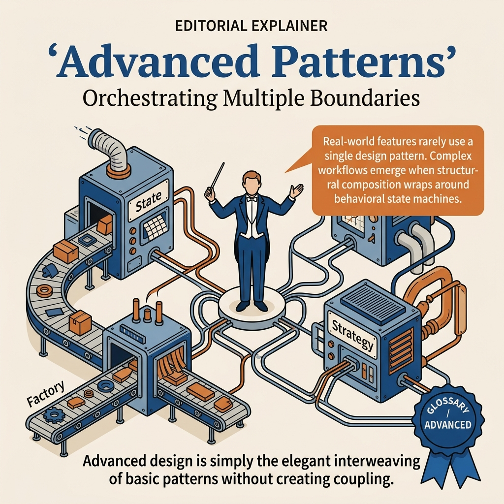
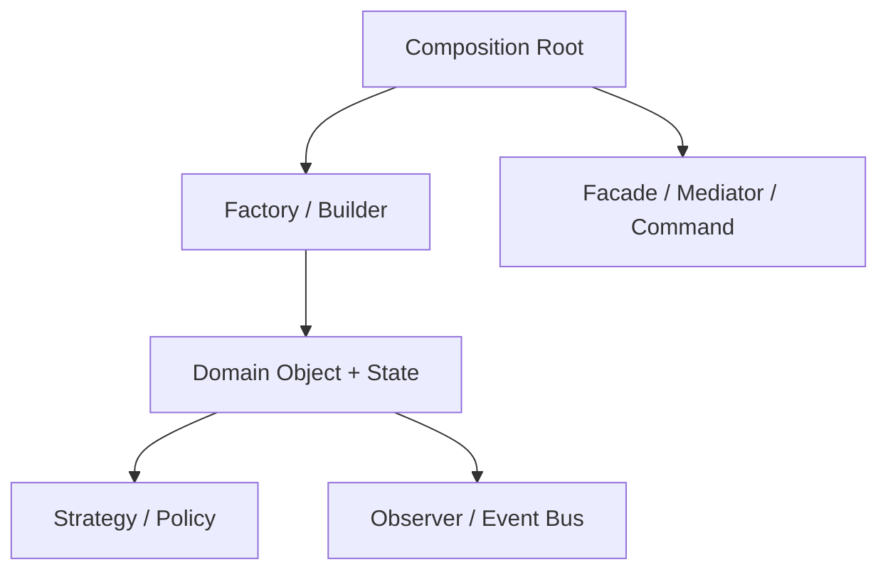

<!-- tags: design-pattern, oop, advanced -->
# 🔥 Advanced Patterns

> In production, bugs rarely come from choosing one wrong pattern. They arise when multiple concerns appear together: object creation, lifecycle state, extensibility, cross-cutting behavior, event fan-out, and orchestration. This file does not teach new patterns. It answers a harder question: **when should multiple patterns combine, and where are their boundaries to prevent overlaps?**

📅 Created: 2026-03-19 · 🔄 Updated: 2026-04-02 · ⏱️ 24 min read

| Aspect | Detail |
| ------ | ------ |
| **Group** | Advanced / Pattern Composition |
| **Purpose** | View patterns as a coordinated system instead of isolated pieces |
| **Go idiom** | Composition root, interface boundaries, middleware, event bus |
| **Confused with** | Stuffing multiple patterns just to look cool |

---

## 1. DEFINE

Imagine an order system that outgrows the tutorial phase. It creates objects, swaps policies, emits events, holds states, and wraps observability simultaneously. The question is no longer "which pattern is correct". You must ask **how to coordinate these patterns so boundaries remain clear, flow remains readable, and production avoids becoming a maze**.

You receive a frustrating bug report. Checkout creates an order, processes payment, and sends an email. However, analytics miss the event. The order sometimes jumps to the wrong state when the mobile app retries the request. No single line of code is explicitly wrong. The problem is that creation, policy, lifecycle, side effects, and orchestration clump into a few greedy objects. The question shifts from "which pattern is right?" to **"where should each concern stand to avoid overlapping?"**.

Small systems often need one pattern per problem. Complexity introduces overlapping requirements:

- Create objects based on different sources or configs.
- Swap policies at runtime.
- Maintain a clear lifecycle state.
- Handle notifications or fan-out side effects.
- Orchestrate multiple subsystems.

Patterns no longer appear alone. They combine into repeating **architectural motifs**:

- `Factory + Strategy` for creation and runtime policy.
- `State + Observer` for lifecycle and side effects.
- `Builder + Decorator + Proxy` for object assembly and runtime wrappers.
- `Command + Template Method + Mediator` for workflow orchestration.

Core insight: **Pattern composition succeeds when each pattern holds a separate responsibility. Two patterns solving the same problem in the same boundary signal over-engineering, not sophistication**.

### 1.1 How to read this file

The examples below skip some production details. Focus on identifying:

1. The real pain point.
2. Which pattern handles which responsibility.
3. The boundary between patterns.
4. Failure modes of incorrect composition.

### 1.2 Quick heuristics for combining patterns

| Question | Typical Pattern |
| ------- | ---------------------- |
| Which object to create? | Factory / Builder |
| Which policy to use? | Strategy |
| What is the current lifecycle stage? | State |
| Who needs notification on events? | Observer |
| Who coordinates peers or phases? | Mediator / Facade / Template |
| Does this request need queueing or replay? | Command |

### 1.3 Failure Modes in "Pattern Stacking"

- Two patterns do the exact same thing. Example: using `State` and `Strategy` for the same runtime policy.
- Introducing a pattern before the pain point justifies it.
- Patterns live in the wrong boundary. Domains leak vendor details, or applications leak UI concerns.
- The team loses sight of which problem each pattern solves.

---

These failure modes sound obvious. However, a trap exists. Two patterns solving one problem inside the same boundary create tangled designs. Composition without ownership boundaries creates God objects. This trap appears in PITFALLS.

## 2. VISUAL

Single patterns are familiar. Multiple concerns complicate decisions. The question changes from "which pattern" to "where does each pattern stand". The image below groups four common composition motifs.

### Overview — Pattern Composition Motifs



*Figure: Good composition means each pattern answers a different question. Two patterns solving the same problem mean one is redundant.*

### Level 1 — Responsibility Map

```text
Creation      Runtime Policy     Lifecycle      Fan-out / Side effects
---------     ---------------    ---------      ----------------------
Factory       Strategy           State          Observer
Builder       Decorator          Command        Mediator / Facade
```

*Figure: Each pattern handles a different decision type. Good composition pairs different decision types, not overlapping ones.*

### Level 2 — System Boundary Layering



*Figure: Pattern composition shines when patterns live in correct layers. Creation sits in the composition root. Policies sit in runtime objects.*

---

## 3. CODE

Concepts look clean in diagrams. Real code reveals the interfaces and decisions that advanced patterns require to survive.


### Example 1: Basic — Quote Engine (`Factory + Strategy`)

> **Goal**: Combine minimal patterns while keeping them in role. Create objects by source and swap pricing policies at runtime.
> **Approach**: `Factory` handles channel-based creation. `Strategy` handles pricing policies.
> **Example**: `NewWebQuote` uses `StandardPricing`. `NewPartnerQuote` uses `CampaignPricing`.
> **Complexity**: O(1) for creation. O(n) line items to compute totals.

```go
// quote_engine.go — Pattern Composition: Factory + Strategy
package advancedpatterns

import "fmt"

// ━━━ ✅ Strategy: isolates pricing policy from the entity ━━━
type PricingStrategy interface {
	Apply(subtotal float64) float64
	Name() string
}

type StandardPricing struct{}

func (StandardPricing) Apply(subtotal float64) float64 { return subtotal }
func (StandardPricing) Name() string                   { return "standard" }

type CampaignPricing struct {
	Percent float64
}

func (p CampaignPricing) Apply(subtotal float64) float64 {
	discount := subtotal * p.Percent / 100
	return subtotal - discount
}
func (p CampaignPricing) Name() string { return fmt.Sprintf("campaign-%.0f%%", p.Percent) }

// ━━━ ✅ Domain object: holds data state, not policy selection logic ━━━
type QuoteLine struct {
	SKU      string
	Price    float64
	Quantity int
}

type Quote struct {
	ID       string
	Channel  string
	Lines    []QuoteLine
	Pricing  PricingStrategy
	Currency string
}

func (q Quote) Subtotal() float64 {
	var subtotal float64
	for _, line := range q.Lines {
		subtotal += line.Price * float64(line.Quantity)
	}
	return subtotal
}

func (q Quote) FinalPrice() float64 {
	// Entity applies the current strategy without knowing selection details.
	return q.Pricing.Apply(q.Subtotal())
}

// ━━━ ✅ Factory: creates Quotes based on the input source ━━━
type QuoteFactory struct {
	nextID int
}

func (f *QuoteFactory) NewWebQuote(lines []QuoteLine) Quote {
	f.nextID++
	return Quote{
		ID:       fmt.Sprintf("WEB-%03d", f.nextID),
		Channel:  "web",
		Lines:    lines,
		Pricing:  StandardPricing{},
		Currency: "USD",
	}
}

func (f *QuoteFactory) NewPartnerQuote(lines []QuoteLine, partnerTier string) Quote {
	f.nextID++

	pricing := PricingStrategy(StandardPricing{})
	if partnerTier == "gold" {
		pricing = CampaignPricing{Percent: 12}
	}

	return Quote{
		ID:       fmt.Sprintf("PTN-%03d", f.nextID),
		Channel:  "partner",
		Lines:    lines,
		Pricing:  pricing,
		Currency: "USD",
	}
}

func ExampleQuoteFactory() {
	factory := &QuoteFactory{}
	lines := []QuoteLine{
		{SKU: "mac-mini", Price: 599, Quantity: 1},
		{SKU: "keyboard", Price: 99, Quantity: 2},
	}

	webQuote := factory.NewWebQuote(lines)
	partnerQuote := factory.NewPartnerQuote(lines, "gold")

	fmt.Println(webQuote.ID, webQuote.Pricing.Name(), webQuote.FinalPrice())
	fmt.Println(partnerQuote.ID, partnerQuote.Pricing.Name(), partnerQuote.FinalPrice())
}
```

> **Why?** This basic example clarifies easily confused responsibilities. The `Factory` chooses default setups but not the final price. The `Strategy` calculates prices but ignores the source channel. Mixing these forces updates to pricing logic whenever channels change.

> **Conclusion**: This is the simplest composition pair. If the problem only requires creation and runtime policies, stop here.

The quote engine covers Factory and Strategy. Order lifecycles require State and Observer. Let's compose them.

### Example 2: Intermediate — Order Lifecycle (`Factory + Strategy + State + Observer`)

> **Goal**: Upgrade the basic example into a full workflow.
> **Approach**: `Factory` creates orders. `Strategy` chooses payment. `State` blocks invalid transitions. `Observer` isolates side effects.
> **Example**: `webOrder.Pay()` changes state and emits `order.paid`. `mobileOrder.Ship()` before payment fails at the `State` layer.
> **Complexity**: O(s + n) where `s` is state transitions and `n` is subscribers.

```go
// order_workflow.go — Pattern Composition: Factory + Strategy + State + Observer
package advancedpatterns

import (
	"fmt"
	"sync"
	"time"
)

// ━━━ ✅ Observer: event bus for side effects ━━━
type OrderEvent struct {
	Type      string
	OrderID   string
	Timestamp time.Time
	Data      any
}

type OrderHandler func(OrderEvent)

type EventBus struct {
	mu       sync.RWMutex
	handlers map[string][]OrderHandler
}

func NewEventBus() *EventBus {
	return &EventBus{handlers: make(map[string][]OrderHandler)}
}

func (b *EventBus) Subscribe(eventType string, handler OrderHandler) {
	b.mu.Lock()
	defer b.mu.Unlock()
	b.handlers[eventType] = append(b.handlers[eventType], handler)
}

func (b *EventBus) Publish(event OrderEvent) {
	b.mu.RLock()
	defer b.mu.RUnlock()

	for _, handler := range b.handlers[event.Type] {
		handler(event)
	}
	for _, handler := range b.handlers["*"] {
		handler(event)
	}
}

// ━━━ ✅ Strategy: swap payment policies without modifying the order entity ━━━
type PaymentStrategy interface {
	Pay(amount float64) (transactionID string, err error)
	Name() string
}

type CreditCardPayment struct {
	Last4 string
}

func (p CreditCardPayment) Pay(amount float64) (string, error) {
	return fmt.Sprintf("cc-%s-%.0f", p.Last4, amount), nil
}
func (p CreditCardPayment) Name() string { return "credit-card" }

type WalletPayment struct {
	Provider string
}

func (p WalletPayment) Pay(amount float64) (string, error) {
	return fmt.Sprintf("%s-%.0f", p.Provider, amount), nil
}
func (p WalletPayment) Name() string { return "wallet-" + p.Provider }

// ━━━ ✅ State: block invalid transitions directly within the domain object ━━━
type OrderState interface {
	Pay(*Order) error
	Ship(*Order) error
	Cancel(*Order) error
	String() string
}

type PendingState struct{}

func (PendingState) Pay(o *Order) error {
	txnID, err := o.payment.Pay(o.TotalAmount())
	if err != nil {
		return err
	}
	o.transactionID = txnID
	o.state = PaidState{}
	o.events.Publish(OrderEvent{Type: "order.paid", OrderID: o.id, Timestamp: time.Now(), Data: txnID})
	return nil
}
func (PendingState) Ship(*Order) error   { return fmt.Errorf("cannot ship unpaid order") }
func (PendingState) Cancel(o *Order) error {
	o.state = CancelledState{}
	o.events.Publish(OrderEvent{Type: "order.cancelled", OrderID: o.id, Timestamp: time.Now()})
	return nil
}
func (PendingState) String() string { return "pending" }

type PaidState struct{}

func (PaidState) Pay(*Order) error { return fmt.Errorf("already paid") }
func (PaidState) Ship(o *Order) error {
	o.state = ShippedState{}
	o.events.Publish(OrderEvent{Type: "order.shipped", OrderID: o.id, Timestamp: time.Now()})
	return nil
}
func (PaidState) Cancel(o *Order) error {
	o.state = CancelledState{}
	o.events.Publish(OrderEvent{Type: "order.refunded", OrderID: o.id, Timestamp: time.Now()})
	return nil
}
func (PaidState) String() string { return "paid" }

type ShippedState struct{}

func (ShippedState) Pay(*Order) error    { return fmt.Errorf("already paid") }
func (ShippedState) Ship(*Order) error   { return fmt.Errorf("already shipped") }
func (ShippedState) Cancel(*Order) error { return fmt.Errorf("cannot cancel shipped order") }
func (ShippedState) String() string      { return "shipped" }

type CancelledState struct{}

func (CancelledState) Pay(*Order) error    { return fmt.Errorf("order cancelled") }
func (CancelledState) Ship(*Order) error   { return fmt.Errorf("order cancelled") }
func (CancelledState) Cancel(*Order) error { return fmt.Errorf("already cancelled") }
func (CancelledState) String() string      { return "cancelled" }

type OrderLine struct {
	SKU      string
	Price    float64
	Quantity int
}

type Order struct {
	id            string
	source        string
	lines         []OrderLine
	payment       PaymentStrategy
	state         OrderState
	events        *EventBus
	transactionID string
}

func (o *Order) TotalAmount() float64 {
	var total float64
	for _, line := range o.lines {
		total += line.Price * float64(line.Quantity)
	}
	return total
}

func (o *Order) Pay() error    { return o.state.Pay(o) }
func (o *Order) Ship() error   { return o.state.Ship(o) }
func (o *Order) Cancel() error { return o.state.Cancel(o) }
func (o *Order) Status() string { return o.state.String() }

// ━━━ ✅ Factory: source-specific defaults live here, not inside the Order ━━━
type OrderFactory struct {
	events *EventBus
	nextID int
}

func NewOrderFactory(events *EventBus) *OrderFactory {
	return &OrderFactory{events: events}
}

func (f *OrderFactory) NewWebOrder(lines []OrderLine) *Order {
	f.nextID++
	return &Order{
		id:      fmt.Sprintf("WEB-%03d", f.nextID),
		source:  "web",
		lines:   lines,
		payment: CreditCardPayment{Last4: "4242"},
		state:   PendingState{},
		events:  f.events,
	}
}

func (f *OrderFactory) NewMobileOrder(lines []OrderLine) *Order {
	f.nextID++
	return &Order{
		id:      fmt.Sprintf("APP-%03d", f.nextID),
		source:  "mobile",
		lines:   lines,
		payment: WalletPayment{Provider: "momo"},
		state:   PendingState{},
		events:  f.events,
	}
}
```

> **Why?** This composition provides immense value because four patterns answer four distinct questions. `Factory` handles source defaults. `Strategy` handles payment policies. `State` validates transitions. `Observer` broadcasts side effects. Forcing all four into `Order` creates a God object.

> **Conclusion**: When problems involve lifecycles and side effects, `Factory + Strategy` falls short. The design needs `State` and `Observer` to scale cleanly.

Order lifecycles work smoothly. However, an HTTP client needs Builder, Decorator, and Proxy. Let's assemble them.

### Example 3: Advanced — HTTP Client Assembly (`Builder + Decorator + Proxy + Adapter`)

> **Goal**: Build an integration client with multi-step config, retry logic, lazy initialization, and unified vendor contracts.
> **Approach**: `Builder` assembles the graph. `Decorator` adds cross-cutting behavior. `Proxy` delays connection. `Adapter` maps vendor SDKs.
> **Example**: A builder creates a client with lazy init, a retry wrapper, and a path adapter.
> **Complexity**: O(k) layers, excluding IO costs.

```go
// http_client_assembly.go — Pattern Composition: Builder + Decorator + Proxy + Adapter
package advancedpatterns

import (
	"fmt"
	"strings"
	"time"
)

type HTTPClient interface {
	Do(path string) (string, error)
}

// ━━━ ✅ Adapter: normalizes vendor SDKs to the internal contract ━━━
type VendorSDK struct {
	baseURL string
	timeout time.Duration
}

func (sdk VendorSDK) Execute(endpoint string) (string, error) {
	return fmt.Sprintf("vendor:%s%s timeout=%s", sdk.baseURL, endpoint, sdk.timeout), nil
}

type SDKAdapter struct {
	sdk VendorSDK
}

func (a SDKAdapter) Do(path string) (string, error) {
	normalized := "/" + strings.TrimPrefix(path, "/")
	return a.sdk.Execute(normalized)
}

// ━━━ ✅ Decorator: keeps cross-cutting behaviors outside the core client ━━━
type LoggingDecorator struct {
	next HTTPClient
}

func (d LoggingDecorator) Do(path string) (string, error) {
	startedAt := time.Now()
	response, err := d.next.Do(path)
	fmt.Printf("[log] path=%s duration=%s err=%v\n", path, time.Since(startedAt), err)
	return response, err
}

type RetryDecorator struct {
	next     HTTPClient
	maxRetry int
}

func (d RetryDecorator) Do(path string) (string, error) {
	var lastErr error
	for attempt := 0; attempt <= d.maxRetry; attempt++ {
		response, err := d.next.Do(path)
		if err == nil {
			return response, nil
		}
		lastErr = err
	}
	return "", fmt.Errorf("request failed after retry: %w", lastErr)
}

// ━━━ ✅ Proxy: delays actual connection until the first use ━━━
type LazyProxy struct {
	build func() HTTPClient
	real  HTTPClient
}

func (p *LazyProxy) Do(path string) (string, error) {
	if p.real == nil {
		p.real = p.build()
	}
	return p.real.Do(path)
}

// ━━━ ✅ Builder: assembles the object graph based on configuration ━━━
type ClientBuilder struct {
	baseURL       string
	timeout       time.Duration
	enableLogging bool
	enableRetry   bool
}

func NewClientBuilder() *ClientBuilder {
	return &ClientBuilder{timeout: 3 * time.Second}
}

func (b *ClientBuilder) WithBaseURL(baseURL string) *ClientBuilder {
	b.baseURL = strings.TrimRight(baseURL, "/")
	return b
}

func (b *ClientBuilder) WithTimeout(timeout time.Duration) *ClientBuilder {
	b.timeout = timeout
	return b
}

func (b *ClientBuilder) WithLogging() *ClientBuilder {
	b.enableLogging = true
	return b
}

func (b *ClientBuilder) WithRetry() *ClientBuilder {
	b.enableRetry = true
	return b
}

func (b *ClientBuilder) Build() HTTPClient {
	var client HTTPClient = &LazyProxy{
		build: func() HTTPClient {
			return SDKAdapter{
				sdk: VendorSDK{
					baseURL: b.baseURL,
					timeout: b.timeout,
				},
			}
		},
	}

	if b.enableRetry {
		client = RetryDecorator{next: client, maxRetry: 2}
	}
	if b.enableLogging {
		client = LoggingDecorator{next: client}
	}

	return client
}
```

> **Why?** Integration layers easily become bloated. These four patterns coexist because each handles a separate concern. `Builder` configures the graph. `Adapter` normalizes contracts. `Proxy` delays initialization. `Decorator` adds retries.

> **Conclusion**: Pattern composition in integration layers requires strict boundary enforcement, not shoving business rules into adapters.

HTTP clients need structure. Workflow engines need Command, Template, and Mediator. Let's orchestrate them.

### Example 4: Expert — Workflow Engine (`Command + Template Method + Mediator + Observer`)

> **Goal**: Model a multi-step workflow. Steps run as separate actions. The flow retains a fixed skeleton. Coordinators manage dependencies. Event buses emit signals.
> **Approach**: `Command` handles steps. `Template Method` holds the skeleton. `Mediator` coordinates participants. `Observer` fans out events.
> **Example**: Validation, transformation, and persistence run sequentially. The mediator unlocks downstream notifications upon completion.
> **Complexity**: O(s + n) for `s` steps and `n` subscribers.

```go
// workflow_engine.go — Pattern Composition: Command + Template Method + Mediator + Observer
package advancedpatterns

import "fmt"

// ━━━ ✅ Command: treats each step as an independent action ━━━
type Command interface {
	Name() string
	Execute(ctx *WorkflowContext) error
}

type ValidateCommand struct{}

func (ValidateCommand) Name() string { return "validate" }
func (ValidateCommand) Execute(ctx *WorkflowContext) error {
	if len(ctx.Payload) == 0 {
		return fmt.Errorf("payload is empty")
	}
	ctx.Log = append(ctx.Log, "payload validated")
	return nil
}

type TransformCommand struct{}

func (TransformCommand) Name() string { return "transform" }
func (TransformCommand) Execute(ctx *WorkflowContext) error {
	ctx.Payload["normalized"] = true
	ctx.Log = append(ctx.Log, "payload transformed")
	return nil
}

type PersistCommand struct{}

func (PersistCommand) Name() string { return "persist" }
func (PersistCommand) Execute(ctx *WorkflowContext) error {
	ctx.RecordID = "rec-001"
	ctx.Log = append(ctx.Log, "record persisted")
	return nil
}

// ━━━ ✅ Observer: handles side effects outside the workflow core ━━━
type WorkflowEvent struct {
	Type string
	Step string
}

type WorkflowSubscriber func(WorkflowEvent)

type WorkflowBus struct {
	subscribers []WorkflowSubscriber
}

func (b *WorkflowBus) Subscribe(sub WorkflowSubscriber) {
	b.subscribers = append(b.subscribers, sub)
}

func (b *WorkflowBus) Publish(event WorkflowEvent) {
	for _, sub := range b.subscribers {
		sub(event)
	}
}

// ━━━ ✅ Mediator: coordinates participants and shares knowledge ━━━
type WorkflowMediator interface {
	OnStepCompleted(step string, ctx *WorkflowContext)
}

type ImportCoordinator struct{}

func (ImportCoordinator) OnStepCompleted(step string, ctx *WorkflowContext) {
	if step == "persist" && ctx.RecordID != "" {
		ctx.Log = append(ctx.Log, "downstream notification unlocked")
	}
}

type WorkflowContext struct {
	Payload  map[string]any
	RecordID string
	Log      []string
}

// ━━━ ✅ Template Method: holds the fixed skeleton for execution ━━━
type Workflow struct {
	steps    []Command
	mediator WorkflowMediator
	bus      *WorkflowBus
}

func (w Workflow) Run(ctx *WorkflowContext) error {
	w.beforeRun(ctx)
	for _, step := range w.steps {
		if err := step.Execute(ctx); err != nil {
			w.bus.Publish(WorkflowEvent{Type: "workflow.failed", Step: step.Name()})
			return err
		}
		w.mediator.OnStepCompleted(step.Name(), ctx)
		w.bus.Publish(WorkflowEvent{Type: "workflow.step.completed", Step: step.Name()})
	}
	w.afterRun(ctx)
	return nil
}

func (w Workflow) beforeRun(ctx *WorkflowContext) {
	ctx.Log = append(ctx.Log, "workflow started")
	w.bus.Publish(WorkflowEvent{Type: "workflow.started"})
}

func (w Workflow) afterRun(ctx *WorkflowContext) {
	ctx.Log = append(ctx.Log, "workflow finished")
	w.bus.Publish(WorkflowEvent{Type: "workflow.completed"})
}

func ExampleWorkflow() error {
	bus := &WorkflowBus{}
	bus.Subscribe(func(event WorkflowEvent) {
		fmt.Printf("[event] %s step=%s\n", event.Type, event.Step)
	})

	workflow := Workflow{
		steps: []Command{
			ValidateCommand{},
			TransformCommand{},
			PersistCommand{},
		},
		mediator: ImportCoordinator{},
		bus:      bus,
	}

	return workflow.Run(&WorkflowContext{
		Payload: map[string]any{"file": "import.csv"},
	})
}
```

> **Why?** Workflow composition causes overlapping responsibilities frequently. `Command` isolates actions. `Template Method` enforces the execution skeleton. `Mediator` shares context among steps. `Observer` handles external side effects.

> **Conclusion**: Expert composition requires placing patterns in their exact decision layers, not just piling them up.

The examples demonstrated quote engines, order lifecycles, HTTP clients, and workflow engines. Pattern overlaps and ownership leaks cause severe bugs. Let us review the pitfalls.

## 4. PITFALLS

Advanced patterns easily lose their boundaries in real codebases. The following pitfalls demonstrate common composition failures.

| # | Severity | Error | Consequence | Fix |
|---|----------|-----|---------|-----|
| 1 | 🔴 Fatal | Two patterns solve the same problem | Tangled design and confusing reasoning | Verify each pattern answers a unique question |
| 2 | 🔴 Fatal | Pattern composition lacks ownership boundaries | God objects and leaky abstractions | Separate creation, lifecycle, policy, and orchestration |
| 3 | 🟡 Common | Using multiple patterns for "enterprise" flair | High ceremony with no added value | Compose patterns only when pain points justify them |
| 4 | 🟡 Common | Failing to document composition trade-offs | Teammates misapply the composition | Document why patterns co-exist |
| 5 | 🔵 Minor | Treating advanced patterns as a gallery | Hard to apply to real code | Tie examples to specific boundaries and failure modes |

---

## 5. REF

| Resource | Type | Link | Notes |
| -------- | ---- | ---- | ------- |
| Refactoring.Guru | Pattern catalog | https://refactoring.guru/design-patterns | Foundational reference for individual patterns |
| Effective Go | Official docs | https://go.dev/doc/effective_go | Composition, interfaces, and function values |
| Fowler on enterprise application patterns | Engineering reference | https://martinfowler.com | Context for pattern coordination in large systems |

---

## 6. RECOMMEND

Pattern composition delivers value when each pattern retains a distinct responsibility. If pain points remain vague, return to single patterns first.

| Explore | When to use | Reason | File/Link |
| ------- | ------- | ----- | --------- |
| Creational Patterns | Pain involves object creation exclusively | Simplify creation before attempting composition | [Creational](./creational/README.md) |
| Structural Patterns | Pain involves wrappers or boundaries | Composition does not equal orchestration | [Structural](./structural/README.md) |
| Behavioral Patterns | Pain involves algorithms or isolated events | Master individual patterns before combining them | [Behavioral](./behavioral/README.md) |

---

## 7. QUICK REF

| Problem | Common Composition |
| -------- | ------------------- |
| Creation + runtime policy + lifecycle | Factory + Strategy + State |
| Integration layer with multiple wrappers | Builder + Adapter + Decorator + Proxy |
| Workflow with steps + orchestration + events | Command + Template + Mediator + Observer |
| Patterns overlapping responsibilities? | Stop and redefine the boundary |

**Links**: [← Behavioral Patterns](./behavioral/README.md) · [← Hub](./README.md)
