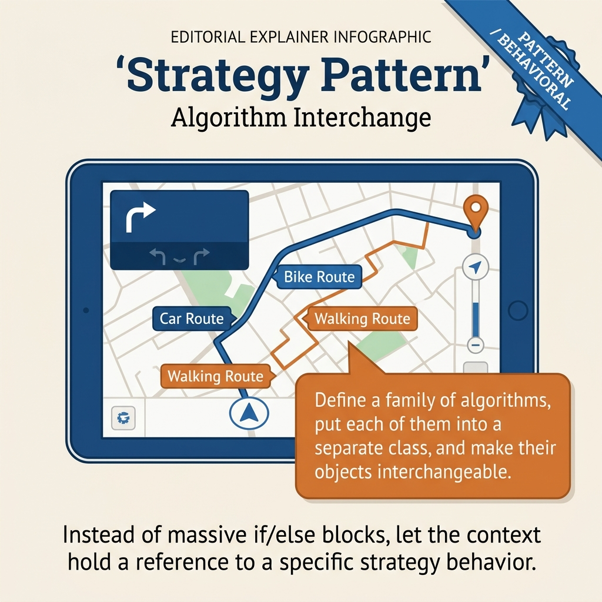
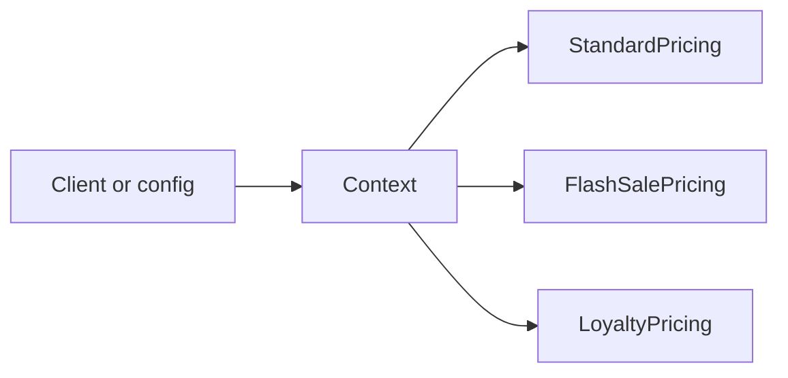
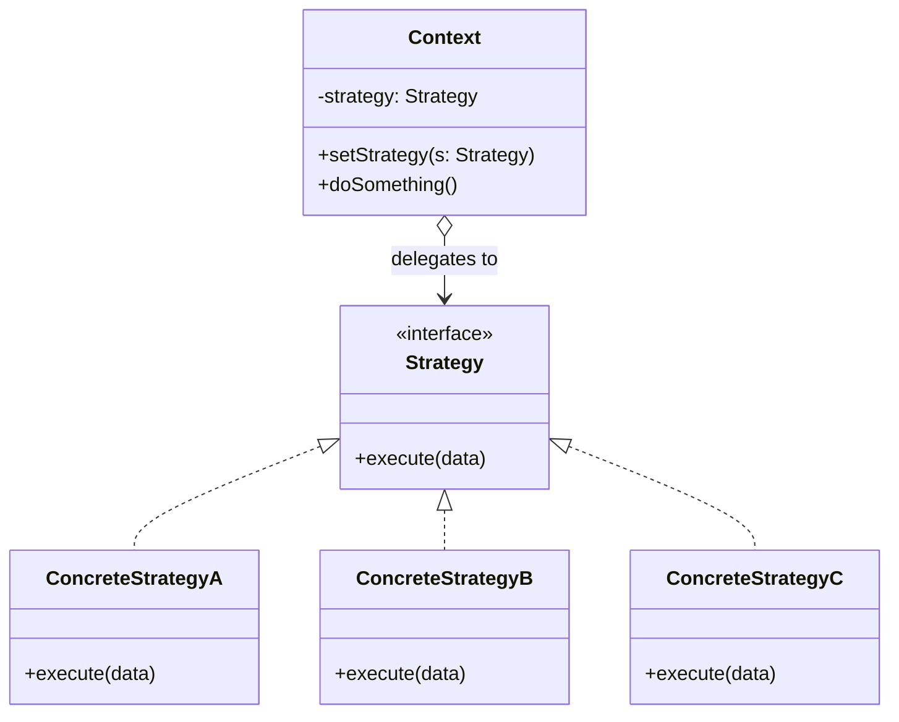
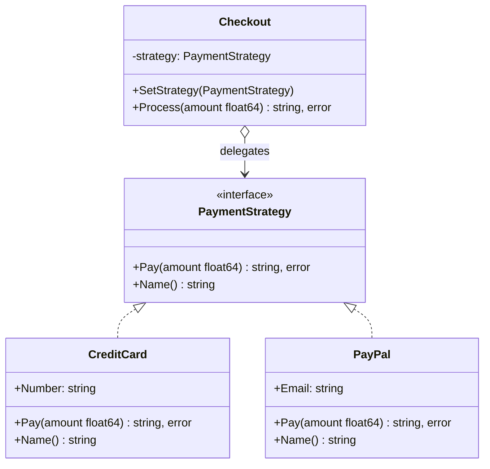
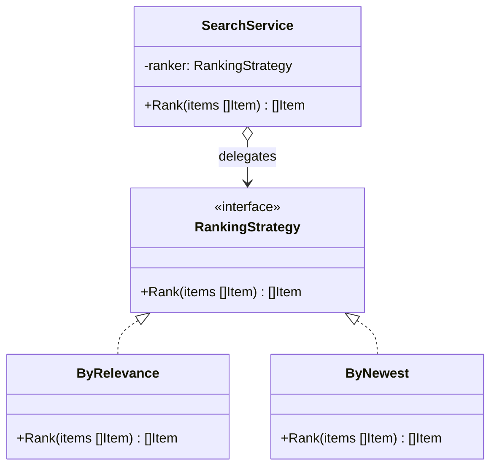
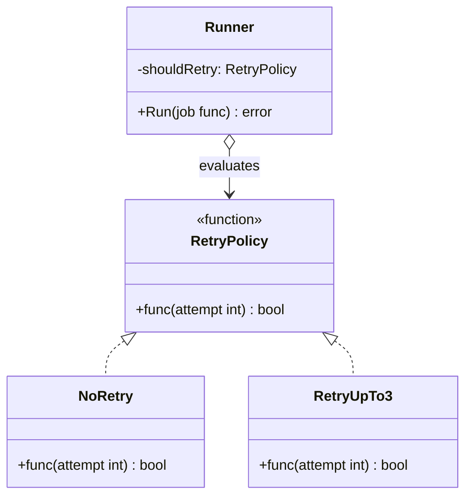

<!-- tags: design-pattern, behavioral, oop, strategy -->
# 🎯 Strategy

> You manage a checkout flow supporting multiple fee calculations, search result sorting rules, retry policies, and pricing models. If every variant lives within a massive `switch mode { ... }` block, the code inflates proportionally to the algorithms. Every new algorithm forces you to crack open the central "coordinator" file.

📅 Created: 2026-03-19 · 🔄 Updated: 2026-04-02 · ⏱️ 20 min read

| Aspect | Detail |
| ------ | ------ |
| **Group** | Behavioral |
| **Purpose** | Swap algorithms or policies at runtime without altering caller code |
| **Go idiom** | Small interfaces or `func` strategies |
| **SOLID** | Open/Closed, Dependency Inversion |
| **Confused with** | State, Template Method |

---

## 1. DEFINE

You maintain a checkout or ranking flow where the algorithm shifts based on campaigns, tenants, or feature flags. If all variants wedge themselves into a single `switch` statement, you bloat the code and centralize the decision rights for the algorithm itself.

Strategy fits scenarios demanding **multiple ways to solve the identical problem**, where the caller merely states "do this task" without concerning itself with the underlying algorithm. The typical pain point emerges when `if mode == ...` or `switch type` logic invades the service layer: sorting one way, charging another, or retrying differently.

`Strategy` rips each algorithm or policy into a standalone implementation honoring a shared contract. The context retains a reference to the active strategy and delegates execution to it.

Core insight: **When the changing factor is the algorithm—not the state machine or orchestration skeleton—Strategy provides the cleanest separation.**

### 1.1 Vocabulary

| Concept | Role |
| --------- | ------- |
| **Strategy** | The contract defining the algorithm or policy |
| **Concrete Strategy** | A highly specific algorithm implementation |
| **Context** | The object retaining the strategy and executing it |

### 1.2 Strategy vs State vs Template Method

| Pattern | Who picks the variant? | What actually changes? |
| ------- | ----------------- | ---------------- |
| **Strategy** | The caller or the configuration | The entire algorithm or policy |
| **State** | The system transitions internally | Behavior dictated by current state |
| **Template Method** | The base class or flow fixes the skeleton | Specific steps inside the skeleton |

### 1.3 Failure Modes

- The strategy interface grows too large, forcing each strategy to implement irrelevant methods.
- The caller continues executing `switch` statements before invoking the strategy, instantly destroying the pattern's value.
- The team misapplies Strategy for state transitions, whereas state should shift itself instead of awaiting a caller's choice.

---

These failure modes sound familiar. However, a trap exists. A massive strategy interface demands useless implementations. Callers running switch statements before strategy invocation render the pattern entirely pointless. This trap appears in PITFALLS.

## 2. VISUAL

Switch-driven design sounds abstract until you pinpoint where the bloat occurs. The image below contrasts the before/after states and outlines the boundaries separating Strategy, State, and Template Method.

### Overview — Strategy vs State vs Template Method



*Figure: Strategy = the caller selects the algorithm. State = the object shifts behavior autonomously. Template Method = only specific steps change within a rigid skeleton.*

### Level 1 — Strategy Injection

```text
Client
  │ chooses PricingStrategy
  ▼
CheckoutContext
  │ delegate price()
  ▼
Concrete Strategy
```

*Figure: The context remains ignorant of algorithmic details. It exclusively understands the contract of the active strategy.*

### Level 2 — Runtime Swap



*Figure: The caller swaps strategies at runtime without touching the context logic.*

### UML — Strategy Class Structure



*The Context retains a reference to the Strategy interface. The ConcreteStrategy implements the distinct algorithm. The Client selects the strategy and injects it into the context. The context delegates the work without caring which implementation runs.*

---

## 3. CODE

The diagrams separate boundaries clearly. The code reveals how `Strategy` leverages interfaces and composition without leaking decisions to the caller.

### Example 1: Basic — Payment Strategy

> **Goal**: Swap payment methods seamlessly during checkout without modifying the `Checkout` logic.



> **Approach**: Rely on a `PaymentStrategy` interface and supply multiple concrete strategies.
> **Example**: Credit card, PayPal, or crypto.
> **Complexity**: O(1) orchestration; the cost remains within each specific payment strategy.

```go
// payment_strategy.go — Strategy Pattern: swap payment algorithm at runtime
package strategydemo

import "fmt"

type PaymentStrategy interface {
	Pay(amount float64) (string, error)
	Name() string
}

type CreditCard struct{ Number string }
func (c CreditCard) Pay(amount float64) (string, error) {
	return fmt.Sprintf("card charged %.2f", amount), nil
}
func (c CreditCard) Name() string { return "credit-card" }

type PayPal struct{ Email string }
func (p PayPal) Pay(amount float64) (string, error) {
	return fmt.Sprintf("paypal charged %.2f", amount), nil
}
func (p PayPal) Name() string { return "paypal" }

type Checkout struct {
	strategy PaymentStrategy
}

func NewCheckout(strategy PaymentStrategy) *Checkout {
	return &Checkout{strategy: strategy}
}

func (c *Checkout) SetStrategy(strategy PaymentStrategy) {
	c.strategy = strategy
}

func (c *Checkout) Process(amount float64) (string, error) {
	if c.strategy == nil {
		return "", fmt.Errorf("no payment strategy configured")
	}
	return c.strategy.Pay(amount)
}
```
```typescript
// payment_strategy.ts — Strategy Pattern: swap payment algorithm at runtime
interface PaymentStrategy {
  pay(amount: number): Promise<string>;
  name(): string;
}
```
```java
// PaymentStrategy.java — Strategy Pattern: swap payment algorithm at runtime
interface PaymentStrategy {
    String pay(double amount) throws Exception;
    String name();
}
```
```rust
// payment_strategy.rs — Strategy Pattern: swap payment algorithm at runtime
trait PaymentStrategy {
    fn pay(&self, amount: f64) -> Result<String, String>;
    fn name(&self) -> &str;
}
```
```cpp
// payment_strategy.cpp — Strategy Pattern: swap payment algorithm at runtime
struct PaymentStrategy {
    virtual std::string pay(double amount) = 0;
    virtual std::string name() const = 0;
    virtual ~PaymentStrategy() = default;
};
```
```python
# payment_strategy.py — Strategy Pattern: swap payment algorithm at runtime
class PaymentStrategy:
    def pay(self, amount: float) -> str:
        raise NotImplementedError
```

Conclusion: Strategy displays immediate strength if the caller focuses solely on "paying" without caring about the specific payment algorithm.

Payment strategies work smoothly. However, ranking systems demand algorithmic swapping. Let's apply it.

### Example 2: Intermediate — Search Ranking Strategy

> **Goal**: Alter the ranking algorithm dynamically based on use cases without refactoring the search service.



> **Approach**: The search service accepts a `RankingStrategy`.
> **Example**: Relevance, newest, or popularity rankings.
> **Complexity**: Depends entirely on the chosen ranking strategy; context orchestration remains O(1).

```go
// ranking_strategy.go — Strategy Pattern: swap ranking policy without changing search service
package rankingstrategy

import "sort"

type Item struct {
	Title      string
	Score      float64
	Popularity int
	CreatedAt  int64
}

type RankingStrategy interface {
	Rank(items []Item) []Item
}

type ByRelevance struct{}
func (ByRelevance) Rank(items []Item) []Item {
	out := append([]Item(nil), items...)
	sort.Slice(out, func(i, j int) bool { return out[i].Score > out[j].Score })
	return out
}

type ByNewest struct{}
func (ByNewest) Rank(items []Item) []Item {
	out := append([]Item(nil), items...)
	sort.Slice(out, func(i, j int) bool { return out[i].CreatedAt > out[j].CreatedAt })
	return out
}

type SearchService struct {
	ranker RankingStrategy
}

func (s SearchService) Rank(items []Item) []Item {
	return s.ranker.Rank(items)
}
```
```typescript
// ranking_strategy.ts — Strategy Pattern: swap ranking policy without changing search service
type Item = { title: string; score: number; popularity: number; createdAt: number };
interface RankingStrategy {
  rank(items: Item[]): Item[];
}
```
```java
// RankingStrategy.java — Strategy Pattern: swap ranking policy without changing search service
record Item(String title, double score, int popularity, long createdAt) {}
interface RankingStrategy {
    java.util.List<Item> rank(java.util.List<Item> items);
}
```
```rust
// ranking_strategy.rs — Strategy Pattern: swap ranking policy without changing search service
#[derive(Clone)]
struct Item {
    title: String,
    score: f64,
    popularity: i32,
    created_at: i64,
}
trait RankingStrategy {
    fn rank(&self, items: &[Item]) -> Vec<Item>;
}
```
```cpp
// ranking_strategy.cpp — Strategy Pattern: swap ranking policy without changing search service
struct Item {
    std::string title;
    double score;
    int popularity;
    long long created_at;
};
```
```python
# ranking_strategy.py — Strategy Pattern: swap ranking policy without changing search service
from dataclasses import dataclass


@dataclass
class Item:
    title: str
    score: float
    popularity: int
    created_at: int
```

> **Why?** This represents a textbook Strategy use case inside a real app. The data stays identical, but the calculation and sorting policies fluctuate based on feature flags, plans, or specific screens. The search service should never manage individual ranking branches.

Conclusion: Intermediate Strategy fits perfectly for pricing, ranking, retry policies, serialization policies, or shipping cost calculations.

Ranking algorithms work well. However, Go function strategies offer superior brevity. Let's use funcs.

### Example 3: Advanced — Function Strategy for Retry Policies

> **Goal**: Deploy function-based strategies to achieve concise, idiomatic policies in Go.



> **Approach**: Utilize `type RetryPolicy func(attempt int) bool`.
> **Example**: Linear retries, maximum retries, or no-retries.
> **Complexity**: O(1) per policy evaluation.

```go
// retry_strategy.go — Strategy Pattern: use function strategies for simple policies
package retrystrategy

type RetryPolicy func(attempt int) bool

func NoRetry(attempt int) bool      { return false }
func RetryUpTo3(attempt int) bool   { return attempt < 3 }
func RetryUpTo5(attempt int) bool   { return attempt < 5 }

type Runner struct {
	shouldRetry RetryPolicy
}

func (r Runner) Run(job func() error) error {
	var err error
	for attempt := 0; ; attempt++ {
		err = job()
		if err == nil || !r.shouldRetry(attempt+1) {
			return err
		}
	}
}
```
```typescript
// retry_strategy.ts — Strategy Pattern: use function strategies for simple policies
type RetryPolicy = (attempt: number) => boolean;
```
```java
// RetryStrategy.java — Strategy Pattern: use function strategies for simple policies
import java.util.function.IntPredicate;
```
```rust
// retry_strategy.rs — Strategy Pattern: use function strategies for simple policies
type RetryPolicy = fn(i32) -> bool;
```
```cpp
// retry_strategy.cpp — Strategy Pattern: use function strategies for simple policies
#include <functional>
using RetryPolicy = std::function<bool(int)>;
```
```python
# retry_strategy.py — Strategy Pattern: use function strategies for simple policies
from collections.abc import Callable
RetryPolicy = Callable[[int], bool]
```

> **Why?** Go strategies rarely demand an interface alongside a struct. If a strategy features a single behavior, function strategies provide a shorter, highly idiomatic alternative that drastically reduces ceremony.

Conclusion: Advanced Strategy revolves around selecting the precise representation for your strategy: an interface for behavior-rich policies, or a function for concise, targeted policies.

---

You observed payment, ranking, and function strategies. The danger now comes from fat interfaces and switch leaks. We set up these traps earlier.

## 4. PITFALLS

The `Strategy` pattern routinely suffers misunderstanding. The pattern remains in the code, but it loses the boundary it promises. These pitfalls explain why.

| # | Severity | Error | Consequence | Fix |
|---|----------|-----|---------|-----|
| 1 | 🔴 Fatal | The strategy interface inflates excessively | Every strategy implements useless, irrelevant methods | Constrict the contract strictly to the core algorithm |
| 2 | 🔴 Fatal | The caller executes a `switch` statement immediately before invoking the strategy | The pattern provides zero architectural value | Push the strategy selection decision up to the configuration or composition root |
| 3 | 🟡 Common | Applying Strategy for internal state transitions | The semantics warp entirely | If states shift autonomously, implement the State pattern |
| 4 | 🟡 Common | Strategies retain excessive shared mutable state | The code becomes extremely difficult to test and reason about | Strongly prefer stateless strategies or isolate state ruthlessly |
| 5 | 🔵 Minor | Forcing an interface strategy for a trivial single-function case | Pure, unnecessary ceremony | Adopt function strategies when the footprint allows it |

---

You navigated the Strategy pattern and its traps. The resources below provide deeper context.

## 5. REF

| Resource | Type | Link | Notes |
| -------- | ---- | ---- | ------- |
| Refactoring.Guru — Strategy | Pattern catalog | https://refactoring.guru/design-patterns/strategy | Canonical explanation |
| Effective Go | Official docs | https://go.dev/doc/effective_go | Compact interfaces and function values |
| Go blog — first-class functions | Official docs | https://go.dev/blog | Context detailing idiomatic function strategies |

---

## 6. RECOMMEND

Strategy dominates when the variant constitutes the entire algorithm. If the pain point involves an internal state machine or a rigid skeleton, alternative directions fit better.

| Explore | When to use | Reason | File/Link |
| ------- | ------- | ----- | --------- |
| State | Behavior alters because the internal state shifts autonomously | Self-transitioning differs fundamentally from caller selection | [05-state.md](./05-state.md) |
| Template Method | You must swap isolated steps within a fixed skeleton | A fixed skeleton differs fundamentally from full algorithm swaps | [04-template.md](./04-template.md) |
| Command | Actions demand queueing, undoing, or logging | Request lifecycles differ fundamentally from algorithms | [03-command.md](./03-command.md) |

---

## 7. QUICK REF

| Signal | Might Strategy be the right choice? |
| ------ | ---------------------- |
| Multiple algorithms or policies share the exact same contract | ✅ Yes |
| The caller dictates the variant via config or runtime logic | ✅ Yes |
| Behavior autonomously shifts based on internal state | ❌ That implies State |
| You merely replace a few steps inside a rigid skeleton | ❌ That implies Template Method |

**Links**: [← Structural Patterns](../structural/06-bridge.md) · [→ Observer](./02-observer.md)
