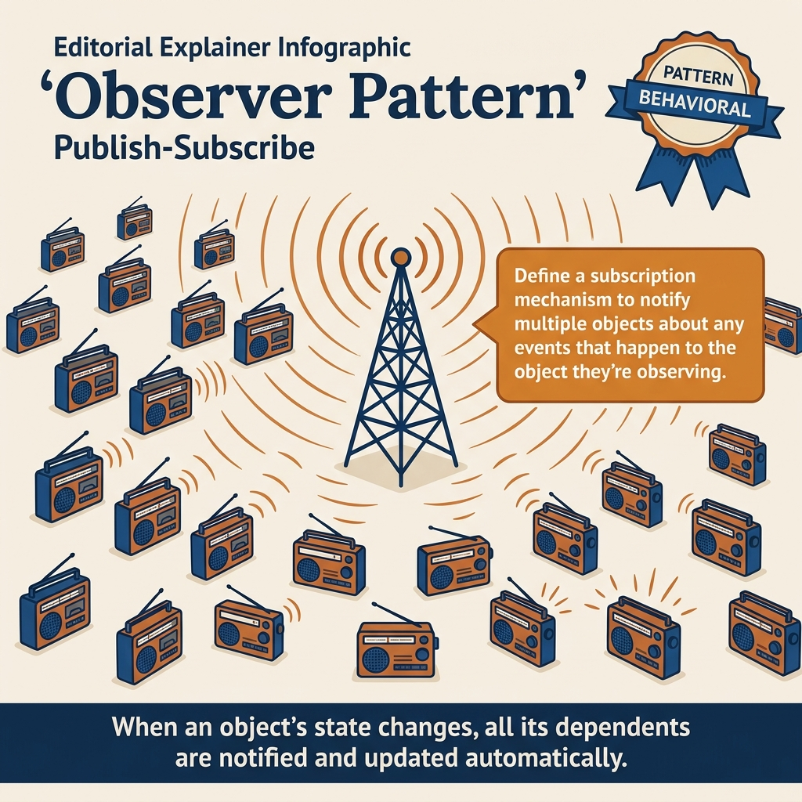
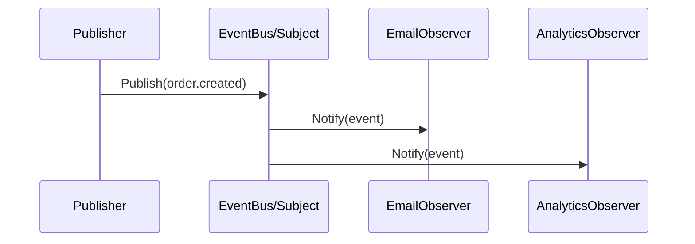
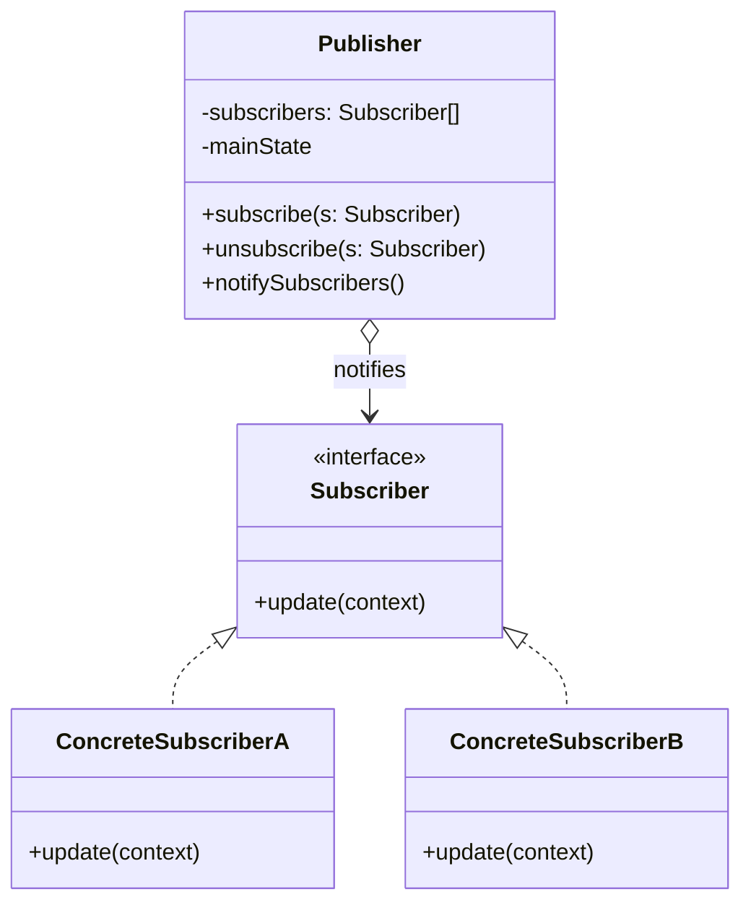
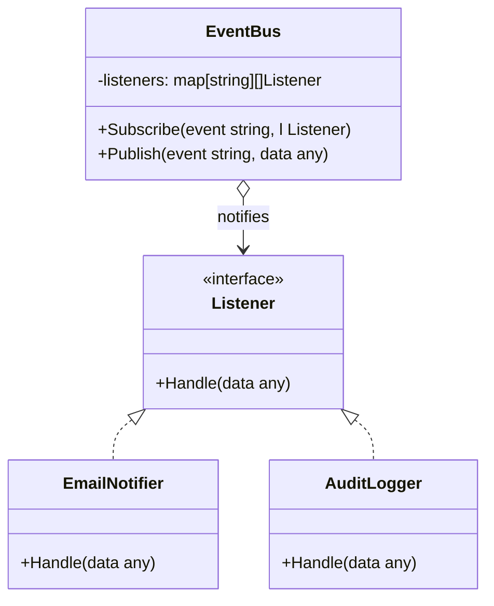
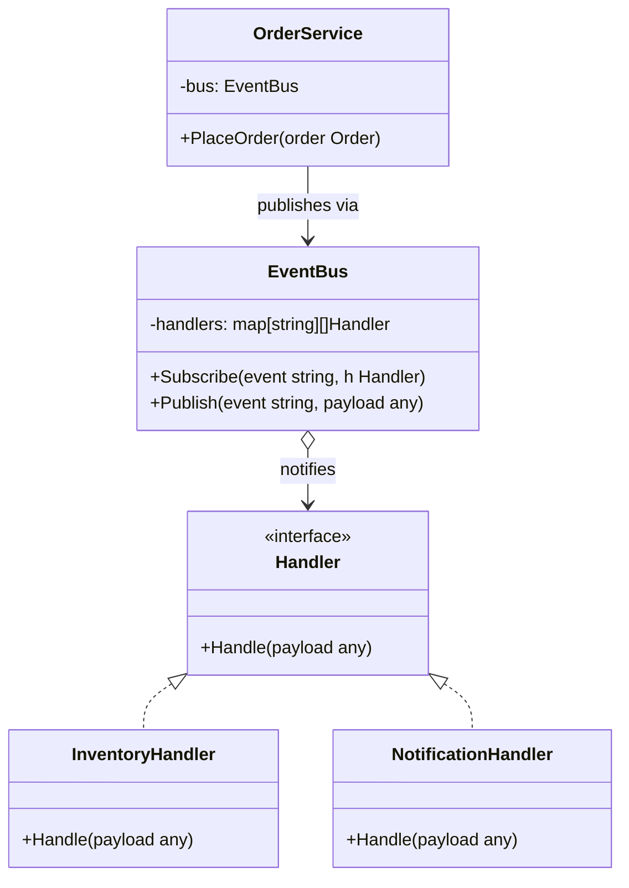
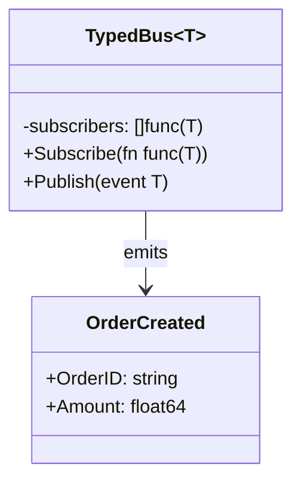

<!-- tags: design-pattern, behavioral, oop, observer -->
# 👁️ Observer

> You possess an "order.created" event that must trigger emails, analytics, inventory updates, and audit logs. If the publisher calls each service directly, every new subscriber forces the publisher to rewrite its code. If subscribers poll continuously, the app burns resources and sacrifices real-time reactivity.

📅 Created: 2026-03-19 · 🔄 Updated: 2026-04-02 · ⏱️ 20 min read

| Aspect | Detail |
| ------ | ------ |
| **Group** | Behavioral |
| **Purpose** | Allow multiple subscribers to react dynamically when a subject changes |
| **Go idiom** | Callback registries, channels, simple event buses |
| **SOLID** | Open/Closed, Dependency Inversion |
| **Confused with** | Mediator, Event Sourcing |

---

## 1. DEFINE

Imagine an order shifts states. Email, analytics, loyalty, and audit services must react instantly. If the producer must memorize every subscriber to call them manually, each new event thickens the coupling across modules.

Observer tackles the one-to-many communication problem. A publisher knows an event occurred, but it categorically ignores who reacts to it. Meanwhile, subscribers register their interest and receive notifications automatically upon event triggers, eliminating the need for aggressive polling.

`Observer` erects a subscription mechanism bridging the subject and observers. Whenever the subject alters its state or emits an event, the system notifies all registered observers.

Core insight: **Observer completely isolates the event producer from the event consumer while retaining push-based reactivity.**

### 1.1 Vocabulary

| Concept | Role |
| --------- | ------- |
| **Subject / Publisher** | The source emitting the event or state change |
| **Observer / Subscriber** | The entity receiving the notification |
| **Subscription** | The registered relationship linking both parties |

### 1.2 Observer vs Mediator vs Event Sourcing

| Pattern | Primary Goal |
| ------- | -------- |
| **Observer** | Notifies subscribers one-way during an event or state change |
| **Mediator** | Coordinates complex, bidirectional interactions among numerous peers |
| **Event Sourcing** | Persists the entire stream of events as the ultimate source of truth |

### 1.3 Failure Modes

- Publishers lock mutexes while notifying observers, sparking deadlocks or blocking fan-outs.
- A single crashing subscriber destroys the entire notification chain.
- Failing to provide an unsubscribe or cleanup mechanism triggers massive subscriber leaks.

---

These failure modes sound obvious. However, a trap exists. Holding a lock during notifications creates severe deadlocks. Crashing subscribers shatter the entire publish path. This trap appears in PITFALLS.

## 2. VISUAL

Observer sounds simple: subscribe, then notify. Production systems trip over locks, crashing subscribers, and memory leaks. The image below organizes the flow and its traps.

### Overview — Publisher → Fan-out → Go Idiom



*Figure: The Publisher maintains a registry, snapshots it prior to notifying, and isolates errors per subscriber. Holding a lock during notification guarantees deadlocks.*

### Level 1 — Fan-out Subscription

```text
Subject
  ├── EmailObserver
  ├── AnalyticsObserver
  └── InventoryObserver
```

*Figure: The publisher merely acknowledges it must notify a list of observers. It strictly ignores the intricate logic of each subscriber.*

### Level 2 — Publish Lifecycle



*Figure: The publisher speaks to the subject or event bus exactly once. The fan-out to multiple observers occurs internally within the observation boundary.*

### UML — Observer Class Structure



*The Publisher (Subject) maintains a list of Subscribers (Observers). When the state changes, the Publisher notifies all subscribers. The Subscriber interface declares the update method—each ConcreteSubscriber reacts uniquely.*

---

## 3. CODE

The diagrams separate boundaries clearly. The code reveals how `👁️ Observer` defines stable contracts while exposing flexible integration points.

### Example 1: Basic — Type-Safe Event Bus

> **Goal**: Engineer a simple event bus with subscribe, unsubscribe, and publish capabilities.



> **Approach**: Utilize a registry mapping event types to handlers, taking care to copy handlers before executing notifications.
> **Example**: `order.created` instantly notifies email and analytics systems.
> **Complexity**: `Subscribe` hits O(1). `Publish` hits O(n) scaled by the subscriber count for that specific event type.

```go
// event_bus_observer.go — Observer Pattern: publish to many subscribers safely
package observerdemo

import "sync"

type Event struct {
	Type string
	Data map[string]any
}

type HandlerID int
type Handler func(Event)

type EventBus struct {
	mu       sync.RWMutex
	nextID   HandlerID
	handlers map[string]map[HandlerID]Handler
}

func NewEventBus() *EventBus {
	return &EventBus{handlers: map[string]map[HandlerID]Handler{}}
}

func (b *EventBus) Subscribe(eventType string, handler Handler) HandlerID {
	b.mu.Lock()
	defer b.mu.Unlock()
	b.nextID++
	if b.handlers[eventType] == nil {
		b.handlers[eventType] = map[HandlerID]Handler{}
	}
	b.handlers[eventType][b.nextID] = handler
	return b.nextID
}

func (b *EventBus) Unsubscribe(eventType string, id HandlerID) {
	b.mu.Lock()
	defer b.mu.Unlock()
	delete(b.handlers[eventType], id)
}

func (b *EventBus) Publish(eventType string, data map[string]any) {
	b.mu.RLock()
	snapshot := make([]Handler, 0, len(b.handlers[eventType]))
	for _, handler := range b.handlers[eventType] {
		snapshot = append(snapshot, handler)
	}
	b.mu.RUnlock()

	event := Event{Type: eventType, Data: data}
	for _, handler := range snapshot {
		handler(event)
	}
}
```
```typescript
// event_bus_observer.ts — Observer Pattern: publish to many subscribers safely
type Event = { type: string; data: Record<string, unknown> };
type Handler = (event: Event) => void;
```
```java
// EventBusObserver.java — Observer Pattern: publish to many subscribers safely
record Event(String type, java.util.Map<String, Object> data) {}
```
```rust
// event_bus_observer.rs — Observer Pattern: publish to many subscribers safely
use std::collections::HashMap;
struct Event {
    event_type: String,
    data: HashMap<String, String>,
}
```
```cpp
// event_bus_observer.cpp — Observer Pattern: publish to many subscribers safely
struct Event {
    std::string type;
};
```
```python
# event_bus_observer.py — Observer Pattern: publish to many subscribers safely
from dataclasses import dataclass


@dataclass
class Event:
    type: str
    data: dict
```

Conclusion: The Basic Observer delivers immense value the exact moment a publisher no longer requires knowledge of its downstream consumers.

Event buses work well. However, subscriptions demand domain context. Let's add them.

### Example 2: Intermediate — Inventory Restock Subscription

> **Goal**: Notify highly specific users when a targeted product returns to stock.



> **Approach**: The subject retains subscribers explicitly categorized by product ID.
> **Example**: User A subscribes exclusively to SKU-1; User B subscribes to SKU-2.
> **Complexity**: `Notify` operates at O(n) scaled strictly by the subscriber count for that particular product.

```go
// restock_observer.go — Observer Pattern: per-product watchers
package restockobserver

type RestockObserver interface {
	OnRestock(productID string)
}

type WatchList struct {
	subscribers map[string][]RestockObserver
}

func NewWatchList() *WatchList {
	return &WatchList{subscribers: map[string][]RestockObserver{}}
}

func (w *WatchList) Subscribe(productID string, observer RestockObserver) {
	w.subscribers[productID] = append(w.subscribers[productID], observer)
}

func (w *WatchList) Notify(productID string) {
	for _, observer := range w.subscribers[productID] {
		observer.OnRestock(productID)
	}
}
```
```typescript
// restock_observer.ts — Observer Pattern: per-product watchers
interface RestockObserver {
  onRestock(productId: string): void;
}
```
```java
// RestockObserver.java — Observer Pattern: per-product watchers
interface RestockObserver {
    void onRestock(String productId);
}
```
```rust
// restock_observer.rs — Observer Pattern: per-product watchers
trait RestockObserver {
    fn on_restock(&self, product_id: &str);
}
```
```cpp
// restock_observer.cpp — Observer Pattern: per-product watchers
struct RestockObserver {
    virtual void on_restock(const std::string& product_id) = 0;
    virtual ~RestockObserver() = default;
};
```
```python
# restock_observer.py — Observer Pattern: per-product watchers
class RestockObserver:
    def on_restock(self, product_id: str) -> None:
        raise NotImplementedError
```

> **Why?** This represents a classic Observer use case. Subscribers focus exclusively on a minute fraction of the state space, never the entire system. The subject manages this registry of interest rather than forcing clients to poll perpetually.

Conclusion: Intermediate Observers mesh perfectly with stock alerts, UI event propagation, and webhook-style local subscriptions.

Domain subscriptions work smoothly. However, async observers demand non-blocking operations. Let's decouple them.

### Example 3: Advanced — Async Observer with Non-Blocking Publish

> **Goal**: Ensure a lagging observer never blocks the entire publishing pathway.



> **Approach**: Execute fan-outs asynchronously via goroutines and channels while snapping subscriber lists beforehand.
> **Example**: Sluggish analytics processes never halt the critical email observer.
> **Complexity**: Publish hits O(n) for enqueuing. Actual processing executes asynchronously per subscriber.

```go
// async_observer.go — Observer Pattern: asynchronous fan-out with subscriber snapshot
package asyncobserver

import "sync"

type Handler func(string)

type AsyncBus struct {
	mu       sync.RWMutex
	handlers []Handler
}

func (b *AsyncBus) Subscribe(handler Handler) {
	b.mu.Lock()
	defer b.mu.Unlock()
	b.handlers = append(b.handlers, handler)
}

func (b *AsyncBus) Publish(message string) {
	b.mu.RLock()
	snapshot := append([]Handler(nil), b.handlers...)
	b.mu.RUnlock()

	for _, handler := range snapshot {
		go handler(message)
	}
}
```
```typescript
// async_observer.ts — Observer Pattern: asynchronous fan-out with subscriber snapshot
type Handler = (message: string) => Promise<void> | void;
```
```java
// AsyncObserver.java — Observer Pattern: asynchronous fan-out with subscriber snapshot
interface Handler {
    void handle(String message);
}
```
```rust
// async_observer.rs — Observer Pattern: asynchronous fan-out with subscriber snapshot
type Handler = fn(&str);
```
```cpp
// async_observer.cpp — Observer Pattern: asynchronous fan-out with subscriber snapshot
using Handler = std::function<void(const std::string&)>;
```
```python
# async_observer.py — Observer Pattern: asynchronous fan-out with subscriber snapshot
from collections.abc import Callable
Handler = Callable[[str], None]
```

> **Why?** Production-grade Observers routinely fail because sluggish subscribers block the entire publish path. The core problem pivots from "can I notify?" to "can I notify without blowing up the publisher's latency?".

Conclusion: Advanced Observers require strict focus on lock scoping, subscriber isolation, backpressure, and lifecycle cleanup, moving far beyond basic `Subscribe()` and `Publish()` calls.

---

You observed event buses, domain subscriptions, and async observers. The danger now comes from lock deadlocks and subscriber crashes. We set up these traps earlier.

## 4. PITFALLS

The `👁️ Observer` routinely suffers misunderstanding. The pattern remains in the code, but it loses the boundary it promises. These pitfalls explain why.

| # | Severity | Error | Consequence | Fix |
|---|----------|-----|---------|-----|
| 1 | 🔴 Fatal | Holding locks during observer notifications | Devastating deadlocks or massive spikes in publisher latency | Snapshot handlers prior to notification, then execute outside the lock |
| 2 | 🔴 Fatal | A crashing subscriber ravages the entire publish path | One broken observer tears down the complete event flow | Radically isolate errors for every individual subscriber |
| 3 | 🟡 Common | Missing unsubscribe or cleanup mechanisms | Severe memory leaks or ghost subscribers stalking the system | Return handler IDs explicitly and allow unsubscription |
| 4 | 🟡 Common | Applying Observers when persistence or auditing is mandatory | Events vaporize upon process death | For durable auditing, explore Event Sourcing or durable message queues |
| 5 | 🔵 Minor | Event payloads appear overly generic | Subscribers resort to blindly guessing schemas | Enforce rigorous event contracts clearly differentiated by type |

---

You navigated the Observer pattern and its traps. The resources below provide deeper context.

## 5. REF

| Resource | Type | Link | Notes |
| -------- | ---- | ---- | ------- |
| Refactoring.Guru — Observer | Pattern catalog | https://refactoring.guru/design-patterns/observer | Canonical pattern overview |
| Go memory model & sync | Official docs | https://pkg.go.dev/sync | Critical reading to prevent lock misuse |
| Event-driven architecture references | Engineering reference | https://martinfowler.com | Explores realistic pub/sub context in production |

---

## 6. RECOMMEND

Observers dominate push-based, one-way notification scenarios. If you must persist events or coordinate active peers, alternative patterns fit significantly better.

| Explore | When to use | Reason | File/Link |
| ------- | ------- | ----- | --------- |
| Mediator | Numerous peers require complex bidirectional coordination | Two-way coordination differs completely from one-way notifications | [08-mediator.md](./08-mediator.md) |
| Command | Events require queueing, undoing, or action replays | Action lifecycles differ drastically from notifications | [03-command.md](./03-command.md) |
| Event Sourcing | You must persist and replay event streams | Pure Observers lack persistence layers entirely | — |

---

## 7. QUICK REF

| Signal | Might Observer be the right choice? |
| ------ | ---------------------- |
| A single event must notify multiple disparate consumers | ✅ Yes |
| The publisher categorically refuses to know its downstream consumers | ✅ Yes |
| You must rigorously replay or persist every event | ❌ Pure Observers fail here |
| You require a hub coordinating complex peer-to-peer logic | ❌ That demands a Mediator |

**Links**: [← Strategy](./01-strategy.md) · [→ Command](./03-command.md)
