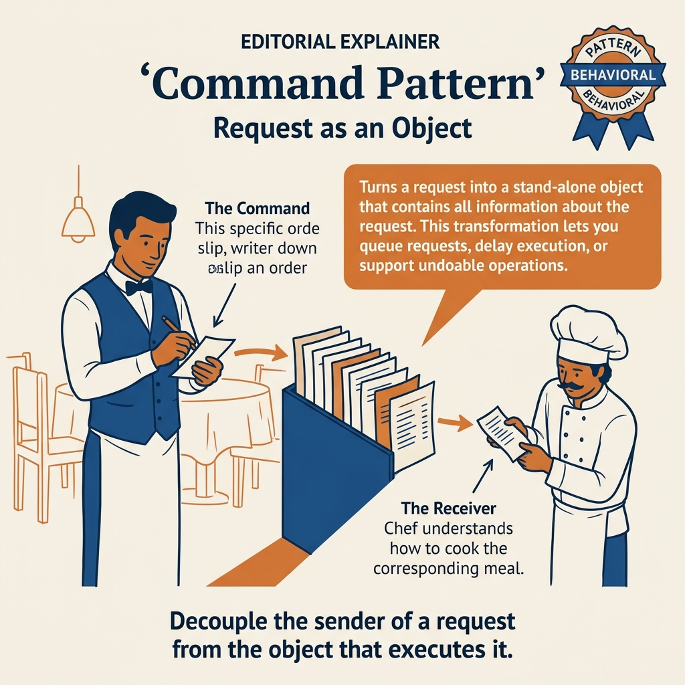
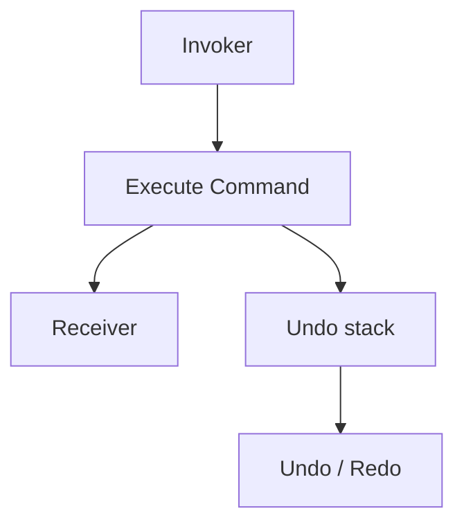
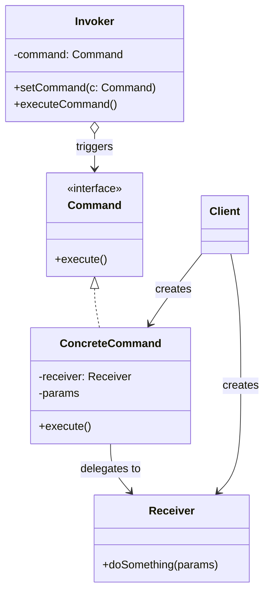
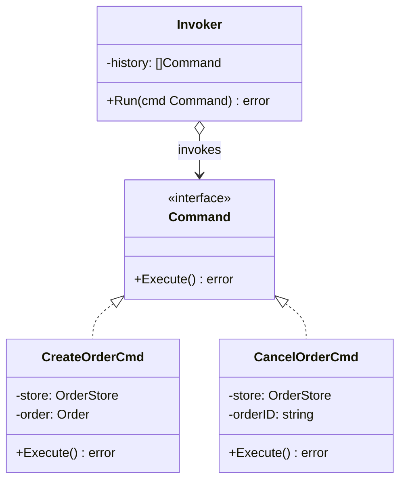
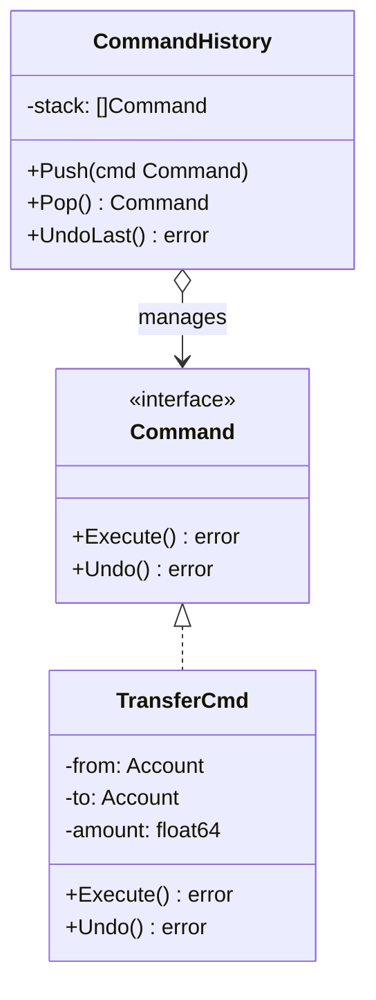
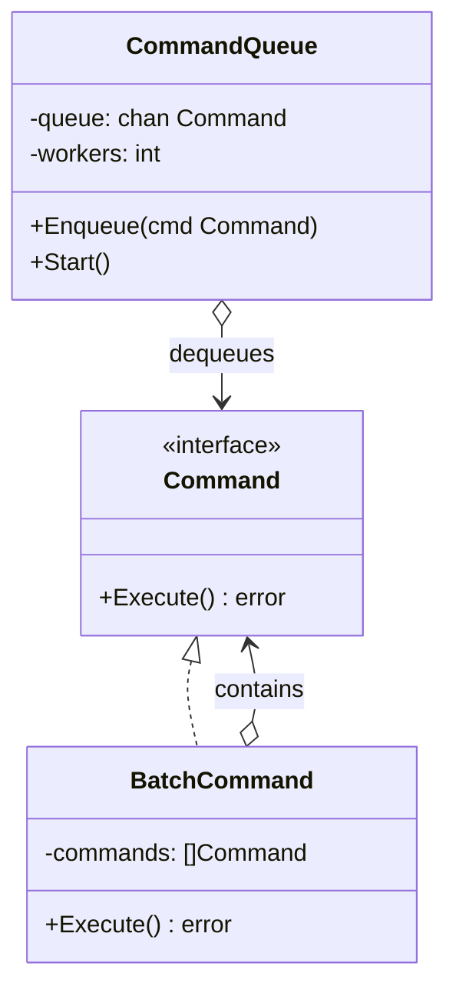

<!-- tags: design-pattern, behavioral, oop, command -->
# 📋 Command

> Operations rarely stop at "just calling a function". You frequently want to queue an action, undo it, log it, retry it, or attach it to a button, a shortcut, a cron job, or a worker queue. The exact moment a "request" demands transport as independent data, the Command pattern secures its reason to exist.

📅 Created: 2026-03-19 · 🔄 Updated: 2026-04-02 · ⏱️ 20 min read

| Aspect | Detail |
| ------ | ------ |
| **Group** | Behavioral |
| **Purpose** | Transform requests or actions into standalone objects capable of execution, queueing, undoing, and logging |
| **Go idiom** | Micro-interfaces or closure commands |
| **SOLID** | Single Responsibility, Open/Closed |
| **Confused with** | Strategy |

---

## 1. DEFINE

You must stash an action for delayed execution, retry it later, inject it into a queue, or support sweeping undo mechanics. In these moments, you do not just retain input data. You must retain the **intent of execution itself** as an independently transferable object.

Command emerges when an action requires handling as pure data: stacking it in a history log, pushing it into a queue, retrying it, tracking it for audits, or binding it to UI macros. If UI buttons, keyboard shortcuts, and API endpoints all call receiver logic directly, the act of "executing an action" clones itself chaotically across the codebase.

`Command` packages the request into an isolated object. This object fully understands how to execute, and frequently, how to undo. The Invoker requires zero understanding of detailed business logic; it merely stores and triggers the command.

Core insight: **Command completely severs the "intent to act" from the precise location and moment the action executes.**

### 1.1 Vocabulary

| Concept | Role |
| --------- | ------- |
| **Command** | The contract defining the action |
| **Concrete Command** | A highly specific executable action |
| **Receiver** | The object actually performing the heavy lifting |
| **Invoker** | The entity triggering the command or managing the history/queue |

### 1.2 Command vs Strategy

| Pattern | What does it encapsulate? |
| ------- | ------------------- |
| **Command** | A distinct request or action |
| **Strategy** | An overarching algorithm or policy |

### 1.3 Failure Modes

- The command neglects to store adequate state to facilitate an undo.
- The invoker learns excessive details about the receiver, annihilating the pattern's value.
- Teams force Command into scenarios requiring only immediate, simple function calls lacking any queue, history, or logging needs.

---

These failure modes sound basic. However, a trap exists. A command failing to store state creates flawed or impossible undo mechanics. An invoker memorizing the receiver destroys loose coupling. This trap appears in PITFALLS.

## 2. VISUAL

Command sounds like "packaging a function". Its actual value revolves entirely around lifecycles: queueing, undoing, logging, and replaying. The image below isolates the flow and contrasts it sharply against Strategy.

### Overview — Command as Object with Lifecycle



*Figure: Command = action as data, supporting Execute + Undo. Invokers remain utterly ignorant of receiver details. While Strategy swaps algorithms, Command dictates lifecycles.*

### Level 1 — Action Object Boundary

```text
Button / Queue / Scheduler
  │
  ▼
Command
  │
  ▼
Receiver
```

*Figure: The invoker refuses to learn business logic details; it merely understands "I possess a command to execute."*

### Level 2 — History Stack



*Figure: Once an action morphs into an object, tracking history and executing replays become incredibly natural.*

### UML — Command Class Structure



*The Invoker triggers the command. The Command interface dictates execute(). The ConcreteCommand holds a reference to the Receiver and delegates execution. The Client generates the command, attaches the receiver, and hands it to the invoker.*

---

## 3. CODE

The diagrams map boundaries. The code reveals how `📋 Command` establishes unyielding contracts and permits flexible execution.

### Example 1: Basic — Text Editor Commands

> **Goal**: Package insert and delete operations into commands supporting explicit undo logic.



> **Approach**: `Execute` and `Undo` live collectively upon the command object.
> **Example**: The editor inserts text and seamlessly undoes it.
> **Complexity**: O(n) scaling directly with the receiver's string manipulation costs.

```go
// editor_command.go — Command Pattern: encapsulate editor actions with undo
package commanddemo

type Command interface {
	Execute()
	Undo()
}

type Editor struct {
	Content string
}

func (e *Editor) Insert(text string, pos int) {
	e.Content = e.Content[:pos] + text + e.Content[pos:]
}

func (e *Editor) Delete(pos, length int) string {
	deleted := e.Content[pos : pos+length]
	e.Content = e.Content[:pos] + e.Content[pos+length:]
	return deleted
}

type InsertCommand struct {
	editor *Editor
	text   string
	pos    int
}

func (c *InsertCommand) Execute() { c.editor.Insert(c.text, c.pos) }
func (c *InsertCommand) Undo()    { c.editor.Delete(c.pos, len(c.text)) }
```
```typescript
// editor_command.ts — Command Pattern: encapsulate editor actions with undo
interface Command {
  execute(): void;
  undo(): void;
}
```
```java
// EditorCommand.java — Command Pattern: encapsulate editor actions with undo
interface Command {
    void execute();
    void undo();
}
```
```rust
// editor_command.rs — Command Pattern: encapsulate editor actions with undo
trait Command {
    fn execute(&mut self);
    fn undo(&mut self);
}
```
```cpp
// editor_command.cpp — Command Pattern: encapsulate editor actions with undo
struct Command {
    virtual void execute() = 0;
    virtual void undo() = 0;
    virtual ~Command() = default;
};
```
```python
# editor_command.py — Command Pattern: encapsulate editor actions with undo
class Command:
    def execute(self) -> None:
        raise NotImplementedError
    def undo(self) -> None:
        raise NotImplementedError
```

Conclusion: Basic Commands justify their usage strictly when actions require a distinct lifecycle, fundamentally transcending a standard function call.

Editor commands work smoothly. However, job queues demand deferred execution. Let's queue them.

### Example 2: Intermediate — Job Queue Command

> **Goal**: Queue actions allowing workers to execute them subsequently, entirely decoupled from the caller's request timeline.



> **Approach**: The queue holds `Command` interfaces. The worker blindly executes each command.
> **Example**: Exporting reports, dispatching emails, or rebuilding caches.
> **Complexity**: Enqueueing hits O(1). Execution costs vary wildly based on the specific command.

```go
// queue_command.go — Command Pattern: queue executable jobs uniformly
package queuecommand

type Command interface {
	Execute() error
}

type EmailJob struct{ To string }
func (c EmailJob) Execute() error { return nil }

type CacheRebuildJob struct{ Key string }
func (c CacheRebuildJob) Execute() error { return nil }

type WorkerQueue struct {
	queue []Command
}

func (w *WorkerQueue) Enqueue(cmd Command) {
	w.queue = append(w.queue, cmd)
}

func (w *WorkerQueue) Drain() error {
	for _, cmd := range w.queue {
		if err := cmd.Execute(); err != nil {
			return err
		}
	}
	w.queue = nil
	return nil
}
```
```typescript
// queue_command.ts — Command Pattern: queue executable jobs uniformly
interface Command {
  execute(): Promise<void>;
}
```
```java
// QueueCommand.java — Command Pattern: queue executable jobs uniformly
interface Command {
    void execute() throws Exception;
}
```
```rust
// queue_command.rs — Command Pattern: queue executable jobs uniformly
trait Command {
    fn execute(&self) -> Result<(), String>;
}
```
```cpp
// queue_command.cpp — Command Pattern: queue executable jobs uniformly
struct Command {
    virtual void execute() = 0;
    virtual ~Command() = default;
};
```
```python
# queue_command.py — Command Pattern: queue executable jobs uniformly
class Command:
    def execute(self) -> None:
        raise NotImplementedError
```

> **Why?** At this juncture, Command escapes UI demos and dominates real backend infrastructure. The queue only cares about `Execute()`. It ignores whether the job exports data, sends an email, or flushes a cache. When an action morphs into data, asynchronous processing feels perfectly natural.

Conclusion: Intermediate Commands integrate brilliantly with worker queues, delayed job processing, undo stacks, and macro recordings.

Job queues work well. However, Go closure commands deliver supreme brevity. Let's use funcs.

### Example 3: Advanced — Closure Command in Go

> **Goal**: Deploy closures instead of class-heavy commands when actions remain remarkably small.



> **Approach**: Leverage `type Command func() error`.
> **Example**: Batching multiple isolated steps into a massive macro.
> **Complexity**: O(k) scaling with the total commands inside the macro block.

```go
// closure_command.go — Command Pattern: Go-style function commands
package closurecommand

type Command func() error

type Macro struct {
	commands []Command
}

func (m *Macro) Add(cmd Command) {
	m.commands = append(m.commands, cmd)
}

func (m Macro) Execute() error {
	for _, cmd := range m.commands {
		if err := cmd(); err != nil {
			return err
		}
	}
	return nil
}
```
```typescript
// closure_command.ts — Command Pattern: function commands
type Command = () => Promise<void>;
```
```java
// ClosureCommand.java — Command Pattern: function commands
interface Command {
    void execute() throws Exception;
}
```
```rust
// closure_command.rs — Command Pattern: function commands
type Command = fn() -> Result<(), String>;
```
```cpp
// closure_command.cpp — Command Pattern: function commands
#include <functional>
using Command = std::function<void()>;
```
```python
# closure_command.py — Command Pattern: function commands
from collections.abc import Callable
Command = Callable[[], None]
```

> **Why?** Commands in Go absolutely do not require rigid structs enforcing `Execute/Undo`. If the sole requirement revolves around packaging actions for queueing, batching, or retrying, closure commands deliver radically shorter, idiomatic solutions.

Conclusion: Advanced Commands demand that you select the exact "shape" of your command: objects for heavy state or undo logic, closures for tiny, rapid actions.

---

You observed editor, job queue, and closure commands. The danger now comes from missing undo states and receiver coupling. We set up these traps earlier.

## 4. PITFALLS

When applying `📋 Command` to real codebases, errors rarely trace back to the pattern name. They trace back to mismanaged boundaries and severe overuse. The following missteps dominate codebase failures.

| # | Severity | Error | Consequence | Fix |
|---|----------|-----|---------|-----|
| 1 | 🔴 Fatal | Commands fail to stash adequate state required for undo logic | Undos execute incorrectly or fail entirely | Ruthlessly capture adequate state strictly before execution |
| 2 | 🔴 Fatal | The invoker memorizes excessive details about the receiver | The pattern completely sacrifices loose coupling | Confine the invoker strictly to the core command contract |
| 3 | 🟡 Common | Applying Commands to trivial actions lacking queue, history, or logging requirements | Pure, useless ceremony | Inject the pattern solely when actions genuinely demand independent lifecycles |
| 4 | 🟡 Common | Macro commands lack robust rollback or error policies | Flows halt midway, abandoning the system in ambiguous states | Enforce rigid transaction and compensation strategies |
| 5 | 🔵 Minor | Forcing every command into a brutally heavy object | Verbosity spirals out of control unnecessarily | Within Go, lean aggressively towards lightweight closure commands |

---

You navigated the Command pattern and its traps. The resources below provide deeper context.

## 5. REF

| Resource | Type | Link | Notes |
| -------- | ---- | ---- | ------- |
| Refactoring.Guru — Command | Pattern catalog | https://refactoring.guru/design-patterns/command | Canonical pattern structure |
| Effective Go | Official docs | https://go.dev/doc/effective_go | Function values and closure idioms |
| Fowler on UI and actions | Engineering reference | https://martinfowler.com | Context on commands and history within real-world applications |

---

## 6. RECOMMEND

Commands shine fiercely when actions demand independent lifecycles. If the pain point involves swapping algorithms or navigating state machines, other patterns align far better.

| Explore | When to use | Reason | File/Link |
| ------- | ------- | ----- | --------- |
| Strategy | The pain point centers entirely on swapping algorithms | Swapping algorithms diverges starkly from action lifecycles | [01-strategy.md](./01-strategy.md) |
| State | Behavior transitions automatically following internal lifecycles | State machines differ fundamentally from isolated request objects | [05-state.md](./05-state.md) |
| Memento | Undoing translates to restoring a snapshot rather than reversing an operation | Snapshots clash directly with reverse commands | [09-memento.md](./09-memento.md) |

---

## 7. QUICK REF

| Signal | Might Command be the right choice? |
| ------ | --------------------- |
| The action demands queueing, undoing, logging, or replaying | ✅ Yes |
| You must definitively decouple the invoker from the receiver | ✅ Yes |
| You solely wish to swap an algorithm | ❌ That implies a Strategy |
| You simply require a fast, immediate function call | ❌ You likely do not need this pattern |

**Links**: [← Observer](./02-observer.md) · [→ Template Method](./04-template.md)
