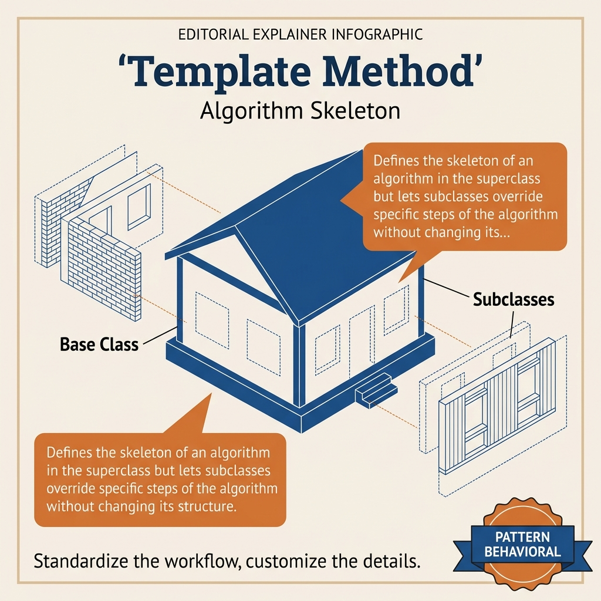
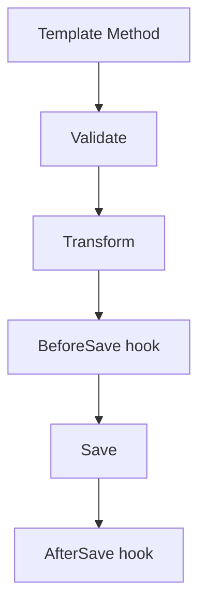
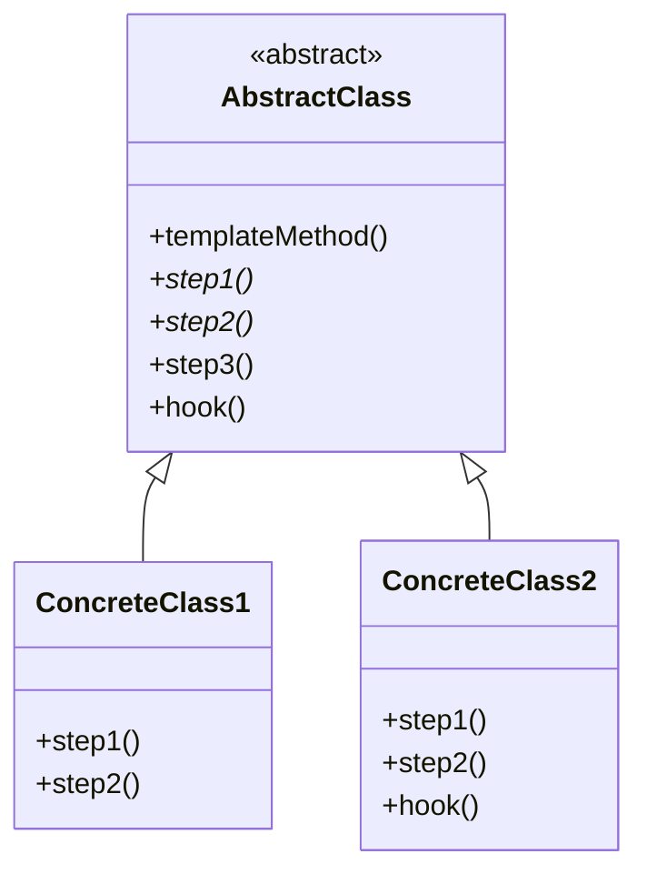
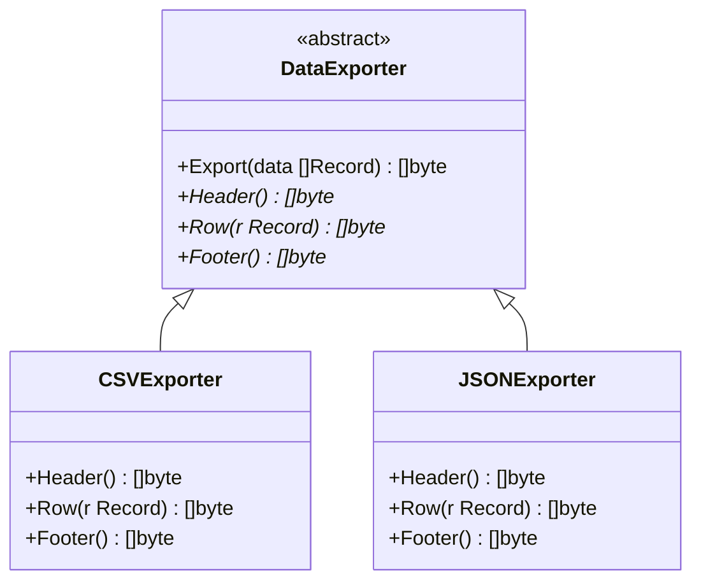
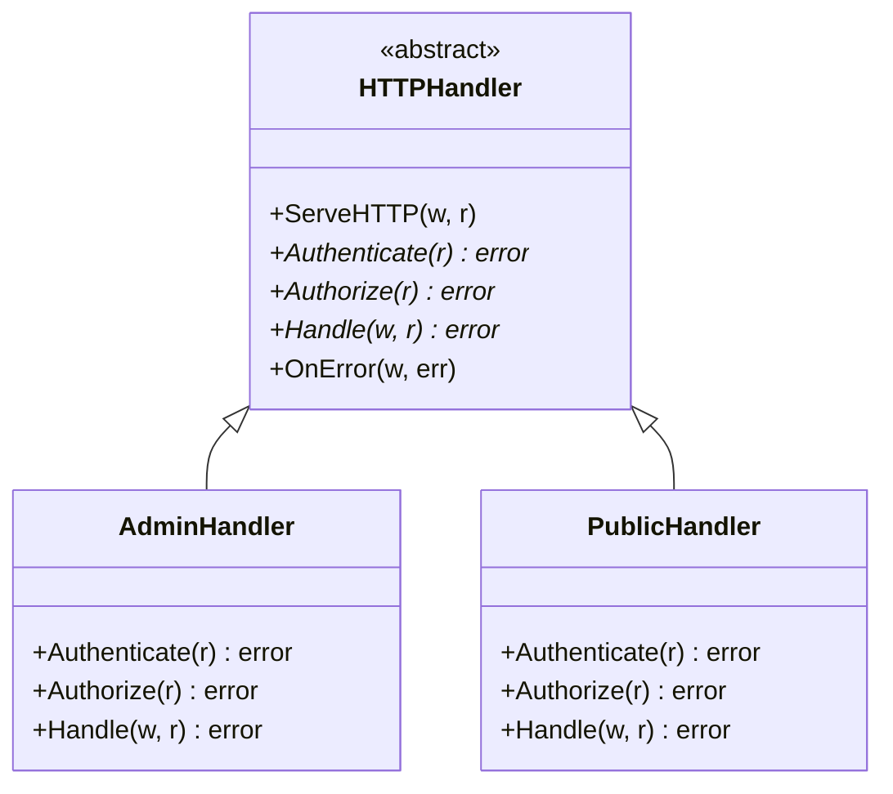
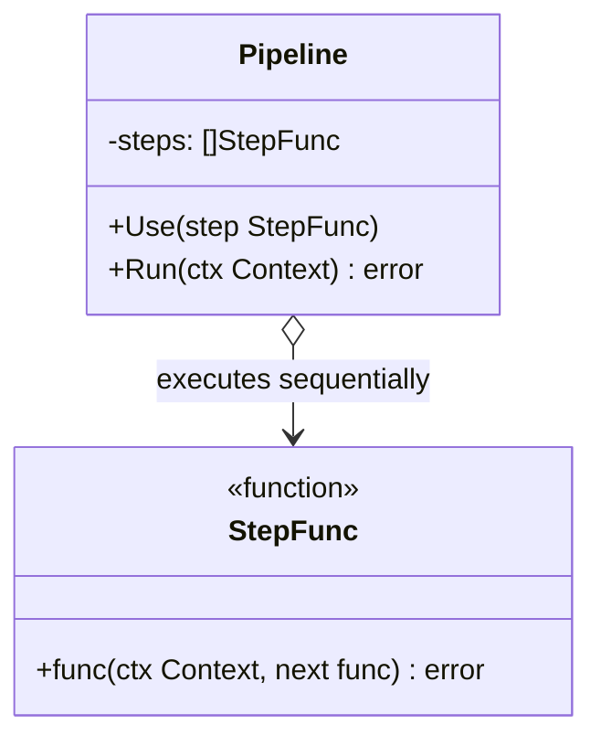

<!-- tags: design-pattern, behavioral, oop, template-method -->
# 📐 Template Method

> You possess numerous pipelines sharing an identical skeleton: validate → transform → save → notify. Each variant only differs in a few specific steps. If you copy the entire skeleton for every pipeline, you will eventually have to apply the same bug fix in 4 or 5 different places just because each one differs by 20%.

📅 Created: 2026-03-19 · 🔄 Updated: 2026-04-02 · ⏱️ 20 min read

| Aspect | Detail |
| ------ | ------ |
| **Group** | Behavioral |
| **Purpose** | Freeze the skeleton of an algorithm while permitting specific steps to vary |
| **Go idiom** | Interfaces alongside a base orchestration struct, or function hooks |
| **SOLID** | Open/Closed, Hollywood Principle |
| **Confused with** | Strategy |

---

## 1. DEFINE

Imagine an ETL pipeline or an import process where the skeleton remains rigidly identical: validate, transform, persist, report. If every team copies the entire flow and edits a few minor steps, the differences bury themselves in massive, hard-to-spot duplication.

Template Method shines when the overarching algorithm remains almost entirely fixed, yet a few internal steps must change depending on the data type, processing channel, or use case. The pain point is not "we have completely different algorithms," but rather "we copy-paste the exact same skeleton because a few steps differ."

The `Template Method` locks the skeleton inside a base flow. It delegates the variable steps to specific implementations or hooks. Consequently, the overall sequence of the process never breaks, while variations retain a safe space to expand.

Core insight: **Template Method does not alter the entire algorithm; it freezes the process skeleton and strictly opens only the designated points for modification.**

### 1.1 Vocabulary

| Concept | Role |
| --------- | ------- |
| **Template Method** | The fixed skeleton of the algorithm |
| **Primitive Operation** | A mandatory step the variant must provide |
| **Hook** | An optional step featuring a default behavior |

### 1.2 Template Method vs Strategy

| Pattern | What changes? |
| ------- | ---------------- |
| **Template Method** | A few specific steps within a rigid skeleton |
| **Strategy** | The entire algorithm or policy |

### 1.3 Failure Modes

- Freezing the skeleton prematurely before it achieves genuine stability.
- Exposing too many hook points, rendering the skeleton meaningless.
- Forcing the caller to determine the step order manually, nullifying the template entirely.

---

These failure modes sound avoidable. However, a trap exists. Locking down an unstable skeleton guarantees painful refactoring later. Opening too many hook points causes the base class to lose all control. This trap appears in PITFALLS.

## 2. VISUAL

Template Method sounds like "a parent class calling a child class." The correct perspective is: the skeleton remains unbreakable; only marked points open up. The image below clarifies this.

### Overview — Fixed Skeleton, Open Steps



*Figure: The skeleton holds the step order rigidly. Only Validate, Transform, BeforeSave, and AfterSave act as open points. If the caller selects the entire algorithm, you are looking at a Strategy.*

### Level 1 — Fixed Skeleton

```text
Process()
  1. Validate()
  2. Transform()
  3. Save()
  4. Notify()
```

*Figure: The caller exclusively interacts with a single `Process()` entry point, while the internal skeleton remains completely locked.*

### Level 2 — Hooks and Variable Steps



*Figure: Not every step opens for overriding. Only the variable points become primitive operations or hooks.*

### UML — Template Method Class Structure



*The AbstractClass declares templateMethod() containing the rigid skeleton that invokes step methods. Subclasses override step1() and step2() without altering the skeleton. The hook method serves as an optional override.*

---

## 3. CODE

The diagrams separate boundaries clearly. The code reveals how `📐 Template Method` leverages interfaces and composition without leaking decisions to the caller.

### Example 1: Basic — Data Processing Pipeline

> **Goal**: Lock the data processing skeleton while modifying individual steps based on the input type.



> **Approach**: The base pipeline orchestrates the flow. The concrete processor supplies the step logic.
> **Example**: Both CSV and JSON execute the exact same `validate -> transform -> save` flow.
> **Complexity**: O(s) representing the steps, plus the cost of each specific implementation.

```go
// data_pipeline_template.go — Template Method Pattern: fixed pipeline with variable steps
package templatedemo

type Processor interface {
	Validate(data []byte) error
	Transform(data []byte) ([]byte, error)
	Save(data []byte) error
}

type Pipeline struct {
	processor Processor
}

func (p Pipeline) Process(data []byte) error {
	if err := p.processor.Validate(data); err != nil {
		return err
	}
	transformed, err := p.processor.Transform(data)
	if err != nil {
		return err
	}
	return p.processor.Save(transformed)
}

type CSVProcessor struct{}
func (CSVProcessor) Validate(data []byte) error { return nil }
func (CSVProcessor) Transform(data []byte) ([]byte, error) { return data, nil }
func (CSVProcessor) Save(data []byte) error { return nil }
```
```typescript
// data_pipeline_template.ts — Template Method Pattern: fixed pipeline with variable steps
interface Processor {
  validate(data: Uint8Array): void;
  transform(data: Uint8Array): Uint8Array;
  save(data: Uint8Array): void;
}
```
```java
// DataPipelineTemplate.java — Template Method Pattern: fixed pipeline with variable steps
interface Processor {
    void validate(byte[] data) throws Exception;
    byte[] transform(byte[] data) throws Exception;
    void save(byte[] data) throws Exception;
}
```
```rust
// data_pipeline_template.rs — Template Method Pattern: fixed pipeline with variable steps
trait Processor {
    fn validate(&self, data: &[u8]) -> Result<(), String>;
    fn transform(&self, data: &[u8]) -> Result<Vec<u8>, String>;
    fn save(&self, data: &[u8]) -> Result<(), String>;
}
```
```cpp
// data_pipeline_template.cpp — Template Method Pattern: fixed pipeline with variable steps
struct Processor {
    virtual void validate(const std::string& data) = 0;
    virtual std::string transform(const std::string& data) = 0;
    virtual void save(const std::string& data) = 0;
    virtual ~Processor() = default;
};
```
```python
# data_pipeline_template.py — Template Method Pattern: fixed pipeline with variable steps
class Processor:
    def validate(self, data: bytes) -> None:
        raise NotImplementedError
```

Conclusion: Basic Template Methods shine when the processing order remains virtually immutable, and variation strictly lives within the step logic.

Data pipelines work well. However, import jobs demand hooks. Let's open extension points.

### Example 2: Intermediate — Import Job with Hooks

> **Goal**: Inject pre- and post-save hooks without shattering the primary skeleton.



> **Approach**: The template flow calls optional hooks containing no-op defaults.
> **Example**: Audit imports require a specific `BeforeSave` hook. Standard imports ignore it.
> **Complexity**: O(s) reflecting the number of steps within the flow.

```go
// import_job_template.go — Template Method Pattern: fixed flow with optional hooks
package importtemplate

type Importer interface {
	Validate([]byte) error
	Transform([]byte) ([]byte, error)
	Save([]byte) error
	BeforeSave([]byte) error
	AfterSave() error
}

type Job struct {
	importer Importer
}

func (j Job) Run(data []byte) error {
	if err := j.importer.Validate(data); err != nil { return err }
	normalized, err := j.importer.Transform(data)
	if err != nil { return err }
	if err := j.importer.BeforeSave(normalized); err != nil { return err }
	if err := j.importer.Save(normalized); err != nil { return err }
	return j.importer.AfterSave()
}
```
```typescript
// import_job_template.ts — Template Method Pattern: fixed flow with optional hooks
interface Importer {
  validate(data: Uint8Array): void;
  transform(data: Uint8Array): Uint8Array;
  save(data: Uint8Array): void;
  beforeSave(data: Uint8Array): void;
  afterSave(): void;
}
```
```java
// ImportJobTemplate.java — Template Method Pattern: fixed flow with optional hooks
interface Importer {
    void validate(byte[] data) throws Exception;
    byte[] transform(byte[] data) throws Exception;
    void beforeSave(byte[] data) throws Exception;
    void save(byte[] data) throws Exception;
    void afterSave() throws Exception;
}
```
```rust
// import_job_template.rs — Template Method Pattern: fixed flow with optional hooks
trait Importer {
    fn validate(&self, data: &[u8]) -> Result<(), String>;
    fn transform(&self, data: &[u8]) -> Result<Vec<u8>, String>;
    fn before_save(&self, data: &[u8]) -> Result<(), String>;
    fn save(&self, data: &[u8]) -> Result<(), String>;
    fn after_save(&self) -> Result<(), String>;
}
```
```cpp
// import_job_template.cpp — Template Method Pattern: fixed flow with optional hooks
struct Importer {
    virtual void validate(const std::string& data) = 0;
    virtual std::string transform(const std::string& data) = 0;
    virtual void before_save(const std::string& data) = 0;
    virtual void save(const std::string& data) = 0;
    virtual void after_save() = 0;
    virtual ~Importer() = default;
};
```
```python
# import_job_template.py — Template Method Pattern: fixed flow with optional hooks
class Importer:
    def validate(self, data: bytes) -> None: raise NotImplementedError
    def transform(self, data: bytes) -> bytes: raise NotImplementedError
    def before_save(self, data: bytes) -> None: ...
    def save(self, data: bytes) -> None: raise NotImplementedError
    def after_save(self) -> None: ...
```

> **Why?** Hooks represent the greatest strength and the greatest danger of the Template Method. They provide immense value when clear extension points exist. However, if every step morphs into a hook, the skeleton loses its rigid frame entirely.

Conclusion: Intermediate Template Methods prove incredibly valuable when the team agrees on a core skeleton but still needs a few open extension points.

Import hooks work smoothly. However, deployment pipelines demand a strict skeleton. Let's enforce it.

### Example 3: Advanced — Deployment Pipeline Skeleton

> **Goal**: Standardize the release flow across multiple services while allowing each service to define its own verify and deploy steps.



> **Approach**: Apply a template skeleton for `Build -> Verify -> Deploy -> PostDeploy`.
> **Example**: A web service and a background worker share the exact same release skeleton.
> **Complexity**: O(s) scaling with the number of steps and the cost of each individual step.

```go
// deployment_template.go — Template Method Pattern: standardize deployment skeleton
package deploymenttemplate

type Deployer interface {
	Build() error
	Verify() error
	Deploy() error
	PostDeploy() error
}

type ReleaseFlow struct {
	deployer Deployer
}

func (f ReleaseFlow) Run() error {
	if err := f.deployer.Build(); err != nil { return err }
	if err := f.deployer.Verify(); err != nil { return err }
	if err := f.deployer.Deploy(); err != nil { return err }
	return f.deployer.PostDeploy()
}
```
```typescript
// deployment_template.ts — Template Method Pattern: standardize deployment skeleton
interface Deployer {
  build(): Promise<void>;
  verify(): Promise<void>;
  deploy(): Promise<void>;
  postDeploy(): Promise<void>;
}
```
```java
// DeploymentTemplate.java — Template Method Pattern: standardize deployment skeleton
interface Deployer {
    void build() throws Exception;
    void verify() throws Exception;
    void deploy() throws Exception;
    void postDeploy() throws Exception;
}
```
```rust
// deployment_template.rs — Template Method Pattern: standardize deployment skeleton
trait Deployer {
    fn build(&self) -> Result<(), String>;
    fn verify(&self) -> Result<(), String>;
    fn deploy(&self) -> Result<(), String>;
    fn post_deploy(&self) -> Result<(), String>;
}
```
```cpp
// deployment_template.cpp — Template Method Pattern: standardize deployment skeleton
struct Deployer {
    virtual void build() = 0;
    virtual void verify() = 0;
    virtual void deploy() = 0;
    virtual void post_deploy() = 0;
    virtual ~Deployer() = default;
};
```
```python
# deployment_template.py — Template Method Pattern: standardize deployment skeleton
class Deployer:
    def build(self) -> None: raise NotImplementedError
    def verify(self) -> None: raise NotImplementedError
    def deploy(self) -> None: raise NotImplementedError
    def post_deploy(self) -> None: raise NotImplementedError
```

> **Why?** The Template Method exhibits true enterprise value here. Every team demands an identical release skeleton, yet every service dictates vastly different verify and deploy details. The skeleton guarantees consistency, while the step implementations provide flexibility.

Conclusion: Advanced Template Methods dominate when an organization must standardize a process but explicitly permit service-specific implementations.

---

You observed data pipelines, import hooks, and deployment skeletons. The danger now comes from premature skeletons and hook explosions. We set up these traps earlier.

## 4. PITFALLS

The `Template Method` routinely suffers misunderstanding. The pattern remains in the code, but it loses the boundary it promises. These pitfalls explain why.

| # | Severity | Error | Consequence | Fix |
|---|----------|-----|---------|-----|
| 1 | 🔴 Fatal | Locking down a skeleton before it achieves stability | Severe pain during subsequent refactoring | Introduce the template only after the flow stabilizes sufficiently |
| 2 | 🔴 Fatal | Exposing an excessive number of hook points | The base class and skeleton lose all meaning | Strictly open only the points featuring genuine variation |
| 3 | 🟡 Common | Applying Template Method when the caller requires swapping the entire algorithm at runtime | Warping the pattern's core semantics | If the caller picks the algorithm, utilize Strategy |
| 4 | 🟡 Common | The caller manually triggers individual steps outside the template | Shattering the protective skeleton | Force the caller to use the template entry point as the sole path |
| 5 | 🔵 Minor | Go implementations forcing rigidly strict inheritance styles | Sacrificing idiomatic Go | Leverage interfaces and logical hook compositions instead |

---

You navigated the Template Method and its traps. The resources below provide deeper context.

## 5. REF

| Resource | Type | Link | Notes |
| -------- | ---- | ---- | ------- |
| Refactoring.Guru — Template Method | Pattern catalog | https://refactoring.guru/design-patterns/template-method | Canonical explanation |
| Effective Go | Official docs | https://go.dev/doc/effective_go | Composition-oriented design in Go |
| Hollywood Principle references | Engineering reference | https://martinfowler.com | Context on the "Don’t call us, we’ll call you" paradigm |

---

## 6. RECOMMEND

Template Method commands immense power when a skeleton reaches enough stability to warrant standardization. If you must swap an entire algorithm or allow behavior to transition based on internal state, alternative directions fit better.

| Explore | When to use | Reason | File/Link |
| ------- | ------- | ----- | --------- |
| Strategy | The caller must swap the entire algorithm at runtime | A full swap differs completely from isolated skeleton steps | [01-strategy.md](./01-strategy.md) |
| State | Behavior alters according to internal state machines | Self-transitions differ entirely from fixed skeletons | [05-state.md](./05-state.md) |
| Chain of Responsibility | You require a pipeline capable of short-circuiting | Dynamic chains contrast sharply with frozen flows | [07-chain-of-responsibility.md](./07-chain-of-responsibility.md) |

---

## 7. QUICK REF

| Signal | Might Template Method be the right choice? |
| ------ | ----------------------------- |
| A fixed skeleton exists, with only a few specific steps changing | ✅ Yes |
| You must standardize a flow across multiple disparate implementations | ✅ Yes |
| You require a runtime swap of the entire algorithm | ❌ That implies Strategy |
| The flow remains unclear and changes constantly | ❌ Avoid freezing it prematurely |

**Links**: [← Command](./03-command.md) · [→ State](./05-state.md)
