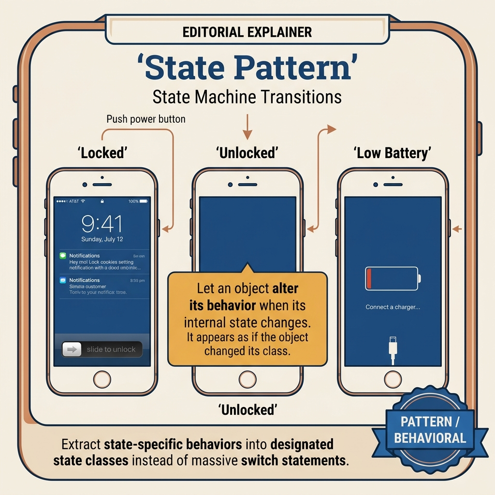
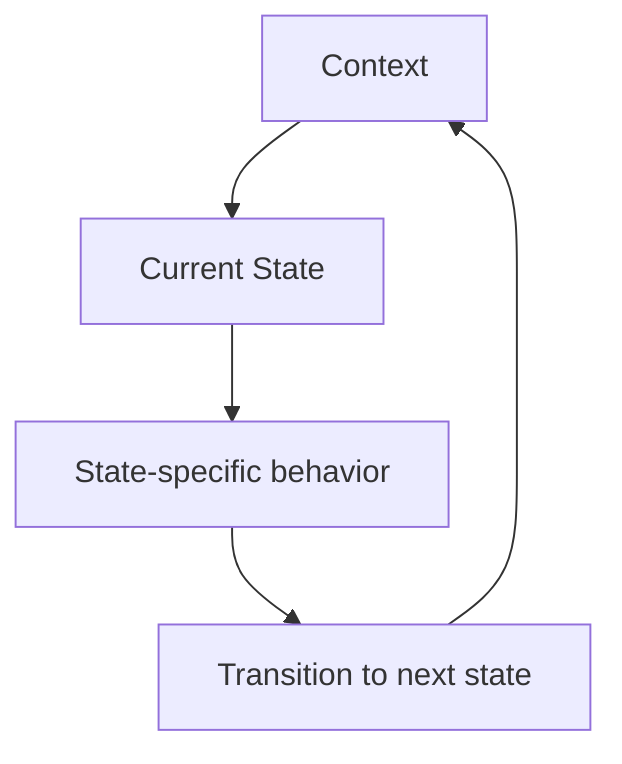
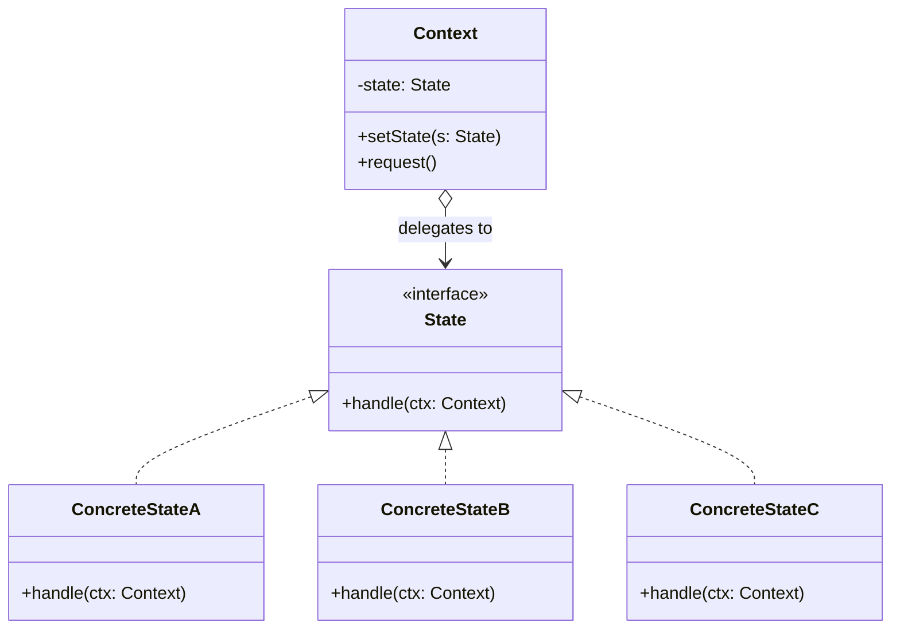
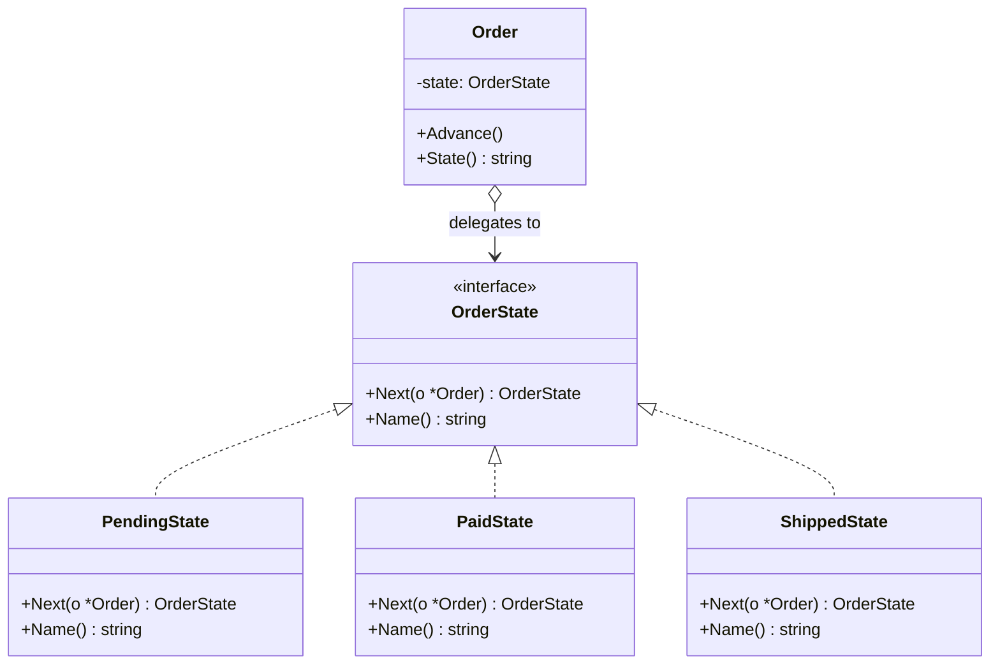
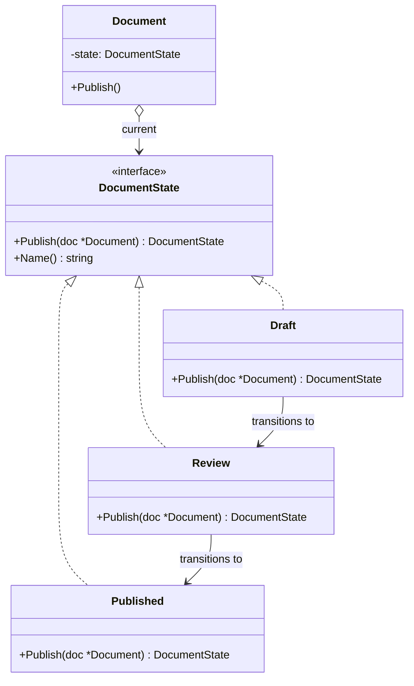
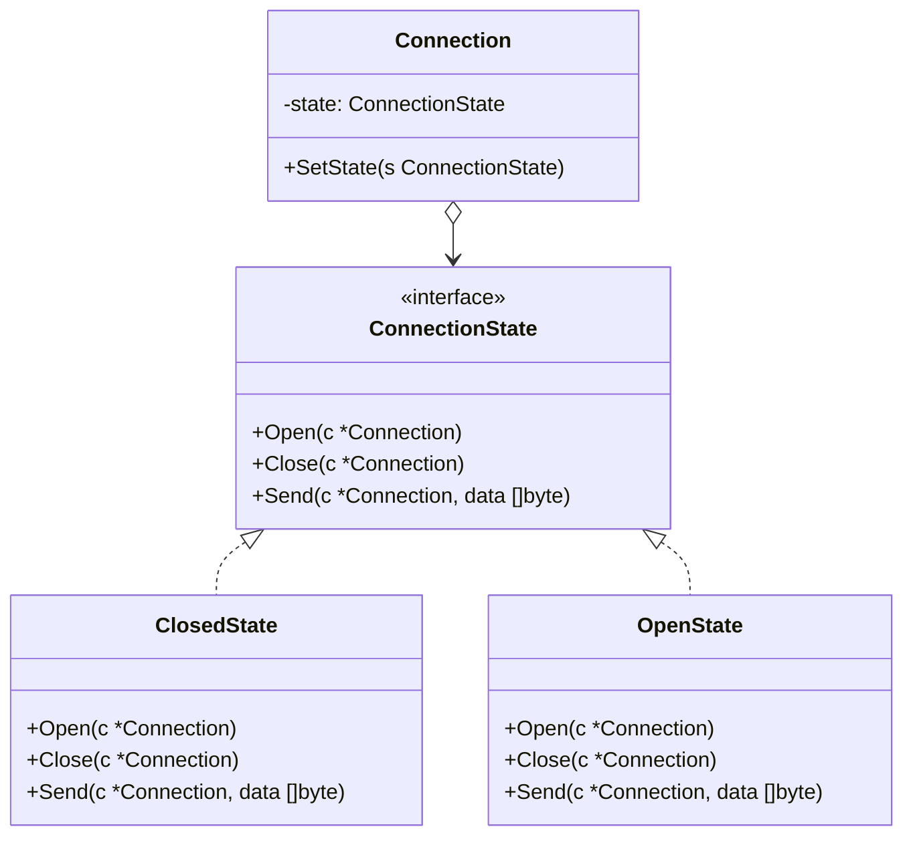

<!-- tags: design-pattern, behavioral, oop, state -->
# 🔄 State

> Certain objects alter their behavior based not only on input, but heavily on their own internal state. When logic resembling `if currentState == ...` begins piling up inside every method, the object screams to be dismantled into a proper state machine.

📅 Created: 2026-03-19 · 🔄 Updated: 2026-04-02 · ⏱️ 20 min read

| Aspect | Detail |
| ------ | ------ |
| **Group** | Behavioral |
| **Purpose** | Alter an object's behavior based strictly on its internal state |
| **Go idiom** | An interface per state paired with context delegation |
| **SOLID** | Single Responsibility, Open/Closed |
| **Confused with** | Strategy |

---

## 1. DEFINE

You stare at an object whose behavior swings wildly across its lifecycle: draft, approved, shipped, suspended. If you jam every transition rule into an `if currentState == ...` block, the code describes a state machine using fragmented conditions instead of a cohesive structure.

The State pattern targets objects whose behavior pivots on internal lifecycles: vending machines, order flows, ticket workflows, payment sessions, or subscription statuses. The standard pain point features a context burdened with 5 or 6 methods, where every single method overflows with `if state == ...`, `switch currentState`, or `cannot do X in Y`.

`State` extracts each phase into an isolated object honoring a common contract. The context holds the current state and blindly delegates actions to it. The most critical distinction: **the state itself typically dictates transitions to the next state**, unlike Strategy where an external caller chooses.

Core insight: **When behavior and transitions depend entirely on an internal lifecycle, the State pattern rips both the behavior and the transition rules out of context spaghetti.**

### 1.1 Vocabulary

| Concept | Role |
| --------- | ------- |
| **State** | The contract governing behaviors within each phase |
| **Concrete State** | The specific behaviors assigned to a single state |
| **Context** | The entity holding the current state and delegating calls |
| **Transition** | The act of shifting from one state to another |

### 1.2 State vs Strategy

| Pattern | Who shifts the behavior? |
| ------- | ---------------- |
| **State** | The object shifts autonomously following internal lifecycle events |
| **Strategy** | The caller or configuration selects the algorithm |

### 1.3 Failure Modes

- States fail to manage transitions clearly, leaving the context littered with `switch` statements.
- State objects horde excessive business data that belongs to the context.
- Teams force the State pattern onto scenarios lacking a true lifecycle, confusing it with simple, isolated policies.

---

These failure modes sound familiar. However, a trap exists. If the context retains a massive state switch, the pattern loses all meaning. If state objects hoard domain data, they become bloated and untestable. This trap appears in PITFALLS.

## 2. VISUAL

State and Strategy appear nearly identical: they share interfaces and delegation. The critical divergence lies in who decides. If the caller decides, it is Strategy. If the object shifts autonomously, it is State. The image below maps this distinction.

### Overview — State Lifecycle & Transitions



*Figure: The context retains the current state and delegates. Each state defines permitted actions and autonomously dictates transitions. The context abandons switch statements entirely.*

### Level 1 — State Machine

```text
NoCoin --insertCoin--> HasCoin --selectProduct--> Dispensing --done--> NoCoin
Dispensing --stock=0--> SoldOut
```

*Figure: An identical action invoked on the context yields drastically different results depending upon the current state.*

### Level 2 — Context Delegation



*Figure: The context refuses to hold the transition table. It delegates behavior to the current state and empowers the state to determine the next phase.*

### UML — State Class Structure



*The Context delegates behavior to the current State object. The State interface declares the methods. ConcreteStates implement behaviors for distinct phases and trigger transitions to new states.*

---

## 3. CODE

The diagrams separate boundaries clearly. The code reveals how `🔄 State` leverages interfaces and composition without leaking decisions to the caller.

### Example 1: Basic — Vending Machine

> **Goal**: Isolate the behavior of a vending machine according to its distinct phases.



> **Approach**: Define a `VendingState` interface and force the context to delegate actions to the active state.
> **Example**: `InsertCoin`, `SelectProduct`, `Dispense`.
> **Complexity**: O(1) for each action; overall complexity lies entirely in the number of states and transitions.

```go
// vending_state.go — State Pattern: behavior depends on current lifecycle state
package statedemo

import "fmt"

type VendingState interface {
	InsertCoin(*VendingMachine) error
	SelectProduct(*VendingMachine) error
	Dispense(*VendingMachine) error
	Name() string
}

type VendingMachine struct {
	state VendingState
	stock int
}

func NewVendingMachine(stock int) *VendingMachine {
	vm := &VendingMachine{stock: stock}
	vm.state = NoCoinState{}
	if stock == 0 {
		vm.state = SoldOutState{}
	}
	return vm
}

func (vm *VendingMachine) SetState(state VendingState) { vm.state = state }
func (vm *VendingMachine) InsertCoin() error          { return vm.state.InsertCoin(vm) }
func (vm *VendingMachine) SelectProduct() error       { return vm.state.SelectProduct(vm) }
func (vm *VendingMachine) Dispense() error            { return vm.state.Dispense(vm) }

type NoCoinState struct{}
func (NoCoinState) InsertCoin(vm *VendingMachine) error { vm.SetState(HasCoinState{}); return nil }
func (NoCoinState) SelectProduct(*VendingMachine) error { return fmt.Errorf("insert coin first") }
func (NoCoinState) Dispense(*VendingMachine) error      { return fmt.Errorf("insert coin first") }
func (NoCoinState) Name() string                        { return "NoCoin" }

type HasCoinState struct{}
func (HasCoinState) InsertCoin(*VendingMachine) error   { return fmt.Errorf("coin already inserted") }
func (HasCoinState) SelectProduct(vm *VendingMachine) error { vm.SetState(DispensingState{}); return nil }
func (HasCoinState) Dispense(*VendingMachine) error     { return fmt.Errorf("select product first") }
func (HasCoinState) Name() string                       { return "HasCoin" }

type DispensingState struct{}
func (DispensingState) InsertCoin(*VendingMachine) error { return fmt.Errorf("busy dispensing") }
func (DispensingState) SelectProduct(*VendingMachine) error { return fmt.Errorf("already selected") }
func (DispensingState) Dispense(vm *VendingMachine) error {
	vm.stock--
	if vm.stock == 0 {
		vm.SetState(SoldOutState{})
	} else {
		vm.SetState(NoCoinState{})
	}
	return nil
}
func (DispensingState) Name() string { return "Dispensing" }

type SoldOutState struct{}
func (SoldOutState) InsertCoin(*VendingMachine) error   { return fmt.Errorf("sold out") }
func (SoldOutState) SelectProduct(*VendingMachine) error { return fmt.Errorf("sold out") }
func (SoldOutState) Dispense(*VendingMachine) error     { return fmt.Errorf("sold out") }
func (SoldOutState) Name() string                       { return "SoldOut" }
```
```typescript
// vending_state.ts — State Pattern: behavior depends on current lifecycle state
interface VendingState {
  insertCoin(vm: VendingMachine): void;
  selectProduct(vm: VendingMachine): void;
  dispense(vm: VendingMachine): void;
}
```
```java
// VendingState.java — State Pattern: behavior depends on current lifecycle state
interface VendingState {
    void insertCoin(VendingMachine vm) throws Exception;
    void selectProduct(VendingMachine vm) throws Exception;
    void dispense(VendingMachine vm) throws Exception;
}
```
```rust
// vending_state.rs — State Pattern: behavior depends on current lifecycle state
trait VendingState {
    fn insert_coin(&self, vm: &mut VendingMachine) -> Result<(), String>;
}
```
```cpp
// vending_state.cpp — State Pattern: behavior depends on current lifecycle state
struct VendingState {
    virtual void insert_coin(class VendingMachine& vm) = 0;
    virtual ~VendingState() = default;
};
```
```python
# vending_state.py — State Pattern: behavior depends on current lifecycle state
class VendingState:
    def insert_coin(self, vm: "VendingMachine") -> None:
        raise NotImplementedError
```

Conclusion: Basic State proves incredibly useful when the validity of any given action depends heavily on the current phase.

Vending machines work well. However, order lifecycles demand numerous states. Let's expand.

### Example 2: Intermediate — Order Lifecycle

> **Goal**: Rip order transition rules out of giant `if status == ...` service blocks.



> **Approach**: Every state dictates which actions are permitted and exactly where they transition.
> **Example**: `Draft -> Submitted -> Paid -> Fulfilled`.
> **Complexity**: O(1) per action; total complexity relies strictly on the volume of managed transitions.

```go
// order_state.go — State Pattern: move workflow rules out of giant status switches
package orderstate

import "fmt"

type OrderState interface {
	Submit(*Order) error
	MarkPaid(*Order) error
	Fulfill(*Order) error
	Name() string
}

type Order struct {
	state OrderState
}

func NewOrder() *Order { return &Order{state: DraftState{}} }
func (o *Order) SetState(state OrderState) { o.state = state }

type DraftState struct{}
func (DraftState) Submit(o *Order) error { o.SetState(SubmittedState{}); return nil }
func (DraftState) MarkPaid(*Order) error { return fmt.Errorf("submit first") }
func (DraftState) Fulfill(*Order) error  { return fmt.Errorf("submit first") }
func (DraftState) Name() string          { return "Draft" }

type SubmittedState struct{}
func (SubmittedState) Submit(*Order) error   { return fmt.Errorf("already submitted") }
func (SubmittedState) MarkPaid(o *Order) error { o.SetState(PaidState{}); return nil }
func (SubmittedState) Fulfill(*Order) error  { return fmt.Errorf("pay first") }
func (SubmittedState) Name() string          { return "Submitted" }

type PaidState struct{}
func (PaidState) Submit(*Order) error       { return fmt.Errorf("already submitted") }
func (PaidState) MarkPaid(*Order) error     { return fmt.Errorf("already paid") }
func (PaidState) Fulfill(o *Order) error    { o.SetState(FulfilledState{}); return nil }
func (PaidState) Name() string              { return "Paid" }

type FulfilledState struct{}
func (FulfilledState) Submit(*Order) error   { return fmt.Errorf("fulfilled") }
func (FulfilledState) MarkPaid(*Order) error { return fmt.Errorf("fulfilled") }
func (FulfilledState) Fulfill(*Order) error  { return fmt.Errorf("fulfilled") }
func (FulfilledState) Name() string          { return "Fulfilled" }
```
```typescript
// order_state.ts — State Pattern: move workflow rules out of giant status switches
interface OrderState {
  submit(order: Order): void;
  markPaid(order: Order): void;
  fulfill(order: Order): void;
}
```
```java
// OrderState.java — State Pattern: move workflow rules out of giant status switches
interface OrderState {
    void submit(Order order) throws Exception;
    void markPaid(Order order) throws Exception;
    void fulfill(Order order) throws Exception;
}
```
```rust
// order_state.rs — State Pattern: move workflow rules out of giant status switches
trait OrderState {
    fn submit(&self, order: &mut Order) -> Result<(), String>;
}
```
```cpp
// order_state.cpp — State Pattern: move workflow rules out of giant status switches
struct OrderState {
    virtual void submit(class Order& order) = 0;
    virtual ~OrderState() = default;
};
```
```python
# order_state.py — State Pattern: move workflow rules out of giant status switches
class OrderState:
    def submit(self, order: "Order") -> None:
        raise NotImplementedError
```

> **Why?** Applying State to workflow and order lifecycles excels because the critical rule is not merely "what does this action do?", but rather "is this action valid right now, and where does it send us next?".

Conclusion: Intermediate State eradicates colossal `switch status` blocks inside order, ticket, subscription, and deployment lifecycles effortlessly.

Order lifecycles work smoothly. However, payment sessions demand expiration timeouts. Let's introduce them.

### Example 3: Advanced — State Machine for Payment Session Expiry

> **Goal**: Inject time-based transitions into the state machine without destroying the context.



> **Approach**: The context continues delegating to the state, but transitions now react to timeouts and external events.
> **Example**: `Pending -> Authorized -> Expired/Failed/Captured`.
> **Complexity**: O(1) for each transition; design complexity hinges on the volume of events and guard conditions.

```go
// payment_session_state.go — State Pattern: combine explicit actions with time-based transitions
package paymentsession

import "time"

type SessionState interface {
	Authorize(*Session) error
	Capture(*Session) error
	Expire(*Session) error
}

type Session struct {
	state      SessionState
	expiresAt  time.Time
}

func (s *Session) Tick(now time.Time) error {
	if now.After(s.expiresAt) {
		return s.state.Expire(s)
	}
	return nil
}
```
```typescript
// payment_session_state.ts — State Pattern: combine explicit actions with time-based transitions
interface SessionState {
  authorize(session: Session): void;
  capture(session: Session): void;
  expire(session: Session): void;
}
```
```java
// PaymentSessionState.java — State Pattern: combine explicit actions with time-based transitions
interface SessionState {
    void authorize(Session session) throws Exception;
    void capture(Session session) throws Exception;
    void expire(Session session) throws Exception;
}
```
```rust
// payment_session_state.rs — State Pattern: combine explicit actions with time-based transitions
trait SessionState {
    fn authorize(&self, session: &mut Session) -> Result<(), String>;
}
```
```cpp
// payment_session_state.cpp — State Pattern: combine explicit actions with time-based transitions
struct SessionState {
    virtual void authorize(class Session& session) = 0;
    virtual ~SessionState() = default;
};
```
```python
# payment_session_state.py — State Pattern: combine explicit actions with time-based transitions
class SessionState:
    def authorize(self, session: "Session") -> None:
        raise NotImplementedError
```

> **Why?** Advanced State gains massive value when transitions result from timers, timeouts, or async events rather than simple button clicks or method calls. At this tier, a genuine state machine infinitely outshines an endless chain of `if currentStatus` checks.

Conclusion: If your object carries a lifecycle complex enough to warrant a transition table, State provides a radically clearer model than elongated switch statements based on enums.

---

You observed vending machines, order lifecycles, and payment sessions. The danger now comes from switch leaks and bloated state objects. We set up these traps earlier.

## 4. PITFALLS

Merely knowing how to apply `🔄 State` is not enough; production code typically fractures on the supposedly minor details. The table below isolates the precise errors that destroy the pattern's value.

| # | Severity | Error | Consequence | Fix |
|---|----------|-----|---------|-----|
| 1 | 🔴 Fatal | The context retains massive `switch state` logic outside the state objects | The pattern loses its entire purpose | Drive all behaviors and transitions deep into individual concrete states |
| 2 | 🔴 Fatal | The state object hoards unrelated domain data | State objects mutate into bloated, untestable messes | Isolate behavior and transition logic strictly; keep core data in the context |
| 3 | 🟡 Common | Forcing the State pattern when the caller actually selects the algorithm | Deep semantic misalignment | If the caller makes the selection, apply Strategy instead |
| 4 | 🟡 Common | Neglecting to document transitions explicitly | The state machine transforms into a debugging nightmare | Explicitly diagram all permitted transitions |
| 5 | 🔵 Minor | Spawning an excessive number of tiny states for a trivial workflow | Rampant over-engineering | Deploy the pattern only when lifecycle complexity justifies the overhead |

---

You navigated the State pattern and its traps. The resources below provide deeper context.

## 5. REF

| Resource | Type | Link | Notes |
| -------- | ---- | ---- | ------- |
| Refactoring.Guru — State | Pattern catalog | https://refactoring.guru/design-patterns/state | Canonical explanation |
| FSM references | Engineering reference | https://martinfowler.com | Vital context on state machine modeling |
| Effective Go | Official docs | https://go.dev/doc/effective_go | Interface-oriented design paradigms inside Go |

---

## 6. RECOMMEND

State dominates when lifecycles generate massive complexity. If an external caller picks the variant, that implies Strategy. If the workflow achieves extreme complexity, consider an actual FSM library.

| Explore | When to use | Reason | File/Link |
| ------- | ------- | ----- | --------- |
| Strategy | The caller selects the variant externally | External selection differs fundamentally from self-transitions | [01-strategy.md](./01-strategy.md) |
| Command | Actions demand distinct queueing, undoing, or logging | Request lifecycles differ fundamentally from state machines | [03-command.md](./03-command.md) |
| Template Method | A fixed skeleton exists with only a few specific steps changing | Fixed flows differ completely from state-driven behavior | [04-template.md](./04-template.md) |

---

## 7. QUICK REF

| Signal | Might State be the right choice? |
| ------ | ------------------- |
| Behavior relies heavily on an internal lifecycle state | ✅ Yes |
| The object autonomously directs its own transitions | ✅ Yes |
| Callers choose the policy or algorithm externally | ❌ That implies Strategy |
| The object features trivial statuses with minimal branching | ⚠️ You likely do not need this pattern |

**Links**: [← Template Method](./04-template.md) · [→ Iterator](./06-iterator.md)
