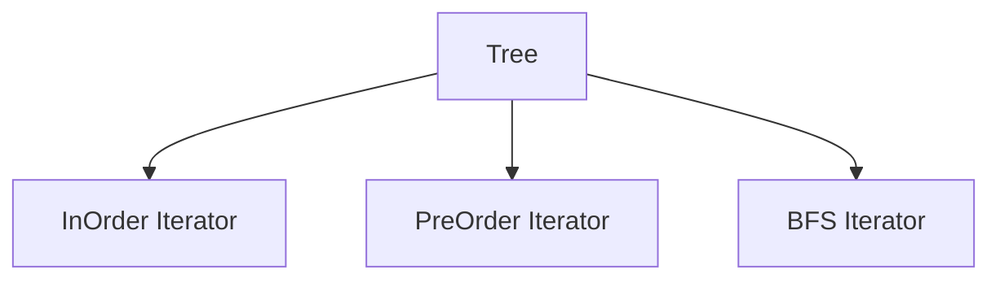
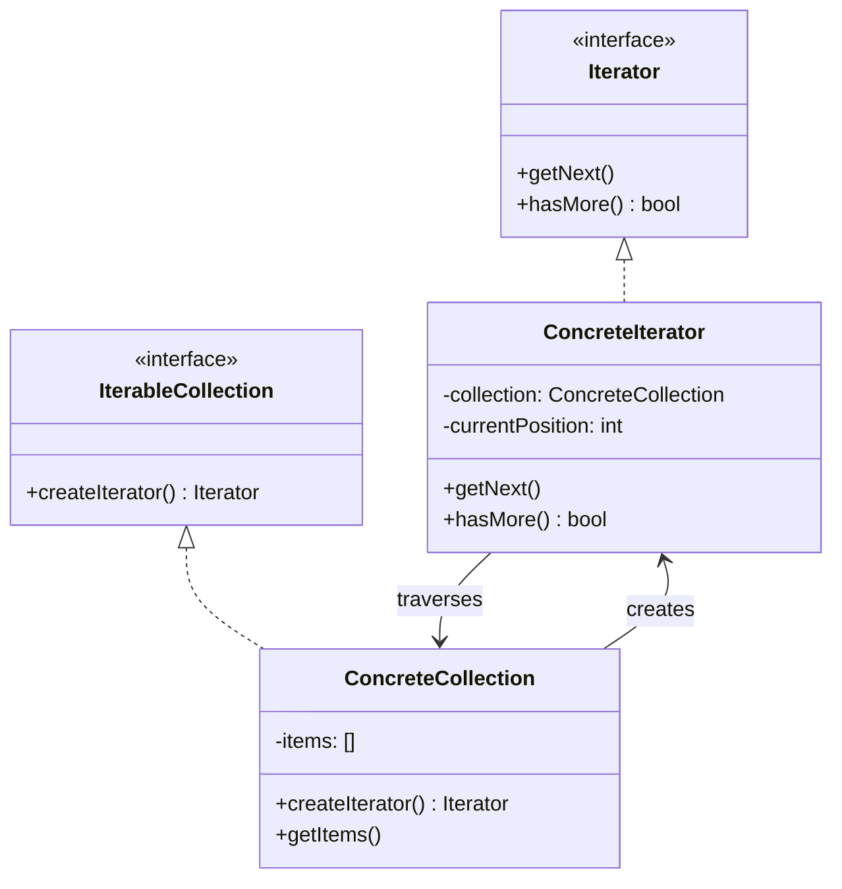
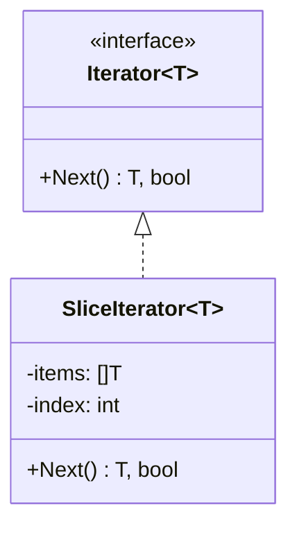
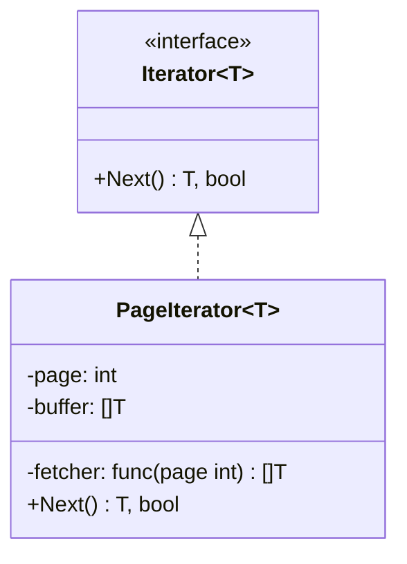
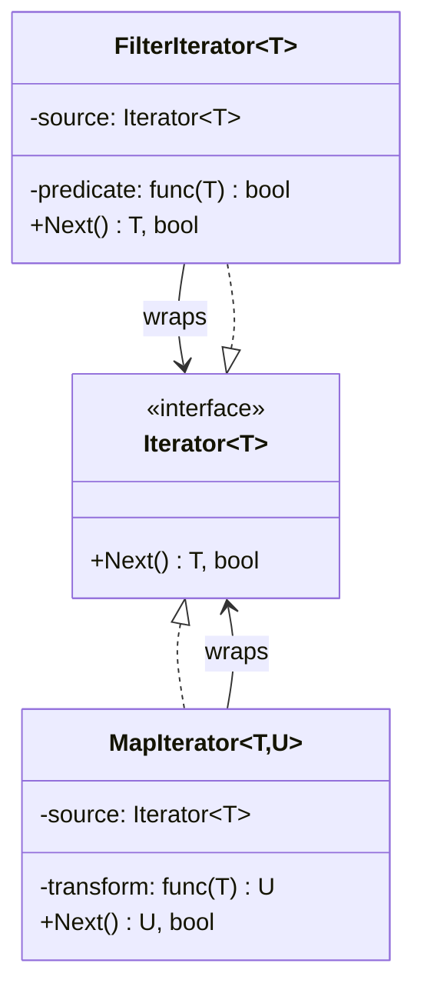

<!-- tags: design-pattern, behavioral, oop, iterator -->
# 🔁 Iterator

> You manage a complex collection: a tree, a graph, a database cursor, a paginated API, or a custom in-memory index. The caller merely wishes to "traverse the elements sequentially." If the caller must decipher the internal structure to navigate it, iteration logic spills out of the model and contaminates the codebase.

📅 Created: 2026-03-19 · 🔄 Updated: 2026-04-02 · ⏱️ 19 min read

| Aspect | Detail |
| ------ | ------ |
| **Group** | Behavioral |
| **Purpose** | Traverse a collection without exposing its internal structure |
| **Go idiom** | `for range`, callback walkers, `iter.Seq`, channel iterators |
| **SOLID** | Single Responsibility |
| **Confused with** | Generators or stream APIs |

---

## 1. DEFINE

Imagine a caller seeking to traverse data. However, every collection exposes a radically different traversal method: slices, trees, channels, and paginated APIs. When traversal logic bleeds outside the collection, the abstraction fractures exactly where users stumble the most.

The Iterator pattern resolves the tension between "sequential access" and "how the collection stores data". A binary tree, a linked list, a database cursor, and a paginated API can all provide the exact same caller experience: `hasNext()`, `next()`, or `yield`.

This pattern proves exceptionally useful when:

- The collection demands a highly complex traversal.
- A single structure supports multiple distinct traversal policies.
- The caller categorically refuses to know the internal layout.

Core insight: **Iterator transforms traversal into a distinct abstraction, freeing consumers from deciphering internal data structures.**

### 1.1 When do you need a "True" Iterator?

- Tree traversals: preorder, inorder, or breadth-first searches.
- Database cursors and pagination.
- Lazy iteration across massive datasets.
- Filter and map chains that refuse to materialize all data immediately.

### 1.2 Iterator vs `for range`

| Scenario | `for range` | Custom Iterator |
| ---------- | ----------- | -------------- |
| Simple slices or maps | ✅ Sufficient | ❌ Excessive |
| Tree or graph traversals | ⚠️ Insufficient | ✅ Optimal |
| Lazy or paginated data | ⚠️ Usually insufficient | ✅ Optimal |
| Multiple traversal policies | ⚠️ High risk of leaking logic | ✅ Optimal |

### 1.3 Failure Modes

- Iterators hold ambiguous state, obscuring exhausted or reset semantics.
- Callers bypass the iterator to touch the collection's internal structure.
- Teams force heavy iterator objects onto trivial slice or range operations.

---

These failure modes sound obvious. However, a trap exists. Vague iterator semantics regarding exhaustion confuse callers. Callers probing internal structures destroy encapsulation. This trap appears in PITFALLS.

## 2. VISUAL

A basic `for range` handles simple slices perfectly. However, trees, cursors, and lazy pipelines demand distinct iterators. The image below contrasts when to apply them and when to step away.

### Overview — Simple vs Complex Iteration


*Figure: Slices and maps default to built-in tools. Trees, cursors, and lazy pipelines require Iterators. Never force every loop into a pattern.*

### Level 1 — Collection vs Cursor

```text
Collection (tree, list, cursor)
         │
         ▼
      Iterator
   hasNext / next
         │
         ▼
       Client
```

*Figure: The client never touches the internal structure directly; it glides exclusively through the cursor abstraction.*

### Level 2 — Different Traversals, Same Structure



*Figure: A single collection spawns multiple iterators with distinct traversal policies, preventing the client from writing traversal logic.*

### UML — Iterator Class Structure



*The Iterator interface declares traversal methods (next, hasNext). ConcreteIterators implement these for specific collections. IterableCollections declare a factory method returning an Iterator—clients use iterators blindly.*

---

## 3. CODE

The flow looks solid. Implementation demonstrates that `🔁 Iterator` is not just a UML diagram; it stands firm in production code.

### Example 1: Basic — Slice Iterator

> **Goal**: Illustrate the minimal iterator contract over a trivial collection.



> **Approach**: Utilize `HasNext`, `Next`, and `Reset`.
> **Example**: Navigating a simple slice sequentially.
> **Complexity**: O(1) for every single `Next` step.

```go
// slice_iterator.go — Iterator Pattern: explicit cursor over a slice
package iteratordemo

type Iterator[T any] interface {
	HasNext() bool
	Next() T
	Reset()
}

type SliceIterator[T any] struct {
	items []T
	index int
}

func NewSliceIterator[T any](items []T) *SliceIterator[T] {
	return &SliceIterator[T]{items: items}
}

func (it *SliceIterator[T]) HasNext() bool { return it.index < len(it.items) }
func (it *SliceIterator[T]) Next() T {
	value := it.items[it.index]
	it.index++
	return value
}
func (it *SliceIterator[T]) Reset() { it.index = 0 }
```
```typescript
// slice_iterator.ts — Iterator Pattern: explicit cursor over a slice
interface Iterator<T> {
  hasNext(): boolean;
  next(): T;
  reset(): void;
}
```
```java
// SliceIterator.java — Iterator Pattern: explicit cursor over a slice
interface Iterator<T> {
    boolean hasNext();
    T next();
    void reset();
}
```
```rust
// slice_iterator.rs — Iterator Pattern: explicit cursor over a slice
trait SimpleIterator<T> {
    fn has_next(&self) -> bool;
    fn next(&mut self) -> Option<T>;
}
```
```cpp
// slice_iterator.cpp — Iterator Pattern: explicit cursor over a slice
template <typename T>
struct Iterator {
    virtual bool has_next() const = 0;
    virtual T next() = 0;
    virtual ~Iterator() = default;
};
```
```python
# slice_iterator.py — Iterator Pattern: explicit cursor over a slice
class Iterator:
    def has_next(self) -> bool:
        raise NotImplementedError
```

Conclusion: Basic Iterators primarily help readers grasp the contract. For simple slices, built-in iteration remains drastically superior.

Slice iterators work smoothly. However, tree traversals demand InOrder logic. Let's dig deeper.

### Example 2: Intermediate — Tree InOrder Iterator

> **Goal**: Traverse a binary tree without forcing the caller to understand the traversal algorithm.



> **Approach**: The iterator conceals an internal stack to execute in-order traversals.
> **Example**: A tree containing `4,2,6,1,3,5,7`.
> **Complexity**: Amortized O(1) per `Next`. Space hits O(h) where `h` represents the tree height.

```go
// tree_iterator.go — Iterator Pattern: hide binary-tree traversal behind a cursor
package treeiterator

type Node struct {
	Value int
	Left  *Node
	Right *Node
}

type InOrderIterator struct {
	stack []*Node
}

func NewInOrderIterator(root *Node) *InOrderIterator {
	it := &InOrderIterator{}
	it.pushLeft(root)
	return it
}

func (it *InOrderIterator) pushLeft(node *Node) {
	for node != nil {
		it.stack = append(it.stack, node)
		node = node.Left
	}
}

func (it *InOrderIterator) HasNext() bool { return len(it.stack) > 0 }

func (it *InOrderIterator) Next() int {
	last := len(it.stack) - 1
	node := it.stack[last]
	it.stack = it.stack[:last]
	it.pushLeft(node.Right)
	return node.Value
}
```
```typescript
// tree_iterator.ts — Iterator Pattern: hide binary-tree traversal behind a cursor
type Node = { value: number; left?: Node; right?: Node };
```
```java
// TreeIterator.java — Iterator Pattern: hide binary-tree traversal behind a cursor
final class Node {
    int value;
    Node left;
    Node right;
}
```
```rust
// tree_iterator.rs — Iterator Pattern: hide binary-tree traversal behind a cursor
struct Node {
    value: i32,
    left: Option<Box<Node>>,
    right: Option<Box<Node>>,
}
```
```cpp
// tree_iterator.cpp — Iterator Pattern: hide binary-tree traversal behind a cursor
struct Node {
    int value;
    Node* left{};
    Node* right{};
};
```
```python
# tree_iterator.py — Iterator Pattern: hide binary-tree traversal behind a cursor
class Node:
    def __init__(self, value: int, left: "Node | None" = None, right: "Node | None" = None) -> None:
        self.value = value
        self.left = left
        self.right = right
```

> **Why?** Iterators gain immense value when traversal ceases to be obvious. With a tree, hiding the stack and traversal policy behind an interface clarifies the model infinitely better than copy-pasting traversal logic everywhere.

Conclusion: Intermediate Iterators pair perfectly with trees, graphs, cursors, pagination, and any collection traversal defying simple linearity.

Tree iterators work well. However, lazy pipelines demand chaining. Let's compose them.

### Example 3: Advanced — Lazy Iterator Pipeline

> **Goal**: Construct filter and map chains without materializing the entire dataset upfront.



> **Approach**: Stack iterator wrappers on top of each other.
> **Example**: slice -> filter even -> map * 2.
> **Complexity**: Each `Next` hits amortized O(k) where `k` represents the wrapper hops required to find the next valid element.

```go
// lazy_iterator_pipeline.go — Iterator Pattern: compose filter/map lazily
package lazyiterator

type Iterator[T any] interface {
	HasNext() bool
	Next() T
}

type SliceIterator[T any] struct {
	items []T
	index int
}

func (it *SliceIterator[T]) HasNext() bool { return it.index < len(it.items) }
func (it *SliceIterator[T]) Next() T {
	value := it.items[it.index]
	it.index++
	return value
}

type FilterIterator[T any] struct {
	inner     Iterator[T]
	predicate func(T) bool
	buffer    *T
}

func NewFilterIterator[T any](inner Iterator[T], predicate func(T) bool) *FilterIterator[T] {
	it := &FilterIterator[T]{inner: inner, predicate: predicate}
	it.advance()
	return it
}

func (it *FilterIterator[T]) advance() {
	it.buffer = nil
	for it.inner.HasNext() {
		value := it.inner.Next()
		if it.predicate(value) {
			it.buffer = &value
			return
		}
	}
}

func (it *FilterIterator[T]) HasNext() bool { return it.buffer != nil }
func (it *FilterIterator[T]) Next() T {
	value := *it.buffer
	it.advance()
	return value
}
```
```typescript
// lazy_iterator_pipeline.ts — Iterator Pattern: compose filter/map lazily
interface Iterator<T> {
  hasNext(): boolean;
  next(): T;
}
```
```java
// LazyIteratorPipeline.java — Iterator Pattern: compose filter/map lazily
interface Iterator<T> {
    boolean hasNext();
    T next();
}
```
```rust
// lazy_iterator_pipeline.rs — Iterator Pattern: compose filter/map lazily
trait SimpleIterator<T> {
    fn has_next(&self) -> bool;
    fn next(&mut self) -> Option<T>;
}
```
```cpp
// lazy_iterator_pipeline.cpp — Iterator Pattern: compose filter/map lazily
template <typename T>
struct Iterator {
    virtual bool has_next() const = 0;
    virtual T next() = 0;
    virtual ~Iterator() = default;
};
```
```python
# lazy_iterator_pipeline.py — Iterator Pattern: compose filter/map lazily
class Iterator:
    def has_next(self) -> bool:
        raise NotImplementedError
```

> **Why?** Production-grade iterators rarely stop at "sequential traversal." They transform into lazy pipelines. This is the exact intersection where iterators meet the streaming mindset: data processes element-by-element, never forcing full materialization.

Conclusion: Advanced Iterators dominate when iteration demands laziness, composability, or execution across massive remote collections.

---

You observed slice, tree, and lazy iterators. The danger now comes from unclear contracts and leaked internals. We set up these traps earlier.

## 4. PITFALLS

The `🔁 Iterator` routinely suffers misunderstanding. The pattern remains in the code, but it loses the boundary it promises. These pitfalls explain why.

| # | Severity | Error | Consequence | Fix |
|---|----------|-----|---------|-----|
| 1 | 🔴 Fatal | Iterator semantics obscure exhaustion or reset states | Callers misuse the API, spawning horrific bugs | Explicitly document the `HasNext/Next/Reset` contract |
| 2 | 🔴 Fatal | The caller bypasses the iterator to touch internal structures | Complete loss of encapsulation benefits | Aggressively hide traversal states within the iterator |
| 3 | 🟡 Common | Applying heavy iterator objects to trivial slices | Massive, useless ceremony | Rely heavily on built-in iteration for basic cases |
| 4 | 🟡 Common | Lazy iterators fail to document side effects | Impossible debugging and shocking behavior | Clearly articulate the evaluation model |
| 5 | 🔵 Minor | `Next()` fails to guard against exhaustion calls | Panics or undefined behaviors erupt | Force callers to check `HasNext()` or return explicit `Option` types |

---

You navigated the Iterator pattern and its traps. The resources below provide deeper context.

## 5. REF

| Resource | Type | Link | Notes |
| -------- | ---- | ---- | ------- |
| Refactoring.Guru — Iterator | Pattern catalog | https://refactoring.guru/design-patterns/iterator | Canonical explanation |
| Go `iter` package proposal/docs | Official docs | https://pkg.go.dev/iter | Context on the new iterator idioms in Go |
| Effective Go | Official docs | https://go.dev/doc/effective_go | Context on ranges, callbacks, and API idioms |

---

## 6. RECOMMEND

Iterators conquer complex traversals and lazy pipelines. For trivial slices, built-ins suffice. If you must execute operations across an entire tree, you require a Visitor.

| Explore | When to use | Reason | File/Link |
| ------- | ------- | ----- | --------- |
| Visitor | You need multiple distinct operations over the same tree or object graph | Traversal plus operations differs heavily from pure traversal | [10-visitor.md](./10-visitor.md) |
| Composite | The collection inherently models a part-whole tree | Tree structures differ entirely from cursor abstractions | [../structural/05-composite.md](../structural/05-composite.md) |
| Strategy | You must swap the traversal policy dynamically | Iterators offer abstraction; Strategies swap policies | [01-strategy.md](./01-strategy.md) |

---

## 7. QUICK REF

| Signal | Might Iterator be the right choice? |
| ------ | ---------------------- |
| Traversals are highly complex or feature multiple styles | ✅ Yes |
| You must ruthlessly hide the collection's internal structure | ✅ Yes |
| You are merely traversing a trivial slice | ❌ Built-ins are usually superior |
| You require a lazy pipeline over massive collections | ✅ Highly recommended |

**Links**: [← State](./05-state.md) · [→ Chain of Responsibility](./07-chain-of-responsibility.md)
