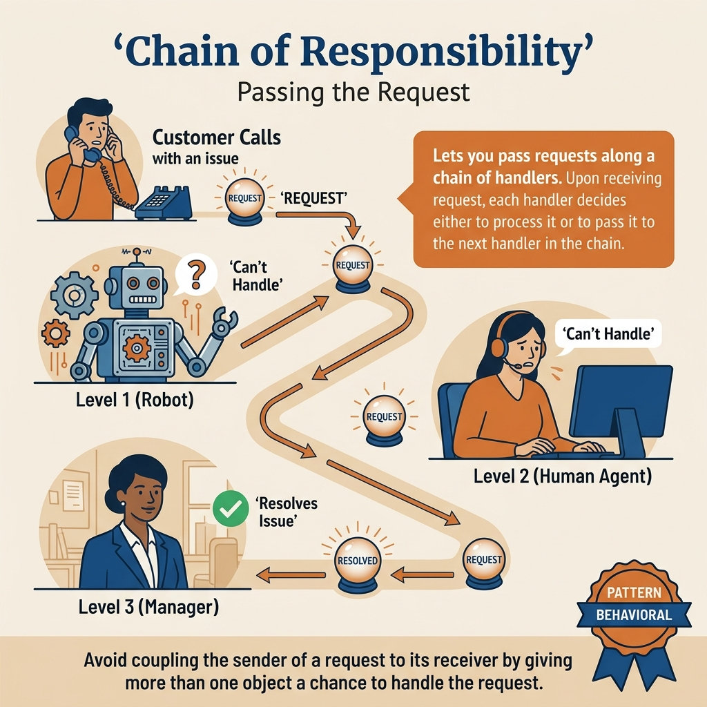
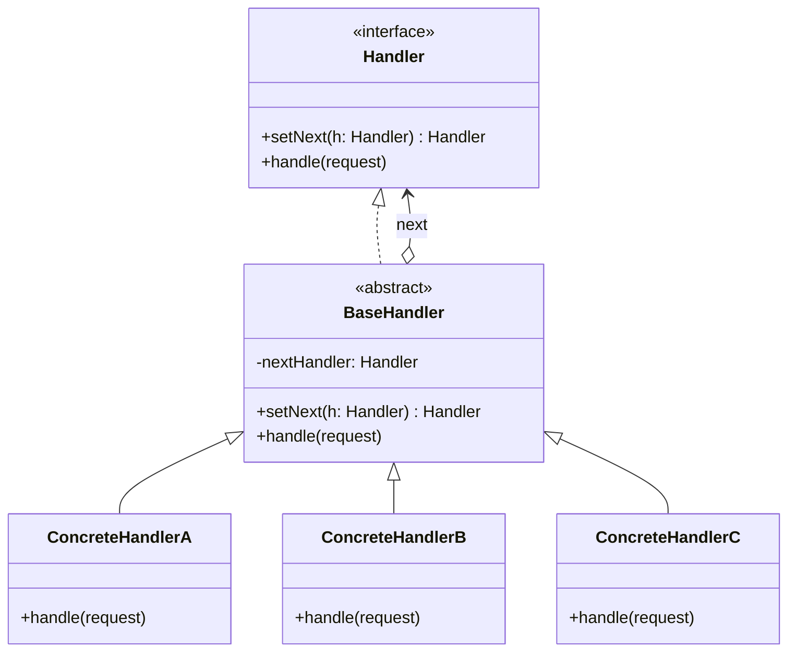
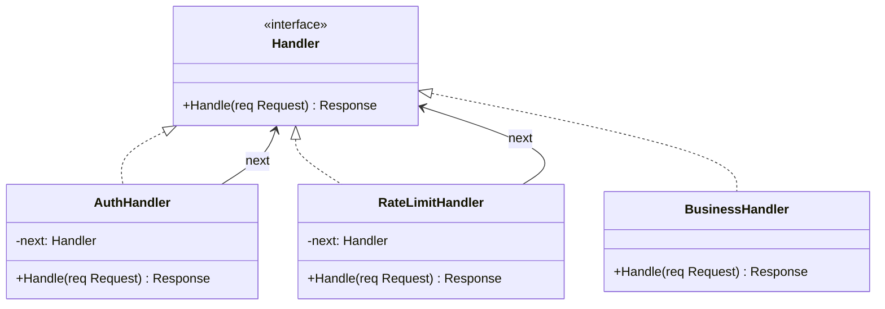
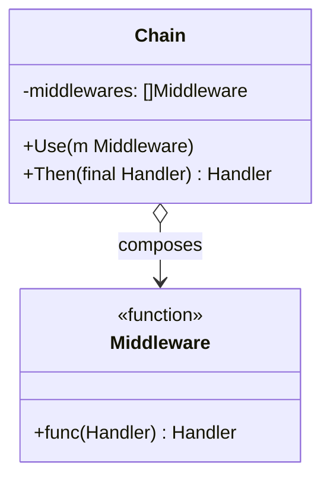
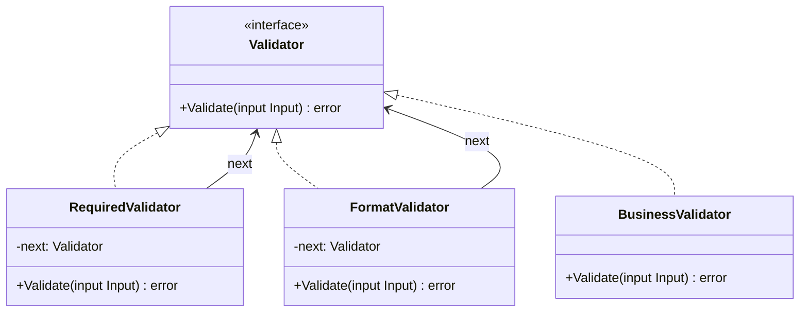

<!-- tags: design-pattern, behavioral, oop, chain-of-responsibility -->
# ⛓️ Chain of Responsibility

> Certain requests must pass through sequential processing steps: authentication, rate limiting, validation, approval, and finally the business handler. Problems erupt when this exact sequence must change, a step attempts to short-circuit the flow, and the sender must absolutely ignore who ultimately processes the request.

📅 Created: 2026-03-19 · 🔄 Updated: 2026-04-02 · ⏱️ 19 min read

| Aspect | Detail |
| ------ | ------ |
| **Group** | Behavioral |
| **Purpose** | Pass a request along a chain of handlers, empowering each handler to either process it or pass it further |
| **Go idiom** | Middleware pipelines, handler chains |
| **SOLID** | Single Responsibility, Open/Closed |
| **Confused with** | Decorator |

---

## 1. DEFINE

You are erecting a middleware chain or validation pipeline where every single step holds the authority to process, halt, or forward the request. If the caller must manually orchestrate every branching condition, the flow degenerates into an `if/else` monstrosity far larger than the actual business logic.

Chain of Responsibility thrives when a request can be:

- Processed entirely by a single handler in the chain.
- Blocked aggressively by an intermediate handler.
- Passed gracefully to the next phase.

The classic pain point features a sender memorizing the precise sequence of receivers: call auth first, then validation, then business logic, then maybe an audit log. When this pipeline requires modification, hard-coding the sequence instantly shatters the system's flexibility.

Core insight: **CoR severs the sender from the actual processing chain, allowing each handler to autonomously decide whether to handle or pass.**

### 1.1 CoR vs Decorator

| Pattern | What makes it unique? |
| ------- | ----------------- |
| **CoR** | A handler possesses full authority to halt the chain or pass it along |
| **Decorator** | A wrapper typically always delegates, merely appending behavior |

### 1.2 Failure Modes

- Handlers lack clear guidelines on when to stop or pass, rendering chain semantics incredibly vague.
- The chain order remains hidden and untested.
- Every handler mutates the request without any explicit, reliable contract.

---

These failure modes sound familiar. However, a trap exists. Vague stop/pass rules destroy chain semantics. Untested chain orders guarantee handlers execute incorrectly. This trap appears in PITFALLS.

## 2. VISUAL

CoR and Decorator look remarkably alike: both leverage chains and wrappers. The distinction: Decorator always delegates. CoR possesses the authority to stop. The image below contrasts these chains.

### Overview — Pipeline vs Escalation



*Figure: Pipeline mode = every handler executes, retaining the right to reject. Escalation mode = pass until a capable handler takes over. Decorators always delegate = not CoR.*

### Level 1 — Pipeline

```text
Request -> [Auth] -> [RateLimit] -> [Validate] -> [Handler]
              |          |             |
           reject     reject        reject
```

*Figure: Each handler executes its task and passes the request, or halts the chain entirely if the request is invalid.*

### Level 2 — Approval Escalation


*Figure: Certain chains operate as "find the first capable person," not as "run every single step sequentially."*

### UML — Chain of Responsibility Class Structure



*The Handler interface declares setNext() and handle(). The BaseHandler implements chaining logic. The ConcreteHandler evaluates the request—if capable, it handles it; if not, it passes the request to the next handler.*

---

## 3. CODE

The diagrams separate boundaries clearly. The code reveals how `⛓️ Chain of Responsibility` establishes unyielding contracts and permits flexible execution.

### Example 1: Basic — Approval Chain

> **Goal**: Escalate a purchase request based strictly on monetary thresholds.



> **Approach**: Every approver holds a hard limit; if the request breaches the limit, it passes upward.
> **Example**: Manager -> Director -> VP.
> **Complexity**: Worst-case O(n) scaling with the total handlers in the chain.

```go
// approval_chain.go — Chain of Responsibility: escalate request along an approval chain
package chordemo

import "fmt"

type PurchaseRequest struct {
	Amount float64
	Reason string
}

type Approver interface {
	SetNext(Approver) Approver
	Approve(PurchaseRequest) error
}

type BaseApprover struct {
	next Approver
}

func (b *BaseApprover) SetNext(next Approver) Approver {
	b.next = next
	return next
}

func (b *BaseApprover) pass(req PurchaseRequest) error {
	if b.next == nil {
		return fmt.Errorf("no approver for %.2f", req.Amount)
	}
	return b.next.Approve(req)
}

type Manager struct {
	BaseApprover
	Limit float64
}

func (m *Manager) Approve(req PurchaseRequest) error {
	if req.Amount <= m.Limit {
		return nil
	}
	return m.pass(req)
}
```
```typescript
// approval_chain.ts — Chain of Responsibility: escalate request along an approval chain
type PurchaseRequest = { amount: number; reason: string };
```
```java
// ApprovalChain.java — Chain of Responsibility: escalate request along an approval chain
record PurchaseRequest(double amount, String reason) {}
```
```rust
// approval_chain.rs — Chain of Responsibility: escalate request along an approval chain
struct PurchaseRequest {
    amount: f64,
    reason: String,
}
```
```cpp
// approval_chain.cpp — Chain of Responsibility: escalate request along an approval chain
struct PurchaseRequest {
    double amount;
    std::string reason;
};
```
```python
# approval_chain.py — Chain of Responsibility: escalate request along an approval chain
from dataclasses import dataclass


@dataclass
class PurchaseRequest:
    amount: float
    reason: str
```

Conclusion: Basic CoR aligns perfectly with escalation chains, or chains where exactly one ultimate handler processes the request.

Approval chains work well. However, HTTP requests demand pipelines. Let's construct middleware.

### Example 2: Intermediate — HTTP Request Pipeline

> **Goal**: Model authentication, validation, and business logic into a chain featuring strict short-circuit capabilities.



> **Approach**: Each handler receives the request and independently decides to stop or pass.
> **Example**: An authentication failure categorically prevents the business handler from executing.
> **Complexity**: O(n) scaling with the executed middleware handlers.

```go
// http_chain.go — Chain of Responsibility: request pipeline with short-circuit behavior
package httpchain

import "fmt"

type Request struct {
	Authorized bool
	Valid      bool
}

type Handler interface {
	SetNext(Handler) Handler
	Handle(*Request) error
}

type BaseHandler struct {
	next Handler
}

func (h *BaseHandler) SetNext(next Handler) Handler {
	h.next = next
	return next
}

func (h *BaseHandler) nextOrDone(req *Request) error {
	if h.next == nil {
		return nil
	}
	return h.next.Handle(req)
}

type AuthHandler struct{ BaseHandler }
func (h *AuthHandler) Handle(req *Request) error {
	if !req.Authorized {
		return fmt.Errorf("unauthorized")
	}
	return h.nextOrDone(req)
}
```
```typescript
// http_chain.ts — Chain of Responsibility: request pipeline with short-circuit behavior
type Request = { authorized: boolean; valid: boolean };
```
```java
// HttpChain.java — Chain of Responsibility: request pipeline with short-circuit behavior
record Request(boolean authorized, boolean valid) {}
```
```rust
// http_chain.rs — Chain of Responsibility: request pipeline with short-circuit behavior
struct Request {
    authorized: bool,
    valid: bool,
}
```
```cpp
// http_chain.cpp — Chain of Responsibility: request pipeline with short-circuit behavior
struct Request {
    bool authorized;
    bool valid;
};
```
```python
# http_chain.py — Chain of Responsibility: request pipeline with short-circuit behavior
from dataclasses import dataclass


@dataclass
class Request:
    authorized: bool
    valid: bool
```

> **Why?** Pipeline middleware acts as a phenomenal, real-world CoR example because every step possesses the absolute right to block the request instantly. This starkly separates it from a Decorator: not every wrapper "executes and delegates blindly."

Conclusion: Intermediate CoR meshes beautifully with HTTP or gRPC middleware, approval flows, and validation pipelines.

HTTP pipelines work smoothly. However, dynamic chains require runtime assembly. Let's compose them.

### Example 3: Advanced — Dynamic Chain Assembly

> **Goal**: Assemble the chain utilizing configuration or feature flags instead of hard-coding the entire sequence.



> **Approach**: The composition root constructs the chain dynamically at runtime.
> **Example**: Toggling risk checks or audit steps explicitly based on the environment.
> **Complexity**: Assembly hits O(n); handling hits O(n) aligned with the runtime chain depth.

```go
// dynamic_chain.go — Chain of Responsibility: assemble handlers from runtime config
package dynamicchain

type Handler interface {
	SetNext(Handler) Handler
}

func BuildChain(handlers ...Handler) Handler {
	if len(handlers) == 0 {
		return nil
	}
	for i := 0; i < len(handlers)-1; i++ {
		handlers[i].SetNext(handlers[i+1])
	}
	return handlers[0]
}
```
```typescript
// dynamic_chain.ts — Chain of Responsibility: assemble handlers from runtime config
interface Handler {
  setNext(next: Handler): Handler;
}
```
```java
// DynamicChain.java — Chain of Responsibility: assemble handlers from runtime config
interface Handler {
    Handler setNext(Handler next);
}
```
```rust
// dynamic_chain.rs — Chain of Responsibility: assemble handlers from runtime config
trait Handler {}
```
```cpp
// dynamic_chain.cpp — Chain of Responsibility: assemble handlers from runtime config
struct Handler {
    virtual Handler* set_next(Handler* next) = 0;
    virtual ~Handler() = default;
};
```
```python
# dynamic_chain.py — Chain of Responsibility: assemble handlers from runtime config
class Handler:
    def set_next(self, next_handler: "Handler") -> "Handler":
        raise NotImplementedError
```

> **Why?** When the composition root assemblies the chain, CoR unleashes extreme power. You alter the pipeline using runtime configurations without ever editing individual handlers. This represents the exact moment the pattern repays its architectural flexibility debt.

Conclusion: Advanced CoR shines brilliantly when pipelines demand deep customization based on environments, tenants, plans, or feature flags.

---

You observed approval chains, HTTP pipelines, and dynamic assemblies. The danger now comes from ambiguous stop rules and untested orders. We set up these traps earlier.

## 4. PITFALLS

When applying `⛓️ Chain of Responsibility` to real codebases, errors rarely trace back to the pattern name. They trace back to mismanaged boundaries and severe overuse. The following missteps dominate codebase failures.

| # | Severity | Error | Consequence | Fix |
|---|----------|-----|---------|-----|
| 1 | 🔴 Fatal | Unclear whether handlers stop or pass | Chain semantics shatter; bugs become impossible to trace | Explicitly define the contract governing every handler |
| 2 | 🔴 Fatal | The chain order remains completely untested | Handlers execute in disastrously wrong sequences | Vigorously test the pipeline order within the composition root |
| 3 | 🟡 Common | Handlers mutate requests chaotically | Side effects destroy reasoning capabilities | Document and enforce rigid request mutation contracts |
| 4 | 🟡 Common | Confusing CoR with a Decorator | Severe design misalignment | If the goal is short-circuiting or escalating, select CoR |
| 5 | 🔵 Minor | Applying CoR for a brutally short, rigid flow | Pure, useless ceremony | For 1 or 2 static steps, direct, inline code easily suffices |

---

You navigated the Chain of Responsibility pattern and its traps. The resources below provide deeper context.

## 5. REF

| Resource | Type | Link | Notes |
| -------- | ---- | ---- | ------- |
| Refactoring.Guru — Chain of Responsibility | Pattern catalog | https://refactoring.guru/design-patterns/chain-of-responsibility | Canonical explanation |
| Go `net/http` middleware ecosystem | Official/docs | https://pkg.go.dev/net/http | Outstanding real-world CoR examples in Go |
| Fowler on pipelines/middleware | Engineering reference | https://martinfowler.com | Vital context on pipeline composition |

---

## 6. RECOMMEND

CoR hits hardest when pipelines demand short-circuiting or dynamic assembly. If every wrapper must execute blindly, you want a Decorator. If you require two-way coordination, seek a Mediator.

| Explore | When to use | Reason | File/Link |
| ------- | ------- | ----- | --------- |
| Decorator | You wish to attach behavior around a target without short-circuiting | Always delegate diverges completely from stop/pass | [../structural/02-decorator.md](../structural/02-decorator.md) |
| Mediator | Interactions flow bidirectionally across numerous peers | Hub coordination differs fundamentally from linear chains | [08-mediator.md](./08-mediator.md) |
| Strategy | You must swap the handler policy entirely | Swapping algorithms differs radically from assembling chains | [01-strategy.md](./01-strategy.md) |

---

## 7. QUICK REF

| Signal | Might CoR be the right choice? |
| ------ | ----------------- |
| A request traverses numerous handlers sequentially | ✅ Yes |
| Handlers reserve the absolute right to block or pass | ✅ Yes |
| You wish to append behavior via wrappers that always execute | ❌ That demands a Decorator |
| You simply possess one rigid, single-receiver function | ⚠️ You likely do not need this pattern |

**Links**: [← Iterator](./06-iterator.md) · [→ Mediator](./08-mediator.md)
