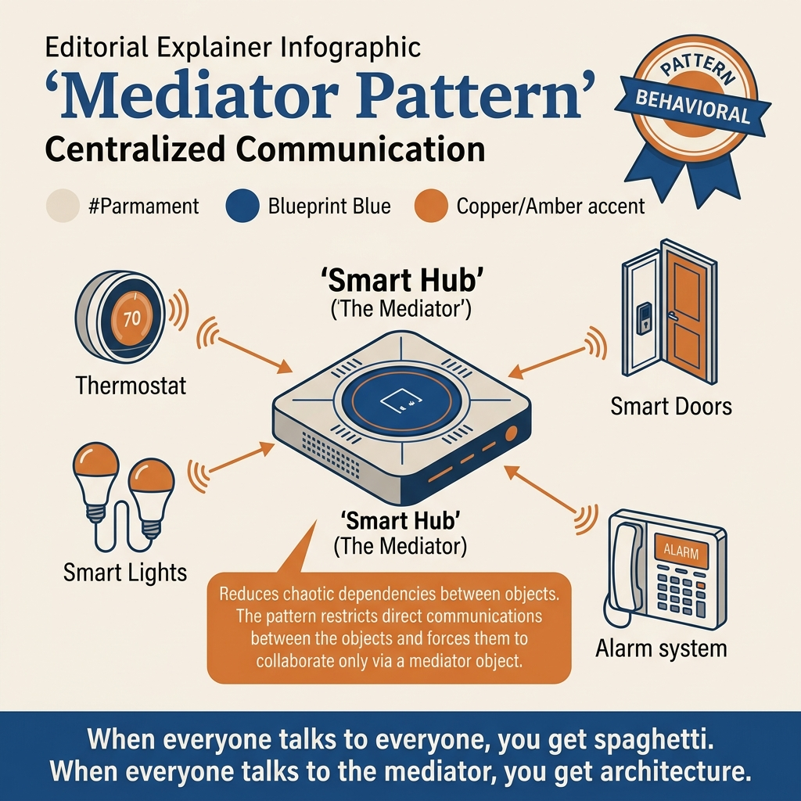
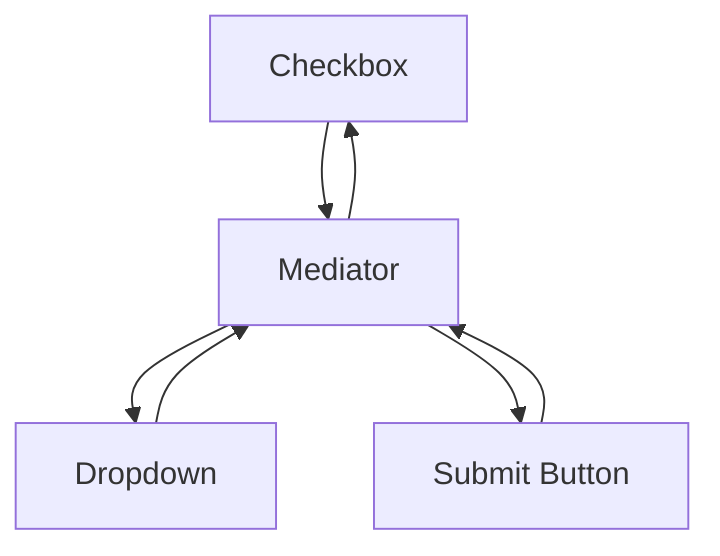
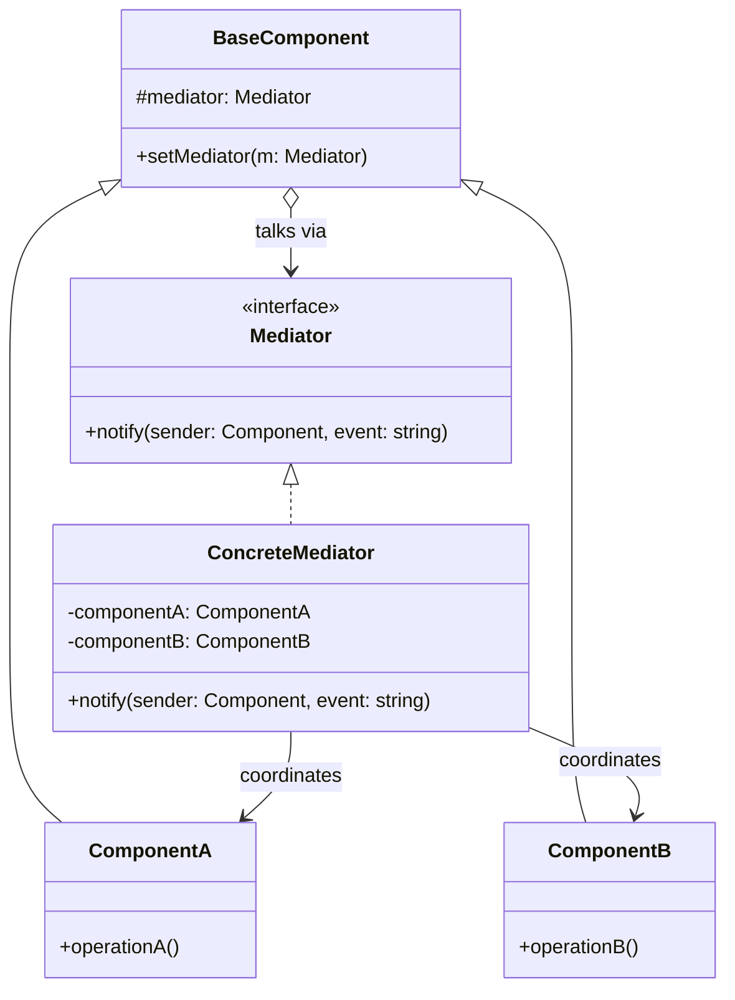
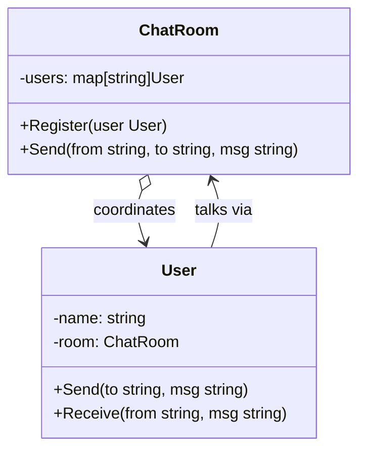
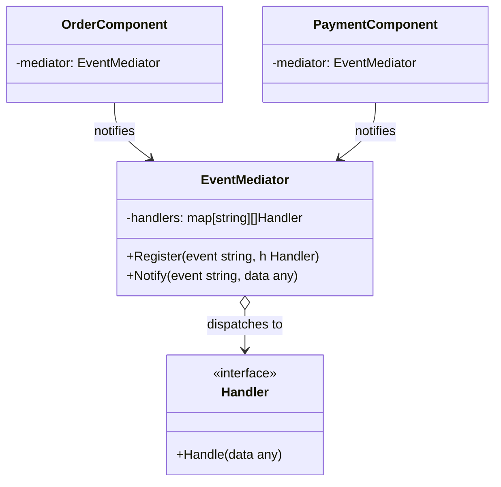
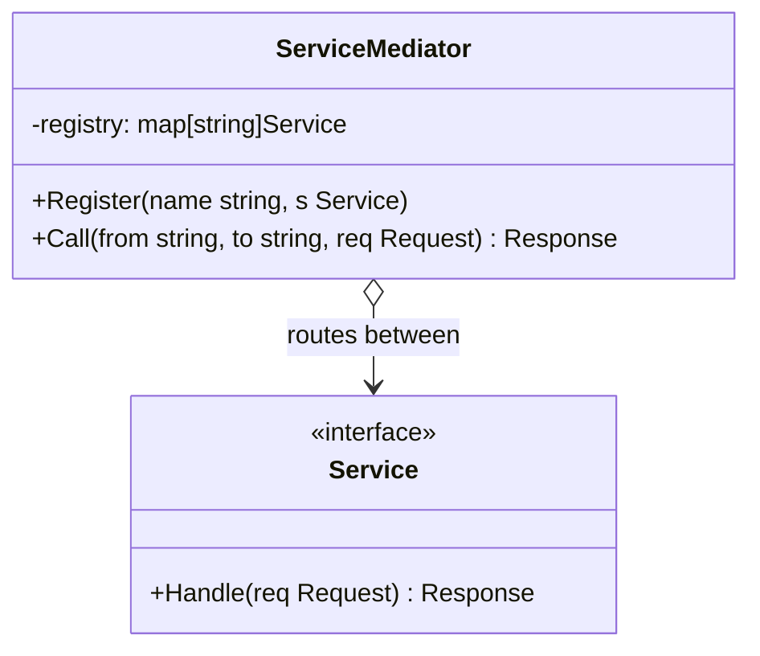

<!-- tags: design-pattern, behavioral, oop, mediator -->
# 🏛️ Mediator

> When the number of components in a screen or workflow increases, the direct relationships between them tend to grow faster than the components themselves. Each field learns about several other fields. Each widget adjusts several other widgets. Very quickly, the code transitions from "form logic" into a "tangled web of dependencies."

📅 Created: 2026-03-19 · 🔄 Updated: 2026-04-02 · ⏱️ 19 min read

| Aspect | Detail |
| ------ | ------ |
| **Group** | Behavioral |
| **Purpose** | Centralize coordination logic between multiple objects into a single hub |
| **Go idiom** | Coordinator structs, hub objects, orchestration services |
| **SOLID** | Single Responsibility for coordination |
| **Confused with** | Observer, Facade |

---

## 1. DEFINE

Imagine a form screen or a workflow where multiple components must communicate, yet no single component should know too much about the rest. If every object holds a reference to every other object, even the smallest change drags an entire tangled web of coupling along with it.

Mediator targets situations where multiple peer objects require bidirectional interaction, but you refuse to let them cross-reference each other. If every UI component or domain participant directly knows all the other objects it affects, coupling multiplies exponentially.

`Mediator` extracts that coordination into a central hub. Colleagues only know the mediator; they never know each other directly. When an event occurs from one colleague, the mediator decides who to update and exactly which rule to follow.

Core insight: **Mediator severs the communication graph from the components themselves, forcing interaction logic to live in one exclusive location.**

### 1.1 Mediator vs Observer vs Facade

| Pattern | Goal |
| ------- | -------- |
| **Mediator** | Coordinates bidirectional interactions across multiple peers |
| **Observer** | Emits one-way notifications from subjects to subscribers |
| **Facade** | Simplifies the external interface of a complex subsystem |

### 1.2 Failure Modes

- The mediator devolves into a God object hoarding all business logic.
- Colleagues continue calling each other directly, reducing the mediator to a mere formality.
- The mediator lacks clear ownership boundaries, rendering it impossible to test.

---

These failure modes sound avoidable. However, a trap exists. A mediator hoarding all business logic becomes a God object. Colleagues calling each other directly render the pattern pointless. This trap appears in PITFALLS.

## 2. VISUAL

Mediator sounds like "push everything through a hub". However, without seeing the mesh coupling beforehand, you easily confuse Mediator with Observer or Facade. The image below clarifies the difference.

### Overview — Mesh vs Hub



*Figure: No Mediator = N×(N-1)/2 connections. With Mediator = N connections directly to the hub. Observer represents one-way notification; Mediator represents two-way coordination.*

### Level 1 — Direct vs Mediated Communication

```text
Without mediator:
A <-> B
| \   / |
C <-> D

With mediator:
A -> Mediator <- B
C -> Mediator <- D
```

*Figure: Coupling no longer exists between individual pairs of components; it funnels directly into a clear coordination hub.*

### Level 2 — UI Form Coordination



*Figure: Each component merely reports its state to the mediator; the mediator independently decides which other components to enable, disable, or update.*

### UML — Mediator Class Structure



*The Mediator interface declares notify(). The ConcreteMediator holds references to all components and coordinates communication. Components exclusively know the Mediator—they never know each other, reducing coupling from N×N down to N.*

---

## 3. CODE

The flow is clear. Implementing it reveals that `Mediator` relies heavily on strict boundaries, proving it is more than just a theoretical UML diagram.

### Example 1: Basic — Chat Room Mediator

> **Goal**: Users communicate exclusively through a room, never calling each other directly.



> **Approach**: The chat room acts as the mediator holding the user list.
> **Example**: Alice sends a message; the room fans it out to Bob and Charlie.
> **Complexity**: O(n) scaling with the number of participants receiving the message.

```go
// chat_room_mediator.go — Mediator Pattern: centralize message routing in a room
package mediatordemo

type ChatMediator interface {
	Register(*User)
	Send(message string, from *User)
}

type User struct {
	Name     string
	mediator ChatMediator
}

func (u *User) Send(message string) {
	u.mediator.Send(message, u)
}

type ChatRoom struct {
	users []*User
}

func (r *ChatRoom) Register(user *User) {
	r.users = append(r.users, user)
}

func (r *ChatRoom) Send(message string, from *User) {
	for _, user := range r.users {
		if user != from {
			_ = message
		}
	}
}
```
```typescript
// chat_room_mediator.ts — Mediator Pattern: centralize message routing in a room
interface ChatMediator {
  register(user: User): void;
  send(message: string, from: User): void;
}
```
```java
// ChatRoomMediator.java — Mediator Pattern: centralize message routing in a room
interface ChatMediator {
    void register(User user);
    void send(String message, User from);
}
```
```rust
// chat_room_mediator.rs — Mediator Pattern: centralize message routing in a room
trait ChatMediator {
    fn send(&self, message: &str, from: &str);
}
```
```cpp
// chat_room_mediator.cpp — Mediator Pattern: centralize message routing in a room
struct ChatMediator {
    virtual void send(const std::string& message, const std::string& from) = 0;
    virtual ~ChatMediator() = default;
};
```
```python
# chat_room_mediator.py — Mediator Pattern: centralize message routing in a room
class ChatMediator:
    def send(self, message: str, from_user: str) -> None:
        raise NotImplementedError
```

Conclusion: Basic Mediators prove their worth the moment multiple colleagues need to converse through a central hub rather than referencing each other directly.

Chat rooms work well. However, form interactions demand UI mediators. Let's coordinate them.

### Example 2: Intermediate — Form Mediator

> **Goal**: Coordinate enable and disable states across checkboxes, dropdowns, and submit buttons.



> **Approach**: Every component reports events to the mediator; the mediator updates the other components.
> **Example**: Ticking a new checkbox enables the submit button.
> **Complexity**: O(c) scaling with the number of components the mediator touches when an event occurs.

```go
// form_mediator.go — Mediator Pattern: centralize UI component coordination
package formmediator

type FormMediator interface {
	Notify(sender string)
}

type FormState struct {
	AcceptedTerms bool
	SubmitEnabled bool
}

type FormController struct {
	state *FormState
}

func (m FormController) Notify(sender string) {
	if sender == "terms-checkbox" {
		m.state.SubmitEnabled = m.state.AcceptedTerms
	}
}
```
```typescript
// form_mediator.ts — Mediator Pattern: centralize UI component coordination
class FormState {
  acceptedTerms = false;
  submitEnabled = false;
}
```
```java
// FormMediator.java — Mediator Pattern: centralize UI component coordination
final class FormState {
    boolean acceptedTerms;
    boolean submitEnabled;
}
```
```rust
// form_mediator.rs — Mediator Pattern: centralize UI component coordination
struct FormState {
    accepted_terms: bool,
    submit_enabled: bool,
}
```
```cpp
// form_mediator.cpp — Mediator Pattern: centralize UI component coordination
struct FormState {
    bool accepted_terms{};
    bool submit_enabled{};
};
```
```python
# form_mediator.py — Mediator Pattern: centralize UI component coordination
class FormState:
    def __init__(self) -> None:
        self.accepted_terms = False
        self.submit_enabled = False
```

> **Why?** UI forms represent a highly classic case for Mediators: interaction logic exists strictly between components, refusing to belong to any single component. If you force each field to know other fields, the form devolves into an unsalvageable dependency web.

Conclusion: Intermediate Mediators fit perfectly with complex forms, wizard UIs, game lobbies, and room coordination.

Form mediators work smoothly. However, domain workflows require coordinators. Let's orchestrate them.

### Example 3: Advanced — Domain Workflow Coordinator

> **Goal**: Coordinate multiple domain participants within a single workflow while preventing them from cross-calling.



> **Approach**: The mediator acts as a workflow coordinator, receiving events from participants and dictating the next step.
> **Example**: A booking flow bridging seat selection, payment holds, and ticket issuance.
> **Complexity**: O(p) scaling with the number of participants affected by each event.

```go
// workflow_mediator.go — Mediator Pattern: centralize domain participant coordination
package workflowmediator

type WorkflowMediator interface {
	SeatSelected(seatID string)
	PaymentAuthorized(paymentID string)
}

type BookingCoordinator struct {
	seatHeld   bool
	paid       bool
	ticketed   bool
}

func (m *BookingCoordinator) SeatSelected(seatID string) {
	_ = seatID
	m.seatHeld = true
}

func (m *BookingCoordinator) PaymentAuthorized(paymentID string) {
	_ = paymentID
	if m.seatHeld {
		m.paid = true
		m.ticketed = true
	}
}
```
```typescript
// workflow_mediator.ts — Mediator Pattern: centralize domain participant coordination
class BookingCoordinator {
  seatHeld = false;
  paid = false;
  ticketed = false;
}
```
```java
// WorkflowMediator.java — Mediator Pattern: centralize domain participant coordination
final class BookingCoordinator {
    boolean seatHeld;
    boolean paid;
    boolean ticketed;
}
```
```rust
// workflow_mediator.rs — Mediator Pattern: centralize domain participant coordination
struct BookingCoordinator {
    seat_held: bool,
    paid: bool,
    ticketed: bool,
}
```
```cpp
// workflow_mediator.cpp — Mediator Pattern: centralize domain participant coordination
struct BookingCoordinator {
    bool seat_held{};
    bool paid{};
    bool ticketed{};
};
```
```python
# workflow_mediator.py — Mediator Pattern: centralize domain participant coordination
class BookingCoordinator:
    def __init__(self) -> None:
        self.seat_held = False
        self.paid = False
        self.ticketed = False
```

> **Why?** Production-grade Mediators rarely stop at chat room demos. They emerge when multiple participants in a workflow refuse to call each other directly but still must react to a shared choreography.

Conclusion: Advanced Mediators deliver massive value when coordination complexity vastly exceeds the internal logic of the individual participants.

---

You observed chat rooms, forms, and domain coordinators. The danger now comes from God objects and direct colleague calls. We set up these traps earlier.

## 4. PITFALLS

Merely knowing how to apply `Mediator` is not enough; production code typically fractures on the supposedly minor details. The table below isolates the precise errors that destroy the pattern's value.

| # | Severity | Error | Consequence | Fix |
|---|----------|-----|---------|-----|
| 1 | 🔴 Fatal | The mediator hoards the entire system's business logic | A disastrous God object forms that defies salvation | Strictly constrain the mediator to a clearly defined workflow or boundary |
| 2 | 🔴 Fatal | Colleagues continue calling each other directly | The pattern becomes a pointless formality | Force all interaction explicitly through the mediator |
| 3 | 🟡 Common | Confusing the Mediator with an Observer | Deploying the incorrect communication model | If you only require one-way notifications, use Observer |
| 4 | 🟡 Common | Ownership of coordination rules remains completely vague | Testing and refactoring become incredibly difficult | Position the mediator precisely at a clear composition boundary |
| 5 | 🔵 Minor | Creating a mediator for remarkably minor interactions | Inflating ceremony pointlessly | Use the pattern exclusively when peer coupling achieves significant complexity |

---

You navigated the Mediator pattern and its traps. The resources below provide deeper context.

## 5. REF

| Resource | Type | Link | Notes |
| -------- | ---- | ---- | ------- |
| Refactoring.Guru — Mediator | Pattern catalog | https://refactoring.guru/design-patterns/mediator | Canonical explanation |
| Fowler on coordination patterns | Engineering reference | https://martinfowler.com | Context on workflow coordination |
| Effective Go | Official docs | https://go.dev/doc/effective_go | Composition-oriented structuring |

---

## 6. RECOMMEND

Mediators shine when peer interactions generate severe mesh coupling. If you merely need one-way notifications, utilize an Observer. If you need to simplify an API, utilize a Facade.

| Explore | When to use | Reason | File/Link |
| ------- | ------- | ----- | --------- |
| Observer | You solely need one-way notifications from publishers to subscribers | One-way differs entirely from two-way coordination | [02-observer.md](./02-observer.md) |
| Facade | You must radically simplify a subsystem API | API simplification differs from peer coordination | [../structural/04-facade.md](../structural/04-facade.md) |
| CoR | You require a sequential pipeline capable of short-circuiting | Linear chains contrast sharply with hub coordination | [07-chain-of-responsibility.md](./07-chain-of-responsibility.md) |

---

## 7. QUICK REF

| Signal | Might Mediator be the right choice? |
| ------ | ---------------------- |
| Numerous peer objects interact heavily and cross-call each other | ✅ Yes |
| You wish to consolidate all coordination into a single hub | ✅ Yes |
| You strictly need one-way notifications | ❌ That implies an Observer |
| You merely need a simpler API for an entire subsystem | ❌ That implies a Facade |

**Links**: [← Chain of Responsibility](./07-chain-of-responsibility.md) · [→ Memento](./09-memento.md)
