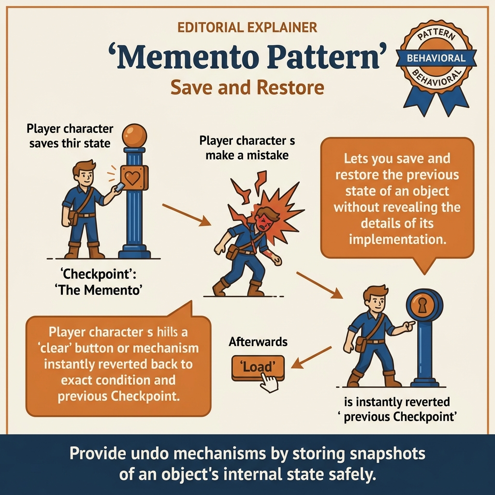
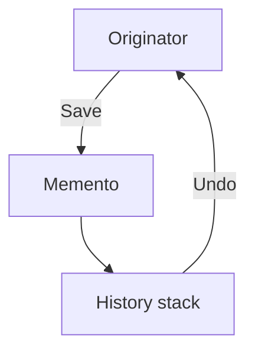
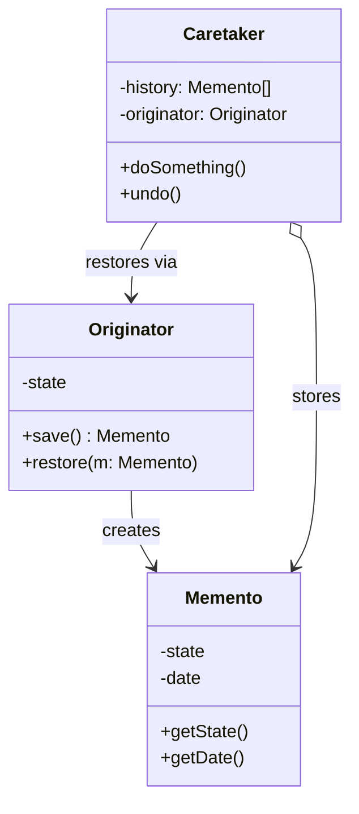
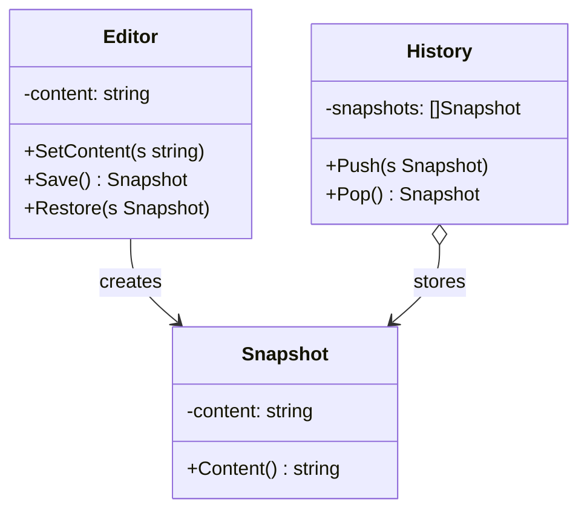
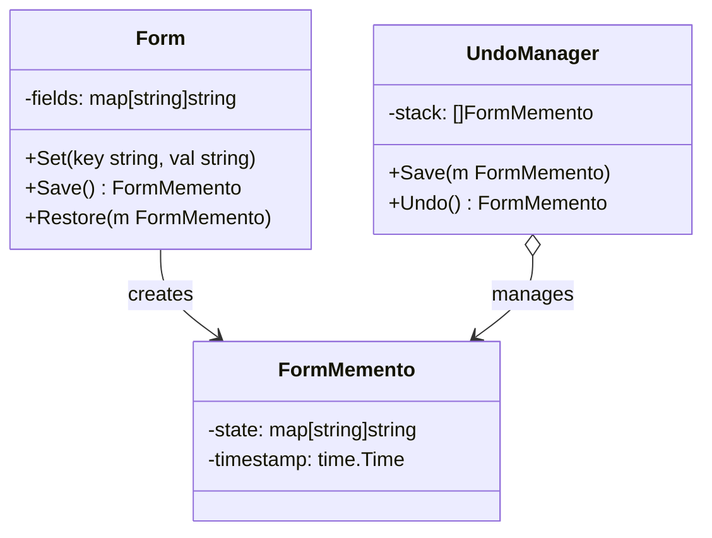
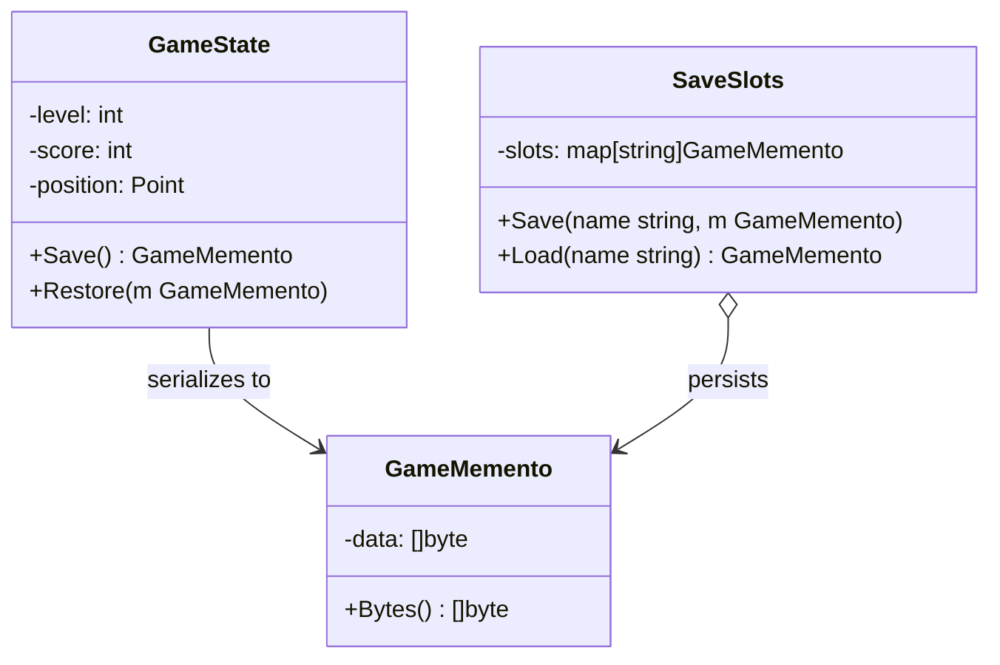

<!-- tags: design-pattern, behavioral, oop, memento -->
# 💾 Memento

> Certain objects resist standard undo operations if you attempt to "reverse the action": editor states, form drafts, filter builders, visual layouts, and workflow drafts. In these scenarios, what you truly want to store is not a command, but a snapshot of the state frozen at an exact moment in time.

📅 Created: 2026-03-19 · 🔄 Updated: 2026-04-02 · ⏱️ 19 min read

| Aspect | Detail |
| ------ | ------ |
| **Group** | Behavioral |
| **Purpose** | Save and restore an object's state without exposing its internal structure |
| **Go idiom** | Snapshot structs, strict deep copies, opaque tokens |
| **SOLID** | Encapsulation, Single Responsibility |
| **Confused with** | Command |

---

## 1. DEFINE

You want to support undo, rollback, or snapshot restoration for an object at a previous moment in time. The problem does not revolve around "copying a few fields". The problem revolves around saving a state securely enough to rollback without exposing the object's guts to the outside world.

Memento fits perfectly when an object carries a massive state, or when reversing an operation via a "reverse command" proves excruciatingly difficult. Instead of demanding "what did I do so I can undo it?", we simply ask "what did the old state look like so I can revert?". The crucial element: the caretaker holds the snapshot, but **it must never read the internal details inside that snapshot**.

Core insight: **Memento transforms the undo/restore problem into a state snapshot problem, entirely bypassing the need to replay reverse operations.**

### 1.1 Vocabulary

| Concept | Role |
| --------- | ------- |
| **Originator** | The object containing the state requiring saves/restores |
| **Memento** | The opaque snapshot of the state |
| **Caretaker** | The entity storing the history of snapshots |

### 1.2 Memento vs Command

| Pattern | How does it execute an undo? |
| ------- | ------------------- |
| **Memento** | Restores an explicit snapshot of the state |
| **Command** | Executes a precise reverse operation |

### 1.3 Failure Modes

- Snapshots fail to deep copy thoroughly; restoring them inadvertently shares mutable state.
- Caretakers learn far too much about the internal guts of the memento.
- Snapshots grow excessively large, and unbounded histories crush system memory.

---

These failure modes sound basic. However, a trap exists. Snapshots missing deep copies generate shared mutable states after restoration. Unbounded histories explode memory usage. This trap appears in PITFALLS.

## 2. VISUAL

Memento and Command both execute undos, but they utilize vastly different models: snapshots versus reverse operations. The image below maps the three central roles.

### Overview — Originator / Memento / Caretaker



*Figure: The Originator creates an opaque snapshot. The Caretaker retains history but strictly refuses to read internals. Deep copying is mandatory. Bounded history prevents memory explosions.*

### Level 1 — Save / Restore

```text
Originator --save--> Memento --store--> Caretaker
Originator <--restore-- Memento <--pop-- Caretaker
```

*Figure: The Caretaker hoards the snapshot but never requires an understanding of the internal state within it.*

### Level 2 — Undo History Stack



*Figure: Undo simplifies drastically into merely popping an old snapshot and forcefully restoring it directly into the originator.*

### UML — Memento Class Structure



*The Originator creates a Memento containing a state snapshot. The Caretaker stores mementos but ignores their contents. When restoration is needed, the Caretaker returns the memento to the Originator—only the Originator can decipher the state inside.*

---

## 3. CODE

The flow is clear. Implementation reveals that `💾 Memento` is not merely a UML exercise; it heavily relies on rigid boundaries and strict copy semantics in production code.

### Example 1: Basic — Editor Snapshot

> **Goal**: Save and restore editor content flawlessly.



> **Approach**: The editor creates its own opaque memento.
> **Example**: Type text -> save -> type more -> restore.
> **Complexity**: O(n) scaling directly with the size of the state requiring a copy.

```go
// editor_memento.go — Memento Pattern: save and restore editor state safely
package mementodemo

type EditorMemento struct {
	content   string
	cursorPos int
}

type Editor struct {
	content   string
	cursorPos int
}

func (e *Editor) Type(text string) {
	e.content = e.content[:e.cursorPos] + text + e.content[e.cursorPos:]
	e.cursorPos += len(text)
}

func (e *Editor) Save() EditorMemento {
	return EditorMemento{content: e.content, cursorPos: e.cursorPos}
}

func (e *Editor) Restore(m EditorMemento) {
	e.content = m.content
	e.cursorPos = m.cursorPos
}
```
```typescript
// editor_memento.ts — Memento Pattern: save and restore editor state safely
class EditorMemento {
  constructor(readonly content: string, readonly cursorPos: number) {}
}
```
```java
// EditorMemento.java — Memento Pattern: save and restore editor state safely
record EditorMemento(String content, int cursorPos) {}
```
```rust
// editor_memento.rs — Memento Pattern: save and restore editor state safely
#[derive(Clone)]
struct EditorMemento {
    content: String,
    cursor_pos: usize,
}
```
```cpp
// editor_memento.cpp — Memento Pattern: save and restore editor state safely
struct EditorMemento {
    std::string content;
    int cursor_pos;
};
```
```python
# editor_memento.py — Memento Pattern: save and restore editor state safely
from dataclasses import dataclass


@dataclass
class EditorMemento:
    content: str
    cursor_pos: int
```

Conclusion: Basic Mementos shine when state captures cleanly into a snapshot, proving far simpler to restore than executing reverse commands.

Editor snapshots work well. However, query builders demand draft histories. Let's store them.

### Example 2: Intermediate — Query Builder Draft History

> **Goal**: Save the history of a filter builder step-by-step.



> **Approach**: The builder acts as the originator; the UI history acts as the caretaker.
> **Example**: Add a filter, change the sort order, then undo back to the previous draft.
> **Complexity**: O(n) scaling strictly with the number of filters requiring copies during the snapshot.

```go
// query_builder_memento.go — Memento Pattern: preserve builder drafts without leaking internals
package querymemento

type Snapshot struct {
	filters []string
	sortBy  string
}

type QueryBuilder struct {
	filters []string
	sortBy  string
}

func (b *QueryBuilder) AddFilter(filter string) {
	b.filters = append(b.filters, filter)
}

func (b *QueryBuilder) Save() Snapshot {
	filters := append([]string(nil), b.filters...)
	return Snapshot{filters: filters, sortBy: b.sortBy}
}

func (b *QueryBuilder) Restore(snapshot Snapshot) {
	b.filters = append([]string(nil), snapshot.filters...)
	b.sortBy = snapshot.sortBy
}
```
```typescript
// query_builder_memento.ts — Memento Pattern: preserve builder drafts without leaking internals
type Snapshot = { filters: string[]; sortBy: string };
```
```java
// QueryBuilderMemento.java — Memento Pattern: preserve builder drafts without leaking internals
record Snapshot(java.util.List<String> filters, String sortBy) {}
```
```rust
// query_builder_memento.rs — Memento Pattern: preserve builder drafts without leaking internals
#[derive(Clone)]
struct Snapshot {
    filters: Vec<String>,
    sort_by: String,
}
```
```cpp
// query_builder_memento.cpp — Memento Pattern: preserve builder drafts without leaking internals
struct Snapshot {
    std::vector<std::string> filters;
    std::string sort_by;
};
```
```python
# query_builder_memento.py — Memento Pattern: preserve builder drafts without leaking internals
from dataclasses import dataclass


@dataclass
class Snapshot:
    filters: list[str]
    sort_by: str
```

> **Why?** Query and filter builders align beautifully with Mementos because state changes occur in tiny, iterative steps. Users frequently want to revert to a prior version without understanding the "reverse operation" for every single UI manipulation.

Conclusion: Intermediate Mementos fit exceptionally well with drafts, editor states, visual builders, and wizard forms.

Draft histories work smoothly. However, memory must remain bounded. Let's use ring buffers.

### Example 3: Advanced — Snapshot Ring Buffer

> **Goal**: Maintain a strictly bounded history to prevent memory from imploding.



> **Approach**: The caretaker aggressively manages a ring buffer to cap history.
> **Example**: An editor retains strictly the 50 most recent snapshots.
> **Complexity**: Push/Pop run at O(1); snapshot cost depends heavily on the state size.

```go
// bounded_history_memento.go — Memento Pattern: keep bounded history instead of unbounded growth
package boundedmemento

type Snapshot struct {
	state string
}

type History struct {
	items   []Snapshot
	maxSize int
}

func NewHistory(maxSize int) *History {
	return &History{maxSize: maxSize}
}

func (h *History) Push(snapshot Snapshot) {
	if len(h.items) >= h.maxSize {
		h.items = h.items[1:]
	}
	h.items = append(h.items, snapshot)
}

func (h *History) Pop() (Snapshot, bool) {
	if len(h.items) == 0 {
		return Snapshot{}, false
	}
	last := h.items[len(h.items)-1]
	h.items = h.items[:len(h.items)-1]
	return last, true
}
```
```typescript
// bounded_history_memento.ts — Memento Pattern: keep bounded history instead of unbounded growth
type Snapshot = { state: string };
```
```java
// BoundedHistoryMemento.java — Memento Pattern: keep bounded history instead of unbounded growth
record Snapshot(String state) {}
```
```rust
// bounded_history_memento.rs — Memento Pattern: keep bounded history instead of unbounded growth
#[derive(Clone)]
struct Snapshot {
    state: String,
}
```
```cpp
// bounded_history_memento.cpp — Memento Pattern: keep bounded history instead of unbounded growth
struct Snapshot {
    std::string state;
};
```
```python
# bounded_history_memento.py — Memento Pattern: keep bounded history instead of unbounded growth
from dataclasses import dataclass


@dataclass
class Snapshot:
    state: str
```

> **Why?** Mementos easily fall prey to romanticized visions where "undo just works". However, snapshot histories constantly devour memory. A production-grade caretaker must enforce rigid retention policies; it cannot append blindly and infinitely.

Conclusion: Advanced Mementos only succeed when you factor in memory footprints, deep copy costs, and strict retention policies, not just the basic save/restore API.

---

You observed snapshots, draft histories, and ring buffers. The danger now comes from shallow copy bugs and unbounded memory. We set up these traps earlier.

## 4. PITFALLS

The `💾 Memento` routinely suffers misunderstanding. The pattern remains in the code, but it loses the boundary it promises. These pitfalls explain why.

| # | Severity | Error | Consequence | Fix |
|---|----------|-----|---------|-----|
| 1 | 🔴 Fatal | Snapshots fail to execute thorough deep copies | Restores inadvertently share mutable state with the present | Deep copy all mutable fields flawlessly |
| 2 | 🔴 Fatal | History stacks grow infinitely | Memory pressure explodes, crashing the system | Utilize bounded histories or ring buffers immediately |
| 3 | 🟡 Common | Caretakers read the internal guts of the snapshot | Complete loss of encapsulation | Keep mementos as rigorously opaque as possible |
| 4 | 🟡 Common | Applying Memento for gargantuan states on every single keystroke | Unmanageable cost overhead | Combine it with debouncing, checkpoints, or diff-based strategies |
| 5 | 🔵 Minor | Confusing Memento with Command | Choosing the incorrect undo model entirely | If reverse operations prove easier than snapshots, strongly consider Command |

---

You navigated the Memento pattern and its traps. The resources below provide deeper context.

## 5. REF

| Resource | Type | Link | Notes |
| -------- | ---- | ---- | ------- |
| Refactoring.Guru — Memento | Pattern catalog | https://refactoring.guru/design-patterns/memento | Canonical explanation |
| Effective Go | Official docs | https://go.dev/doc/effective_go | Copy semantics and struct ownership rules |
| Undo/redo architecture references | Engineering reference | https://martinfowler.com | Context surrounding actual history design in large systems |

---

## 6. RECOMMEND

Memento exhibits immense power when undoing equals restoring a snapshot. If a reverse operation is significantly simpler, Command usually fits better. Always monitor the memory footprint.

| Explore | When to use | Reason | File/Link |
| ------- | ------- | ----- | --------- |
| Command | Undoing functions perfectly as a distinct reverse action | Reverse ops differ entirely from snapshots | [03-command.md](./03-command.md) |
| State | Objects feature highly defined lifecycle transitions | State machines differ from snapshot histories | [05-state.md](./05-state.md) |
| Observer | You must send notifications when state changes | Notifications differ from snapshot and restore actions | [02-observer.md](./02-observer.md) |

---

## 7. QUICK REF

| Signal | Might Memento be the right choice? |
| ------ | --------------------- |
| Undo requirements match perfectly with snapshotting state | ✅ Yes |
| The originator absolutely must preserve encapsulation | ✅ Yes |
| Reverse operations are vastly easier to model | ⚠️ Likely leans toward Command |
| Snapshot state is massive and updates constantly | ⚠️ Carefully calculate the cost overhead |

**Links**: [← Mediator](./08-mediator.md) · [→ Visitor](./10-visitor.md)
