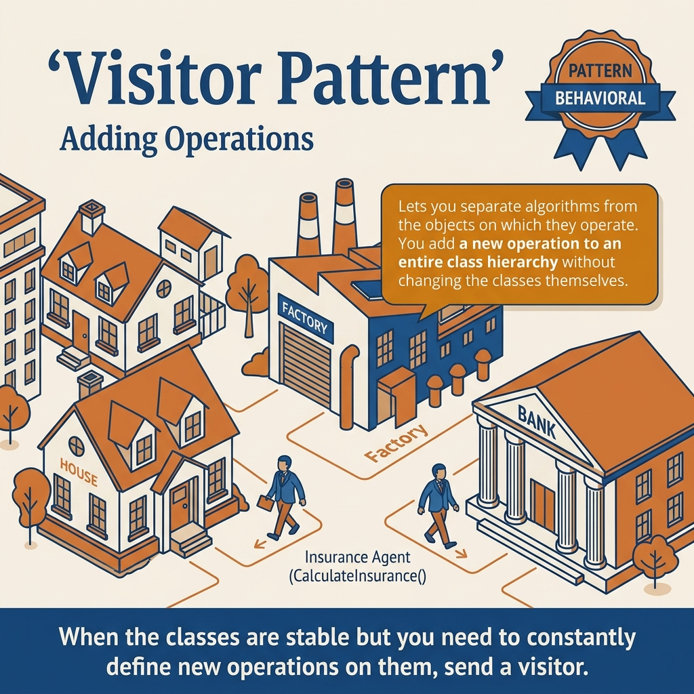
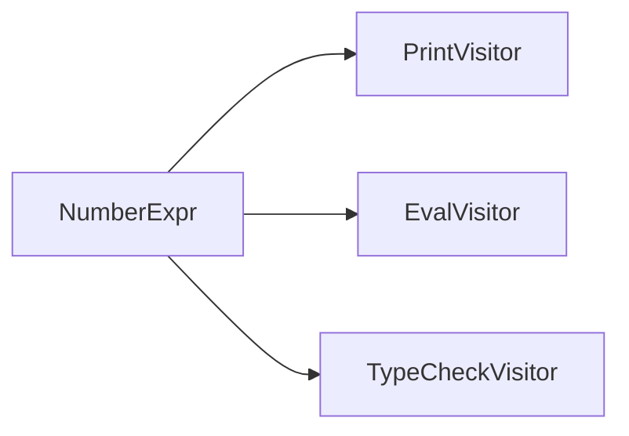
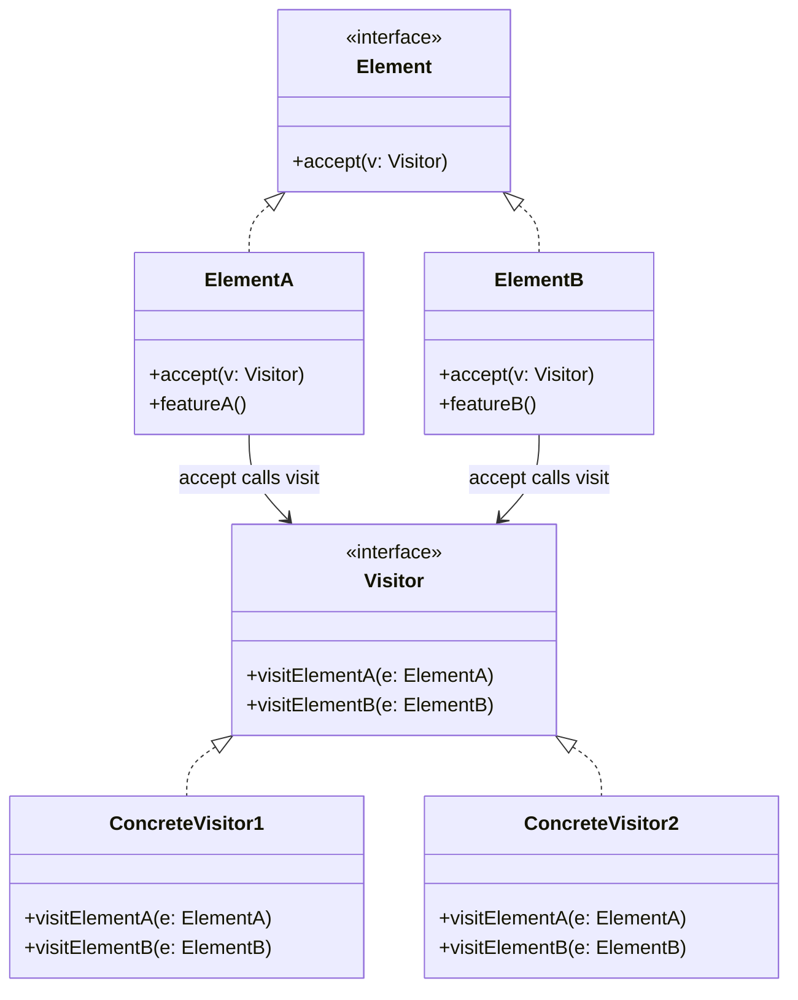
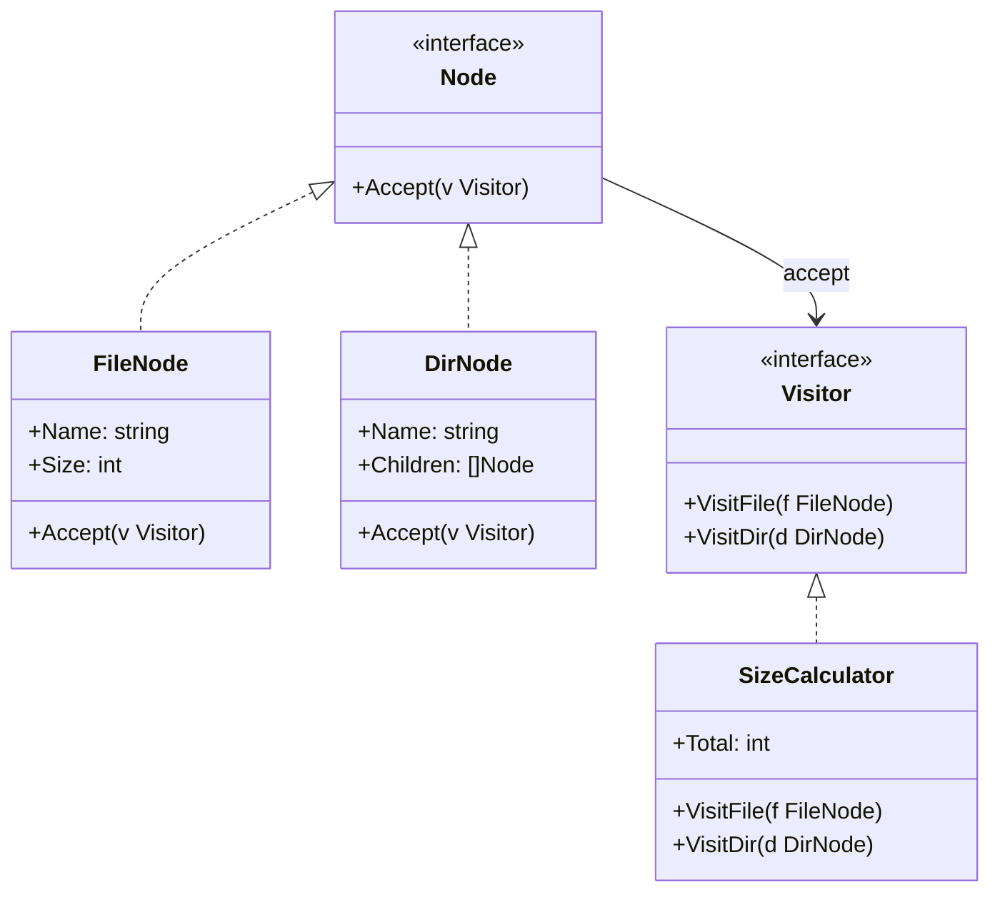
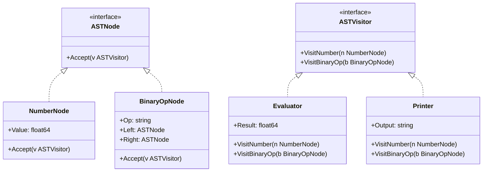
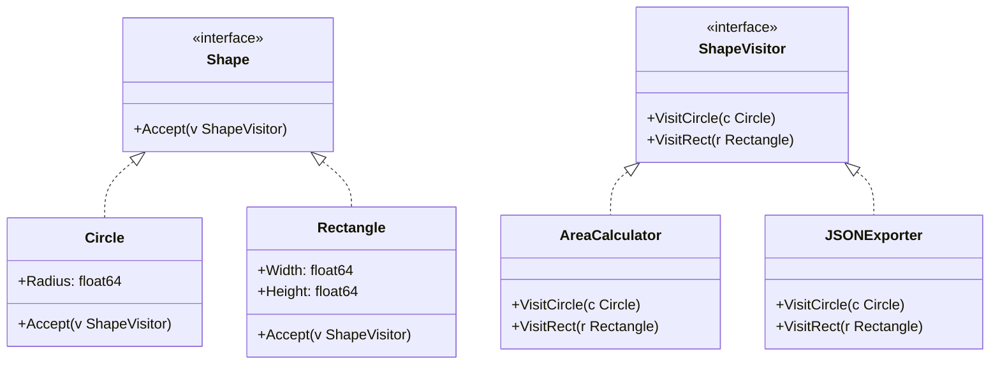

<!-- tags: design-pattern, behavioral, oop, visitor -->
# 🚶 Visitor

> You manage an AST, a tree node hierarchy, or a highly stable object graph. Suddenly, new operations start sprouting: print, evaluate, lint, optimize, serialize, collect metrics. If every new operation forces you to modify every single element class, the data structure suffers continuous, invasive alterations solely for external logic.

📅 Created: 2026-03-19 · 🔄 Updated: 2026-04-02 · ⏱️ 20 min read

| Aspect | Detail |
| ------ | ------ |
| **Group** | Behavioral |
| **Purpose** | Inject new operations into an object structure without constantly altering the element hierarchy |
| **Go idiom** | Standard Visitors, or pragmatic type switches for simpler cases |
| **SOLID** | Open/Closed along the "operation" dimension |
| **Confused with** | Iterators on trees |

---

## 1. DEFINE

Imagine a set of elements that has thoroughly stabilized, such as AST nodes, document trees, or corporate reports. However, operations applied to them increase rapidly: export, validate, format, collect metrics. If every new operation pierces directly into the entire suite of element types, the surface area for change explodes violently.

Visitor proves exceptionally valuable when **element types remain highly stable**, yet the number of operations executing upon them increases steadily. A compiler AST serves as the classic example: node types rarely change, but engineers constantly introduce new evaluators, printers, formatters, linters, optimizers, and type checkers.

`Visitor` violently shoves the operation outward, far away from the element classes. Each element merely calls `Accept(visitor)`. The actual logic resides firmly inside each individual visitor implementation. Thanks to double dispatch, the visitor knows exactly which element type it currently handles without writing `switch` statements everywhere.

Core insight: **Visitor makes adding new element types extremely painful in order to make adding new operations incredibly easy.**

### 1.1 The Central Trade-off

| Easy to Add | Hard to Add |
| ------- | -------- |
| New Visitors / Operations | New Element Types |

### 1.2 Visitor vs Type Switch

| Approach | When it fits |
| -------- | ------- |
| **Standard Visitor** | Highly stable hierarchies, massive operations, demands strong discoverability and type safety |
| **Type switch** | Smaller systems, few operations, requires straightforward and pragmatic code |

### 1.3 Failure Modes

- Element types constantly change, forcing every single visitor to undergo simultaneous rewrites.
- The visitor interface bloats catastrophically.
- Teams force Visitor into Go for tiny hierarchies where type switches read much cleaner.

---

These failure modes sound obvious. However, a trap exists. Constantly changing element types force endless rewrites across all visitors. Bloated visitor interfaces severely cripple maintainability. This trap appears in PITFALLS.

## 2. VISUAL

Visitor sounds exactly like double dispatch. However, its true value lies in the trade-off: operations become cheap, types become expensive. In Go, type switches usually suffice for tiny hierarchies. The image below contrasts these dynamics.

### Overview — Easy New Ops vs Hard New Types



*Figure: Adding a new Visitor is remarkably cheap. Adding a new element type requires updating every single visitor immediately. For small hierarchies with few operations, Go type switches usually win.*

### Level 1 — Double Dispatch

```text
Client -> element.Accept(visitor)
Element -> visitor.VisitElementType(self)
```

*Figure: The element never executes the operation directly; it aggressively delegates processing rights to the visitor strictly matching its element type.*

### Level 2 — Stable Elements, Many Visitors



*Figure: When node types stop fluctuating, adding new visitors proves infinitely cheaper than injecting new methods directly into every element.*

### UML — Visitor Class Structure



*The Visitor interface declares a visit method strictly for each Element type. ConcreteVisitors implement behavior for every element. Elements declare accept(Visitor), which triggers visitor.visit(this). Double dispatch dictates behavior through element type combined with visitor type.*

---

## 3. CODE

The flow is clear. Implementation reveals that `🚶 Visitor` is not just a UML diagram; it stands firm in production code.

### Example 1: Basic — AST Evaluator Visitor

> **Goal**: Sever evaluation logic entirely from AST nodes.



> **Approach**: Rely on `Accept(visitor)` alongside `VisitNumber` and `VisitBinary`.
> **Example**: `(1 + 2) * 3`.
> **Complexity**: O(n) scaling precisely with the node count in the expression tree.

```go
// ast_visitor.go — Visitor Pattern: separate operations from AST node structure
package visitordemo

type ExprVisitor interface {
	VisitNumber(*NumberExpr) int
	VisitBinary(*BinaryExpr) int
}

type Expr interface {
	Accept(ExprVisitor) int
}

type NumberExpr struct {
	Value int
}

func (n *NumberExpr) Accept(v ExprVisitor) int { return v.VisitNumber(n) }

type BinaryExpr struct {
	Left  Expr
	Op    string
	Right Expr
}

func (b *BinaryExpr) Accept(v ExprVisitor) int { return v.VisitBinary(b) }

type Evaluator struct{}

func (Evaluator) VisitNumber(n *NumberExpr) int { return n.Value }

func (e Evaluator) VisitBinary(b *BinaryExpr) int {
	left := b.Left.Accept(e)
	right := b.Right.Accept(e)
	if b.Op == "+" {
		return left + right
	}
	return left * right
}
```
```typescript
// ast_visitor.ts — Visitor Pattern: separate operations from AST node structure
interface ExprVisitor {
  visitNumber(node: NumberExpr): number;
  visitBinary(node: BinaryExpr): number;
}
```
```java
// ASTVisitor.java — Visitor Pattern: separate operations from AST node structure
interface ExprVisitor {
    int visitNumber(NumberExpr node);
    int visitBinary(BinaryExpr node);
}
```
```rust
// ast_visitor.rs — Visitor Pattern: separate operations from AST node structure
trait ExprVisitor {
    fn visit_number(&self, node: &NumberExpr) -> i32;
}
```
```cpp
// ast_visitor.cpp — Visitor Pattern: separate operations from AST node structure
struct ExprVisitor {
    virtual int visit_number(class NumberExpr& node) = 0;
    virtual ~ExprVisitor() = default;
};
```
```python
# ast_visitor.py — Visitor Pattern: separate operations from AST node structure
class ExprVisitor:
    def visit_number(self, node: "NumberExpr") -> int:
        raise NotImplementedError
```

Conclusion: Basic Visitor delivers value the moment you desire numerous, completely different operations to execute upon a shared object tree.

AST evaluators work smoothly. However, multiple visitors demand the exact same hierarchy. Let's add a printer.

### Example 2: Intermediate — Printer + Evaluator Visitors

> **Goal**: Demonstrate the actual benefit of Visitor by appending a new operation without touching the element itself.



> **Approach**: Leave the AST nodes untouched, simply inject a new `PrinterVisitor`.
> **Example**: Execute both `evaluate` and `print` upon the identical AST.
> **Complexity**: Every visitor runs at O(n) scaled by the number of nodes.

```go
// multi_visitor.go — Visitor Pattern: add new operations without changing elements
package multivisitor

type ExprVisitor[T any] interface {
	VisitNumber(*NumberExpr) T
	VisitBinary(*BinaryExpr) T
}

type Expr[T any] interface {
	Accept(ExprVisitor[T]) T
}

type NumberExpr struct{ Value int }
func (n *NumberExpr) Accept(v ExprVisitor[int]) int { return v.VisitNumber(n) }

type BinaryExpr struct {
	Left  *NumberExpr
	Op    string
	Right *NumberExpr
}
```
```typescript
// multi_visitor.ts — Visitor Pattern: add new operations without changing elements
interface ExprVisitor<T> {
  visitNumber(node: NumberExpr): T;
  visitBinary(node: BinaryExpr): T;
}
```
```java
// MultiVisitor.java — Visitor Pattern: add new operations without changing elements
interface ExprVisitor<T> {
    T visitNumber(NumberExpr node);
    T visitBinary(BinaryExpr node);
}
```
```rust
// multi_visitor.rs — Visitor Pattern: add new operations without changing elements
trait ExprVisitor<T> {
    fn visit_number(&self, node: &NumberExpr) -> T;
}
```
```cpp
// multi_visitor.cpp — Visitor Pattern: add new operations without changing elements
template <typename T>
struct ExprVisitor {
    virtual T visit_number(class NumberExpr& node) = 0;
    virtual ~ExprVisitor() = default;
};
```
```python
# multi_visitor.py — Visitor Pattern: add new operations without changing elements
class ExprVisitor:
    def visit_number(self, node: "NumberExpr"):
        raise NotImplementedError
```

> **Why?** The genuine power of Visitor emerges only when new operations arrive relentlessly. If your system requires only one operation, this pattern represents crushing overhead. However, when evaluators, printers, linters, and collectors race across a highly stable hierarchy, Visitor shines brilliantly.

Conclusion: Intermediate Visitor meshes perfectly with ASTs, query plans, schema trees, and UI node trees demanding multiple, distinct execution passes.

Multiple visitors work well. However, the Go idiom strongly favors type switches. Let's compare them.

### Example 3: Advanced — Visitor vs Type Switch in Go

> **Goal**: Reveal how to make brutally pragmatic decisions inside Go.



> **Approach**: Pit classic Visitor against type switches exclusively for smaller hierarchies.
> **Example**: Traversing a handful of AST nodes inside an internal service.
> **Complexity**: Both hit O(n). The trade-off revolves entirely around maintainability, not Big-O.

```go
// visitor_vs_typeswitch.go — Visitor Pattern: compare classic visitor with Go type switch
package visitorvstypeswitch

type Node interface{}

type Number struct{ Value int }
type Add struct {
	Left  Node
	Right Node
}

func Eval(node Node) int {
	switch n := node.(type) {
	case Number:
		return n.Value
	case Add:
		return Eval(n.Left) + Eval(n.Right)
	default:
		return 0
	}
}
```
```typescript
// visitor_vs_typeswitch.ts — Visitor Pattern: compare classic visitor with discriminated unions
type Node = { kind: "number"; value: number } | { kind: "add"; left: Node; right: Node };
```
```java
// VisitorVsTypeSwitch.java — Visitor Pattern: compare classic visitor with instanceof chains
sealed interface Node permits NumberNode, AddNode {}
```
```rust
// visitor_vs_typeswitch.rs — Visitor Pattern: compare classic visitor with enum matching
enum Node {
    Number(i32),
    Add(Box<Node>, Box<Node>),
}
```
```cpp
// visitor_vs_typeswitch.cpp — Visitor Pattern: compare classic visitor with std::variant
#include <variant>
```
```python
# visitor_vs_typeswitch.py — Visitor Pattern: compare classic visitor with isinstance dispatch
class Node:
    pass
```

> **Why?** In Go, Visitor does not always claim the throne. If the hierarchy remains tiny and operations sparse, a type switch feels significantly simpler. Visitor repays its massive ceremony debt solely when the axis of "new operations" surges relentlessly.

Conclusion: Advanced Visitor demands knowing exactly when to deploy a true Visitor, and exactly when to leverage a pragmatic type switch inside Go.

---

You observed AST evaluators, multiple visitors, and type switches. The danger now comes from unstable hierarchies and fat visitor interfaces. We set up these traps earlier.

## 4. PITFALLS

When applying `🚶 Visitor` to real codebases, errors rarely trace back to the pattern name. They trace back to mismanaged boundaries and severe overuse. The following missteps dominate codebase failures.

| # | Severity | Error | Consequence | Fix |
|---|----------|-----|---------|-----|
| 1 | 🔴 Fatal | Element types change frequently and aggressively | Every visitor demands simultaneous, catastrophic rewrites | Restrict Visitor exclusively to highly stable hierarchies |
| 2 | 🔴 Fatal | The visitor interface bloats to unmanageable sizes | Implementations become impossible to maintain | Limit the hierarchy scope or aggressively group logical visitors |
| 3 | 🟡 Common | Applying Visitor to microscopically small hierarchies | Pure, useless ceremony | Inside Go, heavily favor standard type switches |
| 4 | 🟡 Common | Visitor logic hacks wildly into element internals | Encapsulation shatters entirely | Ensure element APIs remain crystal clear; avoid deep hacks |
| 5 | 🔵 Minor | Failing to explain the "easy new ops / hard new elements" trade-off | Teams leverage the pattern with wildly incorrect expectations | Dictate the explicit trade-off clearly within the DEFINE phase |

---

You navigated the Visitor pattern and its traps. The resources below provide deeper context.

## 5. REF

| Resource | Type | Link | Notes |
| -------- | ---- | ---- | ------- |
| Refactoring.Guru — Visitor | Pattern catalog | https://refactoring.guru/design-patterns/visitor | Canonical explanation |
| Compiler/AST design references | Engineering reference | https://martinfowler.com | Context for utilizing Visitor strictly over ASTs |
| Effective Go | Official docs | https://go.dev/doc/effective_go | Type switch and interface idioms native to Go |

---

## 6. RECOMMEND

Visitor dominates when element hierarchies freeze and new operations surge relentlessly. If you merely need to traverse a tree sequentially, seek an Iterator. If the hierarchy stays tiny, type switches suffice.

| Explore | When to use | Reason | File/Link |
| ------- | ------- | ----- | --------- |
| Iterator | You strictly need to traverse a tree or collection sequentially | Pure traversal differs wildly from multi-operation dispatch | [06-iterator.md](./06-iterator.md) |
| Composite | The domain demands a part-whole tree structure | Tree structures differ completely from operation dispatches | [../structural/05-composite.md](../structural/05-composite.md) |
| Strategy | You must swap an entire algorithm instantly | Swapping algorithms differs from per-element dispatching | [01-strategy.md](./01-strategy.md) |

---

## 7. QUICK REF

| Signal | Might Visitor be the right choice? |
| ------ | --------------------- |
| Element hierarchies are completely frozen, but new operations arrive constantly | ✅ Yes |
| You require numerous distinct execution passes over the identical object graph | ✅ Yes |
| Element types change violently and frequently | ❌ Extremely painful; avoid |
| The system remains tiny with virtually no operations | ⚠️ Type switches perform vastly better |

**Links**: [← Memento](./09-memento.md) · [→ Behavioral Overview](./README.md)
