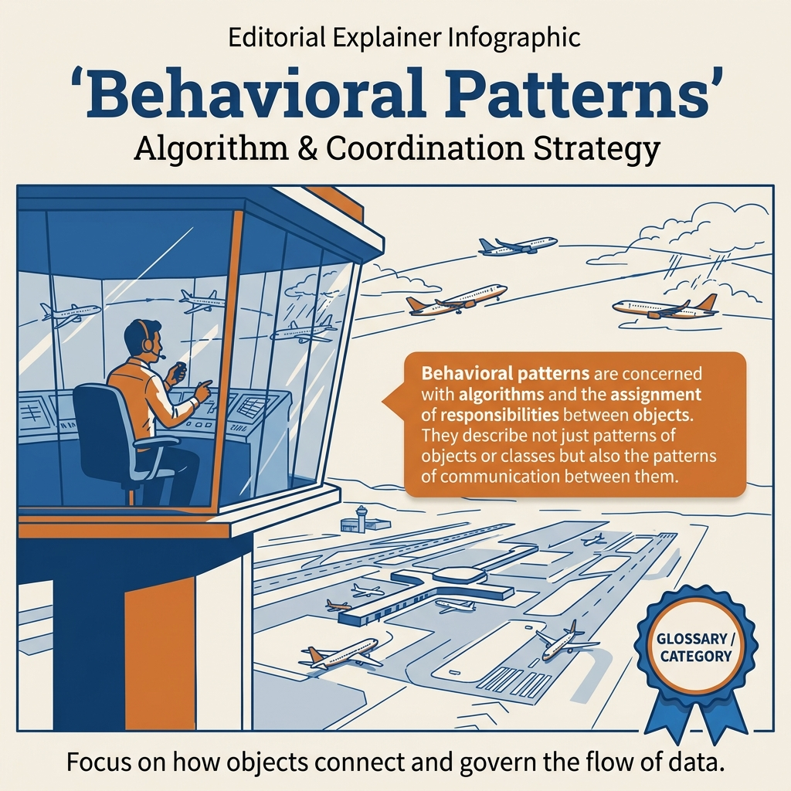

<!-- tags: design-pattern, behavioral, oop, overview -->
# Behavioral Design Patterns

> The lane for behavior pressure. Open this when algorithm selection, event flows, state transitions, or orchestrations between objects land in the wrong place.

| Aspect | Detail |
| --- | --- |
| **Concept** | Patterns handling behavior pressure |
| **Audience** | Backend engineers, reviewers, and developers refactoring workflows, event flows, state machines, or middleware |
| **Primary style** | Pattern-family router |
| **Entry point** | Open when the service layer fills with `switch` statements, callback chains, loose observers, or untraceable state logic |

📅 Created: 2026-03-19 · 🔄 Updated: 2026-04-05 · ⏱️ 7 min read

---

## 1. DEFINE

Imagine a workflow expanding over time. Today, it only swaps pricing algorithms. Tomorrow, it must emit events to three different systems. Next week, it requires undo functionality. Next month, the object lifecycle gains a new state. If every behavioral variant crams into the same service or `switch` statement, the code will not crash immediately. However, decision rights leak into too many places, driving up the cost of every subsequent expansion.

`Behavioral Design Patterns` help isolate **what exactly is changing: algorithms, event relationships, action intents, skeleton flows, states, traversals, chains, coordination, or operations upon stable elements**.

### Coverage Map

| Pattern | Problem Solved | Link |
| --- | --- | --- |
| Strategy | Swap algorithms or policies at runtime | [01-strategy.md](./01-strategy.md) |
| Observer | Emit events to multiple subscribers without the producer knowing too much | [02-observer.md](./02-observer.md) |
| Command | Encapsulate an action for queueing, retrying, undoing, or auditing | [03-command.md](./03-command.md) |
| Template Method | Freeze a workflow skeleton but leave specific steps open for variation | [04-template.md](./04-template.md) |
| State | Model behavior that changes strictly according to lifecycle state | [05-state.md](./05-state.md) |
| Iterator | Traverse collections through a unified contract | [06-iterator.md](./06-iterator.md) |
| Chain of Responsibility | Slice a flow into sequential, independent handlers | [07-chain-of-responsibility.md](./07-chain-of-responsibility.md) |
| Mediator | Centralize complex, two-way communication between multiple objects | [08-mediator.md](./08-mediator.md) |
| Memento | Safely save and restore a snapshot of an object's state | [09-memento.md](./09-memento.md) |
| Visitor | Inject new operations onto a stable set of elements | [10-visitor.md](./10-visitor.md) |

### 1.1 Signals & Boundaries

- Open `Strategy` when the pain point involves **changing algorithms or policies**.
- Open `Observer` when the pain point requires **notifying multiple locations when an event occurs**.
- Open `Command` or `Memento` when the pain point involves **undo, queue, replay, or audit mechanisms**.
- Open `State` when the pain point is **behavior altering based on lifecycle rather than caller choices**.
- Open `Mediator` or `Chain of Responsibility` when the pain point involves **collaborative flows among multiple components**.

---

## 2. VISUAL

The ten patterns in this lane all dictate "flow". However, their flows differ in places many teams overlook. The image below routes based on the origin of the behavior pressure.

### Overview — Behavioral Decision Map



*Figure: Algorithm swap? → Strategy. Self-transition? → State. Action lifecycle? → Command. Event fan-out? → Observer. Handler pipeline? → CoR.*

### Level 1

```text
What triggers the behavior change?
  Algorithm/policy chosen by caller   -> Strategy
  Events requiring fan-out            -> Observer
  Actions needing save/replay/undo    -> Command / Memento
  Fixed skeleton, variable steps      -> Template Method
  Lifecycle state dictates behavior   -> State
  Tangled multi-object coordination   -> Mediator / Chain
```

*Figure: Level 1 routes by the core origin of the behavior pressure.*

### Level 2

```text
Symptom in the codebase                        Pattern to open first
------------------------------------------   ---------------------------------
Switching pricing/ranking/retry policies     Strategy
Publishers know all their subscribers        Observer
Undo/redo or delayed executions              Command / Memento
Similar workflows differing in minor steps   Template Method
Logic branching via draft/paid/shipped       State
Middleware chains or approval pipelines      Chain of Responsibility
Forms or workflows where components cross-talk Mediator
```

*Figure: Level 2 grounds the reader in actual codebase symptoms rather than textbook definitions.*

---

## 3. CODE

The flow looks clear at the pattern family level. The artifact below acts as a checklist for immediate use when teams debate "which pattern should refactor this logic".

### Problem 1: Basic — Diagnose behavior pressure

> **Goal**: Prevent the team from forcing every behavioral change into a single familiar pattern.
> **Approach**: Diagnose the decision point and the ownership of the flow.
> **Example**: Pricing engines, event buses, order lifecycles, middleware chains.
> **Complexity**: Basic

```yaml
behavior_router:
  ask_first:
    - "Does the caller pick the algorithm, or does the object change behavior based on its state?"
    - "Do we need an event fan-out or centralized communication?"
    - "Does the action require queueing, retrying, or undoing?"
    - "Does the flow represent a fixed skeleton or a chain of independent handlers?"
  choose:
    runtime_algorithm: ./01-strategy.md
    event_fanout: ./02-observer.md
    replayable_action: ./03-command.md
    stateful_behavior: ./05-state.md
    handler_pipeline: ./07-chain-of-responsibility.md
    central_coordinator: ./08-mediator.md
```

This pseudo-router redirects discussions back to decision rights and flow ownership, rather than stopping at "this pattern sounds like a fit".

---

## 4. PITFALLS

The behavioral lane triggers confusion easily. These patterns all govern "flow", but their flows differ in nuances teams often overlook.

| # | Severity | Error | Consequence | Fix |
| --- | --- | --- | --- | --- |
| 1 | 🔴 Fatal | Confusing Strategy with State machines, or vice versa | Logic executes, but decision ownership is misplaced | Clarify who chooses the variant: the caller or the current state |
| 2 | 🟡 Common | Mixing Observer with Mediator | Coupling drops in one place but swells in another | Distinguish event fan-out from central coordination |
| 3 | 🟡 Common | Treating Command purely as a renamed DTO | Fails to establish a genuine replay/undo/queue boundary | Only apply Command when the action must exist independently of its execution time |
| 4 | 🔵 Minor | Reading this lane sequentially by file instead of by symptom | Comparing the wrong patterns against each other | Route strictly via the visual/checklist first |

---

## 5. REF

| Resource | Type | Link | Notes |
| --- | --- | --- | --- |
| Strategy | Internal | ./01-strategy.md | Entry point for changing algorithms |
| Observer | Internal | ./02-observer.md | Entry point for event fan-outs |
| State | Internal | ./05-state.md | Entry point for lifecycle-driven behavior |
| Chain of Responsibility | Internal | ./07-chain-of-responsibility.md | Entry point for flows divided into multiple handlers |

---

## 6. RECOMMEND

After diagnosing whether the pain point originates from algorithms, states, events, or orchestration, open the specific article matching the symptom.

| Explore | When to use | Reason | File/Link |
| --- | --- | --- | --- |
| Strategy | The caller burdens itself with choosing between numerous algorithms | Separate the policy from the context | [01-strategy.md](./01-strategy.md) |
| State | The object alters its behavior based strictly on lifecycle stages | Restructure the state machine into clear boundaries | [05-state.md](./05-state.md) |
| Chain of Responsibility | The flow naturally separates into sequential steps | Maintain clear pipelines where handlers are easily appended or removed | [07-chain-of-responsibility.md](./07-chain-of-responsibility.md) |
| Structural Patterns | The issue shifts from behavior to communication boundaries between objects | Avoid behavioral patterns to heal structural composition problems | [Structural Patterns](../structural/README.md) |

**Links**: [← Structural Patterns](../structural/README.md) · [→ Advanced Patterns](../advanced-patterns.md)
