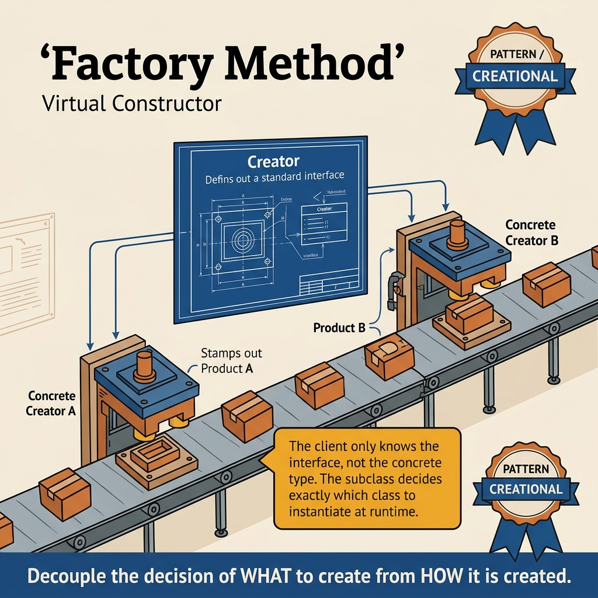
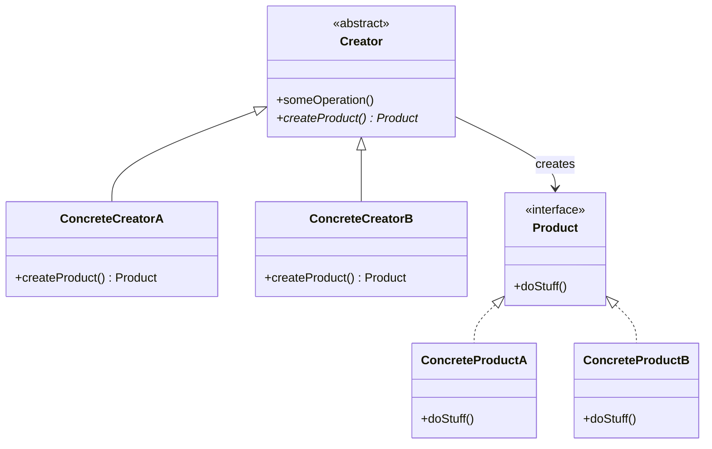
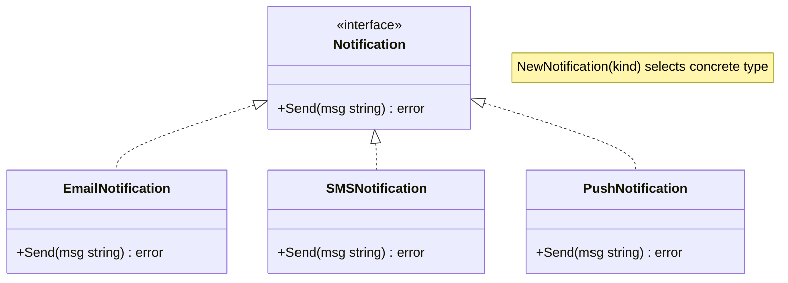
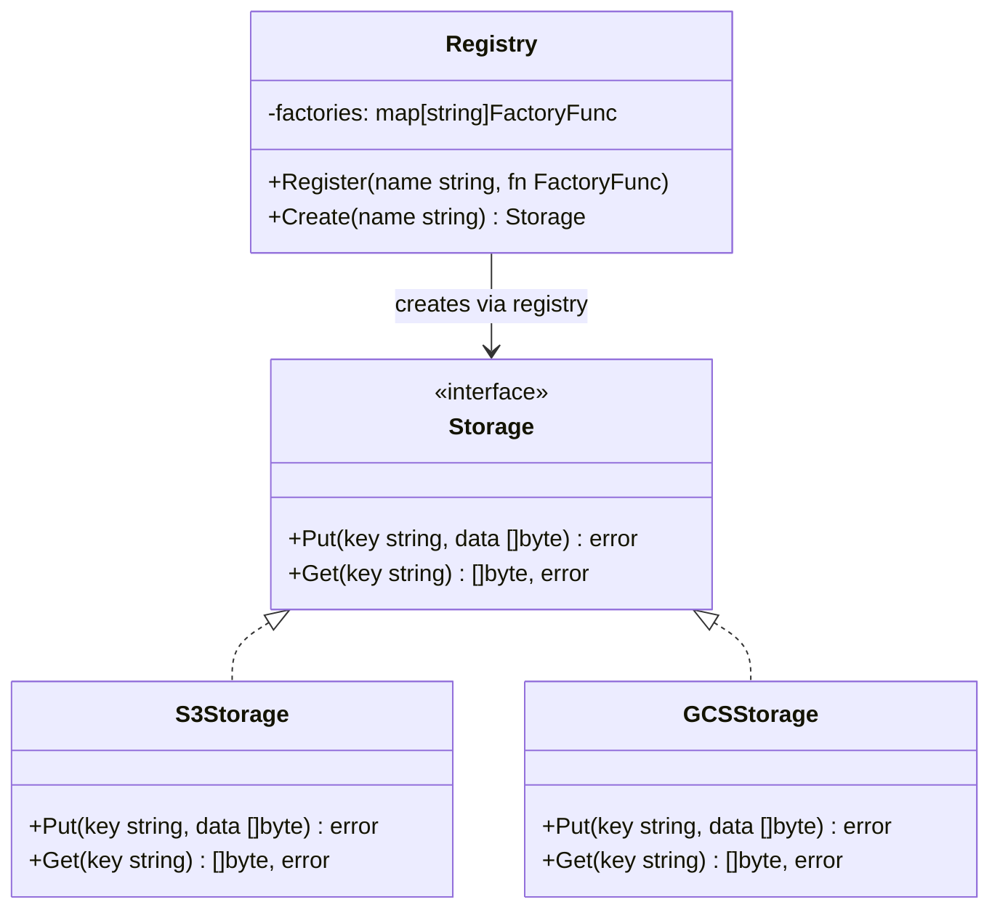
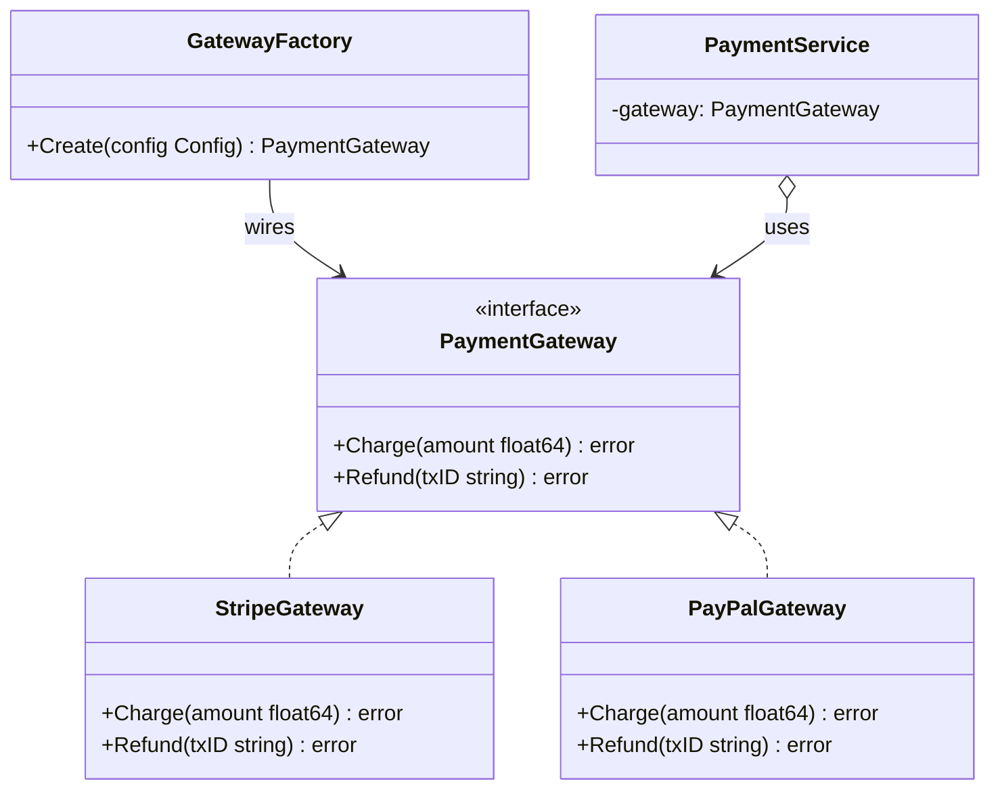

<!-- tags: design-pattern, creational, oop, factory -->
# 🏭 Factory Method

> You are shipping a notification service. Initially, you only have email, so your code overflows with `NewEmailSender()`. Next month, you add SMS. Next quarter, push notifications arrive. If adding a new provider forces you to edit `switch` statements in seven places, you do not lack a constructor. You lack an intentional object creation point.

📅 Created: 2026-03-19 · 🔄 Updated: 2026-04-02 · ⏱️ 20 min read

| Aspect | Detail |
| ------ | ------ |
| **Group** | Creational |
| **Purpose** | Separate the decision of choosing a concrete type from the usage code |
| **Go idiom** | Functions or registries returning interfaces |
| **SOLID** | Open/Closed, Dependency Inversion |
| **Also known as** | Virtual Constructor |

---

## 1. DEFINE

Imagine reaching the final sprint. The product must enable a new provider, but the business flow refuses to know which specific object gets initialized. When selection logic spills outside a single point, you immediately need a clean object creation boundary.

You face a familiar use case. A business task sends notifications. One environment uses email, another uses SMS, and marketing campaigns use push notifications. If business code manually calls `new` on each concrete sender, every new provider requires editing multiple unrelated files.

`Factory Method` creates a stable object creation point. The client requests an **abstraction** (`Notifier`, `Transport`, `Storage`). The factory decides which concrete implementation generates. The core idea is not about the `new` keyword. The core idea is **consolidating the concrete type selection logic into one place**.

Core insight: **The client must depend on the product interface. Selection logic must stay inside the factory boundary**.

| Term | Role | In Go |
| --------- | ------- | -------- |
| **Product** | The interface the client actually needs | `type Notifier interface` |
| **Concrete Product** | The specific implementation | `EmailNotifier`, `SMSNotifier` |
| **Creator / Factory** | The product creation point | `NewNotifier(kind string)` |
| **Registry Factory** | An extensible factory using runtime registration | `map[string]Constructor` |

| Approach | Pros | Trade-offs | When to choose |
| -------- | ------- | --------- | -------- |
| Direct constructor | Easy to write fast | Client couples to the concrete type | Use for simple, unchanging objects |
| Simple factory | Centralizes selection | A `switch` balloons when types surge | Good starting point |
| Registry factory | Extends without editing the core factory | Requires managing registration and validation | Use for plugin/provider ecosystems |

### 1.1 When to use

- Multiple implementations share the same interface.
- Configuration, environment, tenant, or feature flags select the implementation type.
- You want to hide concrete classes from clients.

### 1.2 When not to use

- Only one concrete type exists and will almost certainly never change.
- Selection logic remains trivial, reducing the factory to a meaningless middle layer.
- You actually need a **family of related products**, which requires an Abstract Factory.

### 1.3 Invariants & Failure Modes

- Factories must return an **interface**. They must not expose concrete types without an explicit reason.
- An unknown kind must not panic silently. It must return a clear error.
- Registry factories must enforce thread-safe registration if the application allows plugins or runtime mutations.
- The most common failure mode occurs when a factory simply moves a `switch` block, forcing the client to type-assert back to a concrete type.

---

These failure modes sound familiar. The most typical trap involves moving the `switch` block while the client still type-asserts. This trap appears in PITFALLS.

## 2. VISUAL

The definition establishes the vocabulary and boundaries. A global view clarifies who holds what and who ignores what.

### Overview — Factory Method Landscape



*Figure: Four core roles. Clients only know the interface. Factories consolidate selection logic. Concrete Products implement logic independently. Registries allow expansion without modifying the core.*

### Level 1 — Simple Selection Boundary
This diagram answers: **Where does the Factory Method move the concrete type selection decision?**

```text
Client
  │  wants Notifier
  ▼
NewNotifier("sms")
  │
  ├── "email" -> EmailNotifier
  ├── "sms"   -> SMSNotifier
  └── "push"  -> PushNotifier
  │
  ▼
Notifier interface
```
*The client no longer creates `EmailNotifier` or `SMSNotifier` manually. It only requests a `Notifier` matching the current kind.*

### Level 2 — Registry Factory
This diagram answers: **How does a registry factory expand without modifying the core factory?**

```mermaid
flowchart TD
    A[Client] --> B[Create kind]
    B --> C{registry[kind]?}
    C -->|Yes| D[constructor()]
    C -->|No| E[return unknown-kind error]
    D --> F[Notifier interface]
```
*Using a registry removes the need for the factory to know all concrete types upfront. The extension point lies in constructor registration, not in a hard-coded `switch`.*

### UML — Factory Method Class Structure


*The Creator declares a factory method returning a Product. ConcreteCreators override it to return a specific ConcreteProduct. The client only interacts with the Creator and the Product interface.*

---

## 3. CODE

The flow looks good in theory. Implementation reveals that the `🏭 Factory Method` relies on interfaces, composition, and keeping decisions from leaking into callers.

### Example 1: Basic — Simple Factory Function

> **Goal**: Create the correct `Notifier` based on `kind` without coupling the client to concrete types.



> **Approach**: A factory function uses a `switch` statement and returns an interface.
> **Example**: `NewNotifier("sms")` returns an `SMSNotifier`.
> **Complexity**: O(1) selection plus the concrete product initialization cost.

```go
// notifier_factory.go — Factory Method: choose notifier implementation by kind
package notifier

import (
	"fmt"
	"strings"
)

type Notifier interface {
	Send(recipient, message string) error
	Channel() string
}

type EmailNotifier struct{ From string }
type SMSNotifier struct{ Provider string }
type PushNotifier struct{ AppID string }

func (n *EmailNotifier) Send(recipient, message string) error {
	fmt.Printf("email to %s from %s: %s\n", recipient, n.From, message)
	return nil
}
func (n *EmailNotifier) Channel() string { return "email" }

func (n *SMSNotifier) Send(recipient, message string) error {
	if !strings.HasPrefix(recipient, "+") {
		return fmt.Errorf("sms recipient must start with '+'")
	}
	fmt.Printf("sms to %s via %s: %s\n", recipient, n.Provider, message)
	return nil
}
func (n *SMSNotifier) Channel() string { return "sms" }

func (n *PushNotifier) Send(recipient, message string) error {
	fmt.Printf("push to %s via app %s: %s\n", recipient, n.AppID, message)
	return nil
}
func (n *PushNotifier) Channel() string { return "push" }

func NewNotifier(kind string) (Notifier, error) {
	switch strings.ToLower(kind) {
	case "email":
		return &EmailNotifier{From: "noreply@example.com"}, nil
	case "sms":
		return &SMSNotifier{Provider: "twilio"}, nil
	case "push":
		return &PushNotifier{AppID: "mobile-app"}, nil
	default:
		return nil, fmt.Errorf("unknown notifier kind: %s", kind)
	}
}
```
```typescript
// notifier_factory.ts — Factory Method: choose notifier implementation by kind
interface Notifier {
  send(recipient: string, message: string): Promise<void>;
  channel(): string;
}

class EmailNotifier implements Notifier {
  constructor(private readonly from: string) {}
  async send(recipient: string, message: string): Promise<void> {
    console.log(`email to ${recipient} from ${this.from}: ${message}`);
  }
  channel(): string { return "email"; }
}

class SMSNotifier implements Notifier {
  constructor(private readonly provider: string) {}
  async send(recipient: string, message: string): Promise<void> {
    if (!recipient.startsWith("+")) throw new Error("sms recipient must start with '+'");
    console.log(`sms to ${recipient} via ${this.provider}: ${message}`);
  }
  channel(): string { return "sms"; }
}

class PushNotifier implements Notifier {
  constructor(private readonly appId: string) {}
  async send(recipient: string, message: string): Promise<void> {
    console.log(`push to ${recipient} via app ${this.appId}: ${message}`);
  }
  channel(): string { return "push"; }
}

function newNotifier(kind: string): Notifier {
  switch (kind.toLowerCase()) {
    case "email": return new EmailNotifier("noreply@example.com");
    case "sms": return new SMSNotifier("twilio");
    case "push": return new PushNotifier("mobile-app");
    default: throw new Error(`unknown notifier kind: ${kind}`);
  }
}
```
```java
// NotifierFactoryBasic.java — Factory Method: choose notifier implementation by kind
interface Notifier {
    void send(String recipient, String message);
    String channel();
}

final class EmailNotifier implements Notifier {
    private final String from;
    EmailNotifier(String from) { this.from = from; }
    public void send(String recipient, String message) {
        System.out.printf("email to %s from %s: %s%n", recipient, from, message);
    }
    public String channel() { return "email"; }
}

final class SMSNotifier implements Notifier {
    private final String provider;
    SMSNotifier(String provider) { this.provider = provider; }
    public void send(String recipient, String message) {
        if (!recipient.startsWith("+")) throw new IllegalArgumentException("sms recipient must start with '+'");
        System.out.printf("sms to %s via %s: %s%n", recipient, provider, message);
    }
    public String channel() { return "sms"; }
}

final class PushNotifier implements Notifier {
    private final String appId;
    PushNotifier(String appId) { this.appId = appId; }
    public void send(String recipient, String message) {
        System.out.printf("push to %s via app %s: %s%n", recipient, appId, message);
    }
    public String channel() { return "push"; }
}

final class NotifierFactoryBasic {
    private NotifierFactoryBasic() {}
    static Notifier newNotifier(String kind) {
        return switch (kind.toLowerCase()) {
            case "email" -> new EmailNotifier("noreply@example.com");
            case "sms" -> new SMSNotifier("twilio");
            case "push" -> new PushNotifier("mobile-app");
            default -> throw new IllegalArgumentException("unknown notifier kind: " + kind);
        };
    }
}
```
```rust
// notifier_factory.rs — Factory Method: choose notifier implementation by kind
trait Notifier {
    fn send(&self, recipient: &str, message: &str) -> Result<(), String>;
    fn channel(&self) -> &'static str;
}

struct EmailNotifier { from: String }
struct SMSNotifier { provider: String }
struct PushNotifier { app_id: String }

impl Notifier for EmailNotifier {
    fn send(&self, recipient: &str, message: &str) -> Result<(), String> {
        println!("email to {} from {}: {}", recipient, self.from, message);
        Ok(())
    }
    fn channel(&self) -> &'static str { "email" }
}

impl Notifier for SMSNotifier {
    fn send(&self, recipient: &str, message: &str) -> Result<(), String> {
        if !recipient.starts_with('+') {
            return Err("sms recipient must start with '+'".into());
        }
        println!("sms to {} via {}: {}", recipient, self.provider, message);
        Ok(())
    }
    fn channel(&self) -> &'static str { "sms" }
}

impl Notifier for PushNotifier {
    fn send(&self, recipient: &str, message: &str) -> Result<(), String> {
        println!("push to {} via app {}: {}", recipient, self.app_id, message);
        Ok(())
    }
    fn channel(&self) -> &'static str { "push" }
}

fn new_notifier(kind: &str) -> Result<Box<dyn Notifier>, String> {
    match kind.to_lowercase().as_str() {
        "email" => Ok(Box::new(EmailNotifier { from: "noreply@example.com".into() })),
        "sms" => Ok(Box::new(SMSNotifier { provider: "twilio".into() })),
        "push" => Ok(Box::new(PushNotifier { app_id: "mobile-app".into() })),
        _ => Err(format!("unknown notifier kind: {}", kind)),
    }
}
```
```cpp
// notifier_factory.cpp — Factory Method: choose notifier implementation by kind
class Notifier {
public:
    virtual ~Notifier() = default;
    virtual void send(const std::string& recipient, const std::string& message) = 0;
    virtual std::string channel() const = 0;
};

class EmailNotifier final : public Notifier {
    std::string from;
public:
    explicit EmailNotifier(std::string from) : from(std::move(from)) {}
    void send(const std::string& recipient, const std::string& message) override {
        std::cout << "email to " << recipient << " from " << from << ": " << message << '\n';
    }
    std::string channel() const override { return "email"; }
};

class SMSNotifier final : public Notifier {
    std::string provider;
public:
    explicit SMSNotifier(std::string provider) : provider(std::move(provider)) {}
    void send(const std::string& recipient, const std::string& message) override {
        if (recipient.empty() || recipient[0] != '+') throw std::invalid_argument("sms recipient must start with '+'");
        std::cout << "sms to " << recipient << " via " << provider << ": " << message << '\n';
    }
    std::string channel() const override { return "sms"; }
};

class PushNotifier final : public Notifier {
    std::string appId;
public:
    explicit PushNotifier(std::string appId) : appId(std::move(appId)) {}
    void send(const std::string& recipient, const std::string& message) override {
        std::cout << "push to " << recipient << " via app " << appId << ": " << message << '\n';
    }
    std::string channel() const override { return "push"; }
};

std::unique_ptr<Notifier> newNotifier(const std::string& kind) {
    if (kind == "email") return std::make_unique<EmailNotifier>("noreply@example.com");
    if (kind == "sms") return std::make_unique<SMSNotifier>("twilio");
    if (kind == "push") return std::make_unique<PushNotifier>("mobile-app");
    throw std::invalid_argument("unknown notifier kind: " + kind);
}
```
```python
# notifier_factory.py — Factory Method: choose notifier implementation by kind
from abc import ABC, abstractmethod


class Notifier(ABC):
    @abstractmethod
    def send(self, recipient: str, message: str) -> None: ...

    @abstractmethod
    def channel(self) -> str: ...


class EmailNotifier(Notifier):
    def __init__(self, from_address: str) -> None:
        self.from_address = from_address

    def send(self, recipient: str, message: str) -> None:
        print(f"email to {recipient} from {self.from_address}: {message}")

    def channel(self) -> str:
        return "email"


class SMSNotifier(Notifier):
    def __init__(self, provider: str) -> None:
        self.provider = provider

    def send(self, recipient: str, message: str) -> None:
        if not recipient.startswith("+"):
            raise ValueError("sms recipient must start with '+'")
        print(f"sms to {recipient} via {self.provider}: {message}")

    def channel(self) -> str:
        return "sms"


class PushNotifier(Notifier):
    def __init__(self, app_id: str) -> None:
        self.app_id = app_id

    def send(self, recipient: str, message: str) -> None:
        print(f"push to {recipient} via app {self.app_id}: {message}")

    def channel(self) -> str:
        return "push"


def new_notifier(kind: str) -> Notifier:
    match kind.lower():
        case "email":
            return EmailNotifier("noreply@example.com")
        case "sms":
            return SMSNotifier("twilio")
        case "push":
            return PushNotifier("mobile-app")
        case _:
            raise ValueError(f"unknown notifier kind: {kind}")
```

> **Conclusion**: The basic version reveals the primary value of the Factory Method. It lets you add new providers without forcing clients to manually invoke `new` on concrete types.

---

Simple factories work well. However, expansion requires a registry. Let's register constructors.

### Example 2: Intermediate — Registry-Based Factory

> **Goal**: Expand the factory without adding new `case` statements to the core selection logic.



> **Approach**: Register constructors by key in a thread-safe registry.
> **Example**: A `slack` or `webhook` plugin registers its own constructor independently.
> **Complexity**: Average O(1) registry lookup plus constructor cost.

```go
// notifier_registry.go — Factory Method: registry-based extensibility
package notifier

import (
	"fmt"
	"strings"
	"sync"
)

type Constructor func(map[string]string) (Notifier, error)

type Registry struct {
	mu           sync.RWMutex
	constructors map[string]Constructor
}

func NewRegistry() *Registry {
	return &Registry{constructors: map[string]Constructor{}}
}

func (r *Registry) Register(kind string, ctor Constructor) error {
	r.mu.Lock()
	defer r.mu.Unlock()

	key := strings.ToLower(kind)
	if _, exists := r.constructors[key]; exists {
		return fmt.Errorf("constructor already registered: %s", key)
	}
	r.constructors[key] = ctor
	return nil
}

func (r *Registry) Create(kind string, cfg map[string]string) (Notifier, error) {
	r.mu.RLock()
	ctor, ok := r.constructors[strings.ToLower(kind)]
	r.mu.RUnlock()
	if !ok {
		return nil, fmt.Errorf("unknown notifier kind: %s", kind)
	}
	return ctor(cfg)
}
```
```typescript
// notifier_registry.ts — Factory Method: registry-based extensibility
type Constructor = (cfg: Record<string, string>) => Notifier;

class NotifierRegistry {
  private readonly constructors = new Map<string, Constructor>();

  register(kind: string, ctor: Constructor): void {
    const key = kind.toLowerCase();
    if (this.constructors.has(key)) throw new Error(`constructor already registered: ${key}`);
    this.constructors.set(key, ctor);
  }

  create(kind: string, cfg: Record<string, string>): Notifier {
    const ctor = this.constructors.get(kind.toLowerCase());
    if (!ctor) throw new Error(`unknown notifier kind: ${kind}`);
    return ctor(cfg);
  }
}
```
```java
// NotifierFactoryIntermediate.java — Factory Method: registry-based extensibility
import java.util.HashMap;
import java.util.Map;
import java.util.function.Function;

final class NotifierFactoryIntermediate {
    private final Map<String, Function<Map<String, String>, Notifier>> constructors = new HashMap<>();

    void register(String kind, Function<Map<String, String>, Notifier> ctor) {
        String key = kind.toLowerCase();
        if (constructors.containsKey(key)) throw new IllegalArgumentException("constructor already registered: " + key);
        constructors.put(key, ctor);
    }

    Notifier create(String kind, Map<String, String> cfg) {
        var ctor = constructors.get(kind.toLowerCase());
        if (ctor == null) throw new IllegalArgumentException("unknown notifier kind: " + kind);
        return ctor.apply(cfg);
    }
}
```
```rust
// notifier_registry.rs — Factory Method: registry-based extensibility
use std::collections::HashMap;

type Constructor = fn(HashMap<String, String>) -> Result<Box<dyn Notifier>, String>;

struct Registry {
    constructors: HashMap<String, Constructor>,
}

impl Registry {
    fn new() -> Self {
        Self { constructors: HashMap::new() }
    }

    fn register(&mut self, kind: &str, ctor: Constructor) -> Result<(), String> {
        let key = kind.to_lowercase();
        if self.constructors.contains_key(&key) {
            return Err(format!("constructor already registered: {}", key));
        }
        self.constructors.insert(key, ctor);
        Ok(())
    }

    fn create(&self, kind: &str, cfg: HashMap<String, String>) -> Result<Box<dyn Notifier>, String> {
        let key = kind.to_lowercase();
        let ctor = self.constructors.get(&key).ok_or_else(|| format!("unknown notifier kind: {}", key))?;
        ctor(cfg)
    }
}
```
```cpp
// notifier_registry.cpp — Factory Method: registry-based extensibility
using Constructor = std::function<std::unique_ptr<Notifier>(const std::unordered_map<std::string, std::string>&)>;

class NotifierRegistry {
    std::unordered_map<std::string, Constructor> constructors;
public:
    void registerKind(const std::string& kind, Constructor ctor) {
        auto [_, inserted] = constructors.emplace(kind, std::move(ctor));
        if (!inserted) throw std::invalid_argument("constructor already registered: " + kind);
    }

    std::unique_ptr<Notifier> create(const std::string& kind, const std::unordered_map<std::string, std::string>& cfg) const {
        auto it = constructors.find(kind);
        if (it == constructors.end()) throw std::invalid_argument("unknown notifier kind: " + kind);
        return it->second(cfg);
    }
};
```
```python
# notifier_registry.py — Factory Method: registry-based extensibility
from collections.abc import Callable

Constructor = Callable[[dict[str, str]], Notifier]


class NotifierRegistry:
    def __init__(self) -> None:
        self._constructors: dict[str, Constructor] = {}

    def register(self, kind: str, ctor: Constructor) -> None:
        key = kind.lower()
        if key in self._constructors:
            raise ValueError(f"constructor already registered: {key}")
        self._constructors[key] = ctor

    def create(self, kind: str, cfg: dict[str, str]) -> Notifier:
        key = kind.lower()
        if key not in self._constructors:
            raise ValueError(f"unknown notifier kind: {kind}")
        return self._constructors[key](cfg)
```

> **Why?** A `switch`-based factory creates a great starting point, but it forces a single point of modification. A registry-based factory pushes the extension point outward. The core factory ignores future providers and only looks up registered constructors.

> **Conclusion**: When concrete products increase or a plugin model emerges, a registry factory naturally evolves from a simple factory.

---

We covered registries. Service wiring needs factory injection. Let's connect them.

### Example 3: Advanced — Factory Method + Service Wiring

> **Goal**: Use a factory to inject dependencies into a service without the service relying on concrete types.



> **Approach**: The factory creates a `Storage` based on configuration, while the service strictly relies on interfaces.
> **Example**: Moving from a local filesystem to S3 leaves the upload service untouched.
> **Complexity**: O(1) selection plus the dependency initialization cost tied to the backend.

```go
// storage_factory.go — Factory Method: wire service with pluggable storage backend
package storage

import "fmt"

type Storage interface {
	Save(path string, content []byte) error
	Kind() string
}

type LocalStorage struct{ BasePath string }
type S3Storage struct{ Bucket string }

func (s *LocalStorage) Save(path string, content []byte) error {
	fmt.Printf("saving %d bytes to local path %s/%s\n", len(content), s.BasePath, path)
	return nil
}
func (s *LocalStorage) Kind() string { return "local" }

func (s *S3Storage) Save(path string, content []byte) error {
	fmt.Printf("saving %d bytes to s3://%s/%s\n", len(content), s.Bucket, path)
	return nil
}
func (s *S3Storage) Kind() string { return "s3" }

func NewStorage(kind string, cfg map[string]string) (Storage, error) {
	switch kind {
	case "local":
		return &LocalStorage{BasePath: cfg["base_path"]}, nil
	case "s3":
		return &S3Storage{Bucket: cfg["bucket"]}, nil
	default:
		return nil, fmt.Errorf("unknown storage kind: %s", kind)
	}
}

type UploadService struct {
	storage Storage
}

func NewUploadService(storage Storage) *UploadService {
	return &UploadService{storage: storage}
}

func (s *UploadService) UploadAvatar(userID string, image []byte) error {
	path := fmt.Sprintf("avatars/%s.png", userID)
	return s.storage.Save(path, image)
}
```
```typescript
// storage_factory.ts — Factory Method: wire service with pluggable storage backend
interface Storage {
  save(path: string, content: Uint8Array): Promise<void>;
  kind(): string;
}

class LocalStorage implements Storage {
  constructor(private readonly basePath: string) {}
  async save(path: string, content: Uint8Array): Promise<void> {
    console.log(`saving ${content.length} bytes to local path ${this.basePath}/${path}`);
  }
  kind(): string { return "local"; }
}

class S3Storage implements Storage {
  constructor(private readonly bucket: string) {}
  async save(path: string, content: Uint8Array): Promise<void> {
    console.log(`saving ${content.length} bytes to s3://${this.bucket}/${path}`);
  }
  kind(): string { return "s3"; }
}

function newStorage(kind: string, cfg: Record<string, string>): Storage {
  switch (kind) {
    case "local": return new LocalStorage(cfg.base_path);
    case "s3": return new S3Storage(cfg.bucket);
    default: throw new Error(`unknown storage kind: ${kind}`);
  }
}

class UploadService {
  constructor(private readonly storage: Storage) {}
  uploadAvatar(userId: string, image: Uint8Array): Promise<void> {
    return this.storage.save(`avatars/${userId}.png`, image);
  }
}
```
```java
// StorageFactoryAdvanced.java — Factory Method: wire service with pluggable storage backend
interface Storage {
    void save(String path, byte[] content);
    String kind();
}

final class LocalStorage implements Storage {
    private final String basePath;
    LocalStorage(String basePath) { this.basePath = basePath; }
    public void save(String path, byte[] content) {
        System.out.printf("saving %d bytes to local path %s/%s%n", content.length, basePath, path);
    }
    public String kind() { return "local"; }
}

final class S3Storage implements Storage {
    private final String bucket;
    S3Storage(String bucket) { this.bucket = bucket; }
    public void save(String path, byte[] content) {
        System.out.printf("saving %d bytes to s3://%s/%s%n", content.length, bucket, path);
    }
    public String kind() { return "s3"; }
}

final class StorageFactoryAdvanced {
    private StorageFactoryAdvanced() {}
    static Storage newStorage(String kind, java.util.Map<String, String> cfg) {
        return switch (kind) {
            case "local" -> new LocalStorage(cfg.get("base_path"));
            case "s3" -> new S3Storage(cfg.get("bucket"));
            default -> throw new IllegalArgumentException("unknown storage kind: " + kind);
        };
    }
}
```
```rust
// storage_factory.rs — Factory Method: wire service with pluggable storage backend
trait Storage {
    fn save(&self, path: &str, content: &[u8]) -> Result<(), String>;
    fn kind(&self) -> &'static str;
}

struct LocalStorage { base_path: String }
struct S3Storage { bucket: String }

impl Storage for LocalStorage {
    fn save(&self, path: &str, content: &[u8]) -> Result<(), String> {
        println!("saving {} bytes to local path {}/{}", content.len(), self.base_path, path);
        Ok(())
    }
    fn kind(&self) -> &'static str { "local" }
}

impl Storage for S3Storage {
    fn save(&self, path: &str, content: &[u8]) -> Result<(), String> {
        println!("saving {} bytes to s3://{}/{}", content.len(), self.bucket, path);
        Ok(())
    }
    fn kind(&self) -> &'static str { "s3" }
}

fn new_storage(kind: &str, cfg: std::collections::HashMap<String, String>) -> Result<Box<dyn Storage>, String> {
    match kind {
        "local" => Ok(Box::new(LocalStorage { base_path: cfg.get("base_path").cloned().unwrap_or_default() })),
        "s3" => Ok(Box::new(S3Storage { bucket: cfg.get("bucket").cloned().unwrap_or_default() })),
        _ => Err(format!("unknown storage kind: {}", kind)),
    }
}
```
```cpp
// storage_factory.cpp — Factory Method: wire service with pluggable storage backend
class Storage {
public:
    virtual ~Storage() = default;
    virtual void save(const std::string& path, const std::vector<std::byte>& content) = 0;
    virtual std::string kind() const = 0;
};

class LocalStorage final : public Storage {
    std::string basePath;
public:
    explicit LocalStorage(std::string basePath) : basePath(std::move(basePath)) {}
    void save(const std::string& path, const std::vector<std::byte>& content) override {
        std::cout << "saving " << content.size() << " bytes to local path " << basePath << '/' << path << '\n';
    }
    std::string kind() const override { return "local"; }
};

class S3Storage final : public Storage {
    std::string bucket;
public:
    explicit S3Storage(std::string bucket) : bucket(std::move(bucket)) {}
    void save(const std::string& path, const std::vector<std::byte>& content) override {
        std::cout << "saving " << content.size() << " bytes to s3://" << bucket << '/' << path << '\n';
    }
    std::string kind() const override { return "s3"; }
};

std::unique_ptr<Storage> newStorage(const std::string& kind, const std::unordered_map<std::string, std::string>& cfg) {
    if (kind == "local") return std::make_unique<LocalStorage>(cfg.count("base_path") ? cfg.at("base_path") : "");
    if (kind == "s3") return std::make_unique<S3Storage>(cfg.count("bucket") ? cfg.at("bucket") : "");
    throw std::invalid_argument("unknown storage kind: " + kind);
}
```
```python
# storage_factory.py — Factory Method: wire service with pluggable storage backend
from abc import ABC, abstractmethod


class Storage(ABC):
    @abstractmethod
    def save(self, path: str, content: bytes) -> None: ...

    @abstractmethod
    def kind(self) -> str: ...


class LocalStorage(Storage):
    def __init__(self, base_path: str) -> None:
        self.base_path = base_path

    def save(self, path: str, content: bytes) -> None:
        print(f"saving {len(content)} bytes to local path {self.base_path}/{path}")

    def kind(self) -> str:
        return "local"


class S3Storage(Storage):
    def __init__(self, bucket: str) -> None:
        self.bucket = bucket

    def save(self, path: str, content: bytes) -> None:
        print(f"saving {len(content)} bytes to s3://{self.bucket}/{path}")

    def kind(self) -> str:
        return "s3"


def new_storage(kind: str, cfg: dict[str, str]) -> Storage:
    if kind == "local":
        return LocalStorage(cfg["base_path"])
    if kind == "s3":
        return S3Storage(cfg["bucket"])
    raise ValueError(f"unknown storage kind: {kind}")


class UploadService:
    def __init__(self, storage: Storage) -> None:
        self.storage = storage

    def upload_avatar(self, user_id: str, image: bytes) -> None:
        path = f"avatars/{user_id}.png"
        self.storage.save(path, image)
```

> **Why?** The Factory Method shines brightest when it blocks dependency leaks. `UploadService` ignores `LocalStorage` and `S3Storage`. It only demands `Storage`. Consequently, changing the storage backend cannot pollute the business flow.

> **Conclusion**: The advanced use of the Factory Method does not involve writing "cooler" factories. It focuses on keeping the service layer decoupled from concrete infrastructure.

---

You explored simple factories, registries, and service wiring. The danger now comes from reverse type assertions and silent panics. We set up these traps earlier.

## 4. PITFALLS

The `🏭 Factory Method` routinely suffers misunderstanding. The pattern remains in the code, but it loses the boundary it promises. These pitfalls explain why.

| # | Severity | Error | Consequence | Fix |
|---|----------|-----|---------|-----|
| 1 | 🔴 Fatal | The factory returns a concrete type, forcing the client to type-assert backwards | Nullified abstractions | The client must exclusively use the product interface |
| 2 | 🟡 Common | Unknown kinds trigger panics instead of returning errors | Uncontrollable runtime failures | Return explicit errors from the factory |
| 3 | 🟡 Common | The factory `switch` balloons massively without transitioning to a registry or plugin model | The factory becomes a severe bottleneck | Shift to a registry when product variants grow |
| 4 | 🟡 Common | Using a Factory Method when an Abstract Factory makes more sense | Applying the wrong pattern warps the API | Review the Abstract Factory pattern |
| 5 | 🔵 Minor | Describing factories solely as "object creators" | Missing the core point regarding dependency boundaries | Always explain where the selection logic consolidates |

---

You navigated the Factory Method and its traps. The resources below provide deeper context.

## 5. REF

| Resource | Type | Link | Notes |
| -------- | ---- | ---- | ------- |
| Factory Method | Reference | https://refactoring.guru/design-patterns/factory-method | Standard structure and motivations |
| Effective Go | Official docs | https://go.dev/doc/effective_go | Interface-returning constructors in Go |
| Dependency Inversion Principle | Reference | https://martinfowler.com/articles/dipInTheWild.html | Background on abstraction boundaries |

---

## 6. RECOMMEND

Once you discover where the `🏭 Factory Method` succeeds and fails, subsequent articles should expand on that specific problem dimension rather than treating patterns as isolated fragments.

| Explore | When to use | Reason | File/Link |
| ------- | ------- | ----- | --------- |
| Abstract Factory | You have a whole family instead of one product | Maintain consistency across multiple products sharing variants | [02-abstract-factory.md](./02-abstract-factory.md) |
| Builder | An object demands too many configuration steps, not type selection | Construction complexity differs from selection complexity | [03-builder.md](./03-builder.md) |
| Adapter | Types already exist but interfaces clash | Bridge existing code into a new abstraction | [../structural/01-adapter.md](../structural/01-adapter.md) |

---

## 7. QUICK REF

**When to use**

- Multiple concrete implementations share the same interface.
- Configurations or runtime logic select implementations.
- Business code must avoid direct dependencies on concrete types.

**Template**

```text
Product interface
Concrete products
Factory returns Product
Client depends only on Product
```

**Links**: [← Creational Overview](./README.md) · [→ Abstract Factory](./02-abstract-factory.md)
