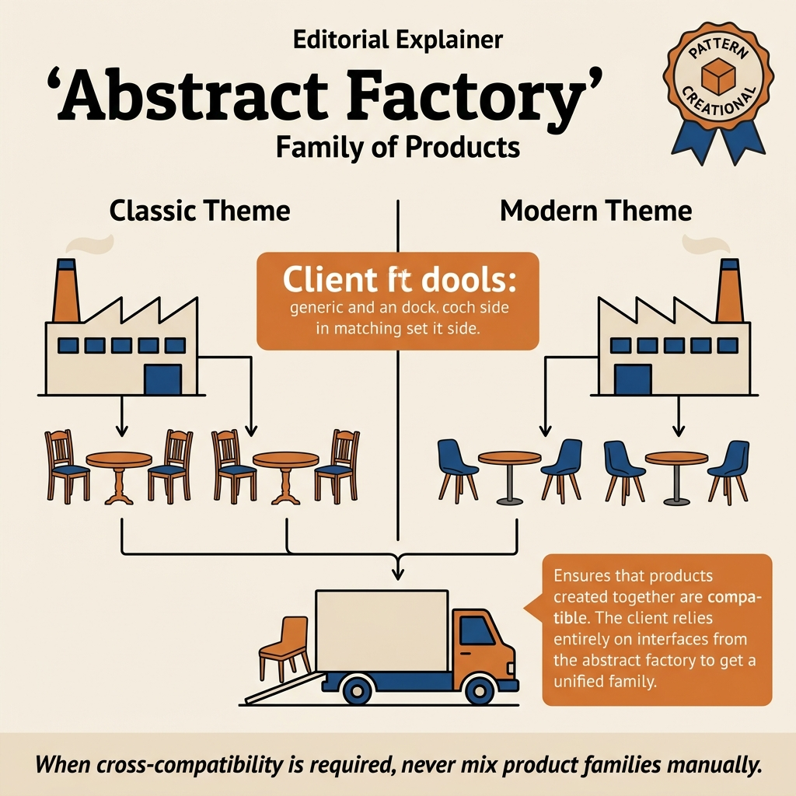
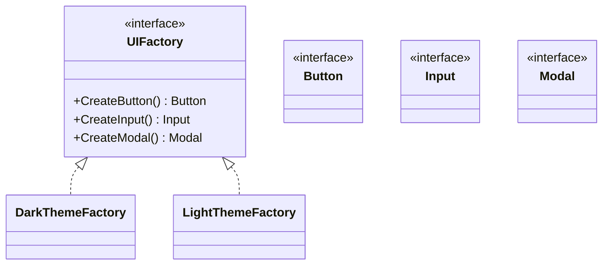
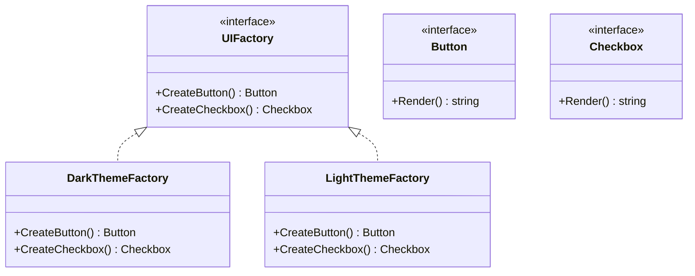
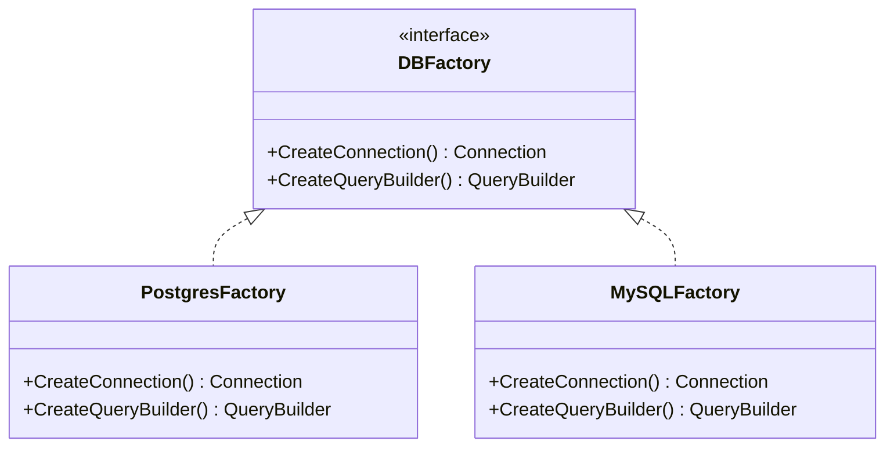
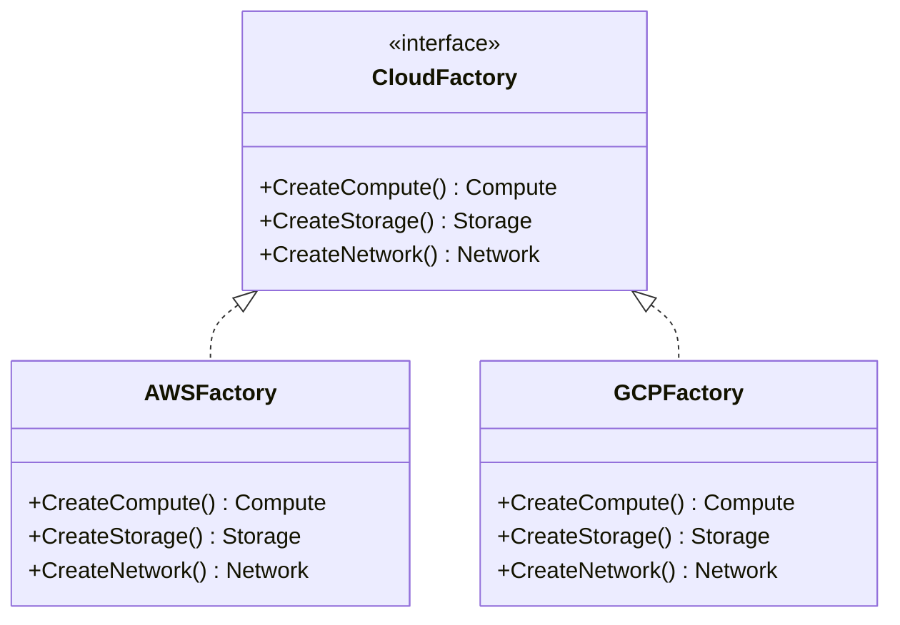

<!-- tags: design-pattern, creational, oop, abstract-factory -->
# 🧰 Abstract Factory

> You are building a multi-theme design system or a multi-platform app. If the code accidentally creates a `DarkButton` alongside a `LightModal`, the bug does not stem from rendering. The bug arises because the application lacks a boundary forcing products to instantiate within the same family.

📅 Created: 2026-03-19 · 🔄 Updated: 2026-04-02 · ⏱️ 20 min read

| Aspect | Detail |
| ------ | ------ |
| **Group** | Creational |
| **Purpose** | Create a family of related products matching a single variant |
| **Go idiom** | Interfaces defining multiple factory methods |
| **SOLID** | Open/Closed, Dependency Inversion |
| **Differs from Factory Method** | A Factory Method creates one product. An Abstract Factory creates multiple compatible products. |

---

## 1. DEFINE

You are building a UI kit or a payment stack where components must align with a single family. Light themes pair with light buttons. EU payment methods pair with EU tax policies. The problem no longer involves creating a single object. It centers on **keeping a family of objects synchronized**.

You must render a UI supporting both `dark` and `light` themes. A screen contains a `Button`, an `Input`, and a `Modal`. If discrete factories construct each component independently, a dark modal will eventually appear next to a light button. The individual components work fine, but grouping them into a cohesive family fails.

`Abstract Factory` solves the challenge of creating **multiple related product types** under one variant:
- A `DarkFactory` spawns a `DarkButton`, a `DarkInput`, and a `DarkModal`.
- A `LightFactory` spawns a `LightButton`, a `LightInput`, and a `LightModal`.

Core insight: **This pattern does more than hide concrete classes. It preserves consistency across multiple products within the same family.**

| Term | Role | Example |
| --------- | ------- | ----- |
| **Abstract Product** | Interface for a single product type | `Button`, `Input`, `Modal` |
| **Concrete Product** | A specific variant of a product | `DarkButton`, `LightButton` |
| **Abstract Factory** | Interface for building the whole family | `UIFactory` |
| **Concrete Factory** | A factory producing a specific variant | `DarkThemeFactory`, `LightThemeFactory` |

| Approach | Pros | Trade-offs | When to choose |
| -------- | ------- | --------- | -------- |
| Factory Method | Simpler, fits single products | Fails to ensure coherence across multiple products | Selecting one dependency |
| Abstract Factory | Keeps families consistent | New product types force updates across all factories | Theme/platform/provider families |
| Builder | Handles step-by-step construction | Ignores family compatibility | Complex object options |

### 1.1 When to use

- Multiple product types must strictly adhere to a single variant.
- You must prohibit mixing products from different families.
- A clean abstraction layer separates clients from concrete UI, provider, or platform classes.

### 1.2 When not to use

- The system only requires one product type.
- Variants remain rare, lacking the concept of family coherence.
- Product types fluctuate faster than variants, inflating the cost to maintain the factory interface.

### 1.3 Invariants & Failure Modes

- Each concrete factory must spawn **every** product type within its family.
- Products in the same family must align stylistically, operationally, and logically.
- A frequent failure mode: adding a new product type (like a `Tooltip` or `Dropdown`) but failing to update a concrete factory. This omission fractures the family.

---

These failure modes sound avoidable. However, a trap exists. Abstract factories applied to small families add unnecessary ceremony. Adding new product types forces updates across all concrete factories. This trap appears in PITFALLS.

## 2. VISUAL

Family coherence sounds abstract. A visual layout clarifies why aggregating creation methods into a single factory matters.

### Overview — Abstract Factory Landscape



*Figure: One Abstract Factory contract dictates multiple Concrete Factories. Each family spawns a consistent product suite.*

### Level 1 — Family Consistency
This diagram answers: **What does an Abstract Factory protect?**

```text
Client
  │ uses UIFactory
  ▼
UIFactory
  ├── CreateButton()
  ├── CreateInput()
  └── CreateModal()

DarkThemeFactory  -> DarkButton,  DarkInput,  DarkModal
LightThemeFactory -> LightButton, LightInput, LightModal
```
*Figure: The client never assembles isolated concrete products. It receives an entire synchronized family from one factory.*

### Level 2 — Vendor Family Boundary
This diagram answers: **Why is an Abstract Factory stronger than disparate Factory Methods?**



*Figure: An Abstract Factory binds multiple creation methods into a single boundary. The client chooses an entire family once instead of picking concrete products piecemeal.*

---

## 3. CODE

Diagrams only show the surface. The code reveals how the `🧰 Abstract Factory` leverages interfaces and composition without leaking decisions to the caller.

### Example 1: Basic — Theme UI Factory

> **Goal**: Generate consistent `Button`, `Input`, and `Modal` components across `dark` and `light` themes.



> **Approach**: `UIFactory` outlines the entire family. Each concrete factory spawns products matching its theme.
> **Example**: `RenderLoginScreen(factory)` does not care about dark or light themes, but it guarantees widget synchronization.
> **Complexity**: O(1) product creation plus the initialization cost for each widget.

```go
// ui_factory.go — Abstract Factory: create a full UI family per theme
package ui

type Button interface{ Render() string }
type Input interface{ Render() string }
type Modal interface{ Render() string }

type UIFactory interface {
	CreateButton(label string) Button
	CreateInput(name string) Input
	CreateModal(title string) Modal
}

type DarkButton struct{ Label string }
type DarkInput struct{ Name string }
type DarkModal struct{ Title string }

func (w *DarkButton) Render() string { return "[dark-button:" + w.Label + "]" }
func (w *DarkInput) Render() string  { return "[dark-input:" + w.Name + "]" }
func (w *DarkModal) Render() string  { return "[dark-modal:" + w.Title + "]" }

type LightButton struct{ Label string }
type LightInput struct{ Name string }
type LightModal struct{ Title string }

func (w *LightButton) Render() string { return "[light-button:" + w.Label + "]" }
func (w *LightInput) Render() string  { return "[light-input:" + w.Name + "]" }
func (w *LightModal) Render() string  { return "[light-modal:" + w.Title + "]" }

type DarkThemeFactory struct{}

func (DarkThemeFactory) CreateButton(label string) Button { return &DarkButton{Label: label} }
func (DarkThemeFactory) CreateInput(name string) Input    { return &DarkInput{Name: name} }
func (DarkThemeFactory) CreateModal(title string) Modal   { return &DarkModal{Title: title} }

type LightThemeFactory struct{}

func (LightThemeFactory) CreateButton(label string) Button { return &LightButton{Label: label} }
func (LightThemeFactory) CreateInput(name string) Input    { return &LightInput{Name: name} }
func (LightThemeFactory) CreateModal(title string) Modal   { return &LightModal{Title: title} }
```
```typescript
// ui_factory.ts — Abstract Factory: create a full UI family per theme
interface Button { render(): string; }
interface Input { render(): string; }
interface Modal { render(): string; }

interface UIFactory {
  createButton(label: string): Button;
  createInput(name: string): Input;
  createModal(title: string): Modal;
}

class DarkButton implements Button { constructor(private readonly label: string) {} render() { return `[dark-button:${this.label}]`; } }
class DarkInput implements Input { constructor(private readonly name: string) {} render() { return `[dark-input:${this.name}]`; } }
class DarkModal implements Modal { constructor(private readonly title: string) {} render() { return `[dark-modal:${this.title}]`; } }

class LightButton implements Button { constructor(private readonly label: string) {} render() { return `[light-button:${this.label}]`; } }
class LightInput implements Input { constructor(private readonly name: string) {} render() { return `[light-input:${this.name}]`; } }
class LightModal implements Modal { constructor(private readonly title: string) {} render() { return `[light-modal:${this.title}]`; } }

class DarkThemeFactory implements UIFactory {
  createButton(label: string): Button { return new DarkButton(label); }
  createInput(name: string): Input { return new DarkInput(name); }
  createModal(title: string): Modal { return new DarkModal(title); }
}

class LightThemeFactory implements UIFactory {
  createButton(label: string): Button { return new LightButton(label); }
  createInput(name: string): Input { return new LightInput(name); }
  createModal(title: string): Modal { return new LightModal(title); }
}
```
```java
// UIFactoryBasic.java — Abstract Factory: create a full UI family per theme
interface Button { String render(); }
interface Input { String render(); }
interface Modal { String render(); }

interface UIFactory {
    Button createButton(String label);
    Input createInput(String name);
    Modal createModal(String title);
}

final class DarkButton implements Button {
    private final String label;
    DarkButton(String label) { this.label = label; }
    public String render() { return "[dark-button:" + label + "]"; }
}

final class DarkInput implements Input {
    private final String name;
    DarkInput(String name) { this.name = name; }
    public String render() { return "[dark-input:" + name + "]"; }
}

final class DarkModal implements Modal {
    private final String title;
    DarkModal(String title) { this.title = title; }
    public String render() { return "[dark-modal:" + title + "]"; }
}

final class DarkThemeFactory implements UIFactory {
    public Button createButton(String label) { return new DarkButton(label); }
    public Input createInput(String name) { return new DarkInput(name); }
    public Modal createModal(String title) { return new DarkModal(title); }
}
```
```rust
// ui_factory.rs — Abstract Factory: create a full UI family per theme
trait Button { fn render(&self) -> String; }
trait Input { fn render(&self) -> String; }
trait Modal { fn render(&self) -> String; }

trait UIFactory {
    fn create_button(&self, label: &str) -> Box<dyn Button>;
    fn create_input(&self, name: &str) -> Box<dyn Input>;
    fn create_modal(&self, title: &str) -> Box<dyn Modal>;
}

struct DarkButton { label: String }
struct DarkInput { name: String }
struct DarkModal { title: String }

impl Button for DarkButton { fn render(&self) -> String { format!("[dark-button:{}]", self.label) } }
impl Input for DarkInput { fn render(&self) -> String { format!("[dark-input:{}]", self.name) } }
impl Modal for DarkModal { fn render(&self) -> String { format!("[dark-modal:{}]", self.title) } }

struct DarkThemeFactory;
impl UIFactory for DarkThemeFactory {
    fn create_button(&self, label: &str) -> Box<dyn Button> { Box::new(DarkButton { label: label.into() }) }
    fn create_input(&self, name: &str) -> Box<dyn Input> { Box::new(DarkInput { name: name.into() }) }
    fn create_modal(&self, title: &str) -> Box<dyn Modal> { Box::new(DarkModal { title: title.into() }) }
}
```
```cpp
// ui_factory.cpp — Abstract Factory: create a full UI family per theme
class Button { public: virtual ~Button() = default; virtual std::string render() const = 0; };
class Input { public: virtual ~Input() = default; virtual std::string render() const = 0; };
class Modal { public: virtual ~Modal() = default; virtual std::string render() const = 0; };

class UIFactory {
public:
    virtual ~UIFactory() = default;
    virtual std::unique_ptr<Button> createButton(const std::string& label) = 0;
    virtual std::unique_ptr<Input> createInput(const std::string& name) = 0;
    virtual std::unique_ptr<Modal> createModal(const std::string& title) = 0;
};

class DarkButton final : public Button {
    std::string label;
public:
    explicit DarkButton(std::string label) : label(std::move(label)) {}
    std::string render() const override { return "[dark-button:" + label + "]"; }
};

class DarkInput final : public Input {
    std::string name;
public:
    explicit DarkInput(std::string name) : name(std::move(name)) {}
    std::string render() const override { return "[dark-input:" + name + "]"; }
};

class DarkModal final : public Modal {
    std::string title;
public:
    explicit DarkModal(std::string title) : title(std::move(title)) {}
    std::string render() const override { return "[dark-modal:" + title + "]"; }
};

class DarkThemeFactory final : public UIFactory {
public:
    std::unique_ptr<Button> createButton(const std::string& label) override { return std::make_unique<DarkButton>(label); }
    std::unique_ptr<Input> createInput(const std::string& name) override { return std::make_unique<DarkInput>(name); }
    std::unique_ptr<Modal> createModal(const std::string& title) override { return std::make_unique<DarkModal>(title); }
};
```
```python
# ui_factory.py — Abstract Factory: create a full UI family per theme
from abc import ABC, abstractmethod


class Button(ABC):
    @abstractmethod
    def render(self) -> str: ...


class Input(ABC):
    @abstractmethod
    def render(self) -> str: ...


class Modal(ABC):
    @abstractmethod
    def render(self) -> str: ...


class UIFactory(ABC):
    @abstractmethod
    def create_button(self, label: str) -> Button: ...

    @abstractmethod
    def create_input(self, name: str) -> Input: ...

    @abstractmethod
    def create_modal(self, title: str) -> Modal: ...


class DarkButton(Button):
    def __init__(self, label: str) -> None:
        self.label = label

    def render(self) -> str:
        return f"[dark-button:{self.label}]"


class DarkInput(Input):
    def __init__(self, name: str) -> None:
        self.name = name

    def render(self) -> str:
        return f"[dark-input:{self.name}]"


class DarkModal(Modal):
    def __init__(self, title: str) -> None:
        self.title = title

    def render(self) -> str:
        return f"[dark-modal:{self.title}]"


class DarkThemeFactory(UIFactory):
    def create_button(self, label: str) -> Button:
        return DarkButton(label)

    def create_input(self, name: str) -> Input:
        return DarkInput(name)

    def create_modal(self, title: str) -> Modal:
        return DarkModal(title)
```

> **Conclusion**: The basic implementation proves the real difference from a Factory Method. The client selects **one family**, and every product inside that family self-synchronizes.

---

The UI factory runs smoothly. Now, distinct themes require concrete families. Let's create them.

### Example 2: Intermediate — Persistence Family by Database Vendor

> **Goal**: Synchronize repositories, transactions, and query builders per database vendor.



> **Approach**: A single `PersistenceFactory` creates multiple products holding identical vendor assumptions.
> **Example**: PostgreSQL and MySQL families never mix their distinct syntax or query semantics.
> **Complexity**: O(1) creation. The real complexity resides in the vendor-specific behavior.

```go
// persistence_factory.go — Abstract Factory: cohesive product family per database vendor
package persistence

type UserRepository interface{ Driver() string }
type TransactionManager interface{ Driver() string }
type QueryBuilder interface{ Placeholder(index int) string }

type PersistenceFactory interface {
	CreateUserRepository() UserRepository
	CreateTransactionManager() TransactionManager
	CreateQueryBuilder() QueryBuilder
}

type PostgresRepo struct{}
func (PostgresRepo) Driver() string { return "postgres" }
type PostgresTx struct{}
func (PostgresTx) Driver() string { return "postgres" }
type PostgresQueryBuilder struct{}
func (PostgresQueryBuilder) Placeholder(index int) string { return "$" + string(rune('0'+index)) }

type PostgresFactory struct{}
func (PostgresFactory) CreateUserRepository() UserRepository { return PostgresRepo{} }
func (PostgresFactory) CreateTransactionManager() TransactionManager { return PostgresTx{} }
func (PostgresFactory) CreateQueryBuilder() QueryBuilder { return PostgresQueryBuilder{} }
```
```typescript
// persistence_factory.ts — Abstract Factory: cohesive product family per database vendor
interface UserRepository { driver(): string; }
interface TransactionManager { driver(): string; }
interface QueryBuilder { placeholder(index: number): string; }

interface PersistenceFactory {
  createUserRepository(): UserRepository;
  createTransactionManager(): TransactionManager;
  createQueryBuilder(): QueryBuilder;
}

class PostgresQueryBuilder implements QueryBuilder {
  placeholder(index: number): string { return `$${index}`; }
}

class PostgresFactory implements PersistenceFactory {
  createUserRepository(): UserRepository { return { driver: () => "postgres" }; }
  createTransactionManager(): TransactionManager { return { driver: () => "postgres" }; }
  createQueryBuilder(): QueryBuilder { return new PostgresQueryBuilder(); }
}
```
```java
// PersistenceFactoryIntermediate.java — Abstract Factory: cohesive product family per database vendor
interface UserRepository { String driver(); }
interface TransactionManager { String driver(); }
interface QueryBuilder { String placeholder(int index); }

interface PersistenceFactory {
    UserRepository createUserRepository();
    TransactionManager createTransactionManager();
    QueryBuilder createQueryBuilder();
}

final class PostgresQueryBuilder implements QueryBuilder {
    public String placeholder(int index) { return "$" + index; }
}

final class PostgresFactory implements PersistenceFactory {
    public UserRepository createUserRepository() { return () -> "postgres"; }
    public TransactionManager createTransactionManager() { return () -> "postgres"; }
    public QueryBuilder createQueryBuilder() { return new PostgresQueryBuilder(); }
}
```
```rust
// persistence_factory.rs — Abstract Factory: cohesive product family per database vendor
trait UserRepository { fn driver(&self) -> &'static str; }
trait TransactionManager { fn driver(&self) -> &'static str; }
trait QueryBuilder { fn placeholder(&self, index: usize) -> String; }

struct PostgresRepo;
impl UserRepository for PostgresRepo { fn driver(&self) -> &'static str { "postgres" } }

struct PostgresTx;
impl TransactionManager for PostgresTx { fn driver(&self) -> &'static str { "postgres" } }

struct PostgresQueryBuilder;
impl QueryBuilder for PostgresQueryBuilder { fn placeholder(&self, index: usize) -> String { format!("${}", index) } }

trait PersistenceFactory {
    fn create_user_repository(&self) -> Box<dyn UserRepository>;
    fn create_transaction_manager(&self) -> Box<dyn TransactionManager>;
    fn create_query_builder(&self) -> Box<dyn QueryBuilder>;
}

struct PostgresFactory;
impl PersistenceFactory for PostgresFactory {
    fn create_user_repository(&self) -> Box<dyn UserRepository> { Box::new(PostgresRepo) }
    fn create_transaction_manager(&self) -> Box<dyn TransactionManager> { Box::new(PostgresTx) }
    fn create_query_builder(&self) -> Box<dyn QueryBuilder> { Box::new(PostgresQueryBuilder) }
}
```
```cpp
// persistence_factory.cpp — Abstract Factory: cohesive product family per database vendor
class UserRepository { public: virtual ~UserRepository() = default; virtual std::string driver() const = 0; };
class TransactionManager { public: virtual ~TransactionManager() = default; virtual std::string driver() const = 0; };
class QueryBuilder { public: virtual ~QueryBuilder() = default; virtual std::string placeholder(int index) const = 0; };

class PostgresRepo final : public UserRepository { public: std::string driver() const override { return "postgres"; } };
class PostgresTx final : public TransactionManager { public: std::string driver() const override { return "postgres"; } };
class PostgresQueryBuilder final : public QueryBuilder { public: std::string placeholder(int index) const override { return "$" + std::to_string(index); } };

class PersistenceFactory {
public:
    virtual ~PersistenceFactory() = default;
    virtual std::unique_ptr<UserRepository> createUserRepository() = 0;
    virtual std::unique_ptr<TransactionManager> createTransactionManager() = 0;
    virtual std::unique_ptr<QueryBuilder> createQueryBuilder() = 0;
};

class PostgresFactory final : public PersistenceFactory {
public:
    std::unique_ptr<UserRepository> createUserRepository() override { return std::make_unique<PostgresRepo>(); }
    std::unique_ptr<TransactionManager> createTransactionManager() override { return std::make_unique<PostgresTx>(); }
    std::unique_ptr<QueryBuilder> createQueryBuilder() override { return std::make_unique<PostgresQueryBuilder>(); }
};
```
```python
# persistence_factory.py — Abstract Factory: cohesive product family per database vendor
from abc import ABC, abstractmethod


class UserRepository(ABC):
    @abstractmethod
    def driver(self) -> str: ...


class TransactionManager(ABC):
    @abstractmethod
    def driver(self) -> str: ...


class QueryBuilder(ABC):
    @abstractmethod
    def placeholder(self, index: int) -> str: ...


class PostgresRepo(UserRepository):
    def driver(self) -> str:
        return "postgres"


class PostgresTx(TransactionManager):
    def driver(self) -> str:
        return "postgres"


class PostgresQueryBuilder(QueryBuilder):
    def placeholder(self, index: int) -> str:
        return f"${index}"


class PersistenceFactory(ABC):
    @abstractmethod
    def create_user_repository(self) -> UserRepository: ...

    @abstractmethod
    def create_transaction_manager(self) -> TransactionManager: ...

    @abstractmethod
    def create_query_builder(self) -> QueryBuilder: ...


class PostgresFactory(PersistenceFactory):
    def create_user_repository(self) -> UserRepository:
        return PostgresRepo()

    def create_transaction_manager(self) -> TransactionManager:
        return PostgresTx()

    def create_query_builder(self) -> QueryBuilder:
        return PostgresQueryBuilder()
```

> **Why?** Here the Abstract Factory outpaces simple UI theme demos. When a system features multiple abstractions locked to a vendor or protocol assumption, this pattern swaps the **entire dependency block** simultaneously. It prevents "mixed family" runtime bugs caused by swapping isolated objects.

> **Conclusion**: When products share implicit assumptions, the Abstract Factory yields more value than disparate single factories.

---

Concrete families exist. Registries demand factory lookups. Let's consolidate them.

### Example 3: Advanced — Multi-Provider Messaging Family

> **Goal**: Forge a cohesive family of senders, template renderers, and delivery trackers tailored to specific providers.



> **Approach**: Separate factories supply the `email-suite` and the `sms-suite`, each spawning related products.
> **Example**: An SMS provider ignores HTML renderers and lacks the tracking semantics of an email suite.
> **Complexity**: O(1) creation. The value manifests in the suite's overall consistency.

```go
// messaging_suite_factory.go — Abstract Factory: provider-specific suites
package messaging

type Sender interface{ Kind() string }
type TemplateRenderer interface{ Format() string }
type DeliveryTracker interface{ Mode() string }

type MessagingSuiteFactory interface {
	CreateSender() Sender
	CreateTemplateRenderer() TemplateRenderer
	CreateDeliveryTracker() DeliveryTracker
}

type EmailSender struct{}
func (EmailSender) Kind() string { return "email-sender" }
type HtmlRenderer struct{}
func (HtmlRenderer) Format() string { return "html" }
type EmailTracker struct{}
func (EmailTracker) Mode() string { return "open-click-tracking" }

type EmailSuiteFactory struct{}
func (EmailSuiteFactory) CreateSender() Sender { return EmailSender{} }
func (EmailSuiteFactory) CreateTemplateRenderer() TemplateRenderer { return HtmlRenderer{} }
func (EmailSuiteFactory) CreateDeliveryTracker() DeliveryTracker { return EmailTracker{} }
```
```typescript
// messaging_suite_factory.ts — Abstract Factory: provider-specific suites
interface Sender { kind(): string; }
interface TemplateRenderer { format(): string; }
interface DeliveryTracker { mode(): string; }
interface MessagingSuiteFactory {
  createSender(): Sender;
  createTemplateRenderer(): TemplateRenderer;
  createDeliveryTracker(): DeliveryTracker;
}

class EmailSender implements Sender { kind(): string { return "email-sender"; } }
class HtmlRenderer implements TemplateRenderer { format(): string { return "html"; } }
class EmailTracker implements DeliveryTracker { mode(): string { return "open-click-tracking"; } }

class EmailSuiteFactory implements MessagingSuiteFactory {
  createSender(): Sender { return new EmailSender(); }
  createTemplateRenderer(): TemplateRenderer { return new HtmlRenderer(); }
  createDeliveryTracker(): DeliveryTracker { return new EmailTracker(); }
}
```
```java
// MessagingSuiteFactoryAdvanced.java — Abstract Factory: provider-specific suites
interface Sender { String kind(); }
interface TemplateRenderer { String format(); }
interface DeliveryTracker { String mode(); }
interface MessagingSuiteFactory {
    Sender createSender();
    TemplateRenderer createTemplateRenderer();
    DeliveryTracker createDeliveryTracker();
}

final class EmailSender implements Sender { public String kind() { return "email-sender"; } }
final class HtmlRenderer implements TemplateRenderer { public String format() { return "html"; } }
final class EmailTracker implements DeliveryTracker { public String mode() { return "open-click-tracking"; } }

final class EmailSuiteFactory implements MessagingSuiteFactory {
    public Sender createSender() { return new EmailSender(); }
    public TemplateRenderer createTemplateRenderer() { return new HtmlRenderer(); }
    public DeliveryTracker createDeliveryTracker() { return new EmailTracker(); }
}
```
```rust
// messaging_suite_factory.rs — Abstract Factory: provider-specific suites
trait Sender { fn kind(&self) -> &'static str; }
trait TemplateRenderer { fn format(&self) -> &'static str; }
trait DeliveryTracker { fn mode(&self) -> &'static str; }

struct EmailSender;
impl Sender for EmailSender { fn kind(&self) -> &'static str { "email-sender" } }

struct HtmlRenderer;
impl TemplateRenderer for HtmlRenderer { fn format(&self) -> &'static str { "html" } }

struct EmailTracker;
impl DeliveryTracker for EmailTracker { fn mode(&self) -> &'static str { "open-click-tracking" } }

trait MessagingSuiteFactory {
    fn create_sender(&self) -> Box<dyn Sender>;
    fn create_template_renderer(&self) -> Box<dyn TemplateRenderer>;
    fn create_delivery_tracker(&self) -> Box<dyn DeliveryTracker>;
}

struct EmailSuiteFactory;
impl MessagingSuiteFactory for EmailSuiteFactory {
    fn create_sender(&self) -> Box<dyn Sender> { Box::new(EmailSender) }
    fn create_template_renderer(&self) -> Box<dyn TemplateRenderer> { Box::new(HtmlRenderer) }
    fn create_delivery_tracker(&self) -> Box<dyn DeliveryTracker> { Box::new(EmailTracker) }
}
```
```cpp
// messaging_suite_factory.cpp — Abstract Factory: provider-specific suites
class Sender { public: virtual ~Sender() = default; virtual std::string kind() const = 0; };
class TemplateRenderer { public: virtual ~TemplateRenderer() = default; virtual std::string format() const = 0; };
class DeliveryTracker { public: virtual ~DeliveryTracker() = default; virtual std::string mode() const = 0; };

class EmailSender final : public Sender { public: std::string kind() const override { return "email-sender"; } };
class HtmlRenderer final : public TemplateRenderer { public: std::string format() const override { return "html"; } };
class EmailTracker final : public DeliveryTracker { public: std::string mode() const override { return "open-click-tracking"; } };

class MessagingSuiteFactory {
public:
    virtual ~MessagingSuiteFactory() = default;
    virtual std::unique_ptr<Sender> createSender() = 0;
    virtual std::unique_ptr<TemplateRenderer> createTemplateRenderer() = 0;
    virtual std::unique_ptr<DeliveryTracker> createDeliveryTracker() = 0;
};

class EmailSuiteFactory final : public MessagingSuiteFactory {
public:
    std::unique_ptr<Sender> createSender() override { return std::make_unique<EmailSender>(); }
    std::unique_ptr<TemplateRenderer> createTemplateRenderer() override { return std::make_unique<HtmlRenderer>(); }
    std::unique_ptr<DeliveryTracker> createDeliveryTracker() override { return std::make_unique<EmailTracker>(); }
};
```
```python
# messaging_suite_factory.py — Abstract Factory: provider-specific suites
from abc import ABC, abstractmethod


class Sender(ABC):
    @abstractmethod
    def kind(self) -> str: ...


class TemplateRenderer(ABC):
    @abstractmethod
    def format(self) -> str: ...


class DeliveryTracker(ABC):
    @abstractmethod
    def mode(self) -> str: ...


class EmailSender(Sender):
    def kind(self) -> str:
        return "email-sender"


class HtmlRenderer(TemplateRenderer):
    def format(self) -> str:
        return "html"


class EmailTracker(DeliveryTracker):
    def mode(self) -> str:
        return "open-click-tracking"


class MessagingSuiteFactory(ABC):
    @abstractmethod
    def create_sender(self) -> Sender: ...

    @abstractmethod
    def create_template_renderer(self) -> TemplateRenderer: ...

    @abstractmethod
    def create_delivery_tracker(self) -> DeliveryTracker: ...


class EmailSuiteFactory(MessagingSuiteFactory):
    def create_sender(self) -> Sender:
        return EmailSender()

    def create_template_renderer(self) -> TemplateRenderer:
        return HtmlRenderer()

    def create_delivery_tracker(self) -> DeliveryTracker:
        return EmailTracker()
```

> **Why?** Advanced Abstract Factory uses rely on product families sharing more than a visual color. They share protocol assumptions, rendering rules, tracking semantics, or vendor constraints. Incorrectly mixing families might compile but will crash behaviorally.

> **Conclusion**: When multiple objects must change synchronously to preserve semantic consistency, reach for an Abstract Factory before scattering discrete factories everywhere.

---

You traversed UI factories, concrete families, and registries. The danger now comes from excessive ceremony and product type explosion. We set up these traps earlier.

## 4. PITFALLS

The `🧰 Abstract Factory` routinely suffers misunderstanding. The pattern remains in the code, but it loses the boundary it promises. These pitfalls explain why.

| # | Severity | Error | Consequence | Fix |
|---|----------|-----|---------|-----|
| 1 | 🔴 Fatal | Mixing products from distinct families | Massive style and protocol consistency bugs arise | The client should receive the complete factory, never assembling concrete products directly |
| 2 | 🟡 Common | Utilizing an Abstract Factory for a single product type | Severe over-engineering | Revert to a Factory Method |
| 3 | 🟡 Common | Introducing a new product type but ignoring one concrete factory | A broken, incomplete family | The abstract factory interface must compel full implementation of creation methods |
| 4 | 🟡 Common | Discussing "themes" without mentioning shared assumptions | Superficial pattern comprehension | Explicitly clarify compatibility rules among products |
| 5 | 🔵 Minor | Confusing the Abstract Factory with the Builder | An erroneous modeling path | Ask yourself: are you creating a family, or erecting an object step-by-step? |

---

You navigated the Abstract Factory and its traps. The resources below provide deeper context.

## 5. REF

| Resource | Type | Link | Notes |
| -------- | ---- | ---- | ------- |
| Abstract Factory | Reference | https://refactoring.guru/design-patterns/abstract-factory | Standard structure and trade-offs |
| Patterns of Enterprise Application Architecture | Book | https://martinfowler.com/books/eaa.html | Mastering family coherence across massive systems |
| Effective Go | Official docs | https://go.dev/doc/effective_go | Interface-oriented design in Go |

---

## 6. RECOMMEND

Once you discover where the `🧰 Abstract Factory` succeeds and fails, subsequent articles should expand on that specific problem dimension rather than treating patterns as isolated fragments.

| Explore | When to use | Reason | File/Link |
| ------- | ------- | ----- | --------- |
| Factory Method | Creating only one product | Simpler approach when a family is unnecessary | [01-factory.md](./01-factory.md) |
| Builder | The core problem involves construction complexity | Multiple steps build an object; you are not choosing a family | [03-builder.md](./03-builder.md) |
| Adapter | Pre-existing products suffer from incompatible interfaces | Wrap existing code into a new contract | [../structural/01-adapter.md](../structural/01-adapter.md) |

---

## 7. QUICK REF

**When to use**

- Multiple product types must coordinate under a single variant.
- You must block clients from incorrectly mixing families.
- You wish to swap entire dependency suites via a solitary factory decision.

**Template**

```text
Abstract products
Abstract factory with many creation methods
Concrete factory per family
Client receives one factory and builds whole suite from it
```

**Links**: [← Factory Method](./01-factory.md) · [→ Builder](./03-builder.md)
