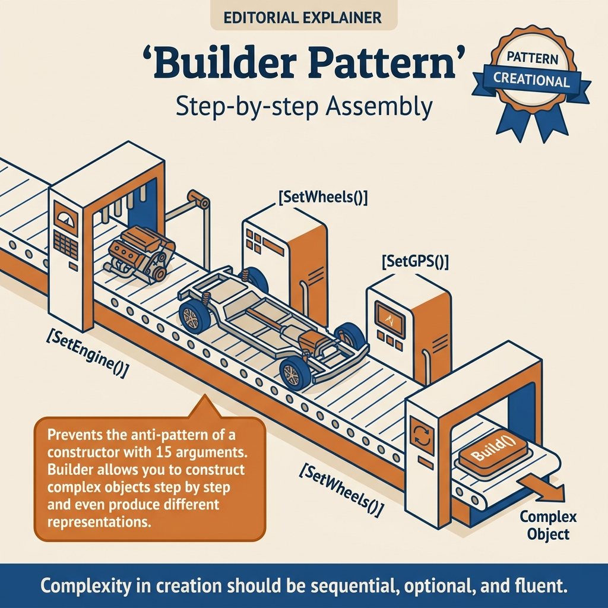
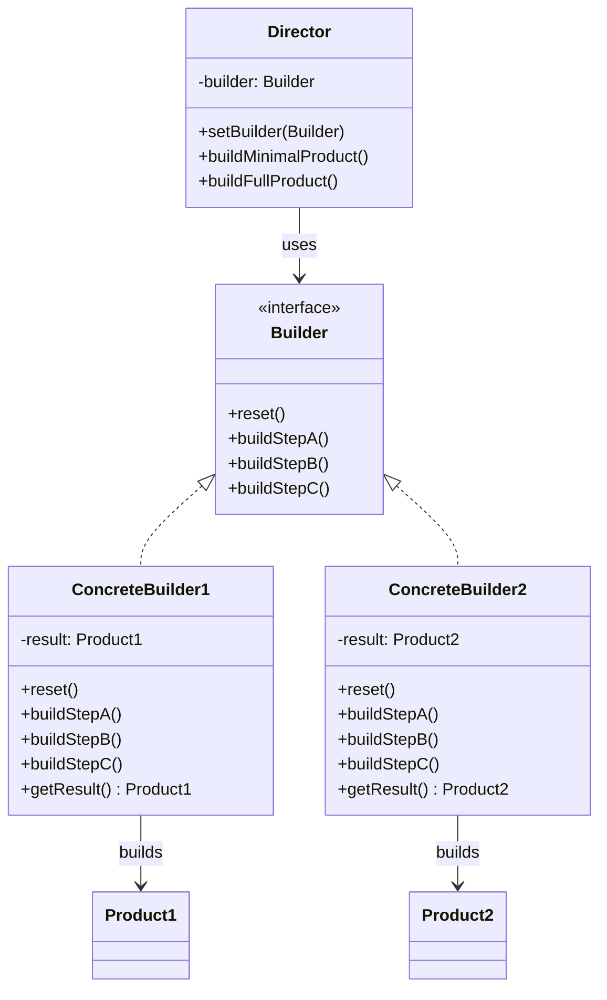
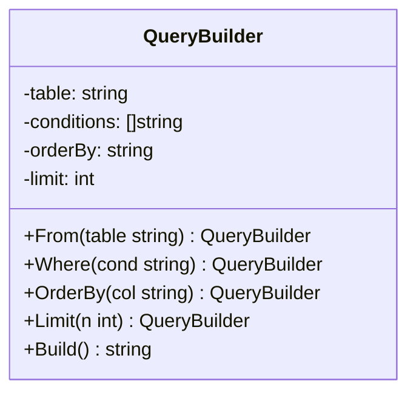
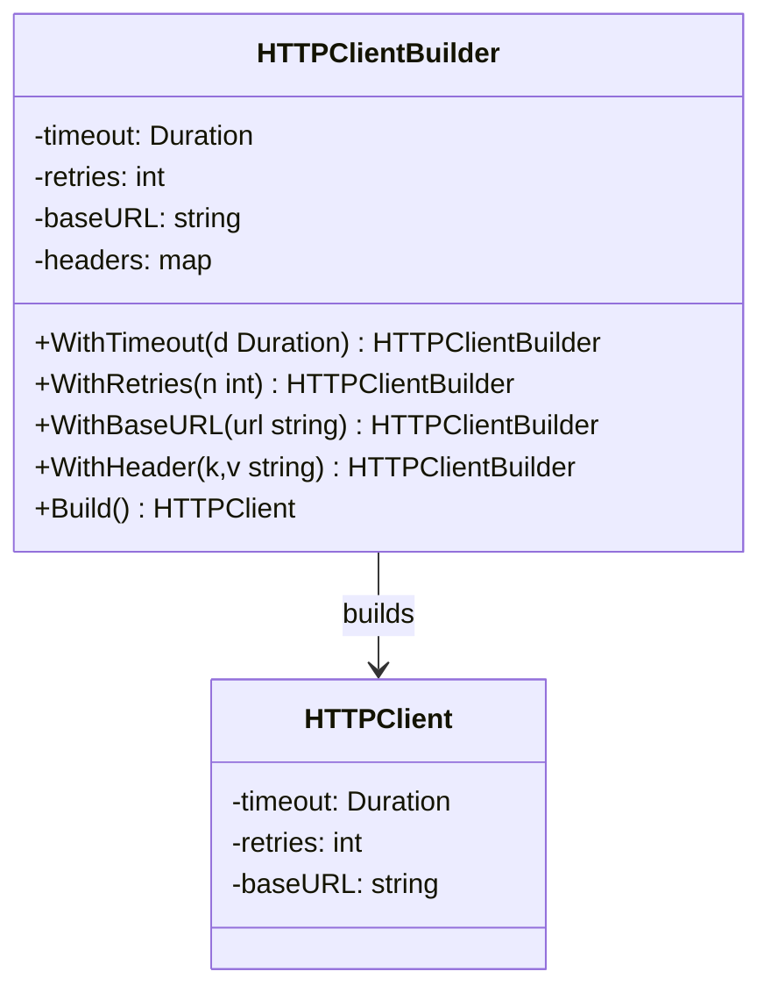
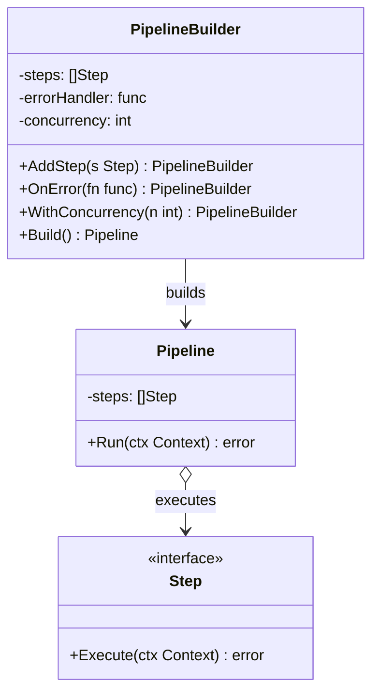

<!-- tags: design-pattern, creational, oop, builder -->
# 🔨 Builder

> You open the `ServerConfig` constructor and count 14 parameters. Half are optional, three are booleans, two are timeouts, and during every code review, someone asks, "What is the 9th parameter?". The issue is not syntax. The issue is that the construction logic has exceeded the limits of an inline constructor.

📅 Created: 2026-03-19 · 🔄 Updated: 2026-04-02 · ⏱️ 22 min read

| Aspect | Detail |
| ------ | ------ |
| **Group** | Creational |
| **Purpose** | Separate the construction process from the final object when the object involves multiple steps or variants |
| **Go idiom** | Fluent builders or Functional Options |
| **SOLID** | Single Responsibility, Open/Closed |
| **Confused with** | Telescoping constructors, Factories, Functional Options |

---

## 1. DEFINE

Imagine a request object with dozens of optional fields: timeouts, retries, headers, tracing, authentication, and cache policies. If you cram everything into a constructor, the code will spawn half-dead objects right from initialization.

You need a Builder when an object demands too much state to pass in a single call. Think of HTTP clients, server configs, query builders, email campaigns, or invoice export jobs. Forcing everything into a constructor creates three genuine headaches:

- Reviewers cannot decipher parameter meanings.
- Callers pass arguments in the wrong order, but the compiler accepts it.
- Validation logic scatters across multiple constructor helpers.

The `Builder` pattern solves this by shifting focus from "create the object in one call" to "construct the object step-by-step with clear intent". The client explicitly states the desire to enable timeouts, add retries, or set TLS. The `Build()` method acts as the final checkpoint where the object materializes and validation runs.

Core insight: **When construction involves multiple steps, cross-field validation rules, or different presets, treat construction as a first-class workflow rather than a long constructor call.**

| Concept | Meaning |
| --------- | ------- |
| **Product** | The final object the client needs |
| **Builder** | The temporary object holding construction state |
| **Fluent API** | Each step returns the builder to chain the next call |
| **Director** | A fixed recipe for common presets |

### 1.1 Builder vs Factory

| Pattern | Question Answered | When to use |
| ------- | ------------------- | ---------------- |
| **Factory** | "Which type of object do I create?" | Select implementations via kind or config |
| **Builder** | "In what sequence do I build this object?" | Handle optional fields and multi-step validation |
| **Functional Options** | "How do I configure optional fields idiomatically in Go?" | Go-only APIs with moderate complexity |

### 1.2 When to use

- Objects possess many optional fields.
- Validation rules span multiple fields.
- You require multiple presets like `Development`, `Production`, `ReadReplica`, or `AuditExport`.
- You want the same construction process to produce different representations.

### 1.3 When not to use

- The object only has two or three fields and lacks significant validation.
- The builder merely wraps a constructor without adding clarity.
- Readers must call `Build()` and then manually validate the result anyway.

### 1.4 Invariants & Failure Modes

- `Build()` must act as the final boundary ensuring the object is valid.
- Builders should avoid accidental reuse after building if stale state could leak into subsequent objects.
- If a builder is mutable and shared across goroutines, it requires explicit synchronization. By default, treat builders as **not thread-safe**.
- The most common failure mode: a builder makes the API longer without improving readability or validation quality.

---

These failure modes sound clear. However, a trap exists. A builder without validation creates invalid objects. Chaining methods that return wrong pointers break the chain with nil pointer exceptions. This trap appears in PITFALLS.

## 2. VISUAL

Construction requires multiple steps. Without seeing the overall flow, one might mistake Builder for a mere fluent API. The image below illustrates the four roles and their connections.

### Overview — Builder Construction Flow



*Figure: A 4-step workflow. The Director coordinates, the Builder Interface declares, the Concrete Builder executes, and the Product is the output. Arrows show data flow, not function calls.*

### Level 1 — Construction Flow

```text
Client
  │
  │ NewServerBuilder()
  ▼
Builder
  ├── WithHost("0.0.0.0")
  ├── WithPort(8443)
  ├── WithTLS(cert, key)
  ├── WithRetries(3)
  └── Build()
        │
        ▼
   ServerConfig
```

*Figure: The client avoids passing all state into a giant constructor. Each decision surfaces as a named step.*

### Level 2 — Validation Boundary

```mermaid
flowchart TD
    A[Client] --> B[Builder state]
    B --> C[WithHost / WithPort / WithTLS / WithRetries]
    C --> D{Build()}
    D -->|valid| E[Product]
    D -->|invalid| F[Validation error]
```

*Figure: The builder does more than gather parameters. It creates a clear validation boundary at `Build()`, checking rules across multiple fields simultaneously.*

### UML — Builder Class Structure



*The Director coordinates build steps. The Builder interface declares construction steps. ConcreteBuilders implement the steps and hold the product under construction. The client retrieves the product from the builder, not the director.*

---

## 3. CODE

The flow looks solid on paper. Implementation shows how the `🔨 Builder` looks in actual codebases rather than just on UML diagrams.

### Example 1: Basic — HTTP Request Builder

> **Goal**: Construct a request with multiple optional configurations without a massive constructor.



> **Approach**: A fluent builder accumulates state and validates it within `Build()`.
> **Example**: A `POST /users` request with a JSON body, timeout, and retries.
> **Complexity**: O(1) for each step. `Build()` is O(h) where `h` is the number of headers copied.

```go
// http_request_builder.go — Builder Pattern: compose HTTP request step by step
package requestbuilder

import (
	"errors"
	"fmt"
	"net/http"
	"strings"
	"time"
)

// ━━━ Product ━━━
type Request struct {
	Method  string
	URL     string
	Headers map[string]string
	Body    string
	Timeout time.Duration
	Retries int
}

// ━━━ Builder ━━━
type Builder struct {
	method  string
	url     string
	headers map[string]string
	body    string
	timeout time.Duration
	retries int
}

func New(method, url string) *Builder {
	return &Builder{
		method:  strings.ToUpper(method),
		url:     url,
		headers: map[string]string{},
		timeout: 30 * time.Second,
	}
}

func (b *Builder) WithJSON() *Builder {
	b.headers["Content-Type"] = "application/json"
	b.headers["Accept"] = "application/json"
	return b
}

func (b *Builder) WithHeader(key, value string) *Builder {
	b.headers[key] = value
	return b
}

func (b *Builder) WithBody(body string) *Builder {
	b.body = body
	return b
}

func (b *Builder) WithTimeout(timeout time.Duration) *Builder {
	b.timeout = timeout
	return b
}

func (b *Builder) WithRetries(retries int) *Builder {
	b.retries = retries
	return b
}

func (b *Builder) Build() (*Request, error) {
	if b.url == "" {
		return nil, errors.New("url is required")
	}
	if b.timeout <= 0 {
		return nil, errors.New("timeout must be positive")
	}
	if b.retries < 0 {
		return nil, errors.New("retries must be non-negative")
	}
	headers := make(map[string]string, len(b.headers))
	for k, v := range b.headers {
		headers[k] = v
	}
	return &Request{
		Method:  b.method,
		URL:     b.url,
		Headers: headers,
		Body:    b.body,
		Timeout: b.timeout,
		Retries: b.retries,
	}, nil
}

func Example() {
	req, err := New(http.MethodPost, "https://api.example.com/users").
		WithJSON().
		WithHeader("X-Tenant", "acme").
		WithBody(`{"name":"Mai"}`).
		WithTimeout(5 * time.Second).
		WithRetries(3).
		Build()
	if err != nil {
		panic(err)
	}
	fmt.Println(req.Method, req.URL, req.Headers["Content-Type"], req.Retries)
}
```
```typescript
// http-request-builder.ts — Builder Pattern: compose HTTP request step by step
type Request = {
  method: string;
  url: string;
  headers: Record<string, string>;
  body: string;
  timeoutMs: number;
  retries: number;
};

class RequestBuilder {
  private headers: Record<string, string> = {};
  private body = "";
  private timeoutMs = 30_000;
  private retries = 0;

  constructor(private method: string, private url: string) {
    this.method = method.toUpperCase();
  }

  withJSON(): this {
    this.headers["Content-Type"] = "application/json";
    this.headers["Accept"] = "application/json";
    return this;
  }

  withHeader(key: string, value: string): this {
    this.headers[key] = value;
    return this;
  }

  withBody(body: string): this {
    this.body = body;
    return this;
  }

  withTimeout(timeoutMs: number): this {
    this.timeoutMs = timeoutMs;
    return this;
  }

  withRetries(retries: number): this {
    this.retries = retries;
    return this;
  }

  build(): Request {
    if (!this.url) throw new Error("url is required");
    if (this.timeoutMs <= 0) throw new Error("timeout must be positive");
    if (this.retries < 0) throw new Error("retries must be non-negative");
    return {
      method: this.method,
      url: this.url,
      headers: { ...this.headers },
      body: this.body,
      timeoutMs: this.timeoutMs,
      retries: this.retries,
    };
  }
}
```
```java
// HttpRequestBuilder.java — Builder Pattern: compose HTTP request step by step
import java.util.HashMap;
import java.util.Map;

final class Request {
    final String method;
    final String url;
    final Map<String, String> headers;
    final String body;
    final int timeoutMs;
    final int retries;

    Request(String method, String url, Map<String, String> headers, String body, int timeoutMs, int retries) {
        this.method = method;
        this.url = url;
        this.headers = headers;
        this.body = body;
        this.timeoutMs = timeoutMs;
        this.retries = retries;
    }
}

final class RequestBuilder {
    private final String method;
    private final String url;
    private final Map<String, String> headers = new HashMap<>();
    private String body = "";
    private int timeoutMs = 30_000;
    private int retries = 0;

    RequestBuilder(String method, String url) {
        this.method = method.toUpperCase();
        this.url = url;
    }

    RequestBuilder withJSON() {
        headers.put("Content-Type", "application/json");
        headers.put("Accept", "application/json");
        return this;
    }

    RequestBuilder withHeader(String key, String value) {
        headers.put(key, value);
        return this;
    }

    RequestBuilder withBody(String body) {
        this.body = body;
        return this;
    }

    RequestBuilder withTimeout(int timeoutMs) {
        this.timeoutMs = timeoutMs;
        return this;
    }

    RequestBuilder withRetries(int retries) {
        this.retries = retries;
        return this;
    }

    Request build() {
        if (url.isBlank()) throw new IllegalArgumentException("url is required");
        if (timeoutMs <= 0) throw new IllegalArgumentException("timeout must be positive");
        if (retries < 0) throw new IllegalArgumentException("retries must be non-negative");
        return new Request(method, url, new HashMap<>(headers), body, timeoutMs, retries);
    }
}
```
```rust
// http_request_builder.rs — Builder Pattern: compose HTTP request step by step
use std::collections::HashMap;
use std::time::Duration;

#[derive(Debug)]
struct Request {
    method: String,
    url: String,
    headers: HashMap<String, String>,
    body: String,
    timeout: Duration,
    retries: usize,
}

struct RequestBuilder {
    method: String,
    url: String,
    headers: HashMap<String, String>,
    body: String,
    timeout: Duration,
    retries: usize,
}

impl RequestBuilder {
    fn new(method: &str, url: &str) -> Self {
        Self {
            method: method.to_uppercase(),
            url: url.to_string(),
            headers: HashMap::new(),
            body: String::new(),
            timeout: Duration::from_secs(30),
            retries: 0,
        }
    }

    fn with_json(mut self) -> Self {
        self.headers.insert("Content-Type".into(), "application/json".into());
        self.headers.insert("Accept".into(), "application/json".into());
        self
    }

    fn with_header(mut self, key: &str, value: &str) -> Self {
        self.headers.insert(key.into(), value.into());
        self
    }

    fn with_body(mut self, body: &str) -> Self {
        self.body = body.into();
        self
    }

    fn with_timeout(mut self, timeout: Duration) -> Self {
        self.timeout = timeout;
        self
    }

    fn with_retries(mut self, retries: usize) -> Self {
        self.retries = retries;
        self
    }

    fn build(self) -> Result<Request, String> {
        if self.url.is_empty() {
            return Err("url is required".into());
        }
        Ok(Request {
            method: self.method,
            url: self.url,
            headers: self.headers,
            body: self.body,
            timeout: self.timeout,
            retries: self.retries,
        })
    }
}
```
```cpp
// http_request_builder.cpp — Builder Pattern: compose HTTP request step by step
#include <chrono>
#include <stdexcept>
#include <string>
#include <unordered_map>

struct Request {
    std::string method;
    std::string url;
    std::unordered_map<std::string, std::string> headers;
    std::string body;
    std::chrono::milliseconds timeout{30000};
    int retries{0};
};

class RequestBuilder {
public:
    RequestBuilder(std::string method, std::string url)
        : method_(std::move(method)), url_(std::move(url)) {}

    RequestBuilder& with_json() {
        headers_["Content-Type"] = "application/json";
        headers_["Accept"] = "application/json";
        return *this;
    }

    RequestBuilder& with_header(std::string key, std::string value) {
        headers_[std::move(key)] = std::move(value);
        return *this;
    }

    RequestBuilder& with_body(std::string body) {
        body_ = std::move(body);
        return *this;
    }

    RequestBuilder& with_timeout(std::chrono::milliseconds timeout) {
        timeout_ = timeout;
        return *this;
    }

    RequestBuilder& with_retries(int retries) {
        retries_ = retries;
        return *this;
    }

    Request build() const {
        if (url_.empty()) throw std::invalid_argument("url is required");
        if (timeout_.count() <= 0) throw std::invalid_argument("timeout must be positive");
        if (retries_ < 0) throw std::invalid_argument("retries must be non-negative");
        return Request{method_, url_, headers_, body_, timeout_, retries_};
    }

private:
    std::string method_;
    std::string url_;
    std::unordered_map<std::string, std::string> headers_;
    std::string body_;
    std::chrono::milliseconds timeout_{30000};
    int retries_{0};
};
```
```python
# http_request_builder.py — Builder Pattern: compose HTTP request step by step
from dataclasses import dataclass, field


@dataclass
class Request:
    method: str
    url: str
    headers: dict[str, str] = field(default_factory=dict)
    body: str = ""
    timeout_seconds: int = 30
    retries: int = 0


class RequestBuilder:
    def __init__(self, method: str, url: str) -> None:
        self._method = method.upper()
        self._url = url
        self._headers: dict[str, str] = {}
        self._body = ""
        self._timeout_seconds = 30
        self._retries = 0

    def with_json(self) -> "RequestBuilder":
        self._headers["Content-Type"] = "application/json"
        self._headers["Accept"] = "application/json"
        return self

    def with_header(self, key: str, value: str) -> "RequestBuilder":
        self._headers[key] = value
        return self

    def with_body(self, body: str) -> "RequestBuilder":
        self._body = body
        return self

    def with_timeout(self, timeout_seconds: int) -> "RequestBuilder":
        self._timeout_seconds = timeout_seconds
        return self

    def with_retries(self, retries: int) -> "RequestBuilder":
        self._retries = retries
        return self

    def build(self) -> Request:
        if not self._url:
            raise ValueError("url is required")
        if self._timeout_seconds <= 0:
            raise ValueError("timeout must be positive")
        if self._retries < 0:
            raise ValueError("retries must be non-negative")
        return Request(
            method=self._method,
            url=self._url,
            headers=dict(self._headers),
            body=self._body,
            timeout_seconds=self._timeout_seconds,
            retries=self._retries,
        )
```

Conclusion: This example demonstrates that Builder proves valuable as soon as readability and validation outgrow a flat constructor. If the object remains simple, a builder adds useless ceremony.

Simple builders work well. However, complex validation demands error returns from `Build()`. Let's enforce cross-field rules.

### Example 2: Intermediate — Report Export Builder

> **Goal**: Enforce cross-field validation rules like format, compression, partition, and destination within a single export job.



> **Approach**: The builder holds intermediate state. `Build()` finalizes compatibility checks.
> **Example**: Exporting CSV to S3 with gzip and chunking.
> **Complexity**: O(1) for each setter. `Build()` is O(1) for validation logic.

```go
// report_job_builder.go — Builder Pattern: enforce cross-field validation before export
package exportjob

import "fmt"

type Job struct {
	Format       string
	Destination  string
	Compression  string
	ChunkSize    int
	IncludePII   bool
	EncryptAtRest bool
}

type JobBuilder struct {
	job Job
}

func NewJobBuilder() *JobBuilder {
	return &JobBuilder{job: Job{
		Format:      "csv",
		Destination: "local",
		Compression: "none",
		ChunkSize:   1000,
	}}
}

func (b *JobBuilder) WithFormat(format string) *JobBuilder {
	b.job.Format = format
	return b
}

func (b *JobBuilder) To(destination string) *JobBuilder {
	b.job.Destination = destination
	return b
}

func (b *JobBuilder) WithCompression(compression string) *JobBuilder {
	b.job.Compression = compression
	return b
}

func (b *JobBuilder) WithChunkSize(size int) *JobBuilder {
	b.job.ChunkSize = size
	return b
}

func (b *JobBuilder) AllowPII(enabled bool) *JobBuilder {
	b.job.IncludePII = enabled
	return b
}

func (b *JobBuilder) WithEncryption(enabled bool) *JobBuilder {
	b.job.EncryptAtRest = enabled
	return b
}

func (b *JobBuilder) Build() (Job, error) {
	if b.job.ChunkSize <= 0 {
		return Job{}, fmt.Errorf("chunk size must be positive")
	}
	if b.job.Format == "parquet" && b.job.Compression == "none" {
		return Job{}, fmt.Errorf("parquet export should not run without compression")
	}
	if b.job.IncludePII && b.job.Destination == "public-bucket" {
		return Job{}, fmt.Errorf("cannot export PII to public bucket")
	}
	if b.job.IncludePII && !b.job.EncryptAtRest {
		return Job{}, fmt.Errorf("PII export requires encryption at rest")
	}
	return b.job, nil
}
```
```typescript
// report_job_builder.ts — Builder Pattern: enforce cross-field validation before export
type Job = {
  format: string;
  destination: string;
  compression: string;
  chunkSize: number;
  includePII: boolean;
  encryptAtRest: boolean;
};

class JobBuilder {
  private job: Job = {
    format: "csv",
    destination: "local",
    compression: "none",
    chunkSize: 1000,
    includePII: false,
    encryptAtRest: false,
  };

  withFormat(format: string): this { this.job.format = format; return this; }
  to(destination: string): this { this.job.destination = destination; return this; }
  withCompression(compression: string): this { this.job.compression = compression; return this; }
  withChunkSize(chunkSize: number): this { this.job.chunkSize = chunkSize; return this; }
  allowPII(enabled: boolean): this { this.job.includePII = enabled; return this; }
  withEncryption(enabled: boolean): this { this.job.encryptAtRest = enabled; return this; }

  build(): Job {
    if (this.job.chunkSize <= 0) throw new Error("chunk size must be positive");
    if (this.job.format === "parquet" && this.job.compression === "none") {
      throw new Error("parquet export should not run without compression");
    }
    if (this.job.includePII && this.job.destination === "public-bucket") {
      throw new Error("cannot export PII to public bucket");
    }
    if (this.job.includePII && !this.job.encryptAtRest) {
      throw new Error("PII export requires encryption at rest");
    }
    return { ...this.job };
  }
}
```
```java
// ReportJobBuilder.java — Builder Pattern: enforce cross-field validation before export
record Job(String format, String destination, String compression, int chunkSize, boolean includePII, boolean encryptAtRest) {}

final class JobBuilder {
    private String format = "csv";
    private String destination = "local";
    private String compression = "none";
    private int chunkSize = 1000;
    private boolean includePII = false;
    private boolean encryptAtRest = false;

    JobBuilder withFormat(String format) { this.format = format; return this; }
    JobBuilder to(String destination) { this.destination = destination; return this; }
    JobBuilder withCompression(String compression) { this.compression = compression; return this; }
    JobBuilder withChunkSize(int chunkSize) { this.chunkSize = chunkSize; return this; }
    JobBuilder allowPII(boolean enabled) { this.includePII = enabled; return this; }
    JobBuilder withEncryption(boolean enabled) { this.encryptAtRest = enabled; return this; }

    Job build() {
        if (chunkSize <= 0) throw new IllegalArgumentException("chunk size must be positive");
        if ("parquet".equals(format) && "none".equals(compression)) throw new IllegalArgumentException("parquet export should not run without compression");
        if (includePII && "public-bucket".equals(destination)) throw new IllegalArgumentException("cannot export PII to public bucket");
        if (includePII && !encryptAtRest) throw new IllegalArgumentException("PII export requires encryption at rest");
        return new Job(format, destination, compression, chunkSize, includePII, encryptAtRest);
    }
}
```
```rust
// report_job_builder.rs — Builder Pattern: enforce cross-field validation before export
#[derive(Debug, Clone)]
struct Job {
    format: String,
    destination: String,
    compression: String,
    chunk_size: usize,
    include_pii: bool,
    encrypt_at_rest: bool,
}

struct JobBuilder {
    job: Job,
}

impl JobBuilder {
    fn new() -> Self {
        Self {
            job: Job {
                format: "csv".into(),
                destination: "local".into(),
                compression: "none".into(),
                chunk_size: 1000,
                include_pii: false,
                encrypt_at_rest: false,
            },
        }
    }

    fn with_format(mut self, format: &str) -> Self { self.job.format = format.into(); self }
    fn to(mut self, destination: &str) -> Self { self.job.destination = destination.into(); self }
    fn with_compression(mut self, compression: &str) -> Self { self.job.compression = compression.into(); self }
    fn with_chunk_size(mut self, chunk_size: usize) -> Self { self.job.chunk_size = chunk_size; self }
    fn allow_pii(mut self, enabled: bool) -> Self { self.job.include_pii = enabled; self }
    fn with_encryption(mut self, enabled: bool) -> Self { self.job.encrypt_at_rest = enabled; self }

    fn build(self) -> Result<Job, String> {
        if self.job.chunk_size == 0 { return Err("chunk size must be positive".into()); }
        if self.job.format == "parquet" && self.job.compression == "none" {
            return Err("parquet export should not run without compression".into());
        }
        if self.job.include_pii && self.job.destination == "public-bucket" {
            return Err("cannot export PII to public bucket".into());
        }
        if self.job.include_pii && !self.job.encrypt_at_rest {
            return Err("PII export requires encryption at rest".into());
        }
        Ok(self.job)
    }
}
```
```cpp
// report_job_builder.cpp — Builder Pattern: enforce cross-field validation before export
#include <stdexcept>
#include <string>

struct Job {
    std::string format{"csv"};
    std::string destination{"local"};
    std::string compression{"none"};
    int chunk_size{1000};
    bool include_pii{false};
    bool encrypt_at_rest{false};
};

class JobBuilder {
public:
    JobBuilder& with_format(std::string format) { job_.format = std::move(format); return *this; }
    JobBuilder& to(std::string destination) { job_.destination = std::move(destination); return *this; }
    JobBuilder& with_compression(std::string compression) { job_.compression = std::move(compression); return *this; }
    JobBuilder& with_chunk_size(int chunk_size) { job_.chunk_size = chunk_size; return *this; }
    JobBuilder& allow_pii(bool enabled) { job_.include_pii = enabled; return *this; }
    JobBuilder& with_encryption(bool enabled) { job_.encrypt_at_rest = enabled; return *this; }

    Job build() const {
        if (job_.chunk_size <= 0) throw std::invalid_argument("chunk size must be positive");
        if (job_.format == "parquet" && job_.compression == "none") throw std::invalid_argument("parquet export should not run without compression");
        if (job_.include_pii && job_.destination == "public-bucket") throw std::invalid_argument("cannot export PII to public bucket");
        if (job_.include_pii && !job_.encrypt_at_rest) throw std::invalid_argument("PII export requires encryption at rest");
        return job_;
    }

private:
    Job job_{};
};
```
```python
# report_job_builder.py — Builder Pattern: enforce cross-field validation before export
from dataclasses import dataclass


@dataclass
class Job:
    format: str = "csv"
    destination: str = "local"
    compression: str = "none"
    chunk_size: int = 1000
    include_pii: bool = False
    encrypt_at_rest: bool = False


class JobBuilder:
    def __init__(self) -> None:
        self._job = Job()

    def with_format(self, format: str) -> "JobBuilder":
        self._job.format = format
        return self

    def to(self, destination: str) -> "JobBuilder":
        self._job.destination = destination
        return self

    def with_compression(self, compression: str) -> "JobBuilder":
        self._job.compression = compression
        return self

    def with_chunk_size(self, chunk_size: int) -> "JobBuilder":
        self._job.chunk_size = chunk_size
        return self

    def allow_pii(self, enabled: bool) -> "JobBuilder":
        self._job.include_pii = enabled
        return self

    def with_encryption(self, enabled: bool) -> "JobBuilder":
        self._job.encrypt_at_rest = enabled
        return self

    def build(self) -> Job:
        if self._job.chunk_size <= 0:
            raise ValueError("chunk size must be positive")
        if self._job.format == "parquet" and self._job.compression == "none":
            raise ValueError("parquet export should not run without compression")
        if self._job.include_pii and self._job.destination == "public-bucket":
            raise ValueError("cannot export PII to public bucket")
        if self._job.include_pii and not self._job.encrypt_at_rest:
            raise ValueError("PII export requires encryption at rest")
        return Job(**self._job.__dict__)
```

> **Why?** A builder justifies its existence when complexity arises from cross-field dependencies, not just parameter length. PII demands encryption. Parquet demands compression. Public buckets forbid PII. The builder shifts these rules into `Build()`. The caller reads business intent rather than positional arguments.

Conclusion: Builder shines when cross-field validation emerges. If an object only has many unrelated fields, `Functional Options` might offer a lighter solution.

Validation works smoothly. Now, complex object assembly requires a director. Let's orchestrate it.

### Example 3: Advanced — Director + Multiple Representations

> **Goal**: Employ the same recipe to build two distinct representations of the identical report.



> **Approach**: A Director executes the identical sequence of steps across multiple concrete builders.
> **Example**: Creating a dashboard report as either JSON or HTML using the same configuration steps.
> **Complexity**: O(s) where `s` is the number of steps. Materializing each representation incurs its own cost.

```go
// dashboard_builder.go — Builder Pattern: same recipe, different representations
package dashboardbuilder

import "fmt"

type DashboardBuilder interface {
	SetTitle(title string)
	AddMetric(metric string)
	AddChart(chart string)
	Build() any
}

type JSONDashboardBuilder struct {
	title   string
	metrics []string
	charts  []string
}

func (b *JSONDashboardBuilder) SetTitle(title string) { b.title = title }
func (b *JSONDashboardBuilder) AddMetric(metric string) { b.metrics = append(b.metrics, metric) }
func (b *JSONDashboardBuilder) AddChart(chart string) { b.charts = append(b.charts, chart) }
func (b *JSONDashboardBuilder) Build() any {
	return map[string]any{
		"title":   b.title,
		"metrics": append([]string(nil), b.metrics...),
		"charts":  append([]string(nil), b.charts...),
	}
}

type HTMLDashboardBuilder struct {
	title   string
	metrics []string
	charts  []string
}

func (b *HTMLDashboardBuilder) SetTitle(title string) { b.title = title }
func (b *HTMLDashboardBuilder) AddMetric(metric string) { b.metrics = append(b.metrics, metric) }
func (b *HTMLDashboardBuilder) AddChart(chart string) { b.charts = append(b.charts, chart) }
func (b *HTMLDashboardBuilder) Build() any {
	return fmt.Sprintf("<section><h1>%s</h1><p>metrics=%v</p><p>charts=%v</p></section>", b.title, b.metrics, b.charts)
}

type Director struct{}

func (d Director) BuildExecutiveOverview(builder DashboardBuilder) any {
	builder.SetTitle("Executive Overview")
	builder.AddMetric("revenue")
	builder.AddMetric("active-users")
	builder.AddChart("revenue-by-region")
	builder.AddChart("retention-cohort")
	return builder.Build()
}
```
```typescript
// dashboard_builder.ts — Builder Pattern: same recipe, different representations
interface DashboardBuilder {
  setTitle(title: string): void;
  addMetric(metric: string): void;
  addChart(chart: string): void;
  build(): unknown;
}

class JSONDashboardBuilder implements DashboardBuilder {
  private title = "";
  private metrics: string[] = [];
  private charts: string[] = [];

  setTitle(title: string): void { this.title = title; }
  addMetric(metric: string): void { this.metrics.push(metric); }
  addChart(chart: string): void { this.charts.push(chart); }
  build(): unknown {
    return { title: this.title, metrics: [...this.metrics], charts: [...this.charts] };
  }
}

class HTMLDashboardBuilder implements DashboardBuilder {
  private title = "";
  private metrics: string[] = [];
  private charts: string[] = [];

  setTitle(title: string): void { this.title = title; }
  addMetric(metric: string): void { this.metrics.push(metric); }
  addChart(chart: string): void { this.charts.push(chart); }
  build(): string {
    return `<section><h1>${this.title}</h1><p>metrics=${this.metrics.join(",")}</p><p>charts=${this.charts.join(",")}</p></section>`;
  }
}

class Director {
  buildExecutiveOverview(builder: DashboardBuilder): unknown {
    builder.setTitle("Executive Overview");
    builder.addMetric("revenue");
    builder.addMetric("active-users");
    builder.addChart("revenue-by-region");
    builder.addChart("retention-cohort");
    return builder.build();
  }
}
```
```java
// DashboardBuilderExample.java — Builder Pattern: same recipe, different representations
import java.util.ArrayList;
import java.util.List;
import java.util.Map;

interface DashboardBuilder {
    void setTitle(String title);
    void addMetric(String metric);
    void addChart(String chart);
    Object build();
}

final class JSONDashboardBuilder implements DashboardBuilder {
    private String title = "";
    private final List<String> metrics = new ArrayList<>();
    private final List<String> charts = new ArrayList<>();

    public void setTitle(String title) { this.title = title; }
    public void addMetric(String metric) { metrics.add(metric); }
    public void addChart(String chart) { charts.add(chart); }
    public Object build() { return Map.of("title", title, "metrics", List.copyOf(metrics), "charts", List.copyOf(charts)); }
}

final class HTMLDashboardBuilder implements DashboardBuilder {
    private String title = "";
    private final List<String> metrics = new ArrayList<>();
    private final List<String> charts = new ArrayList<>();

    public void setTitle(String title) { this.title = title; }
    public void addMetric(String metric) { metrics.add(metric); }
    public void addChart(String chart) { charts.add(chart); }
    public Object build() {
        return "<section><h1>" + title + "</h1><p>metrics=" + metrics + "</p><p>charts=" + charts + "</p></section>";
    }
}

final class Director {
    Object buildExecutiveOverview(DashboardBuilder builder) {
        builder.setTitle("Executive Overview");
        builder.addMetric("revenue");
        builder.addMetric("active-users");
        builder.addChart("revenue-by-region");
        builder.addChart("retention-cohort");
        return builder.build();
    }
}
```
```rust
// dashboard_builder.rs — Builder Pattern: same recipe, different representations
trait DashboardBuilder {
    fn set_title(&mut self, title: &str);
    fn add_metric(&mut self, metric: &str);
    fn add_chart(&mut self, chart: &str);
    fn build(&self) -> String;
}

#[derive(Default)]
struct JsonDashboardBuilder {
    title: String,
    metrics: Vec<String>,
    charts: Vec<String>,
}

impl DashboardBuilder for JsonDashboardBuilder {
    fn set_title(&mut self, title: &str) { self.title = title.into(); }
    fn add_metric(&mut self, metric: &str) { self.metrics.push(metric.into()); }
    fn add_chart(&mut self, chart: &str) { self.charts.push(chart.into()); }
    fn build(&self) -> String {
        format!(r#"{{"title":"{}","metrics":{:?},"charts":{:?}}}"#, self.title, self.metrics, self.charts)
    }
}

#[derive(Default)]
struct HtmlDashboardBuilder {
    title: String,
    metrics: Vec<String>,
    charts: Vec<String>,
}

impl DashboardBuilder for HtmlDashboardBuilder {
    fn set_title(&mut self, title: &str) { self.title = title.into(); }
    fn add_metric(&mut self, metric: &str) { self.metrics.push(metric.into()); }
    fn add_chart(&mut self, chart: &str) { self.charts.push(chart.into()); }
    fn build(&self) -> String {
        format!("<section><h1>{}</h1><p>metrics={:?}</p><p>charts={:?}</p></section>", self.title, self.metrics, self.charts)
    }
}

struct Director;

impl Director {
    fn build_executive_overview<T: DashboardBuilder>(&self, builder: &mut T) -> String {
        builder.set_title("Executive Overview");
        builder.add_metric("revenue");
        builder.add_metric("active-users");
        builder.add_chart("revenue-by-region");
        builder.add_chart("retention-cohort");
        builder.build()
    }
}
```
```cpp
// dashboard_builder.cpp — Builder Pattern: same recipe, different representations
#include <sstream>
#include <string>
#include <vector>

class DashboardBuilder {
public:
    virtual void set_title(const std::string& title) = 0;
    virtual void add_metric(const std::string& metric) = 0;
    virtual void add_chart(const std::string& chart) = 0;
    virtual std::string build() const = 0;
    virtual ~DashboardBuilder() = default;
};

class JsonDashboardBuilder final : public DashboardBuilder {
public:
    void set_title(const std::string& title) override { title_ = title; }
    void add_metric(const std::string& metric) override { metrics_.push_back(metric); }
    void add_chart(const std::string& chart) override { charts_.push_back(chart); }
    std::string build() const override {
        std::ostringstream out;
        out << "{title:" << title_ << ", metrics:" << metrics_.size() << ", charts:" << charts_.size() << "}";
        return out.str();
    }

private:
    std::string title_;
    std::vector<std::string> metrics_;
    std::vector<std::string> charts_;
};
```
```python
# dashboard_builder.py — Builder Pattern: same recipe, different representations
from abc import ABC, abstractmethod


class DashboardBuilder(ABC):
    @abstractmethod
    def set_title(self, title: str) -> None: ...

    @abstractmethod
    def add_metric(self, metric: str) -> None: ...

    @abstractmethod
    def add_chart(self, chart: str) -> None: ...

    @abstractmethod
    def build(self): ...


class JsonDashboardBuilder(DashboardBuilder):
    def __init__(self) -> None:
        self.title = ""
        self.metrics: list[str] = []
        self.charts: list[str] = []

    def set_title(self, title: str) -> None:
        self.title = title

    def add_metric(self, metric: str) -> None:
        self.metrics.append(metric)

    def add_chart(self, chart: str) -> None:
        self.charts.append(chart)

    def build(self):
        return {"title": self.title, "metrics": list(self.metrics), "charts": list(self.charts)}
```

> **Why?** A Director proves its worth when a single recipe generates various representations or serves multiple callers. It enforces the sequence of construction steps, allowing diverse implementations to share a unified protocol. If only one caller and one recipe exist, introducing a Director constitutes over-engineering.

Conclusion: Use Advanced Builder when one sequence of choices yields different outcomes, or when an organization standardizes recipes to prevent disparate setups.

---

You observed simple builders, cross-field validations, and directors. The danger now comes from skipped validations and shattered chaining. We outlined these traps at the start.

## 4. PITFALLS

The `🔨 Builder` routinely suffers misunderstanding. The pattern remains in the code, but it loses the boundary it promises. These pitfalls explain why.

| # | Severity | Error | Consequence | Fix |
|---|----------|-----|---------|-----|
| 1 | 🔴 Fatal | `Build()` ignores cross-field validation rules | The application generates and operates on invalid objects | Push all final validations into the `Build()` method |
| 2 | 🔴 Fatal | Reusing a mutable builder across multiple goroutines | Data races corrupt the state, leaking configurations across requests | Treat builders as single-use, per-construction objects |
| 3 | 🟡 Common | Applying a Builder to a trivial object | The API becomes verbose without adding clarity | Use the pattern only when construction complexity demands it |
| 4 | 🟡 Common | `Build()` returns a product sharing internal references with the builder | Future modifications mutate previously built objects | Deep copy slices and maps to ensure independent state |
| 5 | 🔵 Minor | Fluent methods use ambiguous names like `SetX` or `SetY` | The caller fails to grasp the step's intent | Utilize expressive names like `WithTLS`, `AllowPII`, or `ToBucket` |

---

You navigated the Builder pattern and its traps. The resources below provide deeper context.

## 5. REF

| Resource | Type | Link | Notes |
| -------- | ---- | ---- | ------- |
| Refactoring.Guru | Pattern catalog | https://refactoring.guru/design-patterns/builder | Standard structure and Director role |
| Effective Go | Official docs | https://go.dev/doc/effective_go | Idiomatic Go API design context |
| Go Patterns | Pattern article | https://go-patterns.dev/creational/functional-options | Functional Options: the closest Go idiom |

---

## 6. RECOMMEND

The Builder resolves construction complexity. If the actual pain point involves selecting a type, maintaining family consistency, or simply configuring optional fields without strict rules, then the Builder constitutes over-engineering.

| Explore | When to use | Reason | File/Link |
| ------- | ------- | ----- | --------- |
| Factory Method | The pain point involves choosing the implementation, not constructing it step-by-step | Selection differs from construction | [01-factory.md](./01-factory.md) |
| Abstract Factory | Multiple related objects require synchronized creation within a family | Family consistency supersedes individual product creation | [02-abstract-factory.md](./02-abstract-factory.md) |
| Functional Options | A Go object requires optional configuration but lacks complex cross-field validation rules | Prefer idiomatic Go over the full Builder ceremony | [Go Patterns](https://go-patterns.dev/creational/functional-options) |

---

## 7. QUICK REF

| Signal | Builder might be the right choice? |
| ------ | ------------------------------- |
| Constructors contain too many optional parameters | ✅ Yes |
| Validation logic spans multiple fields simultaneously | ✅ Yes |
| The same recipe must produce different representations | ✅ Yes |
| The goal is merely selecting between concrete types | ❌ Usually a Factory |
| The object possesses very little state and complexity | ❌ Constructors or Options suffice |

**Links**: [← Abstract Factory](./02-abstract-factory.md) · [→ Singleton](./04-singleton.md)
