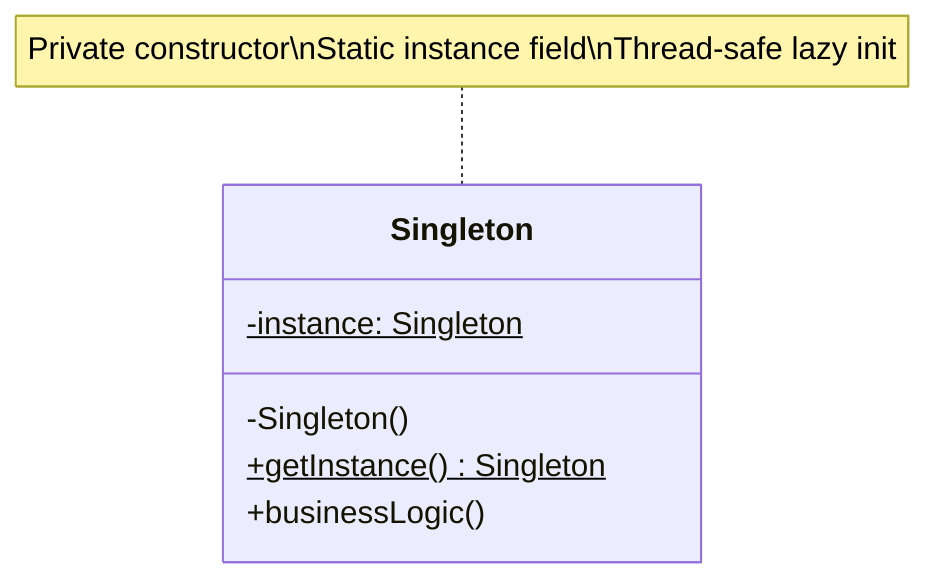
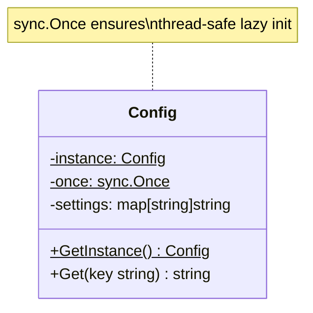
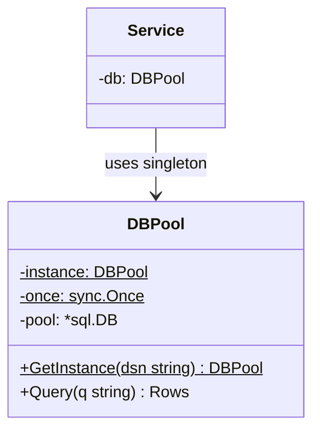
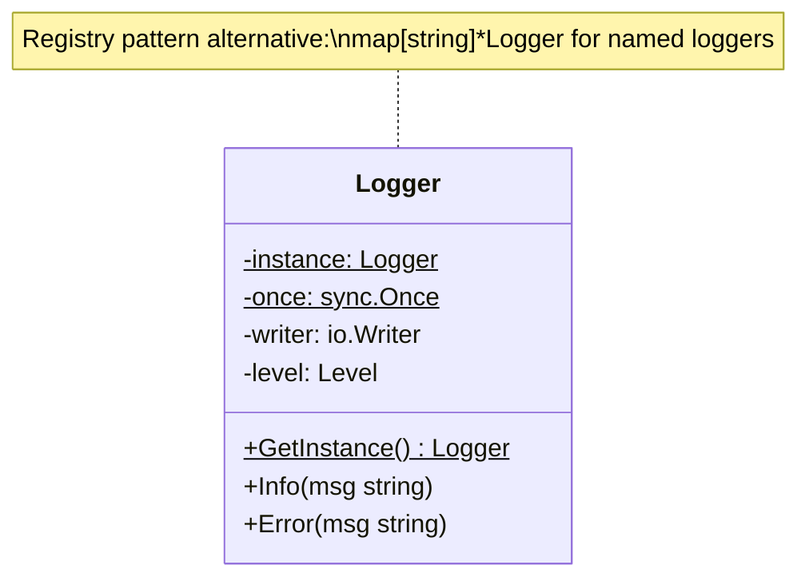

<!-- tags: design-pattern, creational, oop, singleton -->
# 🔒 Singleton

> You debug a service. Three distinct locations instantiate new loggers. Two modules cache their own configurations. Another creates a fresh metrics collector for every incoming request. Everything "works", but observability metrics drift, configuration reloads fail inconsistently, and tests collide due to hidden global state. The Singleton pattern emerges at this exact boundary: when the team agrees "we only want one instance," but struggles to decide between Dependency Injection or global access.

📅 Created: 2026-03-19 · 🔄 Updated: 2026-04-02 · ⏱️ 21 min read

| Aspect | Detail |
| ------ | ------ |
| **Group** | Creational |
| **Purpose** | Guarantee only one instance of a resource exists and provide a global access point |
| **Go idiom** | `sync.Once`, package-scoped instances, lazy initialization |
| **SOLID** | Frequently conflicts with Dependency Injection when abused |
| **Status** | Useful but controversial; apply with strict intent |

---

## 1. DEFINE

You face an incident. Every goroutine assumes it uses the sole "global config", but logs reveal multiple config loaders secretly instantiated. The problem stops being about creating objects quickly. The problem is **locking down the exact system-wide point where only one instance may exist**.

Singleton is not difficult to code. It is difficult because of its **responsibility boundaries**. Business requirements often dictate exactly one instance of specific resources: runtime configurations, process-wide loggers, metrics registries, or connection pool wrappers. If every module creates its own copy, consistency shatters. However, if you shove everything into a Singleton, the application degrades into untestable global state.

`Singleton` enforces two guarantees:

1. The system creates exactly one instance.
2. Every caller retrieves it through the same access point.

Core insight: **Singleton represents more than a "pretty global variable". It enforces a strict lifecycle and initialization order for a process-wide resource**.

### 1.1 Singleton vs Global Variable vs Dependency Injection

| Approach | Pros | Trade-offs | When to choose |
| -------- | ------- | --------- | -------- |
| Bare global variable | Extremely fast to implement | Ambiguous initialization order, easily overwritten | Microscopic prototypes |
| Singleton | Initializes exactly once, lazy loading, stronger guards | Retains global access, complicates testing | Clear process-wide resources |
| Dependency Injection | Explicit dependencies, highly testable | Requires clear wiring of the object graph | Default choice for application architecture |

### 1.2 When to use

- Process-wide configuration loaders.
- Metrics registries.
- Core logger instances.
- Cache registries or provider registries genuinely shared across the entire process.

### 1.3 When not to use

- Standard repositories or business logic services.
- Objects requiring frequent mocking or resetting within unit tests.
- Stateful components that vary by request or tenant.

### 1.4 Invariants & Failure Modes

- Initialization logic must be thread-safe.
- Singleton resources must never silently hold request-scoped state.
- If constructors contain heavy side effects, lazy initialization might dump massive latency onto the first request.
- The greatest failure mode: using the pattern solely to evade Dependency Injection, rendering the dependency graph invisible.

---

These failure modes sound familiar. However, a trap exists. Lazy initialization without thread safety creates race conditions. A Singleton acting as global state makes testing miserable. This trap appears in PITFALLS.

## 2. VISUAL

Singleton sounds simple, but deciding between `sync.Once`, global variables, or Dependency Injection is hard. The image below groups four perspectives to guide this choice.

### Overview — Singleton Mental Model


*Figure: Two main approaches (sync.Once vs global var + init), and two evaluations (when to use vs when to avoid). Singleton exists out of operational necessity, not convenience.*

This diagram answers: **Where does the Singleton enforce the "initialize exactly once" constraint?**

### Level 1 — One-Time Initialization

```text
Caller A      Caller B      Caller C
   │             │             │
   └──────┬──────┴──────┬──────┘
          ▼             ▼
        GetInstance()
             │
       first call?
        ├── yes -> create instance
        └── no  -> return cached instance
             │
             ▼
        same shared object
```

*Figure: Every caller channels through a single access point. The initialization logic executes solely on the first attempt.*

### Level 2 — The `sync.Once` Boundary

```mermaid
flowchart TD
    A[Caller] --> B[GetInstance]
    B --> C[once.Do(init)]
    C --> D[instance ready]
    D --> E[shared resource]
```

*Figure: `sync.Once` does more than prevent duplicate creations. It enforces memory-ordering guarantees, ensuring subsequent goroutines observe a fully initialized instance.*

### UML — Singleton Class Structure



*The Singleton conceals the constructor and exposes a static getInstance() method. Only one instance exists, stored in a static field and returned to every caller.*

---

## 3. CODE

The theory looks clean in diagrams. Real code demonstrates the interfaces, compositions, and limits that a `🔒 Singleton` must respect.

### Example 1: Basic — Config Singleton with `sync.Once`

> **Goal**: Guarantee the configuration loads exactly once and every module shares the identical instance.



> **Approach**: Employ a package-scoped instance protected by `sync.Once`.
> **Example**: `GetConfig()` reads environment variables on the first call and returns the cached result thereafter.
> **Complexity**: O(1) access post-initialization. The initialization cost triggers only once.

```go
// app_config_singleton.go — Singleton Pattern: one process-wide config instance
package appconfig

import (
	"os"
	"strconv"
	"sync"
)

type Config struct {
	HTTPPort int
	RedisURL string
	Debug    bool
}

var (
	instance *Config
	once     sync.Once
)

func GetConfig() *Config {
	once.Do(func() {
		port, _ := strconv.Atoi(getEnv("HTTP_PORT", "8080"))
		instance = &Config{
			HTTPPort: port,
			RedisURL: getEnv("REDIS_URL", "redis://localhost:6379"),
			Debug:    getEnv("DEBUG", "false") == "true",
		}
	})
	return instance
}

func getEnv(key, fallback string) string {
	if value := os.Getenv(key); value != "" {
		return value
	}
	return fallback
}
```
```typescript
// app_config_singleton.ts — Singleton Pattern: one process-wide config instance
class Config {
  private static instance: Config | null = null;

  readonly httpPort: number;
  readonly redisURL: string;
  readonly debug: boolean;

  private constructor() {
    this.httpPort = Number(process.env.HTTP_PORT ?? "8080");
    this.redisURL = process.env.REDIS_URL ?? "redis://localhost:6379";
    this.debug = process.env.DEBUG === "true";
  }

  static getInstance(): Config {
    if (!Config.instance) {
      Config.instance = new Config();
    }
    return Config.instance;
  }
}
```
```java
// AppConfigSingleton.java — Singleton Pattern: one process-wide config instance
final class Config {
    private static volatile Config instance;

    final int httpPort;
    final String redisURL;
    final boolean debug;

    private Config() {
        this.httpPort = Integer.parseInt(System.getenv().getOrDefault("HTTP_PORT", "8080"));
        this.redisURL = System.getenv().getOrDefault("REDIS_URL", "redis://localhost:6379");
        this.debug = "true".equals(System.getenv().getOrDefault("DEBUG", "false"));
    }

    static Config getInstance() {
        if (instance == null) {
            synchronized (Config.class) {
                if (instance == null) {
                    instance = new Config();
                }
            }
        }
        return instance;
    }
}
```
```rust
// app_config_singleton.rs — Singleton Pattern: one process-wide config instance
use std::sync::OnceLock;

#[derive(Debug)]
struct Config {
    http_port: u16,
    redis_url: String,
    debug: bool,
}

static INSTANCE: OnceLock<Config> = OnceLock::new();

fn get_config() -> &'static Config {
    INSTANCE.get_or_init(|| Config {
        http_port: std::env::var("HTTP_PORT").ok().and_then(|v| v.parse().ok()).unwrap_or(8080),
        redis_url: std::env::var("REDIS_URL").unwrap_or_else(|_| "redis://localhost:6379".into()),
        debug: std::env::var("DEBUG").map(|v| v == "true").unwrap_or(false),
    })
}
```
```cpp
// app_config_singleton.cpp — Singleton Pattern: one process-wide config instance
#include <cstdlib>
#include <string>

class Config {
public:
    static Config& get_instance() {
        static Config instance;
        return instance;
    }

    int http_port() const { return http_port_; }
    const std::string& redis_url() const { return redis_url_; }
    bool debug() const { return debug_; }

private:
    Config() {
        http_port_ = std::getenv("HTTP_PORT") ? std::stoi(std::getenv("HTTP_PORT")) : 8080;
        redis_url_ = std::getenv("REDIS_URL") ? std::getenv("REDIS_URL") : "redis://localhost:6379";
        debug_ = std::getenv("DEBUG") && std::string(std::getenv("DEBUG")) == "true";
    }

    int http_port_{};
    std::string redis_url_;
    bool debug_{false};
};
```
```python
# app_config_singleton.py — Singleton Pattern: one process-wide config instance
import os


class Config:
    _instance = None

    def __new__(cls):
        if cls._instance is None:
            cls._instance = super().__new__(cls)
            cls._instance.http_port = int(os.getenv("HTTP_PORT", "8080"))
            cls._instance.redis_url = os.getenv("REDIS_URL", "redis://localhost:6379")
            cls._instance.debug = os.getenv("DEBUG", "false") == "true"
        return cls._instance
```

Conclusion: This approach holds value when the resource is genuinely process-wide. If the `Config` must vary by tenant, request, or test scenario, the Singleton will restrict you rather than assist you.

The `sync.Once` pattern works well. However, testability demands Dependency Injection. Let's design for testing.

### Example 2: Intermediate — Logger Core, but Injected Externally

> **Goal**: Establish a single core logger without forcing the entire business layer to depend on the global accessor directly.



> **Approach**: Confine the Singleton strictly to the infrastructure boundary. The application layer receives the dependency through its constructor.
> **Example**: `GetLoggerCore()` instantiates a `zap` or `slog` core once, while the service relies on an injected logger interface.
> **Complexity**: O(1) access post-initialization. DI preserves testability completely.

```go
// logger_singleton_boundary.go — Singleton only at infrastructure edge, DI everywhere else
package loggerboundary

import (
	"io"
	"log/slog"
	"os"
	"sync"
)

type Logger interface {
	Info(message string, attrs ...any)
}

var (
	loggerOnce sync.Once
	loggerCore *slog.Logger
)

func GetLoggerCore() *slog.Logger {
	loggerOnce.Do(func() {
		var output io.Writer = os.Stdout
		handler := slog.NewJSONHandler(output, &slog.HandlerOptions{Level: slog.LevelInfo})
		loggerCore = slog.New(handler)
	})
	return loggerCore
}

type OrderService struct {
	logger Logger
}

func NewOrderService(logger Logger) *OrderService {
	return &OrderService{logger: logger}
}

func (s *OrderService) Confirm(orderID string) {
	s.logger.Info("order confirmed", "order_id", orderID)
}

func WireOrderService() *OrderService {
	// The Infrastructure layer accesses the singleton core,
	// but the application/service layer relies on explicit dependencies.
	return NewOrderService(GetLoggerCore())
}
```
```typescript
// logger_singleton_boundary.ts — Singleton only at infrastructure edge, DI everywhere else
interface Logger {
  info(message: string, ...attrs: unknown[]): void;
}

class LoggerCore {
  private static instance: LoggerCore | null = null;

  private constructor() {}

  static getInstance(): LoggerCore {
    if (!LoggerCore.instance) LoggerCore.instance = new LoggerCore();
    return LoggerCore.instance;
  }

  info(message: string, ...attrs: unknown[]): void {
    console.log(message, ...attrs);
  }
}

class OrderService {
  constructor(private readonly logger: Logger) {}
  confirm(orderId: string): void {
    this.logger.info("order confirmed", { orderId });
  }
}

const service = new OrderService(LoggerCore.getInstance());
```
```java
// LoggerSingletonBoundary.java — Singleton only at infrastructure edge, DI everywhere else
interface Logger {
    void info(String message, Object... attrs);
}

final class LoggerCore implements Logger {
    private static final LoggerCore INSTANCE = new LoggerCore();
    private LoggerCore() {}
    static LoggerCore getInstance() { return INSTANCE; }

    public void info(String message, Object... attrs) {
        System.out.println(message + " " + java.util.Arrays.toString(attrs));
    }
}

final class OrderService {
    private final Logger logger;
    OrderService(Logger logger) { this.logger = logger; }
    void confirm(String orderId) { logger.info("order confirmed", orderId); }
}
```
```rust
// logger_singleton_boundary.rs — Singleton only at infrastructure edge, DI everywhere else
use std::sync::OnceLock;

trait Logger {
    fn info(&self, message: &str, attrs: &[(&str, &str)]);
}

struct LoggerCore;

static LOGGER: OnceLock<LoggerCore> = OnceLock::new();

fn get_logger_core() -> &'static LoggerCore {
    LOGGER.get_or_init(|| LoggerCore)
}

impl Logger for LoggerCore {
    fn info(&self, message: &str, attrs: &[(&str, &str)]) {
        println!("{} {:?}", message, attrs);
    }
}
```
```cpp
// logger_singleton_boundary.cpp — Singleton only at infrastructure edge, DI everywhere else
#include <iostream>
#include <memory>
#include <string>

struct Logger {
    virtual void info(const std::string& message) = 0;
    virtual ~Logger() = default;
};

class LoggerCore final : public Logger {
public:
    static LoggerCore& instance() {
        static LoggerCore value;
        return value;
    }

    void info(const std::string& message) override {
        std::cout << message << '\n';
    }

private:
    LoggerCore() = default;
};
```
```python
# logger_singleton_boundary.py — Singleton only at infrastructure edge, DI everywhere else
class LoggerCore:
    _instance = None

    @classmethod
    def get_instance(cls) -> "LoggerCore":
        if cls._instance is None:
            cls._instance = cls()
        return cls._instance

    def info(self, message: str, **attrs) -> None:
        print(message, attrs)


class OrderService:
    def __init__(self, logger: LoggerCore) -> None:
        self.logger = logger

    def confirm(self, order_id: str) -> None:
        self.logger.info("order confirmed", order_id=order_id)
```

> **Why?** This structure mitigates toxicity. The Singleton remains confined to the infrastructure boundary, while business code treats the dependency as an injected interface. You retain the benefits of a single runtime logger without sacrificing the ability to inject mocks during tests.

Conclusion: When employing a Singleton, restrict it to the composition root or infrastructure boundary. This balance heavily favors practicality while preserving testability.

Testable singletons work well. However, test harnesses require lifecycle resets. Let's manage them.

### Example 3: Advanced — Resettable Singleton for Test Harnesses

> **Goal**: Maintain one-time initialization for production while enabling controlled resets across distinct test scenarios.



> **Approach**: Decouple the core singleton and introduce a controlled, test-only reset hook.
> **Example**: A feature flag registry loads once during application startup, but integration tests mandate state resets between cases.
> **Complexity**: O(1) access. The reset pathway must exclusively exist within the test or development harness.

```go
// feature_flags_singleton.go — Singleton with controlled reset for test harness
package featureflags

import (
	"sync"
)

type Registry struct {
	flags map[string]bool
}

var (
	mu       sync.Mutex
	once     sync.Once
	registry *Registry
)

func GetRegistry() *Registry {
	once.Do(func() {
		registry = &Registry{
			flags: map[string]bool{
				"new-checkout": true,
				"audit-log":    true,
			},
		}
	})
	return registry
}

func (r *Registry) Enabled(name string) bool {
	return r.flags[name]
}

// ResetForTest should only be called from tests.
func ResetForTest(seed map[string]bool) {
	mu.Lock()
	defer mu.Unlock()

	once = sync.Once{}
	registry = &Registry{flags: map[string]bool{}}
	for k, v := range seed {
		registry.flags[k] = v
	}
	once.Do(func() {})
}
```
```typescript
// feature_flags_singleton.ts — Singleton with controlled reset for test harness
class Registry {
  private static instance: Registry | null = null;

  private constructor(private readonly flags: Record<string, boolean>) {}

  static getInstance(): Registry {
    if (!Registry.instance) {
      Registry.instance = new Registry({ "new-checkout": true, "audit-log": true });
    }
    return Registry.instance;
  }

  static resetForTest(seed: Record<string, boolean>): void {
    Registry.instance = new Registry({ ...seed });
  }

  enabled(name: string): boolean {
    return Boolean(this.flags[name]);
  }
}
```
```java
// FeatureFlagsSingleton.java — Singleton with controlled reset for test harness
import java.util.HashMap;
import java.util.Map;

final class Registry {
    private static Registry instance;
    private final Map<String, Boolean> flags;

    private Registry(Map<String, Boolean> flags) {
        this.flags = flags;
    }

    static synchronized Registry getInstance() {
        if (instance == null) {
            instance = new Registry(new HashMap<>(Map.of("new-checkout", true, "audit-log", true)));
        }
        return instance;
    }

    static synchronized void resetForTest(Map<String, Boolean> seed) {
        instance = new Registry(new HashMap<>(seed));
    }
}
```
```rust
// feature_flags_singleton.rs — Singleton with controlled reset for test harness
use std::collections::HashMap;
use std::sync::{Mutex, OnceLock};

#[derive(Clone)]
struct Registry {
    flags: HashMap<String, bool>,
}

static REGISTRY: OnceLock<Mutex<Registry>> = OnceLock::new();

fn get_registry() -> &'static Mutex<Registry> {
    REGISTRY.get_or_init(|| Mutex::new(Registry {
        flags: HashMap::from([
            ("new-checkout".into(), true),
            ("audit-log".into(), true),
        ]),
    }))
}
```
```cpp
// feature_flags_singleton.cpp — Singleton with controlled reset for test harness
#include <mutex>
#include <string>
#include <unordered_map>

class Registry {
public:
    static Registry& instance() {
        static Registry value;
        return value;
    }

    bool enabled(const std::string& name) const {
        auto it = flags_.find(name);
        return it != flags_.end() && it->second;
    }

    void reset_for_test(std::unordered_map<std::string, bool> seed) {
        std::lock_guard<std::mutex> lock(mu_);
        flags_ = std::move(seed);
    }

private:
    Registry() : flags_{{"new-checkout", true}, {"audit-log", true}} {}
    mutable std::mutex mu_;
    std::unordered_map<std::string, bool> flags_;
};
```
```python
# feature_flags_singleton.py — Singleton with controlled reset for test harness
class Registry:
    _instance = None

    def __init__(self, flags: dict[str, bool]) -> None:
        self.flags = flags

    @classmethod
    def get_instance(cls) -> "Registry":
        if cls._instance is None:
            cls._instance = cls({"new-checkout": True, "audit-log": True})
        return cls._instance

    @classmethod
    def reset_for_test(cls, seed: dict[str, bool]) -> None:
        cls._instance = cls(dict(seed))
```

> **Why?** A "test-only reset" operates as a deliberate exception. If the reset path opens up to production logic, the "one stable instance" invariant evaporates. Test harnesses require this exception; production paths must never arbitrarily shift global state during execution.

Conclusion: Advanced Singleton patterns demand a thorough understanding of lifecycles and test strategies. If testing requires numerous escape hatches, you likely need to revert to Dependency Injection.

---

You observed `sync.Once`, testable boundary designs, and lifecycle management. The danger now comes from initialization race conditions and global state lock-in. We outlined these traps at the start.

## 4. PITFALLS

The `🔒 Singleton` routinely suffers misunderstanding. The pattern remains in the code, but it loses the boundary it promises. These pitfalls explain why.

| # | Severity | Error | Consequence | Fix |
|---|----------|-----|---------|-----|
| 1 | 🔴 Fatal | Employing a Singleton to house request-scoped or tenant-scoped data | State leaks across requests, triggering severe tracking bugs | Use Singletons exclusively for process-wide resources |
| 2 | 🔴 Fatal | Hand-rolling lazy initialization without thread safety | The system creates duplicate instances or exposes visibility bugs | Rely on `sync.Once`, `OnceLock`, or standard static initialization |
| 3 | 🟡 Common | Business services invoke the singleton directly across the codebase | The dependency graph becomes invisible, crushing testability | Confine the singleton to the infrastructure edge and inject it outwards |
| 4 | 🟡 Common | Lacking a reset or override strategy for test suites | Integration tests pollute each other's state | Establish test-only reset hooks or alternative abstractions |
| 5 | 🔵 Minor | Forcing a singleton upon cheap objects lacking special lifecycles | Unnecessary coupling without tangible benefits | Default to standard constructors or DI |

---

You navigated the Singleton pattern and its traps. The resources below provide deeper context.

## 5. REF

| Resource | Type | Link | Notes |
| -------- | ---- | ---- | ------- |
| Refactoring.Guru | Pattern catalog | https://refactoring.guru/design-patterns/singleton | Overview and trade-offs |
| Go `sync.Once` | Official docs | https://pkg.go.dev/sync#Once | Standard primitive for one-time initialization |
| Effective Go | Official docs | https://go.dev/doc/effective_go | Context regarding package-level design |

---

## 6. RECOMMEND

Singletons exist due to operational necessity, not convenience. If you use a Singleton merely to avoid passing a dependency, Dependency Injection represents the correct path.

| Explore | When to use | Reason | File/Link |
| ------- | ------- | ----- | --------- |
| Dependency Injection | The architecture requires testability | DI maintains control; Singleton hides coupling | [architecture/go](../../architecture/go/) |
| Abstract Factory | You need a factory for an entire product family | Family creation differs fundamentally from a single instance constraint | [02-abstract-factory.md](./02-abstract-factory.md) |
| Builder | A resource demands multi-step configuration before use | Addresses construction complexity, not lifecycle governance | [03-builder.md](./03-builder.md) |

---

## 7. QUICK REF

| Question | If the answer is "yes" |
| ------- | ------------------- |
| Does this resource genuinely demand exactly one instance across the process? | Singleton might fit |
| Can business code inject an abstraction instead of calling the global accessor? | ✅ Highly recommended |
| Do test cases require state resets between runs? | Prepare controlled test hooks |
| Are you using this just to "avoid passing dependencies"? | ❌ This typically signals poor design |

**Links**: [← Builder](./03-builder.md) · [→ Prototype](./05-prototype.md)
