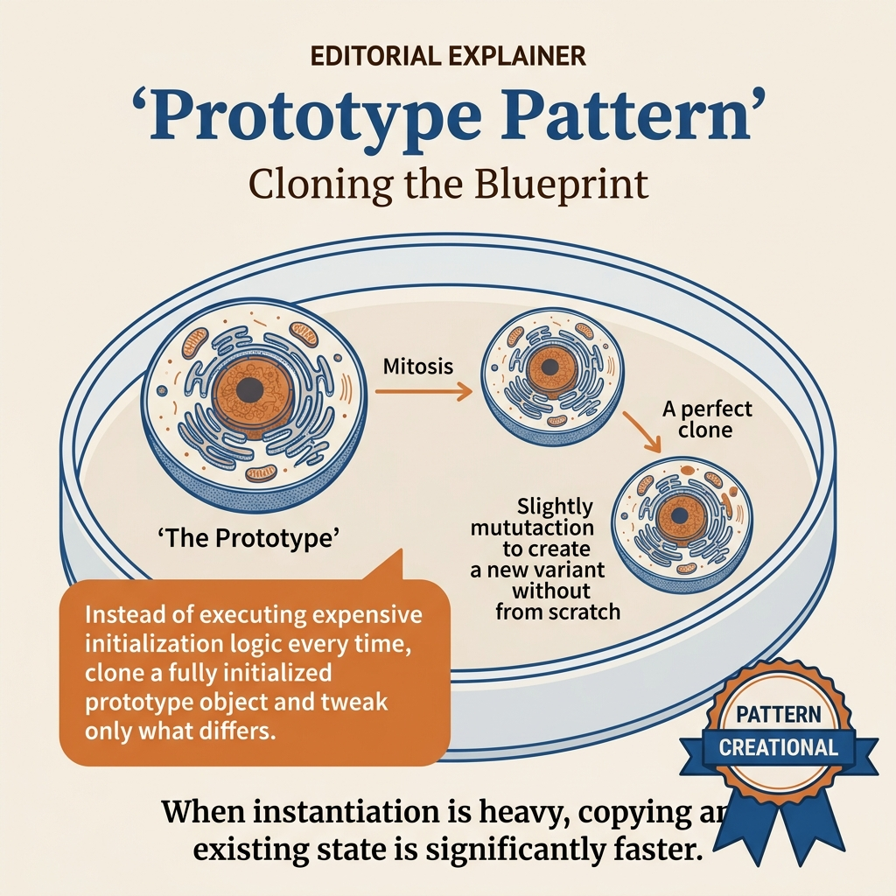
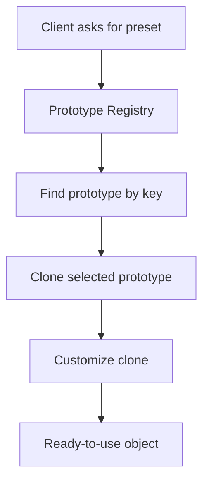
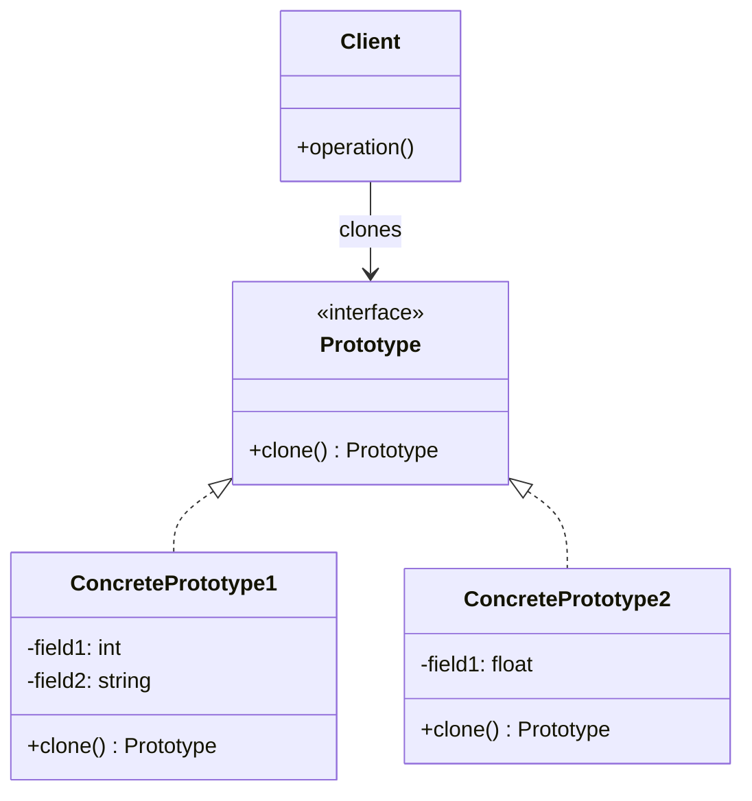
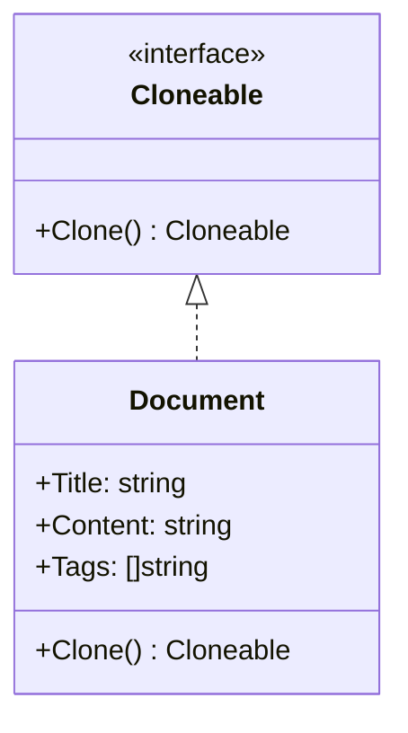
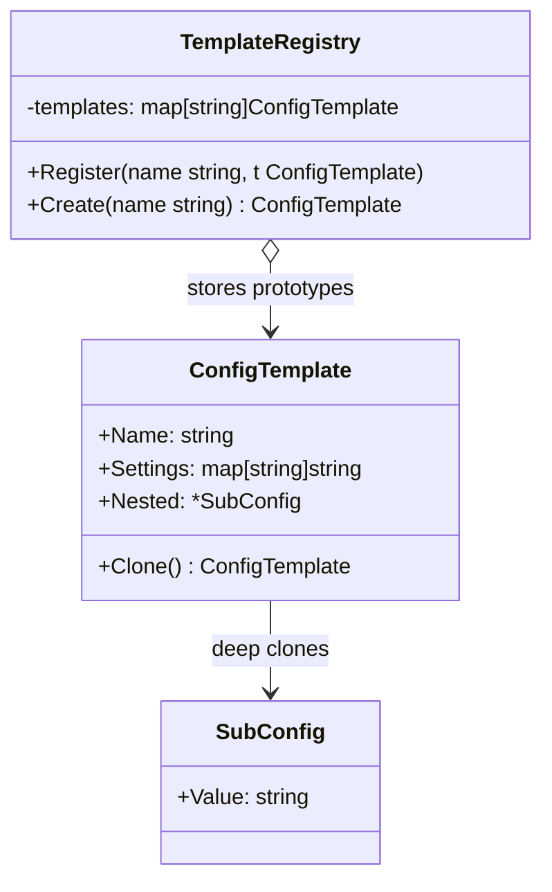
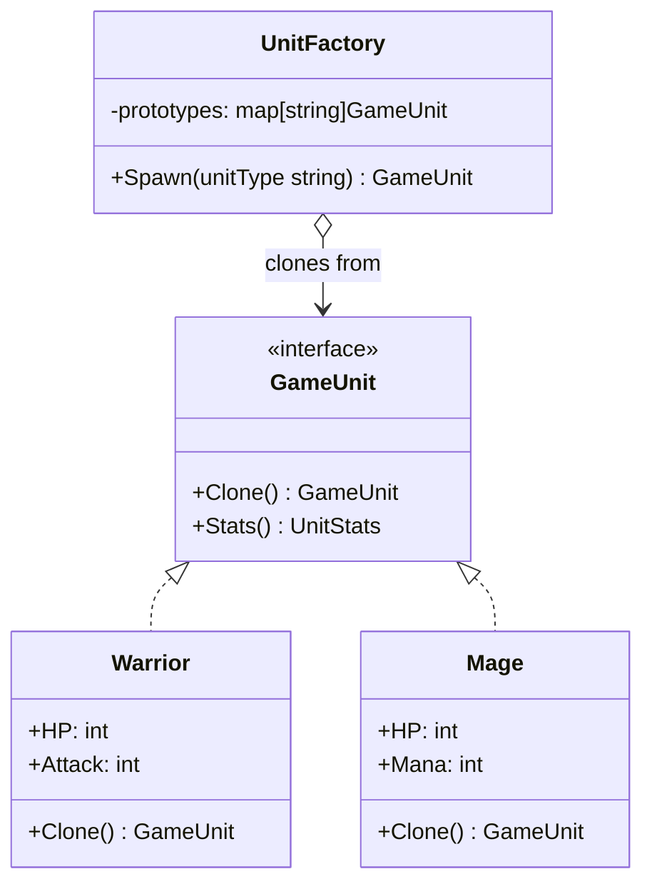

<!-- tags: design-pattern, creational, oop, prototype -->
# 🧬 Prototype

> You own an invoice template, an enemy preset in a game, or a report config pre-filled with 20 fields. If you manually copy every field when creating a new object, you duplicate knowledge that belongs exclusively to the object. The object itself should know how to clone, where to deep copy, and which fields to reset upon duplication.

📅 Created: 2026-03-19 · 🔄 Updated: 2026-04-02 · ⏱️ 20 min read

| Aspect | Detail |
| ------ | ------ |
| **Group** | Creational |
| **Purpose** | Generate new objects by cloning an existing prototype rather than initializing from scratch |
| **Go idiom** | `Clone()` method implementing intentional deep copying |
| **SOLID** | Open/Closed, encapsulation of cloning logic |
| **Confused with** | Copy constructors, Builders, serialization cloning |

---

## 1. DEFINE

Imagine an object template that incurs massive costs to build: a configuration graph, a policy tree, or a snapshot of game state. Every time you need a slight variant and reconstruct it from scratch, you pay for repetitive initialization instead of leveraging a stable original.

Prototype emerges when an origin object already holds the exact knowledge required to spawn a duplicate: template documents, preset configs, initialized graph nodes, game entities, rule packs, or permission sets. If the client manually copies each field, three risks appear:

- The client discovers too much about internal fields.
- Deep copies fail silently on slices, maps, or pointers.
- Callers clone the same object type using wildly different methods.

The `Prototype` pattern solves this by delegating the cloning responsibility directly to the object. The client stops asking "which fields need a deep copy?" and simply asks "give me a valid replica of yourself."

Core insight: **Prototype does not just accelerate object creation. It isolates cloning logic within the object that understands its own state best.**

### 1.1 Prototype vs Copy Constructor

| Approach | Pros | Trade-offs | When to choose |
| -------- | ------- | --------- | -------- |
| Manual copy | Easy to draft initially | Misses deep copies, duplicates logic | Extremely small objects |
| Copy constructor | Clear inside OOP-heavy languages | The client still depends on the concrete type | Java/C++ style APIs |
| Prototype (`Clone`) | The client only requires an abstraction | Forces explicit definitions of shallow/deep semantics | Template-heavy systems |

### 1.2 When to use

- You frequently reuse an object template.
- Creating the object from scratch proves expensive or verbose.
- You must clone through an abstraction without exposing concrete classes.
- You maintain a registry of presets like `"boss-enemy"`, `"monthly-report"`, or `"enterprise-plan"`.

### 1.3 When not to use

- The object is so trivial that cloning looks messier than a constructor.
- State includes external handles (like DB connections) that cannot be safely cloned.
- The team has not agreed upon shallow versus deep copy semantics.

### 1.4 Invariants & Failure Modes

- `Clone()` must explicitly define its deep or shallow semantics.
- A clone must not reuse a mutable reference if the caller expects total independence.
- `Clone()` must reset specific fields instead of copying them blindly: `ID`, `CreatedAt`, runtime locks, or open file handles.
- The most common failure mode: the clone appears deep but secretly shares nested slices or maps with the original.

---

These failure modes sound basic. However, a trap exists. A shallow clone creates shared mutable state between the original and the replica. A clone method that fails to update identity creates duplicate IDs in production. This trap appears in PITFALLS.

## 2. VISUAL

Cloning sounds simple, but layers of decisions hide inside. Which fields receive a deep copy? Which fields reset? Should you use a constructor or a clone? The visual below maps the landscape.

### Overview — Constructor vs Prototype



*Figure: Constructor (builds fresh) vs Prototype (clones). They contrast sharply in coupling, setup costs, and type awareness. Deep vs Shallow remains the deadliest trap.*

### Level 1 — Template to Clone

```text
Client
  │
  │ template.Clone()
  ▼
Prototype object
  │
  ├── copy immutable fields
  ├── deep copy mutable fields
  └── reset runtime-only fields
  │
  ▼
Independent clone
```

*Figure: The client ignores which fields require a deep copy. That responsibility remains locked inside `Clone()`.*

### Level 2 — Registry-Based Prototype



*Figure: A prototype registry splits "building a complex preset object" into two distinct steps: retrieving the correct template, then cloning and customizing the replica.*

### UML — Prototype Class Structure



*The Prototype interface declares the clone() method. ConcretePrototypes implement clone() by copying themselves. The client generates a new object by cloning the prototype instead of invoking a constructor.*

---

## 3. CODE

The theory looks clean in diagrams. Real code demonstrates the interfaces, compositions, and decisions that a `🧬 Prototype` must enforce.

### Example 1: Basic — Document Template Clone

> **Goal**: Clone a document template without altering the source template.



> **Approach**: `Clone()` executes a deep copy on slices and maps. It resets runtime fields.
> **Example**: A monthly report template is cloned for individual teams.
> **Complexity**: O(n + m) where `n` equals the tags count and `m` equals the metadata entries.

```go
// document_prototype.go — Prototype Pattern: clone document template safely
package documentprototype

import "time"

type Cloneable interface {
	Clone() Cloneable
}

type Document struct {
	Title     string
	Content   string
	Author    string
	Tags      []string
	Metadata  map[string]string
	CreatedAt time.Time
}

func (d *Document) Clone() Cloneable {
	tags := make([]string, len(d.Tags))
	copy(tags, d.Tags)

	metadata := make(map[string]string, len(d.Metadata))
	for k, v := range d.Metadata {
		metadata[k] = v
	}

	return &Document{
		Title:     d.Title,
		Content:   d.Content,
		Author:    d.Author,
		Tags:      tags,
		Metadata:  metadata,
		CreatedAt: time.Now(), // reset runtime field for the clone
	}
}
```
```typescript
// document_prototype.ts — Prototype Pattern: clone document template safely
interface Cloneable<T> {
  clone(): T;
}

class Document implements Cloneable<Document> {
  constructor(
    public title: string,
    public content: string,
    public author: string,
    public tags: string[],
    public metadata: Record<string, string>,
    public createdAt: Date = new Date(),
  ) {}

  clone(): Document {
    return new Document(
      this.title,
      this.content,
      this.author,
      [...this.tags],
      { ...this.metadata },
      new Date(),
    );
  }
}
```
```java
// DocumentPrototype.java — Prototype Pattern: clone document template safely
import java.time.Instant;
import java.util.HashMap;
import java.util.List;
import java.util.Map;

final class Document {
    final String title;
    final String content;
    final String author;
    final List<String> tags;
    final Map<String, String> metadata;
    final Instant createdAt;

    Document(String title, String content, String author, List<String> tags, Map<String, String> metadata, Instant createdAt) {
        this.title = title;
        this.content = content;
        this.author = author;
        this.tags = tags;
        this.metadata = metadata;
        this.createdAt = createdAt;
    }

    Document cloneDocument() {
        return new Document(title, content, author, List.copyOf(tags), new HashMap<>(metadata), Instant.now());
    }
}
```
```rust
// document_prototype.rs — Prototype Pattern: clone document template safely
use std::collections::HashMap;

#[derive(Debug)]
struct Document {
    title: String,
    content: String,
    author: String,
    tags: Vec<String>,
    metadata: HashMap<String, String>,
}

impl Document {
    fn clone_document(&self) -> Document {
        Document {
            title: self.title.clone(),
            content: self.content.clone(),
            author: self.author.clone(),
            tags: self.tags.clone(),
            metadata: self.metadata.clone(),
        }
    }
}
```
```cpp
// document_prototype.cpp — Prototype Pattern: clone document template safely
#include <map>
#include <string>
#include <vector>

struct Document {
    std::string title;
    std::string content;
    std::string author;
    std::vector<std::string> tags;
    std::map<std::string, std::string> metadata;

    Document clone_document() const {
        return Document{title, content, author, tags, metadata};
    }
};
```
```python
# document_prototype.py — Prototype Pattern: clone document template safely
from dataclasses import dataclass, field
from datetime import datetime


@dataclass
class Document:
    title: str
    content: str
    author: str
    tags: list[str] = field(default_factory=list)
    metadata: dict[str, str] = field(default_factory=dict)
    created_at: datetime = field(default_factory=datetime.utcnow)

    def clone(self) -> "Document":
        return Document(
            title=self.title,
            content=self.content,
            author=self.author,
            tags=list(self.tags),
            metadata=dict(self.metadata),
        )
```

Conclusion: Basic Prototype proves valuable immediately when an object holds nested mutable state. If the clone only copies a few scalar fields, manual copying or standard constructors usually remain more readable.

Shallow cloning works. However, nested objects require deep cloning. Let's dig deeper.

### Example 2: Intermediate — Enemy Template Registry

> **Goal**: Spawn numerous entities from existing presets without duplicating initialization logic.



> **Approach**: The prototype registry holds templates. The caller requests a prototype, clones it, and customizes it.
> **Example**: `"grunt"` and `"boss"` spawn directly from the registry.
> **Complexity**: O(1) lookup plus the clone cost scaling with internal state size.

```go
// enemy_registry.go — Prototype Pattern: preset registry + clone + customize
package enemyprototype

import "fmt"

type Enemy struct {
	Name      string
	HP        int
	Attack    int
	Skills    []string
	SpawnZone string
}

func (e *Enemy) Clone() *Enemy {
	skills := make([]string, len(e.Skills))
	copy(skills, e.Skills)
	return &Enemy{
		Name:      e.Name,
		HP:        e.HP,
		Attack:    e.Attack,
		Skills:    skills,
		SpawnZone: e.SpawnZone,
	}
}

type Registry struct {
	prototypes map[string]*Enemy
}

func NewRegistry() *Registry {
	return &Registry{
		prototypes: map[string]*Enemy{
			"grunt": {Name: "Grunt", HP: 100, Attack: 12, Skills: []string{"slash"}},
			"boss":  {Name: "Boss", HP: 1200, Attack: 70, Skills: []string{"slam", "rage"}},
		},
	}
}

func (r *Registry) Spawn(kind, zone string) (*Enemy, error) {
	prototype, ok := r.prototypes[kind]
	if !ok {
		return nil, fmt.Errorf("unknown enemy kind: %s", kind)
	}
	clone := prototype.Clone()
	clone.SpawnZone = zone
	return clone, nil
}
```
```typescript
// enemy_registry.ts — Prototype Pattern: preset registry + clone + customize
class Enemy {
  constructor(
    public name: string,
    public hp: number,
    public attack: number,
    public skills: string[],
    public spawnZone = "",
  ) {}

  clone(): Enemy {
    return new Enemy(this.name, this.hp, this.attack, [...this.skills], this.spawnZone);
  }
}

class Registry {
  private prototypes = new Map<string, Enemy>([
    ["grunt", new Enemy("Grunt", 100, 12, ["slash"])],
    ["boss", new Enemy("Boss", 1200, 70, ["slam", "rage"])],
  ]);

  spawn(kind: string, zone: string): Enemy {
    const prototype = this.prototypes.get(kind);
    if (!prototype) throw new Error(`unknown enemy kind: ${kind}`);
    const clone = prototype.clone();
    clone.spawnZone = zone;
    return clone;
  }
}
```
```java
// EnemyRegistry.java — Prototype Pattern: preset registry + clone + customize
import java.util.HashMap;
import java.util.List;
import java.util.Map;

final class Enemy {
    String name;
    int hp;
    int attack;
    List<String> skills;
    String spawnZone;

    Enemy(String name, int hp, int attack, List<String> skills, String spawnZone) {
        this.name = name;
        this.hp = hp;
        this.attack = attack;
        this.skills = skills;
        this.spawnZone = spawnZone;
    }

    Enemy cloneEnemy() {
        return new Enemy(name, hp, attack, List.copyOf(skills), spawnZone);
    }
}

final class Registry {
    private final Map<String, Enemy> prototypes = new HashMap<>();

    Registry() {
        prototypes.put("grunt", new Enemy("Grunt", 100, 12, List.of("slash"), ""));
        prototypes.put("boss", new Enemy("Boss", 1200, 70, List.of("slam", "rage"), ""));
    }
}
```
```rust
// enemy_registry.rs — Prototype Pattern: preset registry + clone + customize
use std::collections::HashMap;

#[derive(Clone, Debug)]
struct Enemy {
    name: String,
    hp: u32,
    attack: u32,
    skills: Vec<String>,
    spawn_zone: String,
}

struct Registry {
    prototypes: HashMap<String, Enemy>,
}

impl Registry {
    fn new() -> Self {
        Self {
            prototypes: HashMap::from([
                ("grunt".into(), Enemy { name: "Grunt".into(), hp: 100, attack: 12, skills: vec!["slash".into()], spawn_zone: String::new() }),
                ("boss".into(), Enemy { name: "Boss".into(), hp: 1200, attack: 70, skills: vec!["slam".into(), "rage".into()], spawn_zone: String::new() }),
            ]),
        }
    }
}
```
```cpp
// enemy_registry.cpp — Prototype Pattern: preset registry + clone + customize
#include <stdexcept>
#include <string>
#include <unordered_map>
#include <vector>

struct Enemy {
    std::string name;
    int hp;
    int attack;
    std::vector<std::string> skills;
    std::string spawn_zone;

    Enemy clone_enemy() const { return Enemy{name, hp, attack, skills, spawn_zone}; }
};
```
```python
# enemy_registry.py — Prototype Pattern: preset registry + clone + customize
from dataclasses import dataclass, field


@dataclass
class Enemy:
    name: str
    hp: int
    attack: int
    skills: list[str] = field(default_factory=list)
    spawn_zone: str = ""

    def clone(self) -> "Enemy":
        return Enemy(self.name, self.hp, self.attack, list(self.skills), self.spawn_zone)


class Registry:
    def __init__(self) -> None:
        self.prototypes = {
            "grunt": Enemy("Grunt", 100, 12, ["slash"]),
            "boss": Enemy("Boss", 1200, 70, ["slam", "rage"]),
        }

    def spawn(self, kind: str, zone: str) -> Enemy:
        prototype = self.prototypes.get(kind)
        if prototype is None:
            raise ValueError(f"unknown enemy kind: {kind}")
        clone = prototype.clone()
        clone.spawn_zone = zone
        return clone
```

> **Why?** The registry selects the correct template, and the prototype spawns a valid replica from it. These two roles complement each other perfectly. The registry answers "which template fits?". The prototype answers "how do I make a valid copy?". Decoupling these responsibilities scales preset systems much better than cramming spawn logic into a massive constructor.

Conclusion: When your system relies on preset catalogs or template libraries, Prototype pairs beautifully with a registry. It acts as a deeply pragmatic pattern, not just an OOP exercise.

Deep cloning works. However, template registries need prototype managers to organize them. Let's aggregate clones.

### Example 3: Advanced — Clone Aggregate with Runtime Field Reset

> **Goal**: Deep clone an aggregate without bringing over its runtime identity and synchronization state.



> **Approach**: Execute deep copies on mutable collections, reset runtime-only fields, and maintain valid business defaults.
> **Example**: Cloning a pricing rule pack for a completely new tenant.
> **Complexity**: O(n + m) corresponding to the rules and overrides. The cost lies entirely within deep copying the graph.

```go
// rule_pack_prototype.go — Prototype Pattern: deep clone aggregate, reset runtime identity
package rulepack

import (
	"sync"
	"time"
)

type Rule struct {
	Code    string
	Enabled bool
	Weight  int
}

type Pack struct {
	ID         string
	TenantID   string
	Name       string
	Rules      []Rule
	Overrides  map[string]int
	CreatedAt  time.Time
	mu         sync.Mutex
}

func (p *Pack) CloneForTenant(newTenantID string) *Pack {
	rules := make([]Rule, len(p.Rules))
	copy(rules, p.Rules)

	overrides := make(map[string]int, len(p.Overrides))
	for code, weight := range p.Overrides {
		overrides[code] = weight
	}

	return &Pack{
		ID:        "", // identity must reset
		TenantID:  newTenantID,
		Name:      p.Name + " (clone)",
		Rules:     rules,
		Overrides: overrides,
		CreatedAt: time.Now(),
	}
}
```
```typescript
// rule_pack_prototype.ts — Prototype Pattern: deep clone aggregate, reset runtime identity
type Rule = { code: string; enabled: boolean; weight: number };

class Pack {
  constructor(
    public id: string,
    public tenantId: string,
    public name: string,
    public rules: Rule[],
    public overrides: Record<string, number>,
    public createdAt: Date,
  ) {}

  cloneForTenant(newTenantId: string): Pack {
    return new Pack(
      "",
      newTenantId,
      `${this.name} (clone)`,
      this.rules.map(rule => ({ ...rule })),
      { ...this.overrides },
      new Date(),
    );
  }
}
```
```java
// RulePackPrototype.java — Prototype Pattern: deep clone aggregate, reset runtime identity
import java.time.Instant;
import java.util.HashMap;
import java.util.List;
import java.util.Map;

record Rule(String code, boolean enabled, int weight) {}

final class Pack {
    final String id;
    final String tenantId;
    final String name;
    final List<Rule> rules;
    final Map<String, Integer> overrides;
    final Instant createdAt;

    Pack(String id, String tenantId, String name, List<Rule> rules, Map<String, Integer> overrides, Instant createdAt) {
        this.id = id;
        this.tenantId = tenantId;
        this.name = name;
        this.rules = rules;
        this.overrides = overrides;
        this.createdAt = createdAt;
    }

    Pack cloneForTenant(String newTenantId) {
        return new Pack("", newTenantId, name + " (clone)", List.copyOf(rules), new HashMap<>(overrides), Instant.now());
    }
}
```
```rust
// rule_pack_prototype.rs — Prototype Pattern: deep clone aggregate, reset runtime identity
use std::collections::HashMap;

#[derive(Clone)]
struct Rule {
    code: String,
    enabled: bool,
    weight: i32,
}

#[derive(Clone)]
struct Pack {
    id: String,
    tenant_id: String,
    name: String,
    rules: Vec<Rule>,
    overrides: HashMap<String, i32>,
}

impl Pack {
    fn clone_for_tenant(&self, new_tenant_id: &str) -> Self {
        Self {
            id: String::new(),
            tenant_id: new_tenant_id.into(),
            name: format!("{} (clone)", self.name),
            rules: self.rules.clone(),
            overrides: self.overrides.clone(),
        }
    }
}
```
```cpp
// rule_pack_prototype.cpp — Prototype Pattern: deep clone aggregate, reset runtime identity
#include <map>
#include <string>
#include <vector>

struct Rule {
    std::string code;
    bool enabled;
    int weight;
};

struct Pack {
    std::string id;
    std::string tenant_id;
    std::string name;
    std::vector<Rule> rules;
    std::map<std::string, int> overrides;

    Pack clone_for_tenant(const std::string& new_tenant_id) const {
        return Pack{"", new_tenant_id, name + " (clone)", rules, overrides};
    }
};
```
```python
# rule_pack_prototype.py — Prototype Pattern: deep clone aggregate, reset runtime identity
from dataclasses import dataclass, field


@dataclass
class Rule:
    code: str
    enabled: bool
    weight: int


@dataclass
class Pack:
    id: str
    tenant_id: str
    name: str
    rules: list[Rule] = field(default_factory=list)
    overrides: dict[str, int] = field(default_factory=dict)

    def clone_for_tenant(self, new_tenant_id: str) -> "Pack":
        return Pack(
            id="",
            tenant_id=new_tenant_id,
            name=f"{self.name} (clone)",
            rules=[Rule(rule.code, rule.enabled, rule.weight) for rule in self.rules],
            overrides=dict(self.overrides),
        )
```

> **Why?** A clone must capture business state, never dragging along runtime identities or process state. A clone is not a byte-for-byte snapshot; it represents a **valid business replica**. Fields like `ID`, mutexes, file handles, DB connections, or trace contexts define runtime identity. They are not business state. Blindly copying them creates clones that look identical but break lifecycle semantics wildly.

Conclusion: Advanced Prototype demands a brutal question: "Which state represents the business, and which state belongs strictly to the runtime?". Failing to answer this turns the clone into a bug generator.

---

You observed shallow cloning, deep cloning, and prototype management. The danger now comes from shared mutable state and duplicated identities. We set up these traps earlier.

## 4. PITFALLS

The `🧬 Prototype` routinely suffers misunderstanding. The pattern remains in the code, but it loses the boundary it promises. These pitfalls explain why.

| # | Severity | Error | Consequence | Fix |
|---|----------|-----|---------|-----|
| 1 | 🔴 Fatal | Shallow copying slices, maps, or pointers when the caller expects deep copies | Modifying the clone corrupts the original prototype | Explicitly identify mutable fields and deep copy them |
| 2 | 🔴 Fatal | Blindly copying IDs, locks, file handles, or database connections | Invalid runtime semantics trigger duplicate identities or hard crashes | Reset runtime-only fields decisively inside `Clone()` |
| 3 | 🟡 Common | Forcing clients to copy fields manually instead of invoking `Clone()` | Cloning logic fragments and becomes highly inconsistent | Isolate all cloning logic strictly within the object or registry |
| 4 | 🟡 Common | Omitting documentation specifying deep versus shallow semantics | Developers guess wrong and introduce subtle bugs | Define the contract clearly inside the `Clone()` method |
| 5 | 🔵 Minor | Using the Prototype pattern for highly simplistic objects | Unnecessary ceremony provides zero benefits | For trivial objects, manual copying or a basic constructor is sufficient |

---

You navigated the Prototype pattern and its traps. The resources below provide deeper context.

## 5. REF

| Resource | Type | Link | Notes |
| -------- | ---- | ---- | ------- |
| Refactoring.Guru | Pattern catalog | https://refactoring.guru/design-patterns/prototype | Examines the roles of the pattern and registry |
| Effective Go | Official docs | https://go.dev/doc/effective_go | Context on copy semantics and slice/map behavior |
| Go Blog — Slices | Official blog | https://go.dev/blog/slices-intro | Essential for understanding why shallow slice copies create bugs |

---

## 6. RECOMMEND

Prototype delivers massive value when you must duplicate template objects rapidly. If your pain point originates from construction complexity or type selection, shift your focus to adjacent patterns.

| Explore | When to use | Reason | File/Link |
| ------- | ------- | ----- | --------- |
| Builder | An object requires multiple, distinct build steps | Step-by-step construction differs entirely from cloning a monolith | [03-builder.md](./03-builder.md) |
| Factory Method | The true problem lies in selecting the implementation type | Selection logic is not cloning logic | [01-factory.md](./01-factory.md) |
| Registry + Prototype | The system utilizes a template catalog or preset library | A powerful combination: registry manages, prototype clones | [Refactoring.Guru](https://refactoring.guru/design-patterns/prototype) |

---

## 7. QUICK REF

| Signal | Might Prototype be the right choice? |
| ------ | ------------------------------- |
| You frequently reuse specific object templates | ✅ Yes |
| Building from scratch proves incredibly expensive or verbose | ✅ Yes |
| You must clone through abstractions, hiding concrete types | ✅ Yes |
| The object remains tiny with very little state | ❌ Not strictly necessary |
| The team has no clear rule on deep vs shallow semantics | ⚠️ Halt until resolved |

**Links**: [← Singleton](./04-singleton.md) · [→ Creational Overview](./README.md)
