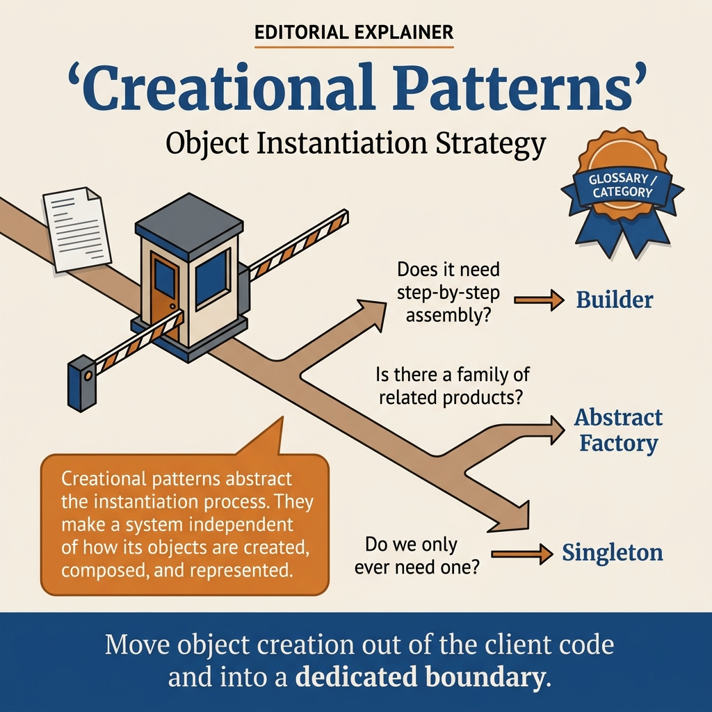

<!-- tags: design-pattern, creational, oop, overview -->
# Creational Design Patterns

> The lane for object creation pressure in Go. Learn who decides the concrete type, how objects build step-by-step, and when object creation must lock into a specific boundary.

| Aspect | Detail |
| --- | --- |
| **Concept** | Patterns handling creation pressure |
| **Audience** | Backend engineers, reviewers, developers refactoring constructors, providers, or object setups |
| **Primary style** | Pattern-family router |
| **Entry point** | Open when callers know too much about concrete types, or initialization logic leaks everywhere |

📅 Created: 2026-03-19 · 🔄 Updated: 2026-04-05 · ⏱️ 6 min read

---

## 1. DEFINE

Imagine a new service that only needs "a working object". A few sprints later, it gains providers, tenant-specific configs, dozens of optional fields, and expensive objects that repeatedly rebuild. If initialization logic lives scattered across callers, the code couples to concrete types in ways hard to spot during isolated file reviews.

`Creational Design Patterns` consolidate these pressures into a clearer question: **is the real problem selection logic, construction flow, lifecycle guarantees, or cloning costs?**

### Coverage Map

| Pattern | Problem Solved | Link |
| --- | --- | --- |
| Factory Method | Select the correct concrete implementation without exposing details to the caller | [01-factory.md](./01-factory.md) |
| Abstract Factory | Keep multiple products synchronized within the same family or variant | [02-abstract-factory.md](./02-abstract-factory.md) |
| Builder | Construct complex objects step-by-step or handle many optional fields | [03-builder.md](./03-builder.md) |
| Singleton | Lock a resource to exactly one controlled instance | [04-singleton.md](./04-singleton.md) |
| Prototype | Clone from a template or snapshot instead of rebuilding from scratch | [05-prototype.md](./05-prototype.md) |

### 1.1 Signals & Boundaries

- Open `Factory Method` when the pain lies in **choosing the object type**.
- Open `Abstract Factory` when the pain is **keeping a whole family synchronized**.
- Open `Builder` when the pain involves **objects with too many steps or options**.
- Open `Singleton` when the pain concerns **global lifecycle and uniqueness**.
- Open `Prototype` when the pain involves **rebuild costs and template cloning**.

---

## 2. VISUAL

The five creation pressures are distinct. Naming patterns is easy, but diagnosing the right pressure is hard. The visual routes based on symptoms.

### Overview — Creational Decision Map



*Figure: Selection scattered? → Factory. Steps complex? → Builder. Must be unique? → Singleton. Clone needed? → Prototype.*

### Level 1

```text
Where is the creation pressure?
  Choosing the concrete type         -> Factory Method
  Keeping objects in the same family -> Abstract Factory
  Building an object step-by-step    -> Builder
  Restricting to one instance        -> Singleton
  Cloning from a template            -> Prototype
```

*Figure: Level 1 routes by the decision causing the caller the most pain.*

### Level 2

```text
Symptom in the codebase                          Pattern to open first
--------------------------------------------   ---------------------------
Switch kind/provider scattered everywhere      Factory Method
Light/dark, EU/US must go together             Abstract Factory
Long config objects with many optional fields  Builder
Loggers or config pools sneakily initialized   Singleton
Expensive template objects rebuild constantly  Prototype
```

*Figure: Level 2 makes this lane a router based on real symptoms instead of textbook definitions.*

---

## 3. CODE

The diagrams show which lane handles which creation pressure. This artifact turns the theory into a checklist for refactoring sessions.

### Problem 1: Basic — Route creation pressure

> **Goal**: Stop treating every object creation problem as a "need for a factory".
> **Approach**: Diagnose the pain point before naming the pattern.
> **Example**: Provider selection, config objects, global resources, template cloning.
> **Complexity**: Basic

```yaml
creation_router:
  ask_first:
    - "Is the pain in selecting the object type or building the object?"
    - "Must a single object or an entire family of objects stick together?"
    - "Do we strictly require a single instance?"
    - "Is rebuilding so expensive that we should clone a template instead?"
  choose:
    selection_logic: ./01-factory.md
    family_consistency: ./02-abstract-factory.md
    step_by_step_construction: ./03-builder.md
    singleton_lifecycle: ./04-singleton.md
    clone_from_template: ./05-prototype.md
```

This artifact fits well in code reviews. It is tight enough to prevent jumping from `Builder` to `Factory` just because both involve creating objects.

---

## 4. PITFALLS

The creation lane causes confusion because teams force every constructor problem into the same pattern.

| # | Severity | Error | Consequence | Fix |
| --- | --- | --- | --- | --- |
| 1 | 🔴 Fatal | Calling all selection logic a Builder or all constructor wrappers a Factory | Choosing the wrong pattern and breaking boundaries | Route by symptoms first |
| 2 | 🟡 Common | Reading this lane as 5 disconnected definitions | Failing to compare adjacent patterns | Use the coverage map and visual router |
| 3 | 🟡 Common | Forgetting the Go lens | Applying heavy class hierarchies that conflict with Go idioms | Map patterns to interface, composition, and construction boundaries |
| 4 | 🔵 Minor | Learning Singleton first as a "default global" | Justifying global state prematurely | Open Singleton only when lifecycle uniqueness is a hard requirement |

---

## 5. REF

| Resource | Type | Link | Notes |
| --- | --- | --- | --- |
| Factory Method | Internal | ./01-factory.md | Entry point for selection logic pain |
| Abstract Factory | Internal | ./02-abstract-factory.md | Use when products must stick to the same family |
| Builder | Internal | ./03-builder.md | Use when objects require multi-step configuration |
| Effective Go | External | https://go.dev/doc/effective_go | Constructor, interface, and composition mindset in Go |

---

## 6. RECOMMEND

After locking the creation pressure, open the corresponding pattern. Do not read them sequentially like a textbook.

| Explore | When to use | Reason | File/Link |
| --- | --- | --- | --- |
| Factory Method | Callers choose concrete types directly | Consolidate selection logic into a clear boundary | [01-factory.md](./01-factory.md) |
| Builder | Objects are complex but lack product variants | Separate construction flow from callers | [03-builder.md](./03-builder.md) |
| Structural Patterns | The problem involves wrapping or connecting existing objects | Avoid creational patterns for composition problems | [Structural Patterns](../structural/README.md) |

**Links**: [← Hub](../README.md) · [→ Structural Patterns](../structural/README.md)
