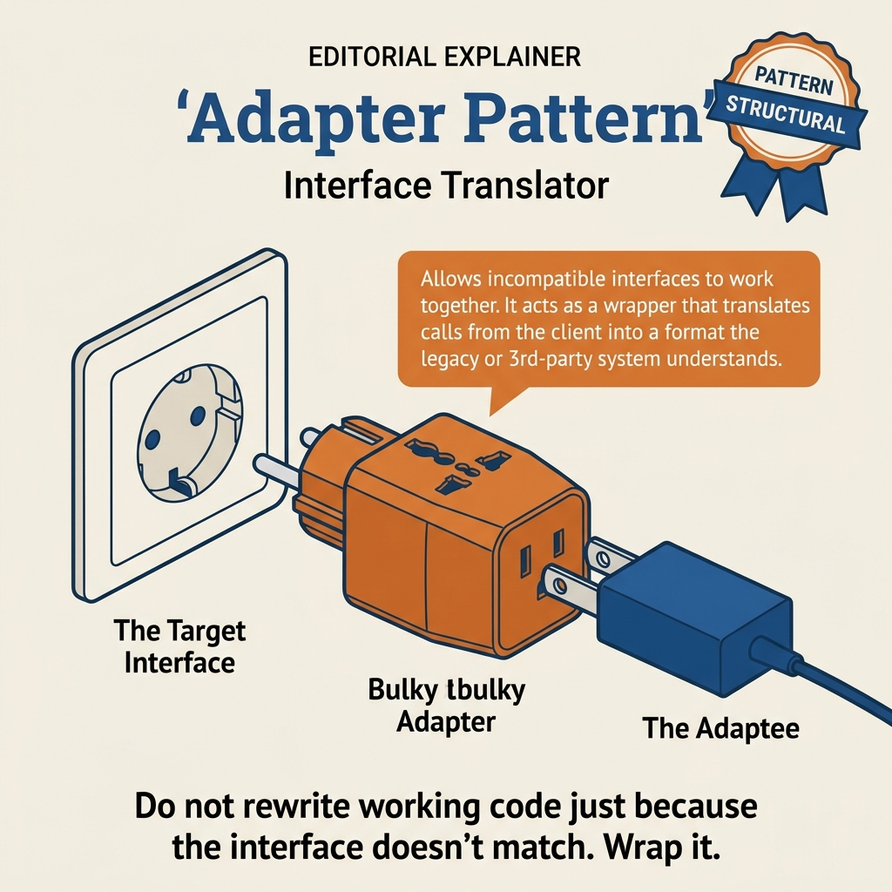
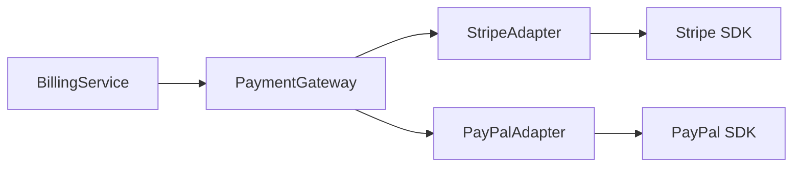
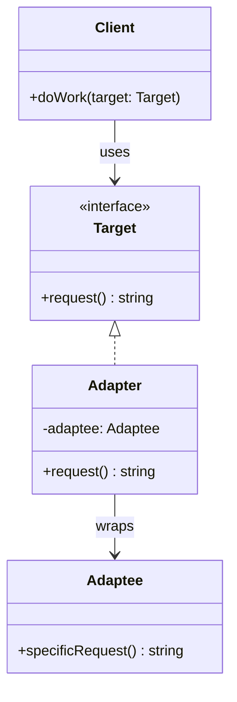
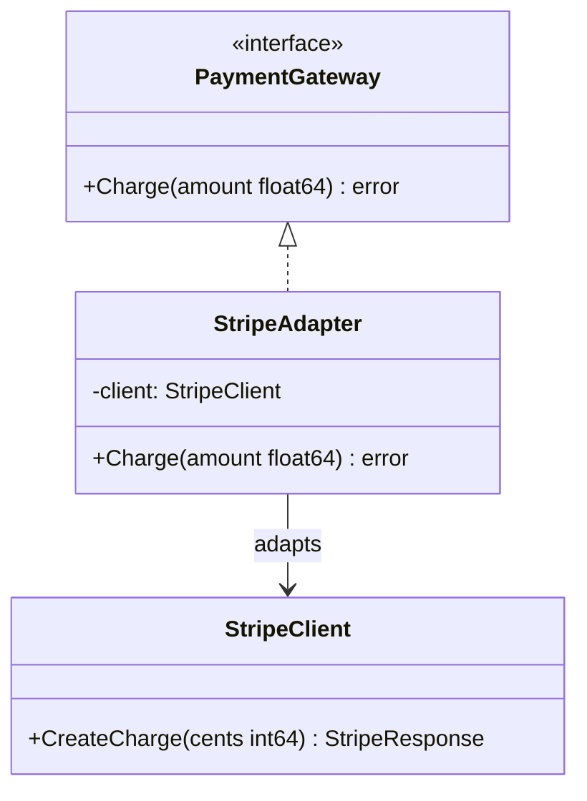
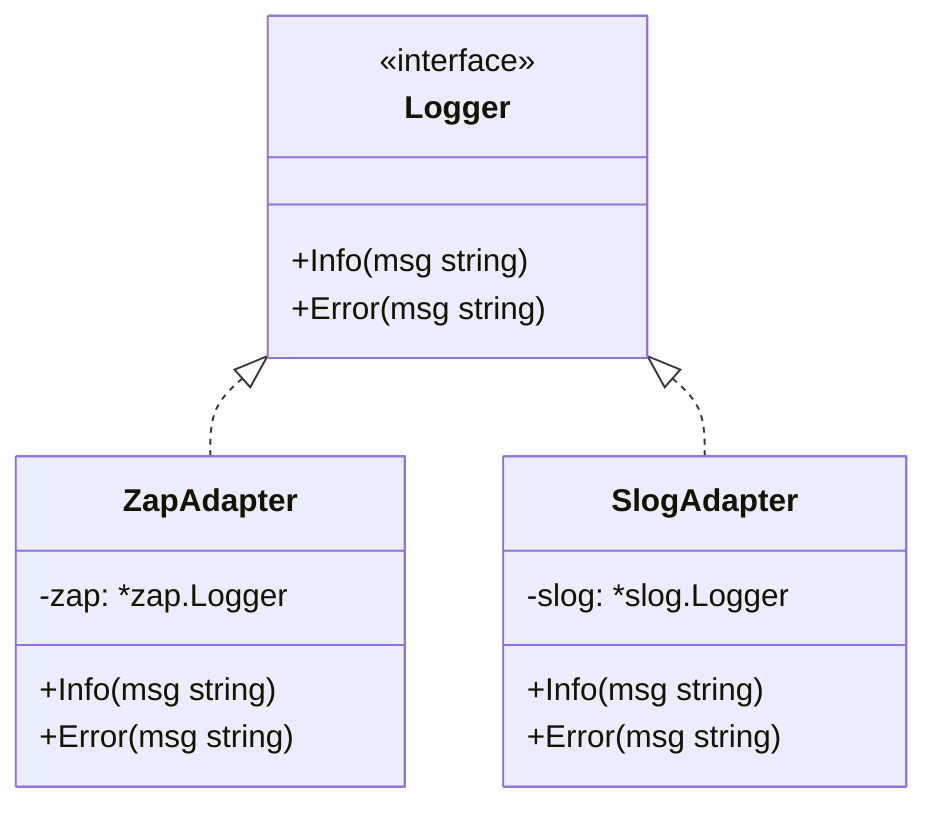
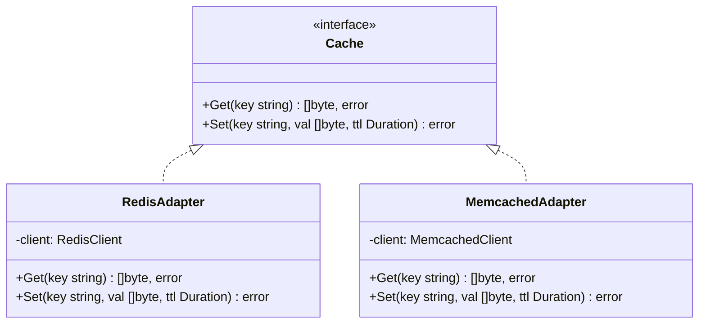

<!-- tags: design-pattern, structural, oop, adapter -->
# 🔌 Adapter

> You maintain a `BillingService` that calls `PaymentGateway.Charge()`. A new provider supplies an SDK featuring `CreatePaymentIntent(amountCents)` and a completely different response shape. If you alter the business code to accommodate each SDK, every new integration drags the domain layer deeper into vendor-specific details.

📅 Created: 2026-03-19 · 🔄 Updated: 2026-04-02 · ⏱️ 20 min read

| Aspect | Detail |
| ------ | ------ |
| **Group** | Structural |
| **Purpose** | Enable two incompatible interfaces to collaborate |
| **Go idiom** | Composition alongside a wrapper struct implementing the target interface |
| **SOLID** | Single Responsibility, Dependency Inversion |
| **Confused with** | Facade, Decorator, Proxy |

---

## 1. DEFINE

You must integrate a third-party SDK. Its API runs perfectly, but its function signatures and data types mismatch the internal interface your codebase relies upon. The solution is not rewriting the library. The solution is **forcing the two worlds to understand each other without dragging the caller into the differences**.

The Adapter pattern addresses a highly pragmatic situation: **the caller speaks one language, but the library or vendor speaks another**. The caller should never learn the vendor's language. If it does, infrastructure details pollute the business flow: tracking amounts in cents versus decimal strings, managing diverse timeout errors, or parsing vendor-specific response fields.

The `Adapter` constructs an intermediary object. It implements the interface the client expects, then translates calls and data into the interface of the wrapped object. In short: **the client remains in its abstraction; the adapter handles the translation**.

### 1.1 Vocabulary

| Concept | Role |
| --------- | ------- |
| **Target** | The interface the client wants to use |
| **Adaptee** | The actual object possessing an incompatible interface |
| **Adapter** | The wrapper that implements `Target` and translates calls to the `Adaptee` |
| **Client** | The caller utilizing `Target`, remaining ignorant of the underlying vendor |

### 1.2 Adapter vs Decorator vs Facade

| Pattern | Primary Goal | Interface from the Client's View |
| ------- | -------------- | ------------------------ |
| **Adapter** | Translates an interface | Differs from the adaptee's interface |
| **Decorator** | Adds new behavior | Mirrors the original interface exactly |
| **Facade** | Simplifies a subsystem | Presents a new, simplified interface |

### 1.3 When to use

- A vendor SDK fails to match the application's current abstractions.
- A legacy module uses an old API, but the new application demands a modern abstraction.
- You must swap providers without leaking changes into the business layer.

### 1.4 Failure Modes

- The adapter renames methods but allows vendor types to leak into the target interface.
- Validation or conversion logic duplicates across multiple adapters instead of living in shared boundaries.
- An adapter absorbs too many unrelated behaviors, morphing into a mini-facade or a disguised service layer.

---

These failure modes sound familiar. However, a trap exists. An adapter absorbing complex transformation logic mutates into a new service. An adapter failing to pass original errors destroys diagnostics. This trap appears in PITFALLS.

## 2. VISUAL

The problem of "two worlds lacking a common language" sounds abstract. The image below clarifies where the adapter stands, what it blocks, and why callers ignore vendors.

### Overview — Adapter vs Decorator vs Facade



*Figure: An Adapter translates a 1:1 interface mismatch. If you add behavior (Decorator) or simplify a subsystem (Facade), you need a different pattern.*

### Level 1 — Interface Translation Boundary

```text
Client
  │ wants PaymentGateway
  ▼
StripeAdapter
  │ convert dollars -> cents
  │ convert result -> transaction ID
  ▼
StripeSDK
```

*Figure: The client only knows `PaymentGateway`. Conversion logic stays inside the adapter and avoids the business code.*

### Level 2 — Multiple Providers, One Target



*Figure: The app swaps providers without changing the `BillingService` contract. Each vendor receives a dedicated adapter implementing the shared `PaymentGateway`.*

### UML — Adapter Class Structure



*The Client calls the Target interface. The Adapter implements the Target but delegates internally to the Adaptee. The Adapter translates the request from the Target format to the Adaptee format.*

---

## 3. CODE

The theory looks clean in diagrams. Real code demonstrates the interfaces, compositions, and decisions that a `🔌 Adapter` must enforce.

### Example 1: Basic — Payment Gateway Adapter

> **Goal**: Utilize a single `PaymentGateway` interface for both Stripe and PayPal.



> **Approach**: Each adapter wraps a distinct SDK and translates amounts and responses.
> **Example**: `Charge(29.99, "usd")` maps to cents or a decimal string depending on the vendor.
> **Complexity**: O(1) orchestration. The real cost lies in the provider network call.

```go
// payment_gateway_adapter.go — Adapter Pattern: normalize multiple provider SDKs
package paymentadapter

import "fmt"

type PaymentGateway interface {
	Charge(amount float64, currency string) (string, error)
	Refund(transactionID string) error
}

type StripeSDK struct{}

func (s *StripeSDK) CreatePaymentIntent(amountCents int, currency string) string {
	return fmt.Sprintf("pi_%d_%s", amountCents, currency)
}

func (s *StripeSDK) CancelPaymentIntent(id string) bool {
	return true
}

type StripeAdapter struct {
	sdk *StripeSDK
}

func NewStripeAdapter() PaymentGateway {
	return &StripeAdapter{sdk: &StripeSDK{}}
}

func (a *StripeAdapter) Charge(amount float64, currency string) (string, error) {
	cents := int(amount * 100)
	return a.sdk.CreatePaymentIntent(cents, currency), nil
}

func (a *StripeAdapter) Refund(transactionID string) error {
	if !a.sdk.CancelPaymentIntent(transactionID) {
		return fmt.Errorf("stripe refund failed")
	}
	return nil
}

type PayPalSDK struct{}

func (p *PayPalSDK) CreateOrder(amount string, currency string) (string, error) {
	return fmt.Sprintf("PAY-%s-%s", amount, currency), nil
}

func (p *PayPalSDK) VoidOrder(id string) error { return nil }

type PayPalAdapter struct {
	sdk *PayPalSDK
}

func NewPayPalAdapter() PaymentGateway {
	return &PayPalAdapter{sdk: &PayPalSDK{}}
}

func (a *PayPalAdapter) Charge(amount float64, currency string) (string, error) {
	return a.sdk.CreateOrder(fmt.Sprintf("%.2f", amount), currency)
}

func (a *PayPalAdapter) Refund(transactionID string) error {
	return a.sdk.VoidOrder(transactionID)
}
```
```typescript
// payment_gateway_adapter.ts — Adapter Pattern: normalize multiple provider SDKs
interface PaymentGateway {
  charge(amount: number, currency: string): Promise<string>;
  refund(transactionId: string): Promise<void>;
}

class StripeSDK {
  createPaymentIntent(amountCents: number, currency: string): string {
    return `pi_${amountCents}_${currency}`;
  }
  cancelPaymentIntent(_id: string): boolean { return true; }
}

class StripeAdapter implements PaymentGateway {
  constructor(private readonly sdk = new StripeSDK()) {}
  async charge(amount: number, currency: string): Promise<string> {
    return this.sdk.createPaymentIntent(Math.round(amount * 100), currency);
  }
  async refund(transactionId: string): Promise<void> {
    if (!this.sdk.cancelPaymentIntent(transactionId)) throw new Error("stripe refund failed");
  }
}

class PayPalSDK {
  createOrder(amount: string, currency: string): string {
    return `PAY-${amount}-${currency}`;
  }
  async voidOrder(_id: string): Promise<void> {}
}

class PayPalAdapter implements PaymentGateway {
  constructor(private readonly sdk = new PayPalSDK()) {}
  async charge(amount: number, currency: string): Promise<string> {
    return this.sdk.createOrder(amount.toFixed(2), currency);
  }
  async refund(transactionId: string): Promise<void> {
    await this.sdk.voidOrder(transactionId);
  }
}
```
```java
// PaymentGatewayAdapter.java — Adapter Pattern: normalize multiple provider SDKs
interface PaymentGateway {
    String charge(double amount, String currency) throws Exception;
    void refund(String transactionId) throws Exception;
}

final class StripeSDK {
    String createPaymentIntent(int amountCents, String currency) {
        return "pi_" + amountCents + "_" + currency;
    }
    boolean cancelPaymentIntent(String id) { return true; }
}

final class StripeAdapter implements PaymentGateway {
    private final StripeSDK sdk = new StripeSDK();
    public String charge(double amount, String currency) {
        return sdk.createPaymentIntent((int) Math.round(amount * 100), currency);
    }
    public void refund(String transactionId) {
        if (!sdk.cancelPaymentIntent(transactionId)) throw new IllegalStateException("stripe refund failed");
    }
}
```
```rust
// payment_gateway_adapter.rs — Adapter Pattern: normalize multiple provider SDKs
trait PaymentGateway {
    fn charge(&self, amount: f64, currency: &str) -> Result<String, String>;
    fn refund(&self, transaction_id: &str) -> Result<(), String>;
}

struct StripeSdk;

impl StripeSdk {
    fn create_payment_intent(&self, amount_cents: i64, currency: &str) -> String {
        format!("pi_{}_{}", amount_cents, currency)
    }
}

struct StripeAdapter {
    sdk: StripeSdk,
}

impl PaymentGateway for StripeAdapter {
    fn charge(&self, amount: f64, currency: &str) -> Result<String, String> {
        Ok(self.sdk.create_payment_intent((amount * 100.0) as i64, currency))
    }

    fn refund(&self, _transaction_id: &str) -> Result<(), String> {
        Ok(())
    }
}
```
```cpp
// payment_gateway_adapter.cpp — Adapter Pattern: normalize multiple provider SDKs
#include <cmath>
#include <stdexcept>
#include <string>

struct PaymentGateway {
    virtual std::string charge(double amount, const std::string& currency) = 0;
    virtual void refund(const std::string& transaction_id) = 0;
    virtual ~PaymentGateway() = default;
};

struct StripeSDK {
    std::string create_payment_intent(int amount_cents, const std::string& currency) {
        return "pi_" + std::to_string(amount_cents) + "_" + currency;
    }
};

struct StripeAdapter final : PaymentGateway {
    StripeSDK sdk;
    std::string charge(double amount, const std::string& currency) override {
        return sdk.create_payment_intent(static_cast<int>(std::round(amount * 100)), currency);
    }
    void refund(const std::string&) override {}
};
```
```python
# payment_gateway_adapter.py — Adapter Pattern: normalize multiple provider SDKs
from abc import ABC, abstractmethod


class PaymentGateway(ABC):
    @abstractmethod
    def charge(self, amount: float, currency: str) -> str: ...

    @abstractmethod
    def refund(self, transaction_id: str) -> None: ...


class StripeSDK:
    def create_payment_intent(self, amount_cents: int, currency: str) -> str:
        return f"pi_{amount_cents}_{currency}"


class StripeAdapter(PaymentGateway):
    def __init__(self) -> None:
        self.sdk = StripeSDK()

    def charge(self, amount: float, currency: str) -> str:
        return self.sdk.create_payment_intent(round(amount * 100), currency)

    def refund(self, transaction_id: str) -> None:
        return None
```

> **Conclusion**: Basic Adapters work best when the differences reside in data shapes and method contracts. If the business code must acknowledge `StripeSDK` or `PayPalSDK`, the adapter fails to block the dependency leak.

Basic adapters work well. However, multiple adaptees demand strategy. Let's group them.

### Example 2: Intermediate — Legacy XML Feed to Domain Parser

> **Goal**: Maintain a stable new parser utilizing a domain interface while the legacy source still emits XML strings.



> **Approach**: The adapter converts the legacy raw XML API into a highly semantic `MarketFeed`.
> **Example**: `NextTick()` returns a domain model tick, ignoring the raw vendor payload.
> **Complexity**: O(n) based on the parsing cost for each tick's payload.

```go
// market_feed_adapter.go — Adapter Pattern: hide legacy transport from domain parser
package marketfeed

import (
	"encoding/xml"
	"fmt"
)

type Tick struct {
	Symbol string
	Price  float64
}

type MarketFeed interface {
	NextTick() (Tick, error)
}

type LegacyXMLFeed struct {
	payloads []string
	index    int
}

func (f *LegacyXMLFeed) ReadRaw() (string, error) {
	if f.index >= len(f.payloads) {
		return "", fmt.Errorf("end of feed")
	}
	value := f.payloads[f.index]
	f.index++
	return value, nil
}

type XMLFeedAdapter struct {
	feed *LegacyXMLFeed
}

type xmlTick struct {
	XMLName xml.Name `xml:"tick"`
	Symbol  string   `xml:"symbol"`
	Price   float64  `xml:"price"`
}

func (a *XMLFeedAdapter) NextTick() (Tick, error) {
	raw, err := a.feed.ReadRaw()
	if err != nil {
		return Tick{}, err
	}
	var parsed xmlTick
	if err := xml.Unmarshal([]byte(raw), &parsed); err != nil {
		return Tick{}, err
	}
	return Tick{Symbol: parsed.Symbol, Price: parsed.Price}, nil
}
```
```typescript
// market_feed_adapter.ts — Adapter Pattern: hide legacy transport from domain parser
type Tick = { symbol: string; price: number };

interface MarketFeed {
  nextTick(): Tick;
}

class LegacyXMLFeed {
  constructor(private payloads: string[], private index = 0) {}
  readRaw(): string {
    if (this.index >= this.payloads.length) throw new Error("end of feed");
    return this.payloads[this.index++];
  }
}

class XMLFeedAdapter implements MarketFeed {
  constructor(private readonly feed: LegacyXMLFeed) {}
  nextTick(): Tick {
    const raw = this.feed.readRaw();
    const symbol = raw.match(/<symbol>(.*?)<\/symbol>/)?.[1] ?? "";
    const price = Number(raw.match(/<price>(.*?)<\/price>/)?.[1] ?? "0");
    return { symbol, price };
  }
}
```
```java
// MarketFeedAdapter.java — Adapter Pattern: hide legacy transport from domain parser
record Tick(String symbol, double price) {}

interface MarketFeed {
    Tick nextTick() throws Exception;
}

final class LegacyXMLFeed {
    private final java.util.List<String> payloads;
    private int index = 0;

    LegacyXMLFeed(java.util.List<String> payloads) { this.payloads = payloads; }

    String readRaw() {
        if (index >= payloads.size()) throw new IllegalStateException("end of feed");
        return payloads.get(index++);
    }
}
```
```rust
// market_feed_adapter.rs — Adapter Pattern: hide legacy transport from domain parser
struct Tick {
    symbol: String,
    price: f64,
}

trait MarketFeed {
    fn next_tick(&mut self) -> Result<Tick, String>;
}
```
```cpp
// market_feed_adapter.cpp — Adapter Pattern: hide legacy transport from domain parser
#include <stdexcept>
#include <string>
#include <vector>

struct Tick {
    std::string symbol;
    double price;
};
```
```python
# market_feed_adapter.py — Adapter Pattern: hide legacy transport from domain parser
from dataclasses import dataclass


@dataclass
class Tick:
    symbol: str
    price: float
```

> **Why?** The true value of this adapter lies in blocking the raw transport format from infecting the domain parser. If the new parser manually reads XML tag names, the `MarketFeed` interface acts merely as a superficial wrapper.

Conclusion: Intermediate Adapters shine at migration boundaries: legacy feeds, legacy SDKs, or legacy protocols. They allow new modules to speak the language of the domain rather than the language of the old system.

Multi-adaptee scenarios work well. However, bidirectional mapping requires two-way adapters. Let's expand.

### Example 3: Advanced — Storage Adapter Normalizes Error Models

> **Goal**: Standardize both operations and error semantics across multiple storage backends.



> **Approach**: The adapter maps method names and translates vendor-specific errors into domain errors.
> **Example**: The system consistently returns `ErrObjectNotFound` whether the backend uses S3 or a local disk.
> **Complexity**: O(1) orchestration plus the actual backend IO cost.

```go
// storage_adapter.go — Adapter Pattern: unify operation + error contract
package storageadapter

import (
	"errors"
	"fmt"
	"strings"
)

var ErrObjectNotFound = errors.New("object not found")

type BlobStore interface {
	Get(key string) ([]byte, error)
	Put(key string, data []byte) error
}

type S3Client struct{}

func (c *S3Client) DownloadObject(key string) ([]byte, error) {
	return nil, fmt.Errorf("NoSuchKey: %s", key)
}

func (c *S3Client) UploadObject(key string, data []byte) error { return nil }

type S3Adapter struct {
	client *S3Client
}

func (a *S3Adapter) Get(key string) ([]byte, error) {
	data, err := a.client.DownloadObject(key)
	if err != nil && strings.Contains(err.Error(), "NoSuchKey") {
		return nil, ErrObjectNotFound
	}
	return data, err
}

func (a *S3Adapter) Put(key string, data []byte) error {
	return a.client.UploadObject(key, data)
}
```
```typescript
// storage_adapter.ts — Adapter Pattern: unify operation + error contract
const ErrObjectNotFound = new Error("object not found");

interface BlobStore {
  get(key: string): Promise<Uint8Array>;
  put(key: string, data: Uint8Array): Promise<void>;
}
```
```java
// StorageAdapter.java — Adapter Pattern: unify operation + error contract
interface BlobStore {
    byte[] get(String key) throws Exception;
    void put(String key, byte[] data) throws Exception;
}
```
```rust
// storage_adapter.rs — Adapter Pattern: unify operation + error contract
trait BlobStore {
    fn get(&self, key: &str) -> Result<Vec<u8>, String>;
    fn put(&self, key: &str, data: &[u8]) -> Result<(), String>;
}
```
```cpp
// storage_adapter.cpp — Adapter Pattern: unify operation + error contract
struct BlobStore {
    virtual std::string get(const std::string& key) = 0;
    virtual void put(const std::string& key, const std::string& data) = 0;
    virtual ~BlobStore() = default;
};
```
```python
# storage_adapter.py — Adapter Pattern: unify operation + error contract
class ErrObjectNotFound(Exception):
    pass
```

> **Why?** Production-grade adapters must standardize the error contract alongside method signatures. If the caller checks `if err contains "NoSuchKey"` for S3 and `"ENOENT"` for local filesystems, vendor details continue to leak into the domain.

Conclusion: Advanced Adapters demonstrate the most power at the boundary outside the domain: storage, payments, messaging, and legacy transports. This pattern prevents vendor lock-in at the code level; it is far more than a simple method-renaming trick.

---

You explored basic adapters, multi-adaptee setups, and bidirectional conversions. The danger now comes from adapters acting as services and swallowed errors. We set up these traps earlier.

## 4. PITFALLS

The `🔌 Adapter` routinely suffers misunderstanding. The pattern remains in the code, but it loses the boundary it promises. These pitfalls explain why.

| # | Severity | Error | Consequence | Fix |
|---|----------|-----|---------|-----|
| 1 | 🔴 Fatal | The target interface still exposes vendor types | The business layer couples tightly to the SDK | Keep the target strictly as a domain abstraction |
| 2 | 🔴 Fatal | Failing to standardize the error contract | Callers resort to checking specific vendor error strings | Map vendor errors to domain errors within the adapter |
| 3 | 🟡 Common | The adapter absorbs complex business rules | Boundaries blur, complicating testing | Ensure the adapter only translates protocols, data, and errors |
| 4 | 🟡 Common | One adapter supports too many modes or providers | The class balloons and becomes unreadable | Assign a dedicated adapter to each adaptee or provider |
| 5 | 🔵 Minor | Merely renaming methods without solving a real pain point | Applying the pattern without justification | Use the pattern exclusively for clear interface mismatches |

---

You navigated the Adapter pattern and its traps. The resources below provide deeper context.

## 5. REF

| Resource | Type | Link | Notes |
| -------- | ---- | ---- | ------- |
| Refactoring.Guru — Adapter | Pattern catalog | https://refactoring.guru/design-patterns/adapter | Details target, adaptee, and adapter roles |
| Effective Go | Official docs | https://go.dev/doc/effective_go | Composition and interface idioms in Go |
| Fowler — Gateway patterns | Engineering reference | https://martinfowler.com/eaaCatalog/gateway.html | Relates strongly to boundary adaptation in real applications |

---

## 6. RECOMMEND

Adapters block vendor details at boundaries. If the pain point involves adding behavior or consolidating orchestration rather than an interface mismatch, you need a different pattern.

| Explore | When to use | Reason | File/Link |
| ------- | ------- | ----- | --------- |
| Decorator | You must add behavior while keeping the exact same interface | Enhancement differs fundamentally from translation | [02-decorator.md](./02-decorator.md) |
| Facade | The pain point involves hiding a subsystem behind a simple API | Simplification differs from bridging two interfaces | [04-facade.md](./04-facade.md) |
| Proxy | You must control access or lifecycles via an identical interface | Access control differs from translation | [03-proxy.md](./03-proxy.md) |

---

## 7. QUICK REF

| Signal | Might Adapter be the right choice? |
| ------ | --------------------- |
| A clear interface mismatch exists | ✅ Yes |
| Vendor types or errors leak into the domain | ✅ Yes |
| You just want to attach behavior to the same interface | ❌ That implies a Decorator |
| You want to simplify an entire subsystem | ❌ That implies a Facade |

**Links**: [← Creational Patterns](../creational/README.md) · [→ Decorator](./02-decorator.md)
