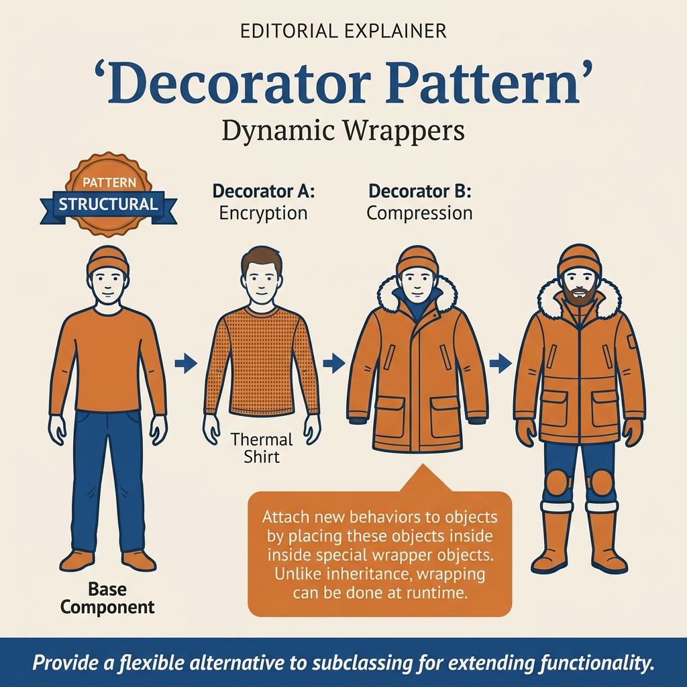
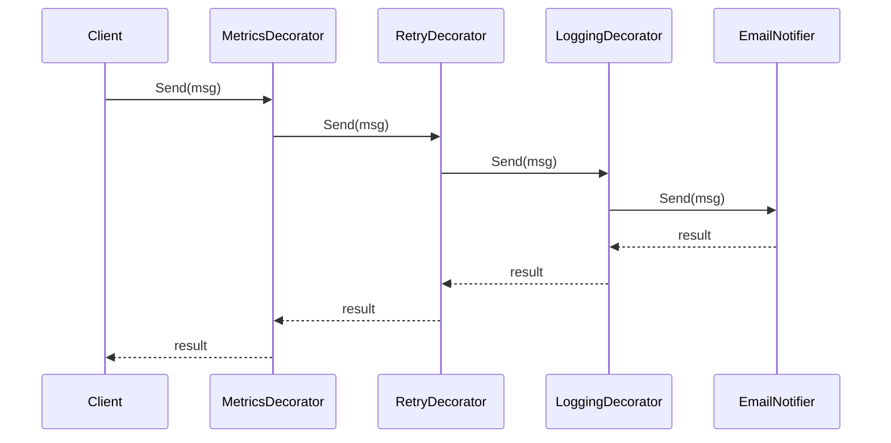
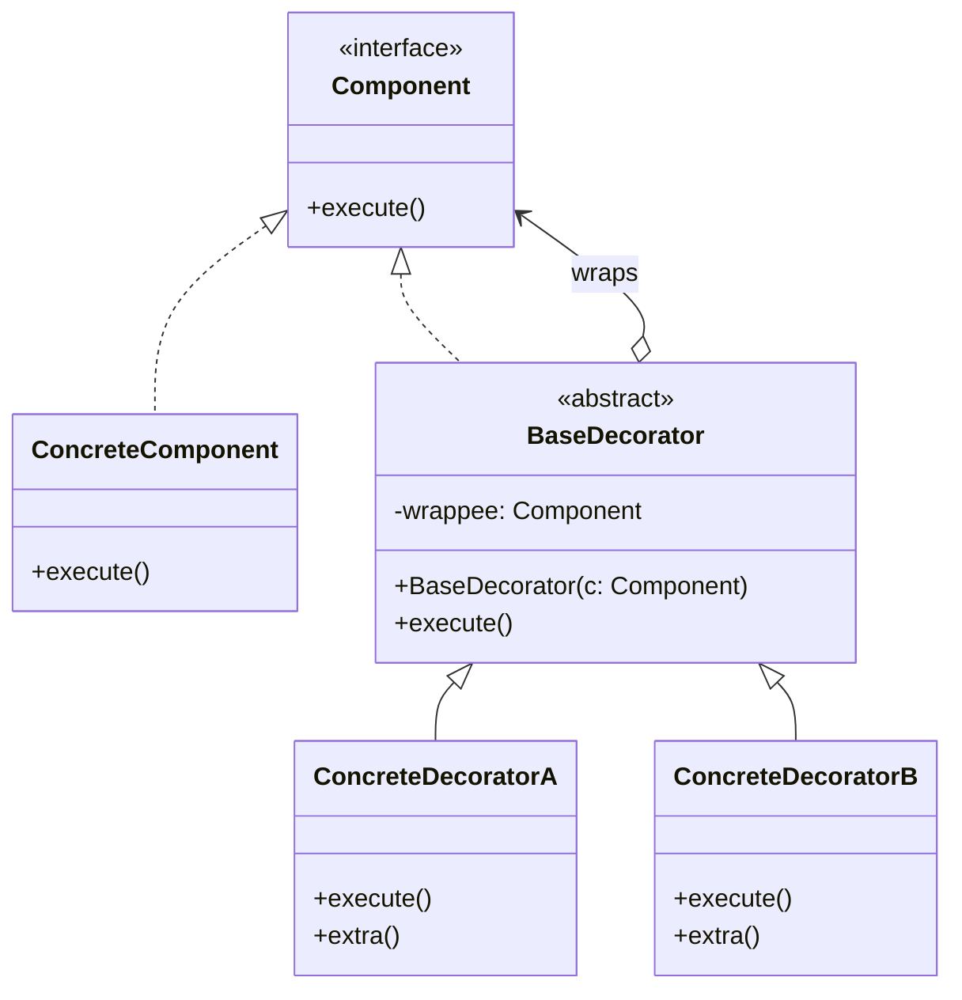
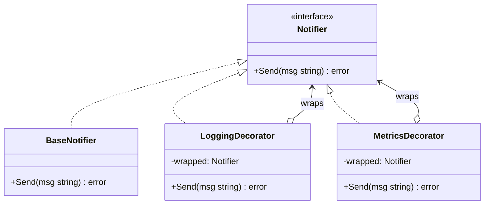
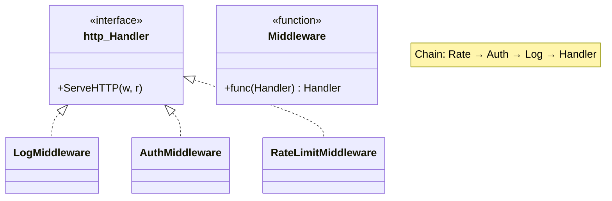
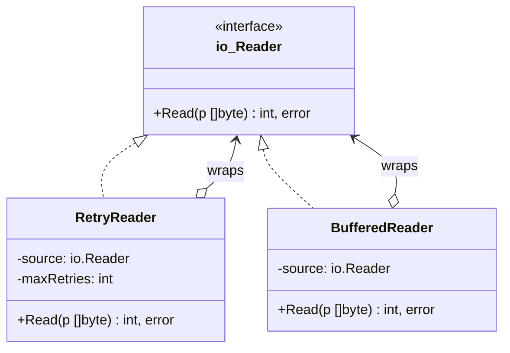

<!-- tags: design-pattern, structural, oop, decorator -->
# 🎀 Decorator

> You manage a `Notifier` that sends emails. Soon, you receive requirements for logging, retries, metrics, PII masking, and tracing. If every behavior spawns a new subclass, the combinations explode rapidly. If you stuff everything into a single class, that class transforms into a Christmas tree adorned with endless lights.

📅 Created: 2026-03-19 · 🔄 Updated: 2026-04-02 · ⏱️ 21 min read

| Aspect | Detail |
| ------ | ------ |
| **Group** | Structural |
| **Purpose** | Attach additional behavior to an object dynamically at runtime while preserving the identical interface |
| **Go idiom** | Middleware, `io.Reader` wrapping, function wrappers |
| **SOLID** | Open/Closed, Single Responsibility |
| **Confused with** | Adapter, Proxy |

---

## 1. DEFINE

Imagine a handler that executes a business flow perfectly. Production suddenly demands logging, metrics, authentication, caching, and tracing on top of it. If every new requirement pierces the core handler directly, you quickly lose track of what constitutes business logic and what represents a cross-cutting concern.

Decorator solves a very practical problem. You possess a core behavior that works, but you must attach cross-cutting concerns like logging, metrics, caching, retries, authentication, or tracing. Dangerously, these concerns arrive gradually. If the initial architecture relies on inheritance or optional flags, the code rapidly swells into an unmanageable combination.

The `Decorator` preserves the original component's interface but wraps it in layers. Each wrapper injects exactly one behavior either before or after delegating the call down to the inner component.

Core insight: **Decorator never alters the contract. It alters the execution path by inserting layers before and after delegation.**

### 1.1 Vocabulary

| Concept | Role |
| --------- | ------- |
| **Component** | The shared interface the client utilizes |
| **Concrete Component** | The original, core implementation |
| **Decorator** | A wrapper that implements the identical interface |
| **Concrete Decorator** | A wrapper injecting a specific behavior |

### 1.2 Decorator vs Proxy vs Adapter

| Pattern | Client Interface | Primary Goal |
| ------- | ------------------------ | -------------- |
| **Decorator** | Stays exactly the same | Adds new behavior |
| **Proxy** | Stays exactly the same | Controls access or lifecycle |
| **Adapter** | Usually completely different | Translates interfaces |

### 1.3 When to use

- Numerous cross-cutting concerns demand flexible combinations.
- You must stack behaviors dynamically based on runtime configurations.
- You refuse to modify the core class every time a new concern emerges.

### 1.4 Failure Modes

- A decorator absorbs core business logic rather than auxiliary concerns.
- A decorator stack lacks a clear order, causing subtly incorrect behavior.
- The wrapper fails to delegate completely, unintentionally altering the original contract.

---

These failure modes sound obvious. However, a trap exists. A decorator forgetting to delegate breaks the contract. Stacking decorators in the wrong order triggers authentication bypasses or false logs. This trap appears in PITFALLS.

## 2. VISUAL

Decorator theory sounds straightforward. But without seeing an actual stack, you easily confuse it with a Proxy or an Adapter. The image below provides a comprehensive view.

### Overview — Decorator Stack & Go Idiom



*Figure: Every layer functions as a decorator sharing the same interface, stacking from the outside in. Stack order dictates execution order. Incorrect ordering guarantees incorrect behavior.*

### Level 1 — Wrapper Stack

```text
Client
  │ uses Notifier
  ▼
MetricsDecorator
  ▼
RetryDecorator
  ▼
LoggingDecorator
  ▼
EmailNotifier
```

*Figure: Every layer honors the `Notifier` interface. The client remains ignorant of how many layers exist below.*

### Level 2 — Execution Order



*Figure: Decorator order establishes execution order. Swapping the wrapper sequence usually changes the runtime semantics.*

### UML — Decorator Class Structure



*The Component interface declares the operation. The ConcreteComponent acts as the root object. The Decorator wraps the Component, delegates to it, and adds behavior before or after. Multiple decorators stack seamlessly.*

---

## 3. CODE

The diagrams map boundaries. The code reveals how the `🎀 Decorator` leverages interfaces and composition without leaking decisions to the caller.

### Example 1: Basic — Notifier with Logging and Metrics

> **Goal**: Attach logging and metrics to a `Notifier` without modifying the core implementation.



> **Approach**: Each concern occupies a distinct decorator implementing `Notifier`.
> **Example**: `Metrics(Logging(EmailNotifier))`.
> **Complexity**: O(k) where `k` is the number of decorator layers. The core sending cost resides in the root component.

```go
// notifier_decorator.go — Decorator Pattern: add logging and metrics around notifier
package decoratordemo

import "fmt"

type Notifier interface {
	Send(recipient, message string) error
}

type EmailNotifier struct{}

func (EmailNotifier) Send(recipient, message string) error {
	fmt.Printf("email sent to %s: %s\n", recipient, message)
	return nil
}

type LoggingDecorator struct {
	next Notifier
}

func (d LoggingDecorator) Send(recipient, message string) error {
	fmt.Printf("log:start recipient=%s\n", recipient)
	err := d.next.Send(recipient, message)
	fmt.Printf("log:end err=%v\n", err)
	return err
}

type MetricsDecorator struct {
	next Notifier
}

func (d MetricsDecorator) Send(recipient, message string) error {
	err := d.next.Send(recipient, message)
	if err == nil {
		fmt.Println("metrics: notifier_success += 1")
	}
	return err
}
```
```typescript
// notifier_decorator.ts — Decorator Pattern: add logging and metrics around notifier
interface Notifier {
  send(recipient: string, message: string): Promise<void>;
}

class EmailNotifier implements Notifier {
  async send(recipient: string, message: string): Promise<void> {
    console.log(`email sent to ${recipient}: ${message}`);
  }
}

class LoggingDecorator implements Notifier {
  constructor(private readonly next: Notifier) {}
  async send(recipient: string, message: string): Promise<void> {
    console.log(`log:start recipient=${recipient}`);
    await this.next.send(recipient, message);
    console.log("log:end");
  }
}
```
```java
// NotifierDecorator.java — Decorator Pattern: add logging and metrics around notifier
interface Notifier {
    void send(String recipient, String message) throws Exception;
}

final class EmailNotifier implements Notifier {
    public void send(String recipient, String message) {
        System.out.printf("email sent to %s: %s%n", recipient, message);
    }
}
```
```rust
// notifier_decorator.rs — Decorator Pattern: add logging and metrics around notifier
trait Notifier {
    fn send(&self, recipient: &str, message: &str) -> Result<(), String>;
}
```
```cpp
// notifier_decorator.cpp — Decorator Pattern: add logging and metrics around notifier
struct Notifier {
    virtual void send(const std::string& recipient, const std::string& message) = 0;
    virtual ~Notifier() = default;
};
```
```python
# notifier_decorator.py — Decorator Pattern: add logging and metrics around notifier
from abc import ABC, abstractmethod


class Notifier(ABC):
    @abstractmethod
    def send(self, recipient: str, message: str) -> None: ...
```

Conclusion: The Basic Decorator shines immediately when you must maintain a stable interface while layering cross-cutting concerns around a root component.

Logging decorators work smoothly. However, authorization requires preemptive blocking. Let's stack them.

### Example 2: Intermediate — HTTP Middleware Chain

> **Goal**: Utilize a highly familiar Go idiom to showcase Decorators in the real world.



> **Approach**: Treat every middleware as a decorator enveloping a handler.
> **Example**: `Auth -> RateLimit -> Logging -> Handler`.
> **Complexity**: O(k) for the middleware layers plus the execution cost of the core handler.

```go
// http_middleware_decorator.go — Decorator Pattern: middleware chain in Go
package middlewaredecorator

import (
	"fmt"
	"net/http"
)

type Middleware func(http.Handler) http.Handler

func Logging(next http.Handler) http.Handler {
	return http.HandlerFunc(func(w http.ResponseWriter, r *http.Request) {
		fmt.Println("log:start", r.Method, r.URL.Path)
		next.ServeHTTP(w, r)
		fmt.Println("log:end", r.Method, r.URL.Path)
	})
}

func RequireToken(token string) Middleware {
	return func(next http.Handler) http.Handler {
		return http.HandlerFunc(func(w http.ResponseWriter, r *http.Request) {
			if r.Header.Get("Authorization") != "Bearer "+token {
				http.Error(w, "unauthorized", http.StatusUnauthorized)
				return
			}
			next.ServeHTTP(w, r)
		})
	}
}

func Chain(handler http.Handler, middlewares ...Middleware) http.Handler {
	for i := len(middlewares) - 1; i >= 0; i-- {
		handler = middlewares[i](handler)
	}
	return handler
}
```
```typescript
// http_middleware_decorator.ts — Decorator Pattern: middleware chain in web handlers
type Handler = (req: Request) => Promise<Response>;
type Middleware = (next: Handler) => Handler;

const logging = (next: Handler): Handler => async (req) => {
  console.log("log:start", req.method, new URL(req.url).pathname);
  const response = await next(req);
  console.log("log:end", req.method, new URL(req.url).pathname);
  return response;
};
```
```java
// HttpMiddlewareDecorator.java — Decorator Pattern: middleware chain in web handlers
import java.util.function.Function;

interface Handler {
    String handle(String request);
}
```
```rust
// http_middleware_decorator.rs — Decorator Pattern: middleware chain in web handlers
type Handler = Box<dyn Fn(&str) -> String>;
```
```cpp
// http_middleware_decorator.cpp — Decorator Pattern: middleware chain in web handlers
#include <functional>
#include <string>
using Handler = std::function<std::string(const std::string&)>;
```
```python
# http_middleware_decorator.py — Decorator Pattern: middleware chain in web handlers
from collections.abc import Callable

Handler = Callable[[str], str]
```

> **Why?** Middleware exemplifies Decorators perfectly because it proves the pattern is not merely academic. Each middleware retains the handler's contract while injecting logic before or after delegation. The sequence of middleware explicitly forms the decorator stack.

Conclusion: If your team understands middleware, they already comprehend Decorators at a production level without needing to name the pattern.

Auth decorators work well. However, retries require external wrapping. Let's compose them.

### Example 3: Advanced — `io.Reader` Stack with Retry Boundaries

> **Goal**: Stack multiple behaviors onto a data stream while the caller only observes an `io.Reader`.



> **Approach**: Combine buffering, decompression, and tracing beneath a uniform interface.
> **Example**: `bufio.NewReader(gzip.NewReader(source))` represents a classic decorator chain.
> **Complexity**: O(k) wrapper hops plus the actual IO overhead.

```go
// reader_decorator.go — Decorator Pattern: layered readers keep the same contract
package readerdecorator

import (
	"bufio"
	"bytes"
	"compress/gzip"
	"fmt"
	"io"
)

type TracingReader struct {
	next io.Reader
}

func (r TracingReader) Read(p []byte) (int, error) {
	n, err := r.next.Read(p)
	fmt.Printf("trace: read=%d err=%v\n", n, err)
	return n, err
}

func Example() (string, error) {
	var compressed bytes.Buffer
	zw := gzip.NewWriter(&compressed)
	if _, err := zw.Write([]byte("hello decorator")); err != nil {
		return "", err
	}
	if err := zw.Close(); err != nil {
		return "", err
	}

	gzr, err := gzip.NewReader(bytes.NewReader(compressed.Bytes()))
	if err != nil {
		return "", err
	}

	reader := bufio.NewReader(TracingReader{next: gzr})
	data, err := io.ReadAll(reader)
	return string(data), err
}
```
```typescript
// reader_decorator.ts — Decorator Pattern: layered readers keep the same contract
interface Reader {
  read(): Promise<string>;
}
```
```java
// ReaderDecorator.java — Decorator Pattern: layered readers keep the same contract
interface Reader {
    String read() throws Exception;
}
```
```rust
// reader_decorator.rs — Decorator Pattern: layered readers keep the same contract
trait Reader {
    fn read(&mut self) -> Result<String, String>;
}
```
```cpp
// reader_decorator.cpp — Decorator Pattern: layered readers keep the same contract
struct Reader {
    virtual std::string read() = 0;
    virtual ~Reader() = default;
};
```
```python
# reader_decorator.py — Decorator Pattern: layered readers keep the same contract
class Reader:
    def read(self) -> str:
        raise NotImplementedError
```

> **Why?** The `io.Reader` stack highlights that Decorators excel when contracts remain microscopic, allowing wrappers to stack effortlessly. The real-world lesson: thinner interfaces yield easier composition.

Conclusion: Advanced Decorators suit cross-cutting behaviors over tight, stable interfaces. If an interface balloons, decorators must write excessive forwarding code, neutralizing the pattern's benefits.

---

You observed logging, auth, and retry decorators. The danger now comes from shattered delegation and flawed ordering. We set up these traps earlier.

## 4. PITFALLS

The `🎀 Decorator` routinely suffers misunderstanding. The pattern remains in the code, but it loses the boundary it promises. These pitfalls explain why.

| # | Severity | Error | Consequence | Fix |
|---|----------|-----|---------|-----|
| 1 | 🔴 Fatal | A decorator neglects to delegate fully to the inner component | Core behaviors vanish or the contract breaks | Set delegation as the default; inject logic exclusively before or after |
| 2 | 🔴 Fatal | Stacking decorators in the incorrect sequence | Semantics shift silently; auth, logs, and retries desynchronize | Document ordering policies explicitly and test the chain sequence |
| 3 | 🟡 Common | Applying Decorators for massive business branching logic | The wrapper stack grows inscrutable and impossible to debug | Use exclusively for cross-cutting concerns |
| 4 | 🟡 Common | The interface inflates significantly | Every decorator is forced to forward an unmanageable number of methods | Segment large interfaces before decorating |
| 5 | 🔵 Minor | Confusing a Decorator with purely cosmetic subclassing | The pattern sees massive overuse | Apply decorators solely when runtime composition is strictly necessary |

---

You navigated the Decorator pattern and its traps. The resources below provide deeper context.

## 5. REF

| Resource | Type | Link | Notes |
| -------- | ---- | ---- | ------- |
| Refactoring.Guru — Decorator | Pattern catalog | https://refactoring.guru/design-patterns/decorator | Canonical pattern framework |
| Go `io` package | Official docs | https://pkg.go.dev/io | Micro-interfaces that perfectly suit Decorators |
| Go `net/http` | Official docs | https://pkg.go.dev/net/http | Middleware serves as real-world Decorators |

---

## 6. RECOMMEND

Decorators excel at applying cross-cutting concerns to compact interfaces. If the pain point involves translating interfaces or managing lifecycles, alternative patterns fit better.

| Explore | When to use | Reason | File/Link |
| ------- | ------- | ----- | --------- |
| Adapter | You must translate interface A into interface B | Translation diverges entirely from enhancement | [01-adapter.md](./01-adapter.md) |
| Proxy | You must govern access or lifecycle rules | Control differs fundamentally from behavior stacking | [03-proxy.md](./03-proxy.md) |
| Facade | A subsystem demands simplification | Simplification contradicts deep wrapping | [04-facade.md](./04-facade.md) |

---

## 7. QUICK REF

| Signal | Might Decorator be the right choice? |
| ------ | ----------------------- |
| You wish to inject behavior while freezing the original interface | ✅ Yes |
| Multiple cross-cutting concerns demand runtime stacking | ✅ Yes |
| You require an interface conversion | ❌ That implies an Adapter |
| You need to simplify a massive subsystem | ❌ That implies a Facade |

**Links**: [← Adapter](./01-adapter.md) · [→ Proxy](./03-proxy.md)
