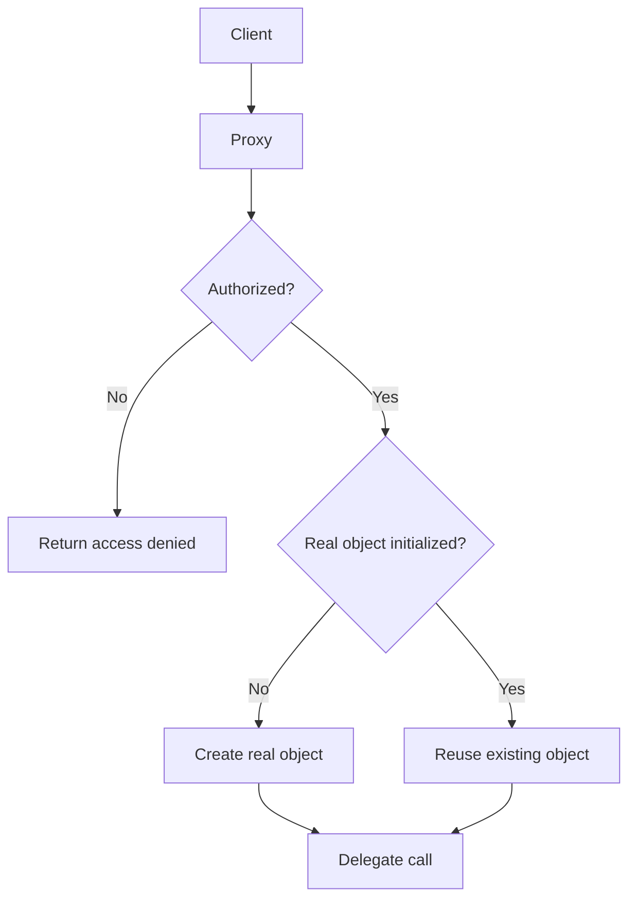
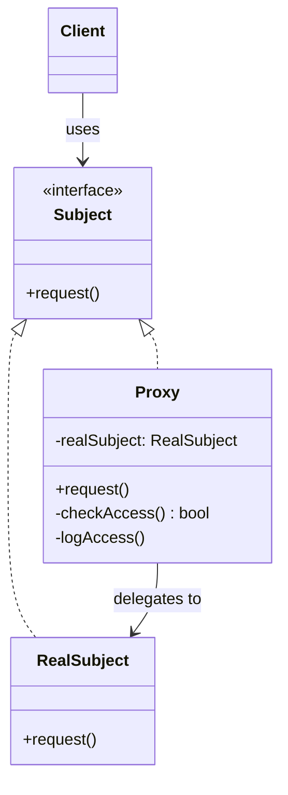
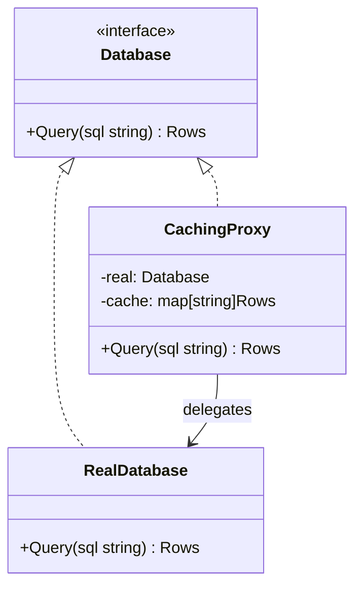
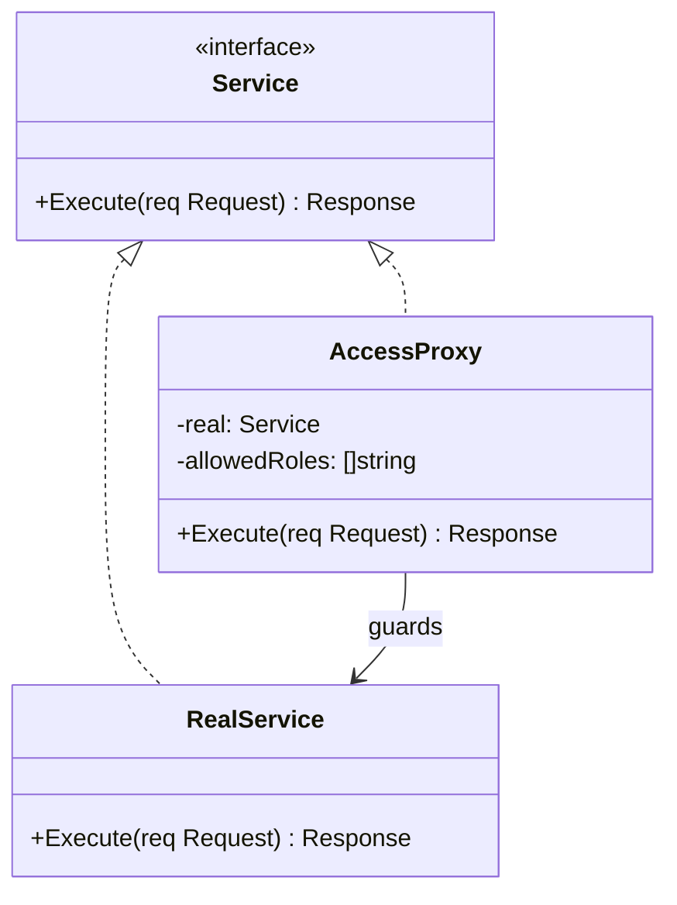
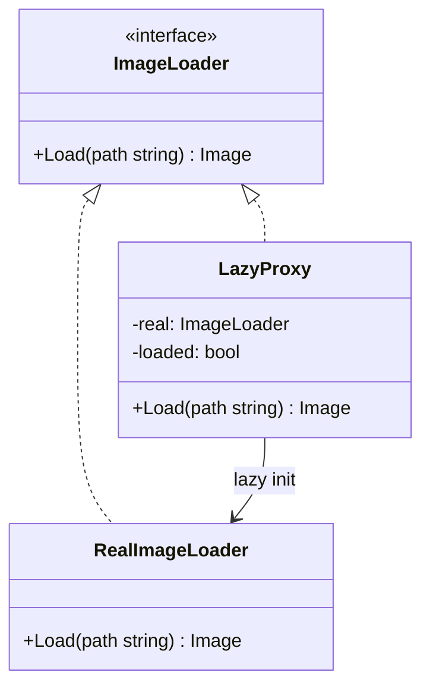

<!-- tags: design-pattern, structural, oop, proxy -->
# 🛡️ Proxy

> You possess a real object that costs a fortune to instantiate or poses immense danger if called directly. Sometimes you want to lazy-load it, sometimes you must block unauthorized access, and other times you need to cache its responses. If the client must handle these policies explicitly, you have failed to encapsulate the policy correctly.

📅 Created: 2026-03-19 · 🔄 Updated: 2026-04-02 · ⏱️ 20 min read

| Aspect | Detail |
| ------ | ------ |
| **Group** | Structural |
| **Purpose** | Control access to another object through an identical interface |
| **Go idiom** | Interface wrappers, lazy initialization with `sync.Once` |
| **SOLID** | Open/Closed, Single Responsibility |
| **Confused with** | Decorator, Adapter |

---

## 1. DEFINE

You must invoke an expensive or sensitive dependency: a remote service, a lazy-loaded object, or a tightly guarded resource. The caller simply wants to use the old interface, but the system demands a middle layer to block, cache, or delay the actual invocation.

Proxy and Decorator look similar on the surface: both wrap another object and expose the same interface to the client. The hallmark of a Proxy is **control**, not enhancement. Proxies typically appear when the target object:

- Costs too much to initialize immediately.
- Requires authorization before execution.
- Exists remotely and demands a local stand-in.
- Permits caching to minimize hits to the real object.

The `Proxy` presents the same contract to the client but intercepts the call to decide if, when, and how the real target gets created or invoked.

Core insight: **A Proxy acts as a stand-in for the real object and strictly governs the right to touch it.**

### 1.1 Common Proxy Types

| Type | Goal |
| ---- | -------- |
| **Virtual Proxy** | Lazy initialization |
| **Protection Proxy** | Access control |
| **Caching Proxy** | Response caching |
| **Remote Proxy** | Stand-in for an object in another process/network |

### 1.2 Proxy vs Decorator

| Pattern | Primary Intent | Target Lifecycle |
| ------- | ------------ | ---------------- |
| **Proxy** | Controls access and lifecycles | Often creates or delays creating the target |
| **Decorator** | Adds behavior around the target | Assumes the target already exists |

### 1.3 Failure Modes

- A proxy alters semantics so severely that the client can no longer rely on the original contract.
- A lazy proxy lacks thread safety, spawning multiple targets concurrently.
- A caching proxy fails to define clear invalidation strategies.

---

These failure modes sound basic. However, a trap exists. A lazy proxy without thread safety triggers race conditions. A caching proxy without invalidation serves stale data endlessly. This trap appears in PITFALLS.

## 2. VISUAL

Proxies and Decorators share many traits—identical interfaces and object wrapping. The difference lies entirely in intent. The image below organizes the four most common Proxy variants.

### Overview — Four Proxy Types


*Figure: Virtual (lazy init), Protection (auth), Caching (performance), and Remote (network). All maintain the same interface, but their goal is control, not enhancement.*

### Level 1 — Access Control Boundary

```text
Client
  │
  ▼
Proxy
  ├── check auth
  ├── lazy init real object
  ├── return cached result if possible
  ▼
Real Subject
```

*Figure: The client calls the identical interface, but the proxy determines if, when, and how the call reaches the real object.*

### Level 2 — Virtual + Protection Flow



*Figure: A proxy can merge multiple policies into a single call path, but everything revolves around one goal: controlling access to the real subject.*

### UML — Proxy Class Structure



*The Subject interface declares the common operation. The RealSubject is the actual object. The Proxy implements the identical interface, retains a reference to the RealSubject, and governs access (lazy init, caching, logging, access control).*

---

## 3. CODE

The diagrams map boundaries. The code reveals how the `🛡️ Proxy` leverages interfaces and composition without leaking decisions to the caller.

### Example 1: Basic — Virtual Proxy for DB Connections

> **Goal**: Instantiate a database connection strictly upon the first actual query.



> **Approach**: `sync.Once` secures the lazy initialization.
> **Example**: The initial `Query()` call spawns the real DB; subsequent calls reuse it.
> **Complexity**: O(1) access overhead, plus the initialization cost exclusively on the first invocation.

```go
// lazy_db_proxy.go — Proxy Pattern: lazy initialization with the same interface
package proxydemo

import (
	"fmt"
	"sync"
)

type Database interface {
	Query(sql string) ([]string, error)
}

type PostgresDB struct {
	dsn string
}

func NewPostgresDB(dsn string) *PostgresDB {
	fmt.Println("connecting to", dsn)
	return &PostgresDB{dsn: dsn}
}

func (db *PostgresDB) Query(sql string) ([]string, error) {
	return []string{"row1", "row2"}, nil
}

type LazyDBProxy struct {
	dsn  string
	once sync.Once
	real *PostgresDB
}

func (p *LazyDBProxy) init() {
	p.once.Do(func() {
		p.real = NewPostgresDB(p.dsn)
	})
}

func (p *LazyDBProxy) Query(sql string) ([]string, error) {
	p.init()
	return p.real.Query(sql)
}
```
```typescript
// lazy_db_proxy.ts — Proxy Pattern: lazy initialization with the same interface
interface Database {
  query(sql: string): Promise<string[]>;
}

class PostgresDB implements Database {
  constructor(private readonly dsn: string) {
    console.log(`connecting to ${dsn}`);
  }
  async query(_sql: string): Promise<string[]> {
    return ["row1", "row2"];
  }
}

class LazyDBProxy implements Database {
  private real: PostgresDB | null = null;
  constructor(private readonly dsn: string) {}
  async query(sql: string): Promise<string[]> {
    if (!this.real) this.real = new PostgresDB(this.dsn);
    return this.real.query(sql);
  }
}
```
```java
// LazyDBProxy.java — Proxy Pattern: lazy initialization with the same interface
interface Database {
    java.util.List<String> query(String sql);
}
```
```rust
// lazy_db_proxy.rs — Proxy Pattern: lazy initialization with the same interface
trait Database {
    fn query(&mut self, sql: &str) -> Result<Vec<String>, String>;
}
```
```cpp
// lazy_db_proxy.cpp — Proxy Pattern: lazy initialization with the same interface
struct Database {
    virtual std::vector<std::string> query(const std::string& sql) = 0;
    virtual ~Database() = default;
};
```
```python
# lazy_db_proxy.py — Proxy Pattern: lazy initialization with the same interface
class Database:
    def query(self, sql: str) -> list[str]:
        raise NotImplementedError
```

Conclusion: Virtual Proxies prove valuable when the real object incurs massive initialization costs or when numerous requests never utilize it. If the target must always exist immediately, a lazy proxy simply obfuscates the flow.

Virtual proxies work well. However, access control demands a protection proxy. Let's block unauthorized calls.

### Example 2: Intermediate — Protection Proxy for Admin Reports

> **Goal**: Block unauthorized users before they touch the actual service.



> **Approach**: The proxy maintains the report service interface but checks roles preemptively.
> **Example**: Only an `admin` may execute `ExportAuditLogs`.
> **Complexity**: O(1) authorization check plus the real service execution cost.

```go
// protection_proxy.go — Proxy Pattern: enforce access policy before delegating
package protectionproxy

import "fmt"

type AuditReportService interface {
	ExportAuditLogs(userID string) (string, error)
}

type RealAuditReportService struct{}

func (RealAuditReportService) ExportAuditLogs(userID string) (string, error) {
	return "report-" + userID + ".csv", nil
}

type ProtectionProxy struct {
	role string
	next AuditReportService
}

func (p ProtectionProxy) ExportAuditLogs(userID string) (string, error) {
	if p.role != "admin" {
		return "", fmt.Errorf("access denied")
	}
	return p.next.ExportAuditLogs(userID)
}
```
```typescript
// protection_proxy.ts — Proxy Pattern: enforce access policy before delegating
interface AuditReportService {
  exportAuditLogs(userId: string): Promise<string>;
}

class RealAuditReportService implements AuditReportService {
  async exportAuditLogs(userId: string): Promise<string> {
    return `report-${userId}.csv`;
  }
}

class ProtectionProxy implements AuditReportService {
  constructor(private readonly role: string, private readonly next: AuditReportService) {}
  async exportAuditLogs(userId: string): Promise<string> {
    if (this.role !== "admin") throw new Error("access denied");
    return this.next.exportAuditLogs(userId);
  }
}
```
```java
// ProtectionProxy.java — Proxy Pattern: enforce access policy before delegating
interface AuditReportService {
    String exportAuditLogs(String userId) throws Exception;
}
```
```rust
// protection_proxy.rs — Proxy Pattern: enforce access policy before delegating
trait AuditReportService {
    fn export_audit_logs(&self, user_id: &str) -> Result<String, String>;
}
```
```cpp
// protection_proxy.cpp — Proxy Pattern: enforce access policy before delegating
struct AuditReportService {
    virtual std::string export_audit_logs(const std::string& user_id) = 0;
    virtual ~AuditReportService() = default;
};
```
```python
# protection_proxy.py — Proxy Pattern: enforce access policy before delegating
class AuditReportService:
    def export_audit_logs(self, user_id: str) -> str:
        raise NotImplementedError
```

> **Why?** Protection Proxies deliver immense value when the policy dictating "can this target be called?" demands isolation as a distinct concern. If the real service constantly mixes business logic with access policies across all methods, the authorization boundary becomes untestable and inseparable.

Conclusion: If the central issue revolves around access rights or the target's lifecycle, a Proxy represents a superior model over a Decorator.

Protection proxies work well. However, performance requires caching. Let's cache responses.

### Example 3: Advanced — Caching Proxy for Catalogs

> **Goal**: Minimize hits to the catalog service while preserving the exact interface.



> **Approach**: The proxy caches results by key and delegates to the target upon a cache miss.
> **Example**: `GetProduct("SKU-1")` returns instantly from the cache on subsequent calls.
> **Complexity**: O(1) cache lookup plus the target execution cost upon misses.

```go
// caching_proxy.go — Proxy Pattern: same contract, different access policy
package cachingproxy

type CatalogService interface {
	GetProduct(sku string) (string, error)
}

type RealCatalogService struct{}

func (RealCatalogService) GetProduct(sku string) (string, error) {
	return "product:" + sku, nil
}

type CachingProxy struct {
	next  CatalogService
	cache map[string]string
}

func NewCachingProxy(next CatalogService) *CachingProxy {
	return &CachingProxy{next: next, cache: map[string]string{}}
}

func (p *CachingProxy) GetProduct(sku string) (string, error) {
	if value, ok := p.cache[sku]; ok {
		return value, nil
	}
	value, err := p.next.GetProduct(sku)
	if err != nil {
		return "", err
	}
	p.cache[sku] = value
	return value, nil
}
```
```typescript
// caching_proxy.ts — Proxy Pattern: same contract, different access policy
interface CatalogService {
  getProduct(sku: string): Promise<string>;
}

class RealCatalogService implements CatalogService {
  async getProduct(sku: string): Promise<string> {
    return `product:${sku}`;
  }
}

class CachingProxy implements CatalogService {
  private cache = new Map<string, string>();
  constructor(private readonly next: CatalogService) {}
  async getProduct(sku: string): Promise<string> {
    const cached = this.cache.get(sku);
    if (cached) return cached;
    const value = await this.next.getProduct(sku);
    this.cache.set(sku, value);
    return value;
  }
}
```
```java
// CachingProxy.java — Proxy Pattern: same contract, different access policy
interface CatalogService {
    String getProduct(String sku) throws Exception;
}
```
```rust
// caching_proxy.rs — Proxy Pattern: same contract, different access policy
trait CatalogService {
    fn get_product(&mut self, sku: &str) -> Result<String, String>;
}
```
```cpp
// caching_proxy.cpp — Proxy Pattern: same contract, different access policy
struct CatalogService {
    virtual std::string get_product(const std::string& sku) = 0;
    virtual ~CatalogService() = default;
};
```
```python
# caching_proxy.py — Proxy Pattern: same contract, different access policy
class CatalogService:
    def get_product(self, sku: str) -> str:
        raise NotImplementedError
```

> **Why?** The Caching Proxy highlights a crucial truth: the client remains utterly ignorant of whether data originates from the real object or a cache, provided the contract holds. This constitutes the architectural value of the Proxy.

Conclusion: Advanced Proxies excel at lazy initialization, protection, remote calls, and caching. If your wrapper predominantly adds logging or metrics without dictating access rights to the target, you likely require a Decorator instead of a Proxy.

---

You observed virtual, protection, and caching proxies. The danger now comes from race condition initializations and stale caches. We set up these traps earlier.

## 4. PITFALLS

The `🛡️ Proxy` routinely suffers misunderstanding. The pattern remains in the code, but it loses the boundary it promises. These pitfalls explain why.

| # | Severity | Error | Consequence | Fix |
|---|----------|-----|---------|-----|
| 1 | 🔴 Fatal | Lazy proxies lack thread safety | Spawning multiple real objects concurrently | Employ `sync.Once` or equivalent synchronization guards |
| 2 | 🔴 Fatal | Caching proxies lack an invalidation strategy | Stale data persists indefinitely, causing logic bugs | Define explicit TTLs and invalidation rules |
| 3 | 🟡 Common | Proxies alter semantics beyond the original contract | Clients suffer unexpected behavioral shifts | Strictly control access and lifecycles without fracturing the contract |
| 4 | 🟡 Common | Confusing the Proxy with the Decorator | Design boundaries misalign with objectives | Ask: is this wrapper controlling access, or merely enhancing behavior? |
| 5 | 🔵 Minor | Applying proxies to cheap, insensitive targets | Unnecessary indirection inflates the codebase | Use only when managing policies or lifecycles proves strictly necessary |

---

You navigated the Proxy pattern and its traps. The resources below provide deeper context.

## 5. REF

| Resource | Type | Link | Notes |
| -------- | ---- | ---- | ------- |
| Refactoring.Guru — Proxy | Pattern catalog | https://refactoring.guru/design-patterns/proxy | Key proxy variants |
| Go `sync.Once` | Official docs | https://pkg.go.dev/sync#Once | The bedrock for thread-safe virtual proxies |
| Fowler — Gateway/Remote patterns | Engineering reference | https://martinfowler.com/eaaCatalog/remoteFacade.html | Context on remote access control |

---

## 6. RECOMMEND

Proxies shine when targets are expensive, sensitive, or demand access policies. If a wrapper simply injects logs or metrics, use a Decorator. If a wrapper transforms an interface, use an Adapter.

| Explore | When to use | Reason | File/Link |
| ------- | ------- | ----- | --------- |
| Adapter | A wrapper must translate an interface | Translation differs from control | [01-adapter.md](./01-adapter.md) |
| Decorator | A wrapper retains the interface to inject behavior | Enhancement differs from access control | [02-decorator.md](./02-decorator.md) |
| Facade | A massive subsystem requires consolidation | Simplification differs from proxy policies | [04-facade.md](./04-facade.md) |

---

## 7. QUICK REF

| Signal | Might Proxy be the right choice? |
| ------ | ------------------- |
| You require lazy initialization or strict access control | ✅ Yes |
| You require a caching or remote stand-in | ✅ Yes |
| You solely wish to append metrics or logging | ⚠️ Frequently points to a Decorator |
| You must completely alter the interface | ❌ That requires an Adapter |

**Links**: [← Decorator](./02-decorator.md) · [→ Facade](./04-facade.md)
