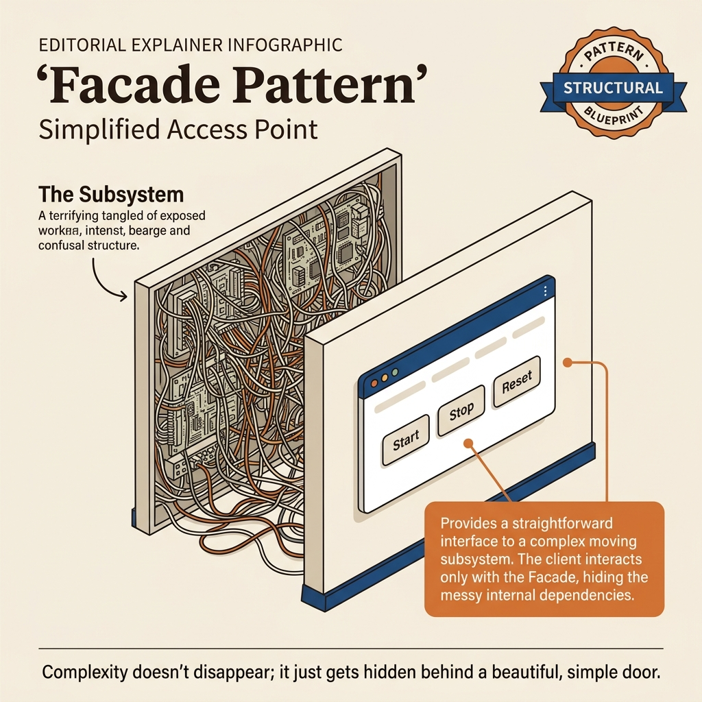
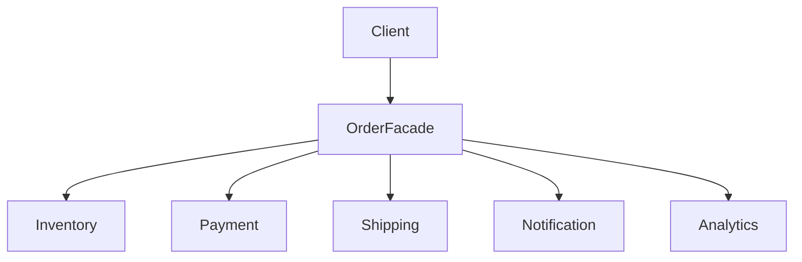
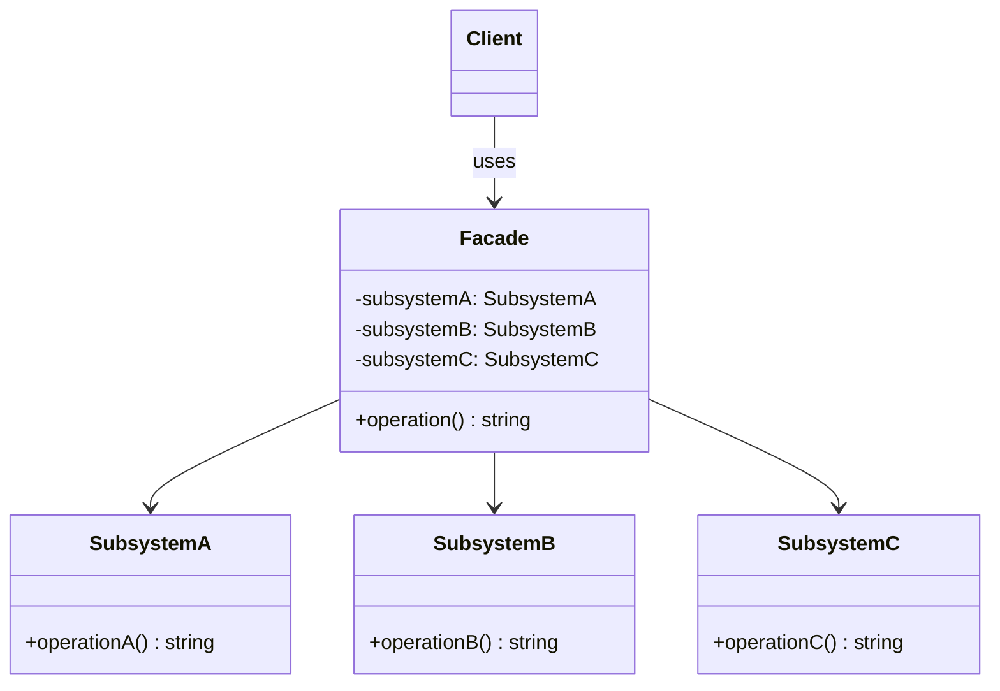
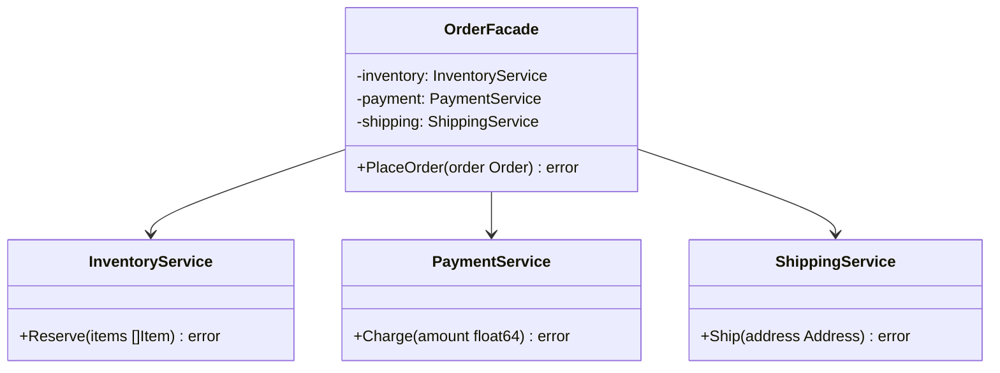
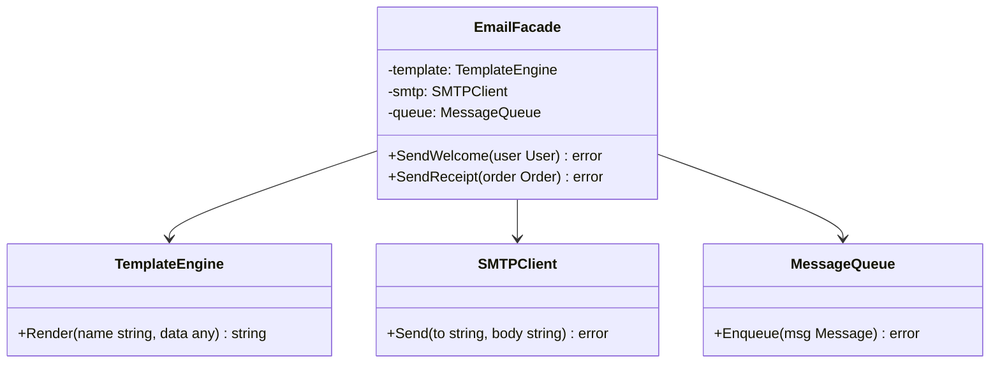
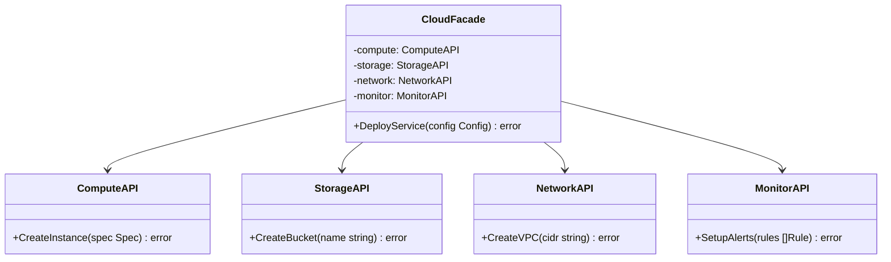

<!-- tags: design-pattern, structural, oop, facade -->
# 🏛️ Facade

> You execute a `PlaceOrder()` flow that must touch inventory, payment, shipment, notifications, and analytics. Each caller utilizing this flow must memorize the execution order, how to rollback individual steps, and which steps are critical versus best-effort. At this juncture, you do not lack services. The problem is that the subsystem complexity vastly exceeds what the client should ever know.

📅 Created: 2026-03-19 · 🔄 Updated: 2026-04-02 · ⏱️ 20 min read

| Aspect | Detail |
| ------ | ------ |
| **Group** | Structural |
| **Purpose** | Supply a simplified API for a highly complex subsystem |
| **Go idiom** | Service aggregators, application services, package-level orchestration |
| **SOLID** | Interface Segregation, Law of Demeter |
| **Confused with** | Adapter, Mediator |

---

## 1. DEFINE

Imagine a straightforward business use case that actually requires triggering three or four subsystems in an exact sequence: auth, inventory, payment, and notifications. If every caller must manually memorize this choreography, bugs arise not from complex logic, but from forgetting a microscopic step midway.

The Facade pattern applies when underlying subsystems function perfectly as isolated units, but **the client must not orchestrate them manually**. A client merely wishes to "place an order," "export a report," "onboard a tenant," or "bootstrap a project." If the client must manually string together 5 to 7 services in the correct sequence, the subsystem is leaking orchestration details outward.

`Facade` builds a simpler entry point for high-level operations. It does not delete the subsystem. It **stands in front of the subsystem** and declares: "If you want this capability, go through me. I know who to call and in what order."

Core insight: **A Facade reduces the caller's cognitive load by concealing orchestration complexity, not by changing the interface of each individual component.**

### 1.1 Vocabulary

| Concept | Role |
| --------- | ------- |
| **Facade** | A simplified entry point for the client |
| **Subsystem** | The collection of services or objects executing the actual work |
| **Client** | The caller demanding a high-level use case |

### 1.2 Facade vs Adapter vs Mediator

| Pattern | Primary Goal |
| ------- | -------- |
| **Facade** | Simplifies access to an entire subsystem |
| **Adapter** | Translates interface A into interface B |
| **Mediator** | Coordinates complex, bidirectional interactions among peers |

### 1.3 When to use

- A use case demands invoking numerous services in a strict sequence.
- Multiple callers aggressively copy-paste identical orchestration logic.
- The team requires a cleaner, more concise public API for a tangled subsystem.

### 1.4 Failure Modes

- The facade mutates into a God object hoarding the entire system's business logic.
- The facade conceals too much, blocking access to necessary advanced use cases.
- The client remains burdened with excessive subsystem details even after introducing the facade.

---

These failure modes sound avoidable. However, a trap exists. A facade evolving into a God object centralizes coupling disastrously. A client forced to memorize subsystem sequences renders the facade meaningless. This trap appears in PITFALLS.

## 2. VISUAL

Facade sounds like generic advice. Without a clear before/after comparison, you easily mistake a Facade for an Adapter or Mediator. The image below delineates the boundary.

### Overview — Before vs After Facade



*Figure: Without a Facade, the client manually invokes 5 services. With a Facade, the client invokes 1 method, and the orchestration occurs entirely inside.*

### Level 1 — Before vs After

```text
Without Facade:                   With Facade:
Client                            Client
  ├── Inventory.Check()             │
  ├── Payment.Charge()              └── OrderFacade.PlaceOrder()
  ├── Shipping.Create()                    ├── check inventory
  ├── Notify.Send()                        ├── charge payment
  └── Analytics.Track()                    ├── create shipment
                                           └── notify + analytics
```

*Figure: A Facade does not replace the subsystem. It alters the location of the orchestration logic.*

### Level 2 — Orchestration Boundary



*Figure: The client sees only a high-level boundary. The dependency fan-out remains isolated inside the facade.*

### UML — Facade Class Structure



*The Facade provides a simplified interface to a complex subsystem. The client strictly calls the Facade, remaining entirely ignorant of how Subsystems A, B, and C interact.*

---

## 3. CODE

The diagrams map boundaries. The code reveals how the `🏛️ Facade` leverages interfaces and composition without leaking decisions to the caller.

### Example 1: Basic — Order Facade

> **Goal**: Consolidate multiple order flow services behind a single `PlaceOrder` method.



> **Approach**: The facade handles orchestration while the subsystems maintain independent existence.
> **Example**: inventory → payment → shipping → notify.
> **Complexity**: O(s) where `s` is the number of subsystem calls within the flow.

```go
// order_facade.go — Facade Pattern: one entry point for a multi-service order flow
package facadeorder

import "fmt"

type InventoryService struct{}
func (InventoryService) Check(productID string, qty int) error { return nil }
func (InventoryService) Reserve(productID string, qty int) error { return nil }

type PaymentService struct{}
func (PaymentService) Charge(customerID string, amount float64) (string, error) {
	return fmt.Sprintf("tx-%s", customerID), nil
}

type ShippingService struct{}
func (ShippingService) Create(orderID string, address string) (string, error) {
	return "ship-" + orderID, nil
}

type NotificationService struct{}
func (NotificationService) Send(email, subject string) error { return nil }

type OrderRequest struct {
	CustomerID string
	Email      string
	ProductID  string
	Quantity   int
	Amount     float64
	Address    string
}

type OrderResult struct {
	OrderID    string
	TxID       string
	TrackingID string
}

type OrderFacade struct {
	inventory    InventoryService
	payment      PaymentService
	shipping     ShippingService
	notification NotificationService
}

func (f OrderFacade) PlaceOrder(req OrderRequest) (*OrderResult, error) {
	if err := f.inventory.Check(req.ProductID, req.Quantity); err != nil {
		return nil, err
	}
	if err := f.inventory.Reserve(req.ProductID, req.Quantity); err != nil {
		return nil, err
	}
	txID, err := f.payment.Charge(req.CustomerID, req.Amount)
	if err != nil {
		return nil, err
	}
	orderID := "ord-" + req.CustomerID
	trackingID, err := f.shipping.Create(orderID, req.Address)
	if err != nil {
		return nil, err
	}
	_ = f.notification.Send(req.Email, "Order confirmed")
	return &OrderResult{OrderID: orderID, TxID: txID, TrackingID: trackingID}, nil
}
```
```typescript
// order_facade.ts — Facade Pattern: one entry point for a multi-service order flow
class InventoryService {
  check(_productId: string, _qty: number): void {}
  reserve(_productId: string, _qty: number): void {}
}

class PaymentService {
  charge(customerId: string, _amount: number): string { return `tx-${customerId}`; }
}

class ShippingService {
  create(orderId: string, _address: string): string { return `ship-${orderId}`; }
}

class NotificationService {
  send(_email: string, _subject: string): void {}
}
```
```java
// OrderFacade.java — Facade Pattern: one entry point for a multi-service order flow
final class InventoryService {
    void check(String productId, int qty) {}
    void reserve(String productId, int qty) {}
}
```
```rust
// order_facade.rs — Facade Pattern: one entry point for a multi-service order flow
struct InventoryService;
impl InventoryService {
    fn check(&self, _product_id: &str, _qty: u32) -> Result<(), String> { Ok(()) }
    fn reserve(&self, _product_id: &str, _qty: u32) -> Result<(), String> { Ok(()) }
}
```
```cpp
// order_facade.cpp — Facade Pattern: one entry point for a multi-service order flow
struct InventoryService {
    void check(const std::string&, int) {}
    void reserve(const std::string&, int) {}
};
```
```python
# order_facade.py — Facade Pattern: one entry point for a multi-service order flow
class InventoryService:
    def check(self, product_id: str, qty: int) -> None: ...
    def reserve(self, product_id: str, qty: int) -> None: ...
```

Conclusion: Basic Facades excel when callers only care about high-level use cases and wish to ignore the underlying subsystem calls.

Order facades work well. However, onboarding demands multi-subsystem orchestration. Let's group them.

### Example 2: Intermediate — Onboarding Facade

> **Goal**: Merge tenant creation, RBAC seeding, plan assignment, and welcome emails into an identical workflow.



> **Approach**: The facade dictates business orchestration for onboarding.
> **Example**: `OnboardTenant()` executes multiple steps in a standardized sequence.
> **Complexity**: O(s) scaled by the number of subsystem steps.

```go
// onboarding_facade.go — Facade Pattern: consistent tenant onboarding workflow
package tenantfacade

type TenantStore struct{}
func (TenantStore) CreateTenant(name string) (string, error) { return "tenant-" + name, nil }

type RoleSeeder struct{}
func (RoleSeeder) SeedDefaultRoles(tenantID string) error { return nil }

type PlanService struct{}
func (PlanService) AssignStarterPlan(tenantID string) error { return nil }

type Mailer struct{}
func (Mailer) SendWelcome(ownerEmail string) error { return nil }

type OnboardingFacade struct {
	store  TenantStore
	roles  RoleSeeder
	plans  PlanService
	mailer Mailer
}

func (f OnboardingFacade) OnboardTenant(name, ownerEmail string) (string, error) {
	tenantID, err := f.store.CreateTenant(name)
	if err != nil { return "", err }
	if err := f.roles.SeedDefaultRoles(tenantID); err != nil { return "", err }
	if err := f.plans.AssignStarterPlan(tenantID); err != nil { return "", err }
	if err := f.mailer.SendWelcome(ownerEmail); err != nil { return "", err }
	return tenantID, nil
}
```
```typescript
// onboarding_facade.ts — Facade Pattern: consistent tenant onboarding workflow
class OnboardingFacade {
  async onboardTenant(name: string, ownerEmail: string): Promise<string> {
    const tenantId = `tenant-${name}`;
    void ownerEmail;
    return tenantId;
  }
}
```
```java
// OnboardingFacade.java — Facade Pattern: consistent tenant onboarding workflow
final class OnboardingFacade {
    String onboardTenant(String name, String ownerEmail) {
        return "tenant-" + name;
    }
}
```
```rust
// onboarding_facade.rs — Facade Pattern: consistent tenant onboarding workflow
struct OnboardingFacade;
impl OnboardingFacade {
    fn onboard_tenant(&self, name: &str, _owner_email: &str) -> Result<String, String> {
        Ok(format!("tenant-{}", name))
    }
}
```
```cpp
// onboarding_facade.cpp — Facade Pattern: consistent tenant onboarding workflow
struct OnboardingFacade {
    std::string onboard_tenant(const std::string& name, const std::string&) {
        return "tenant-" + name;
    }
};
```
```python
# onboarding_facade.py — Facade Pattern: consistent tenant onboarding workflow
class OnboardingFacade:
    def onboard_tenant(self, name: str, owner_email: str) -> str:
        _ = owner_email
        return f"tenant-{name}"
```

> **Why?** Facades demonstrate immense power when numerous callers replicate the exact same choreography. When onboarding flow resides inside a facade, policies governing step sequence and default setups require modification in only one location.

Conclusion: Intermediate Facades serve as exceptional tools for preventing orchestration logic from copy-pasting across controllers, cron jobs, and administrative tools.

Onboarding flows work smoothly. However, read-only analytics require a separate facade. Let's decouple them.

### Example 3: Advanced — Read-Only Analytics Facade across Subsystems

> **Goal**: Forge a compact read-model API for dashboards without forcing the UI to query each subsystem individually.



> **Approach**: The facade aggregates multiple query sources and emits a unified, aggregate view.
> **Example**: A dashboard summary incorporating orders, refunds, and active users.
> **Complexity**: O(s) reflecting the number of query sources.

```go
// analytics_facade.go — Facade Pattern: aggregate read models from multiple sources
package analyticsfacade

type OrdersReadModel struct{}
func (OrdersReadModel) RevenueToday() float64 { return 18250 }

type RefundsReadModel struct{}
func (RefundsReadModel) RefundRate() float64 { return 0.023 }

type UsersReadModel struct{}
func (UsersReadModel) ActiveUsers24h() int { return 941 }

type Summary struct {
	RevenueToday  float64
	RefundRate    float64
	ActiveUsers24h int
}

type DashboardFacade struct {
	orders  OrdersReadModel
	refunds RefundsReadModel
	users   UsersReadModel
}

func (f DashboardFacade) Summary() Summary {
	return Summary{
		RevenueToday:  f.orders.RevenueToday(),
		RefundRate:    f.refunds.RefundRate(),
		ActiveUsers24h: f.users.ActiveUsers24h(),
	}
}
```
```typescript
// analytics_facade.ts — Facade Pattern: aggregate read models from multiple sources
type Summary = { revenueToday: number; refundRate: number; activeUsers24h: number };
class DashboardFacade {
  summary(): Summary {
    return { revenueToday: 18250, refundRate: 0.023, activeUsers24h: 941 };
  }
}
```
```java
// AnalyticsFacade.java — Facade Pattern: aggregate read models from multiple sources
record Summary(double revenueToday, double refundRate, int activeUsers24h) {}
final class DashboardFacade {
    Summary summary() { return new Summary(18250, 0.023, 941); }
}
```
```rust
// analytics_facade.rs — Facade Pattern: aggregate read models from multiple sources
struct Summary {
    revenue_today: f64,
    refund_rate: f64,
    active_users_24h: i32,
}
```
```cpp
// analytics_facade.cpp — Facade Pattern: aggregate read models from multiple sources
struct Summary {
    double revenue_today;
    double refund_rate;
    int active_users_24h;
};
```
```python
# analytics_facade.py — Facade Pattern: aggregate read models from multiple sources
from dataclasses import dataclass


@dataclass
class Summary:
    revenue_today: float
    refund_rate: float
    active_users_24h: int
```

> **Why?** A true analytics facade does more than just "call a few services on your behalf." It crafts a read API possessing the exact shape the caller desires. This distinguishes a highly valuable facade from a useless pass-through service.

Conclusion: Advanced Facades perfectly fit dashboards, onboarding processes, exports, and checkouts. If your facade starts hoarding every policy across the entire domain, you are stumbling toward a god-service anti-pattern.

---

You observed order, onboarding, and analytics facades. The danger now comes from God objects and leaking subsystems. We set up these traps earlier.

## 4. PITFALLS

The `🏛️ Facade` routinely suffers misunderstanding. The pattern remains in the code, but it loses the boundary it promises. These pitfalls explain why.

| # | Severity | Error | Consequence | Fix |
|---|----------|-----|---------|-----|
| 1 | 🔴 Fatal | The facade balloons into a God object absorbing every use case | Coupling centralizes catastrophically, destroying maintainability | Dedicate each facade to a clear, specific boundary or use case family |
| 2 | 🔴 Fatal | Clients still must memorize detailed subsystem sequences | The facade loses all meaning and value | Push genuine orchestration entirely inside the facade |
| 3 | 🟡 Common | The facade over-hides, blocking entry to crucial advanced use cases | Callers become hopelessly constrained by overly rigid APIs | Use the facade as a simple entry point without sealing off detailed APIs when genuinely required |
| 4 | 🟡 Common | Confusing the Facade with an Adapter | Designing toward the incorrect objective | Ask: are you simplifying a subsystem, or translating an interface? |
| 5 | 🔵 Minor | Creating a facade for trivially small flows with only 1 or 2 simple calls | Injecting layers of useless indirection | Introduce facades exclusively when coordination complexity justifies it |

---

You navigated the Facade pattern and its traps. The resources below provide deeper context.

## 5. REF

| Resource | Type | Link | Notes |
| -------- | ---- | ---- | ------- |
| Refactoring.Guru — Facade | Pattern catalog | https://refactoring.guru/design-patterns/facade | Canonical description of the pattern |
| Fowler — Gateway | Engineering reference | https://martinfowler.com/eaaCatalog/gateway.html | Relates to boundary access simplification |
| Effective Go | Official docs | https://go.dev/doc/effective_go | Composition and package boundaries within Go |

---

## 6. RECOMMEND

Facades decisively shrink the caller's cognitive load. If the core pain point is interface translation or modeling part-whole trees, alternative patterns suit you better.

| Explore | When to use | Reason | File/Link |
| ------- | ------- | ----- | --------- |
| Adapter | The problem revolves around a 1:1 interface mismatch | Translation diverges fundamentally from simplification | [01-adapter.md](./01-adapter.md) |
| Composite | The problem centers on part-whole tree hierarchies | Tree traversals differ drastically from service orchestration | [05-composite.md](./05-composite.md) |
| Bridge | Abstractions and implementations multiply against each other | M×N separation has nothing to do with subsystem APIs | [06-bridge.md](./06-bridge.md) |

---

## 7. QUICK REF

| Signal | Might Facade be the right choice? |
| ------ | -------------------- |
| A use case forces you to call multiple subsystems in strict sequence | ✅ Yes |
| Multiple callers aggressively copy-paste identical orchestration | ✅ Yes |
| You merely need to translate interface A into interface B | ❌ That demands an Adapter |
| You need an object hub coordinating bidirectional peer communication | ❌ That demands a Mediator |

**Links**: [← Proxy](./03-proxy.md) · [→ Composite](./05-composite.md)
