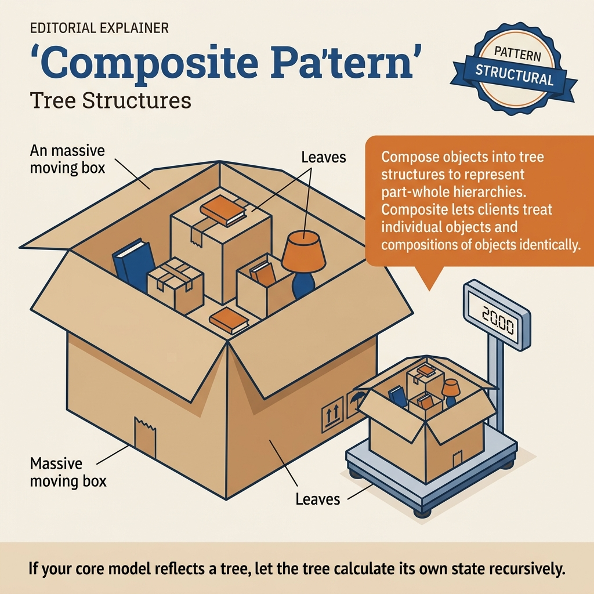
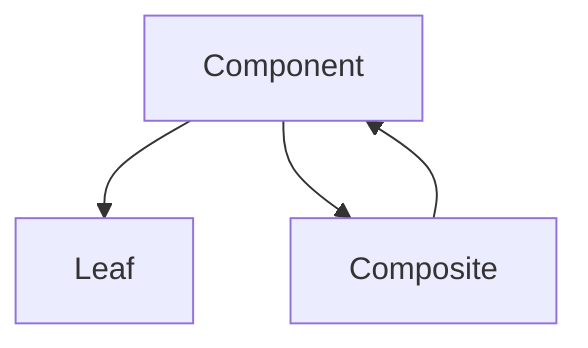
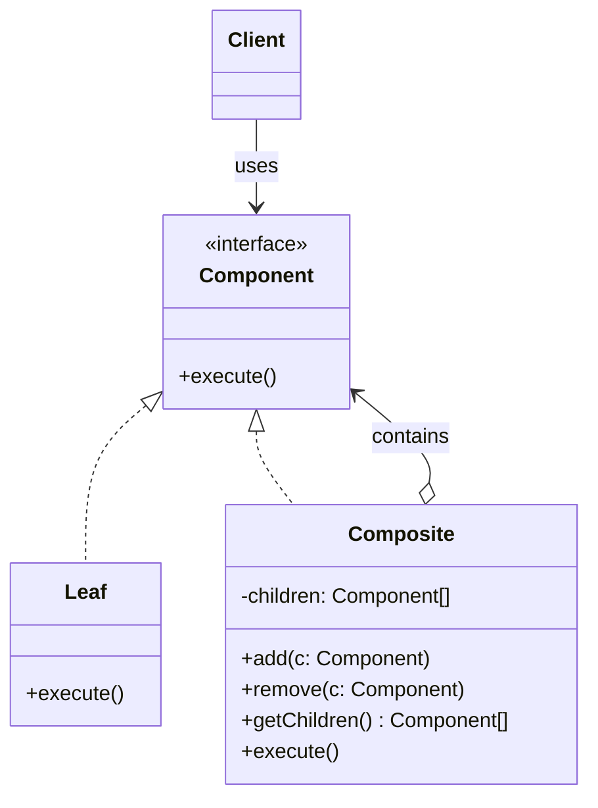
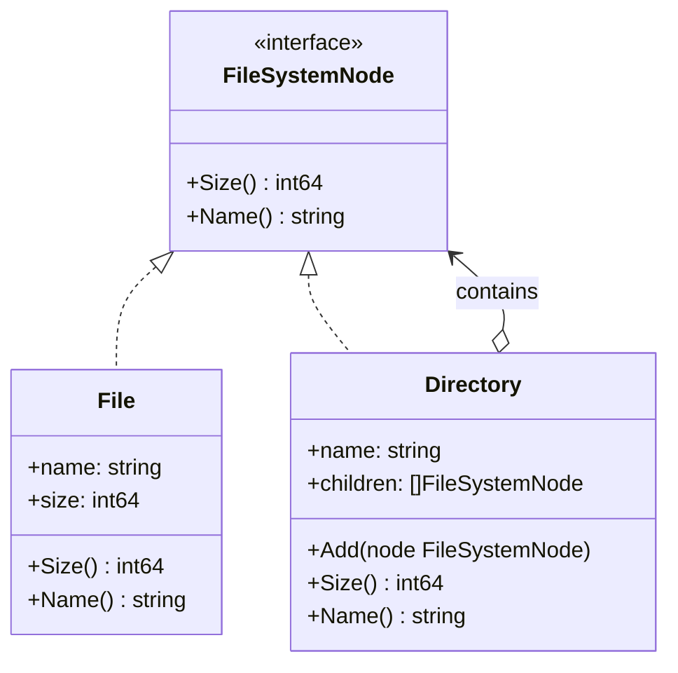
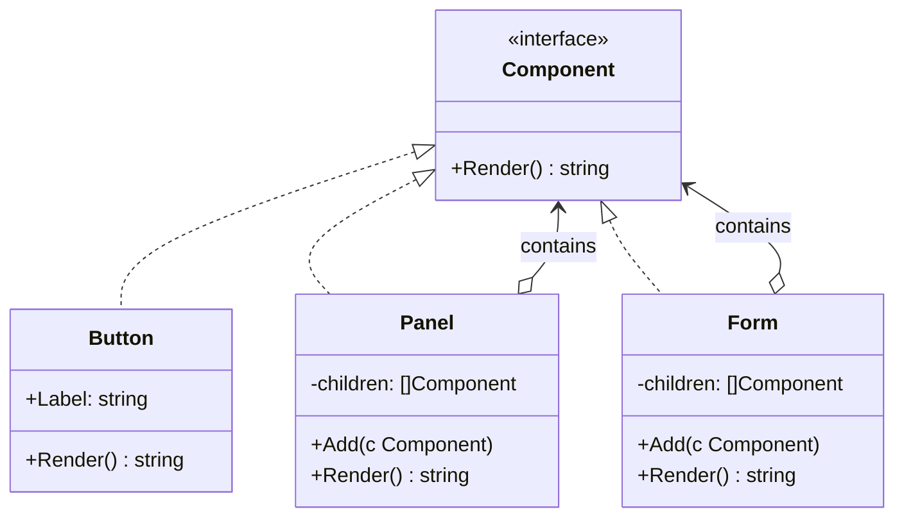
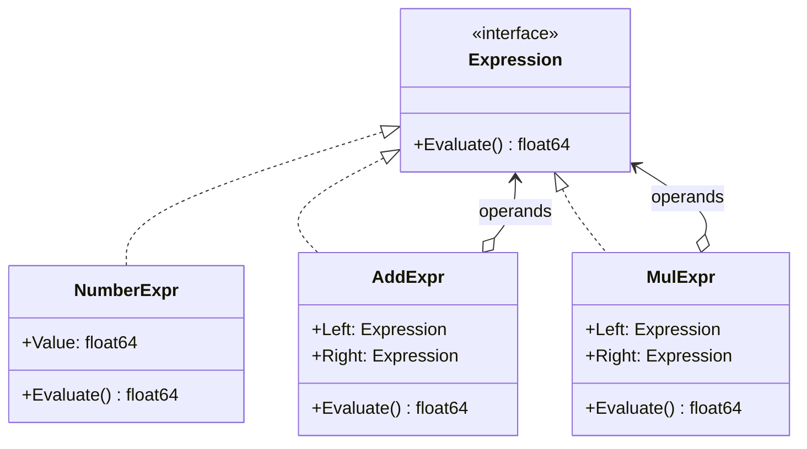

<!-- tags: design-pattern, structural, oop, composite -->
# 🌳 Composite

> You possess a menu containing items and submenus, folders containing files and subfolders, or a dashboard loaded with widgets and nested sections. If every tree traversal forces you to write `if isLeaf`, `if isFolder`, or `if isPanel`, your code no longer processes a tree. It processes node types.

📅 Created: 2026-03-19 · 🔄 Updated: 2026-04-02 · ⏱️ 20 min read

| Aspect | Detail |
| ------ | ------ |
| **Group** | Structural |
| **Purpose** | Treat singular objects and grouped objects uniformly through the identical interface |
| **Go idiom** | Recursive interfaces, tree traversals, filesystem-like APIs |
| **SOLID** | Open/Closed, Liskov Substitution |
| **Confused with** | Decorator |

---

## 1. DEFINE

You must process a tree structure: folders holding files, categories holding subcategories, or menus holding nested nodes. If your code separates logic for leaves and branches at every turn, what should be an elegant tree shatters into countless special cases.

Composite acts as the pattern for **part-whole hierarchies**. Specifically, some objects stand alone (`Leaf`), while others contain multiple objects of the exact same type (`Composite`). The pain point is familiar: the client simply wants to invoke `Render()`, `Size()`, or `Search()` on both single nodes and parent nodes, but the tree structure forces the caller to branch logic based on specific types.

`Composite` resolves this by forcing both the leaf and the composite to honor a shared `Component` interface. The composite internally retains a list of `children`, which are also `Component` types. This allows operations to recurse naturally.

Core insight: **Composite transforms tree traversal into an innate behavior of the model, rather than a repetitive burden on every caller.**

### 1.1 Vocabulary

| Concept | Role |
| --------- | ------- |
| **Component** | The shared interface governing both leaf and composite |
| **Leaf** | A node completely devoid of children |
| **Composite** | A node housing a list of children honoring the same interface |

### 1.2 Composite vs Decorator

| Pattern | Structure |
| ------- | -------- |
| **Composite** | A tree: one node possesses multiple children |
| **Decorator** | A chain: one wrapper encompasses one target |

### 1.3 Failure Modes

- The shared interface forces leaves to implement methods that only make sense for composites (like `Add()`), resulting in nonsensical code.
- Tree mutation and traversal merge carelessly, rendering the model impossible to reason about.
- Clients continue executing `type switches` everywhere, utterly destroying the value of a unified interface.

---

These failure modes sound obvious. However, a trap exists. Forcing a leaf to implement `Add/Remove` twists the API into chaos. Clients resorting to type switches erase all benefits of uniform handling. This trap appears in PITFALLS.

## 2. VISUAL

Composite resembles Decorator because both wrap objects. However, a Composite builds a tree (1-to-many), whereas a Decorator builds a chain (1-to-1). The image below clarifies the three major roles.

### Overview — Component / Leaf / Composite



*Figure: Component serves as the shared interface. Leaves lack children. Composites hold lists of identically typed children. Clients ignore whether a node is a leaf or a composite.*

### Level 1 — Part-Whole Tree

```text
project/
├── src/
│   ├── main.go
│   └── util.go
└── README.md
```

*Figure: `project/` and `src/` act as composite nodes. `main.go`, `util.go`, and `README.md` act as leaf nodes.*

### Level 2 — Uniform Interface



*Figure: The Composite maintains references back to the `Component`. This allows the tree to expand recursively while the client only interacts with one interface.*

### UML — Composite Class Structure



*The Component interface declares operations shared across leaves and composites. Leaves execute the operation directly. Composites house children (both leaves and other composites) and execute the operation recursively.*

---

## 3. CODE

The diagrams map boundaries. The code reveals how the `🌳 Composite` leverages interfaces and composition without leaking decisions to the caller.

### Example 1: Basic — File System Tree

> **Goal**: Calculate `Size()` and trigger `Display()` for files and folders via an identical interface.



> **Approach**: `File` serves as the leaf; `Directory` serves as the composite holding children.
> **Example**: `project/` holds `src/` and `README.md`.
> **Complexity**: `Size()` runs at O(n) scaled by the underlying child nodes.

```go
// filesystem_composite.go — Composite Pattern: treat files and folders uniformly
package filesystemcomposite

import (
	"fmt"
	"strings"
)

type Node interface {
	Name() string
	Size() int64
	Display(indent int)
}

type File struct {
	name string
	size int64
}

func (f File) Name() string { return f.name }
func (f File) Size() int64  { return f.size }
func (f File) Display(indent int) {
	fmt.Printf("%s📄 %s (%d bytes)\n", strings.Repeat("  ", indent), f.name, f.size)
}

type Directory struct {
	name     string
	children []Node
}

func (d *Directory) Name() string { return d.name }
func (d *Directory) Size() int64 {
	var total int64
	for _, child := range d.children {
		total += child.Size()
	}
	return total
}
func (d *Directory) Display(indent int) {
	fmt.Printf("%s📁 %s (%d bytes)\n", strings.Repeat("  ", indent), d.name, d.Size())
	for _, child := range d.children {
		child.Display(indent + 1)
	}
}
func (d *Directory) Add(child Node) { d.children = append(d.children, child) }
```
```typescript
// filesystem_composite.ts — Composite Pattern: treat files and folders uniformly
interface Node {
  name(): string;
  size(): number;
  display(indent: number): void;
}
```
```java
// FileSystemComposite.java — Composite Pattern: treat files and folders uniformly
interface Node {
    String name();
    long size();
    void display(int indent);
}
```
```rust
// filesystem_composite.rs — Composite Pattern: treat files and folders uniformly
trait Node {
    fn name(&self) -> &str;
    fn size(&self) -> i64;
}
```
```cpp
// filesystem_composite.cpp — Composite Pattern: treat files and folders uniformly
struct Node {
    virtual std::string name() const = 0;
    virtual long long size() const = 0;
    virtual ~Node() = default;
};
```
```python
# filesystem_composite.py — Composite Pattern: treat files and folders uniformly
class Node:
    def name(self) -> str: raise NotImplementedError
    def size(self) -> int: raise NotImplementedError
```

Conclusion: Composites deliver the highest value when callers genuinely wish to execute operations uniformly across single and parent nodes.

File system trees work well. However, UI layouts demand nested rendering. Let's compose them.

### Example 2: Intermediate — UI Layout Tree

> **Goal**: Render a layout tree where panels house both widgets and sub-panels.



> **Approach**: Every node knows how to render itself. Composites render children recursively.
> **Example**: A dashboard section encapsulates a chart alongside nested sections.
> **Complexity**: O(n) scaled by the number of nodes within the rendered subtree.

```go
// ui_layout_composite.go — Composite Pattern: nested UI sections and widgets
package uicomposite

type View interface {
	Render() string
}

type TextWidget struct{ Value string }
func (w TextWidget) Render() string { return "<span>" + w.Value + "</span>" }

type Section struct {
	Title    string
	Children []View
}

func (s *Section) Add(child View) { s.Children = append(s.Children, child) }

func (s *Section) Render() string {
	output := "<section><h2>" + s.Title + "</h2>"
	for _, child := range s.Children {
		output += child.Render()
	}
	return output + "</section>"
}
```
```typescript
// ui_layout_composite.ts — Composite Pattern: nested UI sections and widgets
interface View { render(): string; }
class TextWidget implements View {
  constructor(private readonly value: string) {}
  render(): string { return `<span>${this.value}</span>`; }
}
```
```java
// UILayoutComposite.java — Composite Pattern: nested UI sections and widgets
interface View {
    String render();
}
```
```rust
// ui_layout_composite.rs — Composite Pattern: nested UI sections and widgets
trait View {
    fn render(&self) -> String;
}
```
```cpp
// ui_layout_composite.cpp — Composite Pattern: nested UI sections and widgets
struct View {
    virtual std::string render() const = 0;
    virtual ~View() = default;
};
```
```python
# ui_layout_composite.py — Composite Pattern: nested UI sections and widgets
class View:
    def render(self) -> str:
        raise NotImplementedError
```

> **Why?** Composites mesh perfectly with UI trees because layouts form natural part-whole hierarchies. If every parent had to decipher exactly which child widget or panel it held to render it, the tree model would hemorrhage its structural secrets far too early.

Conclusion: Intermediate Composites make UIs, menus, form schemas, and file trees vastly more intuitive when the domain model inherently assumes a tree shape.

UI layouts work smoothly. However, permission groups require recursive evaluations. Let's aggregate them.

### Example 3: Advanced — Permission Group Tree

> **Goal**: Represent nested permission sets while executing a recursive `Contains()` check through a single interface.



> **Approach**: Leaves represent singular permissions; composites represent permission groups.
> **Example**: An `admin` group holds `billing.read`, `billing.write`, and a nested `audit` group.
> **Complexity**: O(n) in the worst-case scenario, scaling with the traversed nodes.

```go
// permission_composite.go — Composite Pattern: recursive permission groups
package permissioncomposite

type PermissionNode interface {
	Contains(code string) bool
}

type Permission struct {
	Code string
}

func (p Permission) Contains(code string) bool { return p.Code == code }

type PermissionGroup struct {
	Name     string
	Children []PermissionNode
}

func (g *PermissionGroup) Add(child PermissionNode) {
	g.Children = append(g.Children, child)
}

func (g *PermissionGroup) Contains(code string) bool {
	for _, child := range g.Children {
		if child.Contains(code) {
			return true
		}
	}
	return false
}
```
```typescript
// permission_composite.ts — Composite Pattern: recursive permission groups
interface PermissionNode {
  contains(code: string): boolean;
}
```
```java
// PermissionComposite.java — Composite Pattern: recursive permission groups
interface PermissionNode {
    boolean contains(String code);
}
```
```rust
// permission_composite.rs — Composite Pattern: recursive permission groups
trait PermissionNode {
    fn contains(&self, code: &str) -> bool;
}
```
```cpp
// permission_composite.cpp — Composite Pattern: recursive permission groups
struct PermissionNode {
    virtual bool contains(const std::string& code) const = 0;
    virtual ~PermissionNode() = default;
};
```
```python
# permission_composite.py — Composite Pattern: recursive permission groups
class PermissionNode:
    def contains(self, code: str) -> bool:
        raise NotImplementedError
```

> **Why?** A permission tree acts as a superb production-grade example because the leaf and composite share absolute semantic parity from the caller's perspective: "Does this node contain permission X?". When shared semantics strike this deeply, Composite unleashes its maximum power.

Conclusion: Advanced Composites fit perfectly when the domain structurally relies on trees and primary operations easily map uniformly across both singular and composite nodes.

---

You observed file trees, UI layouts, and permission groups. The danger now comes from forced leaf methods and type switch leaks. We set up these traps earlier.

## 4. PITFALLS

The `🌳 Composite` routinely suffers misunderstanding. The pattern remains in the code, but it loses the boundary it promises. These pitfalls explain why.

| # | Severity | Error | Consequence | Fix |
|---|----------|-----|---------|-----|
| 1 | 🔴 Fatal | Forcing leaves to implement composite-only methods like `Add()` | The API warps, forcing leaves to panic or no-op | Limit the shared interface exclusively to operations that are genuinely common |
| 2 | 🔴 Fatal | Clients still employ `type switch` logic everywhere | The benefits of uniform handling evaporate | Push traversal logic firmly into the model and interface |
| 3 | 🟡 Common | Unintentionally mixing tree mutations with business traversals | The model becomes difficult to reason about and test | Detach mutation APIs from traversal APIs when complexity demands it |
| 4 | 🟡 Common | Applying Composite to structures that are not actual trees | The model feels forcibly warped and confusing | Reserve this pattern exclusively for genuine part-whole hierarchies |
| 5 | 🔵 Minor | Display/render recursion lacks a maximum depth guard | Output becomes hard to debug, risking stack overflow crashes | Enforce depth limits or deploy iterative traversals for massive trees |

---

You navigated the Composite pattern and its traps. The resources below provide deeper context.

## 5. REF

| Resource | Type | Link | Notes |
| -------- | ---- | ---- | ------- |
| Refactoring.Guru — Composite | Pattern catalog | https://refactoring.guru/design-patterns/composite | Canonical framework of the pattern |
| Go `io/fs` | Official docs | https://pkg.go.dev/io/fs | Prime example of tree-like traversal in Go |
| Effective Go | Official docs | https://go.dev/doc/effective_go | Interface design accommodating recursive models |

---

## 6. RECOMMEND

Composites shine relentlessly when the domain naturally forms a tree. If the structure escapes tree bounds, or you simply need a chain wrapper, other patterns fit much better.

| Explore | When to use | Reason | File/Link |
| ------- | ------- | ----- | --------- |
| Decorator | The pain point centers on 1-to-1 chain wrappers | Chains differ entirely from trees | [02-decorator.md](./02-decorator.md) |
| Facade | The pain point targets subsystem orchestration | Orchestration diverges sharply from tree traversal | [04-facade.md](./04-facade.md) |
| Bridge | Two dimensions of variation separate independently | M×N separation has no relation to part-whole trees | [06-bridge.md](./06-bridge.md) |

---

## 7. QUICK REF

| Signal | Might Composite be the right choice? |
| ------ | ----------------------- |
| The domain models a tree or a part-whole hierarchy | ✅ Yes |
| Callers demand uniform operations across both leaves and parents | ✅ Yes |
| You only possess one-to-one wrappers | ❌ That demands a Decorator |
| The structure does not actually represent a tree | ❌ Do not force it |

**Links**: [← Facade](./04-facade.md) · [→ Bridge](./06-bridge.md)
