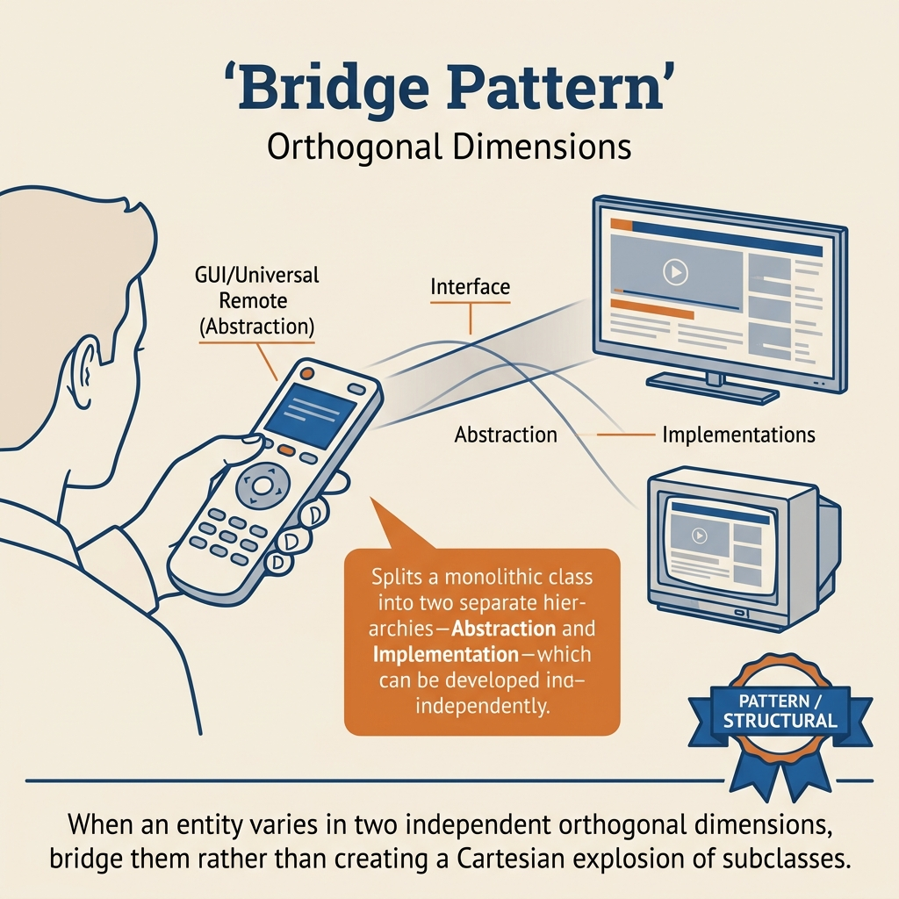
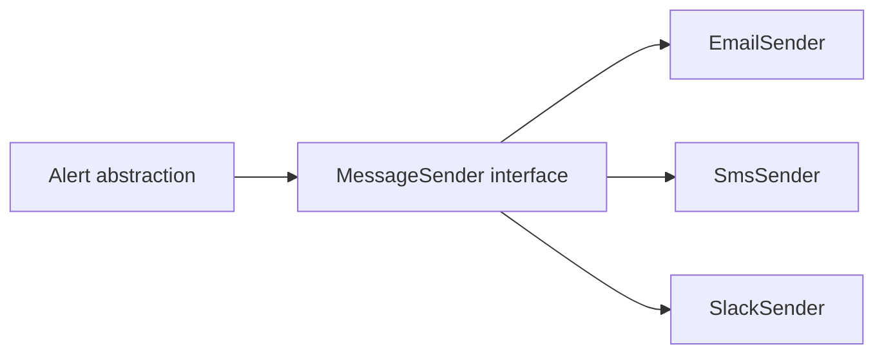
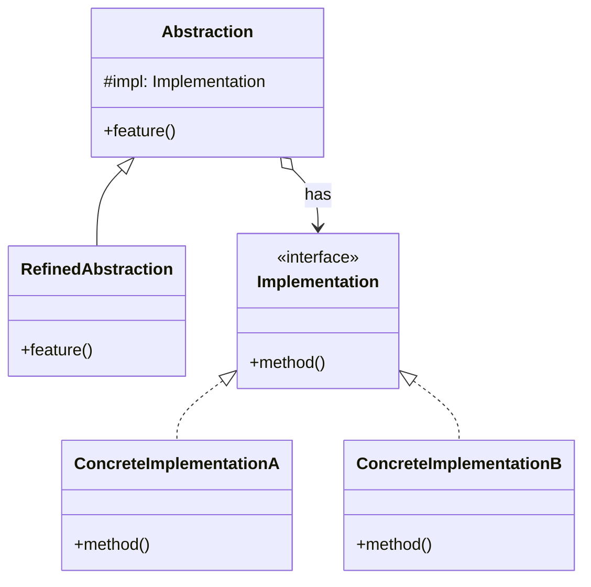
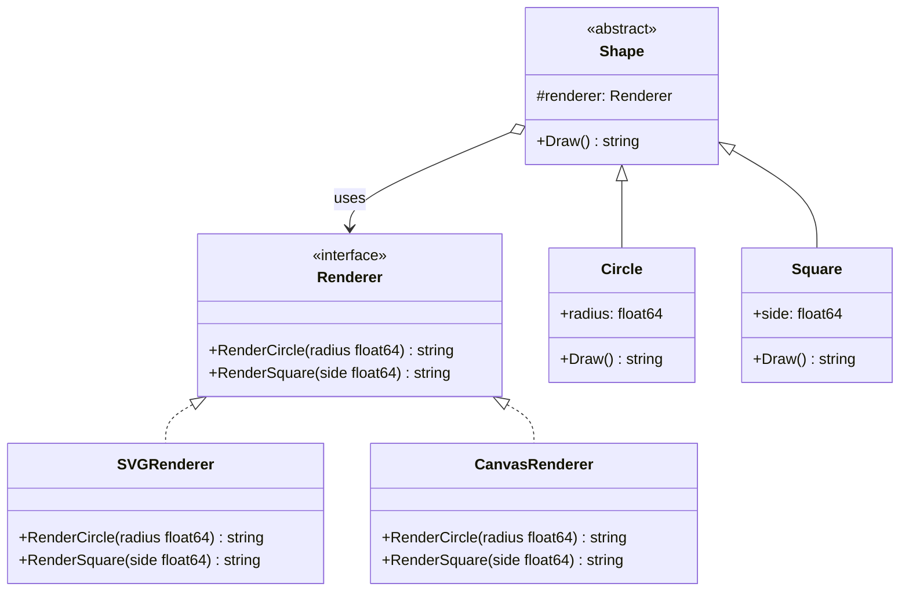
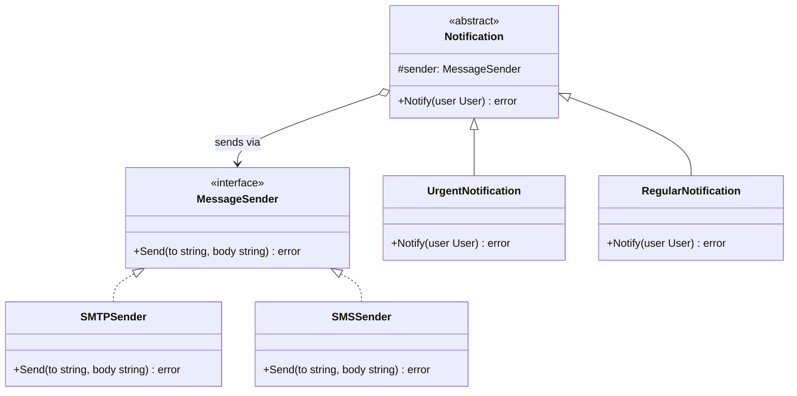
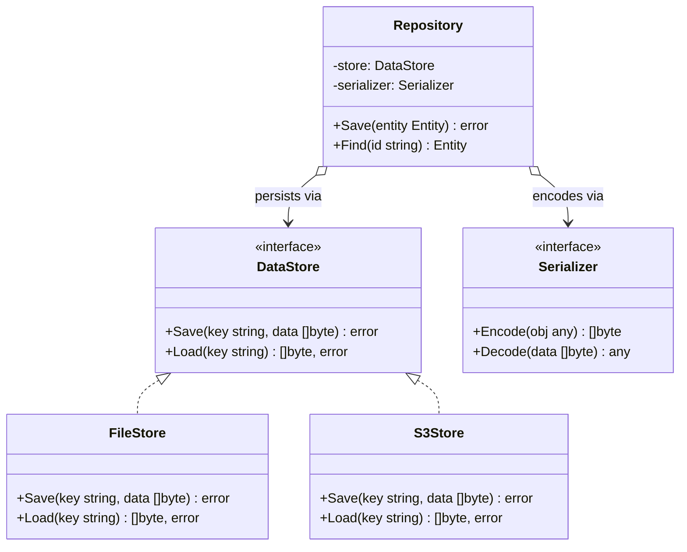

<!-- tags: design-pattern, structural, oop, bridge -->
# 🌉 Bridge

> You face two independent dimensions of variation expanding simultaneously: notification levels (`info`, `warning`, `critical`) and delivery channels (`email`, `sms`, `slack`). If every pair breeds a distinct class, the class count swells based on their multiplication. When you witness a matrix of classes forming, the Bridge pattern typically steps in to fix it.

📅 Created: 2026-03-19 · 🔄 Updated: 2026-04-02 · ⏱️ 21 min read

| Aspect | Detail |
| ------ | ------ |
| **Group** | Structural |
| **Purpose** | Detach an abstraction from its implementation so they can vary completely independently |
| **Go idiom** | Structs holding interface fields; composition over inheritance matrices |
| **SOLID** | Dependency Inversion, Open/Closed |
| **Confused with** | Adapter |

---

## 1. DEFINE

Imagine two independent axes of change. One axis represents the high-level "what" (abstraction), while the other dictates the low-level "how" (implementation). If each combination spawns a new concrete class or type, the system crashes into a class explosion long before the feature stabilizes.

The Bridge pattern emerges when you possess **two independent dimensions of change** but your current code cross-multiplies them. If every combo demands a new concrete class, the codebase will spiral out of control incredibly quickly.

`Bridge` rips those two axes into independent hierarchies and glues them together via composition. The abstraction maintains a reference to the implementation interface. Consequently, both sides can evolve independently without triggering a class matrix explosion.

Core insight: **Bridge conquers matrix explosion by turning `M × N` multiplication into `M + N` addition.**

### 1.1 Vocabulary

| Concept | Role |
| --------- | ------- |
| **Abstraction** | The high-level API exposed to the client |
| **Refined Abstraction** | High-level variants of the abstraction |
| **Implementation** | The interface dictating low-level behavior |
| **Concrete Implementation** | The specific execution logic behind the implementation |

### 1.2 Bridge vs Adapter

| Pattern | Context |
| ------- | -------- |
| **Bridge** | Designed entirely upfront to isolate two changing dimensions |
| **Adapter** | Retrofitted to resolve clashes between pre-existing, incompatible interfaces |

### 1.3 Failure Modes

- Forcing a Bridge when the two dimensions of change are not genuinely independent.
- Allowing the abstraction to leak concrete implementation details anyway.
- Using a Bridge as a pointless abstraction when only one dimension of variation exists.

---

These failure modes sound familiar. However, a trap exists. Forcing a Bridge onto a single dimension generates useless abstraction. Leaking details between hierarchies glues them together irreparably. This trap appears in PITFALLS.

## 2. VISUAL

Both Bridge and Adapter detach interfaces from implementations. The difference: Bridge is designed upfront to decouple two independent axes. Adapter retrofits a solution for a pre-existing mismatch. The image below contrasts `M × N` against `M + N`.

### Overview — Matrix Explosion vs Bridge



*Figure: Without Bridge = 9 classes (3×3). With Bridge = 6 classes (3+3). If only one dimension varies, Bridge acts as blatant over-engineering.*

### Level 1 — Matrix vs Bridge

```text
Without Bridge:
  InfoEmail, WarningEmail, CriticalEmail
  InfoSMS,   WarningSMS,   CriticalSMS
  InfoSlack, WarningSlack, CriticalSlack

With Bridge:
  Abstraction:      Implementation:
  InfoAlert         EmailSender
  WarningAlert      SMSSender
  CriticalAlert     SlackSender
```

*Figure: Bridge replaces exponential class multiplication with two independently expanding groups.*

### Level 2 — Composition Boundary



*Figure: The abstraction never communicates directly with concrete implementations. It speaks via the implementation interface, freeing both sides to evolve alone.*

### UML — Bridge Class Structure



*The Abstraction retains a reference to the Implementation interface. RefinedAbstractions extend the Abstraction. ConcreteImplementations fulfill the Implementation. Two independent hierarchies evolve seamlessly—this forms the bridge.*

---

## 3. CODE

The diagrams map boundaries. The code reveals how the `🌉 Bridge` leverages interfaces and composition without leaking decisions to the caller.

### Example 1: Basic — Alert Level × Message Channel

> **Goal**: Sever the alert level from the delivery channel.



> **Approach**: `Alert` retains the `MessageSender`. The refined abstraction handles title and urgency changes.
> **Example**: A `CriticalAlert` routes seamlessly through an `EmailSender` or `SlackSender`.
> **Complexity**: O(1) orchestration. The real execution cost resides within the channel sender.

```go
// alert_bridge.go — Bridge Pattern: separate alert semantics from delivery channel
package bridgealert

import "fmt"

type MessageSender interface {
	Send(to, title, body string) error
}

type EmailSender struct{}
func (EmailSender) Send(to, title, body string) error {
	fmt.Printf("email -> %s | %s | %s\n", to, title, body)
	return nil
}

type SlackSender struct{}
func (SlackSender) Send(to, title, body string) error {
	fmt.Printf("slack -> %s | %s | %s\n", to, title, body)
	return nil
}

type Alert struct {
	sender MessageSender
}

func (a Alert) Notify(to, title, body string) error {
	return a.sender.Send(to, title, body)
}

type CriticalAlert struct {
	Alert
}

func (a CriticalAlert) Notify(to, title, body string) error {
	return a.sender.Send(to, "CRITICAL: "+title, body)
}
```
```typescript
// alert_bridge.ts — Bridge Pattern: separate alert semantics from delivery channel
interface MessageSender {
  send(to: string, title: string, body: string): Promise<void>;
}
```
```java
// AlertBridge.java — Bridge Pattern: separate alert semantics from delivery channel
interface MessageSender {
    void send(String to, String title, String body) throws Exception;
}
```
```rust
// alert_bridge.rs — Bridge Pattern: separate alert semantics from delivery channel
trait MessageSender {
    fn send(&self, to: &str, title: &str, body: &str) -> Result<(), String>;
}
```
```cpp
// alert_bridge.cpp — Bridge Pattern: separate alert semantics from delivery channel
struct MessageSender {
    virtual void send(const std::string& to, const std::string& title, const std::string& body) = 0;
    virtual ~MessageSender() = default;
};
```
```python
# alert_bridge.py — Bridge Pattern: separate alert semantics from delivery channel
class MessageSender:
    def send(self, to: str, title: str, body: str) -> None:
        raise NotImplementedError
```

Conclusion: A Basic Bridge acts as an immediate remedy the moment you spot two independent dimensions spawning a class matrix.

Alerts crossing Channels work well. However, Reports crossing Exporters need separate axes. Let's split them.

### Example 2: Intermediate — Report Type × Export Engine

> **Goal**: Sever the report format from the file export engine.



> **Approach**: The report abstraction encompasses an `Exporter` implementation.
> **Example**: An `AuditReport` spits out a CSV or a PDF without requiring bloated cross-multiplied classes.
> **Complexity**: O(1) orchestration plus the actual rendering and exporting costs.

```go
// report_bridge.go — Bridge Pattern: separate report semantics from export engine
package bridgereport

type Exporter interface {
	Export(name string, payload []byte) (string, error)
}

type CSVExporter struct{}
func (CSVExporter) Export(name string, payload []byte) (string, error) {
	return name + ".csv", nil
}

type PDFExporter struct{}
func (PDFExporter) Export(name string, payload []byte) (string, error) {
	return name + ".pdf", nil
}

type Report struct {
	exporter Exporter
}

func (r Report) Run(name string, payload []byte) (string, error) {
	return r.exporter.Export(name, payload)
}

type AuditReport struct{ Report }
type FinanceReport struct{ Report }
```
```typescript
// report_bridge.ts — Bridge Pattern: separate report semantics from export engine
interface Exporter {
  export(name: string, payload: Uint8Array): Promise<string>;
}
```
```java
// ReportBridge.java — Bridge Pattern: separate report semantics from export engine
interface Exporter {
    String export(String name, byte[] payload) throws Exception;
}
```
```rust
// report_bridge.rs — Bridge Pattern: separate report semantics from export engine
trait Exporter {
    fn export(&self, name: &str, payload: &[u8]) -> Result<String, String>;
}
```
```cpp
// report_bridge.cpp — Bridge Pattern: separate report semantics from export engine
struct Exporter {
    virtual std::string export_file(const std::string& name, const std::string& payload) = 0;
    virtual ~Exporter() = default;
};
```
```python
# report_bridge.py — Bridge Pattern: separate report semantics from export engine
class Exporter:
    def export(self, name: str, payload: bytes) -> str:
        raise NotImplementedError
```

> **Why?** If the report type and export engine both expand independently, Bridge ensures your team adds a new variant on one axis without fracturing the other. This represents true architectural value, stepping far beyond "textbook aesthetics".

Conclusion: Intermediate Bridges excel when the product roadmap guarantees that both the abstraction and implementation will grow over time.

Reports crossing Exporters work smoothly. However, Queries crossing Dialects demand extreme separation. Let's isolate them.

### Example 3: Advanced — Query Builder × SQL Dialect

> **Goal**: Isolate query abstractions entirely from SQL dialect implementations.



> **Approach**: The dialect handles low-level syntax. The abstraction governs the high-level semantic intent of the query.
> **Example**: The exact same `PaginatedSelect` renders differently for PostgreSQL versus MySQL.
> **Complexity**: O(1) orchestration. Rendering cost fluctuates based on the query shape.

```go
// query_bridge.go — Bridge Pattern: query abstraction over dialect implementations
package bridgequery

import "fmt"

type Dialect interface {
	Paginate(limit, offset int) string
}

type PostgresDialect struct{}
func (PostgresDialect) Paginate(limit, offset int) string {
	return fmt.Sprintf("LIMIT %d OFFSET %d", limit, offset)
}

type MySQLDialect struct{}
func (MySQLDialect) Paginate(limit, offset int) string {
	return fmt.Sprintf("LIMIT %d OFFSET %d", offset, limit)
}

type PaginatedSelect struct {
	dialect Dialect
	table   string
	limit   int
	offset  int
}

func (q PaginatedSelect) Build() string {
	return fmt.Sprintf("SELECT * FROM %s %s", q.table, q.dialect.Paginate(q.limit, q.offset))
}
```
```typescript
// query_bridge.ts — Bridge Pattern: query abstraction over dialect implementations
interface Dialect {
  paginate(limit: number, offset: number): string;
}
```
```java
// QueryBridge.java — Bridge Pattern: query abstraction over dialect implementations
interface Dialect {
    String paginate(int limit, int offset);
}
```
```rust
// query_bridge.rs — Bridge Pattern: query abstraction over dialect implementations
trait Dialect {
    fn paginate(&self, limit: i32, offset: i32) -> String;
}
```
```cpp
// query_bridge.cpp — Bridge Pattern: query abstraction over dialect implementations
struct Dialect {
    virtual std::string paginate(int limit, int offset) = 0;
    virtual ~Dialect() = default;
};
```
```python
# query_bridge.py — Bridge Pattern: query abstraction over dialect implementations
class Dialect:
    def paginate(self, limit: int, offset: int) -> str:
        raise NotImplementedError
```

> **Why?** This constitutes a production-grade example because Bridge transcends trivial UI or theme demos. When "semantic query intent" and "syntax rendering rules" evolve independently, tearing these two dimensions apart rescues the codebase from class matrices and endless `if dialect == ...` blocks.

Conclusion: Advanced Bridges justify their initial investment only when two genuinely independent axes of variation exist, and both show clear signs of future expansion.

---

You observed alert, report, and query bridges. The danger now comes from single-axis overkill and leaking implementations. We set up these traps earlier.

## 4. PITFALLS

When applying the `🌉 Bridge` to production code, errors rarely emerge from the name itself. They arise from poorly drawn boundaries or overuse. The following mistakes dominate codebase failures.

| # | Severity | Error | Consequence | Fix |
|---|----------|-----|---------|-----|
| 1 | 🔴 Fatal | Applying a Bridge when only one real dimension varies | Useless, massive abstraction overhead | Separate dimensions solely when two distinct, independent axes change |
| 2 | 🔴 Fatal | The abstraction continuously leaks concrete implementation details | The two hierarchies fuse back together tightly | Rigorously force dependencies through the implementation interface |
| 3 | 🟡 Common | Confusing the Bridge with the Adapter | Architecting toward the entirely wrong goal | Ask: are you designing upfront, or forcing harmony on an old interface? |
| 4 | 🟡 Common | Fracturing hierarchies prematurely before the roadmap solidifies | Fragmented, highly confusing APIs | Introduce the Bridge strictly when the class matrix visibly forms |
| 5 | 🔵 Minor | Naming abstractions or implementations too generically | Future readers completely miss the two independent axes | Title them explicitly based on their true variation axis |

---

You navigated the Bridge pattern and its traps. The resources below provide deeper context.

## 5. REF

| Resource | Type | Link | Notes |
| -------- | ---- | ---- | ------- |
| Refactoring.Guru — Bridge | Pattern catalog | https://refactoring.guru/design-patterns/bridge | Pattern overview and core motivations |
| Effective Go | Official docs | https://go.dev/doc/effective_go | Composition over inheritance paradigms within Go |
| Fowler on layering abstractions | Engineering reference | https://martinfowler.com | Context on splitting abstractions and implementations inside massive systems |

---

## 6. RECOMMEND

Bridge holds immense value exclusively when two independent dimensions of variation exist. If you must correct a pre-existing interface mismatch, rely on Adapter. If you must simplify a subsystem, lean on Facade.

| Explore | When to use | Reason | File/Link |
| ------- | ------- | ----- | --------- |
| Adapter | You are repairing an existing interface mismatch | Retrofitting fundamentally differs from upfront design | [01-adapter.md](./01-adapter.md) |
| Facade | You must simplify a subsystem exclusively for callers | Orchestration contrasts sharply against M×N separation | [04-facade.md](./04-facade.md) |
| Composite | Your domain models a part-whole tree | Trees share zero structural overlap with two-axis matrices | [05-composite.md](./05-composite.md) |

---

## 7. QUICK REF

| Signal | Might Bridge be the right choice? |
| ------ | -------------------- |
| Two distinct axes of variation change independently | ✅ Yes |
| Classes multiply along an `M × N` matrix | ✅ Yes |
| You strictly need to harmonize an old interface | ❌ That demands an Adapter |
| Only one genuine dimension of variation exists | ❌ Over-engineering; do not use |

**Links**: [← Composite](./05-composite.md) · [→ Structural Overview](./README.md)
