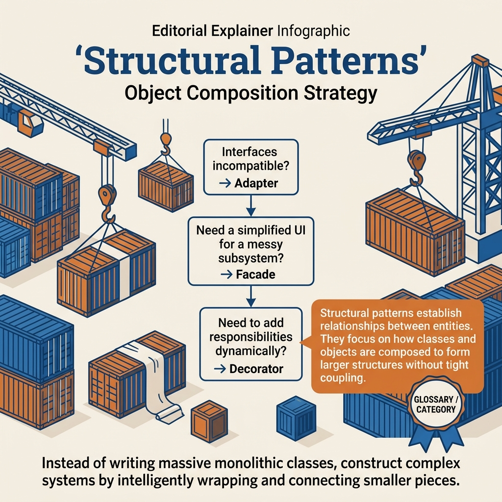

<!-- tags: design-pattern, structural, oop, overview -->
# Structural Design Patterns

> The lane for composition and boundary pressure. Learn how to connect objects when interfaces mismatch, subsystems become tangled, behaviors require wrapping, or two dimensions of change lock together.

| Aspect | Detail |
| --- | --- |
| **Concept** | Patterns handling composition pressure |
| **Audience** | Backend engineers, integration owners, reviewers, and developers managing middleware, wrappers, or subsystem boundaries |
| **Primary style** | Pattern-family router |
| **Entry point** | Open when the pain point shifts from creating objects or algorithms to assembling objects together |

📅 Created: 2026-03-19 · 🔄 Updated: 2026-04-05 · ⏱️ 6 min read

---

## 1. DEFINE

Imagine an integration layer that runs but resists expansion. An external library misaligns with internal interfaces. Middleware layers stack wrapper upon wrapper. A subsystem demands callers remember too many steps. Or a new abstraction constantly breeds concrete classes for every platform. This type of problem allows the code to run, but the structure creates friction during every minor modification.

`Structural Design Patterns` focus on one question: **how should objects connect, wrap, hide, group, or separate structurally to reduce the caller's internal knowledge?**

### Coverage Map

| Pattern | Problem Solved | Link |
| --- | --- | --- |
| Adapter | Convert an incompatible interface into the interface the caller requires | [01-adapter.md](./01-adapter.md) |
| Decorator | Wrap additional behavior around an object without modifying its core | [02-decorator.md](./02-decorator.md) |
| Proxy | Insert an intermediary to cache, authorize, lazy-load, or control access | [03-proxy.md](./03-proxy.md) |
| Facade | Consolidate a complex subsystem behind a simpler entry point | [04-facade.md](./04-facade.md) |
| Composite | Handle leaf nodes and trees uniformly through the same contract | [05-composite.md](./05-composite.md) |
| Bridge | Separate abstractions from implementations when two dimensions of change multiply together | [06-bridge.md](./06-bridge.md) |

### 1.1 Signals & Boundaries

- Open `Adapter` when you must **translate between two interfaces**.
- Open `Decorator` when you must **wrap behavior at runtime**.
- Open `Proxy` when you need an **intermediary between caller and target** to control access or cost.
- Open `Facade` when a subsystem grows too complex for callers.
- Open `Composite` when trees and leaves require a uniform contract.
- Open `Bridge` when variations explode because two dimensions of change cross-multiply.

---

## 2. VISUAL

The six types of composition pressure are distinct. However, Adapter, Decorator, and Proxy all "stand in the middle". Their true goals differentiate them. The visual below routes by actual intent.

### Overview — Structural Decision Map



*Figure: Translate? → Adapter. Wrap behavior? → Decorator. Control access? → Proxy. Simplify subsystem? → Facade. Tree? → Composite. Two axes? → Bridge.*

### Level 1

```text
Where is the composition pressure?
  Interfaces mismatch               -> Adapter
  Need to wrap behavior             -> Decorator
  Need an intermediary to control   -> Proxy
  Subsystem confuses the caller     -> Facade
  Tree-like structure               -> Composite
  Two dimensions change together    -> Bridge
```

*Figure: Level 1 routes by the structural boundary causing friction.*

### Level 2

```text
Symptom in the codebase                        Pattern to open first
------------------------------------------   ---------------------------
External SDK fails to match internal interface Adapter
Middleware/logging/cache wrap in deep stacks   Decorator
Remote calls, auth, or lazy loads need blocks  Proxy
Callers must memorize 4-5 subsystem steps      Facade
Folders/menus/org charts have leaves + branches Composite
Abstractions x implementations breed variants  Bridge
```

*Figure: Level 2 aids pattern selection via actual symptoms found during code reviews.*

---

## 3. CODE

The diagrams map boundaries to patterns. The artifact below turns the structural lane into a checklist suitable for refactor planning.

### Problem 1: Basic — Diagnose composition pressure

> **Goal**: Avoid applying the same "wrapper pattern" to every structural problem.
> **Approach**: Distinguish the exact goal of the intermediary layer.
> **Example**: SDK adapters, HTTP middleware, client proxies, subsystem orchestration, tree structures.
> **Complexity**: Basic

```yaml
structural_router:
  ask_first:
    - "Does this new layer translate an interface, wrap behavior, or control access?"
    - "Are callers forced to know too much about the subsystem?"
    - "Are two dimensions of change locked together?"
  choose:
    interface_translation: ./01-adapter.md
    behavior_wrapping: ./02-decorator.md
    access_or_lazy_boundary: ./03-proxy.md
    subsystem_simplification: ./04-facade.md
    tree_uniformity: ./05-composite.md
    two_dimensions_of_change: ./06-bridge.md
```

This checklist stops debates like "just add a wrapper" when developers do not know which exact problem the wrapper solves.

---

## 4. PITFALLS

The structural lane suffers from confusion because patterns "look similar" with intermediary layers. The purpose of the layer determines the correct pattern.

| # | Severity | Error | Consequence | Fix |
| --- | --- | --- | --- | --- |
| 1 | 🔴 Fatal | Confusing Adapter, Decorator, and Proxy | An intermediary exists but handles the wrong responsibility | Always ask if the layer translates, wraps, or controls |
| 2 | 🟡 Common | Treating a Facade like a "god service" | Simpler API but subsystem coupling persists | Keep the facade thin; do not swallow core business logic |
| 3 | 🟡 Common | Applying Bridge merely due to "many interfaces" | Increased abstraction without reducing cross-product complexity | Open Bridge only when two distinct dimensions change independently |
| 4 | 🔵 Minor | Ignoring tree semantics when using Composite | Code treats leaves and branches differently everywhere | Employ Composite only when a uniform contract is the genuine goal |

---

## 5. REF

| Resource | Type | Link | Notes |
| --- | --- | --- | --- |
| Adapter | Internal | ./01-adapter.md | Entry point for mismatched interfaces |
| Decorator | Internal | ./02-decorator.md | Entry point for wrapping behaviors |
| Facade | Internal | ./04-facade.md | Entry point for complex subsystems |
| Bridge | Internal | ./06-bridge.md | Entry point for cross-multiplying changes |

---

## 6. RECOMMEND

Once you diagnose the genuine composition pressure, opening the correct adjacent article prevents you from applying a familiar-looking wrapper to the wrong boundary.

| Explore | When to use | Reason | File/Link |
| --- | --- | --- | --- |
| Adapter | The boundary suffers from mismatched interfaces | Keep the caller anchored to the internal contract | [01-adapter.md](./01-adapter.md) |
| Decorator | The core object is correct but requires additional concerns | Augment behavior without altering the core object | [02-decorator.md](./02-decorator.md) |
| Facade | The caller memorizes too many steps within a subsystem | Simplify the entry point while preserving the underlying subsystem | [04-facade.md](./04-facade.md) |
| Behavioral Patterns | The problem involves orchestration decisions rather than structure | Avoid using structural patterns to heal orchestration problems | [Behavioral Patterns](../behavioral/README.md) |

**Links**: [← Creational Patterns](../creational/README.md) · [→ Behavioral Patterns](../behavioral/README.md)
