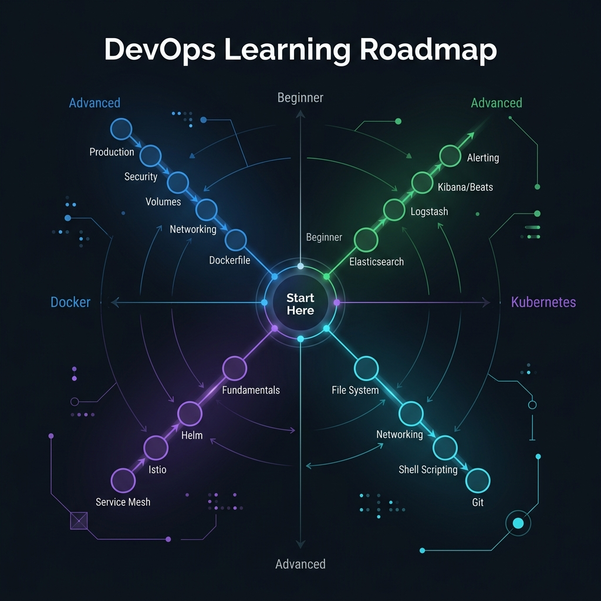
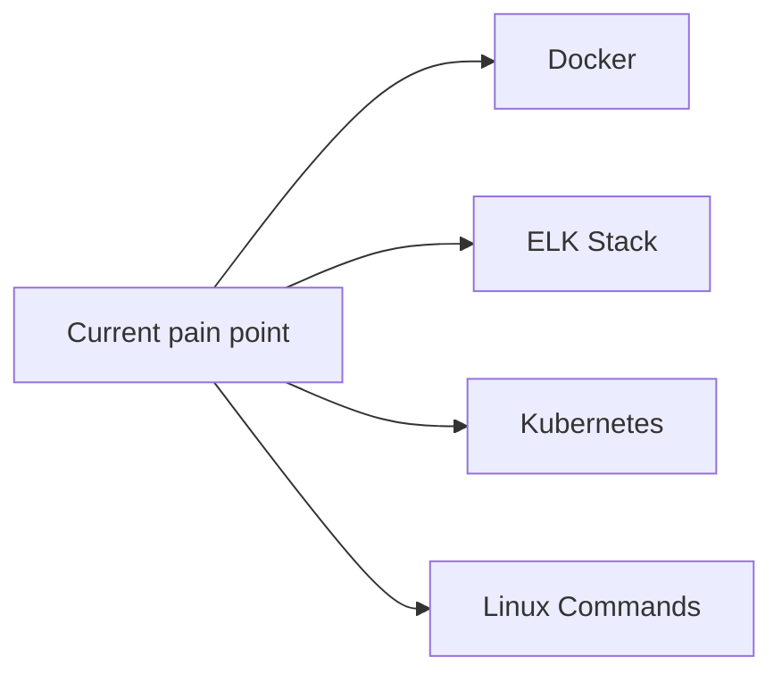

<!-- tags: devops, overview -->
# DevOps

> Navigation hub for containerization, orchestration, observability, and Linux operations from a production-first perspective.

| Aspect | Detail |
| --- | --- |
| **Concept** | Navigation hub for `DevOps` |
| **Audience** | Backend engineer, DevOps engineer, SRE, platform engineer |
| **Primary style** | Concept-First router |
| **Entry point** | Open when the problem sits in containers, clusters, log pipelines, or Linux operations. |

📅 Updated: 2026-04-20 · ⏱️ 4 min read

---

## 1. DEFINE

A production incident rarely comes labeled "Docker" or "Kubernetes." It arrives as a slow deploy, a crashing pod, a missing log line, or a full disk at 3 AM. The challenge is routing the symptom to the right tooling lane before you burn time in the wrong documentation subtree.

This hub routes you to the correct domain lane. It does not replace individual articles.

### Signals & Boundaries

- Open this hub when you know the issue lives inside DevOps but are unsure which subtree to start with.
- Use the coverage map to route by pain point, not by folder name.
- Return here after each article to pick the next step with intention.

### Coverage Map

| Entry | Role |
| --- | --- |
| [Docker](docker/README.md) | Entry point for containerization, image build, networking, volumes, production ops |
| [ELK Stack](elk/README.md) | Entry point for log ingestion, search, dashboards, alerting |
| [Kubernetes](k8s/README.md) | Entry point for orchestration, deployment, Helm, Istio, CI/CD |
| [Linux Commands](linux-command/README.md) | Entry point for shell operations, troubleshooting, system administration |

---

## 2. VISUAL

The definition locked the hub's scope. The visual below routes by pain point, not by alphabetical order — pick your lane, skip what you already know.





*Figure: DevOps hub routes by symptom domain — container issues go to Docker, log pipeline issues go to ELK, orchestration issues go to K8s, and shell-level operations go to Linux Commands.*

---

## 3. CODE

### Problem 1: Basic — Route the lane before reading deep

> **Goal**: Prevent study or review from drifting into "open whichever folder looks interesting."
> **Approach**: Choose lane by current pain point.
> **Complexity**: Basic

```yaml
router:
  module: DevOps
  rule: "choose lane by symptom, not by familiar name"
  suggested_path:
  - docker/README.md
  - elk/README.md
  - k8s/README.md
  - linux-command/README.md
```

This artifact does not solve the problem for you. It trims wrong lanes before your time is spent on articles that do not serve your current goal.

---

## 4. PITFALLS

| # | Severity | Mistake | Consequence | Fix |
| --- | --- | --- | --- | --- |
| 1 | 🔴 Fatal | Reading by folder order instead of routing by pain point | Accumulates terminology without solving the real problem | Use the coverage map first |
| 2 | 🟡 Common | Treating the README as a pure link catalog | Loses the hub's routing purpose | Always ask "which lane matches my current pain?" |
| 3 | 🔵 Minor | Finishing an article without returning to the hub | Jumps to an adjacent article by instinct | Return to the README to pick the next step |

---

## 5. REF

| Resource | Type | Link | Notes |
| --- | --- | --- | --- |
| Docker | Internal | [Docker](docker/README.md) | Containerization hub |
| ELK Stack | Internal | [ELK Stack](elk/README.md) | Observability hub |
| Kubernetes | Internal | [Kubernetes](k8s/README.md) | Orchestration hub |
| Linux Commands | Internal | [Linux Commands](linux-command/README.md) | Shell operations hub |

---

## 6. RECOMMEND

| Next step | When | Reason | File/Link |
| --- | --- | --- | --- |
| Docker | When the pain point is container build, networking, or production ops | Route to the right cluster | [Docker](docker/README.md) |
| ELK Stack | When the pain point is log ingestion, search, or dashboard | Route to the right cluster | [ELK Stack](elk/README.md) |
| Kubernetes | When the pain point is orchestration, rollout, or service mesh | Route to the right cluster | [Kubernetes](k8s/README.md) |
| Linux Commands | When the pain point is shell, process, disk, or networking at OS level | Route to the right cluster | [Linux Commands](linux-command/README.md) |
