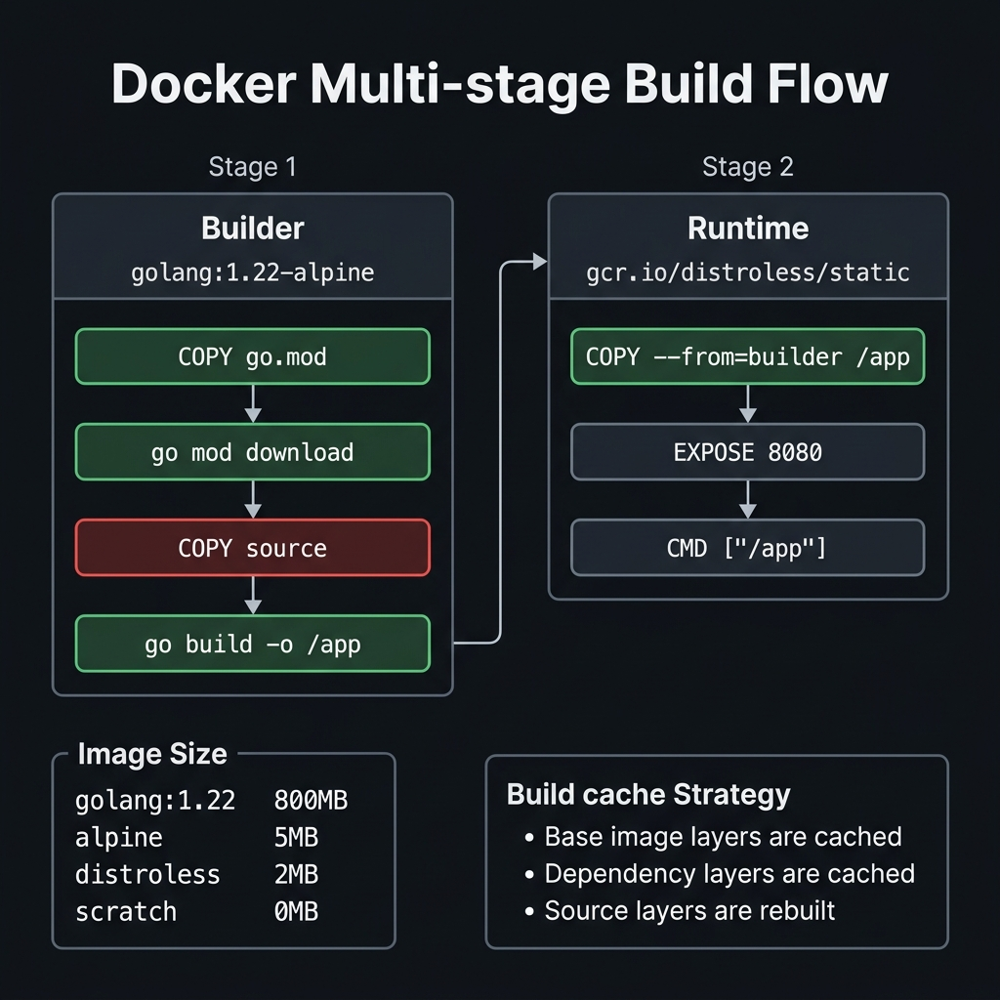
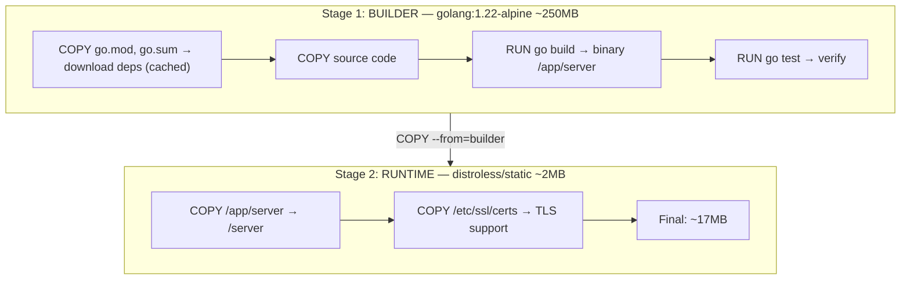

<!-- tags: docker, containerization, production -->
# 📦 Dockerfile & Multi-stage Builds

> Package a Go app into an optimized container — from 1GB down to 10MB with multi-stage builds.

📅 Created: 2026-03-20 · 🔄 Updated: 2026-04-20 · ⏱️ 15 min read

| Aspect           | Detail                                        |
| ---------------- | --------------------------------------------- |
| **Tool**         | Docker 24+, BuildKit                          |
| **Use case**     | Build reproducible, portable Go binaries      |
| **Go relevance** | CGO_ENABLED=0 → static binary → scratch image |
| **CLI**          | `docker build`, `docker buildx`               |

---

## 1. DEFINE

Picture a Go application running perfectly on your machine, but the built image weighs hundreds of megabytes, starts slowly, and carries unnecessary attack surface. The Dockerfile problem truly begins when you must turn source code into an image that can survive in production.

### Dockerfile Instructions

| Instruction   | Role                          | Example                                                 |
| ------------- | ----------------------------- | ------------------------------------------------------- |
| `FROM`        | Base image                    | `FROM golang:1.22-alpine`                               |
| `WORKDIR`     | Set working directory         | `WORKDIR /app`                                          |
| `COPY`        | Copy files from host          | `COPY go.mod go.sum ./`                                 |
| `ADD`         | Copy + extract archives, URLs | `ADD app.tar.gz /app`                                   |
| `RUN`         | Execute command (build layer) | `RUN go build -o server`                                |
| `ENV`         | Set environment variable      | `ENV GIN_MODE=release`                                  |
| `ARG`         | Build-time variable           | `ARG VERSION=dev`                                       |
| `EXPOSE`      | Document port (metadata)      | `EXPOSE 8080`                                           |
| `CMD`         | Default run command           | `CMD ["/server"]`                                       |
| `ENTRYPOINT`  | Fixed run command             | `ENTRYPOINT ["/server"]`                                |
| `HEALTHCHECK` | Container health check        | `HEALTHCHECK CMD curl -f http://localhost:8080/healthz` |
| `USER`        | Run as non-root               | `USER 65534:65534`                                      |
| `LABEL`       | Metadata                      | `LABEL version="1.0"`                                   |

### CMD vs ENTRYPOINT

| Feature  | CMD                           | ENTRYPOINT                                  |
| -------- | ----------------------------- | ------------------------------------------- |
| Override | `docker run image newcmd`     | `docker run --entrypoint`                   |
| Use case | Default command (overridable) | Fixed executable                            |
| Combo    | CMD provides default args     | ENTRYPOINT + CMD = fixed cmd + default args |

### Multi-stage Build

| Stage       | Purpose                     | Example                           |
| ----------- | --------------------------- | --------------------------------- |
| **Builder** | Compile, test, install deps | `golang:1.22-alpine`              |
| **Runtime** | Run application only        | `scratch`, `distroless`, `alpine` |

### Base Image Comparison (for Go)

| Image                      | Size   | Security         | Shell | Use case                 |
| -------------------------- | ------ | ---------------- | ----- | ------------------------ |
| `golang:1.22`              | ~800MB | 🟡 Many packages | ✅    | Development, CI          |
| `golang:1.22-alpine`       | ~250MB | 🟢 Minimal       | ✅    | Builder stage            |
| `alpine:3.19`              | ~7MB   | 🟢               | ✅    | Runtime (need shell)     |
| `gcr.io/distroless/static` | ~2MB   | 🟢🟢 No shell    | ❌    | Production (recommended) |
| `scratch`                  | 0MB    | 🟢🟢🟢 Empty     | ❌    | Smallest possible        |

### Failure Modes

| Error                             | Cause                        | Fix                                      |
| --------------------------------- | ---------------------------- | ---------------------------------------- |
| Binary not found in runtime       | COPY path wrong              | Check `--from=builder` path              |
| `exec format error`               | Built for wrong architecture | `GOARCH=amd64` or use buildx             |
| DNS resolution fail in scratch    | No CA certs, no resolv.conf  | Copy from builder or use distroless      |
| TLS handshake fail                | Missing CA certificates      | `COPY --from=builder /etc/ssl/certs/`    |

---

Those failure modes sound familiar. But there is a trap: a multi-stage build that does not leverage layer cache means slow builds, and a wrong COPY --from stage means a missing binary. That trap appears in PITFALLS.

## 2. VISUAL

The definition locked the vocabulary. The visual below shows the actual build flow where layers, caching, and stage handoffs start hitting production constraints.



### Multi-stage Build Flow



*Figure: Builder stage compiles and tests; runtime stage keeps only the binary and TLS certs. Final image drops from 800MB to ~17MB — a 97% reduction.*

### Layer Caching Strategy

```text
Most changed ──────────────────────── Least cached
Least changed ─────────────────────── Most cached

Layer 1: FROM golang:1.22-alpine     ← Rarely changes (cached)
Layer 2: COPY go.mod go.sum          ← Changes when adding deps (cached)
Layer 3: RUN go mod download         ← Downloads deps (cached if go.mod same)
Layer 4: COPY . .                    ← Changes every commit (rebuild)
Layer 5: RUN go build                ← Rebuilds (after COPY . .)

✅ Key: Copy go.mod BEFORE source code → cache deps layer
```

---

## 3. CODE

The diagram showed the flow. Code below proves how each decision is enforced by real constraints, not just a nice diagram.

### Example 1: Basic — Simple Dockerfile for Go

> **Goal**: Simplest possible Dockerfile for a Go API.
> **Requires**: Go project with go.mod.
> **Result**: Working container image.

```dockerfile
# Dockerfile
FROM golang:1.22-alpine

WORKDIR /app

# ✅ Copy dependency files first (better caching)
COPY go.mod go.sum ./
RUN go mod download

# ✅ Copy source code
COPY . .

# ✅ Build
RUN go build -o server ./cmd/server

# ✅ Expose port (documentation only)
EXPOSE 8080

# ✅ Run
CMD ["./server"]
```

```bash
# ✅ Build
docker build -t go-api:basic .

# ✅ Run
docker run -p 8080:8080 go-api:basic

# ✅ Check size
docker images go-api:basic
# REPOSITORY   TAG     SIZE
# go-api       basic   310MB  ← Too large for production!
```

**Result**: Container works and is easy to understand.
**Note**: Image is 310MB — contains Go toolchain + source. Use for dev only.

---

The basic Dockerfile is covered. But multi-stage needs build/runtime separation — time to split.

### Example 2: Intermediate — Multi-stage Production Build

> **Goal**: Optimized image for production — small, secure, non-root.
> **Requires**: Go project.
> **Result**: ~15MB image, non-root, no shell attack surface.

```dockerfile
# Dockerfile.production
# ═══════════════════════════════════════════════
# Stage 1: BUILD
# ═══════════════════════════════════════════════
FROM golang:1.22-alpine AS builder

# ✅ Install git (if using private modules)
RUN apk add --no-cache git ca-certificates tzdata

WORKDIR /app

# ✅ Cache dependencies layer
COPY go.mod go.sum ./
RUN go mod download && go mod verify

# ✅ Copy source
COPY . .

# ✅ Build arguments
ARG VERSION=dev
ARG COMMIT=unknown
ARG BUILD_TIME=unknown

# ✅ Static binary — no CGO = no libc dependency = scratch/distroless compatible
RUN CGO_ENABLED=0 GOOS=linux GOARCH=amd64 go build \
    -ldflags="-s -w \
      -X main.version=${VERSION} \
      -X main.commit=${COMMIT} \
      -X main.buildTime=${BUILD_TIME}" \
    -o /app/server ./cmd/server

# ✅ Run tests in builder stage
RUN CGO_ENABLED=0 go test ./... -count=1

# ═══════════════════════════════════════════════
# Stage 2: RUNTIME
# ═══════════════════════════════════════════════
FROM gcr.io/distroless/static-debian12

# ✅ Metadata labels (OCI spec)
LABEL org.opencontainers.image.title="go-api"
LABEL org.opencontainers.image.version="${VERSION}"
LABEL org.opencontainers.image.source="https://github.com/myorg/go-api"

# ✅ Copy binary
COPY --from=builder /app/server /server

# ✅ Copy timezone data (if app needs time.LoadLocation)
COPY --from=builder /usr/share/zoneinfo /usr/share/zoneinfo

# ✅ Copy CA certs (for HTTPS calls)
COPY --from=builder /etc/ssl/certs/ca-certificates.crt /etc/ssl/certs/

# ✅ Copy config files (if any)
COPY --from=builder /app/config /config

# ✅ Run as non-root user
USER 65534:65534

# ✅ Document port
EXPOSE 8080

# ✅ Health check
HEALTHCHECK --interval=30s --timeout=5s --start-period=10s --retries=3 \
  CMD ["/server", "healthcheck"]

# ✅ Entrypoint
ENTRYPOINT ["/server"]
```

```go
// cmd/server/main.go — Version info from ldflags
package main

import (
	"fmt"
	"log"
	"net/http"
	"os"
)

var (
	version   = "dev"
	commit    = "unknown"
	buildTime = "unknown"
)

func main() {
	// ✅ Healthcheck mode (for HEALTHCHECK CMD)
	if len(os.Args) > 1 && os.Args[1] == "healthcheck" {
		resp, err := http.Get("http://localhost:8080/healthz")
		if err != nil || resp.StatusCode != 200 {
			os.Exit(1)
		}
		os.Exit(0)
	}

	mux := http.NewServeMux()
	mux.HandleFunc("/healthz", func(w http.ResponseWriter, r *http.Request) {
		fmt.Fprintf(w, `{"status":"healthy","version":"%s","commit":"%s"}`, version, commit)
	})
	mux.HandleFunc("/", func(w http.ResponseWriter, r *http.Request) {
		fmt.Fprintf(w, "Hello from Go API %s", version)
	})

	log.Printf("🚀 Server %s (%s) starting on :8080", version, commit)
	log.Fatal(http.ListenAndServe(":8080", mux))
}
```

```bash
# ✅ Build with version info
docker build \
  --build-arg VERSION=1.2.0 \
  --build-arg COMMIT=$(git rev-parse --short HEAD) \
  --build-arg BUILD_TIME=$(date -u +%Y-%m-%dT%H:%M:%SZ) \
  -f Dockerfile.production \
  -t go-api:v1.2.0 .

# ✅ Check size
docker images go-api
# REPOSITORY   TAG      SIZE
# go-api       basic    310MB
# go-api       v1.2.0   17MB   ← 95% smaller!

# ✅ Verify non-root
docker run go-api:v1.2.0 whoami
# Error: no shell — distroless doesn't have whoami ← GOOD!

# ✅ Scan vulnerabilities
docker scout cves go-api:v1.2.0
# 0 vulnerabilities ← distroless = minimal attack surface
```

**Result**: 17MB image, non-root, no shell, version info embedded.
**Note**: Distroless has no shell → debug using ephemeral containers.

---

Multi-stage is covered. But distroless needs a minimal base — time to harden.

### Example 3: Advanced — Multi-platform + Build Cache

> **Goal**: Build for AMD64 + ARM64 (Apple Silicon), advanced caching.
> **Requires**: Docker Buildx, QEMU.
> **Result**: Cross-platform images, CI-optimized build.

```dockerfile
# Dockerfile.multiarch
# syntax=docker/dockerfile:1

FROM --platform=$BUILDPLATFORM golang:1.22-alpine AS builder

# ✅ Build arguments injected by buildx
ARG TARGETPLATFORM
ARG TARGETOS
ARG TARGETARCH
ARG VERSION=dev

WORKDIR /app

# ✅ Mount cache — persist Go modules across builds
RUN --mount=type=cache,target=/go/pkg/mod \
    --mount=type=cache,target=/root/.cache/go-build \
    echo "Build cache mounted"

COPY go.mod go.sum ./
RUN --mount=type=cache,target=/go/pkg/mod \
    go mod download

COPY . .

# ✅ Cross-compile for target platform
RUN --mount=type=cache,target=/go/pkg/mod \
    --mount=type=cache,target=/root/.cache/go-build \
    CGO_ENABLED=0 GOOS=${TARGETOS} GOARCH=${TARGETARCH} \
    go build \
      -ldflags="-s -w -X main.version=${VERSION}" \
      -o /app/server ./cmd/server

# ═══════════════════════════════════════════════
FROM gcr.io/distroless/static-debian12

COPY --from=builder /etc/ssl/certs/ca-certificates.crt /etc/ssl/certs/
COPY --from=builder /usr/share/zoneinfo /usr/share/zoneinfo
COPY --from=builder /app/server /server

USER 65534:65534
EXPOSE 8080
ENTRYPOINT ["/server"]
```

```bash
# ✅ Setup buildx builder
docker buildx create --name multiarch --use
docker buildx inspect --bootstrap

# ✅ Build multi-platform image + push
docker buildx build \
  --platform linux/amd64,linux/arm64 \
  --build-arg VERSION=1.2.0 \
  -t ghcr.io/myorg/go-api:v1.2.0 \
  -t ghcr.io/myorg/go-api:latest \
  --push \
  -f Dockerfile.multiarch .

# ✅ Verify manifest
docker manifest inspect ghcr.io/myorg/go-api:v1.2.0

# ✅ Local build with cache export (CI)
docker buildx build \
  --platform linux/amd64 \
  --cache-from type=registry,ref=ghcr.io/myorg/go-api:buildcache \
  --cache-to type=registry,ref=ghcr.io/myorg/go-api:buildcache,mode=max \
  -t go-api:v1.2.0 \
  --load .
```

```makefile
# Makefile — Docker build targets
VERSION ?= $(shell git describe --tags --always --dirty)
COMMIT  ?= $(shell git rev-parse --short HEAD)
IMAGE   ?= ghcr.io/myorg/go-api

.PHONY: docker-build docker-push docker-multi

# ✅ Local build
docker-build:
	docker build \
		--build-arg VERSION=$(VERSION) \
		--build-arg COMMIT=$(COMMIT) \
		-f Dockerfile.production \
		-t $(IMAGE):$(VERSION) .

# ✅ Multi-platform build + push
docker-multi:
	docker buildx build \
		--platform linux/amd64,linux/arm64 \
		--build-arg VERSION=$(VERSION) \
		-t $(IMAGE):$(VERSION) \
		-t $(IMAGE):latest \
		--push .

# ✅ Security scan
docker-scan:
	trivy image --severity HIGH,CRITICAL $(IMAGE):$(VERSION)
```

**Result**: Multi-arch (AMD64+ARM64), persistent build cache, Makefile workflow.
**Note**: `--mount=type=cache` only works with BuildKit (Docker 23+).

---

You have covered Dockerfile, multi-stage, and distroless. Now comes the dangerous part: cache misses and stage references — the trap set up from the beginning of this article.

## 4. PITFALLS

Errors usually do not sit in syntax. They sit in operational boundaries and forgotten failure modes. The table below collects exactly those mistakes.

| #   | Mistake                            | Consequence                                 | Fix                                           |
| --- | ---------------------------------- | ------------------------------------------- | --------------------------------------------- |
| 1   | Image too large (>500MB)           | Increases pull time, disk usage, attack surface | Multi-stage build, distroless/scratch runtime |
| 2   | `COPY . .` invalidates all cache   | Every build re-downloads all deps            | Copy go.mod BEFORE source code                |
| 3   | TLS fail in scratch                | HTTPS calls fail, app crashes               | `COPY --from=builder /etc/ssl/certs/`         |
| 4   | Wrong timezone                     | Timestamps incorrect, scheduler breaks       | Copy `/usr/share/zoneinfo` or set `TZ` env    |
| 5   | Binary not executable              | Container exits immediately                 | Verify `GOOS=linux`, `CGO_ENABLED=0`          |
| 6   | Slow build → deps download every time | CI/CD pipeline slow, bandwidth waste       | `go mod download` before `COPY . .`           |

---

You have covered Dockerfile & Multi-stage and the traps. The resources below help go deeper.

## 5. REF

| Resource                  | Link                                                                                                    |
| ------------------------- | ------------------------------------------------------------------------------------------------------- |
| Dockerfile Best Practices | [docs.docker.com/build/building/best-practices](https://docs.docker.com/build/building/best-practices/) |
| Multi-stage Builds        | [docs.docker.com/build/building/multi-stage](https://docs.docker.com/build/building/multi-stage/)       |
| Distroless Images         | [github.com/GoogleContainerTools/distroless](https://github.com/GoogleContainerTools/distroless)        |
| Docker Buildx             | [docs.docker.com/build/buildx](https://docs.docker.com/build/builders/)                                 |
| Go Docker Best Practices  | [blog.golang.org/docker](https://go.dev/blog/)                                                          |

---

## 6. RECOMMEND

After this article, read the topic closest to your current decision so the production mental model does not fragment.

| Next step             | When                   | Reason                                |
| --------------------- | ---------------------- | ------------------------------------- |
| **ko**                | Go-specific builder    | No Dockerfile needed, auto distroless |
| **Buildpacks**        | Auto-detect build      | Cloud Native Buildpacks               |
| **Kaniko**            | Build in K8s           | Rootless build inside containers      |
| **Dive**              | Analyze image layers   | Find redundant layers, optimize size  |
| **Chainguard Images** | Alternative distroless | Hardened, signed base images          |

---

**Links**: [← README](./README.md) · [→ Docker Compose](./02-docker-compose.md)
