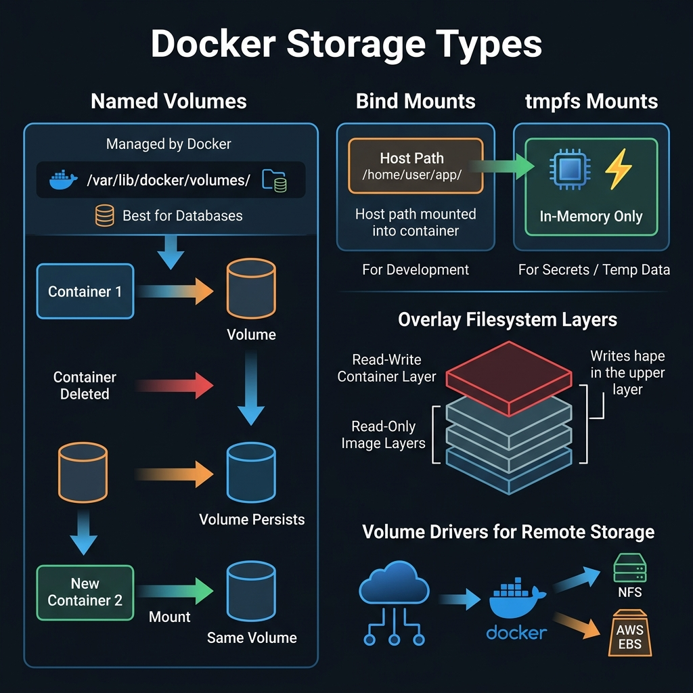
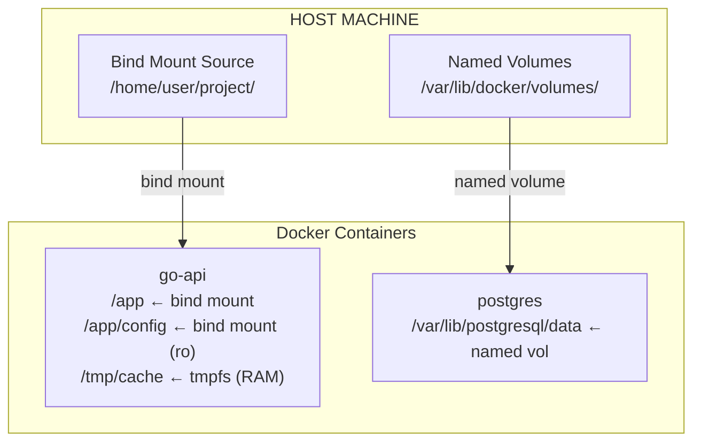

<!-- tags: docker, containerization, storage -->
# 💾 Volumes & Data Management

> Persistent storage, bind mounts, backup strategies — data survives container restarts.

📅 Created: 2026-03-20 · 🔄 Updated: 2026-04-20 · ⏱️ 12 min read

| Aspect           | Detail                                       |
| ---------------- | -------------------------------------------- |
| **Concept**      | Named volumes, bind mounts, tmpfs            |
| **Use case**     | Database persistence, config files, dev sync |
| **Go relevance** | App data, config, logs persistence           |
| **CLI**          | `docker volume`, `-v`, `--mount`             |

---

## 1. DEFINE

You are rebuilding containers quickly, but data either disappears after every restart or the mount is painfully slow. Volumes and data strategy start to matter when containers are no longer toy demos.

### Storage Types

| Type                 | Description                | Use case                  | Performance  |
| -------------------- | -------------------------- | ------------------------- | ------------ |
| **Named volume**     | Docker-managed storage     | DB data, persistent state | ⚡ Best      |
| **Bind mount**       | Host directory → container | Dev source code, config   | 🔸 Good      |
| **tmpfs**            | RAM-only, no persist       | Secrets, temp data        | ⚡⚡ Fastest |
| **Anonymous volume** | Auto-created, no name      | Temporary, hard to manage | ⚡ Best      |

### Volume vs Bind Mount

| Feature                 | Named Volume             | Bind Mount               |
| ----------------------- | ------------------------ | ------------------------ |
| **Location**            | Docker manages           | You specify host path    |
| **Portability**         | ✅ Portable              | ❌ Host-dependent        |
| **Backup**              | `docker volume` commands | Standard file tools      |
| **Permissions**         | Docker handles           | Host UID/GID issues      |
| **Performance (macOS)** | ⚡ Native driver         | 🐢 Slow (virtio-fs)      |
| **Pre-populate**        | ✅ From image            | ❌ Empty or host content |

### Mount Flags

| Flag         | Description                         | Example                   |
| ------------ | ----------------------------------- | ------------------------- |
| `ro`         | Read-only                           | `./config:/app/config:ro` |
| `rw`         | Read-write (default)                | `data:/app/data:rw`       |
| `cached`     | Host-to-container optimized (macOS) | `.:/app:cached`           |
| `delegated`  | Container-to-host optimized (macOS) | `./logs:/logs:delegated`  |
| `consistent` | Full consistency (default, slowest) | Default                   |

### Failure Modes

| Error                  | Cause                                  | Fix                                |
| ---------------------- | -------------------------------------- | ---------------------------------- |
| Permission denied      | UID mismatch host vs container         | `chown` or match UID               |
| Data lost after restart| Using anonymous volume or no mount     | Named volume                       |
| Slow file sync (macOS) | Bind mount performance                 | `cached`/`delegated`, named volume |
| Volume corrupt         | Dirty shutdown                         | Graceful stop, backup regularly    |

---

Those failure modes sound basic. But there is a trap: anonymous volumes lose data when the container is removed, and wrong bind mount permissions cause access denied. That trap appears in PITFALLS.

## 2. VISUAL

The concept has a name. In the diagram, the more important part emerges: how data flows and persists across container lifecycles.



### Storage Architecture



*Figure: Named volumes are Docker-managed and persist across restarts. Bind mounts map host directories into containers. tmpfs lives in RAM only.*

---

## 3. CODE

The diagram showed the main path. The code, manifests, and commands below pull it down to the artifact level that on-call or reviewers actually use.

### Example 1: Basic — Volume Types

> **Goal**: Understand the three storage types and when to use each.
> **Requires**: Docker.
> **Result**: Correct storage choice per use case.

```bash
# ═══════════════════════════════════════════
# Named Volume — Database persistence
# ═══════════════════════════════════════════
docker volume create pgdata

docker run -d \
  --name postgres \
  -v pgdata:/var/lib/postgresql/data \
  -e POSTGRES_PASSWORD=secret \
  postgres:16-alpine

# Data persists after container stop/remove
docker stop postgres && docker rm postgres
docker run -d --name postgres -v pgdata:/var/lib/postgresql/data postgres:16-alpine
# ✅ Data still there!

# ═══════════════════════════════════════════
# Bind Mount — Development source code
# ═══════════════════════════════════════════
docker run -d \
  --name go-dev \
  -v $(pwd):/app \
  -v $(pwd)/config.yaml:/app/config.yaml:ro \
  -w /app \
  golang:1.22 \
  go run ./cmd/server

# ✅ Edit code on host → reflected in container immediately
# ✅ :ro = read-only — container can't modify config

# ═══════════════════════════════════════════
# tmpfs — Secrets, temp data (RAM only)
# ═══════════════════════════════════════════
docker run -d \
  --name go-api \
  --tmpfs /tmp:rw,noexec,nosuid,size=100m \
  --tmpfs /run/secrets:ro,size=1m \
  go-api:latest

# ✅ /tmp data never written to disk — security for secrets
# ✅ size=100m — limit RAM usage
```

```yaml
# docker-compose.yaml — All volume types
services:
    api:
        build: .
        volumes:
            # ✅ Bind mount — source code (dev)
            - ./:/app
            # ✅ Bind mount — config (readonly)
            - ./config:/app/config:ro
            # ✅ Named volume — persistent cache
            - appcache:/app/.cache
        tmpfs:
            # ✅ tmpfs — temp files in RAM
            - /tmp:size=100m

    postgres:
        image: postgres:16-alpine
        volumes:
            # ✅ Named volume — database data
            - pgdata:/var/lib/postgresql/data
            # ✅ Bind mount — init scripts
            - ./scripts/init.sql:/docker-entrypoint-initdb.d/init.sql:ro

volumes:
    pgdata:
    appcache:
```

**Result**: Correct storage type per use case.
**Note**: Named volume for DB, bind mount for dev, tmpfs for secrets.

---

Named volumes are covered. But bind mounts need path management — time to mount.

### Example 2: Intermediate — Backup & Restore

> **Goal**: Backup and restore named volumes for disaster recovery.
> **Requires**: Named volume with data.
> **Result**: Automated backup strategy.

```bash
# ═══════════════════════════════════════════
# Backup PostgreSQL volume
# ═══════════════════════════════════════════

# ✅ Method 1: pg_dump (recommended — consistent)
docker exec postgres pg_dump -U appuser myapp | gzip > backup_$(date +%Y%m%d).sql.gz

# ✅ Method 2: Volume backup (raw files)
docker run --rm \
  -v pgdata:/source:ro \
  -v $(pwd)/backups:/backup \
  alpine \
  tar czf /backup/pgdata_$(date +%Y%m%d_%H%M%S).tar.gz -C /source .

# ✅ Restore from backup
# Method 1: pg_dump restore
gunzip < backup_20240101.sql.gz | docker exec -i postgres psql -U appuser myapp

# Method 2: Volume restore
docker volume create pgdata_restored
docker run --rm \
  -v pgdata_restored:/target \
  -v $(pwd)/backups:/backup:ro \
  alpine \
  tar xzf /backup/pgdata_20240101_120000.tar.gz -C /target
```

```yaml
# docker-compose.yaml — Automated backup service
services:
    postgres:
        image: postgres:16-alpine
        volumes:
            - pgdata:/var/lib/postgresql/data
        environment:
            POSTGRES_USER: appuser
            POSTGRES_PASSWORD: secret
            POSTGRES_DB: myapp

    # ✅ Automated daily backup
    backup:
        image: postgres:16-alpine
        profiles: ['maintenance']
        depends_on:
            postgres: { condition: service_healthy }
        environment:
            PGPASSWORD: secret
        volumes:
            - ./backups:/backups
        entrypoint: >
            sh -c '
              TIMESTAMP=$$(date +%Y%m%d_%H%M%S)
              echo "📦 Starting backup..."
              pg_dump -h postgres -U appuser myapp | gzip > /backups/backup_$$TIMESTAMP.sql.gz
              
              echo "🧹 Cleaning old backups (keep last 7)..."
              ls -t /backups/backup_*.sql.gz | tail -n +8 | xargs rm -f
              
              echo "✅ Backup completed: backup_$$TIMESTAMP.sql.gz"
              ls -lh /backups/
            '

volumes:
    pgdata:
```

```bash
# ✅ Run backup manually
docker compose --profile maintenance run --rm backup

# ✅ Schedule via cron on host
# crontab -e
# 0 2 * * * cd /path/to/project && docker compose --profile maintenance run --rm backup
```

**Result**: Automated backup, rotation, easy restore.
**Note**: pg_dump is preferred over volume tar because pg_dump guarantees consistency.

---

Bind mounts are covered. But tmpfs needs ephemeral storage — time to use it.

### Example 3: Advanced — macOS Performance + Volume Plugins

> **Goal**: Fix bind mount performance on macOS, volume plugins for cloud.
> **Requires**: Docker Desktop macOS / volume plugins.
> **Result**: Development performance optimization.

```yaml
# docker-compose.yaml — macOS optimized
services:
    api:
        build: .
        volumes:
            # ✅ macOS: Use 'cached' for source code (host → container priority)
            - .:/app:cached

            # ✅ Named volume for dependencies — MUCH faster than bind mount
            - go-modules:/go/pkg/mod
            - go-build-cache:/root/.cache/go-build

            # ✅ Exclude node_modules/vendor from bind mount
            - /app/vendor # Anonymous volume — overrides bind mount

        environment:
            GOPATH: /go
            GOMODCACHE: /go/pkg/mod

volumes:
    go-modules: # ✅ Persist Go modules across rebuilds
    go-build-cache: # ✅ Persist build cache
```

```bash
# ✅ macOS bind mount performance comparison:
#
# Default (consistent):    go build = 45s
# cached:                  go build = 15s  (3x faster)
# Named volume (modules):  go build = 8s   (6x faster)
#
# Key: Keep frequently-read files (node_modules, go modules)
# in named volumes, NOT bind mounts on macOS

# ✅ Volume driver — persistent cloud storage
docker volume create \
  --driver local \
  --opt type=nfs \
  --opt o=addr=nas.local,rw \
  --opt device=:/exports/data \
  shared-data
```

**Result**: 3-6x faster build on macOS, cloud volume support.
**Note**: Optimization is only needed on macOS/Windows. Linux bind mounts are natively fast.

---

You have covered volumes, bind mounts, and tmpfs. Now comes the dangerous part: anonymous volume loss and permission errors — the trap set up from the beginning.

## 4. PITFALLS

Knowing how to do it right is only half the story. The other half is the places where it is easy to get almost right and pay the price when the cluster or OS shakes.

| #   | Mistake                            | Consequence                               | Fix                                             |
| --- | ---------------------------------- | ----------------------------------------- | ----------------------------------------------- |
| 1   | Permission denied (UID mismatch)   | Container cannot read/write files         | Match container USER UID with host UID          |
| 2   | macOS bind mount very slow         | Go build 10x slower than Linux            | Named volume for deps, `:cached` for source     |
| 3   | `docker compose down -v` deletes data | All data gone, no recovery             | Never use `-v` on production                    |
| 4   | Volume data corrupt                | App cannot start, data loss              | Graceful stop (`docker stop`), backup regularly |
| 5   | Anonymous volumes accumulate       | Disk full, `docker system prune` slow    | `docker volume prune` periodically              |

---

You have covered Volumes & Data and the traps. The resources below help go deeper.

## 5. REF

| Resource               | Link                                                                                              |
| ---------------------- | ------------------------------------------------------------------------------------------------- |
| Docker Volumes         | [docs.docker.com/storage/volumes](https://docs.docker.com/storage/volumes/)                       |
| Bind Mounts            | [docs.docker.com/storage/bind-mounts](https://docs.docker.com/storage/bind-mounts/)               |
| tmpfs Mounts           | [docs.docker.com/storage/tmpfs](https://docs.docker.com/storage/tmpfs/)                           |
| Storage Best Practices | [docs.docker.com/develop/dev-best-practices](https://docs.docker.com/develop/dev-best-practices/) |

---

## 6. RECOMMEND

Now that you have seen what this lane solves and where it commonly breaks, the resources below expand along the nearest operational pressure.

| Next step                | When               | Reason                                |
| ------------------------ | ------------------ | ------------------------------------- |
| **Restic**               | Encrypted backups  | Incremental, encrypted, cloud-ready   |
| **Litestream**           | SQLite replication | Continuous backup to S3               |
| **Docker Volume Backup** | Automated tool     | github.com/offen/docker-volume-backup |
| **NFS volumes**          | Shared storage     | Multi-container access to same data   |
| **CSI drivers**          | K8s migration      | Same volume API as K8s PVs            |

---

**Links**: [← Networking](./03-networking.md) · [→ Image Security](./05-image-security.md)
