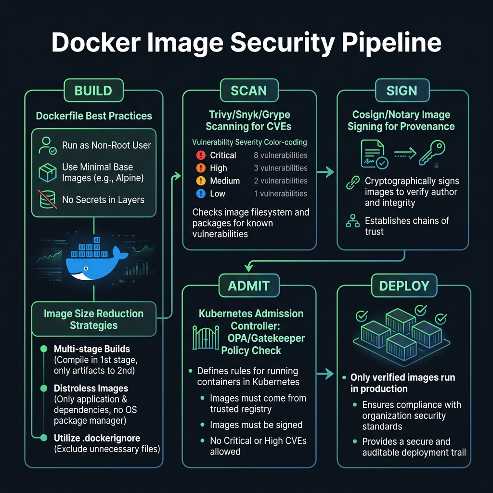
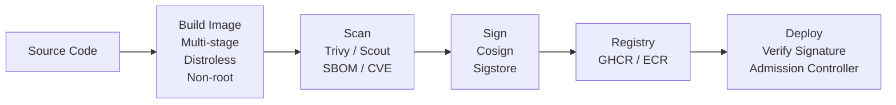

<!-- tags: docker, containerization, security -->
# 🔒 Image Optimization & Security

> Reduce attack surface — smallest image, signed, scanned, zero vulnerabilities.

📅 Created: 2026-03-20 · 🔄 Updated: 2026-04-20 · ⏱️ 14 min read

| Aspect           | Detail                                            |
| ---------------- | ------------------------------------------------- |
| **Tools**        | Trivy, Docker Scout, Cosign, Syft                 |
| **Use case**     | CI scanning, supply chain security                |
| **Go relevance** | Static binary → scratch/distroless → minimal CVEs |
| **CLI**          | `trivy image`, `docker scout`, `cosign sign`      |

---

## 1. DEFINE

A smaller image is not necessarily a safer one. When the scanner starts throwing CVEs, the user still runs as root, and a shell is still open in the runtime image — security becomes a build pipeline problem, not a checkbox at the end of a sprint.

### Image Size Optimization

| Technique             | Impact         | Example                      |
| --------------------- | -------------- | ---------------------------- |
| **Multi-stage build** | -95% size      | Builder → distroless runtime |
| **Static binary**     | No libc dep    | `CGO_ENABLED=0`              |
| **Strip debug**       | -30% binary    | `-ldflags="-s -w"`           |
| **UPX compression**   | -60% binary    | `upx --best server`          |
| **Alpine base**       | -90% vs Debian | `FROM alpine:3.19`           |
| **Distroless**        | ~2MB base      | No shell, no package manager |
| **Scratch**           | 0MB base       | Binary only                  |

### Security Layers

| Layer                | Tool             | Description                |
| -------------------- | ---------------- | -------------------------- |
| **Image scanning**   | Trivy, Scout     | Scan CVEs in image         |
| **SBOM**             | Syft, Trivy      | Software Bill of Materials |
| **Image signing**    | Cosign, Notation | Verify image integrity     |
| **Runtime security** | Falco, Seccomp   | Detect suspicious behavior |
| **Non-root**         | `USER` directive | Least privilege            |
| **Read-only fs**     | `--read-only`    | Immutable container        |

### Vulnerability Severity

| Level        | Description                    | Action          |
| ------------ | ------------------------------ | --------------- |
| **CRITICAL** | Remote code exec, data breach  | ❌ Block deploy |
| **HIGH**     | Privilege escalation           | ❌ Block deploy |
| **MEDIUM**   | Information disclosure         | ⚠️ Review       |
| **LOW**      | Minor issues                   | ℹ️ Monitor      |

### Failure Modes

| Error                  | Cause                            | Fix                         |
| ---------------------- | -------------------------------- | --------------------------- |
| Trivy false positives  | OS package not used by Go binary | Use distroless/scratch      |
| Cosign verify fail     | Wrong key, unsigned image        | Sign in CI, verify in CD    |
| Rootless binary fails  | Needs privileged ports (<1024)   | Use port >1024, nginx proxy |

---

Those failure modes sound familiar. But there is a trap: a base image carrying CVEs is a supply chain risk, and running as root enables container escape. That trap appears in PITFALLS.

## 2. VISUAL

The definition locked the vocabulary. The visual below shows the actual security pipeline where scanning, signing, and admission control interact before an image reaches production.



### Security Pipeline



*Figure: Security gates run at every stage — build hardening, vulnerability scanning, cryptographic signing, and admission verification before any image reaches a production cluster.*

---

## 3. CODE

The flow above gives you intuition. The section below is what the team will copy, review, and own when it hits a real environment.

### Example 1: Basic — Trivy Scanning

> **Goal**: Scan Docker images for CVEs.
> **Requires**: Trivy installed.
> **Result**: Zero-CVE images.

```bash
# ✅ Install Trivy
brew install trivy
# or
curl -sfL https://raw.githubusercontent.com/aquasecurity/trivy/main/contrib/install.sh | sh

# ✅ Scan image
trivy image go-api:v1.2.0
# go-api:v1.2.0 (debian 12.4)
# Total: 0 (UNKNOWN: 0, LOW: 0, MEDIUM: 0, HIGH: 0, CRITICAL: 0)
# ← distroless = 0 CVEs!

# ✅ Scan with severity filter
trivy image --severity HIGH,CRITICAL go-api:v1.2.0

# ✅ Scan and fail CI if Critical found
trivy image --exit-code 1 --severity CRITICAL go-api:v1.2.0

# ✅ Generate SBOM
trivy image --format spdx-json go-api:v1.2.0 > sbom.spdx.json

# ✅ Scan filesystem (source code)
trivy fs --security-checks vuln,config ./

# ✅ Scan Dockerfile
trivy config Dockerfile
```

```yaml
# .github/workflows/scan.yaml — CI scanning
jobs:
    scan:
        runs-on: ubuntu-latest
        steps:
            - uses: actions/checkout@v4

            - name: Build Image
              run: docker build -t go-api:${{ github.sha }} .

            - name: Trivy Scan
              uses: aquasecurity/trivy-action@master
              with:
                  image-ref: go-api:${{ github.sha }}
                  format: table
                  exit-code: 1 # ✅ Fail pipeline if CVEs found
                  severity: CRITICAL,HIGH

            - name: Docker Scout
              uses: docker/scout-action@v1
              with:
                  command: cves
                  image: go-api:${{ github.sha }}
                  exit-code: true
                  only-severities: critical,high
```

**Result**: Automated CVE scanning, CI gate for vulnerabilities.
**Note**: distroless/scratch images produce 0 OS CVEs. Focus on Go dependency CVEs.

---

Image scanning is covered. But non-root user needs the USER instruction — time to lock down.

### Example 2: Intermediate — Hardened Dockerfile

> **Goal**: Production Dockerfile with all security best practices.
> **Requires**: Go project.
> **Result**: Hardened container image.

```dockerfile
# syntax=docker/dockerfile:1
# ═══════════════════════════════════════════
# Hardened Production Dockerfile
# ═══════════════════════════════════════════

FROM golang:1.22-alpine AS builder

# ✅ Verify Go binary checksum (supply chain)
RUN go version

# ✅ No new packages can be installed in runtime
RUN apk add --no-cache ca-certificates tzdata

WORKDIR /app

# ✅ Cache dependencies
COPY go.mod go.sum ./
RUN --mount=type=cache,target=/go/pkg/mod \
    go mod download && go mod verify

COPY . .

# ✅ Static binary, stripped, with version info
ARG VERSION=dev
RUN --mount=type=cache,target=/go/pkg/mod \
    --mount=type=cache,target=/root/.cache/go-build \
    CGO_ENABLED=0 GOOS=linux go build \
      -ldflags="-s -w -X main.version=${VERSION}" \
      -trimpath \
      -o /app/server ./cmd/server

# ✅ Run tests
RUN CGO_ENABLED=0 go test ./...

# ═══════════════════════════════════════════
# Runtime — MINIMAL
# ═══════════════════════════════════════════
FROM scratch

# ✅ OCI Labels
LABEL org.opencontainers.image.title="go-api" \
      org.opencontainers.image.version="${VERSION}" \
      org.opencontainers.image.vendor="MyOrg" \
      org.opencontainers.image.licenses="MIT"

# ✅ Copy CA certs (TLS)
COPY --from=builder /etc/ssl/certs/ca-certificates.crt /etc/ssl/certs/

# ✅ Copy timezone data
COPY --from=builder /usr/share/zoneinfo /usr/share/zoneinfo

# ✅ Copy binary
COPY --from=builder /app/server /server

# ✅ Non-root user (nobody)
USER 65534:65534

# ✅ Read-only recommendation
# docker run --read-only --tmpfs /tmp go-api:v1

EXPOSE 8080
ENTRYPOINT ["/server"]
```

```bash
# ✅ Build hardened image
docker build --build-arg VERSION=v1.2.0 -t go-api:hardened .

# ✅ Run with security options
docker run -d \
  --name go-api \
  --read-only \
  --tmpfs /tmp:rw,noexec,nosuid,size=50m \
  --cap-drop ALL \
  --security-opt no-new-privileges:true \
  --security-opt seccomp=./seccomp-profile.json \
  --memory 256m \
  --cpus 0.5 \
  --pids-limit 100 \
  -p 8080:8080 \
  go-api:hardened

# ✅ Verify
docker inspect go-api --format '{{.HostConfig.ReadonlyRootfs}}'
# true

# ✅ Check running user
docker exec go-api id
# Error: no shell ← GOOD! (scratch image)
```

**Result**: Read-only fs, no capabilities, non-root, PID limit.
**Note**: `--cap-drop ALL` removes all Linux capabilities (mount, net_raw, etc).

---

Non-root is covered. But secrets management needs BuildKit — time to inject.

### Example 3: Advanced — Image Signing + Admission Control

> **Goal**: Sign images and verify before deploy.
> **Requires**: Cosign, K8s admission controller.
> **Result**: Supply chain security.

```bash
# ✅ Install cosign
go install github.com/sigstore/cosign/v2/cmd/cosign@latest

# ✅ Generate key pair
cosign generate-key-pair
# Enter password: ****
# Private key: cosign.key
# Public key:  cosign.pub

# ✅ Sign image
cosign sign --key cosign.key ghcr.io/myorg/go-api:v1.2.0

# ✅ Verify image
cosign verify --key cosign.pub ghcr.io/myorg/go-api:v1.2.0

# ✅ Keyless signing (Sigstore Fulcio — recommended for CI)
cosign sign --yes ghcr.io/myorg/go-api:v1.2.0
# Uses OIDC identity (GitHub Actions, Google, etc.)
```

```yaml
# .github/workflows/release.yaml — Sign in CI
jobs:
    build-and-sign:
        runs-on: ubuntu-latest
        permissions:
            packages: write
            id-token: write # ✅ For keyless signing
        steps:
            - uses: actions/checkout@v4

            - name: Build & Push
              run: |
                  docker build -t ghcr.io/${{ github.repository }}:${{ github.ref_name }} .
                  docker push ghcr.io/${{ github.repository }}:${{ github.ref_name }}

            - name: Install Cosign
              uses: sigstore/cosign-installer@v3

            - name: Sign Image
              run: |
                  cosign sign --yes ghcr.io/${{ github.repository }}:${{ github.ref_name }}

            - name: Verify
              run: |
                  cosign verify \
                    --certificate-identity-regexp=".*" \
                    --certificate-oidc-issuer="https://token.actions.githubusercontent.com" \
                    ghcr.io/${{ github.repository }}:${{ github.ref_name }}

            - name: Generate SBOM
              run: |
                  trivy image --format spdx-json \
                    ghcr.io/${{ github.repository }}:${{ github.ref_name }} > sbom.spdx.json
                  cosign attest --yes --predicate sbom.spdx.json \
                    ghcr.io/${{ github.repository }}:${{ github.ref_name }}
```

**Result**: Signed images, SBOM attestation, supply chain security.
**Note**: Keyless signing is best for CI. Key-based is best for air-gapped environments.

---

You have covered scanning, non-root, and secrets. Now comes the dangerous part: CVE base images and container escape — the trap set up from the beginning.

## 4. PITFALLS

Errors usually do not sit in syntax. They sit in operational boundaries and forgotten failure modes. The table below collects exactly those mistakes.

| #   | Mistake                                  | Consequence                                     | Fix                                           |
| --- | ---------------------------------------- | ----------------------------------------------- | --------------------------------------------- |
| 1   | Trivy scans OS CVEs in Go image          | Many false positives, hard to filter             | Use scratch/distroless — no OS packages       |
| 2   | `--read-only` fails — app writes temp    | App crashes, runtime error                       | `--tmpfs /tmp` for temp storage               |
| 3   | `--cap-drop ALL` breaks networking       | Container cannot bind socket                     | Add back `--cap-add NET_BIND_SERVICE` if needed |
| 4   | UPX compressed binary crashes            | Runtime panic, hard to debug                     | Do not use UPX for production (debug difficulty) |
| 5   | Cosign key leaked                        | All images can be forged                         | Rotate keys, use keyless signing              |

---

You have covered Image Security and the traps. The resources below help go deeper.

## 5. REF

| Resource     | Link                                                                                             |
| ------------ | ------------------------------------------------------------------------------------------------ |
| Trivy        | [aquasecurity.github.io/trivy](https://aquasecurity.github.io/trivy)                             |
| Docker Scout | [docs.docker.com/scout](https://docs.docker.com/scout/)                                          |
| Cosign       | [docs.sigstore.dev/cosign](https://docs.sigstore.dev/cosign/overview/)                           |
| Distroless   | [github.com/GoogleContainerTools/distroless](https://github.com/GoogleContainerTools/distroless) |
| Dive         | [github.com/wagoodman/dive](https://github.com/wagoodman/dive)                                   |

---

## 6. RECOMMEND

After this article, read the topic closest to your current decision so the production mental model does not fragment.

| Next step          | When                 | Reason                          |
| ------------------ | -------------------- | ------------------------------- |
| **Chainguard**     | Hardened base images | Zero CVE, FIPS compliant        |
| **ko**             | Go-specific builds   | No Dockerfile, auto distroless  |
| **Grype**          | Alternative scanner  | Anchore ecosystem               |
| **Kyverno**        | K8s admission policy | Verify signatures before deploy |
| **Snyk Container** | Integrated scanning  | IDE + CI integration            |

---

**Links**: [← Volumes & Data](./04-volumes-data.md) · [→ Registry & CI/CD](./06-registry-cicd.md)
