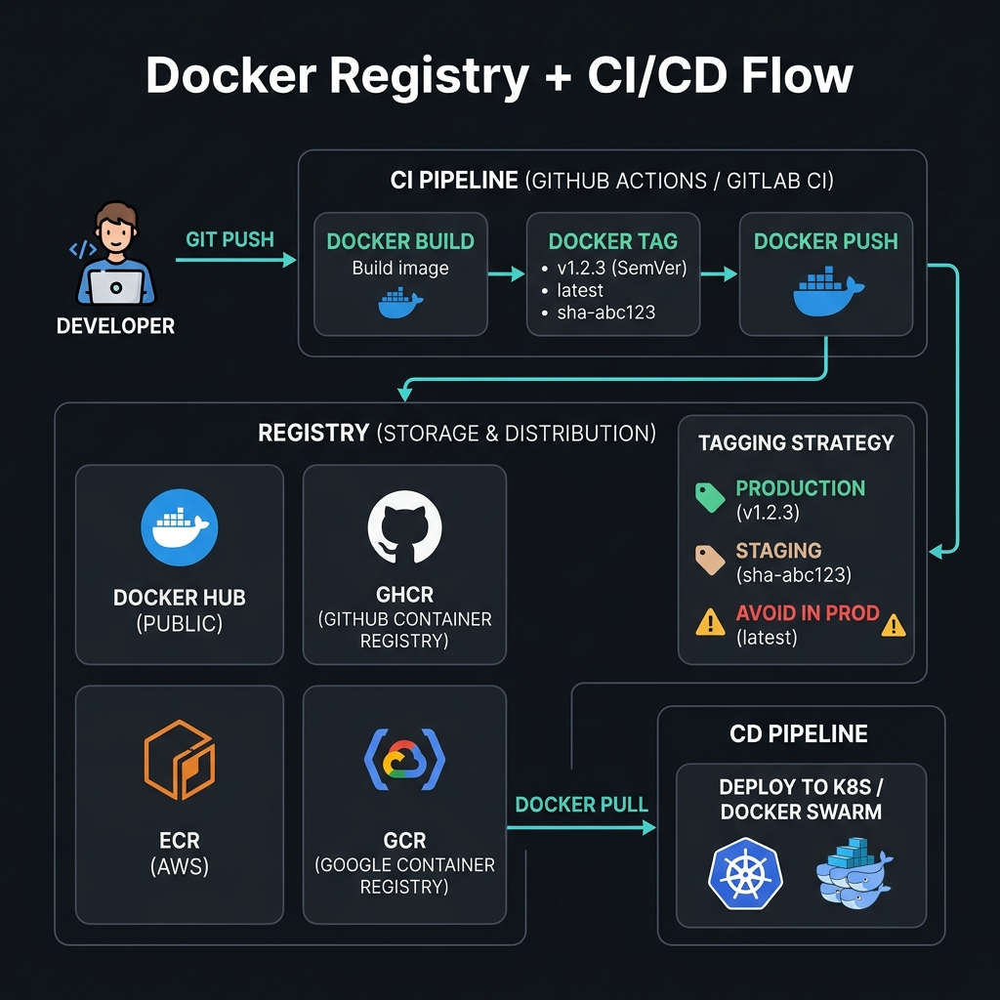
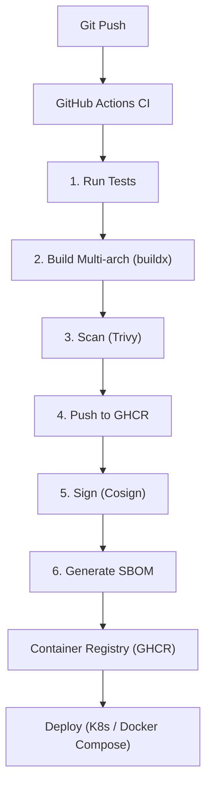

<!-- tags: docker, containerization -->
# 📦 Registry & CI/CD

> Push images to GHCR/ECR/DockerHub, multi-arch builds in GitHub Actions.

📅 Created: 2026-03-20 · 🔄 Updated: 2026-04-20 · ⏱️ 12 min read

| Aspect           | Detail                                   |
| ---------------- | ---------------------------------------- |
| **Tools**        | GHCR, ECR, Docker Hub, GitHub Actions    |
| **Use case**     | Image distribution, automated builds     |
| **Go relevance** | CI/CD pipeline for Go services           |
| **CLI**          | `docker push`, `docker buildx`, `cosign` |

---

## 1. DEFINE

A built image has only completed half the story. The other half sits in storing, signing, distributing, and promoting that image across environments without losing control of the release pipeline.

### Container Registries

| Registry               | Pricing             | Features                        |
| ---------------------- | ------------------- | ------------------------------- |
| **GHCR** (GitHub)      | Free for public     | GitHub integration, permissions |
| **Docker Hub**         | Free 1 private repo | Largest public library          |
| **ECR** (AWS)          | Pay per storage     | IAM integration, scanning       |
| **GCR/Artifact** (GCP) | Pay per storage     | GKE integration                 |
| **ACR** (Azure)        | Tiered pricing      | AKS integration                 |
| **Harbor**             | Self-hosted (free)  | Scanning, replication, RBAC     |

### Image Tagging Strategy

| Tag             | Description      | Example                |
| --------------- | ---------------- | ---------------------- |
| `latest`        | Most recent      | ❌ Avoid in production |
| `v1.2.3`        | Semantic version | ✅ Production          |
| `sha-abc123`    | Git commit SHA   | ✅ CI/CD traceability  |
| `main-20240115` | Branch + date    | Staging                |
| `pr-42`         | Pull request     | Preview environments   |

### Failure Modes

| Error                  | Cause                        | Fix                          |
| ---------------------- | ---------------------------- | ---------------------------- |
| Push denied            | Auth expired                 | `docker login` refresh       |
| Image pull rate limit  | Docker Hub free tier         | Private registry or mirror   |
| Wrong architecture     | Built on Mac, deployed Linux | `--platform linux/amd64`     |

---

Those failure modes are clear. But there is a trap: pushing an image without a version tag overwrites latest, and missing registry auth causes unauthorized pulls. That trap appears in PITFALLS.

## 2. VISUAL

The concept has a name. In the diagram, the more important part emerges: how images flow from code to registry to deployment.



### CI/CD Pipeline



*Figure: Every commit triggers a pipeline that tests, builds, scans, signs, and pushes an image before it can reach any environment.*

---

## 3. CODE

Code and config show how the decisions discussed above are enforced by real constraints, not just a nice diagram.

### Example 1: Basic — Push to GHCR

> **Goal**: Build and push an image to GitHub Container Registry.
> **Requires**: GitHub account, Docker.
> **Result**: Image distribution.

```bash
# ✅ Login to GHCR
echo $GITHUB_TOKEN | docker login ghcr.io -u $GITHUB_USER --password-stdin

# ✅ Build
docker build -t ghcr.io/myorg/go-api:v1.2.0 .

# ✅ Push
docker push ghcr.io/myorg/go-api:v1.2.0

# ✅ Multiple tags
docker tag ghcr.io/myorg/go-api:v1.2.0 ghcr.io/myorg/go-api:latest
docker push ghcr.io/myorg/go-api:latest

# ✅ Pull
docker pull ghcr.io/myorg/go-api:v1.2.0
```

Registry push is covered. But a CI pipeline needs automated builds — time to integrate.

### Example 2: Intermediate — Full CI Pipeline

> **Goal**: GitHub Actions: test → build → scan → push → sign.
> **Requires**: GitHub repo, GHCR access.
> **Result**: Automated, secure image pipeline.

```yaml
# .github/workflows/ci.yaml
name: CI/CD

on:
    push:
        branches: [main]
        tags: ['v*']
    pull_request:
        branches: [main]

env:
    REGISTRY: ghcr.io
    IMAGE_NAME: ${{ github.repository }}

jobs:
    test:
        runs-on: ubuntu-latest
        steps:
            - uses: actions/checkout@v4
            - uses: actions/setup-go@v5
              with:
                  go-version: '1.22'
                  cache: true
            - run: go test ./... -race -coverprofile=coverage.out
            - run: go vet ./...

    build-and-push:
        needs: test
        runs-on: ubuntu-latest
        permissions:
            contents: read
            packages: write
            id-token: write # Cosign keyless
        steps:
            - uses: actions/checkout@v4

            # ✅ Setup buildx for multi-platform
            - uses: docker/setup-qemu-action@v3
            - uses: docker/setup-buildx-action@v3

            # ✅ Login to GHCR
            - uses: docker/login-action@v3
              with:
                  registry: ${{ env.REGISTRY }}
                  username: ${{ github.actor }}
                  password: ${{ secrets.GITHUB_TOKEN }}

            # ✅ Generate metadata (tags, labels)
            - uses: docker/metadata-action@v5
              id: meta
              with:
                  images: ${{ env.REGISTRY }}/${{ env.IMAGE_NAME }}
                  tags: |
                      type=sha,prefix=
                      type=ref,event=branch
                      type=ref,event=pr
                      type=semver,pattern={{version}}
                      type=semver,pattern={{major}}.{{minor}}

            # ✅ Build and push multi-arch
            - uses: docker/build-push-action@v5
              with:
                  context: .
                  platforms: linux/amd64,linux/arm64
                  push: ${{ github.event_name != 'pull_request' }}
                  tags: ${{ steps.meta.outputs.tags }}
                  labels: ${{ steps.meta.outputs.labels }}
                  cache-from: type=gha
                  cache-to: type=gha,mode=max
                  build-args: |
                      VERSION=${{ github.ref_name }}
                      COMMIT=${{ github.sha }}

            # ✅ Security scan
            - uses: aquasecurity/trivy-action@master
              if: github.event_name != 'pull_request'
              with:
                  image-ref: ${{ env.REGISTRY }}/${{ env.IMAGE_NAME }}:${{ github.sha }}
                  format: table
                  exit-code: 1
                  severity: CRITICAL,HIGH

            # ✅ Sign with Cosign (keyless)
            - uses: sigstore/cosign-installer@v3
              if: github.event_name != 'pull_request'
            - run: |
                  cosign sign --yes ${{ env.REGISTRY }}/${{ env.IMAGE_NAME }}@${{ steps.build.outputs.digest }}
              if: github.event_name != 'pull_request'
```

**Result**: Automated CI: test → multi-arch build → scan → sign.
**Note**: `cache-from: type=gha` uses GitHub Actions cache for faster builds.

---

CI build is covered. But multi-arch needs buildx — time to cross-compile.

### Example 3: Advanced — Multi-env Deploy

> **Goal**: Deploy different image tags per environment.
> **Requires**: CI pipeline, multiple environments.
> **Result**: GitOps-style deployments.

```yaml
# .github/workflows/deploy.yaml
name: Deploy

on:
    workflow_run:
        workflows: [CI/CD]
        types: [completed]

jobs:
    deploy-staging:
        if: github.ref == 'refs/heads/main'
        runs-on: ubuntu-latest
        environment: staging
        steps:
            - name: Deploy to staging
              run: |
                  ssh deploy@staging "
                    cd /app &&
                    docker compose pull &&
                    docker compose up -d --no-deps api worker
                  "
              env:
                  IMAGE_TAG: ${{ github.sha }}

    deploy-production:
        if: startsWith(github.ref, 'refs/tags/v')
        needs: deploy-staging
        runs-on: ubuntu-latest
        environment: production
        steps:
            - name: Verify image signature
              run: |
                  cosign verify \
                    --certificate-identity-regexp=".*" \
                    --certificate-oidc-issuer="https://token.actions.githubusercontent.com" \
                    ghcr.io/${{ github.repository }}:${{ github.ref_name }}

            - name: Deploy to production
              run: |
                  ssh deploy@prod "
                    cd /app &&
                    export IMAGE_TAG=${{ github.ref_name }} &&
                    docker compose -f docker-compose.prod.yaml pull &&
                    docker compose -f docker-compose.prod.yaml up -d --no-deps api
                  "
```

**Result**: Staging (auto on main) → Production (on tag + verify).
**Note**: `environment: production` requires GitHub approval. Cosign verify runs before deploy.

---

You have covered registry, CI pipeline, and multi-arch. Now comes the dangerous part: tag overwrite and missing auth — the trap set up from the beginning.

## 4. PITFALLS

Errors usually do not sit in syntax. They sit in operational boundaries and forgotten failure modes. The table below collects exactly those mistakes.

| #   | Mistake                               | Consequence                                   | Fix                                           |
| --- | ------------------------------------- | --------------------------------------------- | --------------------------------------------- |
| 1   | Docker Hub rate limit (100 pulls/6h)  | CI/CD slow, pull failed, deploy blocked       | Use GHCR or registry mirror                   |
| 2   | `latest` tag unstable                 | Unpredictable deploys, hard to rollback       | Tag with semver or commit SHA                 |
| 3   | Multi-arch build slow                 | CI takes >30 min, expensive                   | QEMU emulation is slow. Cache aggressively    |
| 4   | Image scan fail blocks deploy         | Pipeline blocked, cannot deploy               | Set severity threshold, exception list        |
| 5   | Cache miss → slow build               | Every build re-downloads all deps             | `cache-from/to: type=gha` or registry cache   |

---

You have covered Registry & CI/CD and the traps. The resources below help go deeper.

## 5. REF

| Resource                 | Link                                                                                                                                        |
| ------------------------ | ------------------------------------------------------------------------------------------------------------------------------------------- |
| GHCR                     | [docs.github.com/packages](https://docs.github.com/en/packages/working-with-a-github-packages-registry/working-with-the-container-registry) |
| Docker Build Push Action | [github.com/docker/build-push-action](https://github.com/docker/build-push-action)                                                          |
| Docker Metadata Action   | [github.com/docker/metadata-action](https://github.com/docker/metadata-action)                                                              |
| Cosign                   | [docs.sigstore.dev/cosign](https://docs.sigstore.dev/cosign/overview/)                                                                      |

---

## 6. RECOMMEND

Now that you have seen what this lane solves and where it commonly breaks, the resources below expand along the nearest operational pressure.

| Next step    | When               | Reason                             |
| ------------ | ------------------ | ---------------------------------- |
| **ko**       | Go-specific        | Dockerfile-less, SBOM built-in     |
| **ArgoCD**   | GitOps deploy      | Auto-sync image tags from registry |
| **Flux**     | K8s GitOps         | Image automation controller        |
| **Harbor**   | Self-hosted        | Enterprise features, replication   |
| **Renovate** | Dependency updates | Auto-update base image versions    |

---

**Links**: [← Image Security](./05-image-security.md) · [→ Debugging](./07-debugging-monitoring.md)
