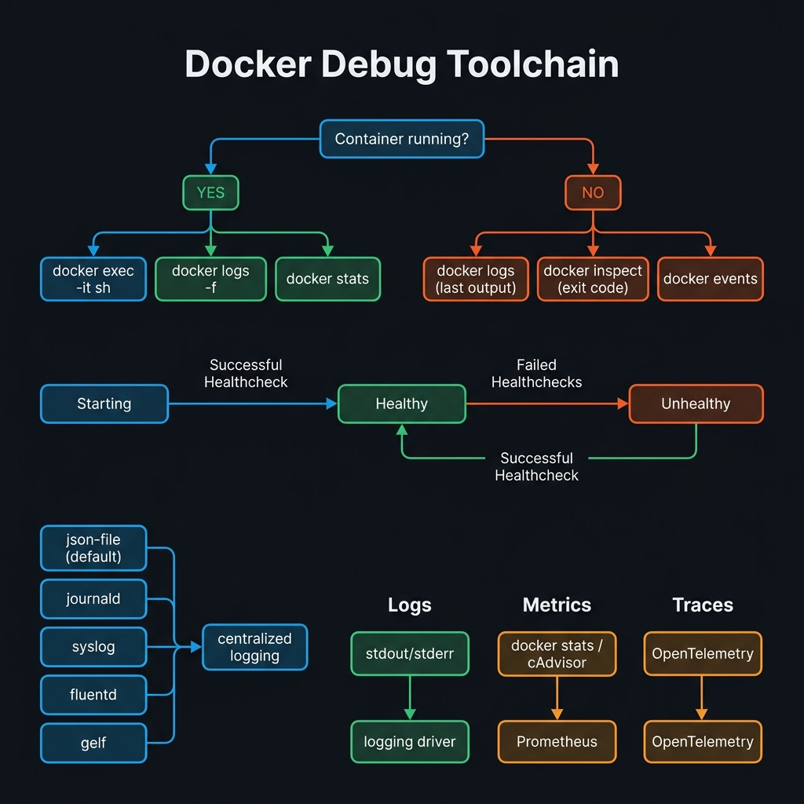
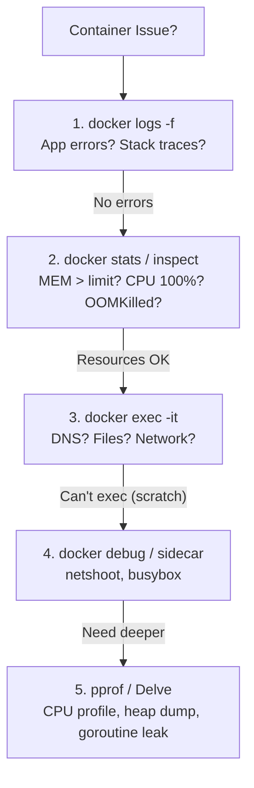
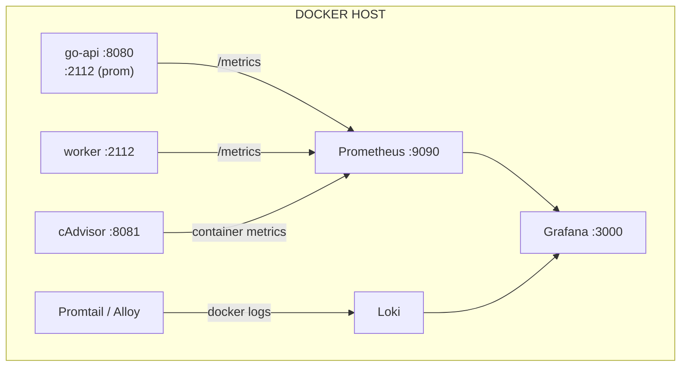

<!-- tags: docker, containerization, debugging -->
# 🔍 Debugging & Monitoring

> Debug running containers, structured logging with slog, Prometheus/OpenTelemetry observability, pprof profiling, Delve remote debugging.

📅 Created: 2026-03-20 · 🔄 Updated: 2026-03-20 · ⏱️ 18 min read

| Aspect           | Detail                                                       |
| ---------------- | ------------------------------------------------------------ |
| **Tools**        | docker logs, exec, stats, pprof, Delve, cAdvisor, Prometheus |
| **Use case**     | Debug runtime issues, observability, performance profiling   |
| **Go relevance** | slog structured logging, pprof, OpenTelemetry, Delve         |
| **CLI**          | `docker logs`, `docker exec`, `docker stats`, `docker debug` |

---

## 1. DEFINE

A container dying in production rarely gives you the luxury to "try a few commands and see." This debugging and monitoring lane exists for those moments when logs, metrics, exec, and pprof must coordinate fast enough to assist the on-call engineer.


### Debug Commands

| Command          | Description                | Use case                 | Key flags                     |
| ---------------- | ------------------------- | ------------------------ | ----------------------------- |
| `docker logs`    | Container stdout/stderr   | Application logs         | `--since`, `--tail`, `-f`     |
| `docker exec`    | Run command in container  | Interactive debug        | `-it`, `-u root`              |
| `docker inspect` | Container metadata        | Config, network, mounts  | `--format` Go template        |
| `docker stats`   | Live resource usage       | Memory/CPU monitoring    | `--no-stream`, `--format`     |
| `docker top`     | Process list              | Check running processes  |                               |
| `docker diff`    | Filesystem changes        | What files changed       | C=changed, A=added, D=deleted |
| `docker cp`      | Copy files in/out         | Extract logs, configs    | Bidirectional                 |
| `docker events`  | Docker daemon events      | System-level debug       | `--filter`, `--since`         |
| `docker debug`   | Debug shell for any image | Scratch/distroless debug | Docker Desktop required       |

### Healthcheck States

| State       | Description                                  | Transition              |
| ----------- | -------------------------------------------- | ----------------------- |
| `starting`  | Container starting, healthcheck not yet passed | → healthy or unhealthy |
| `healthy`   | Healthcheck passed ✅                         | Continuous checking     |
| `unhealthy` | Healthcheck failed (retries exhausted)        | Trigger restart policy  |

### Logging Drivers

| Driver      | Description              | Use case               |
| ----------- | ----------------------- | ---------------------- |
| `json-file` | Default, JSON format    | Dev, small deployments |
| `local`     | Optimized binary format | Better disk usage      |
| `syslog`    | System syslog           | Traditional Linux      |
| `journald`  | systemd journal         | systemd hosts          |
| `fluentd`   | Forward to Fluentd      | Log aggregation        |
| `awslogs`   | CloudWatch              | AWS deployments        |
| `gcplogs`   | Cloud Logging           | GCP deployments        |

### Observability Pillars

| Pillar        | Tool                   | Go Library                 |
| ------------- | ---------------------- | -------------------------- |
| **Logs**      | ELK/Loki + Grafana     | `log/slog` (stdlib)        |
| **Metrics**   | Prometheus + Grafana   | `prometheus/client_golang` |
| **Traces**    | Jaeger/Tempo + Grafana | `go.opentelemetry.io/otel` |
| **Profiling** | Pyroscope/pprof        | `net/http/pprof` (stdlib)  |

### Failure Modes

| Error                     | Cause                          | Diagnosis                                                      | Fix                      |
| ------------------------- | ------------------------------ | -------------------------------------------------------------- | ------------------------ |
| Container restart loop    | App crash, OOMKilled           | `docker logs`, `docker inspect --format '{{.State.ExitCode}}'` | Fix app, increase memory |
| Cannot exec into scratch  | No shell in image              | `docker debug` or sidecar                                      | Use ephemeral container  |
| Logs too large            | No log rotation                | `du -sh /var/lib/docker/containers/`                           | `--log-opt max-size=10m` |
| High memory, no OOM       | Memory leak                    | pprof heap profile                                             | `go tool pprof`          |
| Exit code 137             | SIGKILL (OOM or docker kill)   | `dmesg \| grep oom`, `docker inspect`                          | Increase `--memory`      |
| Exit code 143             | SIGTERM (docker stop)          | Normal — graceful shutdown                                     | Not a bug                |

---

Those failure modes sound easy to avoid. But there is a trap: unstructured docker logs make grep filtering difficult, and exec into a production container creates a security risk. That trap appears in PITFALLS.

## 2. VISUAL

The theory sounds fine on paper. The visual below pulls it into the real operational context, where latency, failure, and ownership are no longer abstract.



### Debug Workflow



*Figure: Systematic debug escalation — start with logs, move through resource inspection, interactive exec, sidecar debugging, and finally Go-specific profiling.*

### Observability Architecture



*Figure: Three observability pillars — Prometheus scrapes metrics, Promtail ships logs to Loki, cAdvisor reports container resources. Grafana unifies all dashboards.*

---

## 3. CODE

The flow above gives you intuition. The section below is what the team will copy, review, and own when it hits a real environment.


### Example 1: Basic — Logs, Exec & Stats Deep Dive

> **Goal**: Master docker debug commands for Go containers.
> **Requires**: Running container.
> **Result**: Systematic debugging workflow.

```bash
# ═══════════════════════════════════════════
# 1. Docker Logs — advanced usage
# ═══════════════════════════════════════════

# ✅ View all logs
docker logs go-api

# ✅ Stream logs real-time
docker logs go-api -f

# ✅ Last 50 lines
docker logs go-api --tail 50

# ✅ Since timestamp or duration
docker logs go-api --since 5m
docker logs go-api --since "2024-06-15T10:00:00Z"
docker logs go-api --since 5m --until 2m      # Window: 5m ago → 2m ago

# ✅ Filter with grep
docker logs go-api 2>&1 | grep "ERROR"
docker logs go-api 2>&1 | grep -E "(ERROR|WARN|panic)"

# ✅ JSON parsing (if using structured logging)
docker logs go-api 2>&1 | jq -r 'select(.level=="ERROR") | "\(.time) \(.msg)"'

# ✅ Count errors per minute
docker logs go-api --since 1h 2>&1 | \
    jq -r '.time[:16]' | sort | uniq -c | sort -rn | head -20

# ═══════════════════════════════════════════
# 2. Docker Exec — interactive debugging
# ═══════════════════════════════════════════

# ✅ Shell access
docker exec -it go-api sh            # Alpine
docker exec -it go-api bash          # Debian/Ubuntu

# ✅ Environment variables
docker exec go-api env | sort

# ✅ DNS resolution test
docker exec go-api nslookup postgres
docker exec go-api getent hosts postgres

# ✅ Network connectivity
docker exec go-api wget -qO- http://postgres:5432 || echo "Connection check"
docker exec go-api nc -zv redis 6379

# ✅ File system inspection
docker exec go-api ls -la /app/
docker exec go-api cat /etc/resolv.conf
docker exec go-api df -h

# ✅ Process inspection
docker exec go-api ps aux
docker top go-api

# ═══════════════════════════════════════════
# 3. Docker Stats — resource monitoring
# ═══════════════════════════════════════════

# ✅ Live stats (all containers)
docker stats

# ✅ Single container, custom format
docker stats go-api --format "table {{.Name}}\t{{.CPUPerc}}\t{{.MemUsage}}\t{{.MemPerc}}\t{{.NetIO}}\t{{.BlockIO}}\t{{.PIDs}}"

# ✅ One-shot (for scripting)
docker stats --no-stream --format '{{.Name}}: CPU={{.CPUPerc}}, MEM={{.MemUsage}}'

# ✅ Detect memory leak (track over time)
while true; do
    docker stats --no-stream --format '{{.MemUsage}}' go-api
    sleep 10
done | tee mem-tracking.log

# ═══════════════════════════════════════════
# 4. Docker Inspect — deep metadata
# ═══════════════════════════════════════════

# ✅ Exit code (137=OOM, 143=SIGTERM, 1=app error)
docker inspect go-api --format '{{.State.ExitCode}}'

# ✅ OOMKilled?
docker inspect go-api --format '{{.State.OOMKilled}}'

# ✅ IP address
docker inspect go-api --format '{{range .NetworkSettings.Networks}}{{.IPAddress}}{{end}}'

# ✅ All environment variables
docker inspect go-api --format '{{json .Config.Env}}' | jq -r '.[]'

# ✅ Volume mounts
docker inspect go-api --format '{{json .Mounts}}' | jq

# ✅ Healthcheck status & log
docker inspect go-api --format '{{json .State.Health}}' | jq '.Log[-3:]'

# ✅ Container events timeline
docker events --since 30m --filter container=go-api \
    --format '{{.Time}} {{.Action}} {{.Actor.Attributes.exitCode}}'
```

**Result**: Systematic debug workflow from logs → exec → stats → inspect.
**Note**: Exit 137 = OOMKilled or `docker kill`. Check the `OOMKilled` field.

---

Basic debugging is covered. But structured logging needs a format — time to standardize.

### Example 2: Intermediate — Structured Logging (slog) + Go pprof

> **Goal**: Production-grade logging and profiling in Docker.
> **Requires**: Go 1.21+ (slog), pprof.
> **Result**: JSON logs → filterable, pprof → profileable in containers.

```go
// cmd/server/main.go — Structured logging + Observability
package main

import (
	"context"
	"errors"
	"log/slog"
	"net/http"
	_ "net/http/pprof"  // ✅ pprof endpoint
	"os"
	"os/signal"
	"runtime"
	"syscall"
	"time"
)

func main() {
	// ═══════════════════════════════════════════
	// 1. Structured Logging with slog
	// ═══════════════════════════════════════════

	// ✅ JSON handler cho production (parseable by Loki/ELK)
	logLevel := new(slog.LevelVar) // Dynamic level change
	logLevel.Set(slog.LevelInfo)

	handler := slog.NewJSONHandler(os.Stdout, &slog.HandlerOptions{
		Level:     logLevel,
		AddSource: true, // ✅ Include file:line in logs
		ReplaceAttr: func(groups []string, a slog.Attr) slog.Attr {
			// ✅ Rename "time" → "timestamp" for ELK compatibility
			if a.Key == slog.TimeKey {
				a.Key = "timestamp"
			}
			return a
		},
	})

	logger := slog.New(handler)
	slog.SetDefault(logger)

	// ✅ Add static fields (service context)
	logger = logger.With(
		slog.String("service", "go-api"),
		slog.String("version", os.Getenv("APP_VERSION")),
		slog.String("env", os.Getenv("ENV")),
	)

	// ═══════════════════════════════════════════
	// 2. HTTP Server + pprof
	// ═══════════════════════════════════════════

	mux := http.NewServeMux()
	mux.HandleFunc("GET /healthz", func(w http.ResponseWriter, r *http.Request) {
		w.WriteHeader(http.StatusOK)
		w.Write([]byte(`{"status":"healthy"}`))
	})

	mux.HandleFunc("GET /api/users", func(w http.ResponseWriter, r *http.Request) {
		start := time.Now()
		requestID := r.Header.Get("X-Request-ID")

		// ✅ Structured log with request context
		logger.Info("handling request",
			slog.String("method", r.Method),
			slog.String("path", r.URL.Path),
			slog.String("request_id", requestID),
			slog.String("remote_addr", r.RemoteAddr),
		)

		// ... business logic ...
		time.Sleep(50 * time.Millisecond)

		// ✅ Log response with duration
		logger.Info("request completed",
			slog.String("request_id", requestID),
			slog.Duration("duration", time.Since(start)),
			slog.Int("status", http.StatusOK),
		)
		w.Write([]byte(`{"users":[]}`))
	})

	// ✅ Debug endpoint: change log level at runtime
	mux.HandleFunc("PUT /admin/log-level", func(w http.ResponseWriter, r *http.Request) {
		level := r.URL.Query().Get("level")
		switch level {
		case "debug":
			logLevel.Set(slog.LevelDebug)
		case "info":
			logLevel.Set(slog.LevelInfo)
		case "warn":
			logLevel.Set(slog.LevelWarn)
		case "error":
			logLevel.Set(slog.LevelError)
		default:
			http.Error(w, "invalid level", http.StatusBadRequest)
			return
		}
		logger.Info("log level changed", slog.String("new_level", level))
		w.Write([]byte("OK: " + level))
	})

	// ✅ Debug endpoint: runtime stats
	mux.HandleFunc("GET /admin/runtime", func(w http.ResponseWriter, r *http.Request) {
		var m runtime.MemStats
		runtime.ReadMemStats(&m)
		logger.Info("runtime stats",
			slog.Int("goroutines", runtime.NumGoroutine()),
			slog.Uint64("heap_alloc_mb", m.HeapAlloc/1024/1024),
			slog.Uint64("sys_mb", m.Sys/1024/1024),
			slog.Uint64("gc_cycles", uint64(m.NumGC)),
		)
	})

	// ✅ pprof on separate port (security: don't expose on public port)
	go func() {
		pprofMux := http.DefaultServeMux // pprof registers on DefaultServeMux
		logger.Info("pprof server starting", slog.String("addr", ":6060"))
		if err := http.ListenAndServe(":6060", pprofMux); err != nil {
			logger.Error("pprof server failed", slog.Any("error", err))
		}
	}()

	server := &http.Server{
		Addr:         ":8080",
		Handler:      mux,
		ReadTimeout:  15 * time.Second,
		WriteTimeout: 15 * time.Second,
	}

	go func() {
		logger.Info("server starting", slog.String("addr", server.Addr))
		if err := server.ListenAndServe(); !errors.Is(err, http.ErrServerClosed) {
			logger.Error("server error", slog.Any("error", err))
			os.Exit(1)
		}
	}()

	// Graceful shutdown
	quit := make(chan os.Signal, 1)
	signal.Notify(quit, syscall.SIGTERM, syscall.SIGINT)
	sig := <-quit
	logger.Warn("shutting down", slog.String("signal", sig.String()))

	ctx, cancel := context.WithTimeout(context.Background(), 8*time.Second)
	defer cancel()
	server.Shutdown(ctx)
	logger.Info("server stopped")
}
```

```bash
# ═══════════════════════════════════════════
# Docker run with logging config
# ═══════════════════════════════════════════

# ✅ Run with log rotation
docker run -d --name go-api \
    -p 8080:8080 -p 6060:6060 \
    -e APP_VERSION=v1.2.0 \
    -e ENV=production \
    --log-driver json-file \
    --log-opt max-size=10m \
    --log-opt max-file=5 \
    go-api:latest

# ✅ View structured logs
docker logs go-api | jq '.'
# {
#   "timestamp": "2024-06-15T10:30:00.123Z",
#   "level": "INFO",
#   "source": {"function":"main.main.func2","file":"main.go","line":62},
#   "msg": "handling request",
#   "service": "go-api",
#   "version": "v1.2.0",
#   "method": "GET",
#   "path": "/api/users",
#   "request_id": "abc-123"
# }

# ✅ Filter errors only
docker logs go-api 2>&1 | jq 'select(.level=="ERROR")'

# ✅ Slow requests (> 500ms)
docker logs go-api 2>&1 | \
    jq 'select(.msg=="request completed" and .duration > 500000000)'

# ✅ Change log level at runtime (no restart!)
curl -X PUT "http://localhost:8080/admin/log-level?level=debug"

# ═══════════════════════════════════════════
# pprof profiling
# ═══════════════════════════════════════════

# ✅ CPU profile (30 seconds)
go tool pprof http://localhost:6060/debug/pprof/profile?seconds=30

# ✅ Memory (heap) profile
go tool pprof http://localhost:6060/debug/pprof/heap

# ✅ Goroutine dump (detect leaks)
curl -s http://localhost:6060/debug/pprof/goroutine?debug=2 | head -100

# ✅ Interactive web UI
go tool pprof -http=:9090 http://localhost:6060/debug/pprof/heap

# ✅ Compare two heap snapshots (detect leak)
curl -o heap1.pb.gz http://localhost:6060/debug/pprof/heap
# ... wait 5 minutes ...
curl -o heap2.pb.gz http://localhost:6060/debug/pprof/heap
go tool pprof -diff_base=heap1.pb.gz heap2.pb.gz
# (top) shows allocations that grew → potential leak
```

**Result**: JSON structured logs (filterable), runtime log level change, CPU/memory profiling.
**Note**: pprof port (6060) must NOT be exposed publicly. Internal only or port-forward.

---

Structured logging is covered. But observability needs metrics — time to instrument.

### Example 3: Advanced — Prometheus Metrics + Debug Scratch Containers + Docker Compose Monitoring Stack

> **Goal**: Full observability stack: Prometheus metrics, Grafana dashboards, Loki logs, debug distroless.
> **Requires**: Go app, Docker Compose, prometheus/client_golang.
> **Result**: Production-grade monitoring.

```go
// internal/metrics/metrics.go — Prometheus metrics
package metrics

import (
	"github.com/prometheus/client_golang/prometheus"
	"github.com/prometheus/client_golang/prometheus/promauto"
)

var (
	// ✅ HTTP request metrics
	RequestsTotal = promauto.NewCounterVec(prometheus.CounterOpts{
		Name: "http_requests_total",
		Help: "Total HTTP requests",
	}, []string{"method", "path", "status"})

	RequestDuration = promauto.NewHistogramVec(prometheus.HistogramOpts{
		Name:    "http_request_duration_seconds",
		Help:    "HTTP request duration",
		Buckets: []float64{.001, .005, .01, .025, .05, .1, .25, .5, 1, 2.5, 5},
	}, []string{"method", "path"})

	// ✅ Business metrics
	ActiveConnections = promauto.NewGauge(prometheus.GaugeOpts{
		Name: "active_connections",
		Help: "Number of active connections",
	})

	OrdersProcessed = promauto.NewCounterVec(prometheus.CounterOpts{
		Name: "orders_processed_total",
		Help: "Total orders processed",
	}, []string{"status"}) // status: success, failed, timeout

	// ✅ Database metrics
	DBQueryDuration = promauto.NewHistogramVec(prometheus.HistogramOpts{
		Name:    "db_query_duration_seconds",
		Help:    "Database query duration",
		Buckets: []float64{.001, .005, .01, .05, .1, .5, 1, 5},
	}, []string{"query_type"}) // select, insert, update, delete
)
```

```go
// internal/middleware/metrics.go — HTTP middleware
package middleware

import (
	"net/http"
	"strconv"
	"time"
	"myapp/internal/metrics"
)

// ✅ Prometheus metrics middleware
func MetricsMiddleware(next http.Handler) http.Handler {
	return http.HandlerFunc(func(w http.ResponseWriter, r *http.Request) {
		start := time.Now()
		// Wrap ResponseWriter to capture status code
		wrapped := &statusRecorder{ResponseWriter: w, statusCode: 200}

		metrics.ActiveConnections.Inc()
		defer metrics.ActiveConnections.Dec()

		next.ServeHTTP(wrapped, r)

		duration := time.Since(start).Seconds()
		metrics.RequestsTotal.WithLabelValues(
			r.Method, r.URL.Path, strconv.Itoa(wrapped.statusCode),
		).Inc()
		metrics.RequestDuration.WithLabelValues(
			r.Method, r.URL.Path,
		).Observe(duration)
	})
}

type statusRecorder struct {
	http.ResponseWriter
	statusCode int
}

func (r *statusRecorder) WriteHeader(code int) {
	r.statusCode = code
	r.ResponseWriter.WriteHeader(code)
}
```

```yaml
# docker-compose.monitoring.yaml — Full observability stack
services:
    # ✅ Go API with metrics endpoint
    api:
        build: .
        ports:
            - '8080:8080'
            - '6060:6060' # pprof (internal only in prod)
        environment:
            - ENV=development
            - METRICS_PORT=2112
        labels:
            # ✅ Promtail/Alloy auto-discovery
            logging: 'promtail'
            service: 'go-api'

    # ✅ Prometheus — metrics collection
    prometheus:
        image: prom/prometheus:v2.51.0
        volumes:
            - ./monitoring/prometheus.yml:/etc/prometheus/prometheus.yml:ro
            - prometheus_data:/prometheus
        ports:
            - '9090:9090'
        command:
            - '--config.file=/etc/prometheus/prometheus.yml'
            - '--storage.tsdb.retention.time=30d'
            - '--web.enable-lifecycle'

    # ✅ Grafana — dashboards
    grafana:
        image: grafana/grafana:10.4.0
        ports:
            - '3000:3000'
        environment:
            GF_SECURITY_ADMIN_PASSWORD: admin
            GF_INSTALL_PLUGINS: grafana-clock-panel
        volumes:
            - grafana_data:/var/lib/grafana
            - ./monitoring/grafana/dashboards:/etc/grafana/provisioning/dashboards:ro
            - ./monitoring/grafana/datasources:/etc/grafana/provisioning/datasources:ro

    # ✅ Loki — log aggregation
    loki:
        image: grafana/loki:2.9.6
        ports:
            - '3100:3100'
        volumes:
            - loki_data:/loki
        command: -config.file=/etc/loki/local-config.yaml

    # ✅ Promtail — ship docker logs to Loki
    promtail:
        image: grafana/promtail:2.9.6
        volumes:
            - /var/log:/var/log:ro
            - /var/lib/docker/containers:/var/lib/docker/containers:ro
            - ./monitoring/promtail.yml:/etc/promtail/config.yml:ro
        command: -config.file=/etc/promtail/config.yml

    # ✅ cAdvisor — container resource metrics
    cadvisor:
        image: gcr.io/cadvisor/cadvisor:v0.49.1
        ports:
            - '8081:8080'
        volumes:
            - /:/rootfs:ro
            - /var/run:/var/run:ro
            - /sys:/sys:ro
            - /var/lib/docker/:/var/lib/docker:ro
        privileged: true

volumes:
    prometheus_data:
    grafana_data:
    loki_data:
```

```yaml
# monitoring/prometheus.yml
global:
    scrape_interval: 15s
    evaluation_interval: 15s

scrape_configs:
    # ✅ Scrape Go API metrics
    - job_name: 'go-api'
      static_configs:
          - targets: ['api:2112']
      metrics_path: /metrics

    # ✅ Scrape cAdvisor (container metrics)
    - job_name: 'cadvisor'
      static_configs:
          - targets: ['cadvisor:8080']
      metrics_path: /metrics

    # ✅ Scrape Prometheus itself
    - job_name: 'prometheus'
      static_configs:
          - targets: ['localhost:9090']
```

```bash
# ═══════════════════════════════════════════
# Debug scratch/distroless containers
# ═══════════════════════════════════════════

# ❌ Cannot exec — no shell
docker exec -it go-api sh
# OCI runtime exec failed: "sh": not found

# ✅ Method 1: Docker debug (Docker Desktop)
docker debug go-api
# Attaches shell with tools: vim, curl, strace, tcpdump, etc.

# ✅ Method 2: Sidecar debug container (same network + PID namespace)
docker run -it --rm \
    --name debugger \
    --network container:go-api \
    --pid container:go-api \
    nicolaka/netshoot \
    bash

# Inside debugger:
curl localhost:8080/healthz          # ✅ Same network namespace
ps aux                                # ✅ See go-api process
ss -tlnp                              # ✅ See listening ports
tcpdump -i eth0 port 8080 -A         # ✅ Capture traffic
strace -p 1 -e trace=network         # ✅ System call tracing

# ✅ Method 3: docker compose sidecar
# Add to docker-compose.yaml:
#   debug:
#     image: nicolaka/netshoot
#     network_mode: "service:api"
#     pid: "service:api"
#     profiles: ["debug"]
#     command: sleep infinity

docker compose --profile debug up -d debug
docker compose exec debug bash

# ✅ Method 4: nsenter from host (Linux only)
PID=$(docker inspect -f '{{.State.Pid}}' go-api)
nsenter -t $PID -n curl http://localhost:8080/healthz         # Network ns
nsenter -t $PID -n -p ps aux                                   # PID + Network ns

# ═══════════════════════════════════════════
# Delve remote debugging
# ═══════════════════════════════════════════

# ✅ Dockerfile.debug — build with debug symbols
# FROM golang:1.22-alpine AS builder
# RUN go install github.com/go-delve/delve/cmd/dlv@latest
# RUN CGO_ENABLED=0 go build -gcflags="all=-N -l" -o /app/server ./cmd/server
#
# FROM golang:1.22-alpine
# COPY --from=builder /go/bin/dlv /dlv
# COPY --from=builder /app/server /server
# EXPOSE 8080 2345
# CMD ["/dlv", "--listen=:2345", "--headless=true", "--api-version=2", "exec", "/server"]

docker build -f Dockerfile.debug -t go-api:debug .
docker run -d --name go-debug -p 8080:8080 -p 2345:2345 \
    --security-opt seccomp=unconfined \
    go-api:debug

# ✅ Connect from VS Code (launch.json)
# {
#   "type": "go",
#   "request": "attach",
#   "name": "Docker Remote Debug",
#   "mode": "remote",
#   "remotePath": "/app",
#   "port": 2345,
#   "host": "127.0.0.1"
# }
```

```bash
# ═══════════════════════════════════════════
# Start full monitoring stack
# ═══════════════════════════════════════════

# ✅ Start core + monitoring
docker compose -f docker-compose.yaml -f docker-compose.monitoring.yaml up -d

# ✅ Access dashboards
# Grafana:    http://localhost:3000 (admin/admin)
# Prometheus: http://localhost:9090
# cAdvisor:   http://localhost:8081

# ✅ Useful Prometheus queries (PromQL)
# Request rate:         rate(http_requests_total[5m])
# Error rate:           rate(http_requests_total{status=~"5.."}[5m])
# P99 latency:          histogram_quantile(0.99, rate(http_request_duration_seconds_bucket[5m]))
# Container memory:     container_memory_usage_bytes{name="go-api"}
# Container CPU:        rate(container_cpu_usage_seconds_total{name="go-api"}[5m])
```

**Result**: Full observability: Prometheus metrics, Grafana dashboards, Loki logs, cAdvisor, debug distroless containers.
**Note**: cAdvisor needs `privileged: true`. Production: use Prometheus Operator on K8s.

---

You have covered debugging, logging, and metrics. Now comes the dangerous part: unstructured logs and exec security — the trap set up from the beginning.

## 4. PITFALLS

Production rarely breaks because you do not know a concept's name. It breaks because of wrong assumptions and blindly trusted defaults. The pitfalls below are the most expensive slips.

| #   | Mistake                            | Consequence                                 | Fix                                                                |
| --- | ---------------------------------- | ------------------------------------------- | ------------------------------------------------------------------ |
| 1   | Logs too large → disk full         | Disk full, container cannot start           | `--log-opt max-size=10m --log-opt max-file=5`                      |
| 2   | exec fails on scratch/distroless   | Cannot debug runtime issues                 | Docker debug, sidecar with `nicolaka/netshoot`                     |
| 3   | pprof exposed to public internet   | Memory/CPU profile leaked, attack surface   | Bind pprof to internal port only, NetworkPolicy, separate mux      |
| 4   | Structured logs but text format    | Cannot parse with Loki/ELK                  | Use `slog.NewJSONHandler()` for production, `TextHandler` for dev  |
| 5   | Goroutine leak undetected          | Memory grows slowly, eventual OOM           | `runtime.NumGoroutine()` metric + pprof goroutine endpoint         |
| 6   | Container exit 137 — no logs       | Lost debug context, unknown cause           | OOM killed → `docker inspect --format '{{.State.OOMKilled}}'`      |
| 7   | Prometheus cardinality explosion   | Slow queries, memory explosion              | Avoid high-cardinality labels (user_id, request_id)                |
| 8   | Delve running in production        | Exposed debug port, security risk           | Use only for dev/staging. Production uses pprof                    |

---

You have covered Debugging & Monitoring and the traps. The resources below help go deeper.

## 5. REF

| Resource             | Link                                                                                                                |
| -------------------- | ------------------------------------------------------------------------------------------------------------------- |
| Docker Debug         | [docs.docker.com/reference/cli/docker/debug](https://docs.docker.com/reference/cli/docker/debug/)                   |
| Container Logging    | [docs.docker.com/config/containers/logging](https://docs.docker.com/config/containers/logging/)                     |
| Go slog              | [pkg.go.dev/log/slog](https://pkg.go.dev/log/slog)                                                                  |
| Go pprof             | [pkg.go.dev/net/http/pprof](https://pkg.go.dev/net/http/pprof)                                                      |
| Prometheus Go client | [pkg.go.dev/github.com/prometheus/client_golang](https://pkg.go.dev/github.com/prometheus/client_golang/prometheus) |
| Netshoot             | [github.com/nicolaka/netshoot](https://github.com/nicolaka/netshoot)                                                |
| cAdvisor             | [github.com/google/cadvisor](https://github.com/google/cadvisor)                                                    |
| Grafana Loki         | [grafana.com/docs/loki](https://grafana.com/docs/loki/latest/)                                                      |

---

## 6. RECOMMEND

After this article, read the topic closest to your current decision so the production mental model does not fragment.

| Next step          | When                   | Reason                           |
| ------------------ | ---------------------- | -------------------------------- |
| **Pyroscope**      | Continuous profiling   | Always-on pprof, flame graphs    |
| **OpenTelemetry**  | Distributed tracing    | Traces across microservices      |
| **Grafana Alloy**  | Log/metrics collector  | Replaces Promtail, modern agent  |
| **Delve**          | Step-through debugging | Breakpoints, variable inspection |
| **Portainer**      | Docker management UI   | Visual container management      |
| **Loki + LogQL**   | Advanced log queries   | Filter by service, level, field  |

---

**Links**: [← Registry & CI/CD](./06-registry-cicd.md) · [→ Production](./08-production.md)
