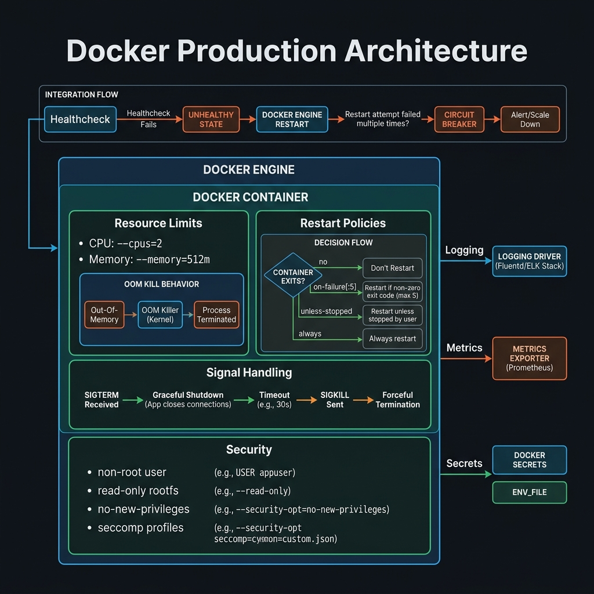
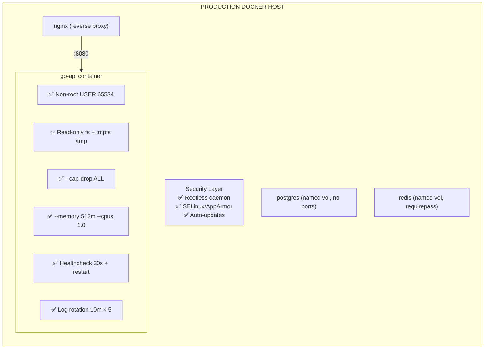

<!-- tags: docker, containerization, production -->
# 🏭 Production Best Practices

> Production readiness checklist — resource limits, rootless, restart policies, graceful shutdown.

📅 Created: 2026-03-20 · 🔄 Updated: 2026-04-20 · ⏱️ 14 min read

| Aspect           | Detail                                   |
| ---------------- | ---------------------------------------- |
| **Focus**        | Security, reliability, performance       |
| **Use case**     | Docker production deployments            |
| **Go relevance** | Graceful shutdown, signal handling       |
| **CLI**          | `docker run --memory --cpus --read-only` |

---

## 1. DEFINE

A container that runs successfully does not mean it is production-ready. When signal handling, restart policies, resource limits, and non-root execution start to matter, you realize that "docker run succeeded" is only the starting point.


### Production Checklist

| Category    | Practice                          | Priority     |
| ----------- | --------------------------------- | ------------ |
| **Image**   | Multi-stage build, distroless     | 🔴 Critical  |
| **Image**   | Non-root user (USER 65534)        | 🔴 Critical  |
| **Image**   | Scan CVEs (Trivy/Scout)           | 🔴 Critical  |
| **Image**   | Sign image (Cosign)               | 🟡 Important |
| **Runtime** | Resource limits (memory/CPU)      | 🔴 Critical  |
| **Runtime** | Read-only filesystem              | 🟡 Important |
| **Runtime** | Drop all capabilities             | 🟡 Important |
| **Runtime** | Health checks                     | 🔴 Critical  |
| **Runtime** | Restart policy                    | 🔴 Critical  |
| **Runtime** | Log rotation                      | 🔴 Critical  |
| **App**     | Graceful shutdown                 | 🔴 Critical  |
| **App**     | Signal handling (SIGTERM)         | 🔴 Critical  |
| **App**     | Environment-based config          | 🟡 Important |
| **Network** | No unnecessary ports              | 🟡 Important |
| **Data**    | Named volumes for persistent data | 🔴 Critical  |
| **Data**    | Backup strategy                   | 🔴 Critical  |

### Restart Policies

| Policy             | Description                      | Use case             |
| ------------------ | -------------------------------- | -------------------- |
| `no`               | Never restart                    | One-shot tasks       |
| `on-failure[:max]` | Restart on non-zero exit         | Workers with backoff |
| `unless-stopped`   | Always, except manual stop       | ✅ Most services     |
| `always`           | Always restart, even manual stop | Critical services    |

### Signal Handling

| Signal    | Docker action            | App should               |
| --------- | ------------------------ | ------------------------ |
| `SIGTERM` | `docker stop` (default)  | Graceful shutdown        |
| `SIGKILL` | After grace period (10s) | Force kill               |
| `SIGHUP`  | Reload config            | Re-read config files     |
| `SIGUSR1` | Custom                   | Log rotation, debug dump |

### Failure Modes

| Error              | Cause                          | Fix                             |
| ------------------ | ------------------------------ | ------------------------------- |
| OOMKilled          | Memory limit exceeded          | Increase limit or fix leak      |
| Container exit 137 | SIGKILL (OOM or docker kill)   | Check memory, graceful shutdown |
| Container exit 143 | SIGTERM (docker stop)          | Normal graceful shutdown        |
| Restart loop       | App crash immediately          | Check logs, fix root cause      |

---

Those failure modes sound basic. But there is a trap: a container without a restart policy means downtime on crash, and no memory limit means the host OOM killer takes over. That trap appears in PITFALLS.

## 2. VISUAL

The definition locked the vocabulary. The visual below shows the actual production layout where security, resource limits, and reliability controls interact.



### Production Architecture



*Figure: A production container carries security, resource, reliability, and logging controls. No shortcut is optional.*

---

## 3. CODE

Code and config show how the decisions discussed above are enforced by real constraints, not just a nice diagram.


### Example 1: Basic — Graceful Shutdown in Go

> **Goal**: Go app handles SIGTERM from Docker correctly.
> **Requires**: Go HTTP server.
> **Result**: Zero-downtime deployments.

```go
// cmd/server/main.go — Production Go server
package main

import (
	"context"
	"errors"
	"log"
	"net/http"
	"os"
	"os/signal"
	"syscall"
	"time"
)

func main() {
	// ✅ Application setup
	mux := http.NewServeMux()
	mux.HandleFunc("/healthz", healthHandler)
	mux.HandleFunc("/readyz", readyHandler)
	mux.HandleFunc("/", appHandler)

	server := &http.Server{
		Addr:         ":8080",
		Handler:      mux,
		ReadTimeout:  15 * time.Second,
		WriteTimeout: 15 * time.Second,
		IdleTimeout:  60 * time.Second,
	}

	// ✅ Start server in goroutine
	go func() {
		log.Printf("🚀 Server starting on %s", server.Addr)
		if err := server.ListenAndServe(); !errors.Is(err, http.ErrServerClosed) {
			log.Fatalf("❌ Server error: %v", err)
		}
		log.Println("Server stopped serving new requests")
	}()

	// ✅ Wait for SIGTERM (docker stop) or SIGINT (Ctrl+C)
	quit := make(chan os.Signal, 1)
	signal.Notify(quit, syscall.SIGTERM, syscall.SIGINT)
	sig := <-quit
	log.Printf("⚠️  Received signal: %s. Shutting down...", sig)

	// ✅ Graceful shutdown with timeout
	// Docker sends SIGTERM, waits 10s, then SIGKILL
	// Our shutdown should complete within that window
	ctx, cancel := context.WithTimeout(context.Background(), 8*time.Second)
	defer cancel()

	// ✅ Stop accepting new connections, finish in-flight requests
	if err := server.Shutdown(ctx); err != nil {
		log.Printf("❌ Forced shutdown: %v", err)
	}

	// ✅ Close database connections, flush buffers
	log.Println("🧹 Cleaning up resources...")
	// db.Close()
	// cache.Close()
	// producer.Close()

	log.Println("✅ Server shut down gracefully")
}

var ready = true

func healthHandler(w http.ResponseWriter, r *http.Request) {
	w.WriteHeader(http.StatusOK)
	w.Write([]byte(`{"status":"healthy"}`))
}

func readyHandler(w http.ResponseWriter, r *http.Request) {
	if !ready {
		w.WriteHeader(http.StatusServiceUnavailable)
		return
	}
	w.WriteHeader(http.StatusOK)
}

func appHandler(w http.ResponseWriter, r *http.Request) {
	// Simulate work
	time.Sleep(100 * time.Millisecond)
	w.Write([]byte("Hello from production!"))
}
```

```dockerfile
# ✅ Docker STOPSIGNAL
FROM gcr.io/distroless/static-debian12
COPY --from=builder /app/server /server
USER 65534:65534

# ✅ Tell Docker to send SIGTERM (default, but explicit)
STOPSIGNAL SIGTERM

EXPOSE 8080
ENTRYPOINT ["/server"]
```

```bash
# ✅ Docker stop sends SIGTERM, waits 10s, then SIGKILL
docker stop go-api             # Default: 10s grace period
docker stop -t 30 go-api       # Custom: 30s grace period

# ✅ Verify graceful shutdown
docker logs go-api --tail 5
# ⚠️  Received signal: terminated. Shutting down...
# 🧹 Cleaning up resources...
# ✅ Server shut down gracefully
```

**Result**: Zero dropped requests during shutdown.
**Note**: Shutdown timeout must be less than Docker stop timeout (8s < 10s default).

---

Production basics are covered. But resource limits need cgroup enforcement — time to cap.

### Example 2: Intermediate — Docker Run Production Flags

> **Goal**: All production flags in one docker run command.
> **Requires**: Hardened image.
> **Result**: Secure, resource-limited container.

```bash
# ✅ Production docker run
docker run -d \
  --name go-api \
  \
  # === Security ===
  --read-only \                        # Read-only root filesystem
  --tmpfs /tmp:rw,noexec,nosuid,size=50m \  # Writable temp only
  --cap-drop ALL \                     # Drop ALL Linux capabilities
  --security-opt no-new-privileges:true \  # No privilege escalation
  --security-opt seccomp=default \     # Enable seccomp
  --user 65534:65534 \                 # Non-root
  \
  # === Resources ===
  --memory 512m \                      # Memory limit
  --memory-swap 512m \                 # No swap (memory == memory-swap)
  --cpus 1.0 \                         # CPU limit
  --pids-limit 100 \                   # Process limit
  --ulimit nofile=65535:65535 \        # File descriptor limit
  \
  # === Reliability ===
  --restart unless-stopped \           # Auto-restart
  --stop-timeout 15 \                  # SIGTERM grace period
  --health-cmd "/server healthcheck" \
  --health-interval 30s \
  --health-timeout 5s \
  --health-start-period 10s \
  --health-retries 3 \
  \
  # === Logging ===
  --log-driver json-file \
  --log-opt max-size=10m \             # Max 10MB per log file
  --log-opt max-file=5 \              # Keep 5 rotated files
  --log-opt tag="go-api|{{.ID}}" \
  \
  # === Network ===
  --network app-network \
  -p 127.0.0.1:8080:8080 \            # Bind localhost only
  \
  # === Environment ===
  --env-file .env.production \
  \
  go-api:v1.2.0
```

```yaml
# docker-compose.prod.yaml — Same as above in Compose
services:
    api:
        image: ghcr.io/myorg/go-api:${VERSION}
        read_only: true
        tmpfs:
            - /tmp:size=50m
        cap_drop:
            - ALL
        security_opt:
            - no-new-privileges:true
        deploy:
            resources:
                limits:
                    memory: 512M
                    cpus: '1.0'
                    pids: 100
                reservations:
                    memory: 128M
                    cpus: '0.25'
        restart: unless-stopped
        stop_grace_period: 15s
        healthcheck:
            test: ['/server', 'healthcheck']
            interval: 30s
            timeout: 5s
            start_period: 10s
            retries: 3
        logging:
            driver: json-file
            options:
                max-size: '10m'
                max-file: '5'
        ports:
            - '127.0.0.1:8080:8080'
        env_file:
            - .env.production
        networks:
            - backend
```

**Result**: Hardened, resource-limited, auto-restart, monitored container.

---

Resource limits are covered. But graceful shutdown needs a SIGTERM handler — time to catch signals.

### Example 3: Advanced — Zero-downtime Deployment

> **Goal**: Deploy a new version without dropping requests.
> **Requires**: Nginx + Docker Compose.
> **Result**: Blue-green deployment with Docker.

```bash
#!/bin/bash
# deploy.sh — Zero-downtime deployment script
set -e

NEW_VERSION=${1:?Usage: deploy.sh v1.2.0}
SERVICE="api"
COMPOSE_FILE="docker-compose.prod.yaml"

echo "🚀 Deploying $SERVICE:$NEW_VERSION..."

# ✅ Step 1: Pull new image
export VERSION=$NEW_VERSION
docker compose -f $COMPOSE_FILE pull $SERVICE

# ✅ Step 2: Scale up (2 instances temporarily)
docker compose -f $COMPOSE_FILE up -d --scale $SERVICE=2 --no-recreate

# ✅ Step 3: Wait for new container to be healthy
echo "⏳ Waiting for new container to be healthy..."
sleep 10
HEALTHY=$(docker compose -f $COMPOSE_FILE ps $SERVICE --format json | jq -r '.Health' | grep -c "healthy")
if [ "$HEALTHY" -lt 2 ]; then
    echo "❌ New container not healthy. Aborting."
    docker compose -f $COMPOSE_FILE up -d --scale $SERVICE=1
    exit 1
fi

# ✅ Step 4: Scale down old container
docker compose -f $COMPOSE_FILE up -d --scale $SERVICE=1

# ✅ Step 5: Verify
echo "✅ Deployed $SERVICE:$NEW_VERSION"
docker compose -f $COMPOSE_FILE ps $SERVICE
```

---

You have covered production, resource limits, and graceful shutdown. Now comes the dangerous part: missing restart policy and OOM — the trap set up from the beginning.

## 4. PITFALLS

Knowing how to do it right is only half the story. The other half is the places where it is easy to get almost right and pay the price when the cluster or OS shakes.

| #   | Mistake                              | Consequence                                  | Fix                                               |
| --- | ------------------------------------ | -------------------------------------------- | ------------------------------------------------- |
| 1   | Docker stop → SIGKILL (no graceful)  | In-flight requests dropped, data corruption  | Handle SIGTERM, shutdown < 10s                    |
| 2   | OOMKilled (exit 137)                 | App crashes suddenly, no cleanup             | Increase `--memory` or fix memory leak            |
| 3   | Restart loop                         | Container wastes resources, cascade failure  | Check exit code, fix root cause before restart    |
| 4   | Logs fill entire disk                | Host disk full, host crash                   | `max-size=10m`, `max-file=5`                      |
| 5   | `--read-only` breaks app             | App crashes when writing temp files          | `--tmpfs /tmp` for temp files                     |
| 6   | `127.0.0.1:8080:8080` unreachable    | Service unreachable from outside             | Local access only, use reverse proxy              |

---

You have covered Production Docker and the traps. The resources below help go deeper.

## 5. REF

| Resource             | Link                                                                                                                      |
| -------------------- | ------------------------------------------------------------------------------------------------------------------------- |
| Docker Security      | [docs.docker.com/engine/security](https://docs.docker.com/engine/security/)                                               |
| Resource Constraints | [docs.docker.com/config/containers/resource_constraints](https://docs.docker.com/config/containers/resource_constraints/) |
| Go Graceful Shutdown | [pkg.go.dev/net/http#Server.Shutdown](https://pkg.go.dev/net/http#Server.Shutdown)                                        |
| Docker Healthcheck   | [docs.docker.com/reference/dockerfile/#healthcheck](https://docs.docker.com/reference/dockerfile/#healthcheck)            |

---

## 6. RECOMMEND

After this article, read the topic closest to your current decision so the production mental model does not fragment.

| Next step           | When                   | Reason                       |
| ------------------- | ---------------------- | ---------------------------- |
| **Rootless Docker** | Maximum security       | No root daemon               |
| **Podman**          | Rootless alternative   | Daemonless, systemd native   |
| **Watchtower**      | Auto-update containers | Pull latest images           |
| **Traefik**         | Dynamic reverse proxy  | Auto-discover, Let's Encrypt |
| **Docker Swarm**    | Simple orchestration   | Built-in, no K8s needed      |

---

**Links**: [← Debugging](./07-debugging-monitoring.md) · [← README](./README.md)
