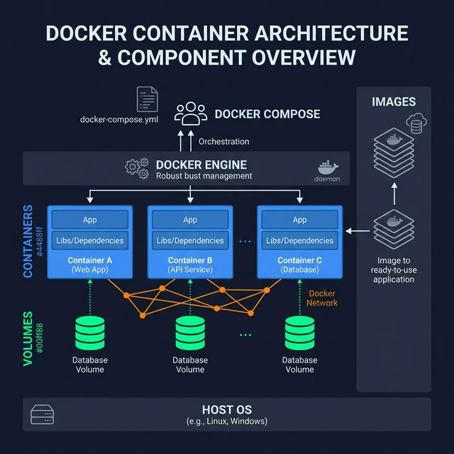
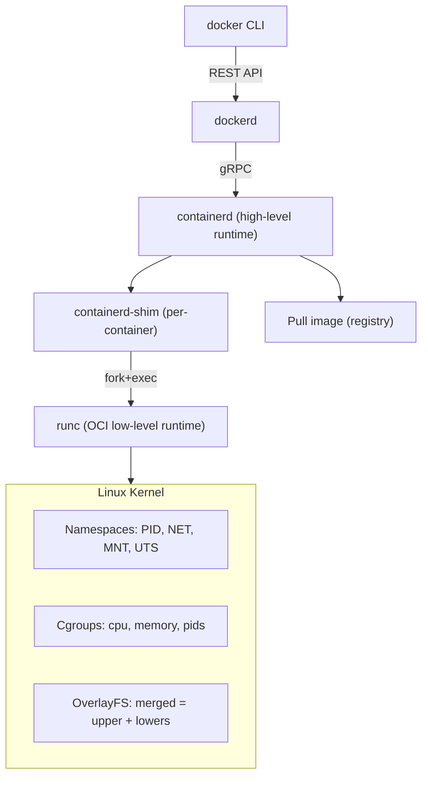

<!-- tags: docker, containerization -->
# ⚙️ Docker Internals & Architecture

> Understand Docker from the inside — OCI, containerd, runc, namespaces, cgroups, UnionFS, BuildKit.

📅 Created: 2026-03-20 · 🔄 Updated: 2026-04-20 · ⏱️ 16 min read

| Aspect           | Detail                                                       |
| ---------------- | ------------------------------------------------------------ |
| **Concept**      | OCI spec, container runtime, image layers                    |
| **Components**   | Docker Engine, containerd, runc, BuildKit                    |
| **Linux kernel** | namespaces, cgroups, OverlayFS, seccomp                      |
| **Relevance**    | Debug production issues, optimize builds, security hardening |

---

## 1. DEFINE

Docker looks smooth at the CLI layer until you have to explain what actually runs a container under the kernel. This internals article exists to pull containerd, runc, namespaces, and cgroups out of that fog.


### Docker Architecture Stack

| Layer                              | Component    | Role                                          |
| ---------------------------------- | ------------ | --------------------------------------------- |
| **Client**                         | `docker` CLI | Sends commands via REST API                   |
| **Daemon**                         | `dockerd`    | Manages images, containers, networks, volumes |
| **Container runtime** (high-level) | `containerd` | Lifecycle management, image distribution      |
| **Container runtime** (low-level)  | `runc`       | Executes container per OCI spec               |
| **Build engine**                   | BuildKit     | Parallel builds, caching, multi-platform      |

### OCI Specifications

| Spec                      | Description                               | File/Format                               |
| ------------------------- | ----------------------------------------- | ----------------------------------------- |
| **OCI Image Spec**        | How to package filesystem layers + metadata | `manifest.json`, layer tarballs           |
| **OCI Runtime Spec**      | How to run a container (config.json)      | `config.json` — namespaces, mounts, hooks |
| **OCI Distribution Spec** | How to push/pull images from registry     | HTTP API (manifest, blobs)                |

### Linux Namespaces (Isolation)

| Namespace  | Flag              | Isolates                    | Example                        |
| ---------- | ----------------- | --------------------------- | ------------------------------ |
| **PID**    | `CLONE_NEWPID`    | Process tree                | PID 1 inside container         |
| **NET**    | `CLONE_NEWNET`    | Network stack               | Own IP, routing, ports         |
| **MNT**    | `CLONE_NEWNS`     | Filesystem mounts           | Own root filesystem            |
| **UTS**    | `CLONE_NEWUTS`    | Hostname                    | Container gets own hostname    |
| **IPC**    | `CLONE_NEWIPC`    | Inter-process communication | Shared memory isolation        |
| **USER**   | `CLONE_NEWUSER`   | User/Group IDs              | Root inside = non-root outside |
| **CGROUP** | `CLONE_NEWCGROUP` | Cgroup visibility           | Container sees only own cgroup |

### Cgroups (Resource Control)

| Controller | Controls            | Docker flags                                            |
| ---------- | ------------------- | ------------------------------------------------------- |
| **cpu**    | CPU time allocation | `--cpus`, `--cpu-shares`, `--cpu-period`, `--cpu-quota` |
| **memory** | Memory limits       | `--memory`, `--memory-swap`, `--memory-reservation`     |
| **pids**   | Number of processes | `--pids-limit`                                          |
| **blkio**  | Block I/O bandwidth | `--device-read-bps`, `--device-write-bps`               |
| **cpuset** | CPU pinning         | `--cpuset-cpus`, `--cpuset-mems`                        |

### Image Layer Filesystem

| Concept                 | Description                                        |
| ----------------------- | -------------------------------------------------- |
| **Layer**               | Each Dockerfile instruction creates a read-only layer |
| **UnionFS/OverlayFS**   | Stacks layers into one unified view                |
| **upperdir**            | Writable layer (container's changes)               |
| **lowerdir**            | Read-only layers (image layers)                    |
| **merged**              | Final merged view presented to container           |
| **whiteout**            | Special file marking deleted files in lower layers |
| **Copy-on-Write (CoW)** | File copied to upperdir only when modified         |

### Security Mechanisms

| Mechanism             | Description                       | Docker config                         |
| --------------------- | --------------------------------- | ------------------------------------- |
| **Seccomp**           | System call filtering             | `--security-opt seccomp=profile.json` |
| **AppArmor**          | Mandatory access control (Ubuntu) | `--security-opt apparmor=profile`     |
| **SELinux**           | Mandatory access control (RHEL)   | `--security-opt label=type:...`       |
| **Capabilities**      | Fine-grained root permissions     | `--cap-add`, `--cap-drop`             |
| **Read-only rootfs**  | Immutable container filesystem    | `--read-only`                         |
| **No-new-privileges** | Prevent privilege escalation      | `--security-opt no-new-privileges`    |

---

Those concepts sound familiar. But there is a trap: misunderstanding namespaces leads to treating containers as VMs, and wrong cgroup v2 config breaks resource isolation. That trap appears in PITFALLS.

## 2. VISUAL

The definition locked the vocabulary. The visual below shows the actual runtime flow where the CLI, daemon, containerd, runc, and kernel primitives interact.



*Figure: Docker architecture stack — CLI sends REST to dockerd, which delegates to containerd for lifecycle management, then runc for OCI-compliant container execution on top of Linux kernel primitives.*

### Docker Request Flow



*Figure: A `docker run` command flows through CLI → daemon → containerd → shim → runc, which sets up kernel namespaces, cgroups, and OverlayFS.*

### Image Layer Structure

```text
┌────────────────────────────────────────┐
│ Container Layer (R/W — upperdir)       │  ← Writable
│ app.log, /tmp/*, modified configs      │
├────────────────────────────────────────┤
│ Layer 4: COPY . /app (app source)      │  ← Read-only
├────────────────────────────────────────┤
│ Layer 3: RUN go build (binary)         │  ← Read-only
├────────────────────────────────────────┤
│ Layer 2: RUN apt install (packages)    │  ← Read-only
├────────────────────────────────────────┤
│ Layer 1: FROM golang:1.22 (base)       │  ← Read-only
└────────────────────────────────────────┘
         OverlayFS merges all layers
```

### BuildKit Pipeline

```text
Source Code + Dockerfile
       │
       ▼
┌──────────────────────────────────────────┐
│ BuildKit (daemon)                        │
│                                          │
│  ┌─────────┐    ┌───────────┐           │
│  │ Frontend │───►│    LLB    │ (DAG)    │
│  │ (parse   │    │ Low-Level │           │
│  │  Dockerfile)  │ Build)    │           │
│  └─────────┘    └─────┬─────┘           │
│                       │                  │
│              ┌────────┴────────┐        │
│              │                 │        │
│              ▼                 ▼        │
│        ┌──────────┐    ┌──────────┐    │
│        │ Executor  │    │ Executor  │    │  ← Parallel!
│        │ (stage 1) │    │ (stage 2) │    │
│        └──────────┘    └──────────┘    │
│                                        │
│  ┌─────────────────────────────────┐   │
│  │ Cache Manager                    │   │
│  │ - Layer cache                    │   │
│  │ - Mount cache (--mount=type=cache│   │
│  │ - External cache (registry, S3)  │   │
│  └─────────────────────────────────┘   │
│                                        │
│  ┌─────────────────────────────────┐   │
│  │ Content Store                    │   │
│  │ - Content-addressable storage    │   │
│  │ - Deduplication                  │   │
│  │ - Snapshots                      │   │
│  └─────────────────────────────────┘   │
└──────────────────────────────────────────┘
```

---

## 3. CODE

Code and config show how the decisions discussed above are enforced by real constraints, not just a nice diagram.


### Example 1: Basic — Inspect Container Internals

> **Goal**: View namespaces, cgroups, and layers from the host.
> **Requires**: Running container, Linux host.
> **Result**: Understand that a container is a process plus isolation.

```bash
# ═══════════════════════════════════════════
# 1. What is a container? → Just a process
# ═══════════════════════════════════════════

# ✅ Start container
docker run -d --name demo --memory=128m --cpus=0.5 nginx:alpine

# ✅ Container PID on host
PID=$(docker inspect demo --format '{{.State.Pid}}')
echo "Container PID on host: $PID"

# ✅ Process tree — container process is a child of containerd-shim
ps -ef | grep $PID
pstree -p $PID

# ═══════════════════════════════════════════
# 2. Namespaces — isolation boundaries
# ═══════════════════════════════════════════

# ✅ List container's namespaces
ls -la /proc/$PID/ns/
# lrwxrwxrwx  cgroup -> 'cgroup:[4026532xxx]'
# lrwxrwxrwx  ipc    -> 'ipc:[4026532xxx]'
# lrwxrwxrwx  mnt    -> 'mnt:[4026532xxx]'
# lrwxrwxrwx  net    -> 'net:[4026532xxx]'
# lrwxrwxrwx  pid    -> 'pid:[4026532xxx]'
# lrwxrwxrwx  user   -> 'user:[4026531837]'  ← shared with host (default)
# lrwxrwxrwx  uts    -> 'uts:[4026532xxx]'

# ✅ Compare with host process
ls -la /proc/1/ns/
# Different inode numbers = different namespace = isolated

# ✅ Enter container's network namespace from host
nsenter -t $PID -n ip addr show
nsenter -t $PID -n ss -tlnp          # See container's ports
nsenter -t $PID -n cat /etc/resolv.conf

# ✅ Enter container's PID namespace — see only container processes
nsenter -t $PID -p -r ps aux
# PID 1 = nginx master process (inside container)

# ═══════════════════════════════════════════
# 3. Cgroups — resource limits
# ═══════════════════════════════════════════

# ✅ Find container's cgroup (cgroup v2)
CGROUP_PATH=$(cat /proc/$PID/cgroup | head -1 | cut -d: -f3)
echo "Cgroup: $CGROUP_PATH"

# ✅ Memory limit
cat /sys/fs/cgroup${CGROUP_PATH}/memory.max
# 134217728  (= 128MB = 128 * 1024 * 1024)

# ✅ Current memory usage
cat /sys/fs/cgroup${CGROUP_PATH}/memory.current

# ✅ CPU limit (--cpus=0.5 → 50000/100000)
cat /sys/fs/cgroup${CGROUP_PATH}/cpu.max
# 50000 100000  → 50% of 1 CPU

# ✅ OOM events
cat /sys/fs/cgroup${CGROUP_PATH}/memory.events
# oom 0
# oom_kill 0

# ═══════════════════════════════════════════
# 4. OverlayFS — image layers
# ═══════════════════════════════════════════

# ✅ Overlay mount info
docker inspect demo --format '{{.GraphDriver.Data.MergedDir}}'
docker inspect demo --format '{{.GraphDriver.Data.UpperDir}}'
docker inspect demo --format '{{.GraphDriver.Data.LowerDir}}'

# ✅ View the layers
MERGED=$(docker inspect demo --format '{{.GraphDriver.Data.MergedDir}}')
UPPER=$(docker inspect demo --format '{{.GraphDriver.Data.UpperDir}}')

# Files visible to container (merged view)
ls $MERGED/

# Files written BY the container (only changes)
ls $UPPER/
# → Only modified/new files appear here

# ✅ Image layer history
docker history nginx:alpine --no-trunc
# Shows each layer, command, and size
```

**Result**: Container = process + namespaces + cgroups + OverlayFS. Not a VM.
**Note**: `nsenter` requires root. Cgroup paths differ between cgroup v1 and v2.

---

Namespace basics are covered. But OCI spec needs deeper inspection — time to explore.

### Example 2: Intermediate — OCI Image & Runtime Spec

> **Goal**: Understand OCI spec, inspect image manifests, runtime config.
> **Requires**: Docker, skopeo (optional).
> **Result**: Read OCI manifest, config, and layer structure.

```bash
# ═══════════════════════════════════════════
# 1. OCI Image Manifest — image structure
# ═══════════════════════════════════════════

# ✅ Inspect image manifest (without pulling)
docker buildx imagetools inspect golang:1.22-alpine --raw | jq '.manifests[:3]'
# Shows multi-platform manifest list:
# {
#   "digest": "sha256:abc...",
#   "platform": { "architecture": "amd64", "os": "linux" },
#   "size": 1234
# }

# ✅ Inspect specific platform manifest
docker manifest inspect --verbose nginx:alpine | jq '.[0]'

# ✅ Image config (metadata, env, cmd, labels)
docker inspect nginx:alpine --format '{{json .Config}}' | jq '{
    Cmd: .Cmd,
    Entrypoint: .Entrypoint,
    Env: .Env,
    ExposedPorts: .ExposedPorts,
    Labels: .Labels
}'

# ✅ Export image as OCI tarball
docker save nginx:alpine -o /tmp/nginx-alpine.tar
mkdir -p /tmp/nginx-oci && tar -xf /tmp/nginx-alpine.tar -C /tmp/nginx-oci
ls /tmp/nginx-oci/
# manifest.json   — image manifest
# *.json           — config (env, cmd, etc.)
# */layer.tar      — filesystem layers (one per directory)

# ✅ Read manifest.json
cat /tmp/nginx-oci/manifest.json | jq '.[0] | {Config, Layers: .Layers[:3]}'

# ✅ Inspect a layer
tar -tf /tmp/nginx-oci/$(cat /tmp/nginx-oci/manifest.json | jq -r '.[0].Layers[0]') | head -20

# ═══════════════════════════════════════════
# 2. OCI Runtime Spec — container config
# ═══════════════════════════════════════════

# ✅ Export container's runtime bundle
CONTAINER_ID=$(docker inspect demo --format '{{.Id}}')
# Runtime spec lives at: /run/containerd/io.containerd.runtime.v2.task/moby/$CONTAINER_ID/config.json

# ✅ View runtime config (what runc sees)
cat /run/containerd/io.containerd.runtime.v2.task/moby/$CONTAINER_ID/config.json | jq '{
    process: {
        args: .process.args,
        user: .process.user,
        capabilities: .process.capabilities.bounding[:5]
    },
    linux: {
        namespaces: .linux.namespaces,
        resources: .linux.resources
    }
}'
# Shows:
# - process args (entrypoint + cmd)
# - user uid/gid
# - Linux capabilities (what root CAN do)
# - namespace types
# - cgroup resource limits

# ═══════════════════════════════════════════
# 3. Content-addressable storage
# ═══════════════════════════════════════════

# ✅ Image layer digests (content-addressed)
docker inspect nginx:alpine --format '{{json .RootFS}}' | jq
# {
#   "Type": "layers",
#   "Layers": [
#     "sha256:abc123...",  ← diff ID (content hash)
#     "sha256:def456...",
#     ...
#   ]
# }

# ✅ Same layer = same hash = shared across images
docker inspect golang:1.22-alpine --format '{{json .RootFS.Layers}}' | jq
# If first layer matches nginx:alpine → shared on disk!

# ✅ Check actual disk usage
docker system df -v | head -20
#   SHARED SIZE = layers shared between images
```

**Result**: OCI image structure: manifest → config → layers. Content-addressable = dedup.
**Note**: Multi-platform images use a manifest list (fat manifest) containing platform-specific manifests.

---

OCI spec is covered. But BuildKit and security need kernel-level hardening — time to go deeper.

### Example 3: Advanced — BuildKit Internals, Seccomp Profiles & Custom runc

> **Goal**: BuildKit cache, custom seccomp, direct runc usage.
> **Requires**: Docker, BuildKit, Go.
> **Result**: Build optimization, security hardening at kernel level.

```dockerfile
# Dockerfile — BuildKit advanced features
# syntax=docker/dockerfile:1.7

FROM golang:1.22-alpine AS builder

# ✅ BuildKit mount cache — persist Go module cache between builds
RUN --mount=type=cache,target=/go/pkg/mod \
    --mount=type=cache,target=/root/.cache/go-build \
    --mount=type=bind,source=go.sum,target=go.sum \
    --mount=type=bind,source=go.mod,target=go.mod \
    go mod download -x

# ✅ BuildKit bind mount — avoid COPY (faster, no layer created)
RUN --mount=type=bind,target=. \
    --mount=type=cache,target=/go/pkg/mod \
    --mount=type=cache,target=/root/.cache/go-build \
    CGO_ENABLED=0 GOOS=linux go build -ldflags="-s -w" -o /app/server ./cmd/server

# ✅ BuildKit secret mount — never stored in layer
RUN --mount=type=secret,id=github_token \
    GITHUB_TOKEN=$(cat /run/secrets/github_token) \
    go mod download

FROM gcr.io/distroless/static-debian12:nonroot
COPY --from=builder /app/server /server
USER nonroot:nonroot
ENTRYPOINT ["/server"]
```

```bash
# ═══════════════════════════════════════════
# 1. BuildKit internals
# ═══════════════════════════════════════════

# ✅ Enable BuildKit (default since Docker 23.0)
export DOCKER_BUILDKIT=1

# ✅ Build with cache export (share cache between CI runs)
docker buildx build \
    --cache-from=type=registry,ref=ghcr.io/myorg/myapp:cache \
    --cache-to=type=registry,ref=ghcr.io/myorg/myapp:cache,mode=max \
    -t myapp:latest .

# ✅ Inspect BuildKit cache
docker buildx du
# Shows cache usage by type:
#   regular    → layer cache
#   source.local → bind mounts
#   exec.cachemount → --mount=type=cache

# ✅ Build with progress=plain (see all build output)
docker buildx build --progress=plain -t myapp:latest . 2>&1 | tee build.log

# ✅ Multi-platform build (QEMU emulation)
docker buildx create --name multiarch --use
docker buildx build --platform linux/amd64,linux/arm64 \
    -t myapp:latest --push .

# ═══════════════════════════════════════════
# 2. Custom Seccomp Profile
# ═══════════════════════════════════════════

# ✅ Default Docker seccomp blocks ~44 dangerous syscalls
# Create custom restrictive profile for Go app
cat > /tmp/go-seccomp.json << 'EOF'
{
    "defaultAction": "SCMP_ACT_ERRNO",
    "defaultErrnoRet": 1,
    "architectures": ["SCMP_ARCH_X86_64"],
    "syscalls": [
        {
            "names": [
                "accept4", "bind", "brk", "clone", "close",
                "connect", "epoll_create1", "epoll_ctl",
                "epoll_pwait", "exit_group", "fcntl",
                "fstat", "futex", "getpeername", "getpid",
                "getsockname", "getsockopt", "listen",
                "madvise", "mmap", "mprotect", "munmap",
                "nanosleep", "openat", "pipe2", "pread64",
                "read", "readlinkat", "rt_sigaction",
                "rt_sigprocmask", "rt_sigreturn",
                "sched_yield", "sendto", "setsockopt",
                "sigaltstack", "socket", "tgkill",
                "write", "writev"
            ],
            "action": "SCMP_ACT_ALLOW"
        }
    ]
}
EOF

# ✅ Run with custom seccomp
docker run -d --name go-api \
    --security-opt seccomp=/tmp/go-seccomp.json \
    --security-opt no-new-privileges \
    --read-only \
    --cap-drop ALL \
    --tmpfs /tmp:rw,noexec,nosuid,size=10m \
    myapp:latest

# ✅ Trace syscalls to build minimal profile
docker run --rm --security-opt seccomp=unconfined \
    strace -c -f myapp:latest 2>&1 | tail -30
# Use output to whitelist only needed syscalls

# ═══════════════════════════════════════════
# 3. Container runtime — runc directly
# ═══════════════════════════════════════════

# ✅ Check runc version
runc --version
# runc version 1.1.x
# spec: 1.0.2-dev  → OCI Runtime Spec version

# ✅ Create OCI bundle manually
mkdir -p /tmp/oci-bundle/rootfs
docker export $(docker create alpine:3.19 true) | tar -xC /tmp/oci-bundle/rootfs

# ✅ Generate default OCI config
cd /tmp/oci-bundle
runc spec
# Creates config.json with defaults

# ✅ Run container directly via runc (bypasses Docker entirely)
runc run my-container
# → You're now in a container, created by runc, no Docker involved!

# ✅ List runc containers
runc list

# ═══════════════════════════════════════════
# 4. OverlayFS performance
# ═══════════════════════════════════════════

# ✅ Check overlay mount options
mount | grep overlay
# overlay on /var/lib/docker/overlay2/xxx/merged type overlay
#   (rw,lowerdir=...:...,upperdir=...,workdir=...)

# ✅ Copy-on-Write impact: large file modification
docker run --rm alpine sh -c '
    dd if=/dev/zero of=/tmp/100mb bs=1M count=100
    # → Writes to upperdir (container layer)
    # → Does NOT modify any image layer
'

# ✅ Measure CoW overhead
docker run --rm -v /tmp/bench:/bench alpine sh -c '
    # Direct write (no CoW) — bind mount
    dd if=/dev/zero of=/bench/direct.dat bs=1M count=100 2>&1 | tail -1
    # CoW write — container overlay
    dd if=/dev/zero of=/cow.dat bs=1M count=100 2>&1 | tail -1
'
# Bind mount is faster for write-heavy workloads
```

```go
// cmd/inspect/main.go — Go program to inspect own container's cgroup limits
package main

import (
	"fmt"
	"log"
	"os"
	"runtime"
	"strings"
)

func main() {
	fmt.Println("=== Container Self-Inspection ===")
	fmt.Printf("Go version: %s\n", runtime.Version())
	fmt.Printf("GOMAXPROCS: %d\n", runtime.GOMAXPROCS(0))
	fmt.Printf("NumCPU: %d\n", runtime.NumCPU())

	// ✅ Read cgroup memory limit
	memLimit, err := os.ReadFile("/sys/fs/cgroup/memory.max")
	if err == nil {
		limit := strings.TrimSpace(string(memLimit))
		if limit == "max" {
			fmt.Println("Memory limit: unlimited")
		} else {
			fmt.Printf("Memory limit: %s bytes\n", limit)
		}
	}

	// ✅ Read cgroup CPU limit
	cpuMax, err := os.ReadFile("/sys/fs/cgroup/cpu.max")
	if err == nil {
		parts := strings.Fields(strings.TrimSpace(string(cpuMax)))
		if len(parts) == 2 {
			if parts[0] == "max" {
				fmt.Println("CPU limit: unlimited")
			} else {
				fmt.Printf("CPU quota/period: %s/%s\n", parts[0], parts[1])
			}
		}
	}

	// ✅ Check if running in container
	if _, err := os.Stat("/.dockerenv"); err == nil {
		fmt.Println("Running in: Docker container")
	} else {
		cgroup, _ := os.ReadFile("/proc/1/cgroup")
		if strings.Contains(string(cgroup), "docker") ||
			strings.Contains(string(cgroup), "kubepods") {
			fmt.Println("Running in: container (cgroup detected)")
		} else {
			fmt.Println("Running on: host")
		}
	}

	// ✅ PID namespace check
	pid1Cmdline, _ := os.ReadFile("/proc/1/cmdline")
	fmt.Printf("PID 1 process: %s\n", strings.ReplaceAll(string(pid1Cmdline), "\x00", " "))

	// ✅ Filesystem type
	mounts, _ := os.ReadFile("/proc/mounts")
	for _, line := range strings.Split(string(mounts), "\n") {
		if strings.Contains(line, "/ overlay") {
			fmt.Println("Root filesystem: OverlayFS (container)")
			break
		}
	}

	log.Println("Inspection complete")
}
```

**Result**: BuildKit cache optimization, custom seccomp profile, runc direct usage, OverlayFS internals.
**Note**: Custom seccomp needs thorough testing — a missing syscall causes silent app crashes.

---

You have covered namespaces, cgroups, and OverlayFS. Now comes the dangerous part: namespace misconceptions and cgroup misconfiguration — the trap set up from the beginning.

## 4. PITFALLS

Production rarely breaks because you do not know a concept's name. It breaks because of wrong assumptions and blindly trusted defaults. The pitfalls below are the most expensive slips.

| #   | Mistake                                         | Consequence                              | Fix                                                        |
| --- | ----------------------------------------------- | ---------------------------------------- | ---------------------------------------------------------- |
| 1   | GOMAXPROCS = host cores (ignores cgroup)        | Go uses more CPU than limit, throttled   | Use `uber-go/automaxprocs` or set `GOMAXPROCS` manually    |
| 2   | OverlayFS slow for write-heavy workloads        | I/O bottleneck, app slows down           | Bind mount for write paths (logs, data)                    |
| 3   | Default seccomp blocks ptrace → no Delve        | Cannot debug with Delve                  | `--security-opt seccomp=unconfined` for debug              |
| 4   | USER namespace disabled by default              | Container root = host root if escape     | `--userns-remap` for rootless isolation                    |
| 5   | Large image = many layers = slow pull           | Slow deploy, long cold start             | Minimize layers, combine RUN instructions                  |
| 6   | BuildKit cache invalidated                      | Rebuild from scratch, slow CI            | Order Dockerfile: dependencies before source code          |
| 7   | runc version mismatch → CVE                     | Container escape vulnerability           | Keep containerd/runc updated (CVE-2024-21626)              |
| 8   | Cgroup v1 vs v2 paths differ                    | App reads wrong memory limit             | Check: `stat -fc %T /sys/fs/cgroup/` → `cgroup2fs` = v2   |

---

You have covered Docker Internals and the traps. The resources below help go deeper.

## 5. REF

| Resource                | Link                                                                                                                  |
| ----------------------- | --------------------------------------------------------------------------------------------------------------------- |
| OCI Image Spec          | [github.com/opencontainers/image-spec](https://github.com/opencontainers/image-spec)                                  |
| OCI Runtime Spec        | [github.com/opencontainers/runtime-spec](https://github.com/opencontainers/runtime-spec)                              |
| containerd Architecture | [containerd.io/docs](https://containerd.io/)                                                                          |
| Docker Storage Drivers  | [docs.docker.com/storage/storagedriver](https://docs.docker.com/storage/storagedriver/)                               |
| BuildKit                | [github.com/moby/buildkit](https://github.com/moby/buildkit)                                                          |
| Linux Namespaces        | [man7.org/linux/man-pages/man7/namespaces.7](https://man7.org/linux/man-pages/man7/namespaces.7.html)                 |
| Cgroups v2              | [kernel.org/doc/html/latest/admin-guide/cgroup-v2](https://www.kernel.org/doc/html/latest/admin-guide/cgroup-v2.html) |
| automaxprocs            | [github.com/uber-go/automaxprocs](https://github.com/uber-go/automaxprocs)                                            |

---

## 6. RECOMMEND

After this article, read the topic closest to your current decision so the production mental model does not fragment.

| Next step           | When                | Reason                              |
| ------------------- | ------------------- | ----------------------------------- |
| **Podman**          | Rootless containers | Daemonless, OCI-compatible, no root |
| **kata-containers** | Hardware isolation  | VM-level security per container     |
| **gVisor/runsc**    | Application kernel  | Sandbox syscalls, Google Cloud Run  |
| **nerdctl**         | containerd CLI      | Drop-in Docker replacement          |
| **automaxprocs**    | Go in containers    | Correct GOMAXPROCS from cgroup      |
| **Testcontainers**  | Integration testing | Ephemeral containers for tests      |

---

**Links**: [← Production](./08-production.md) · [→ README](./README.md)
