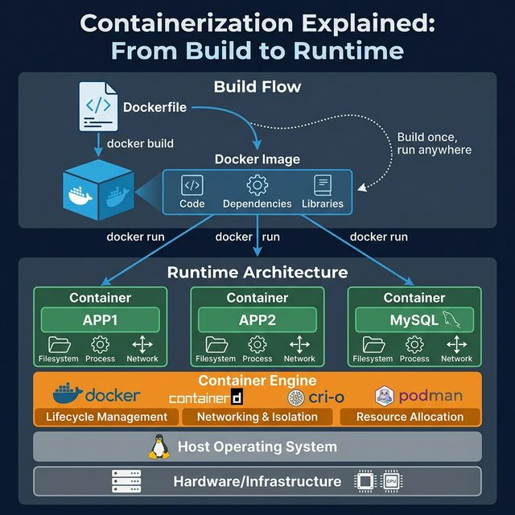
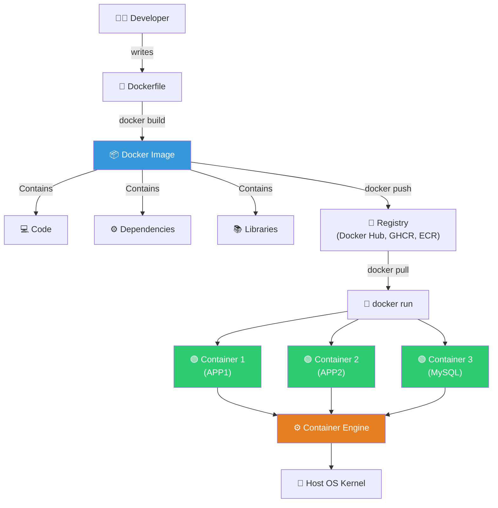

<!-- tags: docker, containerization -->
# 📦 Containerization Explained: From Build to Runtime

> "Build once, run anywhere." — Containerization packages an application with all its dependencies into a portable image, ensuring identical behavior across every environment: local, CI server, or cloud.

📅 Created: 2026-03-22 · 🔄 Updated: 2026-04-20 · ⏱️ 12 min read

| Aspect         | Detail                                                                  |
| -------------- | ----------------------------------------------------------------------- |
| **Complexity** | 🌟🌟                                                                    |
| **Use case**   | DevOps fundamentals, Docker concepts, container architecture            |
| **Keywords**   | Dockerfile, Image, Container, Container Engine, OCI, containerd, Podman |

---

## 1. DEFINE

Some teams use Docker daily but still cannot distinguish container, image, runtime, and VM. This article locks down the foundational mental model before diving into optimization or production hardening.


Containerization solves the classic problem: _"It works on my machine!"_. By packaging code + dependencies + libraries into an immutable **image**, containers guarantee the application runs identically everywhere.

### Build Flow

| Step | Component        | Description                                                                   |
| ---- | ---------------- | ----------------------------------------------------------------------------- |
| 1    | **Dockerfile**   | Text file defining how to build: base image, copy code, install deps, set CMD |
| 2    | **docker build** | Reads Dockerfile → creates image layer by layer (cached)                      |
| 3    | **Docker Image** | Immutable artifact containing: code + dependencies + libraries + configs      |
| 4    | **docker run**   | Launches image as a container — isolated runtime environment                  |

### Runtime Architecture

| Layer           | Component                            | Role                                                |
| --------------- | ------------------------------------ | --------------------------------------------------- |
| **Application** | Containers (APP1, APP2, MySQL...)    | Isolated processes, own filesystem + network stack  |
| **Engine**      | Docker / containerd / CRI-O / Podman | Manages lifecycle, networking, resource allocation  |
| **OS**          | Host Operating System (Linux kernel) | Provides namespaces + cgroups for isolation          |
| **Hardware**    | Physical/Virtual servers             | CPU, Memory, Storage, Network                       |

### Container vs VM

| Criteria      |           Container           |     Virtual Machine      |
| ------------- | :---------------------------: | :----------------------: |
| **Boot time** |         Milliseconds          |         Minutes          |
| **Size**      |        MBs (10-200MB)         |       GBs (1-50GB)       |
| **Isolation** | Process-level (kernel shared) | Hardware-level (full OS) |
| **Overhead**  |       Minimal (~1% CPU)       |  Significant (~15% CPU)  |
| **Density**   |         100s per host         |       10s per host       |

---

Those distinctions sound clear. But there is a trap: using containers like VMs is an anti-pattern, and oversized images slow deploys. That trap appears in PITFALLS.

## 2. VISUAL

The concept has a name. In the diagram, the more important part emerges: how requests, workloads, and signals flow through these layers.




### Diagram: Build → Ship → Run Pipeline



_(Core idea: Image is an immutable blueprint. Container is a running instance of an image. Multiple containers share the Host OS kernel → far lighter than VMs)._

---

## 3. CODE

The diagram showed the main path. The code/manifests/commands below pull it down to the artifact level that on-call or reviewers must actually use.


### 1. Dockerfile — Multi-stage Build for Go App

```dockerfile
# ─── Stage 1: Build ───
FROM golang:1.22-alpine AS builder
WORKDIR /app

# Cache dependencies first (layer caching)
COPY go.mod go.sum ./
RUN go mod download

# Copy source code and build
COPY . .
RUN CGO_ENABLED=0 GOOS=linux go build \
    -ldflags="-s -w" \
    -o /app/server ./cmd/server

# ─── Stage 2: Runtime ───
# distroless = no shell, no package manager → minimal attack surface
FROM gcr.io/distroless/static-debian12

# Copy binary from builder stage
COPY --from=builder /app/server /server

# Non-root user (65534 = nobody)
USER 65534:65534

EXPOSE 8080
CMD ["/server"]
```

```bash
# Build image
docker build -t go-api:v1.0 .

# Check size — multi-stage + distroless = ~10MB
docker images go-api:v1.0

# Run container
docker run -d --name api \
  -p 8080:8080 \
  --memory=256m \
  --cpus=0.5 \
  go-api:v1.0
```

Build flow is covered. But runtime architecture needs isolation — time to separate.

### 2. Docker Compose — Multi-container Setup

```yaml
# docker-compose.yml
services:
    api:
        build:
            context: .
            dockerfile: Dockerfile
        ports:
            - '8080:8080'
        environment:
            - DB_HOST=postgres
            - REDIS_HOST=redis
        depends_on:
            postgres:
                condition: service_healthy
            redis:
                condition: service_started
        restart: unless-stopped
        deploy:
            resources:
                limits:
                    memory: 256M
                    cpus: '0.5'

    postgres:
        image: postgres:16-alpine
        environment:
            POSTGRES_DB: myapp
            POSTGRES_USER: app
            POSTGRES_PASSWORD: secret
        volumes:
            - pgdata:/var/lib/postgresql/data
        healthcheck:
            test: ['CMD-SHELL', 'pg_isready -U app']
            interval: 5s
            timeout: 3s
            retries: 5

    redis:
        image: redis:7-alpine
        command: redis-server --maxmemory 128mb --maxmemory-policy allkeys-lru

volumes:
    pgdata:
```

### 3. Go: Container-aware Application

```go
package main

import (
    "context"
    "log/slog"
    "net/http"
    "os"
    "os/signal"
    "syscall"
    "time"
)

func main() {
    logger := slog.New(slog.NewJSONHandler(os.Stdout, nil))

    mux := http.NewServeMux()

    // Health check so container orchestrator knows app is ready
    mux.HandleFunc("/healthz", func(w http.ResponseWriter, r *http.Request) {
        w.WriteHeader(http.StatusOK)
        w.Write([]byte(`{"status":"healthy"}`))
    })

    mux.HandleFunc("/", func(w http.ResponseWriter, r *http.Request) {
        hostname, _ := os.Hostname() // = Container ID
        logger.Info("request received",
            "method", r.Method,
            "path", r.URL.Path,
            "container", hostname,
        )
        w.Write([]byte("Hello from container: " + hostname))
    })

    server := &http.Server{
        Addr:         ":8080",
        Handler:      mux,
        ReadTimeout:  10 * time.Second,
        WriteTimeout: 10 * time.Second,
    }

    // ✅ Graceful shutdown — Docker sends SIGTERM before killing container
    go func() {
        logger.Info("server starting", "addr", server.Addr)
        if err := server.ListenAndServe(); err != http.ErrServerClosed {
            logger.Error("server error", "error", err)
            os.Exit(1)
        }
    }()

    quit := make(chan os.Signal, 1)
    signal.Notify(quit, syscall.SIGINT, syscall.SIGTERM)
    sig := <-quit
    logger.Info("shutting down", "signal", sig.String())

    ctx, cancel := context.WithTimeout(context.Background(), 30*time.Second)
    defer cancel()

    if err := server.Shutdown(ctx); err != nil {
        logger.Error("shutdown error", "error", err)
    }
    logger.Info("server stopped gracefully")
}
```

---

Those failure modes sound clear. But there is a trap: VM mindset and heavy images — the trap set up from the beginning.

## 4. PITFALLS

Errors usually do not sit in syntax. They sit in operational boundaries and forgotten failure modes. The table below collects exactly those mistakes.

| #   | Mistake                          | Consequence                                                                           | Fix                                                                                         |
| --- | -------------------------------- | ------------------------------------------------------------------------------------ | ------------------------------------------------------------------------------------------- |
| 1   | **No multi-stage build**         | Image contains compiler, source code → 800MB+ instead of 10MB. Large attack surface. | Multi-stage: build in golang image, copy binary to distroless/scratch.                      |
| 2   | **COPY before go mod download**  | Every code change → re-downloads all dependencies (cache miss). Build 5-10x slower.  | COPY go.mod go.sum first → RUN go mod download → COPY . . (optimize layer caching).         |
| 3   | **Running container as root**    | Container compromised → attacker has root access.                                    | `USER 65534:65534` in Dockerfile. Use distroless (no shell).                                |
| 4   | **Not handling SIGTERM**         | Docker sends SIGTERM → app does not cleanup → connections cut abruptly → data lost.   | Implement graceful shutdown: catch SIGTERM → drain connections → close DB → exit.            |
| 5   | **Using `latest` tag**           | Unknown version running. `docker pull` fetches different version → breaks production. | Always use specific tag: `go-api:v1.2.3`. Pin base images: `golang:1.22-alpine`.            |

---

You have covered Containerization Explained and the traps. The resources below help go deeper.

## 5. REF

| Resource                    | Link                                                                                               |
| --------------------------- | -------------------------------------------------------------------------------------------------- |
| Docker Documentation        | [docs.docker.com](https://docs.docker.com/)                                                        |
| Dockerfile Best Practices   | [docs.docker.com/build](https://docs.docker.com/develop/develop-images/dockerfile_best-practices/) |
| Distroless Images           | [github.com/GoogleContainerTools](https://github.com/GoogleContainerTools/distroless)              |
| OCI Image Specification     | [opencontainers.org](https://opencontainers.org/)                                                  |
| Docker Security Cheat Sheet | [OWASP](https://cheatsheetseries.owasp.org/cheatsheets/Docker_Security_Cheat_Sheet.html)           |

---

## 6. RECOMMEND

After this article, read the topic closest to your current decision so the production mental model does not fragment.

| Next step              | When                | Reason                                                                                             |
| ---------------------- | ------------------- | -------------------------------------------------------------------------------------------------- |
| **Docker Internals**   | Deep container dive | Namespaces (PID, NET, MNT), cgroups, OverlayFS — see [09-docker-internals.md](./09-docker-internals.md). |
| **Podman**             | Rootless containers | No daemon required, Docker CLI compatible, good for development and security.                      |
| **BuildKit**           | Optimize build time | Parallel builds, secret mounts, SSH forwarding, cache export/import.                               |
| **Container Scanning** | Production security | Trivy/Snyk scan images for CVEs before deploy — see [05-image-security.md](./05-image-security.md).  |

---

← Previous: [Docker Internals & Architecture](./09-docker-internals.md) · ← Back to [Docker](./README.md)
