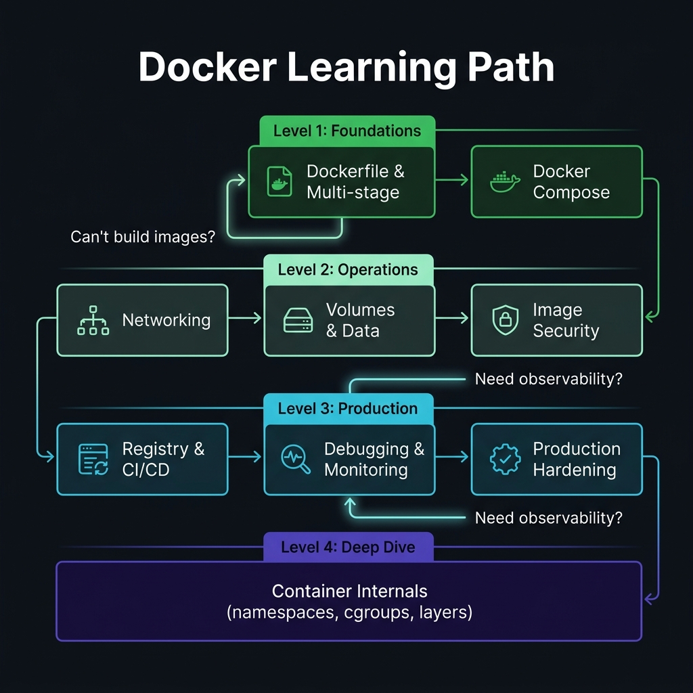
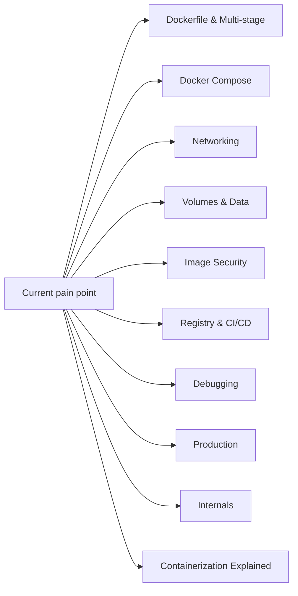

<!-- tags: overview -->
# Docker

> Hub for containerization and image/container operations from a production perspective — not stopping at "build and it runs."

| Aspect | Detail |
| --- | --- |
| **Concept** | Navigation hub for `Docker` |
| **Audience** | Backend engineer, DevOps engineer, SRE |
| **Primary style** | Concept-First router |
| **Entry point** | Open when the pain point sits in image build, networking, volumes, security, or production operations. |

📅 Updated: 2026-04-20 · ⏱️ 6 min read

---

## 1. DEFINE

Picture your Go application running smoothly on localhost, but the moment it enters a container the build is slow, the image bloats, TLS breaks, logs go blind, and signals do not exit cleanly. Docker only looks simple until it becomes the gate into production.

This hub does not replace individual articles. It exists to help you open the right lane before wandering into tools, syntax, or specific diagrams. Reading in the right order reduces the feeling of "knowing many keywords but still unable to route the real problem."

### Signals & Boundaries

- Open this hub when you know the issue lives inside `Docker` but are unsure which article to read first.
- Use the coverage map to route by pain point, not by file order.
- Return here after each article to pick the next step with intention.

### Coverage Map

| Entry | Role |
| --- | --- |
| [Dockerfile & Multi-stage Builds](01-dockerfile-multistage.md) | Entry point for lane `Dockerfile & Multi-stage Builds` |
| [Docker Compose](02-docker-compose.md) | Entry point for lane `Docker Compose` |
| [Docker Networking](03-networking.md) | Entry point for lane `Docker Networking` |
| [Volumes & Data Management](04-volumes-data.md) | Entry point for lane `Volumes & Data Management` |
| [Image Optimization & Security](05-image-security.md) | Entry point for lane `Image Optimization & Security` |
| [Registry & CI/CD](06-registry-cicd.md) | Entry point for lane `Registry & CI/CD` |
| [Debugging & Monitoring](07-debugging-monitoring.md) | Entry point for lane `Debugging & Monitoring` |
| [Production Best Practices](08-production.md) | Entry point for lane `Production Best Practices` |
| [Docker Internals & Architecture](09-docker-internals.md) | Entry point for lane `Docker Internals & Architecture` |
| [Containerization Explained: From Build to Runtime](10-containerization-explained.md) | Entry point for lane `Containerization Explained` |

---

## 2. VISUAL

The definition locked the hub's scope. The visual below helps route by lane instead of scrolling a dry link list.





*Figure: This hub works as a router, not a catalog to browse through. Pick the lane that matches your current pain point.*

---

## 3. CODE

The diagram showed the routing rhythm. The artifact below turns the hub into a short worksheet so the team or learner can pick the right entry gate.

### Problem 1: Basic — Route the lane before reading deep

> **Goal**: Prevent study or review from drifting into "open whichever article looks interesting."
> **Approach**: Choose lane by current pain point.
> **Example**: Pick the right cluster to read in `Docker`.
> **Complexity**: Basic

```yaml
router:
  module: Docker
  rule: "choose lane by pain point, not by familiar name"
  suggested_path:
  - 01-dockerfile-multistage.md
  - 02-docker-compose.md
  - 03-networking.md
  - 04-volumes-data.md
  - 05-image-security.md
  - 06-registry-cicd.md
```

This artifact does not solve the problem for you. It trims wrong lanes before your time is spent on articles that do not serve your current goal.

---

## 4. PITFALLS

| # | Severity | Mistake | Consequence | Fix |
| --- | --- | --- | --- | --- |
| 1 | 🔴 Fatal | Reading by file order instead of routing by pain point | Accumulates terminology without solving the real problem | Use the coverage map before opening a detail article |
| 2 | 🟡 Common | Treating the README as a pure link catalog | Loses the hub's routing purpose | Always ask "which lane matches my current pain?" |
| 3 | 🔵 Minor | Finishing an article without returning to the hub | Jumps to an adjacent article by instinct | Return to the README to pick the next step |

---

## 5. REF

| Resource | Type | Link | Notes |
| --- | --- | --- | --- |
| Dockerfile & Multi-stage Builds | Internal | [Dockerfile & Multi-stage Builds](01-dockerfile-multistage.md) | Directly related entry point |
| Docker Compose | Internal | [Docker Compose](02-docker-compose.md) | Directly related entry point |
| Docker Networking | Internal | [Docker Networking](03-networking.md) | Directly related entry point |
| Volumes & Data Management | Internal | [Volumes & Data Management](04-volumes-data.md) | Directly related entry point |

---

## 6. RECOMMEND

Once you know which lane you are in, the next step is to open the first article of that lane instead of wandering into a new topic.

| Next step | When | Reason | File/Link |
| --- | --- | --- | --- |
| Dockerfile & Multi-stage Builds | When the pain point matches this lane | Continue into the right cluster | [Dockerfile & Multi-stage Builds](01-dockerfile-multistage.md) |
| Docker Compose | When the pain point matches this lane | Continue into the right cluster | [Docker Compose](02-docker-compose.md) |
| Docker Networking | When the pain point matches this lane | Continue into the right cluster | [Docker Networking](03-networking.md) |
