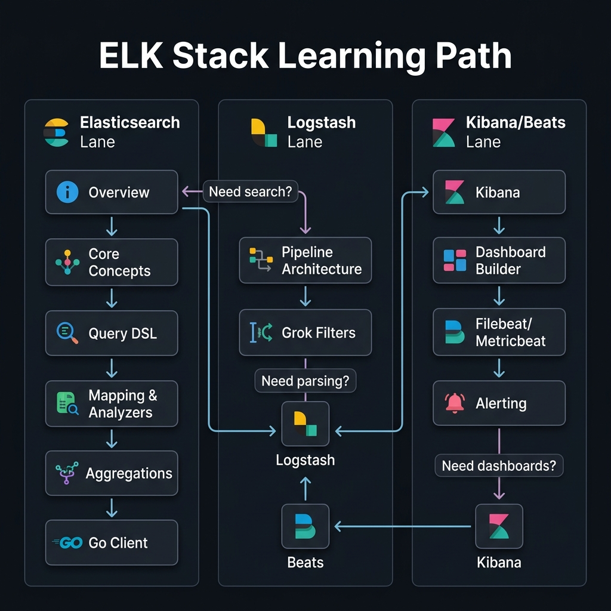
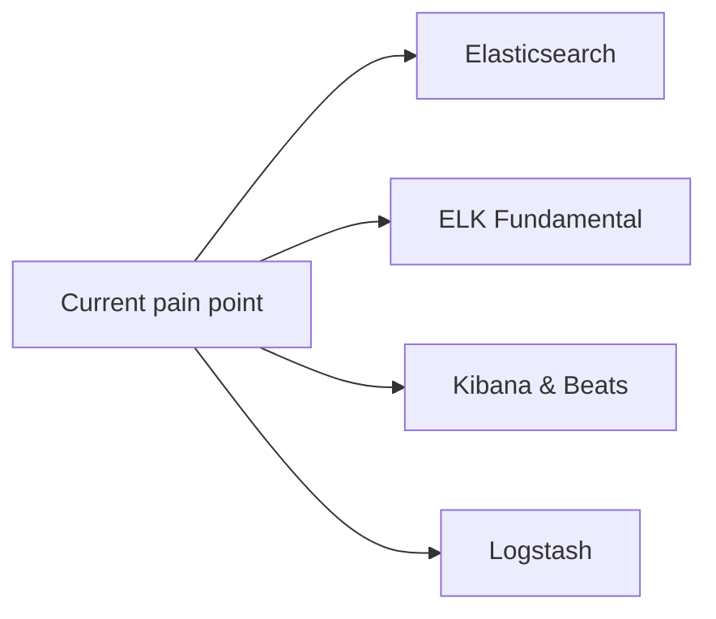

<!-- tags: overview -->
# ELK Stack

> Hub for ingestion, storage, search, and visualization in the ELK ecosystem.

| Aspect | Detail |
| --- | --- |
| **Concept** | Navigation hub for `ELK Stack` |
| **Audience** | DevOps engineer, SRE, backend engineer, observability owner |
| **Primary style** | Concept-First router |
| **Entry point** | Open when the pain point sits in logs, search, dashboards, or pipeline configuration within ELK. |

📅 Updated: 2026-04-20 · ⏱️ 6 min read

---

## 1. DEFINE

The ELK Stack appears right when observability data is no longer a few manual log lines — it has become a pipeline with real operational cost.

When the system starts emitting more logs than humans can read, the question shifts from "where to store logs" to "how to ingest, index, search, and tell a story from that pile of logs."

This hub does not replace individual articles. It exists to help you open the right lane before wandering into tools, syntax, or specific diagrams. Reading in the right order reduces the feeling of "knowing many keywords but still unable to route the real problem."

### Signals & Boundaries

- Open this hub when you know the issue lives inside `ELK Stack` but are unsure which article to read first.
- Use the coverage map to route by pain point, not by file order.
- Return here after each article to pick the next step with intention.

### Coverage Map

| Entry | Role |
| --- | --- |
| [Elasticsearch — Core to Production](elasticsearch/README.md) | Entry point for lane `Elasticsearch` |
| [ELK Fundamental — Foundation & Go Integration](fundamental/README.md) | Entry point for lane `ELK Fundamental` |
| [Kibana & Beats — Visualization, Agents & Alerting](kibana-beats/README.md) | Entry point for lane `Kibana & Beats` |
| [Logstash — Pipeline, Grok & Filters](logstash/README.md) | Entry point for lane `Logstash` |

---

## 2. VISUAL

The definition locked the hub's scope. The visual below helps route by lane instead of scrolling a dry link list.





*Figure: This hub works as a router, not a catalog to browse through. Pick the lane that matches your current observability pain point.*

---

## 3. CODE

The diagram showed the routing rhythm. The artifact below turns the hub into a short worksheet so the team or learner can pick the right entry gate.

### Problem 1: Basic — Route the lane before reading deep

> **Goal**: Prevent study or review from drifting into "open whichever article looks interesting."
> **Approach**: Choose lane by current pain point.
> **Example**: Pick the right cluster to read in `ELK Stack`.
> **Complexity**: Basic

```yaml
router:
  module: ELK Stack
  rule: "choose lane by pain point, not by familiar name"
  suggested_path:
  - elasticsearch/README.md
  - fundamental/README.md
  - kibana-beats/README.md
  - logstash/README.md
```

This artifact does not solve the problem for you. It trims wrong lanes before your time is spent on articles that do not serve your current goal.

---

## 4. PITFALLS

| # | Severity | Mistake | Consequence | Fix |
| --- | --- | --- | --- | --- |
| 1 | 🔴 Fatal | Reading by file order instead of routing by pain point | Accumulates terminology without solving the real problem | Use the coverage map before opening a detail article |
| 2 | 🟡 Common | Treating the README as a pure link catalog | Loses the hub's routing purpose | Always ask "which lane matches my current pain?" |
| 3 | 🔵 Minor | Finishing an article without returning to the hub | Jumps to an adjacent article by instinct | Return to the README to pick the next step |

---

## 5. REF

| Resource | Type | Link | Notes |
| --- | --- | --- | --- |
| Elasticsearch — Core to Production | Internal | [Elasticsearch](elasticsearch/README.md) | Directly related entry point |
| ELK Fundamental — Foundation & Go Integration | Internal | [ELK Fundamental](fundamental/README.md) | Directly related entry point |
| Kibana & Beats — Visualization, Agents & Alerting | Internal | [Kibana & Beats](kibana-beats/README.md) | Directly related entry point |
| Logstash — Pipeline, Grok & Filters | Internal | [Logstash](logstash/README.md) | Directly related entry point |

---

## 6. RECOMMEND

Once you know which lane you are in, the next step is to open the first article of that lane instead of wandering into a new topic.

| Next step | When | Reason | File/Link |
| --- | --- | --- | --- |
| Elasticsearch | When the pain point is indexing, querying, or cluster operations | Continue into the right cluster | [Elasticsearch](elasticsearch/README.md) |
| ELK Fundamental | When the pain point is initial setup or Go client integration | Continue into the right cluster | [ELK Fundamental](fundamental/README.md) |
| Kibana & Beats | When the pain point is dashboards, data collection agents, or alerting | Continue into the right cluster | [Kibana & Beats](kibana-beats/README.md) |
