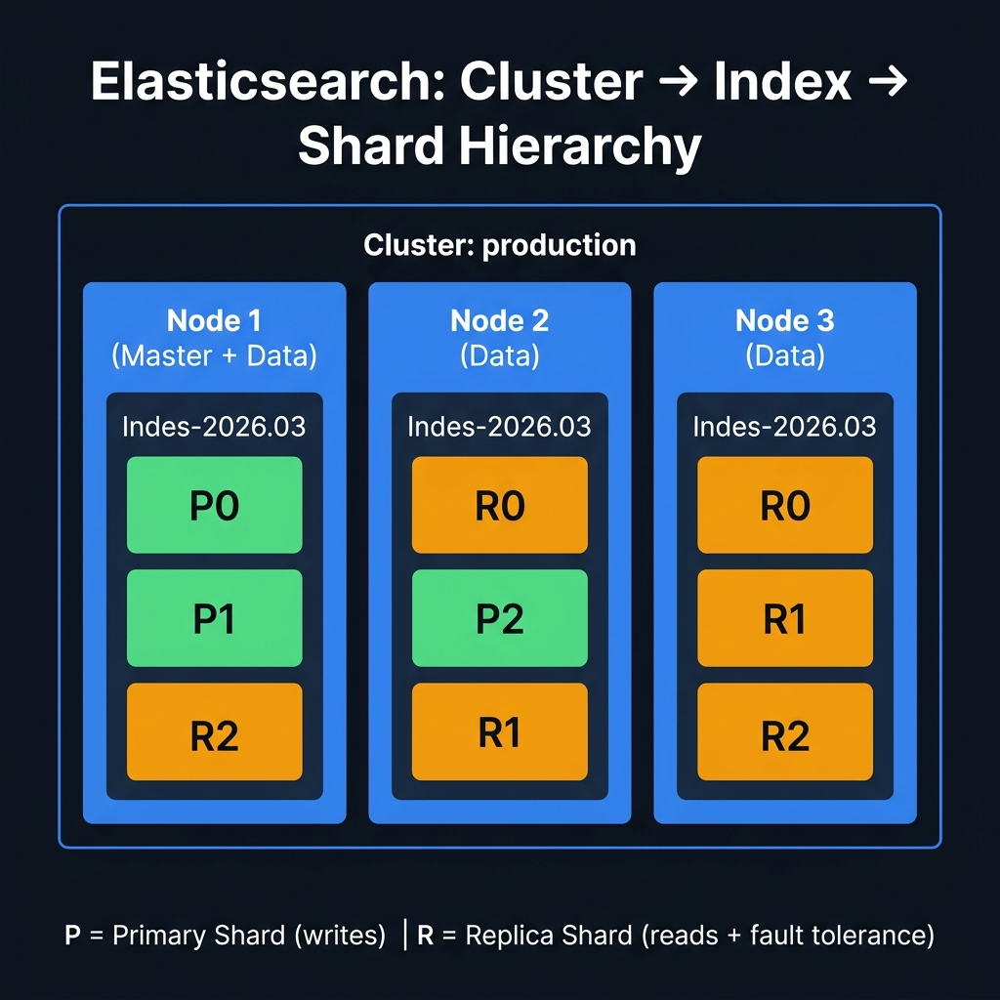

<!-- tags: elk-stack, observability, elasticsearch -->
# 🏗️ Elasticsearch Core Concepts

> Cluster, Node, Index, Shard, Replica — the distributed architecture of Elasticsearch.

📅 Created: 2026-03-23 · 🔄 Updated: 2026-04-20 · ⏱️ 14 min read

| Aspect           | Detail                                    |
| ---------------- | ----------------------------------------- |
| **Architecture** | Distributed, masterless (peer-to-peer)    |
| **Storage**      | Apache Lucene segments (inverted index)   |
| **Protocol**     | REST API (9200) + Transport (9300)        |
| **Consistency**  | Eventual consistency (near real-time ~1s) |

---

## 0. TEMPLATE

> Quick API calls — copy-paste for common operations.

```bash
# ── Cluster info ────────────────────────────────────────────────
curl -s localhost:9200/_cluster/health?pretty     # Health status
curl -s localhost:9200/_cluster/stats?pretty      # Cluster statistics
curl -s 'localhost:9200/_cat/nodes?v&h=name,role,heap.percent,disk.used_percent'

# ── Index management ───────────────────────────────────────────
curl -s 'localhost:9200/_cat/indices?v'           # List all indices
curl -s 'localhost:9200/_cat/shards?v'            # Shard allocation
curl -X PUT localhost:9200/my-index               # Create index
curl -X DELETE localhost:9200/my-index            # Delete index

# ── Index settings ─────────────────────────────────────────────
curl -s localhost:9200/my-index/_settings?pretty  # Get settings
curl -X PUT localhost:9200/my-index/_settings \
  -H 'Content-Type: application/json' \
  -d '{"index":{"number_of_replicas":1}}'         # Update replicas
```

---

## 1. DEFINE

Elasticsearch sounds simple at the "document store + search" level, but once shards, replicas, and refresh intervals start revealing side effects, you realize this is a real distributed system.


### Hierarchy: Cluster → Node → Index → Shard → Document

```text
Cluster (cluster.name = "production")
├── Node 1 (node.name = "es-master-1", roles: master, data)
│   ├── Index: logs-2026.03.23
│   │   ├── Primary Shard 0 ──► [Doc1, Doc2, Doc3...]
│   │   └── Replica Shard 1 ──► [copy of P1 from Node 2]
│   └── Index: users
│       └── Primary Shard 0 ──► [User docs]
├── Node 2 (node.name = "es-data-1", roles: data)
│   └── Index: logs-2026.03.23
│       ├── Primary Shard 1 ──► [Doc4, Doc5, Doc6...]
│       └── Replica Shard 0 ──► [copy of P0 from Node 1]
└── Node 3 (node.name = "es-data-2", roles: data)
    └── Index: logs-2026.03.23
        └── Primary Shard 2 ──► [Doc7, Doc8, Doc9...]
```

### Core Concepts

| Concept      | Description                                       | RDBMS analogy    |
| ------------ | ------------------------------------------------- | ---------------- |
| **Cluster**  | Group of nodes sharing `cluster.name`             | Database cluster |
| **Node**     | 1 ES instance (JVM process)                       | Database server  |
| **Index**    | Logical namespace containing documents            | Database / Table |
| **Shard**    | Subset of an index — unit of scaling              | Partition        |
| **Replica**  | Copy of a shard — fault tolerance + read throughput | Read replica   |
| **Document** | 1 JSON record                                     | Row              |
| **Field**    | 1 attribute within a document                     | Column           |
| **Mapping**  | Schema definition for fields                      | Schema/DDL       |

### Node Roles

| Role             | Flag | Responsibility                                  | RAM needs |
| ---------------- | ---- | ----------------------------------------------- | --------- |
| **Master**       | `m`  | Cluster state, index creation, shard allocation | Low       |
| **Data**         | `d`  | Store data, search, aggregation                 | High      |
| **Ingest**       | `i`  | Pre-process documents (pipeline)                | Medium    |
| **Coordinating** | `-`  | Route requests, merge results                   | Medium    |
| **ML**           | `l`  | Machine learning jobs                           | High      |

### Shard — Unit of Scaling

| Aspect             | Primary Shard                       | Replica Shard                 |
| ------------------ | ----------------------------------- | ----------------------------- |
| **Role**           | Holds original data                   | Copy of primary             |
| **Read**           | ✅ Serves reads                       | ✅ Serves reads (load balanced) |
| **Write**          | ✅ Receives writes first              | ✅ Syncs from primary          |
| **Changeable?**    | ❌ Fixed at index creation            | ✅ Can change anytime          |
| **If lost?**       | 🔴 Data loss (if no replica exists)  | 🟡 Reduced availability        |

### Inverted Index — How ES Searches Fast

```text
Document 1: "The quick brown fox"
Document 2: "The quick brown dog"
Document 3: "The lazy brown dog"

Inverted Index:
┌─────────┬──────────────┐
│  Term   │  Documents    │
├─────────┼──────────────┤
│  the    │  [1, 2, 3]   │
│  quick  │  [1, 2]      │
│  brown  │  [1, 2, 3]   │
│  fox    │  [1]         │
│  dog    │  [2, 3]      │
│  lazy   │  [3]         │
└─────────┴──────────────┘

Search "quick dog" → Terms: quick ∩ dog
  quick: [1, 2]
  dog:   [2, 3]
  Match: Document 2 (score = 2 hits)
```

---

Those failure modes sound basic. But there is a trap: cluster YELLOW because replica is unassigned means reads and writes work but there is no HA, and a shard count that is too high means per-shard overhead. That trap appears in PITFALLS.

## 2. VISUAL

Concepts now have names. In the diagrams, the more important part emerges: how requests, workloads, or signals flow through these layers.



### Request Flow — Write (Index Document)

```text
Client ──POST /logs/_doc──► Coordinating Node
                                │
                         ┌──────▼──────┐
                         │  Calculate   │
                         │  shard =     │
                         │  hash(_id)   │
                         │  % num_shards│
                         └──────┬──────┘
                                │ route to shard owner
                    ┌───────────▼───────────┐
                    │   Primary Shard Node   │
                    │   Write to Lucene      │
                    │   segment              │
                    └───────┬───────────────┘
                            │ replicate
              ┌─────────────▼─────────────┐
              │  Replica Shard Node(s)     │
              │  Write to Lucene segment   │
              └─────────────┬─────────────┘
                            │ all replicas ACK
                    ┌───────▼──────┐
                    │   Response    │
                    │   201 Created │
                    └──────────────┘
```

### Request Flow — Read (Search)

```text
Client ──GET /logs/_search──► Coordinating Node
                                   │
                            ┌──────▼──────┐
                            │  Scatter    │
                            │  (fan-out)  │
                            └──────┬──────┘
                                   │ parallel query to all shards
              ┌────────────────────┼────────────────────┐
              ▼                    ▼                    ▼
         Shard 0              Shard 1              Shard 2
         (or replica)         (or replica)         (or replica)
         Local search         Local search         Local search
              │                    │                    │
              └────────────────────┼────────────────────┘
                                   │ results back
                            ┌──────▼──────┐
                            │   Gather    │
                            │  (merge +   │
                            │   sort +    │
                            │   paginate) │
                            └──────┬──────┘
                                   ▼
                              Response JSON
```

---

## 3. CODE

Code and config show how the decisions discussed above are enforced by real constraints, not just a nice diagram.


### Example 1: Basic — Cluster & Index Management

> **Goal**: Create, configure, and manage indices.
> **Requires**: ES running on localhost:9200.
> **Result**: Understand index lifecycle.

```bash
# ── 1. Create index with custom settings ──────────────────────
curl -X PUT "localhost:9200/products" -H 'Content-Type: application/json' -d '{
  "settings": {
    "number_of_shards": 3,
    "number_of_replicas": 1,
    "refresh_interval": "5s",
    "index.max_result_window": 50000
  },
  "mappings": {
    "properties": {
      "name": {
        "type": "text",
        "analyzer": "standard",
        "fields": {
          "keyword": { "type": "keyword" }
        }
      },
      "price": { "type": "float" },
      "category": { "type": "keyword" },
      "description": { "type": "text" },
      "tags": { "type": "keyword" },
      "created_at": { "type": "date" },
      "in_stock": { "type": "boolean" }
    }
  }
}'

# ✅ Response: {"acknowledged":true, "shards_acknowledged":true, "index":"products"}

# ── 2. Check mapping ──────────────────────────────────────────
curl -s "localhost:9200/products/_mapping?pretty"

# ── 3. Check shard allocation ─────────────────────────────────
curl -s "localhost:9200/_cat/shards/products?v"
# index    shard prirep state   docs store node
# products 0     p      STARTED  0    230b  es-node-1
# products 0     r      UNASSIGNED               ← Normal for single-node
# products 1     p      STARTED  0    230b  es-node-1
# products 2     p      STARTED  0    230b  es-node-1

# ── 4. Update settings (runtime) ──────────────────────────────
curl -X PUT "localhost:9200/products/_settings" -H 'Content-Type: application/json' -d '{
  "index": {
    "number_of_replicas": 0,
    "refresh_interval": "30s"
  }
}'
# ⚠️ number_of_shards CANNOT be changed after creation!

# ── 5. Index aliases — zero-downtime reindex ───────────────────
curl -X POST "localhost:9200/_aliases" -H 'Content-Type: application/json' -d '{
  "actions": [
    { "add": { "index": "products", "alias": "products-live" } }
  ]
}'
# ✅ App queries "products-live" → swap index without code changes
```

> **Result**: Create index, check shards, update settings, use aliases.
> **Note**: `number_of_shards` is fixed at creation — must reindex to change.

---

Core concepts are covered. But shard allocation needs a strategy — time to allocate.

### Example 2: Intermediate — Index Lifecycle Management (ILM)

> **Goal**: Automatically manage index lifecycle (hot → warm → cold → delete).
> **Requires**: ES 7.x+.
> **Result**: Auto-rotate and clean up logs.

```bash
# ── 1. Create ILM Policy ──────────────────────────────────────
curl -X PUT "localhost:9200/_ilm/policy/logs-policy" -H 'Content-Type: application/json' -d '{
  "policy": {
    "phases": {
      "hot": {
        "min_age": "0ms",
        "actions": {
          "rollover": {
            "max_primary_shard_size": "50gb",
            "max_age": "1d"
          },
          "set_priority": { "priority": 100 }
        }
      },
      "warm": {
        "min_age": "7d",
        "actions": {
          "shrink": { "number_of_shards": 1 },
          "forcemerge": { "max_num_segments": 1 },
          "set_priority": { "priority": 50 }
        }
      },
      "cold": {
        "min_age": "30d",
        "actions": {
          "set_priority": { "priority": 0 },
          "freeze": {}
        }
      },
      "delete": {
        "min_age": "90d",
        "actions": {
          "delete": {}
        }
      }
    }
  }
}'

# ── 2. Create Index Template with ILM ─────────────────────────
curl -X PUT "localhost:9200/_index_template/logs-template" -H 'Content-Type: application/json' -d '{
  "index_patterns": ["logs-*"],
  "template": {
    "settings": {
      "number_of_shards": 1,
      "number_of_replicas": 1,
      "index.lifecycle.name": "logs-policy",
      "index.lifecycle.rollover_alias": "logs-write"
    }
  }
}'

# ── 3. Bootstrap first index ──────────────────────────────────
curl -X PUT "localhost:9200/logs-000001" -H 'Content-Type: application/json' -d '{
  "aliases": {
    "logs-write": { "is_write_index": true },
    "logs-read": {}
  }
}'

# ── 4. Check ILM status ───────────────────────────────────────
curl -s "localhost:9200/logs-*/_ilm/explain?pretty" | jq '.indices | to_entries[] | {index: .key, phase: .value.phase, age: .value.age}'
```

```text
ILM Flow:
┌─────────┐    7 days    ┌─────────┐   30 days   ┌─────────┐   90 days   ┌────────┐
│   HOT   │─────────────▶│  WARM   │────────────▶│  COLD   │───────────▶│ DELETE │
│ (write) │              │ (shrink │             │ (freeze)│            │        │
│ rollover│              │  merge) │             │         │            │        │
└─────────┘              └─────────┘             └─────────┘            └────────┘
  Max 50GB                Force merge             Read-only              Auto-delete
  Max 1 day               to 1 segment            No search cache        Free disk
```

> **Result**: Auto-manage index lifecycle — no manual cleanup needed.
> **Note**: ILM only works with rollover indices (write alias pattern).

---

Shard allocation is covered. But cluster health needs monitoring — time to track.

### Example 3: Advanced — Go Client with Official SDK

> **Goal**: Use the `go-elasticsearch` official SDK.
> **Requires**: `go get github.com/elastic/go-elasticsearch/v8`.
> **Result**: Type-safe ES operations in Go.

```go
// es_client.go
package search

import (
	"bytes"
	"context"
	"encoding/json"
	"fmt"
	"log"
	"strings"

	"github.com/elastic/go-elasticsearch/v8"
	"github.com/elastic/go-elasticsearch/v8/esapi"
)

// SearchService wraps Elasticsearch operations
type SearchService struct {
	client *elasticsearch.Client
	index  string
}

// NewSearchService creates an Elasticsearch client
func NewSearchService(addresses []string, index string) (*SearchService, error) {
	cfg := elasticsearch.Config{
		Addresses: addresses, // ✅ ["http://localhost:9200"]
	}

	client, err := elasticsearch.NewClient(cfg)
	if err != nil {
		return nil, fmt.Errorf("create ES client: %w", err)
	}

	// ✅ Verify connection
	res, err := client.Info()
	if err != nil {
		return nil, fmt.Errorf("ES connection failed: %w", err)
	}
	defer res.Body.Close()

	if res.IsError() {
		return nil, fmt.Errorf("ES error: %s", res.Status())
	}

	log.Printf("✅ Connected to Elasticsearch: %s", res.Status())
	return &SearchService{client: client, index: index}, nil
}

// IndexDocument indexes a single document
func (s *SearchService) IndexDocument(ctx context.Context, id string, doc interface{}) error {
	body, err := json.Marshal(doc)
	if err != nil {
		return fmt.Errorf("marshal: %w", err)
	}

	// ✅ Index API with explicit ID
	req := esapi.IndexRequest{
		Index:      s.index,
		DocumentID: id,
		Body:       bytes.NewReader(body),
		Refresh:    "true", // ⚠️ Test only — production should use "wait_for"
	}

	res, err := req.Do(ctx, s.client)
	if err != nil {
		return fmt.Errorf("index request: %w", err)
	}
	defer res.Body.Close()

	if res.IsError() {
		return fmt.Errorf("index error [%s]: %s", id, res.Status())
	}
	return nil
}

// Search performs full-text search
func (s *SearchService) Search(ctx context.Context, query string, size int) ([]map[string]interface{}, error) {
	// ✅ Build query DSL
	var buf bytes.Buffer
	searchQuery := map[string]interface{}{
		"query": map[string]interface{}{
			"multi_match": map[string]interface{}{
				"query":  query,
				"fields": []string{"title^3", "content", "tags^2"},
				"type":   "best_fields",
				"fuzziness": "AUTO", // ✅ Fuzzy matching
			},
		},
		"highlight": map[string]interface{}{
			"fields": map[string]interface{}{
				"title":   map[string]interface{}{},
				"content": map[string]interface{}{"fragment_size": 150},
			},
		},
		"size": size,
		"_source": []string{"title", "tags", "created_at"},
	}

	if err := json.NewEncoder(&buf).Encode(searchQuery); err != nil {
		return nil, fmt.Errorf("encode query: %w", err)
	}

	// ✅ Execute search
	res, err := s.client.Search(
		s.client.Search.WithContext(ctx),
		s.client.Search.WithIndex(s.index),
		s.client.Search.WithBody(&buf),
	)
	if err != nil {
		return nil, fmt.Errorf("search request: %w", err)
	}
	defer res.Body.Close()

	if res.IsError() {
		return nil, fmt.Errorf("search error: %s", res.Status())
	}

	// ✅ Parse response
	var result map[string]interface{}
	if err := json.NewDecoder(res.Body).Decode(&result); err != nil {
		return nil, fmt.Errorf("decode response: %w", err)
	}

	hits := result["hits"].(map[string]interface{})["hits"].([]interface{})
	docs := make([]map[string]interface{}, 0, len(hits))
	for _, hit := range hits {
		h := hit.(map[string]interface{})
		doc := h["_source"].(map[string]interface{})
		doc["_id"] = h["_id"]
		doc["_score"] = h["_score"]
		if hl, ok := h["highlight"]; ok {
			doc["_highlight"] = hl
		}
		docs = append(docs, doc)
	}

	return docs, nil
}

// BulkIndex indexes multiple documents at once
func (s *SearchService) BulkIndex(ctx context.Context, docs []map[string]interface{}) error {
	var buf strings.Builder
	for _, doc := range docs {
		// ✅ Action: index
		meta := fmt.Sprintf(`{"index":{"_index":"%s"}}`, s.index)
		buf.WriteString(meta + "\n")

		data, _ := json.Marshal(doc)
		buf.WriteString(string(data) + "\n")
	}

	res, err := s.client.Bulk(
		strings.NewReader(buf.String()),
		s.client.Bulk.WithContext(ctx),
	)
	if err != nil {
		return fmt.Errorf("bulk request: %w", err)
	}
	defer res.Body.Close()

	if res.IsError() {
		return fmt.Errorf("bulk error: %s", res.Status())
	}
	return nil
}
```

> **Result**: Type-safe ES operations: index, search, bulk via official Go SDK.
> **Note**: Production may use `olivere/elastic` (v7) for typed API. Official client v8 is lower-level but officially supported.

---

You have covered concepts, shard allocation, and cluster health. Now comes the dangerous part: YELLOW false comfort and shard overhead — the trap set up from the beginning.

## 4. PITFALLS

Knowing how to do it right is only half the story. The other half is the places where it is easy to get almost right and then pay the price when the cluster or OS shakes.


| #   | Mistake                            | Fix                                                                             |
| --- | ---------------------------------- | ------------------------------------------------------------------------------- |
| 1   | Too many shards (over-sharding)    | Rule of thumb: 20-40GB/shard, max 20 shards/GB heap RAM                         |
| 2   | `number_of_shards` cannot change   | Must reindex — use `_reindex` API + alias swap                                  |
| 3   | Cluster RED status                 | Check `_cat/shards?v` → find UNASSIGNED → `_cluster/reroute`                    |
| 4   | Split brain (2 masters)            | Set `minimum_master_nodes` = (N/2)+1                                            |
| 5   | Search too slow                    | Check mapping — `text` vs `keyword`, add `_source` filtering                    |
| 6   | Disk full → read-only index        | `curl -X PUT /_all/_settings -d '{"index.blocks.read_only_allow_delete":null}'` |

---

You have covered Core Concepts and the traps. The resources below help go deeper.

## 5. REF

| Resource                                   | Link                                                                                                                                                                                   |
| ------------------------------------------ | -------------------------------------------------------------------------------------------------------------------------------------------------------------------------------------- |
| Elasticsearch Definitive Guide             | [elastic.co/guide/en/elasticsearch/guide](https://www.elastic.co/guide/en/elasticsearch/guide/current/index.html)                                                                      |
| Go Elasticsearch Client                    | [github.com/elastic/go-elasticsearch](https://github.com/elastic/go-elasticsearch)                                                                                                     |
| Index Lifecycle Management                 | [elastic.co/guide/en/elasticsearch/reference/current/index-lifecycle-management.html](https://www.elastic.co/guide/en/elasticsearch/reference/current/index-lifecycle-management.html) |
| Shard Sizing Guide                         | [elastic.co/blog/how-many-shards-should-i-have](https://www.elastic.co/blog/how-many-shards-should-i-have-in-my-elasticsearch-cluster)                                                 |
| Elasticsearch: The Definitive Guide (Book) | [elastic.co/guide/en/elasticsearch/guide/current](https://www.elastic.co/guide/en/elasticsearch/guide/current/index.html)                                                              |

---

## 6. RECOMMEND

After this article, read the topic closest to your current operational pressure so the production mental model does not fragment.


| Next step                     | When                         | Reason                       |
| ----------------------------- | ---------------------------- | ---------------------------- |
| **Data Streams**              | Time-series data             | Replaces rollover aliases    |
| **Searchable Snapshots**      | Cold/frozen tier storage     | Reduces disk cost by 60%     |
| **Cross-Cluster Replication** | Multi-DC / disaster recovery | Real-time index replication  |
| **Snapshot & Restore**        | Backup strategy              | S3/GCS/Azure blob snapshots  |
| **Watcher**                   | Alerting                     | Trigger alerts on conditions |

---

## 🃏 Quick Reference

| #   | API              | Command                      |
| --- | ---------------- | ---------------------------- |
| 1   | Cluster health   | `GET /_cluster/health`       |
| 2   | List indices     | `GET /_cat/indices?v`        |
| 3   | Create index     | `PUT /my-index`              |
| 4   | Delete index     | `DELETE /my-index`           |
| 5   | Get mapping      | `GET /my-index/_mapping`     |
| 6   | Get settings     | `GET /my-index/_settings`    |
| 7   | Shard allocation | `GET /_cat/shards?v`         |
| 8   | Node stats       | `GET /_nodes/stats`          |
| 9   | Index alias      | `POST /_aliases`             |
| 10  | ILM explain      | `GET /my-index/_ilm/explain` |

---

## 🔍 Debug Checklist

| # | Symptom | Root cause | Diagnostic command |
|---|---------|------------|--------------------|
| 1 | Cluster status YELLOW | Replica shards unassigned — normal for single-node | `GET /_cluster/health?pretty` |
| 2 | Cluster status RED | Primary shard lost, data unreadable | `GET /_cluster/allocation/explain?pretty` |
| 3 | Shard cannot be allocated | Disk watermark exceeded (default 85%) | `GET /_cat/allocation?v` then check disk usage |
| 4 | Master election loop / split-brain | `minimum_master_nodes` misconfigured, network partition | `GET /_cluster/stats?pretty` + check ES logs |
| 5 | Index suddenly read-only | Disk full — flood-stage watermark (95%) triggered | `PUT /my-index/_settings` with `{"index.blocks.read_only_allow_delete": null}` |
| 6 | Search unexpectedly slow | Over-sharding — too many small shards (<1GB) | `GET /_cat/indices?v&s=store.size:desc` |
| 7 | Node evicted from cluster | Network timeout or GC pause too long | `GET /_cat/nodes?v` + check GC logs |

---

## 🎯 Interview Angle

**Related system design / technical questions:**
- *"What is the difference between primary shard and replica shard? When can a replica serve writes?"*
- *"Why are Lucene segments immutable? How does that affect write and delete performance?"*
- *"How to size shards properly? What does the 50GB rule of thumb mean in practice?"*

**Key talking points interviewers expect:**

| Topic | Talking point |
|-------|---------------|
| Primary vs Replica | Primary receives writes first, then replicates to replicas. Replicas only serve reads (load balance) and do not receive writes directly |
| Immutable Lucene segments | Immutability lets the OS cache segment files efficiently, avoiding lock contention. Delete only marks a tombstone; periodic merges actually remove data |
| Shard sizing | Rule of thumb: 10–50GB/shard, max 20 shards/GB heap. Over-sharding causes overhead for cluster state and coordinating |
| Master node role | Master only manages cluster state (index creation, shard allocation) — does not store data. Dedicated masters improve cluster stability |
| Routing formula | `shard = hash(_id) % number_of_shards` — the reason shard count cannot change after index creation |
| Split-brain prevention | `discovery.zen.minimum_master_nodes = (N/2)+1` — ES 7+ uses auto quorum with cluster bootstrapping |

**Common follow-up questions:**
- *"If a primary shard is lost and there is no replica, how does ES handle it?"* → Cluster goes RED, shard becomes unassigned, data for that shard is lost until restored from snapshot
- *"Why not use `refresh_interval: 1s` for bulk indexing?"* → Each refresh creates a new Lucene segment; bulk indexing with frequent refresh creates too many small segments, slowing search and increasing merge pressure

---

**Links**: [← Docker Compose Setup](../fundamental/02-setup-docker-compose.md) · [→ CRUD & Query DSL](./02-crud-query-dsl.md)
