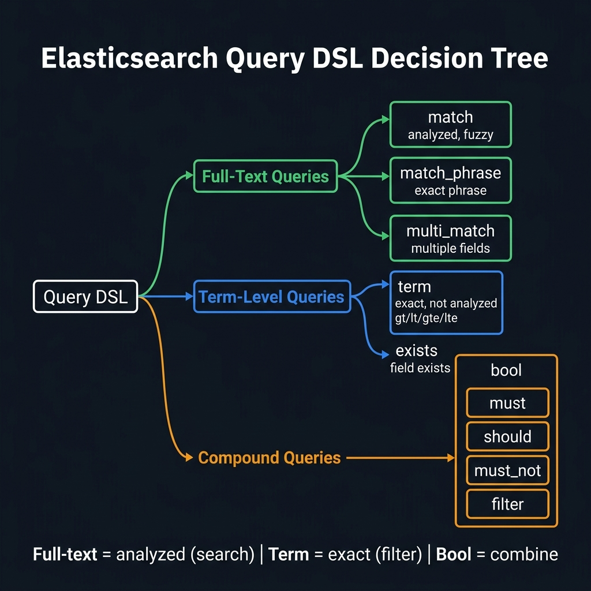
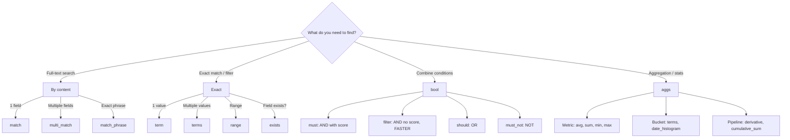
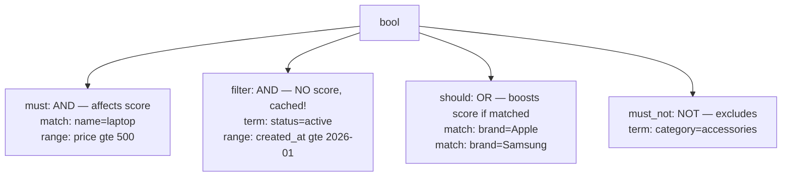

<!-- tags: elk-stack, observability -->
# 🔍 CRUD & Query DSL

> Elasticsearch REST API: Document CRUD + Query DSL + Aggregations

📅 Created: 2026-03-23 · 🔄 Updated: 2026-04-20 · ⏱️ 15 min read

| Aspect          | Detail                                       |
| --------------- | -------------------------------------------- |
| **Protocol**    | REST API over HTTP (port 9200)               |
| **Format**      | JSON request/response                        |
| **Query types** | Full-text (match), Exact (term), Bool, Range |
| **Aggregation** | Metric, Bucket, Pipeline                     |

---

## 0. TEMPLATE

> Copy-paste CRUD operations.

```bash
# ── CRUD ────────────────────────────────────────────────────────
# Create
curl -X POST localhost:9200/products/_doc -H 'Content-Type: application/json' \
  -d '{"name":"iPhone","price":999}'

# Read by ID
curl -s localhost:9200/products/_doc/1?pretty

# Update (partial)
curl -X POST localhost:9200/products/_update/1 -H 'Content-Type: application/json' \
  -d '{"doc":{"price":899}}'

# Delete
curl -X DELETE localhost:9200/products/_doc/1

# ── Search ──────────────────────────────────────────────────────
# Full-text search
curl -s localhost:9200/products/_search -H 'Content-Type: application/json' \
  -d '{"query":{"match":{"name":"iphone"}}}'

# Exact match
curl -s localhost:9200/products/_search -H 'Content-Type: application/json' \
  -d '{"query":{"term":{"category.keyword":"electronics"}}}'
```

---

## 1. DEFINE

Search is not hard because of missing APIs; it is hard because the query uses the wrong mental model. Query DSL is where you must shift from thinking in SQL tables to thinking in inverted indices and scoring.


### CRUD API Endpoints

| Operation  | HTTP Method | Endpoint                | Description         |
| ---------- | ----------- | ----------------------- | ------------------- |
| **Index**  | `POST/PUT`  | `/{index}/_doc/{id?}`   | Create or replace   |
| **Get**    | `GET`       | `/{index}/_doc/{id}`    | Get document by ID  |
| **Update** | `POST`      | `/{index}/_update/{id}` | Partial update      |
| **Delete** | `DELETE`    | `/{index}/_doc/{id}`    | Delete document     |
| **Search** | `GET/POST`  | `/{index}/_search`      | Search documents    |
| **Bulk**   | `POST`      | `/_bulk`                | Batch operations    |
| **Count**  | `GET`       | `/{index}/_count`       | Count documents     |

### Query DSL Categories

| Category        | Queries                                | When to use                   |
| --------------- | -------------------------------------- | ----------------------------- |
| **Full-text**   | `match`, `multi_match`, `match_phrase` | Text search, natural language |
| **Term-level**  | `term`, `terms`, `range`, `exists`     | Exact match, filters          |
| **Compound**    | `bool` (must/should/filter/must_not)   | Combine multiple queries      |
| **Geo**         | `geo_distance`, `geo_bounding_box`     | Location-based search         |
| **Specialized** | `more_like_this`, `script_score`       | Similarity, custom scoring    |

### Text vs Keyword

| Aspect        | `text`                        | `keyword`                             |
| ------------- | ----------------------------- | ------------------------------------- |
| **Analyzed**  | ✅ Tokenized + normalized     | ❌ Stored as-is                       |
| **Search**    | Full-text (match)             | Exact match (term)                    |
| **Sort**      | ❌ Cannot sort                 | ✅ Can sort                         |
| **Aggregate** | ❌ Cannot aggregate            | ✅ Can aggregate                    |
| **Example**   | "iPhone 15 Pro Max"           | "electronics"                         |
| **Query**     | `{"match":{"name":"iphone"}}` | `{"term":{"category":"electronics"}}` |

---

Those failure modes sound familiar. But there is a trap: using a term query on a text field returns 0 results because of tokenization mismatch, and deep pagination with offset causes heap explosion. That trap appears in PITFALLS.

## 2. VISUAL

The definition locked the vocabulary. The visual below shows the actual operational flow where containers, pods, log pipelines, and shell commands hit production.



### Query DSL Decision Tree



*Figure: Query DSL decision tree — choose the right query type based on your search need.*

### Bool Query Structure



*Figure: Bool query structure — `must` and `filter` are AND operators (filter is cached and faster). `should` is OR. `must_not` excludes.*

---

## 3. CODE

The diagrams have shown the main path. The code/manifests/commands below pull it down to the artifact level that on-call or reviewers actually use.


### Example 1: Basic — Document CRUD

> **Goal**: CRUD operations with the Elasticsearch REST API.
> **Requires**: ES running on localhost:9200.
> **Result**: Basic document operations.

```bash
# ── 1. CREATE — Index document ──────────────────────────────────

# ✅ Auto-generate ID
curl -X POST "localhost:9200/products/_doc?pretty" \
  -H 'Content-Type: application/json' -d '{
  "name": "MacBook Pro M3",
  "price": 2499,
  "category": "laptops",
  "tags": ["apple", "laptop", "m3"],
  "in_stock": true,
  "specs": {
    "ram": "18GB",
    "storage": "512GB SSD",
    "chip": "M3 Pro"
  },
  "created_at": "2026-03-23T00:00:00Z"
}'
# Response: {"_id": "abc123", "result": "created"}

# ✅ Specify ID
curl -X PUT "localhost:9200/products/_doc/1?pretty" \
  -H 'Content-Type: application/json' -d '{
  "name": "iPhone 15 Pro",
  "price": 1199,
  "category": "phones",
  "tags": ["apple", "iphone", "5g"],
  "in_stock": true,
  "created_at": "2026-03-23T00:00:00Z"
}'

# ── 2. READ — Get document ──────────────────────────────────────

# ✅ Get by ID
curl -s "localhost:9200/products/_doc/1?pretty"

# ✅ Get only _source (no metadata)
curl -s "localhost:9200/products/_source/1?pretty"

# ✅ Multi Get — fetch multiple docs at once
curl -s "localhost:9200/products/_mget?pretty" \
  -H 'Content-Type: application/json' -d '{
  "ids": ["1", "2", "3"]
}'

# ── 3. UPDATE — Partial update ───────────────────────────────────

# ✅ Update price
curl -X POST "localhost:9200/products/_update/1?pretty" \
  -H 'Content-Type: application/json' -d '{
  "doc": {
    "price": 1099,
    "in_stock": false
  }
}'

# ✅ Script update — increase price by 10%
curl -X POST "localhost:9200/products/_update/1?pretty" \
  -H 'Content-Type: application/json' -d '{
  "script": {
    "source": "ctx._source.price *= params.factor",
    "params": { "factor": 1.1 }
  }
}'

# ✅ Upsert — update if exists, create if not
curl -X POST "localhost:9200/products/_update/2?pretty" \
  -H 'Content-Type: application/json' -d '{
  "doc": { "price": 799 },
  "upsert": {
    "name": "Galaxy S24",
    "price": 799,
    "category": "phones"
  }
}'

# ── 4. DELETE ───────────────────────────────────────────────────

# ✅ Delete by ID
curl -X DELETE "localhost:9200/products/_doc/1?pretty"

# ✅ Delete by query (bulk delete)
curl -X POST "localhost:9200/products/_delete_by_query?pretty" \
  -H 'Content-Type: application/json' -d '{
  "query": {
    "range": { "price": { "lt": 100 } }
  }
}'

# ── 5. BULK — Batch operations ──────────────────────────────────
# ⚠️ NDJSON format: action\ndata\naction\ndata\n
curl -X POST "localhost:9200/_bulk?pretty" \
  -H 'Content-Type: application/x-ndjson' -d '
{"index":{"_index":"products","_id":"10"}}
{"name":"AirPods Pro","price":249,"category":"audio"}
{"index":{"_index":"products","_id":"11"}}
{"name":"Sony WH-1000XM5","price":349,"category":"audio"}
{"update":{"_index":"products","_id":"10"}}
{"doc":{"in_stock":true}}
{"delete":{"_index":"products","_id":"99"}}
'
```

> **Result**: Full CRUD + bulk operations.
> **Note**: Bulk API uses NDJSON (one JSON per line) — NOT a JSON array.

---

Basic CRUD is covered. But Query DSL needs compound queries — time to combine.

### Example 2: Intermediate — Query DSL Deep Dive

> **Goal**: Full-text search, bool queries, aggregations.
> **Requires**: Index "products" with data.
> **Result**: Complex search patterns.

```bash
# ── Full-text Search ────────────────────────────────────────────

# ✅ match — search text (tokenized)
curl -s "localhost:9200/products/_search?pretty" -H 'Content-Type: application/json' -d '{
  "query": {
    "match": {
      "name": {
        "query": "macbook pro",
        "operator": "and"
      }
    }
  }
}'

# ✅ multi_match — search across multiple fields
curl -s "localhost:9200/products/_search?pretty" -H 'Content-Type: application/json' -d '{
  "query": {
    "multi_match": {
      "query": "apple laptop",
      "fields": ["name^3", "category", "tags^2"],
      "type": "best_fields",
      "fuzziness": "AUTO"
    }
  }
}'
# ⚠️ ^3 = boost weight x3 cho field name

# ✅ match_phrase — exact phrase
curl -s "localhost:9200/products/_search?pretty" -H 'Content-Type: application/json' -d '{
  "query": {
    "match_phrase": {
      "name": "MacBook Pro"
    }
  }
}'

# ── Bool Query (complex conditions) ────────────────────────────

# ✅ Find Apple laptops, price 1000-3000, in stock, not accessories
curl -s "localhost:9200/products/_search?pretty" -H 'Content-Type: application/json' -d '{
  "query": {
    "bool": {
      "must": [
        { "match": { "name": "laptop" } }
      ],
      "filter": [
        { "term": { "category": "laptops" } },
        { "range": { "price": { "gte": 1000, "lte": 3000 } } },
        { "term": { "in_stock": true } }
      ],
      "should": [
        { "match": { "tags": "apple" } },
        { "match": { "tags": "m3" } }
      ],
      "minimum_should_match": 1,
      "must_not": [
        { "term": { "category": "accessories" } }
      ]
    }
  },
  "sort": [
    { "_score": "desc" },
    { "price": "asc" }
  ],
  "_source": ["name", "price", "category", "tags"],
  "from": 0,
  "size": 10
}'

# ── Aggregations ────────────────────────────────────────────────

# ✅ Category breakdown + price stats
curl -s "localhost:9200/products/_search?pretty" -H 'Content-Type: application/json' -d '{
  "size": 0,
  "aggs": {
    "categories": {
      "terms": {
        "field": "category",
        "size": 20,
        "order": { "_count": "desc" }
      },
      "aggs": {
        "avg_price": { "avg": { "field": "price" } },
        "max_price": { "max": { "field": "price" } },
        "min_price": { "min": { "field": "price" } }
      }
    },
    "price_ranges": {
      "range": {
        "field": "price",
        "ranges": [
          { "key": "budget",  "to": 500 },
          { "key": "mid",     "from": 500, "to": 1500 },
          { "key": "premium", "from": 1500 }
        ]
      }
    },
    "total_revenue": {
      "sum": { "field": "price" }
    }
  }
}'
```

> **Result**: Full-text search, bool compound queries, multi-level aggregations.
> **Note**: `filter` context does NOT compute score → faster than `must` + cached.

---

Compound queries are covered. But pagination needs search_after — time to scale.

### Example 3: Advanced — Pagination, Highlight, Suggestions

> **Goal**: Production search features.
> **Requires**: Large dataset.
> **Result**: Real-world search UX.

```bash
# ── Search After (efficient deep pagination) ───────────────────
# ⚠️ from+size only works up to 10000 — use search_after beyond that

# Step 1: First page
curl -s "localhost:9200/products/_search?pretty" -H 'Content-Type: application/json' -d '{
  "query": { "match_all": {} },
  "sort": [
    { "created_at": "desc" },
    { "_id": "asc" }
  ],
  "size": 20
}'
# Get sort values of last document: ["2026-03-23T00:00:00Z", "abc123"]

# Step 2: Next pages — use search_after
curl -s "localhost:9200/products/_search?pretty" -H 'Content-Type: application/json' -d '{
  "query": { "match_all": {} },
  "sort": [
    { "created_at": "desc" },
    { "_id": "asc" }
  ],
  "size": 20,
  "search_after": ["2026-03-23T00:00:00Z", "abc123"]
}'

# ── Highlight ──────────────────────────────────────────────────

curl -s "localhost:9200/products/_search?pretty" -H 'Content-Type: application/json' -d '{
  "query": {
    "multi_match": {
      "query": "macbook pro m3",
      "fields": ["name", "description"]
    }
  },
  "highlight": {
    "pre_tags": ["<mark>"],
    "post_tags": ["</mark>"],
    "fields": {
      "name": {},
      "description": {
        "fragment_size": 150,
        "number_of_fragments": 3
      }
    }
  }
}'
# Response highlight: "name": ["<mark>MacBook</mark> <mark>Pro</mark> <mark>M3</mark>"]

# ── Suggest (autocomplete / did-you-mean) ──────────────────────

curl -s "localhost:9200/products/_search?pretty" -H 'Content-Type: application/json' -d '{
  "suggest": {
    "name-suggest": {
      "text": "iphne",
      "term": {
        "field": "name",
        "suggest_mode": "popular"
      }
    },
    "name-complete": {
      "prefix": "mac",
      "completion": {
        "field": "name.suggest",
        "size": 5,
        "fuzzy": {
          "fuzziness": "AUTO"
        }
      }
    }
  }
}'
```

> **Result**: Deep pagination, highlighted results, autocomplete suggestions.
> **Note**: `search_after` requires a sort with a unique tiebreaker (add `_id`).

---

You have covered CRUD, Query DSL, and pagination. Now comes the dangerous part: term/text mismatch and deep pagination — the trap set up from the beginning.

## 4. PITFALLS

Knowing how to do it right is only half the story. The other half is the places where it is easy to get almost right and then pay the price when the cluster or OS shakes.


| #   | Mistake                                         | Fix                                                |
| --- | ----------------------------------------------- | -------------------------------------------------- |
| 1   | Using `term` on a `text` field                  | `text` is tokenized → use `match` or `.keyword`    |
| 2   | Deep pagination `from: 10000` fails             | Use `search_after` or `scroll` API                 |
| 3   | `must` instead of `filter` for exact conditions | `filter` is faster (no scoring, cached)            |
| 4   | Aggregation on `text` field fails               | Switch to `keyword` or use `fielddata: true`       |
| 5   | Bulk API wrong format                           | Must use NDJSON — one JSON per line, ending `\n`   |
| 6   | Update with `PUT` = overwrite entire document   | Use `POST /_update` for partial update             |

---

You have covered CRUD & Query DSL and the traps. The resources below help go deeper.

## 5. REF

| Resource               | Link                                                                                                                                                                             |
| ---------------------- | -------------------------------------------------------------------------------------------------------------------------------------------------------------------------------- |
| Query DSL Reference    | [elastic.co/guide/en/elasticsearch/reference/current/query-dsl.html](https://www.elastic.co/guide/en/elasticsearch/reference/current/query-dsl.html)                             |
| Aggregations Reference | [elastic.co/guide/en/elasticsearch/reference/current/search-aggregations.html](https://www.elastic.co/guide/en/elasticsearch/reference/current/search-aggregations.html)         |
| Pagination Guide       | [elastic.co/guide/en/elasticsearch/reference/current/paginate-search-results.html](https://www.elastic.co/guide/en/elasticsearch/reference/current/paginate-search-results.html) |
| Bulk API               | [elastic.co/guide/en/elasticsearch/reference/current/docs-bulk.html](https://www.elastic.co/guide/en/elasticsearch/reference/current/docs-bulk.html)                             |

---

## 6. RECOMMEND

After this article, read the topic closest to your current decision so the production mental model does not fragment.


| Next step             | When                          | Reason                                 |
| --------------------- | ----------------------------- | -------------------------------------- |
| **Percolate Query**   | Alerting / notifications      | "Reverse search" — match docs to query |
| **Runtime Fields**    | Schema-on-read                | Compute fields at query time           |
| **Async Search**      | Slow queries (> 30s)          | Background search with polling         |
| **EQL (Event Query)** | Security / sequence detection | "A then B within 5 minutes"            |
| **SQL API**           | Team knows SQL, not DSL       | `POST /_sql?format=json`               |

---

## 🃏 Quick Reference

| #   | Pattern          | Query                                       |
| --- | ---------------- | ------------------------------------------- |
| 1   | Full-text search | `{"match":{"field":"query"}}`               |
| 2   | Exact match      | `{"term":{"field.keyword":"value"}}`        |
| 3   | Range filter     | `{"range":{"price":{"gte":100,"lte":500}}}` |
| 4   | AND conditions   | `{"bool":{"must":[q1,q2]}}`                 |
| 5   | Cached filter    | `{"bool":{"filter":[q1,q2]}}`               |
| 6   | OR conditions    | `{"bool":{"should":[q1,q2]}}`               |
| 7   | NOT conditions   | `{"bool":{"must_not":[q1]}}`                |
| 8   | Pagination       | `"from":0, "size":20`                       |
| 9   | Sort             | `"sort":[{"field":"desc"}]`                 |
| 10  | Count agg        | `"aggs":{"name":{"terms":{"field":"f"}}}`   |

---

## 🔍 Debug Checklist

| # | Symptom | Root cause | Diagnostic command |
|---|---------|------------|--------------------|
| 1 | Search returns 0 results despite data existing | `text` field used with `term` query — tokens do not match | Switch to `match` or use `.keyword`: `GET /_analyze {"analyzer":"standard","text":"..."}` |
| 2 | `match` query returns inaccurate results | Analyzer tokenizes differently than expected (casing, stemming) | `GET /index/_analyze` with `{"analyzer":"standard","text":"your text"}` to see actual tokens |
| 3 | Aggregation on `text` field errors | `fielddata` disabled by default for text fields | Use `.keyword` sub-field or set `"fielddata": true` (memory-intensive) |
| 4 | Bulk index partial failure but HTTP 200 | Bulk API always returns 200 — must parse each item | Parse `items[].index.error` in bulk response to detect per-document errors |
| 5 | Update conflict 409 | Optimistic concurrency control — document already changed | Use `retry_on_conflict: 3` in request or handle `if_seq_no` / `if_primary_term` |
| 6 | Query timeout or too slow | Query too complex or dataset too large | Add `"timeout": "5s"` in request body; consider `filter` context instead of `must` |
| 7 | `_source` does not return expected field | `_source` filtering or field does not exist in document | `GET /index/_doc/id?_source=field1,field2` to check actual source |

---

## 🎯 Interview Angle

**Related system design / technical questions:**
- *"What is the difference between query context and filter context in Elasticsearch?"*
- *"When to use `match` instead of `term`? And when to use `term` on a `.keyword` field?"*
- *"Explain the bool query structure — how do `must`, `filter`, `should`, and `must_not` differ?"*

**Key talking points interviewers expect:**

| Topic | Talking point |
|-------|---------------|
| Query vs Filter context | Query context computes relevance score (`_score`), filter context does not compute score and results are cached by ES → significantly faster |
| match vs term | `match` is for `text` fields (analyzed), `term` is for `keyword`/numeric fields (exact). Using `term` on a `text` field will not find the document because tokens are lowercased |
| Bool query structure | `must` = AND with score, `filter` = AND without score (cached), `should` = OR (boost), `must_not` = NOT (no score). `minimum_should_match` controls how many `should` clauses must match |
| Aggregations | Metric agg (avg/sum/max), Bucket agg (terms/date_histogram), Pipeline agg (derivative). Use `size: 0` to only get agg results |
| App-side vs ES aggregation | ES aggregation scales better because it runs distributed across data nodes. App-side grouping only makes sense for small datasets or complex logic |
| Bulk API format | NDJSON — each action + data pair is 2 separate lines, ending with newline. Partial failure does not fail the whole batch |

**Common follow-up questions:**
- *"Why is `filter` context faster than `must`?"* → Filter does not compute TF/IDF score; result is a bitset cached in memory for similar queries
- *"How to paginate past 10,000 documents?"* → Use `search_after` with a unique sort field (typically combined with `_id` as tiebreaker); avoid `from + size` because ES must fetch and discard N docs on each shard

---

**Links**: [← Core Concepts](./01-core-concepts.md) · [→ Mapping & Analyzer](./03-mapping-analyzer.md)
