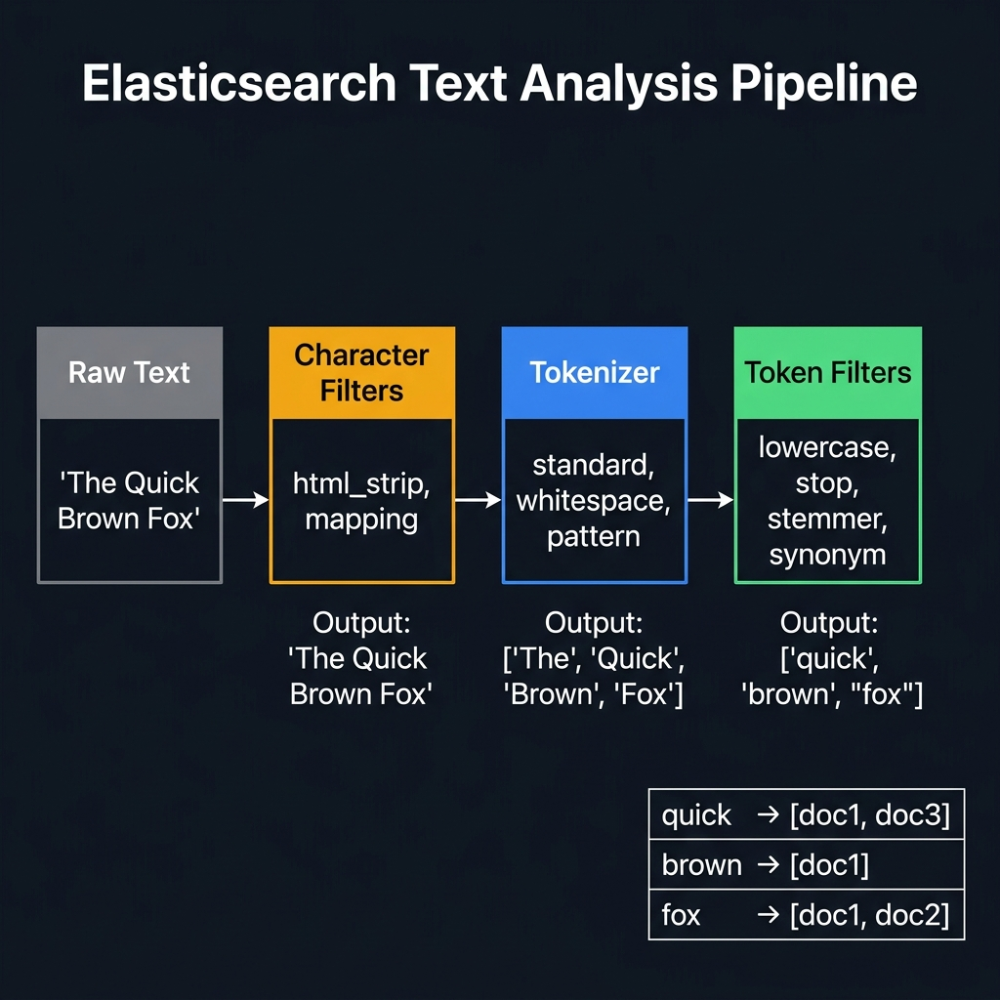

<!-- tags: elk-stack, observability -->
# 🗂️ Mapping & Analyzer

> Elasticsearch Mapping (schema), Analyzer pipeline, and Custom analyzers.

📅 Created: 2026-03-23 · 🔄 Updated: 2026-04-20 · ⏱️ 13 min read

| Aspect       | Detail                                       |
| ------------ | -------------------------------------------- |
| **Mapping**  | Dynamic (auto) or Explicit (manual)          |
| **Analyzer** | Char filter → Tokenizer → Token filter       |
| **Built-in** | standard, simple, whitespace, keyword, stop  |
| **Use case** | Full-text search, multilingual, autocomplete |

---

## 0. TEMPLATE

> Quick mapping + analyzer setup.

```json
{
    "settings": {
        "analysis": {
            "analyzer": {
                "my_analyzer": {
                    "type": "custom",
                    "tokenizer": "standard",
                    "filter": ["lowercase", "stop", "snowball"]
                }
            }
        }
    },
    "mappings": {
        "properties": {
            "title": { "type": "text", "analyzer": "my_analyzer" },
            "status": { "type": "keyword" },
            "price": { "type": "float" },
            "created_at": { "type": "date" }
        }
    }
}
```

---

## 1. DEFINE

Mapping and analyzer are usually ignored until the day search results become nonsensical or the index explodes from field explosion. This article exists to lock down schema and text processing before it is too late.


### Field Types

| Type         | Description                    | Example                   | Search type    |
| ------------ | ------------------------------ | ------------------------- | -------------- |
| `text`       | Full-text, analyzed            | Product name, description | `match`        |
| `keyword`    | Exact value, not analyzed      | Status, category, email   | `term`         |
| `integer`    | Signed 32-bit                  | Quantity, age             | `range`        |
| `long`       | Signed 64-bit                  | Large counters            | `range`        |
| `float`      | 32-bit floating point          | Price, rating             | `range`        |
| `double`     | 64-bit floating point          | Precise calculations      | `range`        |
| `boolean`    | true/false                     | is_active, in_stock       | `term`         |
| `date`       | ISO 8601 string or epoch       | created_at, updated_at    | `range`        |
| `object`     | Nested JSON object             | address: {city, zip}      | dot notation   |
| `nested`     | Array of objects (independent) | comments: [{user, text}]  | `nested` query |
| `geo_point`  | {lat, lon}                     | Location                  | `geo_distance` |
| `ip`         | IPv4/IPv6                      | client_ip                 | `term/range`   |
| `completion` | Autocomplete suggestions       | search suggestions        | `suggest`      |

### Dynamic Mapping Rules

| JSON value          | ES auto-maps to    | Potential issue                    |
| ------------------- | ------------------ | ---------------------------------- |
| `"hello"`           | `text` + `keyword` | Both — wastes disk                 |
| `123`               | `long`             | May only need `integer`            |
| `12.5`              | `float`            | OK                                 |
| `true`/`false`      | `boolean`          | OK                                 |
| `"2026-03-23"`      | `date`             | OK if standard format              |
| `{"a": 1}`          | `object`           | ⚠️ Cannot query nested arrays      |
| `[{"a":1},{"a":2}]` | `object` (flat)    | ⚠️ MUST use `nested` type           |

### Analyzer Pipeline

```text
Input text: "The QUICK Brown Fox-Jumper's 2024"

      ┌────────────────────┐
      │   Char Filters     │  ← Pre-process characters
      │  (html_strip, etc) │
      └──────────┬─────────┘
                 │ "The QUICK Brown Fox-Jumper's 2024"
      ┌──────────▼─────────┐
      │    Tokenizer       │  ← Split into tokens
      │   (standard)       │
      └──────────┬─────────┘
                 │ ["The", "QUICK", "Brown", "Fox", "Jumper's", "2024"]
      ┌──────────▼─────────┐
      │   Token Filters    │  ← Transform tokens
      │  (lowercase, stop, │
      │   stemmer)         │
      └──────────┬─────────┘
                 │ ["quick", "brown", "fox", "jumper", "2024"]
                 ▼
         Stored in inverted index
```

### Built-in Analyzers

| Analyzer     | Tokenizer   | Token Filters           | Output for "The Quick-Brown FOX" |
| ------------ | ----------- | ----------------------- | -------------------------------- |
| `standard`   | standard    | lowercase               | `[the, quick, brown, fox]`       |
| `simple`     | letter only | lowercase               | `[the, quick, brown, fox]`       |
| `whitespace` | whitespace  | none                    | `[The, Quick-Brown, FOX]`        |
| `keyword`    | noop        | none                    | `[The Quick-Brown FOX]`          |
| `stop`       | standard    | lowercase + stop words  | `[quick, brown, fox]`            |
| `english`    | standard    | lowercase + stop + stem | `[quick, brown, fox]`            |

---

Those failure modes are clear. But there is a trap: dynamic mapping creates text instead of keyword causing wrong search behavior, and changing an analyzer on an active index forces a reindex. That trap appears in PITFALLS.

## 2. VISUAL

The definition locked the vocabulary. The visual below shows the actual operational flow where containers, pods, log pipelines, and shell commands hit production.



### Object vs Nested Type

```text
# ⚠️ Object type — FLATTENED (loss of association)
Document: {
  "comments": [
    {"user": "alice", "text": "great"},
    {"user": "bob",   "text": "bad"}
  ]
}

ES stores internally:
  comments.user = ["alice", "bob"]
  comments.text = ["great", "bad"]

Query: comments.user="alice" AND comments.text="bad"
Result: ✅ MATCHES (WRONG! Alice said "great", not "bad")

# ✅ Nested type — INDEPENDENT association
mapping: { "comments": { "type": "nested" } }

ES stores each comment as independent sub-document:
  comments[0] = {user: "alice", text: "great"}
  comments[1] = {user: "bob",   text: "bad"}

Query: nested { comments.user="alice" AND comments.text="bad" }
Result: ❌ NO MATCH (correct!)
```

---

## 3. CODE

The diagrams have shown the main path. The code/manifests/commands below pull it down to the artifact level that on-call or reviewers actually use.


### Example 1: Basic — Explicit Mapping

> **Goal**: Create index with exact mapping.
> **Requires**: ES running.
> **Result**: Control field types, prevent dynamic mapping issues.

```bash
# ── Create index with explicit mapping ─────────────────────────
curl -X PUT "localhost:9200/articles" -H 'Content-Type: application/json' -d '{
  "settings": {
    "number_of_shards": 1,
    "number_of_replicas": 0
  },
  "mappings": {
    "dynamic": "strict",
    "properties": {
      "title": {
        "type": "text",
        "analyzer": "standard",
        "fields": {
          "keyword": {
            "type": "keyword",
            "ignore_above": 256
          }
        }
      },
      "content": {
        "type": "text",
        "analyzer": "english"
      },
      "author": {
        "type": "keyword"
      },
      "tags": {
        "type": "keyword"
      },
      "view_count": {
        "type": "integer"
      },
      "published": {
        "type": "boolean"
      },
      "published_at": {
        "type": "date",
        "format": "yyyy-MM-dd HH:mm:ss||yyyy-MM-dd||epoch_millis"
      },
      "metadata": {
        "type": "object",
        "properties": {
          "reading_time": { "type": "integer" },
          "word_count": { "type": "integer" }
        }
      }
    }
  }
}'
# ✅ dynamic: "strict" → reject documents with unknown fields

# ── Test: add field not in mapping → ERROR ─────────────────────
curl -X POST "localhost:9200/articles/_doc" -H 'Content-Type: application/json' -d '{
  "title": "Hello World",
  "unknown_field": "test"
}'
# ⚠️ 400 Bad Request: "mapping set to strict, dynamic introduction of [unknown_field]"

# ── Test with _analyze API ────────────────────────────────────
curl -s "localhost:9200/articles/_analyze?pretty" -H 'Content-Type: application/json' -d '{
  "field": "title",
  "text": "Elasticsearch Mapping Guide 2026"
}'
# Tokens: ["elasticsearch", "mapping", "guide", "2026"]

curl -s "localhost:9200/articles/_analyze?pretty" -H 'Content-Type: application/json' -d '{
  "field": "content",
  "text": "The running dogs are quickly jumping"
}'
# Tokens: ["run", "dog", "quickli", "jump"] ← English stemmer!
```

> **Result**: Explicit mapping, dynamic strict, multi-field (text + keyword).
> **Note**: `dynamic: "strict"` for production — prevents dynamic mapping from creating unexpected fields.

---

Mapping basics are covered. But custom analyzers need tokenizers + filters — time to compose.

### Example 2: Intermediate — Custom Analyzer

> **Goal**: Create custom analyzer for Vietnamese + autocomplete.
> **Requires**: ES 8.x.
> **Result**: Vietnamese-friendly search, autocomplete suggestions.

```bash
# ── Custom analyzers for Vietnamese content ─────────────────────
curl -X PUT "localhost:9200/vietnamese-docs" -H 'Content-Type: application/json' -d '{
  "settings": {
    "analysis": {
      "char_filter": {
        "remove_diacritics": {
          "type": "mapping",
          "mappings": [
            "à=>a", "á=>a", "ả=>a", "ã=>a", "ạ=>a",
            "ă=>a", "ắ=>a", "ằ=>a", "ẳ=>a", "ẵ=>a", "ặ=>a",
            "â=>a", "ấ=>a", "ầ=>a", "ẩ=>a", "ẫ=>a", "ậ=>a",
            "đ=>d",
            "è=>e", "é=>e", "ẻ=>e", "ẽ=>e", "ẹ=>e",
            "ê=>e", "ế=>e", "ề=>e", "ể=>e", "ễ=>e", "ệ=>e",
            "ì=>i", "í=>i", "ỉ=>i", "ĩ=>i", "ị=>i",
            "ò=>o", "ó=>o", "ỏ=>o", "õ=>o", "ọ=>o",
            "ô=>o", "ố=>o", "ồ=>o", "ổ=>o", "ỗ=>o", "ộ=>o",
            "ơ=>o", "ớ=>o", "ờ=>o", "ở=>o", "ỡ=>o", "ợ=>o",
            "ù=>u", "ú=>u", "ủ=>u", "ũ=>u", "ụ=>u",
            "ư=>u", "ứ=>u", "ừ=>u", "ử=>u", "ữ=>u", "ự=>u",
            "ỳ=>y", "ý=>y", "ỷ=>y", "ỹ=>y", "ỵ=>y"
          ]
        }
      },
      "tokenizer": {
        "edge_ngram_tokenizer": {
          "type": "edge_ngram",
          "min_gram": 2,
          "max_gram": 20,
          "token_chars": ["letter", "digit"]
        }
      },
      "analyzer": {
        "vi_analyzer": {
          "type": "custom",
          "tokenizer": "standard",
          "filter": ["lowercase", "vi_stop"],
          "char_filter": ["remove_diacritics"]
        },
        "vi_search_analyzer": {
          "type": "custom",
          "tokenizer": "standard",
          "filter": ["lowercase"],
          "char_filter": ["remove_diacritics"]
        },
        "autocomplete_analyzer": {
          "type": "custom",
          "tokenizer": "edge_ngram_tokenizer",
          "filter": ["lowercase"]
        },
        "autocomplete_search": {
          "type": "custom",
          "tokenizer": "standard",
          "filter": ["lowercase"]
        }
      },
      "filter": {
        "vi_stop": {
          "type": "stop",
          "stopwords": ["và", "của", "là", "trong", "cho", "với",
                        "một", "có", "các", "được", "này", "đã",
                        "không", "những", "từ", "đến", "để"]
        }
      }
    }
  },
  "mappings": {
    "properties": {
      "title": {
        "type": "text",
        "analyzer": "vi_analyzer",
        "search_analyzer": "vi_search_analyzer",
        "fields": {
          "autocomplete": {
            "type": "text",
            "analyzer": "autocomplete_analyzer",
            "search_analyzer": "autocomplete_search"
          },
          "keyword": {
            "type": "keyword"
          }
        }
      },
      "content": {
        "type": "text",
        "analyzer": "vi_analyzer",
        "search_analyzer": "vi_search_analyzer"
      },
      "category": { "type": "keyword" },
      "created_at": { "type": "date" }
    }
  }
}'

# ── Test analyzer ──────────────────────────────────────────────
# ✅ Vietnamese text — diacritics stripped to ASCII
curl -s "localhost:9200/vietnamese-docs/_analyze?pretty" -H 'Content-Type: application/json' -d '{
  "analyzer": "vi_analyzer",
  "text": "Hướng dẫn cài đặt Elasticsearch trong Docker"
}'
# Tokens: ["huong", "dan", "cai", "dat", "elasticsearch", "docker"]
# ✅ Stop words removed

# ✅ Autocomplete — edge ngram
curl -s "localhost:9200/vietnamese-docs/_analyze?pretty" -H 'Content-Type: application/json' -d '{
  "analyzer": "autocomplete_analyzer",
  "text": "elastic"
}'
# Tokens: ["el", "ela", "elas", "elast", "elasti", "elastic"]

# ── Test search ────────────────────────────────────────────────
# Insert document
curl -X POST "localhost:9200/vietnamese-docs/_doc" -H 'Content-Type: application/json' -d '{
  "title": "Hướng dẫn cài đặt Elasticsearch",
  "content": "Bài viết hướng dẫn cách cài đặt và cấu hình Elasticsearch trên Docker",
  "category": "tutorial"
}'

# ✅ Search without diacritics → still finds results
curl -s "localhost:9200/vietnamese-docs/_search?pretty" -H 'Content-Type: application/json' -d '{
  "query": {
    "match": {
      "title": "huong dan elasticsearch"
    }
  }
}'

# ✅ Autocomplete
curl -s "localhost:9200/vietnamese-docs/_search?pretty" -H 'Content-Type: application/json' -d '{
  "query": {
    "match": {
      "title.autocomplete": "elas"
    }
  }
}'
```

> **Result**: Vietnamese analyzer (strip diacritics + stopwords), autocomplete (edge_ngram).
> **Note**: Use a different `search_analyzer` than `analyzer` for autocomplete — search does not need edge_ngram.

---

Custom analyzer is covered. But multi-language needs per-field analyzers — time to separate.

### Example 3: Advanced — Nested Objects + Multi-field Mapping

> **Goal**: Handle array of objects + complex multi-field.
> **Requires**: Understanding object vs nested.
> **Result**: Correct querying for nested data.

```bash
# ── Nested mapping cho reviews ─────────────────────────────────
curl -X PUT "localhost:9200/products-v2" -H 'Content-Type: application/json' -d '{
  "mappings": {
    "properties": {
      "name": {
        "type": "text",
        "fields": { "keyword": { "type": "keyword" } }
      },
      "price": { "type": "float" },
      "reviews": {
        "type": "nested",
        "properties": {
          "user": { "type": "keyword" },
          "rating": { "type": "integer" },
          "comment": { "type": "text" },
          "date": { "type": "date" }
        }
      }
    }
  }
}'

# ── Insert product with reviews ────────────────────────────────
curl -X POST "localhost:9200/products-v2/_doc" -H 'Content-Type: application/json' -d '{
  "name": "MacBook Pro",
  "price": 2499,
  "reviews": [
    {"user": "alice", "rating": 5, "comment": "excellent!", "date": "2026-03-20"},
    {"user": "bob",   "rating": 2, "comment": "too expensive", "date": "2026-03-21"}
  ]
}'

# ── Nested query — find product with 5-star review from alice ────
curl -s "localhost:9200/products-v2/_search?pretty" -H 'Content-Type: application/json' -d '{
  "query": {
    "nested": {
      "path": "reviews",
      "query": {
        "bool": {
          "must": [
            { "term": { "reviews.user": "alice" } },
            { "range": { "reviews.rating": { "gte": 4 } } }
          ]
        }
      },
      "inner_hits": {}
    }
  }
}'
# ✅ inner_hits returns matched nested documents

# ── Nested aggregation — average rating per product ────────────
curl -s "localhost:9200/products-v2/_search?pretty" -H 'Content-Type: application/json' -d '{
  "size": 0,
  "aggs": {
    "reviews_nested": {
      "nested": { "path": "reviews" },
      "aggs": {
        "avg_rating": { "avg": { "field": "reviews.rating" } },
        "rating_distribution": {
          "terms": { "field": "reviews.rating" }
        }
      }
    }
  }
}'
```

> **Result**: Nested type preserves object associations, nested queries + aggregations.
> **Note**: Nested documents = hidden Lucene docs → each nested object = 1 extra document. Many nested objects = high memory usage.

---

You have covered mapping, custom analyzer, and multi-language. Now comes the dangerous part: dynamic mapping surprise and locked analyzer — the trap set up from the beginning.

## 4. PITFALLS

Production rarely breaks because someone does not know the concept name; it breaks because wrong assumptions and overly trusted defaults. The pitfalls below are the most expensive slips.


| #   | Mistake                                     | Fix                                                          |
| --- | ------------------------------------------- | ------------------------------------------------------------ |
| 1   | Dynamic mapping creates `text` for all strings | Set `dynamic: "strict"` or use mapping templates            |
| 2   | Cannot change existing mapping              | Reindex to a new index with the new mapping                  |
| 3   | Object type for array of objects            | Use `nested` type — see VISUAL section                       |
| 4   | Autocomplete uses same analyzer for search  | Separate `analyzer` (edge_ngram) vs `search_analyzer` (standard) |
| 5   | `fielddata: true` on text → OOM             | Use `.keyword` sub-field for aggregation/sorting             |

---

You have covered Mapping & Analyzer and the traps. The resources below help go deeper.

## 5. REF

| Resource                      | Link                                                                                                                                                   |
| ----------------------------- | ------------------------------------------------------------------------------------------------------------------------------------------------------ |
| Mapping Reference             | [elastic.co/guide/en/elasticsearch/reference/current/mapping.html](https://www.elastic.co/guide/en/elasticsearch/reference/current/mapping.html)       |
| Analyzer Reference            | [elastic.co/guide/en/elasticsearch/reference/current/analysis.html](https://www.elastic.co/guide/en/elasticsearch/reference/current/analysis.html)     |
| Nested Type                   | [elastic.co/guide/en/elasticsearch/reference/current/nested.html](https://www.elastic.co/guide/en/elasticsearch/reference/current/nested.html)         |
| ICU Analysis Plugin (Unicode) | [elastic.co/guide/en/elasticsearch/plugins/current/analysis-icu.html](https://www.elastic.co/guide/en/elasticsearch/plugins/current/analysis-icu.html) |

---

## 6. RECOMMEND

After this article, read the topic closest to your current decision so the production mental model does not fragment.


| Next step               | When                       | Reason                                 |
| ----------------------- | -------------------------- | -------------------------------------- |
| **ICU Plugin**          | Multilingual content       | Better Unicode tokenization            |
| **Kuromoji Analyzer**   | Japanese content           | Morphological analysis                 |
| **Synonym Filter**      | Search quality improvement | "laptop" = "notebook" = "computer"     |
| **Component Templates** | Many indices same mapping  | Reusable mapping + settings            |
| **Mapping Explosion**   | Too many fields            | Set `index.mapping.total_fields.limit` |

---

## 🃏 Quick Reference

| #   | Concept         | Example                                      |
| --- | --------------- | -------------------------------------------- |
| 1   | text field      | Full-text search, analyzed                   |
| 2   | keyword field   | Exact match, sort, agg                       |
| 3   | Multi-field     | `"fields": {"keyword": {"type": "keyword"}}` |
| 4   | Custom analyzer | char_filter → tokenizer → token_filter       |
| 5   | Analyze API     | `POST /index/_analyze {"text": "..."}`       |
| 6   | Nested type     | Array of objects, independent queries        |
| 7   | Dynamic strict  | Reject unknown fields                        |
| 8   | Edge ngram      | Autocomplete tokenizer                       |
| 9   | Stop words      | Filter common words                          |
| 10  | Mapping update  | Reindex required (cannot change existing)    |

---

## 🔍 Debug Checklist

| # | Symptom | Root cause | Diagnostic command |
|---|---------|------------|--------------------|
| 1 | Dynamic mapping creates `text` instead of `keyword` for string | String defaults → text + keyword sub-field (both) | `GET /index/_mapping?pretty` to see actual field type |
| 2 | Cannot add or change field type in existing mapping | Field type conflict — ES does not allow changing a mapping that already has data | Must `reindex` to a new index with correct mapping, then alias swap |
| 3 | Analyzer does not tokenize Vietnamese diacritics correctly | Using `standard` analyzer — does not handle diacritics | Install `analysis-icu` plugin or custom char_filter mapping diacritics → ASCII |
| 4 | `.keyword` field causes OOM or excessively large field data | Too many unique values in keyword field (high cardinality) | Check `ignore_above: 256` in mapping; consider not indexing this field |
| 5 | Date format parse error when indexing document | Date format in document does not match format in mapping | Fix mapping: `"format": "yyyy-MM-dd\|\|epoch_millis"` to support multiple formats |
| 6 | `nested` query returns no results | Field mapped as `object` instead of `nested` | `GET /index/_mapping` check type → if wrong, must reindex with `nested` type |
| 7 | Index template does not apply to newly created index | `index_patterns` does not match the index name | `GET /_index_template/template-name` + check `index_patterns` and priority |

---

## 🎯 Interview Angle

**Related system design / technical questions:**
- *"Why can you not change a field type of a mapping that already has data? How to handle it when you need to change?"*
- *"What is the difference between `text` and `keyword` field type? When to use which?"*
- *"Explain the analyzer pipeline in Elasticsearch: what do char_filter, tokenizer, and token_filter do?"*

**Key talking points interviewers expect:**

| Topic | Talking point |
|-------|---------------|
| text vs keyword | `text` is analyzed (tokenized + normalized) → used for full-text search with `match`. `keyword` is stored as-is → used for exact match, sort, aggregation with `term` |
| Dynamic vs Explicit mapping | Dynamic is convenient but may create unexpected field types. Explicit mapping (with `dynamic: "strict"`) for production to fully control schema |
| Cannot change field type | Inverted index was already built with the old field type. Solution: create new index with correct mapping → `_reindex` → swap alias (zero-downtime) |
| Analyzer pipeline | `char_filter` (pre-process: strip HTML, map chars) → `tokenizer` (split: standard/whitespace/ngram) → `token_filter` (transform: lowercase/stop/stemmer). Analyzer is used at both index time and search time |
| Index templates vs Component templates | Index templates auto-apply settings/mappings to new indices matching pattern. Component templates are reusable building blocks — multiple index templates can compose from them |
| Multi-fields | A single field can be mapped multiple ways: `title` (text for search) + `title.keyword` (keyword for sort/agg) + `title.autocomplete` (edge_ngram for autocomplete) |

**Common follow-up questions:**
- *"How long does reindex take? How to reindex with zero downtime?"* → Use aliases: app queries through alias → create new index → reindex data → atomic alias swap `POST /_aliases` (add new + remove old in 1 request)
- *"When to use `nested` instead of `object`? What is the trade-off?"* → `object` is flattened → loses association between fields in the same object. `nested` preserves association but each nested object = 1 hidden Lucene document, many nested objects significantly increase document count and memory usage

---

**Links**: [← CRUD & Query DSL](./02-crud-query-dsl.md) · [→ Logstash Pipeline](../logstash/01-pipeline-architecture.md)
