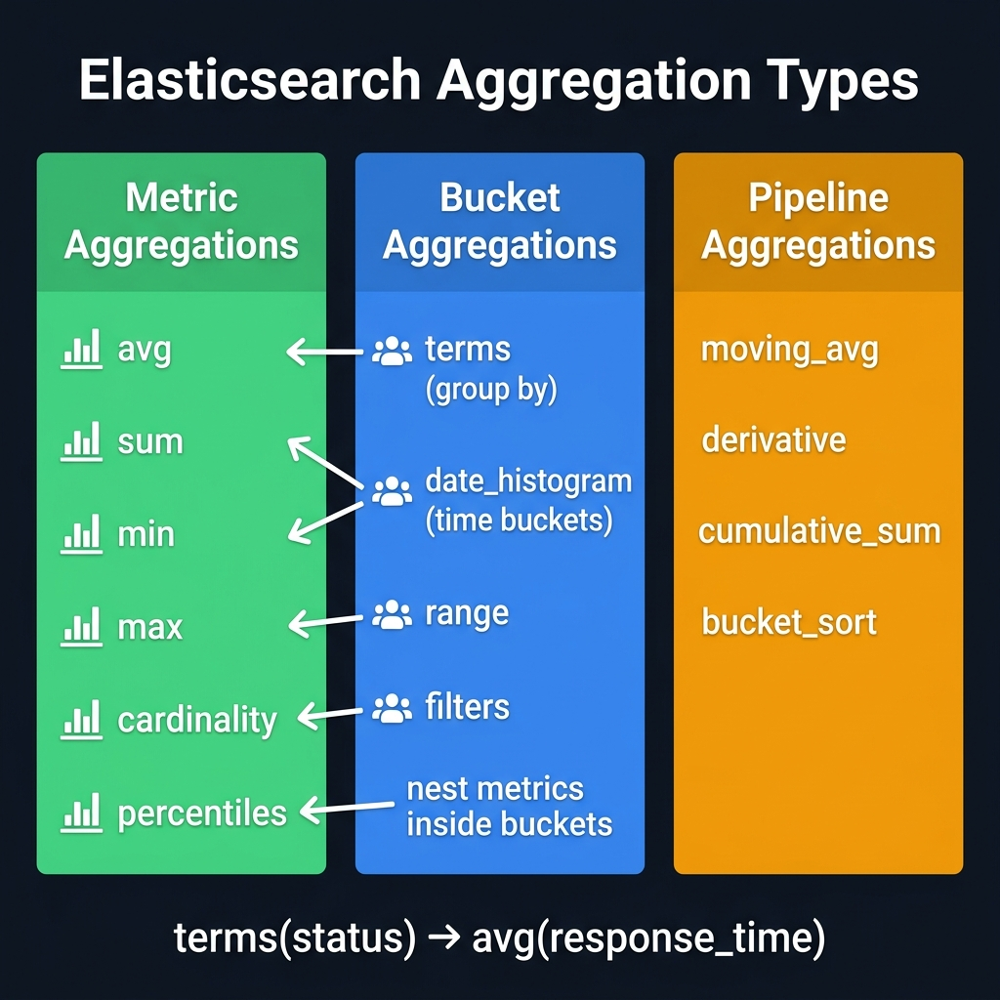

<!-- tags: elk-stack, observability, elasticsearch -->
# 📊 Elasticsearch Aggregations

> Bucket, Metric, Pipeline aggregations — analyze data directly within Elasticsearch.

📅 Created: 2026-03-24 · 🔄 Updated: 2026-04-20 · ⏱️ 14 min read

| Aspect            | Detail                                              |
| ----------------- | --------------------------------------------------- |
| **Aggregation types** | Bucket / Metric / Pipeline / Matrix             |
| **Execution**     | Post-query, parallel to hits                        |
| **Output**        | Nested JSON in "aggregations" key                   |
| **Performance**   | Filter before agg, use keyword fields               |

---

## 0. TEMPLATE

> Quick aggregations — copy-paste for common tasks.

```bash
# ── Basic aggregations ──────────────────────────────────────────
# Count by field (terms bucket)
curl -X POST 'localhost:9200/logs-*/_search?pretty' \
  -H 'Content-Type: application/json' \
  -d '{
    "size": 0,
    "aggs": {
      "by_status": {
        "terms": { "field": "status.keyword", "size": 10 }
      }
    }
  }'

# Average + Max metric
curl -X POST 'localhost:9200/orders/_search?pretty' \
  -H 'Content-Type: application/json' \
  -d '{
    "size": 0,
    "aggs": {
      "avg_price": { "avg": { "field": "price" } },
      "max_price": { "max": { "field": "price" } }
    }
  }'

# Date histogram (time series)
curl -X POST 'localhost:9200/logs-*/_search' \
  -H 'Content-Type: application/json' \
  -d '{
    "size": 0,
    "aggs": {
      "over_time": {
        "date_histogram": { "field": "@timestamp", "calendar_interval": "1h" },
        "aggs": {
          "error_count": { "filter": { "term": { "level.keyword": "ERROR" } } }
        }
      }
    }
  }'
```

---

## 1. DEFINE

At some point, the cluster is no longer just for finding documents but for answering aggregate questions over time, category, and histogram. Aggregations are where the search engine starts being used as an analytical surface.


### 4 Types of Aggregations

| Type         | Description                                              | Typical examples                             |
| ------------ | -------------------------------------------------------- | -------------------------------------------- |
| **Bucket**   | Group documents by criteria                              | `terms`, `date_histogram`, `range`, `filter` |
| **Metric**   | Numeric computation on a field                           | `avg`, `min`, `max`, `sum`, `percentiles`    |
| **Pipeline** | Computation on the results of another aggregation        | `moving_avg`, `derivative`, `bucket_sort`    |
| **Matrix**   | Cross-field statistics (correlation matrix)               | `matrix_stats`                               |

### Common Aggregations

| Aggregation       | Type     | Use case                          | Example field          |
| ----------------- | -------- | --------------------------------- | ---------------------- |
| `terms`           | Bucket   | Group by category                 | `status.keyword`       |
| `date_histogram`  | Bucket   | Time series by hour/day/week      | `@timestamp`           |
| `range`           | Bucket   | Group by value range              | `price`                |
| `filter`          | Bucket   | Bucket with query condition       | `level.keyword`        |
| `nested`          | Bucket   | Aggregate on nested objects       | `reviews`              |
| `avg`             | Metric   | Average value                     | `response_time`        |
| `min` / `max`     | Metric   | Minimum / maximum value           | `latency_ms`           |
| `sum`             | Metric   | Total value                       | `bytes_sent`           |
| `value_count`     | Metric   | Count documents with that field   | `user_id`              |
| `percentiles`     | Metric   | P50 / P95 / P99 latency           | `latency_ms`           |
| `cardinality`     | Metric   | Approximate unique count           | `user_id`              |
| `moving_avg`      | Pipeline | Smooth trend over time            | (on date_histogram)    |
| `derivative`      | Pipeline | Rate of change between buckets    | (on date_histogram)    |
| `bucket_sort`     | Pipeline | Sort + paginate agg results       | (on bucket agg)        |
| `cumulative_sum`  | Pipeline | Running total over time           | (on date_histogram)    |

### Nested Aggregations — Sub-aggregation within Bucket

Aggregations can be nested multiple levels deep. Each bucket can contain sub-aggregations that run independently on the documents in that bucket.

```text
aggs:
  by_service (terms bucket)          ← level 1: group by service
    └── avg_latency (avg metric)     ← level 2: average within each group
    └── per_hour (date_histogram)    ← level 2: time series within each group
          └── p99 (percentiles)      ← level 3: percentile within each hour/group
```

> **Note**: Bucket count grows exponentially when nesting multiple levels. Always filter first to reduce documents before aggregating.

---

Those failure modes sound easy to avoid. But there is a trap: aggregation on a text field by default = error because fielddata is disabled, and high cardinality terms agg = memory spike. That trap appears in PITFALLS.

## 2. VISUAL

The definition locked the vocabulary. The visual below shows the actual operational flow where containers, pods, log pipelines, and shell commands hit production.



### Aggregation Tree Flow

```text
Query → [Filter] → Documents
                       │
                       ▼
              ┌─────────────────────────────────┐
              │      Aggregation Tree            │
              │                                  │
              │  by_status (terms bucket)        │
              │  ├── "200" → count: 1523         │
              │  │    └── avg_latency: 45ms       │
              │  ├── "404" → count: 234           │
              │  │    └── avg_latency: 12ms       │
              │  └── "500" → count: 89            │
              │       └── avg_latency: 890ms ⚠️  │
              └─────────────────────────────────┘
```

### Bucket vs Metric vs Pipeline

```text
Documents
   │
   ├── BUCKET AGG ──────► Group documents into buckets
   │       │
   │       └── METRIC AGG ─► Compute on documents within each bucket
   │                                 │
   │                                 └── PIPELINE AGG ─► Compute on
   │                                                      metric/bucket results
   │                                                      (no documents needed)
   │
   └── METRIC AGG (top-level) ──► Compute on all documents
```

### Date Histogram with Pipeline

```text
Time:         10:00   11:00   12:00   13:00   14:00
              ──┬──────┬───────┬───────┬───────┬──▶
                │      │       │       │       │
Requests:      120    180     250     200     170    ← date_histogram (metric: count)
Moving avg:     -      -      183     210     207    ← moving_avg pipeline (window=3)
Derivative:    +60    +70     -50     -30      -     ← derivative pipeline
```

---

## 3. CODE

The flow above gives you intuition; the section below is what the team will copy, review, and be accountable for in production.


### Example 1: Basic — Terms Bucket + Nested Metric

> **Goal**: Count errors by service, with average latency per service.
> **Requires**: Index `app-logs` with fields `service.keyword`, `level.keyword`, `latency_ms`.
> **Result**: Dashboard breakdown errors by service with performance metrics.

```bash
# ── Create sample data ──────────────────────────────────────────
curl -X POST 'localhost:9200/app-logs/_bulk' \
  -H 'Content-Type: application/json' \
  -d '
{"index":{}}
{"service":"auth","level":"ERROR","latency_ms":230,"@timestamp":"2026-03-24T10:00:00Z"}
{"index":{}}
{"service":"auth","level":"INFO","latency_ms":45,"@timestamp":"2026-03-24T10:01:00Z"}
{"index":{}}
{"service":"payment","level":"ERROR","latency_ms":890,"@timestamp":"2026-03-24T10:02:00Z"}
{"index":{}}
{"service":"payment","level":"INFO","latency_ms":120,"@timestamp":"2026-03-24T10:03:00Z"}
{"index":{}}
{"service":"auth","level":"ERROR","latency_ms":310,"@timestamp":"2026-03-24T10:04:00Z"}
'

# ── Terms bucket + nested metric agg ───────────────────────────
curl -X POST 'localhost:9200/app-logs/_search?pretty' \
  -H 'Content-Type: application/json' \
  -d '{
    "size": 0,
    "query": {
      "term": { "level.keyword": "ERROR" }
    },
    "aggs": {
      "errors_by_service": {
        "terms": {
          "field": "service.keyword",
          "size": 20,
          "order": { "_count": "desc" }
        },
        "aggs": {
          "avg_latency": { "avg": { "field": "latency_ms" } },
          "max_latency": { "max": { "field": "latency_ms" } },
          "p95_latency": {
            "percentiles": {
              "field": "latency_ms",
              "percents": [50, 95, 99]
            }
          }
        }
      }
    }
  }'
# ✅ Result: each service bucket contains count + avg/max/p95 latency
# ✅ Filter ERROR first → only aggregate on errors, reduces I/O
```

> **Result**: Errors by service with latency stats. Filter before agg to reduce load.
> **Note**: `"size": 0` at top-level to suppress document hits — only agg results needed.

---

Bucket aggs are covered. But metric + pipeline aggs need composition — time to combine.

### Example 2: Intermediate — Date Histogram + Sub-aggregations

> **Goal**: Requests per hour with p99 latency — data for time-series dashboard.
> **Requires**: Index with `@timestamp` and `latency_ms`.
> **Result**: Kibana-ready time series with performance metrics.

```bash
# ── Date histogram with sub-agg ───────────────────────────────
curl -X POST 'localhost:9200/app-logs/_search?pretty' \
  -H 'Content-Type: application/json' \
  -d '{
    "size": 0,
    "query": {
      "range": {
        "@timestamp": {
          "gte": "now-24h",
          "lte": "now"
        }
      }
    },
    "aggs": {
      "requests_per_hour": {
        "date_histogram": {
          "field": "@timestamp",
          "calendar_interval": "1h",
          "min_doc_count": 0,
          "extended_bounds": {
            "min": "now-24h",
            "max": "now"
          }
        },
        "aggs": {
          "p99_latency": {
            "percentiles": {
              "field": "latency_ms",
              "percents": [99]
            }
          },
          "error_rate": {
            "filter": {
              "term": { "level.keyword": "ERROR" }
            }
          },
          "by_service": {
            "terms": {
              "field": "service.keyword",
              "size": 5
            }
          }
        }
      },
      "overall_stats": {
        "stats": { "field": "latency_ms" }
      }
    }
  }'
# ✅ min_doc_count: 0 + extended_bounds → show hours with no requests (count=0)
# ✅ overall_stats runs in parallel with date_histogram — single request
```

> **Result**: Time series with error rate + p99 latency per hour, top services each hour.
> **Note**: `calendar_interval` (1d/1w/1M) depends on timezone; use `fixed_interval` (1h/30m) for consistent bucket size.

---

Pipeline aggs are covered. But performance needs doc_count filtering — time to optimize.

### Example 3: Advanced — Pipeline Aggregations

> **Goal**: Moving average + derivative + top-N bucket sort.
> **Requires**: Understanding that pipeline aggs run on other agg outputs (not documents).
> **Result**: Trend analysis, rate-of-change detection, paginated aggregations.

```bash
# ── Pipeline agg: moving_avg + derivative + bucket_sort ─────────
curl -X POST 'localhost:9200/app-logs/_search?pretty' \
  -H 'Content-Type: application/json' \
  -d '{
    "size": 0,
    "aggs": {
      "per_hour": {
        "date_histogram": {
          "field": "@timestamp",
          "fixed_interval": "1h"
        },
        "aggs": {
          "request_count": {
            "value_count": { "field": "@timestamp" }
          },
          "avg_latency": {
            "avg": { "field": "latency_ms" }
          },
          "smoothed_latency": {
            "moving_avg": {
              "buckets_path": "avg_latency",
              "window": 3,
              "model": "simple"
            }
          },
          "latency_change_rate": {
            "derivative": {
              "buckets_path": "avg_latency"
            }
          }
        }
      },
      "top_services_by_errors": {
        "terms": {
          "field": "service.keyword",
          "size": 100
        },
        "aggs": {
          "error_count": {
            "filter": { "term": { "level.keyword": "ERROR" } }
          },
          "bucket_sort_top5": {
            "bucket_sort": {
              "sort": [{ "error_count>_count": { "order": "desc" } }],
              "size": 5
            }
          }
        }
      }
    }
  }'
# ✅ moving_avg window=3 → smooth short-term spikes
# ✅ derivative → detect sudden latency increases (positive spike = degradation)
# ✅ bucket_sort → paginate aggregation results, get top-5 services by errors

# ── Cumulative sum — running total ──────────────────────────────
curl -X POST 'localhost:9200/app-logs/_search?pretty' \
  -H 'Content-Type: application/json' \
  -d '{
    "size": 0,
    "aggs": {
      "per_hour": {
        "date_histogram": {
          "field": "@timestamp",
          "fixed_interval": "1h"
        },
        "aggs": {
          "hourly_errors": {
            "filter": { "term": { "level.keyword": "ERROR" } }
          },
          "total_errors_so_far": {
            "cumulative_sum": {
              "buckets_path": "hourly_errors>_count"
            }
          }
        }
      }
    }
  }'
# ✅ total_errors_so_far increases over time — running total on dashboard
```

> **Result**: Moving average to detect trend, derivative to detect sudden changes, bucket_sort for top-N.
> **Note**: Pipeline agg uses `buckets_path` to reference another agg. `"buckets_path": "parent_agg>child_metric"` when crossing levels.

---

You have covered bucket, pipeline, and optimization. Now comes the dangerous part: fielddata disabled and high cardinality — the trap set up from the beginning.

## 4. PITFALLS

Knowing how to do it right is only half the story. The other half is the places where it is easy to get almost right and then pay the price when the cluster or OS shakes.


| #   | Mistake                                                           | Root cause                                              | Fix                                                                       |
| --- | ----------------------------------------------------------------- | ------------------------------------------------------- | ------------------------------------------------------------------------- |
| 1   | Aggregation on `text` field → `400 Fielddata disabled`           | `text` field does not support agg by default (memory-intensive) | Use `.keyword` sub-field: `"field": "status.keyword"`                |
| 2   | `terms` agg misses data — sum of other buckets is large           | Default `size=10`, only takes top 10 terms              | Increase `"size": 1000` or use `composite` agg for full pagination       |
| 3   | `cardinality` result is not 100% accurate                         | Uses HyperLogLog++ — an approximation algorithm          | Accept ~5% error for dashboards; use `value_count` for exact             |
| 4   | Deeply nested agg → very slow query                              | Bucket count multiplies exponentially with nesting depth | Filter before agg, limit `size` in terms, use `sampler` agg             |
| 5   | `date_histogram` with `calendar_interval` shifts by timezone       | `1d` calendar = local day, not UTC 24h                  | Use `fixed_interval: "24h"` or set `time_zone: "Asia/Ho_Chi_Minh"`     |
| 6   | Pipeline agg returns `null` for some buckets                      | Bucket has no metric data (0 documents) → metric null   | Add `"gap_policy": "skip"` or `"insert_zeros"` in pipeline agg          |
| 7   | `terms` agg results inconsistent with many shards                 | Each shard computes top-N independently → imperfect merge | Increase `shard_size` (default `size * 1.5`) to improve accuracy        |

---

You have covered Aggregations and the traps. The resources below help go deeper.

## 5. REF

| Resource                  | Link                                                                                                                                                                               |
| ------------------------- | ---------------------------------------------------------------------------------------------------------------------------------------------------------------------------------- |
| Aggregations Reference    | [elastic.co/guide/en/elasticsearch/reference/current/search-aggregations.html](https://www.elastic.co/guide/en/elasticsearch/reference/current/search-aggregations.html)         |
| Bucket Aggregations       | [elastic.co/guide/en/elasticsearch/reference/current/search-aggregations-bucket.html](https://www.elastic.co/guide/en/elasticsearch/reference/current/search-aggregations-bucket.html) |
| Metric Aggregations       | [elastic.co/guide/en/elasticsearch/reference/current/search-aggregations-metrics.html](https://www.elastic.co/guide/en/elasticsearch/reference/current/search-aggregations-metrics.html) |
| Pipeline Aggregations     | [elastic.co/guide/en/elasticsearch/reference/current/search-aggregations-pipeline.html](https://www.elastic.co/guide/en/elasticsearch/reference/current/search-aggregations-pipeline.html) |

---

## 6. RECOMMEND

The suggestions below connect directly to the pressures that typically appear right after you apply these concepts to a real system.


| Technique                  | Use case                                   | Link                                                                                                                                                                                   |
| -------------------------- | ------------------------------------------ | -------------------------------------------------------------------------------------------------------------------------------------------------------------------------------------- |
| **Composite aggregation**  | Full pagination through large aggregations | [elastic.co/.../search-aggregations-bucket-composite-aggregation.html](https://www.elastic.co/guide/en/elasticsearch/reference/current/search-aggregations-bucket-composite-aggregation.html) |
| **Runtime fields**         | Compute fields at query time (no reindex)  | [elastic.co/.../runtime.html](https://www.elastic.co/guide/en/elasticsearch/reference/current/runtime.html)                                                                           |
| **Transform API**          | Materialize aggregation results into index | [elastic.co/.../transforms.html](https://www.elastic.co/guide/en/elasticsearch/reference/current/transforms.html)                                                                     |
| **Rollup jobs**            | Pre-aggregate time series data for history | [elastic.co/.../xpack-rollup.html](https://www.elastic.co/guide/en/elasticsearch/reference/current/xpack-rollup.html)                                                                 |
| **Sampler aggregation**    | Sample subset before agg — reduce load     | [elastic.co/.../search-aggregations-bucket-sampler-aggregation.html](https://www.elastic.co/guide/en/elasticsearch/reference/current/search-aggregations-bucket-sampler-aggregation.html) |

---

## 🃏 Quick Reference

| #   | Concept                | Command / Rule                                                                              |
| --- | ---------------------- | ------------------------------------------------------------------------------------------- |
| 1   | Terms bucket           | `"terms": { "field": "status.keyword", "size": 10 }`                                       |
| 2   | Date histogram         | `"date_histogram": { "field": "@timestamp", "calendar_interval": "1h" }`                   |
| 3   | Avg / Max / Min metric | `"avg": { "field": "latency_ms" }`                                                          |
| 4   | Percentiles            | `"percentiles": { "field": "latency_ms", "percents": [50, 95, 99] }`                        |
| 5   | Cardinality (approx)   | `"cardinality": { "field": "user_id" }` — uses HyperLogLog++                    |
| 6   | Nested sub-agg         | Place `"aggs": {...}` inside a bucket agg                                       |
| 7   | Pipeline moving_avg    | `"moving_avg": { "buckets_path": "avg_latency", "window": 3 }`                 |
| 8   | Suppress hits          | Always set `"size": 0` at top-level when only aggregation is needed             |
| 9   | Filter before agg      | Use `"query"` to filter first — reduces documents to aggregate                 |
| 10  | Composite pagination   | `"composite": { "sources": [...], "after": {...} }` — iterate all buckets       |

---

## 🔍 Debug Checklist

| #   | Symptom                                            | Root cause                                                     | Diagnostic command                                                                |
| --- | -------------------------------------------------- | -------------------------------------------------------------- | --------------------------------------------------------------------------------- |
| 1   | `400: Fielddata disabled on field`                 | Aggregation on `text` field without fielddata                  | `GET /index/_mapping` → check field type; switch to `.keyword`                   |
| 2   | `terms` agg only returns 10 buckets                | Default `size=10`                                              | Add `"size": 1000` or use `composite` agg                                         |
| 3   | Pipeline agg returns `null` or missing buckets     | Bucket has no documents → metric null → gap in pipeline       | Add `"gap_policy": "skip"` or `"insert_zeros"`                                    |
| 4   | Aggregation very slow on large index               | No filter before agg, aggregating all documents                | Add `"query"` filter; check `_profile` API to analyze bottleneck                  |
| 5   | `cardinality` result differs from `SELECT COUNT(DISTINCT ...)` | HyperLogLog++ approximation (~5% error)           | Use `"precision_threshold": 40000` to increase accuracy (costs more memory)       |
| 6   | `date_histogram` bucket shifts by timezone         | Timezone not set, defaults to UTC                              | Add `"time_zone": "Asia/Ho_Chi_Minh"` to date_histogram                           |
| 7   | `terms` agg results change on each run             | Shard-level top-N merge is not deterministic with ties         | Increase `"shard_size"` to improve accuracy                                        |

---

## 🎯 Interview Angle

**Related system design / technical questions:**
- *"When to use aggregation in ES instead of GROUP BY in a database?"*
- *"Is cardinality aggregation accurate? Why or why not?"*
- *"Explain pipeline aggregation and a real-world use case."*
- *"Why can `terms` aggregation give inaccurate results?"*

**Key talking points interviewers expect:**

| Topic                     | Talking point                                                                                                                                                                           |
| ------------------------- | --------------------------------------------------------------------------------------------------------------------------------------------------------------------------------------- |
| ES agg vs DB GROUP BY     | ES agg runs distributed across many shards, in parallel with query (post-query). DB GROUP BY requires full table scan and does not scale well on unstructured/time-series data          |
| Bucket vs Metric vs Pipeline | Bucket groups documents (terms, date_histogram). Metric computes on documents within a bucket (avg, max, percentiles). Pipeline computes on output of another agg — no documents needed |
| cardinality HyperLogLog   | Uses HyperLogLog++ — approximate unique count with ~5% error, but fixed memory usage. Exact count requires reading all values → does not scale. Trade-off: accuracy vs performance     |
| Nested agg performance    | Each level multiplies bucket count → exponential growth. Filter first, limit `size`, use `sampler` to sample, or materialize results with Transform API                                |
| Composite agg for pagination | `terms` agg cannot paginate (only top-N). `composite` agg uses cursor (`after_key`) to scroll through all unique combinations — suitable for full export                               |

**Common follow-up questions:**
- *"How to aggregate on historical data without slowing the cluster?"* → Use Rollup API to pre-aggregate, or Transform API to materialize results into a separate index
- *"Explain shard_size in terms agg?"* → Each shard computes top-`shard_size` terms independently, then coordinator merges → top-`size`. Larger `shard_size` → more accurate but more network overhead

---

**Links**: [← Mapping & Analyzer](./03-mapping-analyzer.md) | [→ ILM & Index Templates](./05-ilm-index-templates.md)
