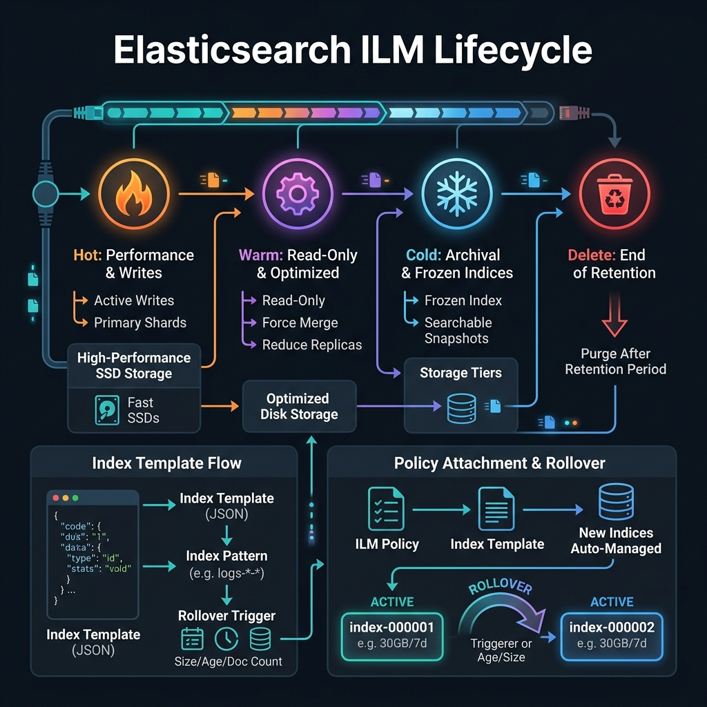

<!-- tags: elk-stack, observability -->
# ♻️ ILM & Index Templates

> Index Lifecycle Management, Index Templates, Rollover — managing data lifecycle in Elasticsearch.

📅 Created: 2026-03-24 · 🔄 Updated: 2026-04-20 · ⏱️ 15 min read

| Aspect              | Detail                                                  |
| ------------------- | ------------------------------------------------------- |
| **ILM Phases**      | Hot → Warm → Cold → Frozen → Delete                     |
| **Rollover trigger**| max_age / max_docs / max_size                           |
| **Templates**       | Index Templates + Component Templates                   |
| **Data Streams**    | Append-only time series (logs, metrics)                 |

---

## 0. TEMPLATE

> Quick ILM + templates setup — copy-paste for common tasks.

```bash
# ── ILM Policy ──────────────────────────────────────────────────
# Create ILM policy
curl -X PUT 'localhost:9200/_ilm/policy/logs-policy' \
  -H 'Content-Type: application/json' \
  -d '{
    "policy": {
      "phases": {
        "hot":    { "actions": { "rollover": { "max_size": "50GB", "max_age": "7d" } } },
        "warm":   { "min_age": "7d",  "actions": { "shrink": { "number_of_shards": 1 }, "forcemerge": { "max_num_segments": 1 } } },
        "cold":   { "min_age": "30d", "actions": { "freeze": {} } },
        "delete": { "min_age": "90d", "actions": { "delete": {} } }
      }
    }
  }'

# ── Index Template ───────────────────────────────────────────────
curl -X PUT 'localhost:9200/_index_template/logs-template' \
  -H 'Content-Type: application/json' \
  -d '{
    "index_patterns": ["logs-*"],
    "template": {
      "settings": { "number_of_shards": 2, "lifecycle": { "name": "logs-policy", "rollover_alias": "logs" } },
      "mappings":  { "properties": { "@timestamp": { "type": "date" }, "level": { "type": "keyword" } } }
    }
  }'

# ── Bootstrap + Rollover ────────────────────────────────────────
curl -X PUT 'localhost:9200/logs-000001' \
  -H 'Content-Type: application/json' \
  -d '{"aliases": {"logs": {"is_write_index": true}}}'

curl -X POST 'localhost:9200/logs/_rollover'                  # Manual rollover
curl -X GET  'localhost:9200/_ilm/explain/logs-000001'        # Check ILM status
```

---

## 1. DEFINE

Log data cannot be kept forever in its original form. ILM and index templates are where storage cost, retention policy, and operability collide head-on.


### ILM Phases — Index Lifecycle

| Phase      | Description                    | Storage      | Replicas          | Typical actions                        |
| ---------- | ------------------------------ | ------------ | ----------------- | -------------------------------------- |
| **Hot**    | Active writes, fast queries    | SSD          | Primary + replica | `rollover`, `set_priority`             |
| **Warm**   | No new writes, still queryable | HDD          | 1 replica         | `shrink`, `forcemerge`, `set_priority` |
| **Cold**   | Rare queries, save resources   | HDD / Object | 0 replica         | `freeze`, `allocate`                   |
| **Frozen** | Searchable snapshot, minimal   | Object store | 0 replica         | `searchable_snapshot`                  |
| **Delete** | Permanently remove index       | —            | —                 | `delete`, `wait_for_snapshot`          |

### Rollover Triggers

ILM automatically creates a new index when any of the following conditions is met:

| Trigger       | Example                | When to use                                     |
| ------------- | ---------------------- | ----------------------------------------------- |
| `max_size`    | `"max_size": "50GB"`   | Control shard size — keep shards < 50GB         |
| `max_age`     | `"max_age": "7d"`      | Rollover by time — daily/weekly log rotation    |
| `max_docs`    | `"max_docs": 10000000` | Limit document count — consistent query time    |
| `max_primary_shard_size` | `"max_primary_shard_size": "30GB"` | Based on primary shard size |

### Index Templates vs Component Templates

```text
Component Template A        Component Template B
(shared mappings)           (shared settings)
       │                          │
       └──────────┬───────────────┘
                  ▼
         Index Template
         (compose A + B + index_patterns)
                  │
                  ▼
         logs-000001, logs-000002, ...  (auto-apply on create)
```

- **Component Templates**: Reusable building blocks — mappings, settings, aliases
- **Index Templates**: Compose component templates + auto-apply by `index_patterns`
- **Priority**: Higher `priority` template wins when multiple templates match the same index

### Data Streams — Best Practice for Time Series

Data Streams are an abstraction layer on top of alias-based rollover:

- Append-only (can only index, cannot update/delete documents directly)
- Auto-rollover through ILM
- Backing indices are managed automatically (`.ds-logs-app-000001`, ...)
- Suitable for: logs, metrics, traces — any time-series data

---

Those failure modes sound basic. But there is a trap: an ILM policy missing the delete phase = unlimited storage growth, and wrong template priority = index settings silently overridden. That trap appears in PITFALLS.

## 2. VISUAL

Theory sounds clean on paper. The visual below pulls it into the real operational context where latency, failure, and ownership are no longer abstract.




### ILM Lifecycle Flow

```text
 WRITE ──▶  [HOT index]  ──rollover──▶  [WARM index]  ──▶  [COLD index]  ──▶  DELETE
            logs-000001                  logs-000002         logs-000003
            SSD · P+R                    HDD · 1 rep         frozen/snapshot
            7d / 50GB                    @7d min_age          @30d min_age       @90d
```

### ILM Phase Transitions

```text
 t=0d                t=7d               t=30d              t=90d
  │                   │                  │                   │
  ▼                   ▼                  ▼                   ▼
[HOT]──────────▶[WARM]─────────────▶[COLD]──────────▶[DELETE]
 │                │                   │
 Rollover:        Shrink shards        Freeze / searchable
 50GB or 7d       Forcemerge 1 seg     snapshot
 Active writes    No new writes        Read-only, minimal
                                       resources
```

### Alias-based Rollover vs Data Streams

```text
── Alias-based Rollover (traditional) ───────────────────────────
  Write alias: "logs" → points to logs-000001 (is_write_index)
  Read  alias: "logs" → points to logs-000001, logs-000002, ...
  Rollover: ILM creates logs-000002, moves write alias

── Data Streams (recommended) ───────────────────────────────────
  Data stream: "logs-app"
  Write:  auto-route to latest backing index
  Read:   query all backing indices
  .ds-logs-app-000001   .ds-logs-app-000002   .ds-logs-app-000003
  (hidden, managed by DS)
```

---

## 3. CODE

Code and config is where the decisions just discussed are enforced by real constraints, not just a pretty diagram.


### Example 1: Basic — ILM Policy + Index Template + Bootstrap

> **Goal**: Set up ILM for a production log pipeline.
> **Requires**: ES 7.x+ running.
> **Result**: Auto-rollover + lifecycle management for logs index.

```bash
# ── Step 1: Create ILM policy ──────────────────────────────────
curl -X PUT 'localhost:9200/_ilm/policy/app-logs-policy' \
  -H 'Content-Type: application/json' \
  -d '{
    "policy": {
      "phases": {
        "hot": {
          "min_age": "0ms",
          "actions": {
            "rollover": {
              "max_primary_shard_size": "30GB",
              "max_age": "7d"
            },
            "set_priority": { "priority": 100 }
          }
        },
        "warm": {
          "min_age": "7d",
          "actions": {
            "set_priority": { "priority": 50 },
            "shrink": { "number_of_shards": 1 },
            "forcemerge": { "max_num_segments": 1 },
            "allocate": { "require": { "data": "warm" } }
          }
        },
        "cold": {
          "min_age": "30d",
          "actions": {
            "set_priority": { "priority": 0 },
            "allocate": { "require": { "data": "cold" } },
            "freeze": {}
          }
        },
        "delete": {
          "min_age": "90d",
          "actions": {
            "wait_for_snapshot": { "policy": "daily-snapshots" },
            "delete": {}
          }
        }
      }
    }
  }'

# ── Step 2: Create index template ──────────────────────────────
curl -X PUT 'localhost:9200/_index_template/app-logs-template' \
  -H 'Content-Type: application/json' \
  -d '{
    "index_patterns": ["app-logs-*"],
    "priority": 100,
    "template": {
      "settings": {
        "number_of_shards": 2,
        "number_of_replicas": 1,
        "lifecycle": {
          "name": "app-logs-policy",
          "rollover_alias": "app-logs"
        },
        "refresh_interval": "5s"
      },
      "mappings": {
        "dynamic": "false",
        "properties": {
          "@timestamp":   { "type": "date" },
          "level":        { "type": "keyword" },
          "service":      { "type": "keyword" },
          "message":      { "type": "text" },
          "trace_id":     { "type": "keyword" },
          "duration_ms":  { "type": "integer" }
        }
      }
    }
  }'

# ── Step 3: Bootstrap first index ──────────────────────────────
curl -X PUT 'localhost:9200/app-logs-000001' \
  -H 'Content-Type: application/json' \
  -d '{
    "aliases": {
      "app-logs": {
        "is_write_index": true
      }
    }
  }'

# ── Step 4: Verify ILM and alias ───────────────────────────────
curl -X GET 'localhost:9200/_ilm/explain/app-logs-000001?pretty'
# ✅ Shows current phase, age, and next action

curl -X GET 'localhost:9200/_alias/app-logs?pretty'
# ✅ is_write_index: true on app-logs-000001

# ── Index document via write alias ─────────────────────────────
curl -X POST 'localhost:9200/app-logs/_doc' \
  -H 'Content-Type: application/json' \
  -d '{
    "@timestamp": "2026-03-24T10:00:00Z",
    "level": "INFO",
    "service": "auth",
    "message": "User login successful",
    "trace_id": "abc123",
    "duration_ms": 45
  }'
```

> **Result**: ILM policy with hot/warm/cold/delete, index template auto-apply, bootstrap alias.
> **Note**: Always bootstrap the index before Logstash/app writes — if the index does not exist, ILM rollover will not work.

---

ILM policy is covered. But index templates need composition — time to layer.

### Example 2: Intermediate — Component Templates Composition

> **Goal**: Reusable component templates for multiple log types.
> **Requires**: ES 7.8+.
> **Result**: DRY configuration, easy to maintain when changing shared settings.

```bash
# ── Component Template 1: Common mappings ──────────────────────
curl -X PUT 'localhost:9200/_component_template/common-mappings' \
  -H 'Content-Type: application/json' \
  -d '{
    "template": {
      "mappings": {
        "dynamic": "false",
        "properties": {
          "@timestamp":  { "type": "date" },
          "service":     { "type": "keyword" },
          "environment": { "type": "keyword" },
          "trace_id":    { "type": "keyword" },
          "span_id":     { "type": "keyword" }
        }
      }
    }
  }'

# ── Component Template 2: ILM settings ─────────────────────────
curl -X PUT 'localhost:9200/_component_template/ilm-settings' \
  -H 'Content-Type: application/json' \
  -d '{
    "template": {
      "settings": {
        "number_of_shards": 2,
        "number_of_replicas": 1,
        "lifecycle": {
          "name": "app-logs-policy",
          "rollover_alias": "logs"
        },
        "refresh_interval": "5s"
      }
    }
  }'

# ── Component Template 3: App-specific mappings ─────────────────
curl -X PUT 'localhost:9200/_component_template/app-log-mappings' \
  -H 'Content-Type: application/json' \
  -d '{
    "template": {
      "mappings": {
        "properties": {
          "level":       { "type": "keyword" },
          "message":     { "type": "text", "fields": { "keyword": { "type": "keyword", "ignore_above": 512 } } },
          "duration_ms": { "type": "integer" },
          "user_id":     { "type": "keyword" },
          "http_status": { "type": "short" }
        }
      }
    }
  }'

# ── Index Template: compose component templates ─────────────────
curl -X PUT 'localhost:9200/_index_template/app-logs-composed' \
  -H 'Content-Type: application/json' \
  -d '{
    "index_patterns": ["app-logs-*"],
    "priority": 200,
    "composed_of": ["common-mappings", "ilm-settings", "app-log-mappings"],
    "template": {
      "settings": {
        "lifecycle": {
          "rollover_alias": "app-logs"
        }
      }
    }
  }'

# ── Verify template applied correctly ───────────────────────
curl -X GET 'localhost:9200/_index_template/app-logs-composed?pretty'
curl -X POST 'localhost:9200/_index_template/_simulate_index/app-logs-000001?pretty'
# ✅ _simulate_index → preview final settings/mappings that will apply
```

> **Result**: Reusable component templates, easy to update shared settings without editing each template.
> **Note**: Order in `composed_of` matters — later templates override earlier ones on conflict.

---

Templates are covered. But data streams need lifecycle automation — time to manage.

### Example 3: Advanced — Data Streams with ILM

> **Goal**: Modern time-series setup with Data Streams.
> **Requires**: ES 7.9+, data is append-only time series.
> **Result**: Fully managed rollover, zero bootstrap required, best practice for logs/metrics.

```bash
# ── Step 1: ILM policy for data stream ────────────────────────
curl -X PUT 'localhost:9200/_ilm/policy/datastream-policy' \
  -H 'Content-Type: application/json' \
  -d '{
    "policy": {
      "phases": {
        "hot":    { "actions": { "rollover": { "max_size": "30GB", "max_age": "3d" } } },
        "warm":   { "min_age": "3d",  "actions": { "shrink": { "number_of_shards": 1 }, "forcemerge": { "max_num_segments": 1 } } },
        "cold":   { "min_age": "14d", "actions": { "searchable_snapshot": { "snapshot_repository": "my-repo" } } },
        "delete": { "min_age": "60d", "actions": { "delete": {} } }
      }
    }
  }'

# ── Step 2: Index template for data stream ────────────────────
curl -X PUT 'localhost:9200/_index_template/logs-ds-template' \
  -H 'Content-Type: application/json' \
  -d '{
    "index_patterns": ["logs-app-*"],
    "data_stream": {},
    "priority": 500,
    "template": {
      "settings": {
        "lifecycle": { "name": "datastream-policy" },
        "number_of_shards": 2,
        "number_of_replicas": 1
      },
      "mappings": {
        "properties": {
          "@timestamp": { "type": "date" },
          "level":      { "type": "keyword" },
          "service":    { "type": "keyword" },
          "message":    { "type": "text" }
        }
      }
    }
  }'

# ── Step 3: Data stream auto-creates on first index ─────────
# NO bootstrap needed! Just index a document:
curl -X POST 'localhost:9200/logs-app-prod/_doc' \
  -H 'Content-Type: application/json' \
  -d '{
    "@timestamp": "2026-03-24T10:00:00Z",
    "level": "INFO",
    "service": "payment",
    "message": "Payment processed successfully"
  }'
# ✅ Data stream logs-app-prod auto-created with backing index .ds-logs-app-prod-000001

# ── Check data stream ──────────────────────────────────────
curl -X GET 'localhost:9200/_data_stream/logs-app-prod?pretty'
curl -X GET 'localhost:9200/_data_stream/logs-app-prod/_stats?pretty'

# ── Manual rollover data stream ─────────────────────────────────
curl -X POST 'localhost:9200/logs-app-prod/_rollover?pretty'

# ── Query data stream (same as regular index) ─────────────────
curl -X GET 'localhost:9200/logs-app-prod/_search?pretty' \
  -H 'Content-Type: application/json' \
  -d '{
    "query": {
      "range": {
        "@timestamp": { "gte": "now-1h" }
      }
    }
  }'

# ── ILM explain for backing index ─────────────────────────
curl -X GET 'localhost:9200/.ds-logs-app-prod-*/_ilm/explain?pretty'
```

> **Result**: Data Streams with ILM — no bootstrap needed, auto-rollover, backing indices fully managed.
> **Note**: Data Streams only support append. If you need `update` or `delete` on documents, use traditional alias-based rollover.

---

You have covered ILM, templates, and data streams. Now comes the dangerous part: missing delete phase and priority collision — the trap set up from the beginning.

## 4. PITFALLS

Production rarely breaks because someone does not know the concept name; it breaks because wrong assumptions and overly trusted defaults. The pitfalls below are the most expensive slips.


| #   | Mistake                                                              | Root cause                                                        | Fix                                                                                               |
| --- | -------------------------------------------------------------------- | ----------------------------------------------------------------- | ------------------------------------------------------------------------------------------------- |
| 1   | ILM does not transition to next phase after many hours               | Default polling interval is 10 minutes, min_age not yet reached   | `PUT _cluster/settings {"persistent":{"indices.lifecycle.poll_interval":"1m"}}` for faster testing |
| 2   | Rollover does not trigger despite conditions being met               | Alias missing `is_write_index: true` → ILM cannot determine which index to rollover | Check `GET /_alias/logs` → add `"is_write_index": true` to write index                    |
| 3   | `shrink` in warm phase fails with shard count error                  | Target shard count must be a factor of current shard count        | If current = 6 shards, can only shrink to 1, 2, or 3                                             |
| 4   | `forcemerge` in hot phase causes I/O spike, impacts ingestion        | forcemerge is I/O intensive, should not run during active writes  | Only use `forcemerge` in warm phase — index is already read-only at that point                    |
| 5   | Index template priority conflict — template not applied              | Two templates match the same `index_patterns` with equal priority | Set `priority` explicitly: custom templates must have higher priority than built-in (>100)        |
| 6   | Data stream cannot be created — `400: No mapping found`              | Template does not match `index_patterns` or missing `"data_stream": {}` | Check `GET /_index_template/template-name`; add `"data_stream": {}` to template              |
| 7   | Searchable snapshot in cold phase fails                              | Snapshot repository not registered or bucket permissions missing  | `GET /_snapshot/_all` to check repo; verify cloud storage credentials                            |

---

You have covered ILM & Index Templates and the traps. The resources below help go deeper.

## 5. REF

| Resource                  | Link                                                                                                                                                                                                 |
| ------------------------- | ---------------------------------------------------------------------------------------------------------------------------------------------------------------------------------------------------- |
| ILM Overview              | [elastic.co/guide/en/elasticsearch/reference/current/index-lifecycle-management.html](https://www.elastic.co/guide/en/elasticsearch/reference/current/index-lifecycle-management.html)              |
| Index Templates           | [elastic.co/guide/en/elasticsearch/reference/current/index-templates.html](https://www.elastic.co/guide/en/elasticsearch/reference/current/index-templates.html)                                   |
| Data Streams              | [elastic.co/guide/en/elasticsearch/reference/current/data-streams.html](https://www.elastic.co/guide/en/elasticsearch/reference/current/data-streams.html)                                         |
| Rollover API              | [elastic.co/guide/en/elasticsearch/reference/current/indices-rollover-index.html](https://www.elastic.co/guide/en/elasticsearch/reference/current/indices-rollover-index.html)                     |
| ILM Actions Reference     | [elastic.co/guide/en/elasticsearch/reference/current/ilm-actions.html](https://www.elastic.co/guide/en/elasticsearch/reference/current/ilm-actions.html)                                           |

---

## 6. RECOMMEND

Once you see what this lane solves and where it typically breaks, the resources below expand along the adjacent operational pressures.


| Technique                     | Use case                                         | Link                                                                                                                                                                         |
| ----------------------------- | ------------------------------------------------ | ---------------------------------------------------------------------------------------------------------------------------------------------------------------------------- |
| **Searchable Snapshots**      | Cold/Frozen tier — save disk, still searchable   | [elastic.co/.../searchable-snapshots.html](https://www.elastic.co/guide/en/elasticsearch/reference/current/searchable-snapshots.html)                                       |
| **Cross-Cluster Replication** | Geo-distributed data, DR setup                   | [elastic.co/.../xpack-ccr.html](https://www.elastic.co/guide/en/elasticsearch/reference/current/xpack-ccr.html)                                                             |
| **Snapshot Lifecycle (SLM)**  | Automated backups on schedule                    | [elastic.co/.../snapshot-lifecycle-management.html](https://www.elastic.co/guide/en/elasticsearch/reference/current/snapshot-lifecycle-management.html)                     |
| **Frozen tier**               | Petabyte-scale historical data, minimal cost     | [elastic.co/.../data-tiers.html](https://www.elastic.co/guide/en/elasticsearch/reference/current/data-tiers.html)                                                           |
| **Auto-scaling**              | Cloud deployment — scale nodes by ILM tier       | [elastic.co/.../autoscaling-apis.html](https://www.elastic.co/guide/en/elasticsearch/reference/current/autoscaling-apis.html)                                               |

---

## 🃏 Quick Reference

| #   | Concept                    | Command / Rule                                                                                           |
| --- | -------------------------- | -------------------------------------------------------------------------------------------------------- |
| 1   | Create ILM policy          | `PUT /_ilm/policy/policy-name { "policy": { "phases": {...} } }`                                         |
| 2   | Check ILM status           | `GET /_ilm/explain/index-name`                                                                           |
| 3   | Force ILM move to next     | `POST /_ilm/move/index-name { "current_step": {...}, "next_step": {...} }`                               |
| 4   | Create index template      | `PUT /_index_template/name { "index_patterns": ["logs-*"], "template": {...} }`                          |
| 5   | Simulate template apply    | `POST /_index_template/_simulate_index/index-name` — preview final result                                |
| 6   | Bootstrap write alias      | `PUT /logs-000001 { "aliases": { "logs": { "is_write_index": true } } }`                                 |
| 7   | Manual rollover            | `POST /alias/_rollover`                                                                                  |
| 8   | Data stream auto-create    | Just add `"data_stream": {}` in template — first index auto-creates the data stream                      |
| 9   | ILM polling interval       | `PUT _cluster/settings {"persistent":{"indices.lifecycle.poll_interval":"1m"}}` (default: 10m)          |
| 10  | List data streams          | `GET /_data_stream` or `GET /_data_stream/pattern-*`                                                     |

---

## 🔍 Debug Checklist

| #   | Symptom                                                | Root cause                                                       | Diagnostic command                                                                    |
| --- | ------------------------------------------------------ | ---------------------------------------------------------------- | ------------------------------------------------------------------------------------- |
| 1   | ILM not running — index stuck in hot phase             | Polling interval 10 min; or min_age not yet reached              | `GET /_ilm/explain/index-name` → check `age` and `phase_execution`                    |
| 2   | Rollover not happening despite max_age exceeded        | Alias missing `is_write_index: true`                             | `GET /_alias/alias-name` → check `is_write_index`                                     |
| 3   | `shrink` failed: `"target shards must be divisor"`     | Target shard count is not a factor of current                    | Check `_cat/shards/index-name` → calculate valid factor                                |
| 4   | Index template not applied to new index                | `index_patterns` does not match, or priority overridden          | `GET /_index_template` → check patterns; `POST /_index_template/_simulate_index/x`    |
| 5   | Data stream created but ILM not running                | Template missing `"lifecycle": {"name": "policy-name"}`          | `GET /_data_stream/name` → check `template`; verify template settings                  |
| 6   | `freeze` deprecated warning in logs                    | `freeze` action deprecated since ES 7.14 — replaced by searchable snapshots | Use `searchable_snapshot` in cold phase instead of `freeze`               |
| 7   | Component template change not applied to existing index | Templates only apply on CREATE — not retroactive                | Must rollover (create new index) to apply template changes                             |

---

## 🎯 Interview Angle

**Related system design / technical questions:**
- *"Why is ILM needed? What happens without it?"*
- *"How does rollover work? What happens when rollover triggers?"*
- *"Data Streams vs alias-based rollover — when to use which?"*
- *"Explain hot/warm/cold tier and how ILM saves cost."*

**Key talking points interviewers expect:**

| Topic                         | Talking point                                                                                                                                                                                     |
| ----------------------------- | ------------------------------------------------------------------------------------------------------------------------------------------------------------------------------------------------- |
| Why ILM is needed             | Without ILM → log index grows forever → shard too large → slow queries, disk exhaustion. ILM auto-rolls over when index is large enough, moves old data to cheaper tiers (HDD/cold), deletes data past retention |
| Rollover mechanism            | ILM polling (default 10m) checks conditions. When `max_size/max_age/max_docs` met → creates new index (logs-000002), moves write alias to new index → app continues writing without interruption  |
| Hot/Warm/Cold tier            | Hot: SSD, full replicas, active write/query. Warm: HDD, shrink shard count, forcemerge 1 segment, reduce memory. Cold: freeze/searchable snapshot, nearly free with object storage (S3/GCS)      |
| Data Streams best practice    | Data Streams are managed alias-based rollover — no bootstrap, no manual alias management. Backing indices named automatically. Ideal for logs/metrics (append-only)                               |
| Index Templates vs Component  | Component templates are reusable blocks (like interfaces/mixins). Index templates compose from component templates and apply by `index_patterns`. Easy to maintain: change 1 component → all templates update |

**Common follow-up questions:**
- *"How to reduce long-term log storage cost?"* → Cold/Frozen tier with Searchable Snapshots: data stored on S3/GCS (very cheap), still searchable when needed. Combine with ILM policy: hot 7d → warm 30d → cold/searchable snapshot 90d → delete 1 year
- *"Does changing an ILM policy apply to running indices?"* → Yes, ILM reads the latest policy on each check. But actions already executed in the current phase will not undo. Use `_ilm/explain` to see the current step

---

**Links**: [← Aggregations](./04-aggregations.md) | [→ Security & Auth](./06-security-auth.md)
