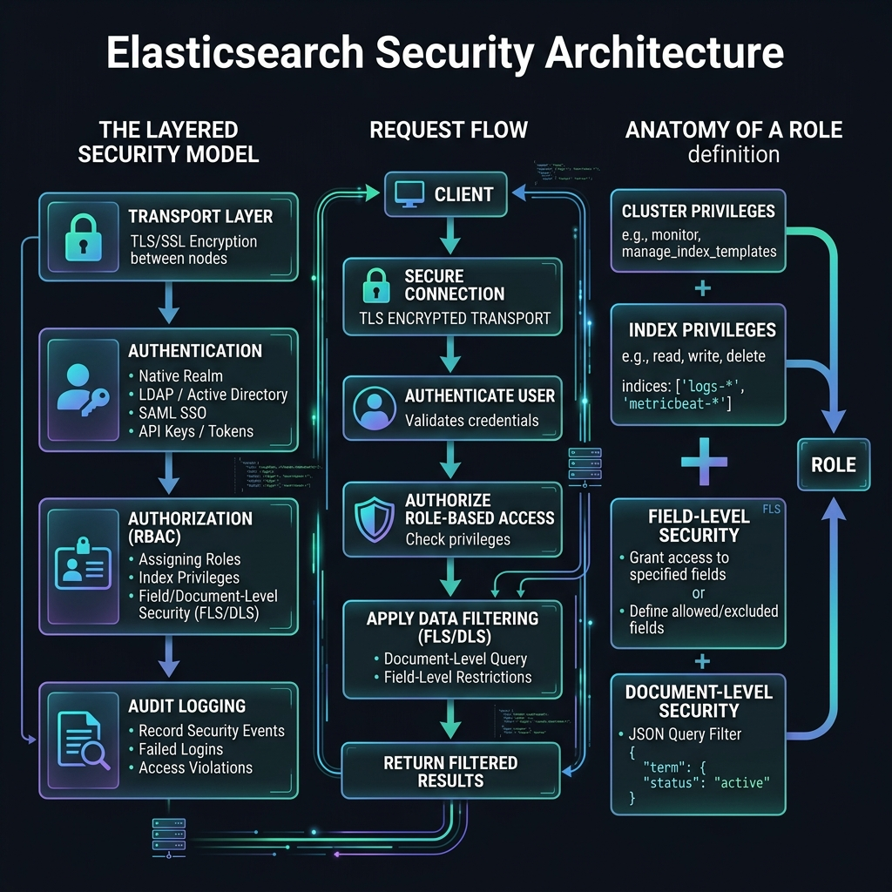

<!-- tags: elk-stack, observability, elasticsearch -->
# 🔒 Elasticsearch Security

> xpack.security, TLS/mTLS, API Keys, RBAC, Audit Logging — securing Elasticsearch in production.

📅 Created: 2026-03-24 · 🔄 Updated: 2026-04-20 · ⏱️ 14 min read

| Aspect           | Detail                                              |
| ---------------- | --------------------------------------------------- |
| **Auth methods** | Built-in users, API Key, PKI, LDAP/AD, SAML         |
| **Authorization** | Role-Based Access Control (RBAC)                   |
| **Encryption**   | TLS for HTTP (9200) + Transport (9300)              |
| **Audit**        | Configurable audit logging                          |

---

## 0. TEMPLATE

> Enable security, bootstrap users, create API key and basic role.

```bash
# ── Enable security (elasticsearch.yml) ──────────────────────────
# xpack.security.enabled: true
# xpack.security.transport.ssl.enabled: true
# xpack.security.http.ssl.enabled: true

# ── Bootstrap password ──────────────────────────────────────────
bin/elasticsearch-setup-passwords interactive   # Set built-in user passwords
bin/elasticsearch-setup-passwords auto          # Auto-generate passwords

# ── API Keys ────────────────────────────────────────────────────
# Create API key
curl -X POST 'localhost:9200/_security/api_key' \
  -H 'Content-Type: application/json' \
  -u elastic:changeme \
  -d '{"name": "my-service-key", "expiration": "30d", "role_descriptors": {"my-role": {"cluster": ["monitor"], "indices": [{"names": ["logs-*"], "privileges": ["read"]}]}}}'

# List API keys
curl 'localhost:9200/_security/api_key?pretty' -u elastic:changeme

# Invalidate API key
curl -X DELETE 'localhost:9200/_security/api_key' -H 'Content-Type: application/json' \
  -u elastic:changeme -d '{"id": "key-id"}'

# ── RBAC — Create role + user ────────────────────────────────────
curl -X PUT 'localhost:9200/_security/role/logs-reader' \
  -H 'Content-Type: application/json' -u elastic:changeme \
  -d '{"cluster": [], "indices": [{"names": ["logs-*"], "privileges": ["read", "view_index_metadata"]}]}'

curl -X PUT 'localhost:9200/_security/user/alice' \
  -H 'Content-Type: application/json' -u elastic:changeme \
  -d '{"password": "s3cr3t!", "roles": ["logs-reader"], "full_name": "Alice"}'
```

---

## 1. DEFINE

An open search cluster is not just an auth problem; it exposes sensitive data through an extremely powerful query API. Security in ELK must be treated as a production surface, not an afterthought.


### Built-in Users

| User | Purpose | Default privileges |
| ---- | ------- | ------------------ |
| `elastic` | Superuser — full system administration | All privileges |
| `kibana_system` | Kibana connects to ES | Kibana internal ops |
| `logstash_system` | Logstash monitoring | Monitoring write |
| `beats_system` | Beats monitoring | Monitoring write |
| `apm_system` | APM server | APM index write |
| `remote_monitoring_user` | Metricbeat monitoring cluster | Read monitoring |

> **Note**: Only use `elastic` superuser for admin tasks. Service accounts should use API Keys or dedicated users with minimal roles.

### API Keys

API Keys are the preferred authentication method for service accounts:

| Attribute | Description |
| ---------- | ----- |
| **Scoped permissions** | Define cluster + index privileges independently from the creating user |
| **Expiration** | Can set TTL (e.g. `30d`) or no expiration |
| **Rotation** | Invalidate old key + create new key with zero downtime |
| **Audit trail** | Every request using the API key is traceable |

### RBAC Components

| Component | Description | Example |
| --------- | ----------- | ------- |
| **Role** | Set of cluster + index privileges | `logs-reader`: read `logs-*` |
| **User** | Username + password + list of roles | `alice` → `[logs-reader, viewer]` |
| **Role mapping** | Map external identity → ES role | LDAP group `ops-team` → role `ops-admin` |

**Index privilege levels:**

| Privilege | Use case |
| --------- | -------- |
| `read` | Search + get documents |
| `write` | Index + update + delete documents |
| `create_index` | Create new index |
| `manage` | Open/close index, settings |
| `view_index_metadata` | View mapping + settings (no data access) |
| `all` | Full privileges on index |

### TLS Layers

| Layer | Port | Purpose |
| ----- | ---- | ------- |
| **HTTP** | 9200 | REST API — encrypt client ↔ ES |
| **Transport** | 9300 | Inter-node — encrypt node ↔ node |

Generate certificates with `elasticsearch-certutil`:
```bash
# CA
bin/elasticsearch-certutil ca --out elastic-stack-ca.p12
# Node certs (signed by CA)
bin/elasticsearch-certutil cert --ca elastic-stack-ca.p12 --out elastic-certificates.p12
```

### Document & Field Level Security (DLS / FLS)

| Feature | Description | Performance impact |
| ------- | ----------- | ------------------ |
| **DLS** | Filter which documents a role can see | Query executed per request — moderate cost |
| **FLS** | Include/exclude specific fields from results | Field filtering at response time |

---

Those failure modes sound familiar. But there is a trap: security disabled by default = cluster exposed, and TLS not configured between nodes = internode traffic in plain text. That trap appears in PITFALLS.

## 2. VISUAL

Concepts have names now. In the diagram, the more important part emerges: how requests, workloads, and signals flow through these layers.




```text
Client Request
      │
      ▼ HTTPS (9200)
┌─────────────────────────────────────────┐
│         Elasticsearch Security           │
│                                          │
│  1. Authentication                       │
│     ├── API Key header                   │
│     ├── Basic auth (user:password)       │
│     └── PKI certificate                  │
│                                          │
│  2. Authorization (RBAC)                 │
│     ├── Check user roles                 │
│     ├── Cluster privileges               │
│     └── Index privileges (+ DLS/FLS)    │
│                                          │
│  3. Audit Log (optional)                 │
│     └── Who did what, when              │
└─────────────────────────────────────────┘
      │ Transport TLS (9300)
      ▼
 [Other ES Nodes]
```

---

## 3. CODE

The diagrams have shown the main path. The code/manifests/commands below pull it down to the artifact level that on-call or reviewers actually use.


### Example 1: Basic — Enable Security + TLS + Bootstrap Passwords

> **Goal**: Enable xpack.security from the start for a new cluster.
> **Requires**: Elasticsearch 8.x (security enabled by default), or 7.x needs config.
> **Result**: Authenticated REST API, TLS transport, built-in users configured.

```bash
# ── elasticsearch.yml ────────────────────────────────────────
# Add the following lines to config:

# cluster.name: my-cluster
# node.name: node-1

# xpack.security.enabled: true

# Transport TLS (inter-node) — MUST enable before HTTP TLS
# xpack.security.transport.ssl.enabled: true
# xpack.security.transport.ssl.verification_mode: certificate
# xpack.security.transport.ssl.keystore.path: elastic-certificates.p12
# xpack.security.transport.ssl.truststore.path: elastic-certificates.p12

# HTTP TLS (REST API)
# xpack.security.http.ssl.enabled: true
# xpack.security.http.ssl.keystore.path: elastic-certificates.p12

# ── Create CA + node certificates ────────────────────────────────
bin/elasticsearch-certutil ca \
  --out config/certs/elastic-stack-ca.p12 \
  --pass ""

bin/elasticsearch-certutil cert \
  --ca config/certs/elastic-stack-ca.p12 \
  --ca-pass "" \
  --out config/certs/elastic-certificates.p12 \
  --pass ""

# ── Set passwords for built-in users ─────────────────────
# Interactive — enter password for each user
bin/elasticsearch-setup-passwords interactive

# Auto-generate — prints to terminal
bin/elasticsearch-setup-passwords auto

# ── Verify security enabled ─────────────────────────────────────
curl -k 'https://localhost:9200' -u elastic:your-password
# Response: {"cluster_name": "my-cluster", ...}

# Without credentials → 401
curl -k 'https://localhost:9200'
# {"error":{"root_cause":[{"type":"security_exception","reason":"missing authentication credentials"}]}}
```

> **Result**: Security + TLS transport + TLS HTTP + built-in users with passwords.
> **Note**: ES 8.x enables security by default on install — no extra config needed. ES 7.x requires manually adding `xpack.security.enabled: true`.

---

Basic security is covered. But TLS needs certificates — time to encrypt.

### Example 2: Intermediate — RBAC + API Key for Service

> **Goal**: Create role with index-level privileges + API key for Go service.
> **Requires**: ES cluster with security enabled.
> **Result**: Principle of least privilege — service can only read `logs-*`.

```bash
# ── Create role logs-reader ───────────────────────────────────────
curl -X PUT 'https://localhost:9200/_security/role/logs-reader' \
  -H 'Content-Type: application/json' \
  -u elastic:your-password \
  --cacert config/certs/elastic-stack-ca.pem \
  -d '{
    "cluster": ["monitor"],
    "indices": [
      {
        "names": ["logs-*", "filebeat-*"],
        "privileges": ["read", "view_index_metadata"]
      }
    ],
    "applications": [],
    "run_as": []
  }'

# ── Create role logs-writer for Logstash/Filebeat ─────────────────
curl -X PUT 'https://localhost:9200/_security/role/logs-writer' \
  -H 'Content-Type: application/json' \
  -u elastic:your-password \
  --cacert config/certs/elastic-stack-ca.pem \
  -d '{
    "cluster": ["monitor", "manage_index_templates", "manage_ilm"],
    "indices": [
      {
        "names": ["logs-*", "filebeat-*"],
        "privileges": ["write", "create_index", "manage", "auto_configure"]
      }
    ]
  }'

# ── Create API key for Go service (read-only) ────────────────────
curl -X POST 'https://localhost:9200/_security/api_key' \
  -H 'Content-Type: application/json' \
  -u elastic:your-password \
  --cacert config/certs/elastic-stack-ca.pem \
  -d '{
    "name": "go-service-read",
    "expiration": "90d",
    "role_descriptors": {
      "logs-reader": {
        "cluster": ["monitor"],
        "indices": [
          {
            "names": ["logs-*"],
            "privileges": ["read", "view_index_metadata"]
          }
        ]
      }
    }
  }'
# Response: {"id": "abc123", "name": "go-service-read", "api_key": "xyz789", "encoded": "BASE64=="}

# ── Use API key in Go service ─────────────────────────────────
# Authorization: ApiKey BASE64_ENCODED_ID_AND_KEY
curl 'https://localhost:9200/logs-*/_search' \
  -H 'Authorization: ApiKey BASE64==' \
  --cacert config/certs/elastic-stack-ca.pem \
  -d '{"query": {"match_all": {}}}'

# ── Check active API keys ─────────────────────────────────────
curl 'https://localhost:9200/_security/api_key?pretty' \
  -u elastic:your-password \
  --cacert config/certs/elastic-stack-ca.pem

# ── Invalidate API key on rotation ─────────────────────────────
curl -X DELETE 'https://localhost:9200/_security/api_key' \
  -H 'Content-Type: application/json' \
  -u elastic:your-password \
  --cacert config/certs/elastic-stack-ca.pem \
  -d '{"id": "abc123"}'
# Or by name: '{"name": "go-service-read"}'
```

> **Result**: Role with scoped index privileges, API key with expiry, rotation workflow.
> **Note**: API key `encoded` field = Base64(id:api_key) — use directly in `Authorization: ApiKey` header.

---

TLS is covered. But RBAC needs roles — time to set permissions.

### Example 3: Advanced — Document-Level Security + Field-Level Security

> **Goal**: Restrict which documents/fields a user can view.
> **Requires**: ES with xpack.security + platinum/enterprise license (or trial).
> **Result**: Multi-tenant data isolation within a single index.

```bash
# ── Use case: multi-tenant logs — each team only sees their own logs ──

# Create role for team-a: only sees documents with tenant="team-a"
curl -X PUT 'https://localhost:9200/_security/role/team-a-reader' \
  -H 'Content-Type: application/json' \
  -u elastic:your-password \
  -d '{
    "indices": [
      {
        "names": ["logs-*"],
        "privileges": ["read"],
        "query": "{\"term\": {\"tenant.keyword\": \"team-a\"}}",
        "field_security": {
          "grant": ["@timestamp", "message", "level", "service", "tenant"],
          "except": ["internal_cost_center", "pii_user_id"]
        }
      }
    ]
  }'
# ✅ DLS: query filter — only sees docs matching condition
# ✅ FLS grant: only shows allowed fields
# ✅ FLS except: excludes sensitive fields

# Create user alice in team-a
curl -X PUT 'https://localhost:9200/_security/user/alice' \
  -H 'Content-Type: application/json' \
  -u elastic:your-password \
  -d '{
    "password": "s3cr3t!Pass",
    "roles": ["team-a-reader"],
    "full_name": "Alice Team A",
    "email": "alice@company.com"
  }'

# ── Test: alice search → only sees team-a documents ──────────
curl 'https://localhost:9200/logs-*/_search?pretty' \
  -u alice:s3cr3t!Pass \
  -d '{"query": {"match_all": {}}}'
# Alice only sees docs with tenant="team-a"
# Fields internal_cost_center + pii_user_id are hidden

# ── Audit Logging — elasticsearch.yml ──────────────────────────
# xpack.security.audit.enabled: true
# xpack.security.audit.logfile.events.include:
#   - authentication_success
#   - authentication_failed
#   - access_denied
#   - connection_denied
# xpack.security.audit.logfile.events.exclude:
#   - anonymous_access_denied  # Reduce noise

# ── Check who has access to what ────────────────────────────────
# Verify privileges of current user
curl 'https://localhost:9200/_security/user/_has_privileges' \
  -H 'Content-Type: application/json' \
  -u alice:s3cr3t!Pass \
  -d '{
    "index": [
      {
        "names": ["logs-2026.03.24"],
        "privileges": ["read"]
      }
    ]
  }'
# Response: {"has_all_requested": true/false, "index": {...}}

# ── Role mapping — LDAP group → ES role ────────────────────────
curl -X PUT 'https://localhost:9200/_security/role_mapping/ops-team-mapping' \
  -H 'Content-Type: application/json' \
  -u elastic:your-password \
  -d '{
    "roles": ["logs-reader", "kibana_user"],
    "rules": {
      "field": { "groups": "cn=ops-team,ou=groups,dc=company,dc=com" }
    },
    "enabled": true
  }'
```

> **Result**: DLS (document-level filter), FLS (field grant/except), audit logging, role mapping from LDAP.
> **Note**: DLS has a performance cost — each search request requires ES to evaluate the additional query filter. With many tenants + large datasets, consider separate indices per tenant instead of DLS.

---

You have covered security, TLS, and RBAC. Now comes the dangerous part: disabled by default and plain text internode — the trap set up from the beginning.

## 4. PITFALLS

Mistakes rarely come from syntax; they come from operational boundary assumptions and forgotten failure modes. The table below collects exactly those errors.


| # | Mistake | Root cause | Fix |
|---|---------|------------|-----|
| 1 | Security disabled by default (ES 7.x) → cluster exposed on internet | `xpack.security.enabled` not in default config | Always add `xpack.security.enabled: true` + TLS from the start |
| 2 | `elastic` superuser credentials hardcoded in application code | Convenience during dev, forgotten before production | Use API Key with minimal permissions for every service account |
| 3 | Transport TLS disabled → man-in-the-middle between ES nodes | Only enabled HTTP TLS, skipped transport layer | Enable transport TLS before HTTP TLS — transport is internal, HTTP is external |
| 4 | Certificate expired → cluster suddenly refuses connections | No cert expiry monitoring | Set alert 30 days before expiry, use auto-renewal (cert-manager or Vault PKI) |
| 5 | RBAC too granular → high management overhead | Created 1 role per user instead of per team | Start with role templates (read/write/admin per index pattern), restrict as needed |

---

You have covered ES Security and the traps. The resources below help go deeper.

## 5. REF

- [Secure the Elastic Stack](https://www.elastic.co/guide/en/elasticsearch/reference/current/secure-cluster.html)
- [Security API Reference](https://www.elastic.co/guide/en/elasticsearch/reference/current/security-api.html)
- [TLS Configuration](https://www.elastic.co/guide/en/elasticsearch/reference/current/security-basic-setup-https.html)
- [Document and Field Level Security](https://www.elastic.co/guide/en/elasticsearch/reference/current/field-and-document-access-control.html)
- [Audit Logging](https://www.elastic.co/guide/en/elasticsearch/reference/current/enable-audit-logging.html)

---

## 6. RECOMMEND

Once you see what this lane solves and where it typically breaks, the resources below expand along the adjacent operational pressures.


| Technique | Use case | Link |
| --------- | -------- | ---- |
| **Kibana Spaces** | Isolate dashboards/data per team | [Kibana Spaces docs](https://www.elastic.co/guide/en/kibana/current/xpack-spaces.html) |
| **Fleet + Elastic Agent** | Centralized agent management with encrypted comms | [Fleet docs](https://www.elastic.co/guide/en/fleet/current/index.html) |
| **Vault PKI Integration** | External secret management for ES credentials and cert rotation | [Vault ES secret engine](https://developer.hashicorp.com/vault/docs/secrets/databases/elasticsearch) |
| **OpenID Connect / SAML** | SSO with identity provider (Okta, Azure AD) | [SAML guide](https://www.elastic.co/guide/en/elasticsearch/reference/current/saml-guide-stack.html) |
| **Terraform ES Provider** | Manage roles/users as code, GitOps workflow | [Terraform elastic provider](https://registry.terraform.io/providers/elastic/ec/latest) |

---

## 🃏 Quick Reference

| # | Pattern | Command/Rule |
|---|---------|-------------|
| 1 | Enable security | `xpack.security.enabled: true` in `elasticsearch.yml` |
| 2 | Setup passwords | `bin/elasticsearch-setup-passwords interactive` |
| 3 | Create role | `PUT /_security/role/{name}` with cluster + indices privileges |
| 4 | Create user | `PUT /_security/user/{name}` with password + roles |
| 5 | Create API key | `POST /_security/api_key` with `name` + `expiration` + `role_descriptors` |
| 6 | Use API key | Header: `Authorization: ApiKey <base64-encoded-id:key>` |
| 7 | Invalidate API key | `DELETE /_security/api_key` with `{"id": "..."}` or `{"name": "..."}` |
| 8 | Check user privileges | `GET /_security/user/_has_privileges` |
| 9 | List all roles | `GET /_security/role` |
| 10 | Audit log location | `logs/` directory, file `<clustername>_audit.json` |

---

## 🔍 Debug Checklist

| # | Symptom | Root cause | Diagnostic command |
|---|---------|------------|-------------------|
| 1 | "Security must be enabled to use this API" | Cluster running without `xpack.security.enabled: true` | `GET /_cluster/settings` check security settings |
| 2 | 401 Unauthorized | Wrong credentials or API key expired/invalidated | `curl -u user:pass ...` test directly; check `GET /_security/api_key?id=...` |
| 3 | 403 Forbidden | Authenticated but role lacks required privileges | `POST /_security/user/_has_privileges` to check user permissions |
| 4 | TLS handshake failure | Certificate mismatch, expired, or CA not trusted | `openssl s_client -connect localhost:9200` check cert chain |
| 5 | Kibana "unable to connect to Elasticsearch" | `kibana_system` user password wrong or not set | `bin/elasticsearch-setup-passwords interactive` reset password; check kibana.yml |
| 6 | Audit log not appearing | `xpack.security.audit.enabled` not set in elasticsearch.yml | `GET /_cluster/settings?pretty` search for `xpack.security.audit` |
| 7 | LDAP auth failed | Realm config wrong or LDAP server unreachable | `POST /_security/realm/{realm_name}/_clear_cache` + check `elasticsearch.yml` realm section |

---

## 🎯 Interview Angle

**Related system design / technical questions:**
- *"How to secure Elasticsearch in production end-to-end?"*
- *"API Key vs username/password — when to use which?"*
- *"How does document-level security work and what is its performance impact?"*

**Key talking points interviewers expect:**

| Topic | Talking point |
|-------|---------------|
| Defense in depth | Not just 1 layer: TLS (encrypt in transit) + RBAC (authorization) + Audit (visibility) + Network policy (deny by default) |
| API Key vs Basic auth | API Key: scoped permissions, expiry, rotation, traceable — use for service accounts. Basic auth (user:pass) for humans, admin tasks. Never hardcode elastic superuser |
| Principle of least privilege | Each service gets only the minimum permissions needed. Filebeat only writes `logs-*`. Go service only reads `logs-*`. Separate admin user |
| DLS performance cost | DLS adds 1 query filter per search request → overhead proportional to number of documents to filter. At large-scale multi-tenant, separate indices per tenant is a more efficient pattern |
| Built-in users | elastic = superuser (admin only), kibana_system + logstash_system + beats_system = internal service accounts (change password immediately after install) |
| TLS layers | Transport TLS (9300) protects inter-node; HTTP TLS (9200) protects client-to-node. Transport TLS is more critical because data replication flows through it |

**Common follow-up questions:**
- *"How to rotate API keys without downtime?"* → Create new key → deploy new config to service → verify working → invalidate old key. Zero downtime because 2 keys are valid simultaneously during the transition window
- *"How do RBAC and Kibana Spaces relate?"* → Kibana Spaces = logical namespace for dashboards/saved objects. Combined with ES RBAC to restrict users to only Spaces and indices matching their team

---

**Links**: [← ILM & Index Templates](./05-ilm-templates.md) · [→ Core Concepts](./01-core-concepts.md)

