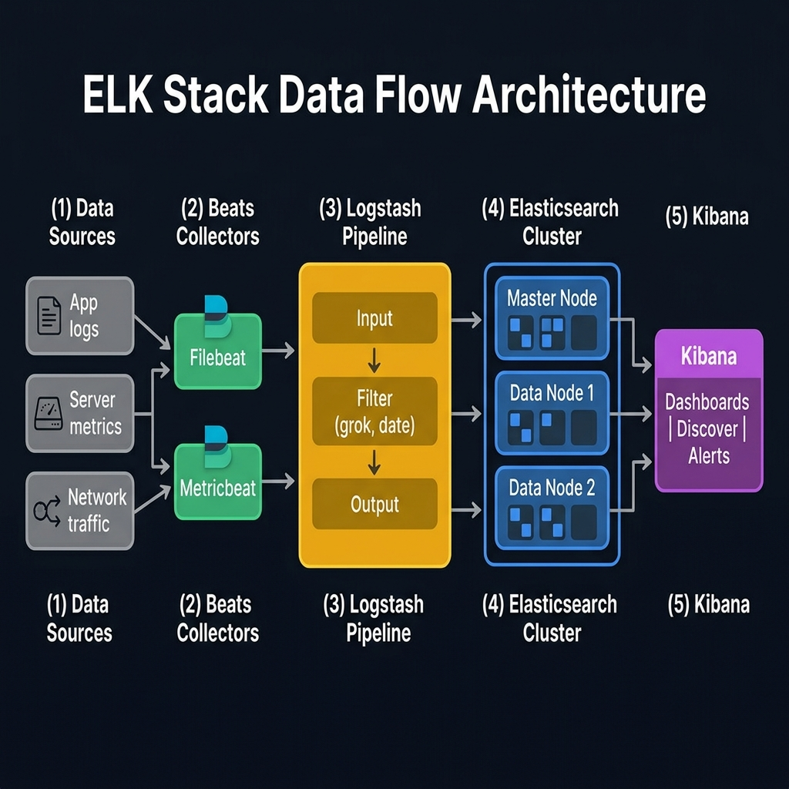
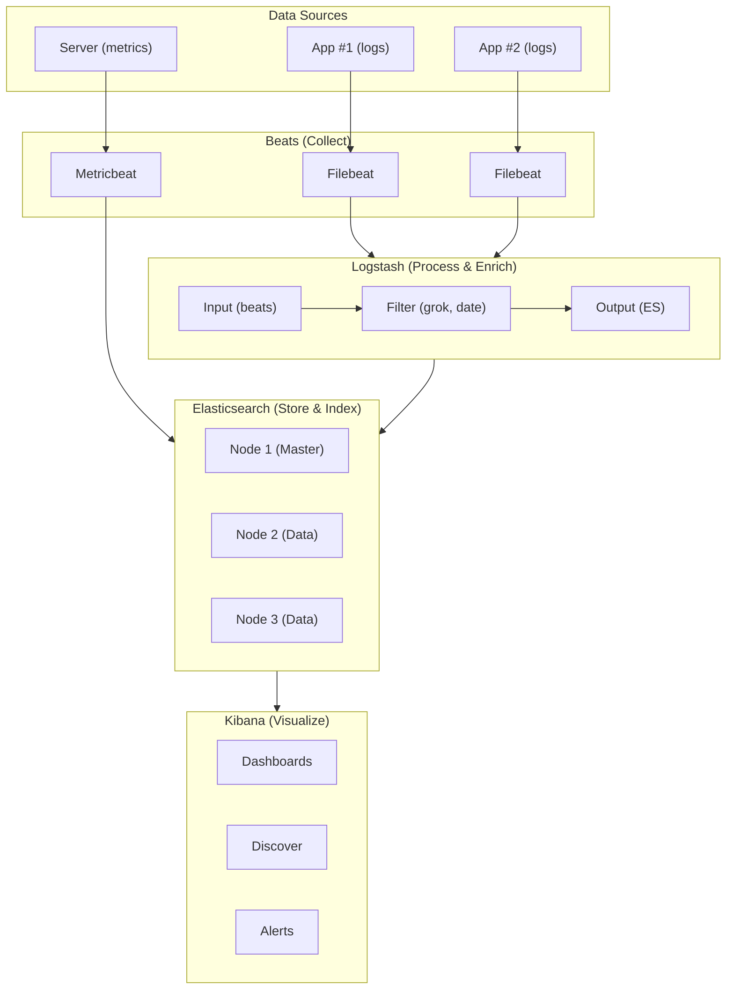

<!-- tags: elk-stack, observability -->
# 🔍 ELK Stack Overview

> Elastic Stack architecture overview: Elasticsearch + Logstash + Kibana + Beats.

📅 Created: 2026-03-23 · 🔄 Updated: 2026-04-20 · ⏱️ 12 min read

| Aspect            | Detail                                           |
| ----------------- | ------------------------------------------------ |
| **Components**    | Elasticsearch, Logstash, Kibana, Beats           |
| **Use cases**     | Centralized logging, APM, SIEM, Full-text search |
| **License**       | SSPL + Elastic License 2.0 (AGPLv3 for Kibana)   |
| **Default ports** | ES: 9200/9300, Kibana: 5601, Logstash: 5044/9600 |

---

## 0. TEMPLATE

> Quick reference commands — copy-paste when needed.

```bash
# ── Check Elasticsearch health ──────────────────────────────────
curl -s localhost:9200/_cluster/health?pretty

# ── Check all indices ───────────────────────────────────────────
curl -s localhost:9200/_cat/indices?v

# ── Check Logstash pipeline ─────────────────────────────────────
curl -s localhost:9600/_node/stats/pipelines?pretty

# ── Check Kibana status ─────────────────────────────────────────
curl -s localhost:5601/api/status | jq '.status.overall.state'

# ── Quick index a document ──────────────────────────────────────
curl -X POST localhost:9200/logs/_doc -H 'Content-Type: application/json' \
  -d '{"message":"hello","@timestamp":"2026-03-23T00:00:00Z"}'
```

---

## 1. DEFINE

Imagine logs scattered everywhere, but every time you need to trace an incident you must SSH into each machine and grep individual files. ELK only starts to matter when that pile of logs needs to become a searchable, story-telling system.


### What is the ELK Stack?

**ELK Stack** (now called **Elastic Stack**) is an open-source toolkit for:

1. **Collecting** data from multiple sources (Beats, Logstash)
2. **Processing & enriching** data (Logstash filters)
3. **Storing & searching** at millisecond speed (Elasticsearch)
4. **Visualizing** through interactive dashboards (Kibana)

### 4 Core Components

| Component         | Role             | Underlying tech | Default port                  |
| ----------------- | ---------------- | --------------- | ----------------------------- |
| **Elasticsearch** | Store + Search   | Apache Lucene   | 9200 (REST), 9300 (Transport) |
| **Logstash**      | Process + Enrich | JRuby pipeline  | 5044 (Beats), 9600 (API)      |
| **Kibana**        | Visualize + UI   | Node.js + React | 5601                          |
| **Beats**         | Collect + Ship   | Go lightweight  | Varies                        |

### Beats Family

| Beat           | Collects           | Deployed at       |
| -------------- | ------------------ | ----------------- |
| **Filebeat**   | Log files          | App/Web server    |
| **Metricbeat** | CPU, Memory, Disk  | OS / Container    |
| **Packetbeat** | Network traffic    | Network edge      |
| **Heartbeat**  | Uptime monitoring  | Monitoring server |
| **Auditbeat**  | Audit events       | Security-critical |
| **Winlogbeat** | Windows Event Logs | Windows servers   |

### ELK vs Alternatives

| Criteria             | ELK Stack             | Grafana Loki        | Datadog         | Splunk             |
| -------------------- | --------------------- | ------------------- | --------------- | ------------------ |
| **Type**             | Self-hosted / Cloud   | Self-hosted / Cloud | SaaS only       | Self-hosted / SaaS |
| **Full-text search** | ✅ Strongest          | ❌ Label-based      | ✅ Yes          | ✅ Strong          |
| **Cost**             | Free (self-host)      | Free (self-host)    | $$$             | $$$$               |
| **RAM required**     | High (JVM)            | Low                 | N/A             | High               |
| **Scaling**          | Horizontal sharding   | Horizontal          | Auto            | Horizontal         |
| **APM**              | ✅ Elastic APM        | ❌ Needs Tempo      | ✅ Built-in     | ✅ Yes             |
| **Best for**         | Full-text + Analytics | Log aggregation     | All-in-one SaaS | Enterprise         |

### Real-world Use Cases

| Use Case                      | Components used                     |
| ----------------------------- | ----------------------------------- |
| **Centralized Logging**       | Filebeat → Logstash → ES → Kibana   |
| **Application Performance**   | Elastic APM Agent → ES → Kibana APM |
| **Security (SIEM)**           | Beats + Logstash → ES → Kibana SIEM |
| **Full-text Search**          | App → ES REST API                   |
| **Infrastructure Monitoring** | Metricbeat → ES → Kibana Infra      |
| **Business Analytics**        | Custom data → ES → Kibana Dashboard |

---

Those concepts sound familiar. But there is a trap: Elasticsearch refusing to start because of insufficient heap kills the stack immediately, and a misconfigured Logstash pipeline silently drops logs. That trap appears in PITFALLS.

## 2. VISUAL

The definition locked the vocabulary. The visual below shows the actual operational flow where containers, pods, log pipelines, and shell commands hit production.



### Data Flow Architecture



*Figure: Full ELK data flow — sources emit logs/metrics through Beats into Logstash for enrichment, then into Elasticsearch for storage, and finally Kibana for visualization.*

### Elasticsearch Internal: Cluster → Index → Shard

```text
Cluster: "production"
├── Node 1 (Master + Data)
│   ├── Index: logs-2026.03 ─── Primary Shard 0 ─── Replica Shard 1
│   └── Index: metrics     ─── Primary Shard 0
├── Node 2 (Data)
│   ├── Index: logs-2026.03 ─── Primary Shard 1 ─── Replica Shard 0
│   └── Index: metrics     ─── Replica Shard 0
└── Node 3 (Data)
    ├── Index: logs-2026.03 ─── Primary Shard 2
    └── Index: metrics     ─── Primary Shard 1

Index "logs-2026.03"
├── 3 Primary Shards (P0, P1, P2)
├── 1 Replica per shard → 3 Replica Shards (R0, R1, R2)
└── Total: 6 shards distributed across 3 nodes
```

---

## 3. CODE

Code and config show how the decisions discussed above are enforced by real constraints, not just a nice diagram.


### Example 1: Basic — Health Check & Index Info

> **Goal**: Check cluster status and manage indices.
> **Requires**: Elasticsearch running on localhost:9200.
> **Result**: Master the most fundamental APIs.

```bash
#!/bin/bash
# ── elk_health_check.sh ────────────────────────────────────────
# Check entire ELK Stack status

# ✅ 1. Cluster health (green/yellow/red)
echo "=== Cluster Health ==="
curl -s localhost:9200/_cluster/health?pretty
# green  = all shards allocated
# yellow = primary OK, replicas insufficient (1 node)
# red    = primary shard missing

# ✅ 2. Node info
echo "=== Nodes ==="
curl -s 'localhost:9200/_cat/nodes?v&h=name,ip,role,heap.percent,disk.used_percent'
# name    ip         role  heap.percent  disk.used_percent
# node-1  172.18.0.2 dimr  45           23

# ✅ 3. List indices
echo "=== Indices ==="
curl -s 'localhost:9200/_cat/indices?v&h=index,docs.count,store.size,health'
# index           docs.count  store.size  health
# logs-2026.03    1523456     2.1gb       green

# ✅ 4. Kibana status
echo "=== Kibana ==="
curl -s localhost:5601/api/status 2>/dev/null | python3 -c "
import json,sys
data=json.load(sys.stdin)
print(f\"Status: {data['status']['overall']['state']}\")
print(f\"Version: {data['version']['number']}\")
" 2>/dev/null || echo "Kibana not reachable"

# ✅ 5. Logstash pipeline
echo "=== Logstash ==="
curl -s localhost:9600/_node/stats/pipelines?pretty 2>/dev/null \
  || echo "Logstash not reachable"
```

> **Result**: Quick-check the entire stack in one script.
> **Note**: Cluster status `yellow` is normal on single-node (not enough nodes for replicas).

---

ELK overview is covered. But Go integration needs a client — time to connect.

### Example 2: Intermediate — Go Application Logging → ELK

> **Goal**: Send structured logs from a Go app to Elasticsearch.
> **Requires**: Go app + Elasticsearch running.
> **Result**: Real-world centralized logging pattern.

```go
// elk/logger.go
package elk

import (
	"bytes"
	"encoding/json"
	"fmt"
	"net/http"
	"time"
)

// LogEntry represents a single log entry sent to Elasticsearch
type LogEntry struct {
	Timestamp string `json:"@timestamp"`         // ✅ ES standard format
	Level     string `json:"level"`               // info, warn, error
	Service   string `json:"service"`             // service name
	Message   string `json:"message"`             // log content
	TraceID   string `json:"trace_id,omitempty"`  // distributed tracing
	Duration  int64  `json:"duration_ms,omitempty"` // processing time
	Host      string `json:"host"`
}

// Client connects to Elasticsearch
type Client struct {
	baseURL   string
	indexName string
	client    *http.Client
}

// NewClient creates an Elasticsearch client
func NewClient(baseURL, indexName string) *Client {
	return &Client{
		baseURL:   baseURL,
		indexName: indexName,
		client:    &http.Client{Timeout: 5 * time.Second},
	}
}

// Index sends a log entry to Elasticsearch
func (c *Client) Index(entry LogEntry) error {
	// ✅ Auto-add timestamp if missing
	if entry.Timestamp == "" {
		entry.Timestamp = time.Now().UTC().Format(time.RFC3339Nano)
	}

	body, err := json.Marshal(entry)
	if err != nil {
		return fmt.Errorf("marshal error: %w", err)
	}

	// ✅ POST to index (ES auto-generates _id)
	url := fmt.Sprintf("%s/%s/_doc", c.baseURL, c.indexName)
	resp, err := c.client.Post(url, "application/json", bytes.NewReader(body))
	if err != nil {
		return fmt.Errorf("ES request failed: %w", err)
	}
	defer resp.Body.Close()

	if resp.StatusCode > 299 {
		return fmt.Errorf("ES returned status %d", resp.StatusCode)
	}
	return nil
}

// BulkIndex sends multiple log entries at once (more efficient)
// ⚠️ Bulk API uses NDJSON format: action\ndata\naction\ndata\n
func (c *Client) BulkIndex(entries []LogEntry) error {
	var buf bytes.Buffer
	for _, entry := range entries {
		if entry.Timestamp == "" {
			entry.Timestamp = time.Now().UTC().Format(time.RFC3339Nano)
		}
		// ✅ Action line: index into target index
		buf.WriteString(fmt.Sprintf(`{"index":{"_index":"%s"}}`, c.indexName))
		buf.WriteByte('\n')

		data, _ := json.Marshal(entry)
		buf.Write(data)
		buf.WriteByte('\n')
	}

	url := fmt.Sprintf("%s/_bulk", c.baseURL)
	resp, err := c.client.Post(url, "application/x-ndjson", &buf)
	if err != nil {
		return fmt.Errorf("bulk request failed: %w", err)
	}
	defer resp.Body.Close()

	if resp.StatusCode > 299 {
		return fmt.Errorf("bulk returned status %d", resp.StatusCode)
	}
	return nil
}
```

```go
// main.go — Using the ELK client
package main

import (
	"fmt"
	"log"
	"os"
	"time"

	"myapp/elk"
)

func main() {
	// ✅ Initialize client — index named by date (log rotation)
	today := time.Now().Format("2006.01.02")
	indexName := fmt.Sprintf("app-logs-%s", today)
	client := elk.NewClient("http://localhost:9200", indexName)

	hostname, _ := os.Hostname()

	// ✅ Single log
	err := client.Index(elk.LogEntry{
		Level:   "info",
		Service: "api-gateway",
		Message: "Server started on port 8080",
		Host:    hostname,
	})
	if err != nil {
		log.Printf("Failed to index: %v", err)
	}

	// ✅ Bulk log — more efficient for high-throughput
	entries := []elk.LogEntry{
		{Level: "info", Service: "user-service", Message: "User created", Duration: 45},
		{Level: "warn", Service: "user-service", Message: "Slow query detected", Duration: 2300},
		{Level: "error", Service: "payment", Message: "Payment gateway timeout", TraceID: "abc-123"},
	}

	if err := client.BulkIndex(entries); err != nil {
		log.Printf("Bulk index failed: %v", err)
	}

	fmt.Println("✅ Logs sent to Elasticsearch")
}
```

> **Result**: Go app sends structured logs to ES — both single and bulk mode.
> **Note**: Production should use Filebeat instead of sending directly from the app → separates concerns.

---

Client is covered. But a full pipeline needs Filebeat → Logstash → ES — time to build.

### Example 3: Advanced — Full Pipeline: Filebeat → Logstash → ES

> **Goal**: Configure a complete pipeline from log file → Kibana dashboard.
> **Requires**: Docker Compose + config files.
> **Result**: Production-grade logging pipeline.

```yaml
# docker-compose.yml — Full ELK Stack
version: '3.8'

services:
    elasticsearch:
        image: docker.elastic.co/elasticsearch/elasticsearch:8.13.0
        container_name: elasticsearch
        environment:
            - discovery.type=single-node # ⚠️ Dev mode — production uses cluster
            - xpack.security.enabled=false # ⚠️ Dev only — production MUST enable
            - 'ES_JAVA_OPTS=-Xms512m -Xmx512m' # ✅ Limit RAM
        ports:
            - '9200:9200'
        volumes:
            - es-data:/usr/share/elasticsearch/data
        healthcheck:
            test: curl -s localhost:9200/_cluster/health | grep -q '"status":"green\|yellow"'
            interval: 10s
            retries: 10

    logstash:
        image: docker.elastic.co/logstash/logstash:8.13.0
        container_name: logstash
        volumes:
            - ./logstash/pipeline:/usr/share/logstash/pipeline:ro
        ports:
            - '5044:5044' # Beats input
            - '9600:9600' # Monitoring API
        depends_on:
            elasticsearch:
                condition: service_healthy

    kibana:
        image: docker.elastic.co/kibana/kibana:8.13.0
        container_name: kibana
        environment:
            - ELASTICSEARCH_HOSTS=http://elasticsearch:9200
        ports:
            - '5601:5601'
        depends_on:
            elasticsearch:
                condition: service_healthy

    filebeat:
        image: docker.elastic.co/beats/filebeat:8.13.0
        container_name: filebeat
        user: root # ⚠️ Needs permission to read Docker logs
        volumes:
            - ./filebeat/filebeat.yml:/usr/share/filebeat/filebeat.yml:ro
            - /var/lib/docker/containers:/var/lib/docker/containers:ro
            - /var/run/docker.sock:/var/run/docker.sock:ro
        depends_on:
            - logstash

volumes:
    es-data:
```

```ruby
# logstash/pipeline/logstash.conf
# ── Logstash Pipeline: Input → Filter → Output ─────────────────

input {
  beats {
    port => 5044                         # ✅ Receive from Filebeat
  }
}

filter {
  # ✅ Parse JSON logs
  if [message] =~ /^\{/ {
    json {
      source => "message"
      target => "app"
    }
  }

  # ✅ Parse Nginx access logs
  if [fields][type] == "nginx" {
    grok {
      match => {
        "message" => '%{IPORHOST:client_ip} - - \[%{HTTPDATE:timestamp}\] "%{WORD:method} %{URIPATHPARAM:request} HTTP/%{NUMBER}" %{NUMBER:status:int} %{NUMBER:bytes:int} "%{DATA:referrer}" "%{DATA:user_agent}"'
      }
    }
    date {
      match => ["timestamp", "dd/MMM/yyyy:HH:mm:ss Z"]
      target => "@timestamp"
    }
    mutate {
      remove_field => ["timestamp"]      # ⚠️ Remove temp field
    }
  }

  # ✅ Add metadata
  mutate {
    add_field => {
      "environment" => "production"
      "pipeline" => "main"
    }
  }
}

output {
  elasticsearch {
    hosts => ["http://elasticsearch:9200"]
    index => "logs-%{+YYYY.MM.dd}"        # ✅ Index by date — easy cleanup
  }
  # stdout { codec => rubydebug }         # ⚠️ Uncomment for debug
}
```

```yaml
# filebeat/filebeat.yml
# ── Filebeat: Collect logs from containers ─────────────────────

filebeat.inputs:
    - type: container # ✅ Docker container logs
      paths:
          - '/var/lib/docker/containers/*/*.log'
      processors:
          - add_docker_metadata: # ✅ Auto-add container name, image
                host: 'unix:///var/run/docker.sock'

output.logstash:
    hosts: ['logstash:5044'] # ✅ Send to Logstash (not directly to ES)

logging.level: warning # ⚠️ Reduce noise — only log warning+
```

> **Result**: Full production pipeline: Container logs → Filebeat → Logstash (parse + enrich) → Elasticsearch → Kibana.
> **Note**: Production must enable `xpack.security.enabled=true`, use TLS, and set up ILM (Index Lifecycle Management).

---

You have covered overview, Go client, and full pipeline. Now comes the dangerous part: heap config and pipeline misconfiguration — the trap set up from the beginning.

## 4. PITFALLS

Errors usually do not sit in syntax. They sit in operational boundaries and forgotten failure modes. The table below collects exactly those mistakes.

| #   | Mistake                                | Consequence              | Fix                                                     |
| --- | -------------------------------------- | ------------------------ | ------------------------------------------------------- |
| 1   | `xpack.security.enabled=false` in prod | Anyone can access ES     | Enable security + TLS for production                    |
| 2   | Not setting `ES_JAVA_OPTS`             | ES consumes all RAM      | Set `-Xms` and `-Xmx` = 50% RAM (max 32GB)              |
| 3   | Single index for all logs              | Slow queries, hard cleanup | Use time-based index: `logs-YYYY.MM.dd`                |
| 4   | Not setting ILM (Index Lifecycle)      | Disk full in weeks       | Config ILM: hot → warm → cold → delete                  |
| 5   | Sending logs directly from app → ES    | App slows if ES is down  | Use Filebeat/Logstash buffer                            |
| 6   | Logstash uses 1 pipeline for everything | Hard to maintain, debug | Split multiple pipelines by source                      |
| 7   | Kibana missing `server.basePath`       | Reverse proxy breaks     | Set `server.basePath` and `server.rewriteBasePath`      |
| 8   | Not monitoring Logstash queue          | Logs lost under overload | Monitor `/_node/stats/pipelines` + set persistent queue |

---

You have covered ELK Overview and the traps. The resources below help go deeper.

## 5. REF

| Resource                          | Link                                                                                                            |
| --------------------------------- | --------------------------------------------------------------------------------------------------------------- |
| Elasticsearch Official Guide      | [elastic.co/guide/en/elasticsearch](https://www.elastic.co/guide/en/elasticsearch/reference/current/index.html) |
| Logstash Reference                | [elastic.co/guide/en/logstash](https://www.elastic.co/guide/en/logstash/current/index.html)                     |
| Kibana Guide                      | [elastic.co/guide/en/kibana](https://www.elastic.co/guide/en/kibana/current/index.html)                         |
| Beats Platform Reference          | [elastic.co/guide/en/beats](https://www.elastic.co/guide/en/beats/libbeat/current/index.html)                   |
| Elastic Docker Images             | [docker.elastic.co](https://www.docker.elastic.co/)                                                             |
| Go Elasticsearch Client           | [github.com/elastic/go-elasticsearch](https://github.com/elastic/go-elasticsearch)                              |
| ELK Stack Tutorial (DigitalOcean) | [digitalocean.com/community/tutorials](https://www.digitalocean.com/community/tutorial-series/elk-stack)        |
| Awesome Elasticsearch             | [github.com/dzharii/awesome-elasticsearch](https://github.com/dzharii/awesome-elasticsearch)                    |

---

## 6. RECOMMEND

After this article, read the topic closest to your current decision so the production mental model does not fragment.

| Next step                 | When                           | Reason                             |
| ------------------------- | ------------------------------ | ---------------------------------- |
| **Elastic APM**           | Need distributed tracing       | End-to-end request tracing         |
| **Index Lifecycle Mgmt**  | Logs stored > 7 days           | Auto delete/archive old indices    |
| **Elastic Agent / Fleet** | Many servers to monitor        | Centralized Beats config management|
| **Cross-Cluster Search**  | Multi-region / multi-env       | Query across clusters              |
| **Grafana + ES**          | Already using Grafana for metrics | ES as datasource for Grafana     |
| **Vector (Datadog)**      | Logstash too heavy (JVM)       | Rust-based, 10x lighter            |
| **OpenTelemetry**         | Vendor-neutral observability   | Send traces/metrics/logs to ES     |

---

## 🃏 Quick Reference

| #   | Concept   | Description                                      |
| --- | --------- | ------------------------------------------------ |
| 1   | Cluster   | Group of nodes sharing `cluster.name`            |
| 2   | Node      | One Elasticsearch instance (JVM process)         |
| 3   | Index     | "Database" — contains documents                 |
| 4   | Shard     | Subset of an index — unit of scaling             |
| 5   | Replica   | Copy of a primary shard — fault tolerance        |
| 6   | Document  | One JSON record in an index                      |
| 7   | Mapping   | Schema definition for an index (field types)     |
| 8   | Pipeline  | Logstash: Input → Filter → Output                |
| 9   | KQL       | Kibana Query Language — search in Kibana         |
| 10  | ILM       | Index Lifecycle Management — auto-manage indices |

---

## 🔍 Debug Checklist

| # | Symptom | Root cause | Diagnostic command |
|---|---------|------------|--------------------|
| 1 | Elasticsearch fails to start | Heap size too small or insufficient RAM | `docker logs elasticsearch` + check `ES_JAVA_OPTS` |
| 2 | Logstash not sending data to ES | Connection refused — ES not ready | `curl -u elastic:pass http://localhost:9200/_cluster/health` |
| 3 | Kibana "Kibana server is not ready" | ES has not reached green/yellow status | `curl localhost:5601/api/status` |
| 4 | Beats not receiving data from Logstash | Logstash pipeline error or wrong port | `filebeat test output` + `logstash --config.test_and_exit` |
| 5 | Index creation fails — name error | Index name contains uppercase characters | ES index names must be entirely lowercase |
| 6 | Container OOM killed — ES killed | ES heap too large, exceeds Docker limit | Set `ES_JAVA_OPTS="-Xms512m -Xmx512m"` |
| 7 | Cluster status RED — queries fail | Unassigned primary shards | `GET /_cluster/allocation/explain` |

---

## 🎯 Interview Angle

**Related system design / technical questions:**
- *"Explain the ELK Stack architecture and the role of each component?"*
- *"When should you use ELK instead of Grafana Loki or Splunk?"*
- *"Why use Logstash instead of letting Beats send directly to Elasticsearch?"*

**Key talking points interviewers expect:**

| Topic | Talking point |
|-------|---------------|
| ELK vs Loki | ELK excels at full-text search + analytics; Loki only indexes labels, lighter but cannot search log content |
| ELK vs Splunk | Splunk is expensive but enterprise-ready; ELK is free self-host but requires an ops team to maintain |
| Logstash vs direct Beats | Logstash is needed for complex parse/transform (grok, enrich); direct Beats when logs are already clean |
| Shard & Replica | Primary shard = unit of scaling; Replica = fault tolerance + read throughput |
| Cluster status | GREEN = all shards OK; YELLOW = replicas unassigned (normal single-node); RED = primary missing |
| Index naming | Time-based index `logs-YYYY.MM.dd` enables easy cleanup + ILM automation |

**Common follow-up questions:**
- *"What is ILM and why is it needed?"* → Index Lifecycle Management auto-moves indices through hot → warm → cold → delete, preventing disk full
- *"What does cluster yellow mean?"* → Primary shards OK but replicas not assigned — normal on single-node since there is no second node for replicas
- *"Filebeat vs Logstash: which to choose?"* → Filebeat is lightweight (Go), deployed at edge/agent; Logstash is heavier (JVM) but handles complex processing — typically both are used together

---

**Links**: [→ Docker Compose Setup](./02-setup-docker-compose.md)
