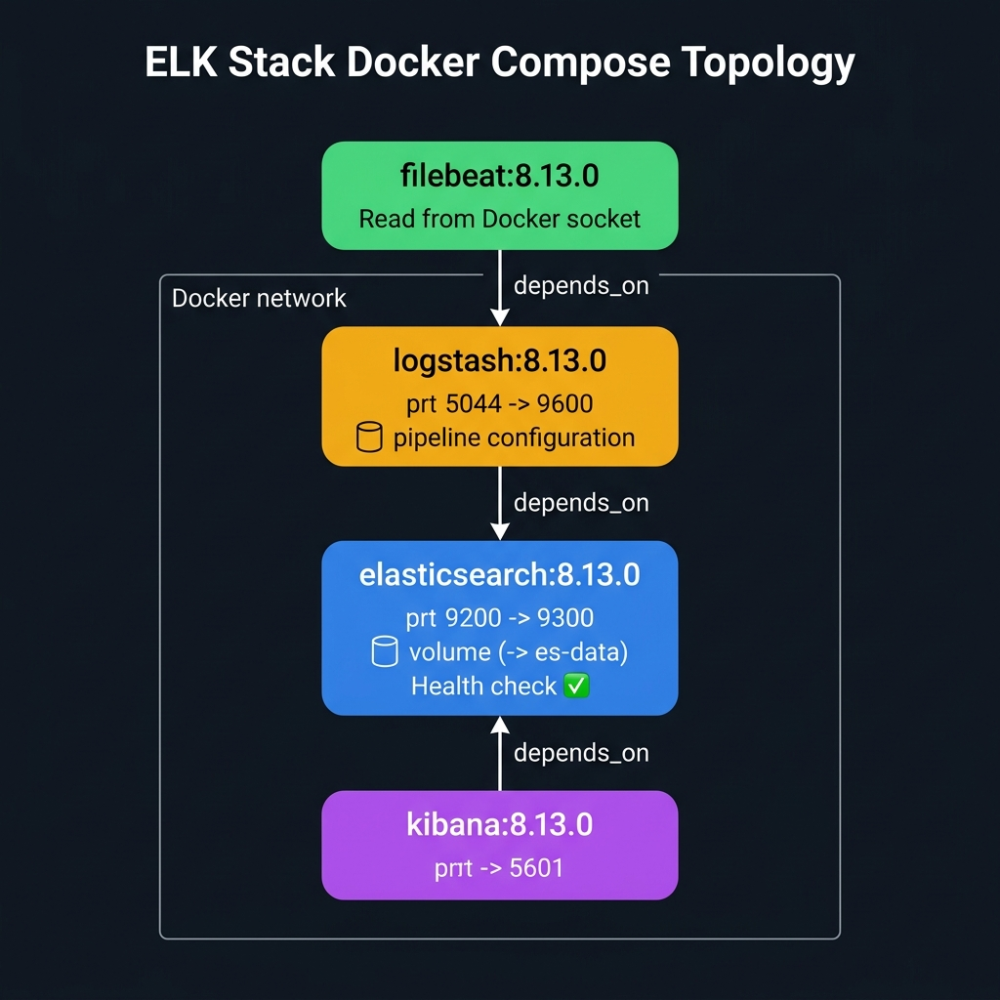
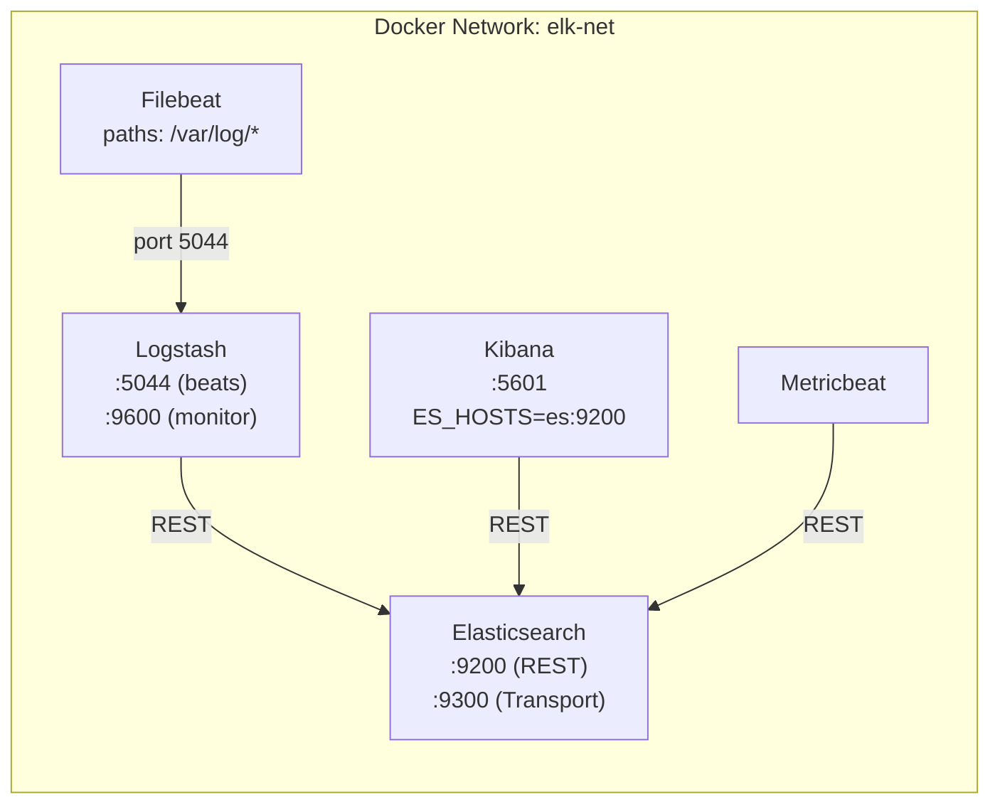

<!-- tags: elk-stack, observability -->
# 🐳 Docker Compose Setup — ELK Stack

> Install and configure the full ELK Stack with Docker Compose.

📅 Created: 2026-03-23 · 🔄 Updated: 2026-04-20 · ⏱️ 10 min read

| Aspect            | Detail                                  |
| ----------------- | --------------------------------------- |
| **Stack version** | Elastic 8.13.x                          |
| **Requirements**  | Docker 24+, Docker Compose v2, 4GB+ RAM |
| **Components**    | ES + Logstash + Kibana + Filebeat       |
| **Mode**          | Single-node development                 |

---

## 0. TEMPLATE

> Fastest copy-paste docker-compose.yml.

```yaml
# ── Minimal ELK — running in 30 seconds ─────────────────────────
version: '3.8'
services:
    elasticsearch:
        image: docker.elastic.co/elasticsearch/elasticsearch:8.13.0
        environment:
            - discovery.type=single-node
            - xpack.security.enabled=false
            - 'ES_JAVA_OPTS=-Xms512m -Xmx512m'
        ports: ['9200:9200']
        volumes: [es-data:/usr/share/elasticsearch/data]

    kibana:
        image: docker.elastic.co/kibana/kibana:8.13.0
        environment:
            - ELASTICSEARCH_HOSTS=http://elasticsearch:9200
        ports: ['5601:5601']
        depends_on: [elasticsearch]

volumes:
    es-data:
```

```bash
# Run
docker compose up -d
# Verify
curl localhost:9200        # ES
open http://localhost:5601 # Kibana
```

---

## 1. DEFINE

An observability stack only holds value when it can be rebuilt repeatably, fast enough for local/staging, and close enough to production to avoid illusions. Setup is the foundational problem for that.


### Docker Compose for ELK — Why?

| Method              | Pros                         | Cons                         |
| ------------------- | ---------------------------- | ---------------------------- |
| **Docker Compose**  | Fast, reproducible, isolated | Requires Docker knowledge    |
| **Package manager** | Native performance           | Complex config, OS-specific  |
| **Elastic Cloud**   | Zero ops, managed            | Costs money                  |
| **Kubernetes**      | Production-scale             | Complex, overkill for dev    |

### Required Resources

| Component     | RAM minimum   | RAM recommended | Disk     |
| ------------- | ------------- | --------------- | -------- |
| Elasticsearch | 512MB         | 2GB             | 10GB+    |
| Logstash      | 256MB         | 1GB             | 1GB      |
| Kibana        | 256MB         | 512MB           | 500MB    |
| Filebeat      | 64MB          | 128MB           | 100MB    |
| **Total**     | **1GB**       | **4GB**         | **12GB** |

---

Those failure modes sound clear. But there is a trap: vm.max_map_count too low crashes ES instantly, and wrong discovery config for single-node creates a cluster formation loop. That trap appears in PITFALLS.

## 2. VISUAL

The definition locked the vocabulary. The visual below shows the actual operational flow where containers, pods, log pipelines, and shell commands hit production.



### Docker Network Topology



*Figure: Docker network topology — Filebeat ships to Logstash, which enriches and forwards to Elasticsearch. Kibana reads directly from ES. Exposed ports: 9200, 5601, 5044, 9600.*

---

## 3. CODE

The flow above gives intuition; the section below is what the team will copy, review, and own when going to a real environment.


### Example 1: Basic — Minimal ES + Kibana

> **Goal**: Run Elasticsearch + Kibana as fast as possible.
> **Requires**: Docker Compose v2.
> **Result**: ES + Kibana ready in 30 seconds.

```yaml
# docker-compose.minimal.yml
version: '3.8'

services:
    elasticsearch:
        image: docker.elastic.co/elasticsearch/elasticsearch:8.13.0
        container_name: es
        environment:
            - discovery.type=single-node # ✅ Single node — no cluster needed
            - xpack.security.enabled=false # ⚠️ Dev only
            - xpack.security.enrollment.enabled=false
            - 'ES_JAVA_OPTS=-Xms512m -Xmx512m' # ✅ Limit heap
        ports:
            - '9200:9200'
        volumes:
            - es-data:/usr/share/elasticsearch/data
        healthcheck:
            test: ['CMD-SHELL', "curl -s localhost:9200 | grep -q 'tagline'"]
            interval: 10s
            timeout: 5s
            retries: 10
        ulimits:
            memlock:
                soft: -1 # ✅ Disable memory swapping
                hard: -1

    kibana:
        image: docker.elastic.co/kibana/kibana:8.13.0
        container_name: kibana
        environment:
            - ELASTICSEARCH_HOSTS=http://elasticsearch:9200
            - SERVER_NAME=kibana
        ports:
            - '5601:5601'
        depends_on:
            elasticsearch:
                condition: service_healthy # ✅ Wait for ES healthy before start

volumes:
    es-data:
        driver: local
```

```bash
# ✅ Start stack
docker compose -f docker-compose.minimal.yml up -d

# ✅ Verify Elasticsearch
curl -s localhost:9200 | jq '.tagline'
# "You Know, for Search"

# ✅ Verify Kibana (wait ~30s)
curl -s localhost:5601/api/status | jq '.status.overall.state'
# "available"

# ✅ Create index + insert document
curl -X PUT localhost:9200/my-first-index -H 'Content-Type: application/json' -d '{
  "mappings": {
    "properties": {
      "title": { "type": "text" },
      "tags": { "type": "keyword" },
      "created_at": { "type": "date" }
    }
  }
}'
```

> **Result**: ES + Kibana running, able to create indices and query.
> **Note**: `xpack.security.enabled=false` is dev-only. Production MUST enable security.

---

Single-node setup is covered. But multi-node needs discovery — time to cluster.

### Example 2: Intermediate — Full Stack + Logstash + Filebeat

> **Goal**: Full pipeline with Logstash parsing and Filebeat collection.
> **Requires**: Additional config files for Logstash and Filebeat.
> **Result**: Production-like logging pipeline.

```yaml
# docker-compose.full.yml
version: '3.8'

services:
    elasticsearch:
        image: docker.elastic.co/elasticsearch/elasticsearch:8.13.0
        container_name: elasticsearch
        environment:
            - discovery.type=single-node
            - xpack.security.enabled=false
            - 'ES_JAVA_OPTS=-Xms1g -Xmx1g'
            - cluster.name=elk-dev
            - bootstrap.memory_lock=true # ✅ Prevent swapping
        ports:
            - '9200:9200'
        volumes:
            - es-data:/usr/share/elasticsearch/data
        healthcheck:
            test: curl -s localhost:9200/_cluster/health | grep -q '"status"'
            interval: 10s
            retries: 10
        ulimits:
            memlock: { soft: -1, hard: -1 }
        deploy:
            resources:
                limits:
                    memory: 2G # ✅ Hard limit

    logstash:
        image: docker.elastic.co/logstash/logstash:8.13.0
        container_name: logstash
        volumes:
            - ./logstash/pipeline:/usr/share/logstash/pipeline:ro
            - ./logstash/config/logstash.yml:/usr/share/logstash/config/logstash.yml:ro
        ports:
            - '5044:5044' # ✅ Beats input
            - '5000:5000/tcp' # ✅ TCP input (optional)
            - '9600:9600' # ✅ Monitoring API
        environment:
            - 'LS_JAVA_OPTS=-Xms256m -Xmx256m'
        depends_on:
            elasticsearch:
                condition: service_healthy

    kibana:
        image: docker.elastic.co/kibana/kibana:8.13.0
        container_name: kibana
        environment:
            - ELASTICSEARCH_HOSTS=http://elasticsearch:9200
            - SERVER_NAME=kibana
            - LOGGING_QUIET=true # ✅ Less noise
        ports:
            - '5601:5601'
        depends_on:
            elasticsearch:
                condition: service_healthy

    filebeat:
        image: docker.elastic.co/beats/filebeat:8.13.0
        container_name: filebeat
        user: root
        command: filebeat -e -strict.perms=false # ⚠️ Dev: skip permission check
        volumes:
            - ./filebeat/filebeat.yml:/usr/share/filebeat/filebeat.yml:ro
            - ./app-logs:/var/log/app:ro # ✅ Mount app log directory
            - filebeat-data:/usr/share/filebeat/data
        depends_on:
            - logstash

volumes:
    es-data:
    filebeat-data:
```

```yaml
# logstash/config/logstash.yml
http.host: '0.0.0.0'
xpack.monitoring.elasticsearch.hosts: ['http://elasticsearch:9200']
pipeline.workers: 2 # ✅ Parallel processing
pipeline.batch.size: 125 # ✅ Batch size per worker
pipeline.batch.delay: 50 # ✅ Max wait ms
```

```yaml
# filebeat/filebeat.yml
filebeat.inputs:
    # ✅ Collect app logs (JSON format)
    - type: log
      enabled: true
      paths:
          - /var/log/app/*.log
      json.keys_under_root: true # ✅ Parse JSON fields to root
      json.add_error_key: true # ✅ Add parse error field
      fields:
          type: app-log
      fields_under_root: true

output.logstash:
    hosts: ['logstash:5044']

logging.level: warning
```

```bash
# ✅ Create required directories
mkdir -p logstash/pipeline logstash/config filebeat app-logs

# ✅ Start full stack
docker compose -f docker-compose.full.yml up -d

# ✅ Create test log
echo '{"level":"info","message":"Hello ELK","service":"test","timestamp":"2026-03-23T12:00:00Z"}' >> app-logs/test.log

# ✅ Verify log reached ES (wait ~10s)
curl -s 'localhost:9200/logs-*/_search?pretty&size=1'

# ✅ Open Kibana → Discover → create Data View "logs-*"
open http://localhost:5601
```

> **Result**: Full pipeline: App log file → Filebeat → Logstash → Elasticsearch → Kibana.
> **Note**: Logstash pipeline config must exist in `logstash/pipeline/` directory.

---

Clustering is covered. But TLS + security needs xpack — time to secure.

### Example 3: Advanced — Production-Ready with TLS + Auth

> **Goal**: Configure security for production deployment.
> **Requires**: Elasticsearch 8.x (security defaults enabled).
> **Result**: Secure cluster with TLS + credentials.

```bash
#!/bin/bash
# ── setup-security.sh — Generate certs + passwords ─────────────

# ✅ 1. Generate CA and certificates
docker run --rm -it \
  -v $(pwd)/certs:/certs \
  docker.elastic.co/elasticsearch/elasticsearch:8.13.0 \
  bash -c '
    # Generate CA
    elasticsearch-certutil ca --out /certs/ca.p12 --pass ""

    # Generate cert for nodes
    elasticsearch-certutil cert --ca /certs/ca.p12 --ca-pass "" \
      --out /certs/elastic-certificates.p12 --pass ""

    # Generate PEM for HTTP
    elasticsearch-certutil http --ca /certs/ca.p12 --ca-pass "" \
      --out /certs/http.zip
  '

# ✅ 2. Set permissions
chmod 644 certs/*

echo "✅ Certificates generated in ./certs/"
echo "⚠️ Add to docker-compose.yml:"
echo "   - xpack.security.enabled=true"
echo "   - xpack.security.transport.ssl.enabled=true"
```

```yaml
# docker-compose.prod.yml (excerpt)
services:
    elasticsearch:
        image: docker.elastic.co/elasticsearch/elasticsearch:8.13.0
        environment:
            - discovery.type=single-node
            - xpack.security.enabled=true # ✅ ENABLE security
            - xpack.security.http.ssl.enabled=false # ⚠️ Enable if using HTTPS
            - xpack.security.transport.ssl.enabled=true # ✅ Inter-node TLS
            - xpack.security.transport.ssl.verification_mode=certificate
            - xpack.security.transport.ssl.keystore.path=certs/elastic-certificates.p12
            - xpack.security.transport.ssl.truststore.path=certs/elastic-certificates.p12
            - ELASTIC_PASSWORD=changeme # ⚠️ Change password!
        volumes:
            - ./certs:/usr/share/elasticsearch/config/certs:ro
            - es-data:/usr/share/elasticsearch/data

    kibana:
        environment:
            - ELASTICSEARCH_HOSTS=http://elasticsearch:9200
            - ELASTICSEARCH_USERNAME=kibana_system
            - ELASTICSEARCH_PASSWORD=changeme # ⚠️ Change password!
```

```bash
# ✅ Set password for built-in users
docker exec -it elasticsearch \
  elasticsearch-reset-password -u elastic --batch

docker exec -it elasticsearch \
  elasticsearch-reset-password -u kibana_system --batch
```

> **Result**: Secure deployment with TLS transport and authentication.
> **Note**: Always change default passwords. Production should enable HTTP TLS (`xpack.security.http.ssl.enabled=true`).

---

You have covered setup, clustering, and security. Now comes the dangerous part: vm.max_map_count and discovery misconfiguration — the trap set up from the beginning.

## 4. PITFALLS

Errors usually do not sit in syntax. They sit in operational boundaries and forgotten failure modes. The table below collects exactly those mistakes.

| #   | Mistake                                      | Fix                                                     |
| --- | -------------------------------------------- | ------------------------------------------------------- |
| 1   | ES crash: `max virtual memory areas` error   | `sysctl -w vm.max_map_count=262144` on the host         |
| 2   | ES OOM: heap too large or too small          | Set `-Xms` = `-Xmx` = 50% RAM (max 31GB)                |
| 3   | Filebeat: permission denied reading Docker logs | Run Filebeat with `user: root`                        |
| 4   | Kibana: "Unable to retrieve version"         | Wait for ES healthy, check `ELASTICSEARCH_HOSTS`        |
| 5   | Logstash: pipeline not loading               | Check file permissions, verify path mount               |
| 6   | ES Yellow status                             | Normal for single-node (not enough nodes for replicas)  |
| 7   | Volume data lost on `docker compose down`    | Use named volumes, DO NOT use `down -v`                 |
| 8   | Port conflict: 9200 already in use           | `lsof -i :9200` → kill process or change port mapping   |

---

You have covered Docker Compose Setup and the traps. The resources below help go deeper.

## 5. REF

| Resource                        | Link                                                                                                                                                               |
| ------------------------------- | ------------------------------------------------------------------------------------------------------------------------------------------------------------------ |
| Elastic Docker Install          | [elastic.co/guide/en/elasticsearch/reference/current/docker.html](https://www.elastic.co/guide/en/elasticsearch/reference/current/docker.html)                     |
| Docker Compose Official Example | [github.com/elastic/elasticsearch/tree/main/docs](https://github.com/elastic/elasticsearch)                                                                        |
| Filebeat Docker Config          | [elastic.co/guide/en/beats/filebeat/current/running-on-docker.html](https://www.elastic.co/guide/en/beats/filebeat/current/running-on-docker.html)                 |
| vm.max_map_count Setting        | [elastic.co/guide/en/elasticsearch/reference/current/vm-max-map-count.html](https://www.elastic.co/guide/en/elasticsearch/reference/current/vm-max-map-count.html) |
| Logstash Docker Config          | [elastic.co/guide/en/logstash/current/docker-config.html](https://www.elastic.co/guide/en/logstash/current/docker-config.html)                                     |

---

## 6. RECOMMEND

After this article, read the topic closest to your current decision so the production mental model does not fragment.

| Next step                   | When                          | Reason                              |
| --------------------------- | ----------------------------- | ----------------------------------- |
| **Docker Compose profiles** | Need different dev/prod config | `--profile dev` vs `--profile prod` |
| **Persistent Queue (LS)**   | Log volume > 10K/s            | Buffer when ES is down              |
| **Elastic Agent**           | Replacing multiple Beats      | Centralized management via Fleet    |
| **Kubernetes Helm**         | Production multi-node         | elastic/helm-charts                 |
| **Terraform**               | Infrastructure as Code        | Auto-provision cluster              |

---

## 🃏 Quick Reference

| #   | Command                                      | Description         |
| --- | -------------------------------------------- | ------------------- |
| 1   | `docker compose up -d`                       | Start stack         |
| 2   | `docker compose logs -f elasticsearch`       | View ES logs        |
| 3   | `docker compose down`                        | Stop (keep data)    |
| 4   | `docker compose down -v`                     | Stop + delete data ⚠️ |
| 5   | `curl localhost:9200/_cluster/health?pretty` | Check health        |
| 6   | `curl localhost:9200/_cat/indices?v`         | List indices        |
| 7   | `docker exec -it elasticsearch bash`         | Shell into ES       |
| 8   | `sysctl -w vm.max_map_count=262144`          | Fix vm error        |

---

## 🔍 Debug Checklist

| # | Symptom | Root cause | Diagnostic command |
|---|---------|------------|--------------------|
| 1 | ES reports `max virtual memory areas vm.max_map_count` | Linux kernel setting too low | `sudo sysctl -w vm.max_map_count=262144` |
| 2 | Elasticsearch container exits with code 137 | OOM killed by Docker memory limit | Increase Docker memory limit to 4GB+ in Docker Desktop settings |
| 3 | ES reports "bootstrap check failed" and refuses to start | `discovery.type` not set | Add `discovery.type=single-node` to environment |
| 4 | Kibana continuously restart-loops | ES not healthy when Kibana starts | Add `depends_on: elasticsearch: condition: service_healthy` |
| 5 | Volume bind mount "Permission denied" error | Host directory ownership incorrect | `chown -R 1000:1000 ./data/elasticsearch` |
| 6 | Logstash JVM crashes immediately on start | Heap size too small | Set `LS_JAVA_OPTS="-Xms256m -Xmx256m"` (minimum) |
| 7 | Docker Compose reports port 9200 or 5601 already in use | Another process occupying port | `lsof -i :9200` to find conflicting process, then kill or remap port |

---

## 🎯 Interview Angle

**Related system design / technical questions:**
- *"What is the difference between single-node and multi-node ELK setup in Docker?"*
- *"How do you ensure Kibana only starts after Elasticsearch is ready?"*
- *"Which configs need to change when moving from development to production ELK?"*

**Key talking points interviewers expect:**

| Topic | Talking point |
|-------|---------------|
| Single-node vs multi-node | Single-node is simple for dev but has no HA; multi-node needs discovery config, transport TLS, and minimum_master_nodes |
| Health check pattern | `depends_on: condition: service_healthy` ensures startup order; missing health check causes race conditions |
| vm.max_map_count | ES uses memory-mapped files for Lucene indices; Linux default 65530 is too low, needs 262144 |
| Dev vs prod config | Dev: security off, single-node, low heap; Prod: TLS on, auth enabled, ILM config, heap = 50% RAM |
| Memory management | `-Xms` equals `-Xmx` to avoid heap resize overhead; do not set above 50% RAM or 32GB |
| Persistent volumes | Named volumes keep data across restarts; `down -v` deletes everything — requires clear warnings |

**Common follow-up questions:**
- *"Why set `ulimits: memlock: soft: -1, hard: -1`?"* → Prevents OS from swapping ES heap to disk — swapping makes ES extremely slow and can cause crashes
- *"How to monitor ELK stack in Docker?"* → `docker stats` for resource usage; `curl localhost:9600/_node/stats` for Logstash; `curl localhost:9200/_cluster/health` for ES
- *"When to migrate from Docker Compose to Kubernetes?"* → When you need automatic horizontal scaling, zero-downtime rolling updates, or a true multi-node ES cluster

---

**Links**: [← ELK Overview](./01-elk-overview.md) · [→ ES Core Concepts](../elasticsearch/01-core-concepts.md)
