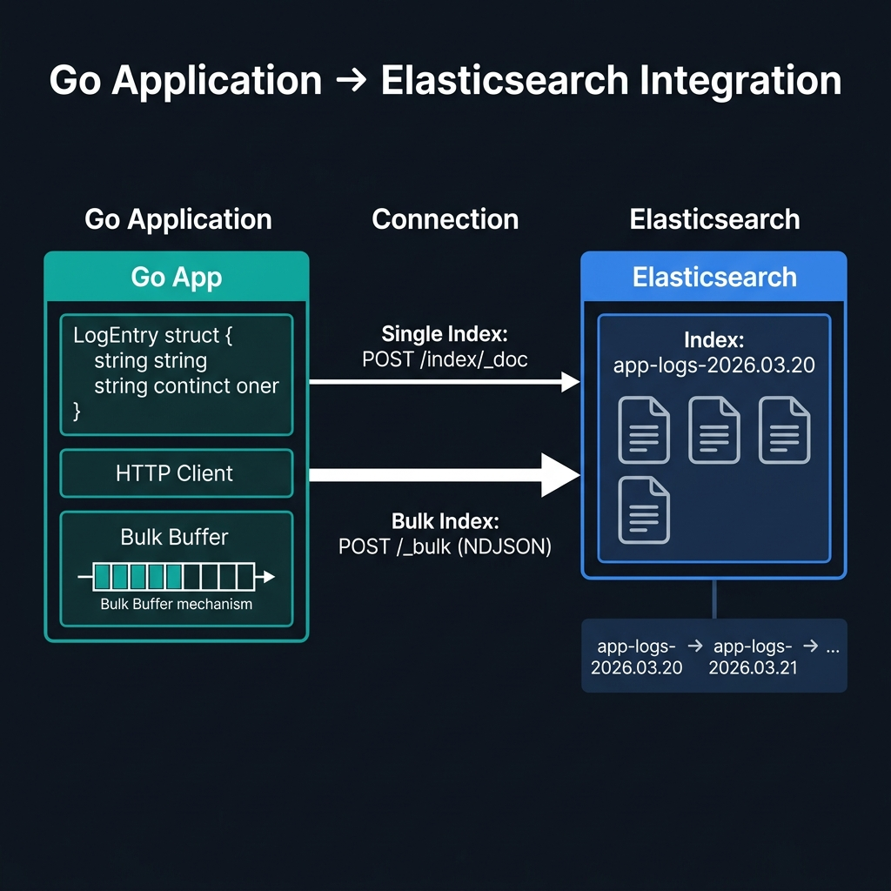
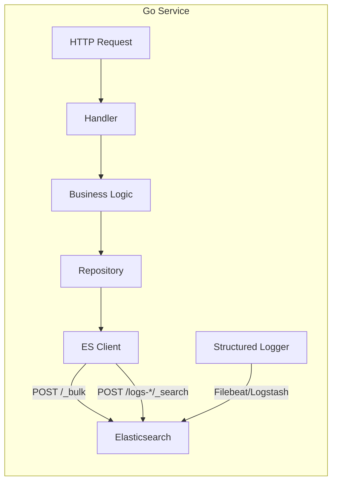
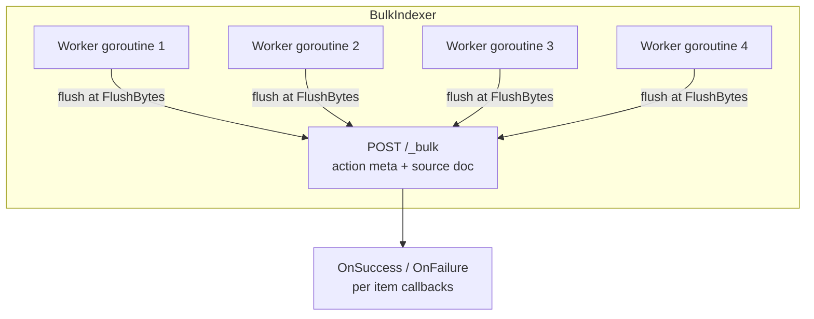

<!-- tags: elk-stack, observability -->
# 🐹 Go Client for ELK Stack

> elastic/go-elasticsearch v8, bulk indexing, typed client, context-aware queries — integrating ELK in a Go service.

📅 Created: 2026-03-24 · 🔄 Updated: 2026-04-20 · ⏱️ 16 min read

| Aspect         | Detail                                          |
| -------------- | ----------------------------------------------- |
| **Official client** | github.com/elastic/go-elasticsearch/v8     |
| **API style**  | Typed Client (v8+) + Functional options          |
| **Bulk**       | BulkIndexer with goroutine workers           |
| **Go version** | 1.21+                                           |

---

## 0. TEMPLATE

> Go code ready to copy-paste — connect, index, search, bulk.

```go
// ── Connect ──────────────────────────────────────────────────────
cfg := elasticsearch.Config{
    Addresses: []string{"http://localhost:9200"},
    Username:  "elastic",
    Password:  os.Getenv("ES_PASSWORD"),
}
es, err := elasticsearch.NewClient(cfg)

// ── Index a document ─────────────────────────────────────────────
doc := map[string]any{
    "@timestamp": time.Now().UTC(),
    "level":      "INFO",
    "service":    "order-service",
    "message":    "order created",
    "order_id":   "ORD-123",
}
data, _ := json.Marshal(doc)
res, err := es.Index("logs-app", bytes.NewReader(data),
    es.Index.WithDocumentID("ORD-123"),
    es.Index.WithRefresh("true"),
)

// ── Search ───────────────────────────────────────────────────────
query := `{"query":{"bool":{"filter":[{"term":{"service.keyword":"order-service"}},{"range":{"@timestamp":{"gte":"now-1h"}}}]}}}`
res, err = es.Search(
    es.Search.WithIndex("logs-*"),
    es.Search.WithBody(strings.NewReader(query)),
    es.Search.WithSize(100),
)

// ── Bulk indexing ─────────────────────────────────────────────────
bi, _ := esutil.NewBulkIndexer(esutil.BulkIndexerConfig{
    Client:     es,
    Index:      "logs-app",
    NumWorkers: 4,
    FlushBytes: 5e6, // 5MB
})
bi.Add(ctx, esutil.BulkIndexerItem{
    Action:     "index",
    DocumentID: doc.ID,
    Body:       bytes.NewReader(data),
    OnSuccess:  func(ctx context.Context, item esutil.BulkIndexerItem, res esutil.BulkIndexerResponseItem) {},
    OnFailure:  func(ctx context.Context, item esutil.BulkIndexerItem, res esutil.BulkIndexerResponseItem, err error) { log.Printf("ERROR: %s", err) },
})
bi.Close(ctx)
```

---

## 1. DEFINE

An application cannot benefit from ELK unless it knows how to send data in the right shape into the stack. The Go client is the junction between source application and search cluster.


### What is go-elasticsearch v8?

**go-elasticsearch** is the official Go client for Elasticsearch, providing 3 API tiers:

1. **Low-level API**: `es.Search()`, `es.Index()`, `es.Delete()` — directly calls REST endpoints
2. **Typed Client (v8.5+)**: type-safe, generated from ES spec, IDE-friendly
3. **esutil**: `BulkIndexer` for high-throughput ingestion with goroutine workers

### Connection config

| Option   | Configuration | Note |
| -------- | ------------- | ---- |
| **Single node** | `Addresses: []string{"http://localhost:9200"}` | Dev/test |
| **Multi-node** | Multiple addresses in slice | Automatic round-robin |
| **TLS** | Custom `Transport` with `tls.Config` | Production |
| **Username/Password** | `Username`, `Password` fields | Basic auth |
| **API Key** | `APIKey: base64("id:api_key")` | Recommended |
| **Cloud ID** | `CloudID` + `APIKey` | Elastic Cloud |

### Document lifecycle

**Index → Refresh (1 second default) → Searchable**

- `WithRefresh("true")`: waits for refresh to complete before returning — use in tests
- `WithRefresh("false")`: does not wait — use in production hot paths
- `WithRefresh("wait_for")`: waits for the next refresh cycle

### Bulk vs Single index

| Scenario   | Method      | Throughput |
| ---------- | ----------- | ---------- |
| Single doc, needs immediate refresh | `es.Index()` | Low |
| Batch logs / events | `esutil.BulkIndexer` | High (10-100x) |
| Continuous stream | `BulkIndexer` + `FlushInterval` | High + low latency |

### Operations

| Operation | Method | When to use |
| --------- | ------ | ----------- |
| Index/Create | `es.Index()` | Single doc insert |
| Bulk insert | `esutil.BulkIndexer` | High volume logs/events |
| Search | `es.Search()` | Query with DSL |
| Get by ID | `es.Get()` | Lookup by doc ID |
| Update | `es.Update()` | Partial doc update |
| Delete | `es.Delete()` | Delete doc |
| Scroll/Point-in-time | `es.OpenPointInTime()` | Paginate large results |

---

Those failure modes sound easy to avoid. But there is a trap: a client without retry on transient errors causes data loss, and a BulkIndexer that never flushes leaks the data buffer. That trap appears in PITFALLS.

## 2. VISUAL

Theory sounds fine on paper. The visual below pulls it into the operational context where latency, failure, and ownership stop being abstract.



### Go Service → ELK Architecture



*Figure: Go service architecture — the ES client handles both bulk indexing and search queries. A structured logger can ship via Filebeat/Logstash as an alternative.*

### BulkIndexer internals



*Figure: BulkIndexer internal architecture — 4 worker goroutines batch items and flush via POST /_bulk. Each item gets an OnSuccess or OnFailure callback.*

---

## 3. CODE

Code and config show how the decisions discussed above are enforced by real constraints, not just a nice diagram.


### Example 1: Basic — Connect + Index + Search with context

> **Goal**: Connect to ES, index a document, search with timeout context.
> **Requires**: `go get github.com/elastic/go-elasticsearch/v8`
> **Result**: Basic CRUD with proper error handling.

```go
package main

import (
	"bytes"
	"context"
	"encoding/json"
	"fmt"
	"log"
	"os"
	"time"

	"github.com/elastic/go-elasticsearch/v8"
)

type LogEvent struct {
	Timestamp time.Time `json:"@timestamp"`
	Level     string    `json:"level"`
	Service   string    `json:"service"`
	Message   string    `json:"message"`
	TraceID   string    `json:"trace_id,omitempty"`
}

func main() {
	// ✅ Initialize client once — singleton, reuse connection pool
	es, err := elasticsearch.NewClient(elasticsearch.Config{
		Addresses: []string{"http://localhost:9200"},
		Username:  "elastic",
		Password:  os.Getenv("ES_PASSWORD"),
	})
	if err != nil {
		log.Fatalf("Error creating ES client: %s", err)
	}

	// ✅ Index a log event
	event := LogEvent{
		Timestamp: time.Now().UTC(),
		Level:     "INFO",
		Service:   "order-service",
		Message:   "Order ORD-123 created",
		TraceID:   "abc-def-123",
	}
	data, _ := json.Marshal(event)

	ctx, cancel := context.WithTimeout(context.Background(), 5*time.Second)
	defer cancel()

	res, err := es.Index("logs-app",
		bytes.NewReader(data),
		es.Index.WithContext(ctx),
		es.Index.WithRefresh("false"), // ✅ Do not wait for refresh in hot path
	)
	if err != nil {
		log.Fatalf("Error indexing: %v", err)
	}
	defer res.Body.Close() // ✅ Always close body to prevent connection leak

	if res.IsError() {
		log.Printf("Error response: %s", res.Status())
		return
	}
	fmt.Printf("Indexed: %s\n", res.Status())

	// ✅ Search with DSL query
	searchCtx, searchCancel := context.WithTimeout(context.Background(), 10*time.Second)
	defer searchCancel()

	query := `{
		"query": {
			"bool": {
				"filter": [
					{"term": {"service.keyword": "order-service"}},
					{"range": {"@timestamp": {"gte": "now-1h"}}}
				]
			}
		},
		"sort": [{"@timestamp": {"order": "desc"}}]
	}`

	searchRes, err := es.Search(
		es.Search.WithContext(searchCtx),
		es.Search.WithIndex("logs-app"),
		es.Search.WithBody(strings.NewReader(query)),
		es.Search.WithSize(100),
		es.Search.WithPretty(),
	)
	if err != nil || searchRes.IsError() {
		log.Printf("Search error: %v, status: %s", err, searchRes.Status())
		return
	}
	defer searchRes.Body.Close()

	var result map[string]any
	json.NewDecoder(searchRes.Body).Decode(&result)
	hits := result["hits"].(map[string]any)["total"].(map[string]any)["value"]
	fmt.Printf("Found %v documents\n", hits)
}
```

> **Result**: Index + search with context timeout, proper body close, error check.
> **Note**: Import `strings` for `strings.NewReader`. The snippet above needs `"strings"` added to imports.

---

Basic CRUD is covered. But bulk indexing needs batching — time to batch.

### Example 2: Intermediate — BulkIndexer for high-throughput log ingestion

> **Goal**: Ingest logs at high throughput with async callbacks and graceful shutdown.
> **Requires**: go-elasticsearch/v8/esutil.
> **Result**: Production-grade bulk logger reusable in any Go service.

```go
package elk

import (
	"bytes"
	"context"
	"encoding/json"
	"fmt"
	"log"
	"sync/atomic"
	"time"

	"github.com/elastic/go-elasticsearch/v8"
	"github.com/elastic/go-elasticsearch/v8/esutil"
)

// BulkLogger sends log events to Elasticsearch in batches.
// Thread-safe — Log() can be called from multiple goroutines concurrently.
type BulkLogger struct {
	indexer esutil.BulkIndexer
	indexed uint64
	errors  uint64
}

// NewBulkLogger initializes a BulkLogger with 4 goroutine workers.
// Call Close(ctx) before service shutdown to flush pending items.
func NewBulkLogger(es *elasticsearch.Client, index string) (*BulkLogger, error) {
	bi, err := esutil.NewBulkIndexer(esutil.BulkIndexerConfig{
		Client:        es,
		Index:         index,
		NumWorkers:    4,
		FlushBytes:    5_000_000,      // ✅ 5MB per flush
		FlushInterval: 5 * time.Second, // ✅ Flush every 5s even if less than 5MB
	})
	if err != nil {
		return nil, fmt.Errorf("creating bulk indexer: %w", err)
	}
	return &BulkLogger{indexer: bi}, nil
}

// Log sends a log event asynchronously.
// Returns error if unable to add to queue (e.g., indexer already closed).
func (l *BulkLogger) Log(ctx context.Context, level, service, message string, fields map[string]any) error {
	event := map[string]any{
		"@timestamp": time.Now().UTC().Format(time.RFC3339Nano),
		"level":      level,
		"service":    service,
		"message":    message,
	}
	// ✅ Merge extra fields
	for k, v := range fields {
		event[k] = v
	}

	data, err := json.Marshal(event)
	if err != nil {
		return fmt.Errorf("marshal event: %w", err)
	}

	return l.indexer.Add(ctx, esutil.BulkIndexerItem{
		Action: "index",
		Body:   bytes.NewReader(data),
		OnSuccess: func(_ context.Context, _ esutil.BulkIndexerItem, _ esutil.BulkIndexerResponseItem) {
			atomic.AddUint64(&l.indexed, 1)
		},
		OnFailure: func(_ context.Context, item esutil.BulkIndexerItem, res esutil.BulkIndexerResponseItem, err error) {
			// ✅ Always handle OnFailure — do not lose data silently
			atomic.AddUint64(&l.errors, 1)
			if err != nil {
				log.Printf("BULK ERROR: %v", err)
			} else {
				log.Printf("BULK REJECTED: [%d] %s: %s", res.Status, res.Error.Type, res.Error.Reason)
			}
		},
	})
}

// Close flushes all pending items and closes the indexer.
// Must be called during graceful shutdown to prevent data loss.
func (l *BulkLogger) Close(ctx context.Context) error {
	if err := l.indexer.Close(ctx); err != nil {
		return fmt.Errorf("closing bulk indexer: %w", err)
	}
	stats := l.indexer.Stats()
	log.Printf("BulkLogger closed: indexed=%d, failed=%d, flushed=%d, requests=%d",
		stats.NumIndexed, stats.NumFailed, stats.NumFlushed, stats.NumRequests)
	return nil
}

// Stats returns the current indexed and error counts.
func (l *BulkLogger) Stats() (indexed, errors uint64) {
	return atomic.LoadUint64(&l.indexed), atomic.LoadUint64(&l.errors)
}
```

```go
// main.go — Using BulkLogger with graceful shutdown
package main

import (
	"context"
	"log"
	"os"
	"os/signal"
	"syscall"
	"time"

	"github.com/elastic/go-elasticsearch/v8"
	"myapp/elk"
)

func main() {
	es, err := elasticsearch.NewClient(elasticsearch.Config{
		Addresses: []string{"http://localhost:9200"},
		Username:  "elastic",
		Password:  os.Getenv("ES_PASSWORD"),
	})
	if err != nil {
		log.Fatalf("ES client: %v", err)
	}

	// ✅ Index by date for easy ILM cleanup
	today := time.Now().Format("2006.01.02")
	logger, err := elk.NewBulkLogger(es, "logs-app-"+today)
	if err != nil {
		log.Fatalf("BulkLogger: %v", err)
	}

	ctx, stop := signal.NotifyContext(context.Background(), os.Interrupt, syscall.SIGTERM)
	defer stop()

	// Simulate logging
	go func() {
		for i := 0; i < 10000; i++ {
			if err := logger.Log(ctx, "INFO", "order-service", "order processed",
				map[string]any{"order_id": i, "duration_ms": 45},
			); err != nil {
				log.Printf("Log error: %v", err)
			}
		}
	}()

	<-ctx.Done()

	// ✅ Graceful shutdown — flush pending items
	shutdownCtx, cancel := context.WithTimeout(context.Background(), 30*time.Second)
	defer cancel()
	if err := logger.Close(shutdownCtx); err != nil {
		log.Printf("Close error: %v", err)
	}
}
```

> **Result**: Thread-safe bulk logger, async callbacks, graceful shutdown flush, per-day index rotation.
> **Note**: `BulkIndexer.Add()` is non-blocking — items are sent by background workers. `Close()` must be called to ensure no data is lost on shutdown.

---

Bulk is covered. But connection pool needs tuning — time to optimize.

### Example 3: Advanced — Typed Client + Point-in-Time pagination + context propagation

> **Goal**: Type-safe search with Typed Client, paginate large results via Point-in-Time.
> **Requires**: go-elasticsearch v8.5+, typedapi packages.
> **Result**: Production query service with IDE support and safe pagination.

```go
package search

import (
	"context"
	"encoding/json"
	"fmt"
	"time"

	"github.com/elastic/go-elasticsearch/v8"
	"github.com/elastic/go-elasticsearch/v8/typedapi/core/search"
	"github.com/elastic/go-elasticsearch/v8/typedapi/types"
	"github.com/elastic/go-elasticsearch/v8/typedapi/types/enums/sortorder"
)

type LogEvent struct {
	Timestamp time.Time `json:"@timestamp"`
	Level     string    `json:"level"`
	Service   string    `json:"service"`
	Message   string    `json:"message"`
	TraceID   string    `json:"trace_id,omitempty"`
	DurationMs int64    `json:"duration_ms,omitempty"`
}

type LogSearchService struct {
	es *elasticsearch.TypedClient
}

func NewLogSearchService(es *elasticsearch.TypedClient) *LogSearchService {
	return &LogSearchService{es: es}
}

// SearchByService returns logs for a given service within a time range.
func (s *LogSearchService) SearchByService(ctx context.Context, service string, from time.Time, size int) ([]LogEvent, error) {
	res, err := s.es.Search().
		Index("logs-*").
		Request(&search.Request{
			Query: &types.Query{
				Bool: &types.BoolQuery{
					Filter: []types.Query{
						// ✅ filter context — does not affect relevance score, cached
						{Term: map[string]types.TermQuery{
							"service.keyword": {Value: service},
						}},
						{Range: map[string]types.RangeQuery{
							"@timestamp": types.DateRangeQuery{
								Gte: some.String(from.Format(time.RFC3339)),
							},
						}},
					},
				},
			},
			Size: some.Int(size),
			Sort: []types.SortCombinations{
				types.SortOptions{SortOptions: map[string]types.FieldSort{
					"@timestamp": {Order: &sortorder.Desc},
				}},
			},
		}).
		Do(ctx)
	if err != nil {
		return nil, fmt.Errorf("search logs: %w", err)
	}

	events := make([]LogEvent, 0, len(res.Hits.Hits))
	for _, hit := range res.Hits.Hits {
		var e LogEvent
		if err := json.Unmarshal(hit.Source_, &e); err != nil {
			// ✅ skip malformed docs, do not halt entire query
			continue
		}
		events = append(events, e)
	}
	return events, nil
}

// PaginateAll retrieves all matching documents via Point-in-Time.
// Use instead of scroll API (deprecated since ES 7.17+).
func (s *LogSearchService) PaginateAll(ctx context.Context, indexPattern string, pageSize int) ([]LogEvent, error) {
	// ✅ 1. Open Point-in-Time — consistent snapshot at this moment
	pitRes, err := s.es.OpenPointInTime(indexPattern).
		KeepAlive("5m").
		Do(ctx)
	if err != nil {
		return nil, fmt.Errorf("open pit: %w", err)
	}
	pitID := pitRes.Id
	defer func() {
		// ✅ Always close PIT to release resources on ES
		s.es.ClosePointInTime().Request(&closepit.Request{Id: pitID}).Do(ctx) //nolint:errcheck
	}()

	var (
		allEvents []LogEvent
		searchAfter []types.FieldValue
	)

	for {
		res, err := s.es.Search().Request(&search.Request{
			Pit: &types.PointInTimeReference{
				Id:        pitID,
				KeepAlive: some.Duration(5 * time.Minute),
			},
			Query: &types.Query{MatchAll: &types.MatchAllQuery{}},
			Size:  some.Int(pageSize),
			Sort: []types.SortCombinations{
				types.SortOptions{SortOptions: map[string]types.FieldSort{
					"@timestamp": {Order: &sortorder.Asc},
					"_shard_doc": {Order: &sortorder.Asc}, // ✅ Mandatory tiebreaker
				}},
			},
			SearchAfter: searchAfter,
		}).Do(ctx)
		if err != nil {
			return nil, fmt.Errorf("paginate search: %w", err)
		}

		if len(res.Hits.Hits) == 0 {
			break // ✅ No more data
		}

		for _, hit := range res.Hits.Hits {
			var e LogEvent
			if err := json.Unmarshal(hit.Source_, &e); err == nil {
				allEvents = append(allEvents, e)
			}
		}

		// ✅ Get sort values of the last document as cursor
		lastHit := res.Hits.Hits[len(res.Hits.Hits)-1]
		searchAfter = lastHit.Sort
	}

	return allEvents, nil
}
```

> **Result**: Type-safe queries with Typed Client, PIT pagination replacing deprecated scroll API, deferred PIT close.
> **Note**: Package `some` is a `github.com/elastic/go-elasticsearch/v8/typedapi/types/enums` helper. Typed Client generates code from ES spec — update client when upgrading ES version.

---

You have covered CRUD, bulk, and connection pool. Now comes the dangerous part: missing retry and unflushed buffer — the trap set up from the beginning.

## 4. PITFALLS

Production rarely breaks because someone does not know the concept name; it breaks because wrong assumptions and overly trusted defaults. The pitfalls below are the most expensive slips.


| #   | Mistake                                           | Root cause                                   | Fix                                                                   |
| --- | ------------------------------------------------- | -------------------------------------------- | --------------------------------------------------------------------- |
| 1   | Connection leak after many requests               | Not calling `defer res.Body.Close()`         | Always `defer res.Body.Close()` right after error check               |
| 2   | `WithRefresh("true")` in production hot path      | Waiting for ES refresh increases latency     | Use `"false"` or `"wait_for"`; only `"true"` in tests                 |
| 3   | Creating new `elasticsearch.Client` per request   | Exhausted connection pool, dial overhead     | Initialize once, inject as dependency (singleton)                     |
| 4   | BulkIndexer without `OnFailure` implementation    | Data lost silently when ES rejects documents | Always implement `OnFailure` callback with log + alert                |
| 5   | Context not passed to ES operations               | Goroutine leak when request is cancelled     | Pass `ctx` to all ES calls: `es.Search.WithContext(ctx)`              |
| 6   | Not calling `bi.Close(ctx)` on shutdown           | Pending items lost in BulkIndexer queue      | Call `Close(ctx)` in graceful shutdown handler before exit             |
| 7   | Using Scroll API for large pagination             | Scroll deprecated since ES 7.17+            | Use Point-in-Time + search_after                                      |

---

You have covered Go Client and the traps. The resources below help go deeper.

## 5. REF

- https://github.com/elastic/go-elasticsearch
- https://www.elastic.co/guide/en/elasticsearch/client/go-api/current/index.html
- https://www.elastic.co/guide/en/elasticsearch/client/go-api/current/getting-started-go.html
- https://pkg.go.dev/github.com/elastic/go-elasticsearch/v8

---

## 6. RECOMMEND

After this article, read the topic closest to your current pressure so the production mental model does not fragment.


| Technique | Use case | Note |
| --------- | -------- | ---- |
| **Typed Client (v8.5+)** | Production code, IDE support | Type-safe, avoids hardcoded JSON strings |
| **BulkIndexer** | Log ingestion, event streaming | 10-100x throughput vs single index |
| **zerolog + Filebeat** | Structured logging → ELK | Separates concerns, no go-elasticsearch needed |
| **OpenTelemetry → ES APM** | Distributed tracing | Use OTel SDK, ES as backend |
| **Point-in-Time** | Paginate > 10K documents | Replaces deprecated scroll API |
| **API Key auth** | Service-to-ES auth | Preferred over username/password |

---

## 🃏 Quick Reference

| #   | Pattern | Command/Rule |
| --- | ------- | ------------ |
| 1   | Install | `go get github.com/elastic/go-elasticsearch/v8` |
| 2   | Connect with API key | `APIKey: base64("id:key")` in Config |
| 3   | Index doc | `es.Index(index, body, es.Index.WithContext(ctx))` |
| 4   | Search | `es.Search(es.Search.WithIndex(...), es.Search.WithBody(...))` |
| 5   | Bulk index | `esutil.NewBulkIndexer(...)` + `bi.Add(ctx, item)` |
| 6   | Parse response | `json.NewDecoder(res.Body).Decode(&result)` |
| 7   | Check error | `if err != nil \|\| res.IsError() { ... }` |
| 8   | Typed client | `elasticsearch.NewTypedClient(cfg)` |

---

## 🔍 Debug Checklist

| # | Symptom | Root cause | Diagnostic command |
|---|---------|------------|--------------------|
| 1 | `no Elasticsearch node available` | All nodes down or unreachable | Check `Addresses` config + `curl localhost:9200` |
| 2 | `res.IsError() == true` but no log | Not checking `res.IsError()` after call | Always check `res.IsError()` and read body error response |
| 3 | HTTP 429 Too Many Requests | Rate limit or ES cluster overloaded | Implement retry with exponential backoff |
| 4 | Connection pool exhausted | Creating new ES client per request | Use singleton ES client injected via DI |
| 5 | Bulk partial failure without logs | `OnFailure` callback not implemented | Check `stats.NumFailed` after `bi.Close()` |
| 6 | Search unexpectedly slow | Query uses `must` instead of `filter` for non-scoring | Use `filter` context — cached, no score calculation |
| 7 | Context deadline exceeded | Timeout too short or ES cluster slow | Increase context timeout; check `GET /_cluster/health` |

---

## 🎯 Interview Angle

**Related system design / technical questions:**
- *"Why use BulkIndexer instead of indexing each document individually?"*
- *"When a Go service needs both writing logs and querying ES — how would you design it?"*
- *"How to handle ES downtime in a Go service without losing data?"*

**Key talking points interviewers expect:**

| Topic | Talking point |
|-------|---------------|
| BulkIndexer | Batch + async, 10-100x throughput, connection reuse, callback-based error handling |
| Singleton client | Connection pool, HTTP/2 multiplexing, avoids dial overhead per request |
| Context propagation | Cancellation, timeouts, trace ID forwarding through all ES operations |
| Graceful shutdown | `bi.Close(ctx)` to flush pending items before service stops |
| Error handling | `res.IsError()` + parse error body, log OnFailure with full context |
| Decoupling | Structured logging → Filebeat → ES instead of direct ES write (separation of concerns) |

**Common follow-up questions:**
- *"If the ES cluster goes down, is the Go service affected?"* → Use Filebeat/Logstash as a buffer; BulkIndexer has built-in retry but needs an external persistent queue to guarantee zero data loss
- *"Typed client vs low-level API — when to use which?"* → Typed = production code with IDE support and compile-time safety; Low-level = dynamic queries, quick scripts, or ES features not yet available in the typed API

---

**Links**: [← Docker Compose Setup](./02-setup-docker-compose.md) | [→ Elasticsearch Core Concepts](../elasticsearch/01-core-concepts.md)
