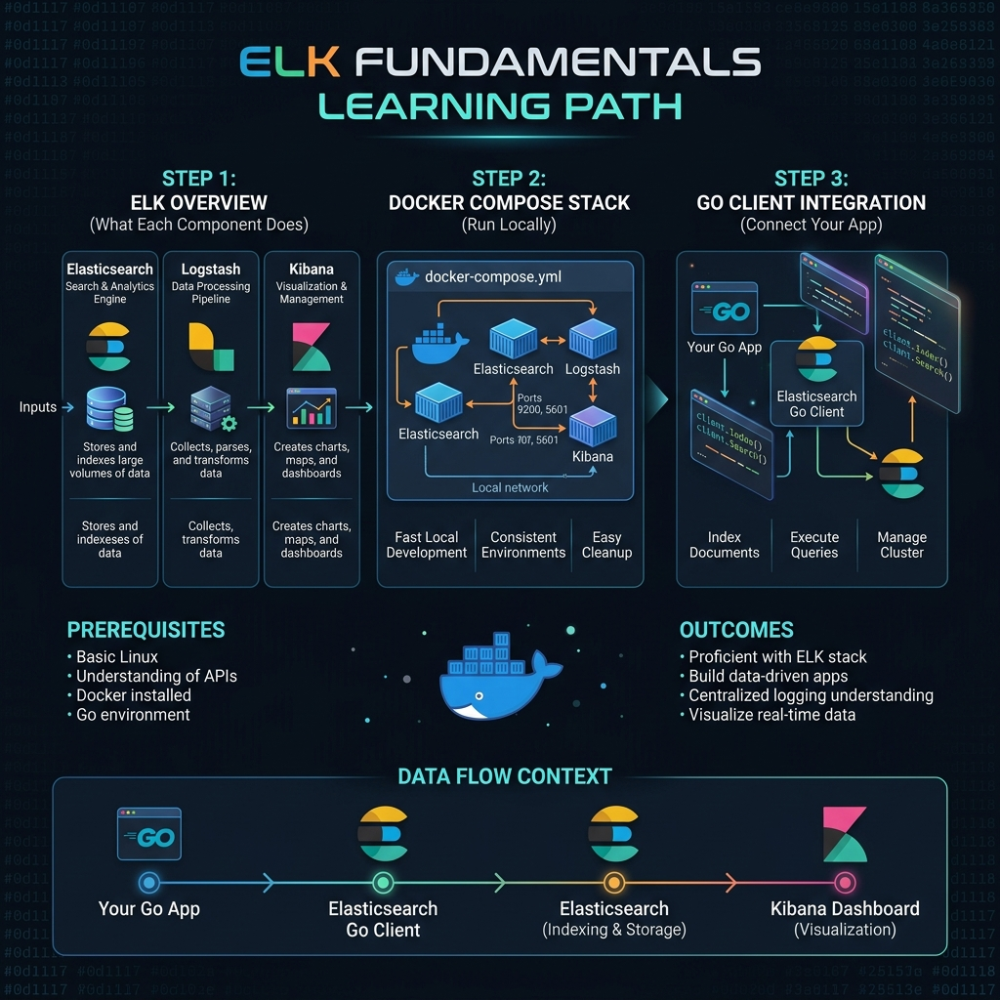
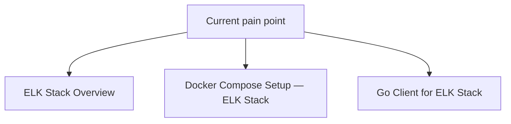
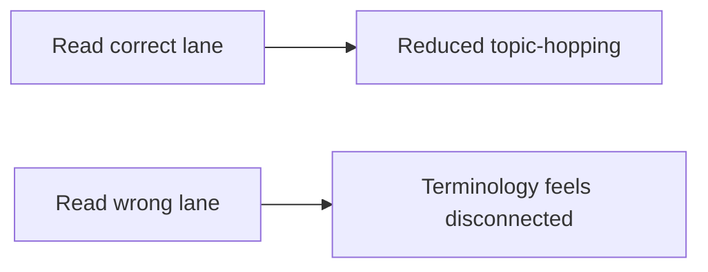

<!-- tags: overview -->
# ELK Fundamentals

> Foundation lane for ELK overview, setup, and connecting applications to the stack.

| Aspect | Detail |
| --- | --- |
| **Concept** | Navigation hub for `ELK Fundamentals` |
| **Audience** | Engineers new to ELK, SREs needing a fast onramp |
| **Primary style** | Concept-First router |
| **Entry point** | Open when you need to lock the foundational mental model of the stack before diving into Elasticsearch or Logstash. |

📅 Updated: 2026-04-20 · ⏱️ 6 min read

---

## 1. DEFINE

`ELK Fundamentals` appears right when observability data stops being a few manual log lines and becomes a pipeline with real operational cost.

ELK looks like three or four tools glued together, but its value only emerges when you understand which part of the log pipeline each component carries. The Fundamentals lane exists to lock that picture down.

This hub does not replace each detail article. It exists to help readers open the right lane before getting lost in tool-specific syntax or diagrams. Reading in the right order removes the feeling of "knowing many keywords but still unable to route a real problem."

### Signals & Boundaries

- Open this hub when you know the issue lies within `ELK Fundamentals` but are unsure which article to read first.
- Use the coverage map to route by pain point instead of file order.
- Return to this hub after each article to choose the next step with intent.

### Coverage Map

| Entry | Role |
| --- | --- |
| [ELK Stack Overview](01-elk-overview.md) | Entry point for the `ELK Stack Overview` lane |
| [Docker Compose Setup — ELK Stack](02-setup-docker-compose.md) | Entry point for the `Docker Compose Setup — ELK Stack` lane |
| [Go Client for ELK Stack](03-go-client.md) | Entry point for the `Go Client for ELK Stack` lane |

---

## 2. VISUAL

The definition locked the hub's scope. The visual below helps route quickly by lane instead of scrolling a dry link list.





*Figure: This hub works as a router, not a catalog to browse through.*



*Figure: The real value of a router-style README is keeping readers on track from the start.*

---

## 3. CODE

The diagram showed the routing rhythm. The artifact below turns the hub into a short worksheet so teams or learners pick the right entry on their own.

### Problem 1: Basic — Route lane before reading deep

> **Goal**: Prevent learning or review from sliding into "any article will do."
> **Approach**: Choose lane by current pain point.
> **Example**: Pick the right cluster to read within `ELK Fundamentals`.
> **Complexity**: Basic

```yaml
router:
  module: ELK Fundamentals
  rule: "choose lane by pain point, not by which name sounds familiar"
  suggested_path:
  - 01-elk-overview.md
  - 02-setup-docker-compose.md
  - 03-go-client.md
```

This artifact does not solve the problem for the reader; it only cuts wrong lanes before time is burned on articles that do not serve the actual goal.

---

## 4. PITFALLS

When a hub/router is misused, readers can still read individual articles but the overall understanding becomes fragmented.

| # | Severity | Mistake | Consequence | Fix |
| --- | --- | --- | --- | --- |
| 1 | 🔴 Fatal | Reading by file order without routing by pain point | Accumulates terminology but does not solve the right problem | Use coverage map before opening a detail article |
| 2 | 🟡 Common | Treating README as a pure link catalog | Loses the hub's navigation role | Always ask "which lane is my pain in?" |
| 3 | 🔵 Minor | Not returning to hub after finishing an article | Jumps to adjacent article by gut feeling | Return to README to pick the next step |

---

## 5. REF

| Resource | Type | Link | Note |
| --- | --- | --- | --- |
| ELK Stack Overview | Internal | [ELK Stack Overview](01-elk-overview.md) | Directly related entry point |
| Docker Compose Setup — ELK Stack | Internal | [Docker Compose Setup — ELK Stack](02-setup-docker-compose.md) | Directly related entry point |
| Go Client for ELK Stack | Internal | [Go Client for ELK Stack](03-go-client.md) | Directly related entry point |

---

## 6. RECOMMEND

Once you know which lane you stand in, the next step is opening the first article of that lane instead of wandering into another topic.

| Next step | When | Reason | File/Link |
| --- | --- | --- | --- |
| ELK Stack Overview | When pain point matches this lane | Continue the right cluster instead of reading loosely | [ELK Stack Overview](01-elk-overview.md) |
| Docker Compose Setup — ELK Stack | When pain point matches this lane | Continue the right cluster instead of reading loosely | [Docker Compose Setup — ELK Stack](02-setup-docker-compose.md) |
| Go Client for ELK Stack | When pain point matches this lane | Continue the right cluster instead of reading loosely | [Go Client for ELK Stack](03-go-client.md) |
