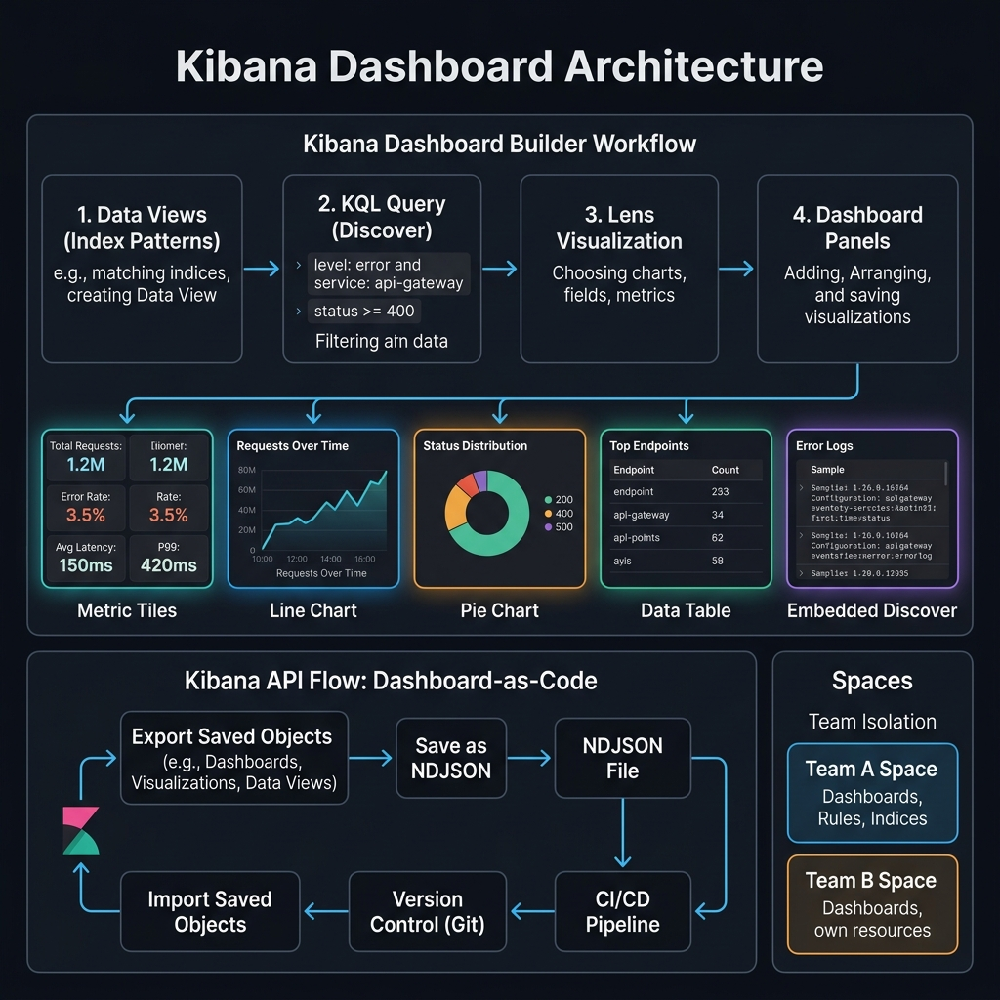

<!-- tags: elk-stack, observability, kibana -->
# 📊 Kibana Dashboard & KQL

> Kibana: Discover, Visualizations, Dashboards, and Kibana Query Language

📅 Created: 2026-03-23 · 🔄 Updated: 2026-04-20 · ⏱️ 10 min read

| Aspect        | Detail                                       |
| ------------- | -------------------------------------------- |
| **URL**       | `http://localhost:5601`                      |
| **Query**     | KQL (Kibana Query Language) or Lucene         |
| **Viz types** | Line, Bar, Pie, Metric, Map, Table, Heatmap  |
| **Backend**   | Node.js + React, connects to ES via REST API |

---

## 0. TEMPLATE

> KQL quick queries.

```text
# ── KQL Basics ──────────────────────────────────────────────────
level: error                              # Exact match keyword
message: "connection timeout"             # Full-text match
status >= 400 and status < 500            # Range
service: "api-gateway" and level: error   # AND
level: error or level: fatal              # OR
not level: debug                          # NOT
host.name: web-*                          # Wildcard
response_time > 1000                      # Number compare
```

---

## 1. DEFINE

A good dashboard is not just good-looking; it must help the on-call engineer see the right signal at the right time. That is where Kibana delivers value.


### Kibana Core Features

| Feature       | Description                                | When to use                  |
| ------------- | ------------------------------------------ | ---------------------------- |
| **Discover**  | Explore raw logs, search, filter           | Debugging, investigation     |
| **Dashboard** | Multiple visualizations on 1 page          | Monitoring, reporting        |
| **Visualize** | Create charts, graphs, maps                | Data analysis                |
| **Canvas**    | Pixel-perfect custom presentations         | Reports, TV displays         |
| **Maps**      | Geospatial data visualization              | GeoIP analysis               |
| **Lens**      | Drag-and-drop visualization builder        | Quick analysis (recommended) |
| **Alerting**  | Threshold-based alerts                     | Incident notification        |
| **Dev Tools** | ES Console, Grok Debugger, Search Profiler | Development, debugging       |

### KQL vs Lucene

| Aspect         | KQL                | Lucene               |
| -------------- | ------------------ | -------------------- |
| **Syntax**     | Human-readable     | Technical            |
| **Wildcard**   | `host.name: web-*` | `host.name: web-*`   |
| **Range**      | `status >= 400`    | `status:[400 TO *]`  |
| **Nested**     | ✅ Native support  | ❌ Manual            |
| **AND/OR/NOT** | `and`, `or`, `not` | `AND`, `OR`, `NOT`   |
| **Default**    | ✅ Kibana default  | Must enable manually |

### Visualization Types

| Type           | Use case                | Data needed     |
| -------------- | ----------------------- | --------------- |
| **Line chart** | Trend over time         | date + metric   |
| **Bar chart**  | Category comparison     | keyword + count |
| **Pie chart**  | Distribution/proportion | keyword + count |
| **Metric**     | Single number (KPI)     | count/avg/sum   |
| **Data Table** | Detailed breakdown      | any fields      |
| **Heatmap**    | Density / correlation   | 2 dimensions    |
| **Map**        | Geographic distribution | geo_point field |
| **Gauge**      | Progress / threshold    | single metric   |
| **TSVB**       | Advanced time-series    | date + metrics  |

---

Those failure modes sound clear. But there is a trap: "No results found" because of a wrong time range = false alarm, and wrong index pattern = empty dashboard. That trap appears in PITFALLS.

## 2. VISUAL

Concepts have names now. In the diagram, the more important part reveals itself: how requests, workloads, or signals traverse these layers.



### Dashboard Layout Example

```text
┌─────────────────────────────────────────────────────────────┐
│                    API Monitoring Dashboard                   │
├─────────────────────────────────────────────────────────────┤
│                                                              │
│  ┌──────────┐  ┌──────────┐  ┌──────────┐  ┌──────────┐    │
│  │ Total    │  │ Error    │  │ Avg      │  │ P99      │    │
│  │ Requests │  │ Rate     │  │ Latency  │  │ Latency  │    │
│  │  24,521  │  │  2.3%    │  │  145ms   │  │  1.2s    │    │
│  └──────────┘  └──────────┘  └──────────┘  └──────────┘    │
│                                                              │
│  ┌─────────────────────────────────────────────────────┐    │
│  │         Requests Over Time (Line Chart)              │    │
│  │   ╭─╮    ╭──╮                                       │    │
│  │ ──╯ ╰────╯  ╰──────────                             │    │
│  │ 08:00  10:00  12:00  14:00  16:00  18:00            │    │
│  └─────────────────────────────────────────────────────┘    │
│                                                              │
│  ┌────────────────────┐  ┌────────────────────────────┐    │
│  │ Status Distribution│  │ Top 10 Endpoints           │    │
│  │    (Pie Chart)     │  │    (Table)                  │    │
│  │  ┌────┐            │  │ /api/users    5,234         │    │
│  │  │2xx │ 85%        │  │ /api/orders   3,102         │    │
│  │  │4xx │ 12%        │  │ /api/auth     2,891         │    │
│  │  │5xx │  3%        │  │ /api/search   1,567         │    │
│  │  └────┘            │  │ ...                         │    │
│  └────────────────────┘  └────────────────────────────┘    │
│                                                              │
│  ┌─────────────────────────────────────────────────────┐    │
│  │         Error Logs (Discover embed)                   │    │
│  │ timestamp  level  service    message                  │    │
│  │ 14:23:01   ERROR  payment    Gateway timeout          │    │
│  │ 14:22:58   ERROR  auth       Invalid token            │    │
│  └─────────────────────────────────────────────────────┘    │
└─────────────────────────────────────────────────────────────┘
```

---

## 3. CODE

The diagrams have shown the main path. The code/manifests/commands below pull it down to the artifact level that on-call or reviewers actually use.


### Example 1: Basic — KQL Queries

> **Goal**: Master KQL query syntax.
> **Requires**: Kibana + ES with data.
> **Result**: Efficient log searching.

```text
# ═══════════════════════════════════════════════════════════════
# ✅ Exact match (keyword fields)
# ═══════════════════════════════════════════════════════════════
level: error
service: "api-gateway"
status: 404
host.name: "web-server-01"

# ═══════════════════════════════════════════════════════════════
# ✅ Full-text search (text fields)
# ═══════════════════════════════════════════════════════════════
message: "connection refused"             # Tokens: connection AND refused
message: connection refused               # Same as above (quotes optional)
message: "connection timeout"             # Exact phrase

# ═══════════════════════════════════════════════════════════════
# ✅ Logical operators
# ═══════════════════════════════════════════════════════════════
level: error and service: payment         # AND
level: error or level: fatal              # OR
not level: debug                          # NOT
(level: error or level: warn) and service: api  # Grouping

# ═══════════════════════════════════════════════════════════════
# ✅ Comparison operators (numeric/date fields)
# ═══════════════════════════════════════════════════════════════
status >= 400                             # >= 400
status < 500                              # < 500
status >= 400 and status < 500            # 4xx only
response_time > 1000                      # > 1 second
bytes > 1048576                           # > 1MB

# ═══════════════════════════════════════════════════════════════
# ✅ Wildcards
# ═══════════════════════════════════════════════════════════════
host.name: web-*                          # Starts with web-
service: *gateway*                        # Contains gateway
url.path: /api/v2/*                       # API v2 endpoints

# ═══════════════════════════════════════════════════════════════
# ✅ Existence check
# ═══════════════════════════════════════════════════════════════
error: *                                  # Field exists
not trace_id: *                           # Field NOT exists

# ═══════════════════════════════════════════════════════════════
# ✅ Nested objects
# ═══════════════════════════════════════════════════════════════
geo.country_name: "Vietnam"
ua.os.name: "iOS"
```

> **Result**: Comprehensive KQL query patterns.
> **Note**: KQL only works in Kibana Discover/Dashboard — the ES API uses Query DSL.

---

Discover is covered. But visualization needs Lens — time to chart.

### Example 2: Intermediate — Dashboard via Saved Objects API

> **Goal**: Create dashboard programmatically (Infrastructure as Code).
> **Requires**: Kibana API access.
> **Result**: Reproducible dashboards.

```bash
# ── 1. Create Data View (Index Pattern) ─────────────────────────
curl -X POST "localhost:5601/api/data_views/data_view" \
  -H 'kbn-xsrf: true' \
  -H 'Content-Type: application/json' -d '{
  "data_view": {
    "title": "logs-*",
    "timeFieldName": "@timestamp",
    "name": "Application Logs"
  }
}'

# ── 2. Export existing dashboard (backup) ───────────────────────
curl -s "localhost:5601/api/saved_objects/_export" \
  -H 'kbn-xsrf: true' \
  -H 'Content-Type: application/json' -d '{
  "type": "dashboard",
  "includeReferencesDeep": true
}' > dashboard-backup.ndjson

# ── 3. Import dashboard ────────────────────────────────────────
curl -X POST "localhost:5601/api/saved_objects/_import?overwrite=true" \
  -H 'kbn-xsrf: true' \
  --form file=@dashboard-backup.ndjson

# ── 4. List saved objects ──────────────────────────────────────
curl -s "localhost:5601/api/saved_objects/_find?type=dashboard&per_page=100" \
  -H 'kbn-xsrf: true' | jq '.saved_objects[] | {id, title: .attributes.title}'
```

```bash
# ── Go: Kibana API Client ──────────────────────────────────────
# Create alert rule via API
curl -X POST "localhost:5601/api/alerting/rule" \
  -H 'kbn-xsrf: true' \
  -H 'Content-Type: application/json' -d '{
  "name": "High Error Rate",
  "rule_type_id": ".es-query",
  "consumer": "alerts",
  "schedule": { "interval": "1m" },
  "params": {
    "searchType": "esQuery",
    "esQuery": "{\"query\":{\"bool\":{\"filter\":[{\"term\":{\"level\":\"error\"}}]}}}",
    "index": ["logs-*"],
    "timeField": "@timestamp",
    "timeWindowSize": 5,
    "timeWindowUnit": "m",
    "threshold": [10],
    "thresholdComparator": ">"
  },
  "actions": [],
  "tags": ["production", "error-rate"]
}'
```

> **Result**: Programmatic dashboard management + alerting via API.
> **Note**: Always add `kbn-xsrf: true` header for Kibana API calls.

---

You have covered discover, visualization, and dashboard. Now comes the dangerous part: wrong time range and index pattern mismatch — the trap set up from the beginning.

## 4. PITFALLS

Mistakes rarely come from syntax; they come from operational boundary assumptions and forgotten failure modes. The table below collects exactly those errors.


| #   | Mistake                               | Fix                                                   |
| --- | ------------------------------------- | ----------------------------------------------------- |
| 1   | "No data" in Discover                 | Check Data View (Index Pattern) matches the index name |
| 2   | Time picker range too narrow          | Widen time range — data may be outside the current range |
| 3   | Visualization not showing keyword     | Field must be `keyword` type, not `text`              |
| 4   | Dashboard loads slowly                | Reduce time range, limit panels, use filters          |
| 5   | KQL syntax error                      | Check quotes, operators (`and` not `&&`)              |
| 6   | Alert not triggering                  | Check rule condition, time window, and ES data        |

---

You have covered Kibana Dashboard and the traps. The resources below help go deeper.

## 5. REF

| Resource             | Link                                                                                                                   |
| -------------------- | ---------------------------------------------------------------------------------------------------------------------- |
| Kibana User Guide    | [elastic.co/guide/en/kibana/current](https://www.elastic.co/guide/en/kibana/current/index.html)                        |
| KQL Reference        | [elastic.co/guide/en/kibana/current/kuery-query.html](https://www.elastic.co/guide/en/kibana/current/kuery-query.html) |
| Kibana API Reference | [elastic.co/guide/en/kibana/current/api.html](https://www.elastic.co/guide/en/kibana/current/api.html)                 |
| Lens Visualization   | [elastic.co/guide/en/kibana/current/lens.html](https://www.elastic.co/guide/en/kibana/current/lens.html)               |

---

## 6. RECOMMEND

The resources below connect directly to the pressures that typically appear right after you apply these concepts to a real system.


| Extension            | When                         | Reason                       |
| -------------------- | ---------------------------- | ---------------------------- |
| **Canvas**           | Custom reports / TV displays | Pixel-perfect presentations  |
| **Kibana Spaces**    | Multi-team                   | Isolate dashboards per team  |
| **Reporting**        | Scheduled PDF/PNG exports    | Automated reporting          |
| **Machine Learning** | Anomaly detection            | Auto-detect unusual patterns |
| **Grafana + ES**     | Already use Grafana          | ES as Grafana datasource     |

---

## 🃏 Quick Reference

| #   | KQL Pattern         | Description                   |
| --- | ------------------- | ----------------------------- |
| 1   | `field: value`      | Exact match                   |
| 2   | `field: "phrase"`   | Phrase match                  |
| 3   | `field >= 100`      | Range compare                 |
| 4   | `q1 and q2`         | AND                           |
| 5   | `q1 or q2`          | OR                            |
| 6   | `not field: val`    | NOT                           |
| 7   | `field: prefix*`    | Wildcard                      |
| 8   | `field: *`          | Field exists                  |
| 9   | `(q1 or q2) and q3` | Grouping                      |
| 10  | Time picker         | Always check time range first |

---

## 🔍 Debug Checklist

| # | Symptom | Root cause | Diagnostic command |
|---|---------|------------|-------------------|
| 1 | "No results found" in Discover | Time range wrong or index pattern incorrect | Check time filter + `GET /index/_count` |
| 2 | Data view (index pattern) missing fields | Index has no data or mapping not refreshed | "Refresh field list" in Data View settings |
| 3 | Dashboard visualization empty | Filter/query excludes all data | Temporarily clear filters, test with KQL `*` |
| 4 | Kibana "Index pattern [...] doesn't exist" | Index deleted or renamed | Recreate data view or use wildcard `logs-*` |
| 5 | Saved search not loading | Kibana space changed | Check Space permissions |
| 6 | Slow dashboard load | Too many visualizations with heavy aggregations | Split dashboard + use `runtime_mappings` for computed fields |
| 7 | KQL syntax error | Used Lucene syntax in KQL mode | Switch to Lucene mode or fix KQL (`field: value` does not need quotes for keyword) |

---

## 🎯 Interview Angle

**Related system design / technical questions:**
- *"What is the difference between KQL, Lucene, and Elasticsearch Query DSL — when to use which?"*
- *"How does Lens differ from TSVB and Vega? What are the trade-offs in choosing a visualization tool?"*
- *"How are Kibana Spaces used in multi-team environments?"*

**Key talking points interviewers expect:**

| Topic | Talking point |
|-------|---------------|
| KQL vs Lucene | KQL = human-readable, native nested support, only used in Kibana UI; Lucene = lower-level, used in ES API and Kibana toggle |
| KQL vs Query DSL | Query DSL = full power of ES (scoring, aggregations, scripts); KQL is just a search UI convenience layer |
| Lens | Recommended: drag-and-drop, auto-selects appropriate aggregation, easy export to ES|QL |
| TSVB | Powerful for complex time-series (pipeline aggregations), but more complex to configure than Lens |
| Vega | Fully custom visualizations (any chart type), but requires writing Vega/Vega-Lite JSON |
| Kibana Spaces | Isolate dashboards/data views per team; role-based access; useful for multi-tenant setups |

**Common follow-up questions:**
- *"Dashboard-as-code in Kibana?"* → Export as `.ndjson` (saved objects) → commit to Git → import via API (`/api/saved_objects/_import`) to reproduce environments
- *"How to optimize performance for dashboards with many panels?"* → Reduce time range, use `sampler` aggregation, enable dashboard-level time sync, split into smaller dashboards
- *"How does Kibana Alerting integrate with Logstash?"* → Kibana Rules query ES directly → when threshold breached → trigger action (email, webhook, PagerDuty)

---

**Links**: [← Grok & Filters](../logstash/02-grok-filters.md) · [→ Filebeat & Metricbeat](./02-filebeat-metricbeat.md)

